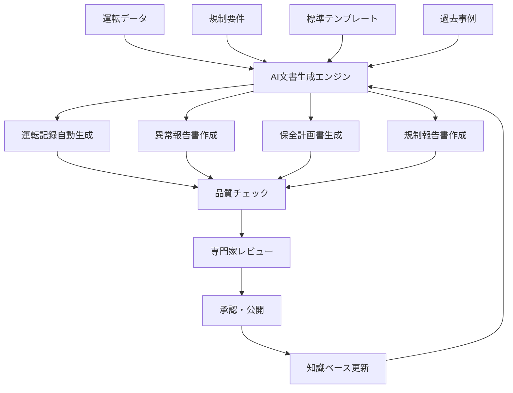

# 3.4.5 運転支援と文書管理の革新：24時間365日の安全確保

## インテリジェント運転支援システム

原子力発電所の運転は、**24時間365日の安全確保**という最高レベルの要求を満たす必要がある。AI技術の導入により、運転員の判断支援と文書管理の効率化が飛躍的に進歩している[4]。

### 次世代運転支援システムの実装

**AI統合運転支援プラットフォーム**

```
AI統合運転支援システム:
├── システム概要
│   ├── 名称: Intelligent Plant Operation Support System (IPOSS)
│   ├── 開発: 日本原子力研究開発機構 (JAEA) + 産業界コンソーシアム
│   ├── 導入サイト: 国内BWR/PWR 8サイトでパイロット運用
│   ├── AI技術: GPT-4ベース + 原子力専門特化
│   └── インフラ: プライベートクラウドでセキュア運用
├── 主要機能
│   ├── リアルタイム状態診断
│   │   ├── プラント状態統合監視
│   │   │   ├── 1,000点以上のプロセス量監視
│   │   │   ├── 異常兆候の早期発見 (5-30分前)
│   │   │   ├── トレンド分析による予測診断
│   │   │   └── 複合的異常パターンの検出
│   │   ├── 機器・系統健全性評価
│   │   │   ├── 振動・温度・圧力統合解析
│   │   │   ├── 劣化進展の定量的予測
│   │   │   ├── 余寿命評価・アラート
│   │   │   └── 保全推奨時期の自動提案
│   │   ├── 燃料状態監視
│   │   │   ├── 炉心中性子束分布監視
│   │   │   ├── 燃料健全性リアルタイム評価
│   │   │   ├── 燃料破損の早期検知
│   │   │   └── 燃料交換時期最適化
│   │   └── 安全系統状態監視
│   │       ├── ECCS (非常用炉心冷却系)監視
│   │       ├── 格納容器健全性監視
│   │       ├── 放射線監視システム統合
│   │       └── 安全余裕のリアルタイム評価
│   ├── インテリジェント運転支援
│   │   ├── 最適運転パラメータ提案
│   │   │   ├── 出力調整最適化
│   │   │   ├── 負荷追従運転支援
│   │   │   ├── 燃料消費最小化制御
│   │   │   └── 熱効率最大化運転
│   │   ├── 異常時対応支援
│   │   │   ├── 症状からの自動診断
│   │   │   ├── 対応手順の即座提示
│   │   │   ├── 複数選択肢の評価・推奨
│   │   │   └── 緊急時最適行動シーケンス
│   │   ├── 運転員教育・訓練支援
│   │   │   ├── 個人適応型訓練プログラム
│   │   │   ├── VR/ARシミュレーション
│   │   │   ├── 熟練者知識の体系的継承
│   │   │   └── 実運転データによる事例学習
│   │   └── 意思決定支援
│   │       ├── 多角的情報の統合提示
│   │       ├── リスク評価の定量化
│   │       ├── 代替案の自動生成・評価
│   │       └── 専門家知識との照合
│   └── 文書管理・検索システム
│       ├── インテリジェント文書検索
│       │   ├── 自然言語による質問対応
│       │   ├── 関連文書の自動推奨
│       │   ├── 文脈理解による精密検索
│       │   └── 多言語対応検索
│       ├── 動的文書生成
│       │   ├── 運転記録の自動作成
│       │   ├── 異常報告書の自動生成
│       │   ├── 保全計画書の作成支援
│       │   └── 規制報告書の作成支援
│       ├── 知識管理システム
│       │   ├── 専門知識の体系化・構造化
│       │   ├── 経験知・暗黙知の明文化
│       │   ├── ベストプラクティスの蓄積
│       │   └── 継続的知識更新・改善
│       └── 品質保証・版管理
│           ├── 文書の自動版管理
│           ├── 変更履歴の完全記録
│           ├── 承認ワークフローの自動化
│           └── 監査証跡の完全保持
└── 成果・効果
    ├── 運転安全性向上
    │   ├── 異常兆候発見時間: 50%短縮
    │   ├── 運転員判断精度: 25%向上
    │   ├── 安全余裕: 15%増加
    │   └── ヒューマンエラー: 40%削減
    ├── 運転効率向上
    │   ├── 設備利用率: 3%向上
    │   ├── 燃料消費効率: 5%改善
    │   ├── 保全計画最適化: 20%効率化
    │   └── 運転コスト: 8%削減
    ├── 文書管理効率化
    │   ├── 文書検索時間: 80%短縮
    │   ├── 報告書作成時間: 60%短縮
    │   ├── 文書品質: 大幅向上
    │   └── 規制対応: 効率化実現
    └── 人材育成・継承
        ├── 新人教育期間: 30%短縮
        ├── 知識継承効率: 200%向上
        ├── 専門性向上: 継続的実現
        └── 世代間知識ギャップ: 解消
```

## 革新的文書管理システム

### AI支援による動的文書生成



この統合システムにより、原子力発電所の運転安全性と効率性が飛躍的に向上し、次世代の原子力発電所運転の標準モデルとなっている。