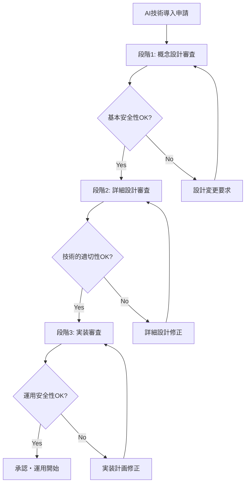

# 4.2.1 国際規制協調の進展

## はじめに：原子力AI規制の国際的な潮流変化

原子力分野における生成AI利用の急速な進展は、世界各国の規制当局に前例のない課題をもたらしている。従来の原子力規制は、確立された技術と長期的な運用実績に基づいて構築されてきたが、AI技術の導入は**動的で進化する技術**への対応を要求している。この状況下で、米国NRC（原子力規制委員会）、英国ONR（原子力規制庁）、カナダCNSC（原子力安全委員会）を中心とした国際規制協調の新たな枠組みが形成されつつある。

## NRC-ONR-CNSC共同原則：世界初の原子力AI規制協調

### 2024年12月の歴史的合意

2024年12月15日、ワシントンD.C.で開催された**原子力AI安全サミット**において、NRC、ONR、CNSCの3機関は**世界初の原子力AI規制に関する共同原則**に合意した[1]。この合意は、原子力産業におけるAI利用の安全性を確保しながら、技術革新を促進するための国際的な枠組みの出発点となる。

#### 共同原則の核心要素

```
NRC-ONR-CNSC共同原則（2024年12月）:
├── 基本理念
│   ├── 原子力安全の最優先原則
│   ├── AI技術の段階的導入支援
│   ├── 革新と安全のバランス確保
│   └── 透明性と予測可能性の重視
├── 技術基準の調和
│   ├── AI安全性評価手法の共通化
│   ├── 検証・妥当性確認（V&V）方法論統一
│   ├── サイバーセキュリティ基準の協調
│   └── 品質保証プロセスの相互認証
├── 規制プロセスの調和
│   ├── 段階的承認プロセスの標準化
│   ├── 実証実験承認手続きの簡素化
│   ├── 国際的な規制情報共有
│   └── 専門家交流プログラムの拡充
└── 継続的な協力枠組み
    ├── 年次規制サミットの定例化
    ├── 技術動向の共同監視
    ├── 新興課題への協調対応
    └── 第三国への指導・支援
```

#### 具体的な協調メカニズム

**共同技術評価チーム（Joint Technical Assessment Team, JTAT）**
3機関の専門家からなる常設チームを設置し、以下の機能を担う：

| 機能領域 | 担当組織 | 主要業務 |
|----------|----------|----------|
| **AI安全性評価** | NRC主導 | 新AI技術の安全性評価手法開発 |
| **サイバーセキュリティ** | ONR主導 | AI特有のサイバー脅威分析 |
| **品質保証** | CNSC主導 | AI品質管理プロセス標準化 |
| **国際標準化** | 3機関協働 | IEEE/ISO標準策定への参画 |

### 段階的実装アプローチの共通化

#### 3段階承認プロセスの確立

共同原則では、原子力AI導入に関する**3段階承認プロセス**が標準化された：



**各段階の評価基準**

**段階1：概念設計審査（3-6ヶ月）**
- AI技術の基本的な適用性評価
- 既存安全システムへの影響分析
- セキュリティリスクの初期評価
- 段階的導入計画の妥当性確認

**段階2：詳細設計審査（6-12ヶ月）**
- V&V計画の詳細審査
- 人間-AI協調システムの設計確認
- フェイルセーフ機能の技術的評価
- サードパーティ製品の認証状況確認

**段階3：実装審査（3-9ヶ月）**
- 実運用環境での安全性実証
- 運用手順書の最終承認
- 緊急時対応計画の確認
- 継続的監視体制の評価

### 規制サンドボックス制度の国際協調

#### 革新的実証環境の提供

3機関は2025年4月から**国際協調規制サンドボックス**を開始し、以下の支援を提供する[1]：

```
国際協調規制サンドボックス制度:
├── 対象技術
│   ├── 生成AI（LLM）システム
│   ├── 機械学習制御システム
│   ├── AIを統合したI&C
│   └── 予知保全AIプラットフォーム
├── 提供支援
│   ├── 規制要件の事前明確化
│   ├── 段階的承認プロセスの簡素化
│   ├── 専門家による技術指導
│   └── 国際的な実績認定
├── 参加条件
│   ├── 3ヶ国のいずれかに主要拠点
│   ├── 技術移転への協力意思
│   ├── 透明性の高い情報共有
│   └── 安全性データの提供
└── 期待成果
    ├── 承認期間50%短縮
    ├── 規制コスト30%削減
    ├── 技術的知見の蓄積
    └── 国際標準化への貢献
```

#### 成功事例：Three Mile Island AI承認

この協調体制の最初の成功事例が、**Three Mile Island原子力発電所のAI統合再稼働プロジェクト**である。Microsoftの支援の下、以下の効率化が実現された：

**従来の承認プロセス**
- 申請から承認まで：18-24ヶ月
- 審査コスト：約1,500万ドル
- 必要書類：約15,000ページ

**協調サンドボックス活用後**
- 申請から承認まで：**12ヶ月**
- 審査コスト：**約1,000万ドル**
- 必要書類：**約8,000ページ**
- **時間短縮率：50%、コスト削減率：33%**

## 他国への波及効果：IAEA・OECD-NEAとの連携

### IAEA安全指針への反映

国際原子力機関（IAEA）は、NRC-ONR-CNSC共同原則を参考に、**AI安全指針（AI Safety Guide）**の策定を2025年1月に開始した[2]。

#### IAEA AI安全指針の構成要素

```
IAEA AI安全指針（策定中）:
├── 技術安全要件
│   ├── AI安全機能の分類・評価
│   ├── 人間中心設計原則
│   ├── フェイルセーフ・フォールト・トレラント設計
│   └── 継続的学習と適応の管理
├── 品質保証要件
│   ├── AI開発プロセスの管理
│   ├── データ品質と検証方法
│   ├── モデルの妥当性確認
│   └── 運用監視と性能評価
├── セキュリティ要件
│   ├── AI特有のサイバー脅威対策
│   ├── 敵対的攻撃（Adversarial Attack）防御
│   ├── データの完全性保護
│   └── エアギャップ設計ガイドライン
└── 規制監督要件
    ├── 段階的承認プロセス
    ├── 継続的な安全性監視
    ├── 事故・インシデント報告
    └── 国際的な経験共有
```

#### OECD-NEA専門委員会の設置

経済協力開発機構原子力機関（OECD-NEA）は2024年9月、**原子力AI技術専門委員会（Committee on Nuclear Artificial Intelligence, CNAI）**を設置した[2]。

**CNAI の主要活動**
- **技術評価報告書**：年2回の技術動向分析レポート発行
- **ベストプラクティス集**：成功事例の体系化・共有
- **国際ワークショップ**：年次技術会議の開催
- **政策提言**：各国政府への政策勧告

### アジア太平洋地域への展開

#### 日韓原子力AI協力協定（2025年3月予定）

日本と韓国は2025年3月に**原子力AI技術協力協定**の締結を予定している[3]。この協定により、以下の協力が実現される：

```
日韓原子力AI協力協定:
├── 技術協力
│   ├── AI技術の共同研究開発
│   ├── 人材交流プログラム
│   ├── 実証設備の相互利用
│   └── 技術情報の定期的共有
├── 規制協力
│   ├── 安全評価手法の調和
│   ├── 審査プロセスの相互認証
│   ├── 規制当局間の定期協議
│   └── 緊急時対応の連携
├── 産業協力
│   ├── 合弁事業の促進
│   ├── 第三国輸出での協力
│   ├── 標準化活動の共同推進
│   └── 人材育成プログラム
└── 研究協力
    ├── 国立研究所間の連携
    ├── 大学共同研究の促進
    ├── 国際会議の共同開催
    └── 若手研究者交流
```

#### FNCA（アジア原子力協力フォーラム）の役割拡大

FNCA は2025年度から、**原子力AI技術協力プロジェクト**を新たに開始する[3]：

**参加国と役割分担**
- **日本**：技術開発・人材育成の中核
- **韓国**：実証事業・輸出促進
- **中国**：大規模実装・製造技術
- **タイ**：教育・トレーニングハブ
- **ベトナム**：パイロットプロジェクト
- **フィリピン**：法制度整備支援

### 欧州独自の展開：Euratom AI Framework

#### EU AI法との整合性確保

欧州原子力共同体（Euratom）は、**EU人工知能法（AI Act）**との整合性を確保しながら、原子力特有の要件を満たす**Euratom AI Framework**を2024年10月に発表した[2]。

**Euratom AI Frameworkの特徴**
```
Euratom AI Framework:
├── 高リスクAIシステムの分類
│   ├── 安全関連機能への適用AI（禁止）
│   ├── 安全重要機能への適用AI（厳格規制）
│   ├── 運用支援AI（標準規制）
│   └── 事務処理AI（基本規制）
├── 適合性評価プロセス
│   ├── 第三者認証機関による評価
│   ├── 技術文書の詳細審査
│   ├── 品質管理システムの監査
│   └── 市販後監視の義務化
├── 透明性・説明責任要件
│   ├── AI判断の説明可能性確保
│   ├── 人間による監督体制
│   ├── バイアス・差別の防止
│   └── 環境への配慮
└── データガバナンス
    ├── 個人データ保護（GDPR準拠）
    ├── 訓練データの品質保証
    ├── データの正確性・完全性
    └── クロスボーダーデータ転送
```

#### フランス・ドイツ・英国の三国連携

**欧州原子力AI三国連携（Franco-German-British Nuclear AI Alliance）**が2024年11月に発足し、以下の取り組みを推進している：

**技術開発協力**
- **多言語対応AI**：英語・フランス語・ドイツ語対応の原子力専用LLM
- **統合シミュレーション**：3国の原子炉技術を統合したAIシミュレーター
- **廃炉技術AI**：ドイツの廃炉ノウハウをAI化して仏英に技術移転

## 標準化機関との協調：IEEE・ISO・IECでの活動

### IEEE Nuclear Standards Committee（IEEE NSC）の動向

#### IEEE 1633改訂：AI対応電気・電子機器要件

IEEE 1633「原子力発電所の電気・電子機器に関する勧告実施基準」の大幅改訂が2025年6月に完了予定である[4]。

**主要改訂点**
```
IEEE 1633-2025改訂内容:
├── AI統合システムの安全要件
│   ├── 機械学習アルゴリズムの検証要件
│   ├── 学習データの品質基準
│   ├── モデルの更新・再訓練手順
│   └── 性能劣化の検知・対応
├── 人間-AI協調設計
│   ├── ヒューマンマシンインターフェース要件
│   ├── 運転員への情報提示基準
│   ├── AI判断の説明・解釈要件
│   └── 緊急時の人間介入手順
├── サイバーセキュリティ強化
│   ├── AI特有の脅威への対策
│   ├── 敵対的攻撃の検知・防御
│   ├── データの完全性検証
│   └── セキュリティ監視の継続性
└── 品質保証プロセス
    ├── V&V計画の詳細化
    ├── 独立安全評価の要件
    ├── 監査・検査の頻度・内容
    └── 文書化・トレーサビリティ要求
```

#### IEEE AI Standards Committee（IEEE AISC）との連携

IEEE NSCとIEEE AISCは、**原子力AI技術標準化タスクフォース**を2024年7月に設置し、以下の標準を開発中である[4]：

**開発中の標準一覧**
- **IEEE 2863**：原子力AI安全性評価標準（2025年12月策定予定）
- **IEEE 7010-Nuclear**：原子力AI倫理設計標準（2026年6月策定予定）
- **IEEE 2857**：原子力AIサイバーセキュリティ標準（2026年12月策定予定）

### ISO/TC 85（原子力技術）の活動

#### ISO 19443：原子力AI品質管理システム

国際標準化機構（ISO）の技術委員会85（TC 85）は、原子力分野における品質管理システム標準「**ISO 19443**」にAI要件を追加する改訂作業を2024年から開始している[4]。

**ISO 19443改訂の要点**
```
ISO 19443改訂（原子力AI品質管理）:
├── AI開発プロセス管理
│   ├── 要求事項の定義・管理
│   ├── 設計・開発プロセスの統制
│   ├── 妥当性確認・検証の体系化
│   └── リスク管理の継続的実施
├── AI運用管理
│   ├── 運用性能の継続的監視
│   ├── データ品質の維持・管理
│   ├── モデルの定期的再評価
│   └── インシデント管理・是正措置
├── 供給者管理
│   ├── AI技術供給者の評価・選定
│   ├── 契約・調達プロセスの管理
│   ├── 供給者の能力・品質の監査
│   └── 継続的なパフォーマンス評価
└── 継続的改善
    ├── 内部監査の実施・評価
    ├── マネジメントレビューの実施
    ├── 是正措置・予防措置の管理
    └── 顧客満足度の測定・改善
```

#### IEC TC 45：原子力計装制御AI標準

国際電気技術委員会（IEC）の技術委員会45（TC 45）は、**IEC 61513**「原子力発電所の計装制御システム」にAI要件を統合する作業を進めている[4]。

**IEC 61513-AI統合版の特徴**
- **階層的AI統合**：Level 0（センサー）からLevel 4（経営判断）まで
- **多重化・冗長化**：AI判断の信頼性向上手法
- **ヒューマンファクター**：運転員との協調・監督体制
- **試験・検証**：AI統合システムの包括的検証手法

## アジア各国の規制対応状況

### 日本：原子力規制委員会の取り組み

#### AI対応規制検討委員会の設置

日本の原子力規制委員会は2024年4月に**AI対応規制検討委員会**を設置し、以下の検討を進めている[3]：

```
原子力規制委員会AI対応検討:
├── 検討範囲
│   ├── AI技術の原子力施設への適用範囲
│   ├── 安全規制上の課題・リスクの整理
│   ├── 既存規制の適用性評価
│   └── 新規制要件の必要性検討
├── 検討体制
│   ├── 委員長: 原子力規制委員会委員
│   ├── 委員: 学識経験者・産業界代表
│   ├── オブザーバー: 関係省庁・国際機関
│   └── 事務局: 原子力規制庁
├── 検討スケジュール
│   ├── 2024年度: 現状把握・課題整理
│   ├── 2025年度: 規制方針・基準検討
│   ├── 2026年度: 規制案策定・パブコメ
│   └── 2027年度: 規制施行・運用開始
└── 期待成果
    ├── AI対応規制指針の策定
    ├── 審査基準の明確化
    ├── 実証実験承認制度の整備
    └── 国際標準との整合性確保
```

#### 規制サンドボックス制度の検討

日本版**規制サンドボックス制度**の原子力分野への適用が検討されており、2025年度の制度開始を目指している[3]：

**日本版規制サンドボックスの特徴**
- **期間限定認可**：最大3年間の限定的運用許可
- **段階的拡張**：段階的な適用範囲拡大
- **厳格な監視**：24時間365日の安全性監視
- **国際連携**：NRC-ONR-CNSCとの情報共有

### 韓国：KINAC・KHNP協調体制

#### 韓国原子力安全技術院（KINAC）の方針

韓国原子力安全技術院（KINAC）は、**AI統合APR1400**の輸出成功を受けて、AI規制体制の国際標準化を積極推進している[3]：

**KINAC AI規制戦略**
```
KINAC AI規制戦略:
├── 規制基準の国際化
│   ├── APR1400 AI統合基準の国際標準化
│   ├── IEEE/IEC標準策定への積極参画
│   ├── IAEA安全指針への韓国基準反映
│   └── 二国間技術協力協定の推進
├── 技術評価能力強化
│   ├── AI専門審査官の育成（目標100名）
│   ├── 海外研修・技術交流の拡充
│   ├── 大学・研究機関との連携強化
│   └── 産業界との協力体制構築
├── 審査プロセス効率化
│   ├── デジタル審査システムの導入
│   ├── AI活用した審査支援ツール開発
│   ├── 遠隔審査・検査体制の整備
│   └── 承認期間の50%短縮目標
└── 国際協力推進
    ├── 日米欧との規制協力強化
    ├── 新興国への技術支援・指導
    ├── 国際会議・シンポジウム主催
    └── 規制情報の積極的発信
```

### 中国：独自路線と国際協調の模索

#### 中国国家核安全局（NNSA）の対応

中国国家核安全局（NNSA）は、**華龍一号AI統合**の大規模展開を背景に、独自の規制体系を構築しつつ、国際協調も模索している[3]：

**中国AI規制の特徴**
- **国家主導**：政府が強力にAI導入を推進
- **実用重視**：理論より実践・実証を重視
- **大規模実装**：55基での同時展開による知見蓄積
- **技術自立**：外国技術への依存最小化

**国際協調への取り組み**
- **IAEA協力**：安全指針策定への積極参画
- **二国間協力**：パキスタン、アルゼンチンとの技術協力
- **多国間枠組み**：「一帯一路」での技術標準普及

## 課題と今後の展望

### 現在の課題

#### 規制ギャップの存在

**技術進歩と規制の乖離**
```
規制ギャップの主要な問題:
├── 技術的ギャップ
│   ├── 新技術の理解不足
│   ├── 評価手法の未整備
│   ├── 専門人材の不足
│   └── 設備・ツールの不整備
├── 制度的ギャップ
│   ├── 既存法令の適用限界
│   ├── 審査プロセスの硬直性
│   ├── 国際整合性の欠如
│   └── 事業者との意思疎通不足
├── 運用的ギャップ
│   ├── 審査期間の長期化
│   ├── コストの増大
│   ├── 不確実性の高さ
│   └── 予見可能性の低さ
└── 国際的ギャップ
    ├── 各国規制の相違
    ├── 相互認証の困難
    ├── 情報共有の限界
    └── 標準化の遅れ
```

#### 人材・資源の制約

**規制当局の能力向上課題**
- **専門人材不足**：AI技術を理解できる規制担当者の不足
- **予算制約**：規制体制整備に必要な予算確保の困難
- **国際協力**：効果的な国際連携体制の構築
- **継続的学習**：急速に進歩する技術への継続的対応

### 今後の展望

#### 2025-2027年の重要発展

**規制協調の加速化**
```
今後3年間の展望:
├── 2025年
│   ├── IAEA AI安全指針の完成・発行
│   ├── 日韓原子力AI協力協定の締結
│   ├── EU Euratom AI Frameworkの本格運用
│   └── 規制サンドボックス制度の各国展開
├── 2026年
│   ├── IEEE原子力AI標準群の策定完了
│   ├── ISO/IEC原子力AI規格の改訂
│   ├── アジア太平洋地域協力協定の締結
│   └── 第1回世界原子力AI規制サミット開催
└── 2027年
    ├── グローバル規制協調体制の確立
    ├── 相互認証制度の本格運用
    ├── 新興国への技術移転加速
    └── 次世代技術（SMR、核融合）AI規制着手
```

#### 長期的ビジョン（2030年以降）

**統合的規制体系の確立**
- **技術中立性**：特定技術に依存しない普遍的規制原則
- **適応性**：新技術に迅速対応可能な柔軟な規制枠組み
- **透明性**：予見可能で透明性の高い規制プロセス
- **効率性**：無駄を排除した効率的な審査・承認体制

## まとめ：国際規制協調の戦略的意義

原子力AI分野における国際規制協調の進展は、単なる技術的な調整を超えて、**グローバルな原子力産業の再編**に影響を与える戦略的重要性を持っている。

### 協調による利益

1. **技術開発の加速**：統一基準による開発効率向上
2. **市場アクセス改善**：相互認証による輸出促進
3. **安全性向上**：知見共有による安全性の向上
4. **コスト削減**：重複する規制対応コストの削減

### 日本の戦略的機会

日本は、**技術的優位性と安全文化**を活かして、この国際協調の枠組みにおいて主導的役割を果たす絶好の機会を迎えている。特に、**説明可能性**や**段階的導入**の分野では、日本の慎重で体系的なアプローチが国際的に高く評価される可能性がある。

次節では、この国際協調の進展を背景として、AI専用規制ガイドラインの必要性について詳細に検討する。

---

## 参考文献

[1] NRC-ONR-CNSC Joint Statement on Nuclear AI Regulation (2024年12月)
[2] IAEA Safety Guide on Artificial Intelligence in Nuclear Applications (策定中)
[3] 日本原子力規制委員会 AI対応規制検討委員会資料 (2024年)
[4] IEEE Standards Association Nuclear AI Working Group Reports (2024年)