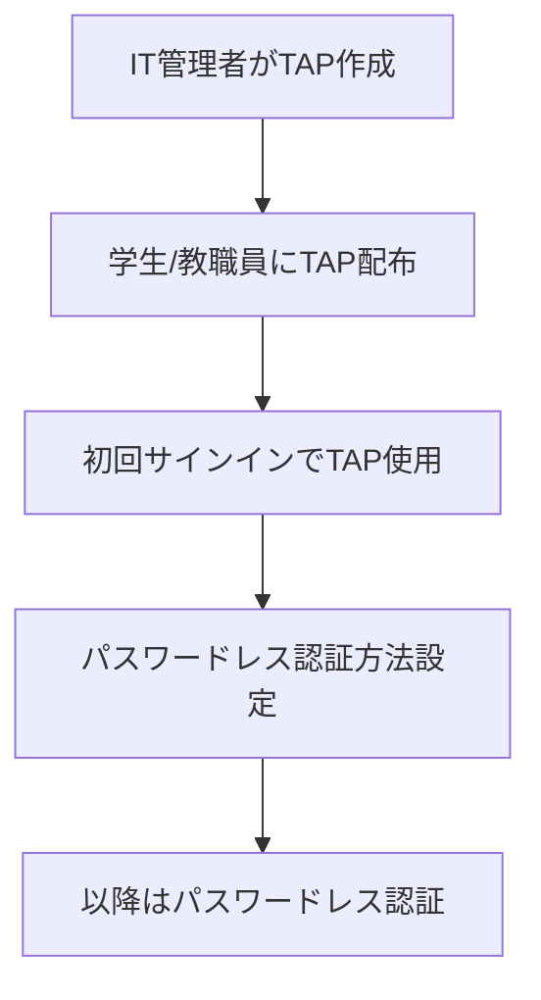

# Book Draft - 教育機関向けMicrosoft365完全導入ガイド

## 基本情報
- **タイトル**: 教育機関向けMicrosoft365完全導入ガイド
- **対象読者**: 
  - 教育委員会のIT担当者
  - 大学・高等教育機関の情報システム部門
  - Microsoft 365導入を支援するSIer・システムエンジニア
- **書籍概要**: Microsoft 365 Education A1 for DeviceからA5まで、全機能を活用するための完全実装ガイド。初めて導入する技術者でもステップバイステップで設定できる実践的な内容。

## 章構成 (Chapter Structure)

### はじめに
**目的**: 本書の目的と活用方法を説明
**概要**: 読者への期待値設定と本書の構成説明

#### 本書の目的と対象読者
- 教育委員会IT担当者への実践ガイド
- 大学情報システム部門の導入指針
- SIer・導入支援企業のリファレンス
- A1 for DeviceからA5まで全ライセンスに対応

#### 本書の活用方法
- 章立ての説明と読み進め方
- ライセンス別機能対応表
- チェックリストの使い方
- 設定画面のスクリーンショット活用

### 第1章: Microsoft 365 Educationの概要とライセンス選定
**目的**: Microsoft 365 Educationの全体像とライセンス選定
**概要**: 教育機関特有の要件とライセンス比較

#### 1.1 教育機関におけるMicrosoft 365の価値
**目的**: 導入メリットの理解
**内容**: セキュリティ、コラボレーション、管理の統合

##### 1.1.1 初等中等教育での活用
- GIGAスクール構想との連携
- 1人1台端末の管理効率化
- 児童生徒の安全なICT利用
- 教職員の働き方改革

##### 1.1.2 高等教育機関での活用
- 研究・教育活動の高度化
- BYOD環境への対応
- 国際連携の促進
- 学生サービスの向上

#### 1.2 ライセンス体系の詳細理解
**目的**: A1 for Device/A3/A5の機能差を完全理解
**内容**: 機能比較表と選定フローチャート

##### 1.2.1 Office 365 A1 for Device - GIGAスクール標準
- デバイス割り当て
- デスクトップ版Office (1台まで)
- Exchange Online (50GBメールボックス)
- SharePoint/OneDrive (1TB)
- Teams for Education
- 基本的なセキュリティ機能

##### 1.2.2 Office 365 A3 - 標準的な教育環境
- ユーザー割り当て
- デスクトップ版Office (5台まで)
- Exchange Online Plan 2
- 高度なセキュリティ機能
- Microsoft Bookings
- Stream、Forms、Planner

##### 1.2.3 Office 365 A5 - 最高レベルの機能
- ユーザー割り当て
- Power BI Pro
- Audio Conferencing
- Phone System
- Advanced Threat Protection
- Advanced Compliance

##### 1.2.4 Microsoft 365 A3/A5 - 完全統合環境
- Windows 11 Education
- Intune for Education
- Azure AD Premium
- Microsoft Defender
- サーバーCALの権利

#### 1.3 購入方法と契約形態
**目的**: 最適な購入方法の選択
**内容**: 各種契約の特徴と注意点

##### 1.3.1 GIGAスクール端末バンドル
- Windows端末との同時購入
- Intune for Educationの活用
- 購入時の確認事項

##### 1.3.2 EES包括契約
- 全学ライセンスのメリット
- 契約更新のタイミング
- Student Use Benefitの活用

### 第2章: テナントの作成と初期設定
**目的**: Microsoft 365テナントの作成から基本設定まで
**概要**: 管理者が最初に行うべき設定作業

#### 2.1 教育機関向けテナントの作成
**目的**: 正しいテナント作成手順
**内容**: 教育機関認証から作成完了まで

##### 2.1.1 教育機関の資格確認
- 必要書類の準備
- 申請プロセス
- 承認までの期間
- トラブルシューティング

##### 2.1.2 テナント作成手順
- Office 365 Education申し込み
- 管理者アカウント作成
- テナント名の決定
- 初回サインイン

#### 2.2 カスタムドメインの設定
**目的**: 組織独自のドメイン設定
**内容**: DNSレコード設定の詳細

##### 2.2.1 ドメインの追加と確認
- TXTレコードによる確認
- 複数ドメインの管理
- サブドメインの活用
- 既定ドメインの設定

##### 2.2.2 DNSレコードの構成
- MXレコード設定
- SPF/DKIM/DMARC設定
- AutodiscoverとSIP設定
- 設定後の確認方法

#### 2.3 管理センターの基本設定
**目的**: 組織全体の基本設定
**内容**: セキュリティとコンプライアンスの初期設定

##### 2.3.1 組織プロファイル設定
- 組織情報の登録
- タイムゾーン設定
- 言語設定
- リリース設定

##### 2.3.2 セキュリティ既定値群
- 多要素認証の有効化
- レガシー認証のブロック
- 管理者保護
- セルフサービス設定

### 第3章: Microsoft Entra ID (旧 Azure Active Directory) の構築
**目的**: 認証基盤の完全構築
**概要**: ユーザー管理から高度な認証設定まで

#### 3.1 ディレクトリ設計と構成
**目的**: 教育機関に最適な階層構造
**内容**: 組織単位とグループ設計

##### 3.1.1 組織構造の設計
- 学校/学部/学科の階層化
- 管理単位の作成
- 委任管理の設定
- 命名規則の策定

##### 3.1.2 グループ戦略
- セキュリティグループ
- Microsoft 365グループ
- 配布リスト
- 動的グループの活用

#### 3.2 ハイブリッドID構成
**目的**: オンプレミスADとの統合
**内容**: Azure AD Connectの詳細設定

##### 3.2.1 Azure AD Connect設定
- インストール要件
- 同期オプション選択
- フィルタリング設定
- パスワード同期vs.パススルー認証

##### 3.2.2 シングルサインオン実装
- シームレスSSO設定
- ADFS構成（必要な場合）
- 証明書管理
- フェデレーション設定

#### 3.3 条件付きアクセスポリシー
**目的**: ゼロトラストセキュリティの実装
**内容**: A3/A5での高度な制御

##### 3.3.1 基本ポリシーセット（A3）
- 管理者MFA必須
- リスクベース認証
- デバイスコンプライアンス
- 場所ベースアクセス

##### 3.3.2 高度なポリシー（A5）
- リスクスコアリング
- Identity Protection
- Privileged Identity Management
- アクセスレビュー

### 第4章: ユーザーとライセンス管理
**目的**: 効率的なユーザー管理の実現
**概要**: 大規模環境での自動化

#### 4.1 ユーザープロビジョニング
**目的**: 自動化による効率化
**内容**: 各種連携方法の実装

##### 4.1.1 一括作成と更新
- CSVテンプレート活用
- PowerShellスクリプト
- Graph APIの利用
- エラー処理方法

##### 4.1.2 School Data Sync設定
- SDS概要と要件
- CSVファイル準備
- 同期プロファイル作成
- スケジュール設定

#### 4.2 ライセンス割り当て戦略
**目的**: 適切なライセンス配布
**内容**: グループベース割り当て

##### 4.2.1 ライセンス管理
- グループベースライセンシング
- 直接割り当て
- ライセンス使用状況監視
- Student Use Benefit設定

##### 4.2.2 サービス有効化制御
- 個別サービスのON/OFF
- 段階的展開
- パイロットグループ
- ロールアウト計画

### 第5章: Exchange Onlineの設定
**目的**: メールシステムの完全構築
**概要**: 基本設定から高度な機能まで

#### 5.1 メールボックス管理
**目的**: 効率的なメール環境構築
**内容**: 各プランでの設定差異

##### 5.1.1 メールボックス設定（A1 for Device）
- 50GBメールボックス
- 共有メールボックス
- リソースメールボックス
- メールボックス権限

##### 5.1.2 アーカイブとコンプライアンス（A3/A5）
- インプレースアーカイブ
- 訴訟ホールド
- メールボックス監査
- データ損失防止（DLP）

#### 5.2 メールフロー設定
**目的**: セキュアなメール配送
**内容**: スパム対策と暗号化

##### 5.2.1 トランスポートルール
- スパムフィルター設定
- 接続フィルター
- コンテンツフィルター
- 送信者認証（SPF/DKIM/DMARC）

##### 5.2.2 高度な脅威対策（A5）
- Safe Attachments
- Safe Links
- フィッシング対策
- ゼロ時間自動削除（ZAP）

### 第6章: SharePointとOneDriveの構築
**目的**: コラボレーション基盤の確立
**概要**: サイト設計から外部共有まで

#### 6.1 SharePoint Online設定
**目的**: 組織ポータルの構築
**内容**: サイト階層とガバナンス

##### 6.1.1 サイトコレクション設計
- ハブサイト構成
- コミュニケーションサイト
- チームサイト
- テンプレート作成

##### 6.1.2 権限とセキュリティ
- サイト権限設計
- 外部共有制御
- 機密度ラベル（A3/A5）
- Information Rights Management

#### 6.2 OneDrive for Business
**目的**: 個人用ストレージ管理
**内容**: 同期とバックアップ

##### 6.2.1 ストレージ管理
- 既定容量設定（1TB/5TB）
- 保持ポリシー
- バージョン管理
- ごみ箱設定

##### 6.2.2 同期クライアント展開
- グループポリシー設定
- Known Folder Move
- Files On-Demand
- 帯域幅制御

### 第7章: Microsoft Teamsの教育活用
**目的**: 教育に最適化されたTeams環境
**概要**: クラス管理から会議設定まで

#### 7.1 Teams for Education設定
**目的**: 教育機関向け機能の活用
**内容**: クラスチームと課題管理

##### 7.1.1 クラスチーム管理
- チームテンプレート
- 一括作成（SDS連携）
- 課題機能設定
- 成績表統合

##### 7.1.2 教育ポリシー設定
- 学生向けポリシー
- 教員向けポリシー
- ゲストアクセス制御
- 監督モード設定

#### 7.2 会議とライブイベント
**目的**: オンライン授業の実現
**内容**: 各ライセンスでの機能差

##### 7.2.1 会議機能（A1 for Device含む全ライセンス）
- 会議ポリシー設定
- 録画設定
- ロビー設定
- 参加者権限

##### 7.2.2 高度な機能（A3/A5）
- ライブイベント（A3）
- 電話会議（A5）
- ウェビナー機能
- 出席レポート詳細

### 第8章: セキュリティとコンプライアンス
**目的**: ライセンス別セキュリティ機能の完全理解と実装
**概要**: A1 for Device/A3/A5で利用可能な機能を明確に分類

#### 8.1 Office 365 A1 for Deviceで実現できるセキュリティ
**目的**: 無償ライセンスでの最大限の保護
**内容**: 基本機能と運用での補完

##### 8.1.1 A1 for Deviceで利用可能な機能
- **認証とアクセス管理**
  - Microsoft Entra ID Basic（基本機能）
  - パスワードポリシー設定
  - セルフサービスパスワードリセット（SSPR）
  - 基本的な条件付きアクセス（制限あり）
  - セキュリティの既定値群

- **アプリケーションとプラットフォーム**
  - Microsoft 365 for the web（Word、Excel、PowerPoint、OneNote）
  - Microsoft 365 Apps for enterprise（デスクトップ版）
  - Microsoft Teams（フル機能）
  - Exchange Online Plan 1（50GBメールボックス）
  - SharePoint Online Plan 1
  - OneDrive for Business（1TB）

- **デバイス管理**
  - Microsoft Intune for Education
  - Mobile Device Management (MDM)
  - Mobile Application Management (MAM)
  - Windows 11 Pro Education

- **教育ツール**
  - Teams for Education（クラスルーム機能）
  - OneNote Class Notebook
  - Microsoft Forms
  - Learning tools
  - Minecraft Education Edition（アドオン）

- **セキュリティ機能**
  - Exchange Online Protection (EOP)
  - スパムフィルター
  - マルウェア対策
  - 基本的なメッセージ暗号化
  - 基本的な監査ログ
  - Microsoft Secure Score（基本）

##### 8.1.2 A1 for Deviceでの制限事項と運用補完
- **不足機能の運用カバー**
  - 手動でのログ監視手順
  - セキュリティインシデント対応手順書
  - 定期的なアカウント棚卸し
  - ユーザー教育プログラム

- **サードパーティツールの活用**
  - 無償のセキュリティツール選定
  - ログ分析ツールの導入
  - フィッシング対策トレーニング

#### 8.2 Office 365 A3で追加されるセキュリティ機能
**目的**: エンタープライズレベルの保護実現
**内容**: A1 for Deviceからの機能拡張

##### 8.2.1 A3で新たに利用可能な機能

**注意**: Office 365 A3（O365 A3）とMicrosoft 365 A3（M365 A3）では利用可能な機能が異なります。

- **Office 365 A3の場合**
  - **認証機能**: Microsoft Entra ID Basic（P1は含まれない）
  - **コンプライアンス機能**:
    - Microsoft Purview Data Loss Prevention（メール・ファイル）
    - Microsoft Purview eDiscovery (Standard)
    - Litigation Hold
    - Microsoft Purview Message Encryption (Basic)
    - Microsoft Purview Audit (Standard)
  - **セキュリティ機能**:
    - Office 365 Cloud App Security
    - 基本的な脅威対策
  - **限定事項**: 
    - Microsoft Defender for Office 365は含まれない
    - 高度な条件付きアクセスは利用不可
    - Azure Information Protectionは含まれない

- **Microsoft 365 A3の場合（完全版）**
  - **高度な認証機能**:
    - Microsoft Entra ID Premium P1
    - 条件付きアクセスの完全機能
    - グループベースのライセンス管理
    - セルフサービスグループ管理
    - 動的グループメンバーシップ
  - **エンドポイント保護**:
    - Microsoft Defender for Endpoint Plan 1
    - Microsoft Defender Antivirus
    - Microsoft Defender Device Guard
    - BitLocker and BitLocker To Go
    - Windows Information Protection
  - **情報保護**:
    - Microsoft Purview Information Protection Plan 1
    - Azure Information Protection Plan 1
    - 機密度ラベル（手動・既定・必須）
  - **コンプライアンス機能**:
    - 高度なeDiscovery
    - 詳細なDLPポリシー
    - Advanced Threat Analytics
  - **クラウドセキュリティ**:
    - Office 365 Cloud App Security
    - Microsoft Defender for Cloud Apps Discovery

##### 8.2.2 A3での実装手順（Microsoft 365 A3の場合）
- 条件付きアクセスポリシーの段階的展開
- エンドポイント保護の一元管理
- 機密度ラベルの分類体系構築
- DLPポリシーの段階的適用
- Cloud App Securityでのシャドウ IT対策

#### 8.3 Microsoft 365 A5で利用できる最高レベルのセキュリティ
**目的**: AI駆動の高度な脅威対策とゼロトラスト実現
**内容**: 最上位の統合セキュリティ機能

##### 8.3.1 A5限定の高度な機能

**注意**: Office 365 A5とMicrosoft 365 A5では利用可能な機能が大きく異なります。

- **Office 365 A5の場合**
  - **認証機能**: Microsoft Entra ID Basic（P2は含まれない）
  - **セキュリティ機能**:
    - Microsoft Defender for Office 365 Plan 2
    - Power BI Pro
    - Audio Conferencing
    - Phone System
  - **コンプライアンス機能**:
    - Microsoft Purview eDiscovery (Premium)
    - Communications DLP (Teams chat)
    - Microsoft Purview Communication Compliance
    - Microsoft Purview Advanced Message Encryption
    - Microsoft Purview Customer Lockbox

- **Microsoft 365 A5の場合（完全版）**
  - **最高レベルの認証とID保護**:
    - Microsoft Entra ID Premium P2
    - Identity Protection（リスクベース検出）
    - Privileged Identity Management (PIM)
    - アクセスレビュー
    - エンタイトルメント管理
    - リスクベースの条件付きアクセス

  - **統合エンドポイント保護**:
    - Microsoft Defender for Endpoint Plan 2
    - 自動調査と修復（AIR）
    - 高度な脅威ハンティング
    - 攻撃面削減ルール
    - 脆弱性管理

  - **Microsoft Defender for Office 365 Plan 2**:
    - 自動調査と対応（AIR）
    - 脅威エクスプローラー（Threat Explorer）
    - キャンペーンビュー
    - 攻撃シミュレーター（完全版）
    - Safe Documents
    - Microsoft Defender Application Guard for Office

  - **統合クラウドセキュリティ**:
    - Microsoft Defender for Cloud Apps（完全版）
    - Microsoft Defender for Identity
    - 統合されたMicrosoft Defender XDR
    - Shadow IT検出と制御
    - アプリの条件付きアクセス制御

  - **高度なコンプライアンス機能**:
    - Microsoft Purview Advanced eDiscovery
    - Microsoft Purview Insider Risk Management
    - Microsoft Purview Communication Compliance
    - Microsoft Purview Information Barriers
    - Microsoft Purview Privileged Access Management
    - Microsoft Purview Customer Lockbox
    - Microsoft Purview Audit (Premium)

  - **高度な分析とレポート**:
    - Power BI Pro
    - My Analytics
    - 高度な監査ログ（1年間保持）
    - Microsoft Secure Score詳細分析
    - 統合されたセキュリティダッシュボード

##### 8.3.2 A5での統合セキュリティ実装
- **ゼロトラストアーキテクチャ**:
  - ID、デバイス、アプリ、データの統合保護
  - リスクベースの動的アクセス制御
  - 継続的な信頼検証

- **AI駆動の脅威対策**:
  - 機械学習による異常検知
  - 自動化されたインシデント対応
  - 予測的脅威インテリジェンス

- **統合セキュリティ運用**:
  - Microsoft Defender XDRでの一元管理
  - SIEM/SOARとの統合
  - 自動化されたプレイブック実行

#### 8.4 Golden Path for Educationに基づく段階的セキュリティ実装
**目的**: Microsoft Learn推奨の段階的セキュリティ強化
**内容**: 教育機関向けベストプラクティスに基づく実装ロードマップ

##### 8.4.1 Baseline段階（A1 for Device）- 基盤セキュリティの確立
**期間**: 0-3ヶ月
**前提条件**: 
- 教育機関として認定されたテナント
- 基本的なネットワークとID基盤

**実装項目**:
- **テナント基盤設定**:
  - セキュリティの既定値群の有効化
  - 基本的なパスワードポリシー
  - 多要素認証（MFA）の段階的展開
  - 基本的な監査ログ設定

- **基本的な脅威対策**:
  - Exchange Online Protection (EOP)の設定
  - 基本的なスパムフィルター
  - マルウェア対策の有効化
  - 基本的なメッセージ暗号化

- **基盤となる管理体制**:
  - インシデント対応手順の策定
  - ユーザー教育プログラムの開始
  - 基本的なセキュリティ監視体制

##### 8.4.2 Standard段階（A3）- エンタープライズレベルセキュリティ
**期間**: 3-9ヶ月
**前提条件**: 
- Baseline段階の完了
- Microsoft 365 A3ライセンス

**Microsoft 365 A3での実装項目**:
- **高度な認証**:
  - Microsoft Entra ID Premium P1
  - 条件付きアクセスポリシーの全面展開
  - グループベースライセンシング
  - 動的グループの活用

- **エンドポイント保護**:
  - Microsoft Defender for Endpoint Plan 1
  - デバイスコンプライアンス
  - BitLockerとWindows Information Protection
  - 攻撃面削減ルール

- **情報保護**:
  - Azure Information Protection Plan 1
  - 機密度ラベルの展開
  - Data Loss Prevention (DLP)ポリシー
  - 基本的なeDiscovery

- **クラウドアプリセキュリティ**:
  - Office 365 Cloud App Security
  - Microsoft Defender for Cloud Apps Discovery
  - Shadow IT検出

**Office 365 A3での制限対応**:
- 高度な脅威対策の代替手段
- 運用プロセスでの補完
- サードパーティツールの検討

##### 8.4.3 Advanced段階（A5）- ゼロトラスト完全実装
**期間**: 9-18ヶ月
**前提条件**: 
- Standard段階の完了
- Microsoft 365 A5ライセンス

**実装項目**:
- **ゼロトラスト認証**:
  - Microsoft Entra ID Premium P2
  - Identity Protection
  - Privileged Identity Management (PIM)
  - リスクベース条件付きアクセス

- **統合脅威対策**:
  - Microsoft Defender for Office 365 Plan 2
  - Microsoft Defender for Endpoint Plan 2
  - Microsoft Defender for Identity
  - Microsoft Defender XDRによる統合

- **高度なコンプライアンス**:
  - Microsoft Purview Advanced eDiscovery
  - Insider Risk Management
  - Communication Compliance
  - Information Barriers

- **AI駆動のセキュリティ**:
  - 自動調査と対応（AIR）
  - 攻撃シミュレーター
  - 高度な脅威ハンティング
  - 予測的脅威インテリジェンス

##### 8.4.4 継続的改善とドリフト管理
**目的**: 設定の継続的監視と最適化
**内容**: Microsoft推奨の管理プラクティス

- **監視とアセスメント**:
  - セキュリティスコアの継続監視
  - 設定ドリフトの検出
  - 定期的なセキュリティアセスメント

- **変更管理**:
  - Microsoft メッセージセンターの監視
  - 新機能の評価と展開
  - ポリシーの定期見直し

- **組織の成熟度向上**:
  - セキュリティ運用の自動化
  - インシデント対応の高度化
  - 継続的なユーザー教育

#### 8.5 Microsoft Secure Scoreによるセキュリティ姿勢の測定と改善
**目的**: セキュリティの現状把握と継続的改善
**内容**: 教育機関向けセキュリティスコア活用法

##### 8.5.1 Microsoft Secure Scoreとは
Microsoft Secure Scoreは、組織のセキュリティ姿勢を数値で測定するツールです。教育機関のIT管理者が現在のセキュリティレベルを把握し、改善すべきポイントを特定するために活用できます。

**基本概念**:
- **測定方法**: 実装済みのセキュリティ対策に基づいてスコアを算出
- **最大スコア**: 利用可能なセキュリティ機能すべてを実装した場合の理論値
- **達成率**: 現在のスコア ÷ 最大スコア × 100
- **ベンチマーク**: 同規模の教育機関との比較

**アクセス方法**:
- Microsoft Defender portal: https://security.microsoft.com/securescore
- Microsoft 365管理センターからのリンク
- 全ライセンス（A1 for Device、A3、A5）で利用可能

##### 8.5.2 スコアの構成要素と教育機関での重要度

**4つの主要カテゴリ**:

1. **ID（アイデンティティ）** - 重要度: 最高
   - Microsoft Entra IDのアカウントと役割
   - 教育機関での重要性: 学生・教職員の大量アカウント管理
   - 主な対策: MFA、条件付きアクセス、特権ロールの保護

2. **デバイス** - 重要度: 高
   - Microsoft Defender for Endpointによる評価
   - 教育機関での重要性: GIGAスクール端末、BYOD管理
   - 主な対策: デバイス暗号化、セキュリティ更新、コンプライアンス

3. **アプリ** - 重要度: 高
   - メールとクラウドアプリ（Office 365、Teams等）
   - 教育機関での重要性: 日常的な学習・業務ツール
   - 主な対策: メール保護、アプリアクセス制御、DLP

4. **データ** - 重要度: 最高
   - Microsoft Information Protectionによる評価
   - 教育機関での重要性: 学生情報、成績データの保護
   - 主な対策: 機密度ラベル、データ分類、暗号化

##### 8.5.3 ライセンス別Secure Score活用戦略

**A1 for Deviceでの活用**:
- **目標スコア**: 60-70%
- **重点項目**:
  - セキュリティの既定値群の有効化
  - 基本的なMFA展開
  - 基本的な監査ログ有効化
  - Exchange Online Protection設定

**A3での活用**:
- **目標スコア**: 75-85%
- **重点項目**:
  - 条件付きアクセスポリシー
  - デバイスコンプライアンス
  - 基本的なDLP設定
  - 機密度ラベルの基本設定

**A5での活用**:
- **目標スコア**: 85-95%
- **重点項目**:
  - 高度な脅威対策
  - ゼロトラスト実装
  - 包括的なコンプライアンス
  - AI駆動のセキュリティ自動化

##### 8.5.4 改善アクションの優先順位付け

**Secure Scoreの推奨アクション評価基準**:
1. **ポイント数**: 残りの獲得可能ポイント
2. **実装難易度**: 技術的複雑さ
3. **ユーザー影響**: 利便性への影響度
4. **複雑度**: 組織変更の必要性

**教育機関向け優先順位**:

**第1優先（即座に実装）**:
- セキュリティの既定値群
- 多要素認証の展開
- 外部ユーザー共有の制限
- 基本的な監査ログ

**第2優先（3ヶ月以内）**:
- 条件付きアクセスポリシー
- デバイス暗号化
- メールアーカイブの有効化
- ゲストアクセスの制御

**第3優先（6ヶ月以内）**:
- 高度な脅威対策（A3/A5）
- データ損失防止ポリシー
- 機密度ラベル
- 特権アクセス管理

##### 8.5.5 継続的監視と改善プロセス

**月次監視項目**:
- スコアの推移確認
- 新しい推奨アクションの確認
- 同業他社とのベンチマーク比較
- ユーザー影響の評価

**四半期レビュー**:
- 目標スコアの見直し
- 実装計画の調整
- リスク受容の再評価
- 予算・リソース配分の検討

**年次評価**:
- 包括的なセキュリティ姿勢評価
- 次年度目標の設定
- ライセンス見直しの検討
- セキュリティ戦略の更新

##### 8.5.6 教育機関特有の考慮事項

**学年更新時の注意点**:
- 大量アカウント変更時のスコア変動
- 新入生・卒業生処理の影響
- 一時的なスコア低下への対応

**GIGA端末管理での考慮事項**:
- デバイススコアの季節変動
- 持ち帰り時のセキュリティ設定
- 更新作業時の一時的な非準拠

**予算サイクルとの連携**:
- スコア改善提案の予算要求への活用
- ライセンス更新時の意思決定材料
- セキュリティ投資効果の可視化

**レポーティング活用**:
- 理事会・教育委員会への報告
- 監査対応での活用
- 他校との比較検討

#### 8.6 テンポラリーアクセスパス（TAP）とパスワードレス認証
**目的**: セキュアで利便性の高い認証環境の実現
**内容**: 教育機関でのパスワードレス認証導入戦略

##### 8.6.1 テンポラリーアクセスパス（TAP）の概要
テンポラリーアクセスパス（TAP）は、Microsoft Entra IDが提供する時間制限付きのパスコードです。教育機関での大量アカウント管理と安全な認証方法の導入を効率化します。

**基本特徴**:
- **時間制限**: 設定した期間（最大24時間）後に自動無効化
- **利用回数制限**: 単回利用または複数回利用の選択可能
- **電話不要**: 物理デバイスなしで多要素認証をブートストラップ
- **フェデレーション優先**: フェデレーション環境でもMicrosoft Entra IDで直接認証

**ライセンス要件**:
- Microsoft Entra ID Premium P1以上
- Microsoft 365 A3以上または単体ライセンス
- A1 for Deviceでは利用不可

##### 8.6.2 教育機関でのTAP活用シナリオ

**新入生・新任教職員の初期設定**:


**GIGA端末の初期設定（推奨パターン）**:
1. **事前準備**: IT管理者がTAPを一括作成
2. **配布**: 児童生徒にTAPコードを安全に配布
3. **初期設定**: Windows Autopilot時にTAPで認証
4. **Windows Hello設定**: PINと生体認証の設定
5. **運用開始**: パスワードレス認証で端末利用

**卒業生処理時の一時的アクセス**:
- 成績証明書発行などの限定的アクセス
- アカウント移行作業での一時認証
- データ退避作業での短期間アクセス

##### 8.6.3 パスワードレス認証の実装

**Windows Hello for Business（推奨）**:
- **PIN認証**: 数字4桁以上のデバイス固有認証
- **生体認証**: 指紋、顔認証、虹彩認証
- **ハードウェア保護**: TPMチップによる秘密鍵保護
- **フィッシング耐性**: 物理デバイスなしでは無効

**実装の技術的特徴**:
```
認証フロー:
1. ユーザーがPIN/生体認証を入力
2. TPMが秘密鍵を復号化
3. 署名付きリクエストを送信
4. サーバーが公開鍵で検証
5. 認証成功、シングルサインオン
```

**Microsoft Authenticator**:
- **パスキー**: FIDO2準拠の認証
- **プッシュ通知**: 番号マッチング認証
- **電話サインイン**: パスワードレスサインイン
- **バックアップ機能**: クラウド暗号化バックアップ

##### 8.6.4 教育機関別導入パターン

**小中学校（1:1端末環境）**:
- **推奨構成**: TAP + Windows Hello（PIN + 指紋）
- **メリット**: パスワード忘れ問題の解消
- **考慮事項**: 低学年での生体認証の精度
- **フォールバック**: PINバックアップの設定

**高等学校（BYOD対応）**:
- **推奨構成**: TAP + Authenticator（パスキー）
- **メリット**: 個人デバイスでの安全な認証
- **考慮事項**: iOS/Android対応
- **管理**: 個人デバイス登録の自動化

**大学（研究環境対応）**:
- **推奨構成**: TAP + FIDO2セキュリティキー
- **メリット**: 高セキュリティ研究データアクセス
- **考慮事項**: 外部研究者との共同研究対応
- **管理**: ゲストアクセス統合

**共用端末環境**:
- **推奨構成**: FIDO2セキュリティキー
- **メリット**: 複数ユーザーでの安全な利用
- **考慮事項**: キーの紛失・破損管理
- **運用**: キー管理の自動化

##### 8.6.5 段階的導入計画

**フェーズ1: パイロット展開（3ヶ月）**
- **対象**: IT部門・管理職（50名程度）
- **目的**: 運用ノウハウの蓄積
- **実装**: TAP作成プロセスの確立
- **評価**: ユーザビリティとセキュリティの検証

**フェーズ2: 教職員展開（6ヶ月）**
- **対象**: 全教職員
- **目的**: 校務でのパスワードレス認証
- **実装**: Windows Hello + Authenticator
- **トレーニング**: 利用方法の教育

**フェーズ3: 学生展開（12ヶ月）**
- **対象**: 全学生（段階的）
- **目的**: 学習環境でのパスワードレス化
- **実装**: 学年別順次展開
- **サポート**: ヘルプデスク体制強化

##### 8.6.6 運用管理とトラブルシューティング

**TAPの管理**:
```powershell
# TAP作成の例（PowerShell）
New-MgUserAuthenticationTemporaryAccessPassMethod `
  -UserId "student@school.edu.jp" `
  -IsUsableOnce $true `
  -LifetimeInMinutes 1440 `
  -StartDateTime (Get-Date)
```

**PINリセット機能**:
- **Microsoft PIN Reset Service**の有効化
- **ロック画面からのリセット**機能
- **多要素認証による本人確認**
- **Group PolicyまたはIntuneでの設定**

**よくあるトラブルと対処**:

1. **PIN忘れ**:
   - PINリセット機能の利用
   - 代替認証方法での一時アクセス
   - 新しいTAPの発行

2. **生体認証エラー**:
   - PINによるフォールバック
   - 生体情報の再登録
   - ハードウェア互換性確認

3. **デバイス紛失・盗難**:
   - 即座のアカウント無効化
   - リモートワイプの実行
   - 新デバイスでの再設定

##### 8.6.7 セキュリティ考慮事項

**TAPのセキュリティ**:
- **配布方法**: 安全なチャネルでの配布
- **有効期限**: 最小限の期間設定
- **利用監視**: 使用状況のログ監視
- **無効化**: 不要時の即座な無効化

**Windows Hello PIN設定**:
- **複雑性要件**: 文字種類の組み合わせ
- **長さ要件**: 最小6桁以上推奨
- **履歴管理**: 過去のPIN再利用防止
- **アンチハンマリング**: 試行回数制限

**監査とコンプライアンス**:
- **認証ログ**: 詳細な認証履歴記録
- **リスク評価**: 異常なサインインの検出
- **レポート**: 定期的な利用状況報告
- **コンプライアンス**: 教育機関規則との整合性

##### 8.6.8 コスト効果とROI

**導入効果**:
- **パスワードリセット削減**: ヘルプデスク負荷軽減
- **セキュリティ向上**: フィッシング攻撃の耐性
- **ユーザー満足度**: 利便性の大幅向上
- **運用効率化**: 認証関連トラブルの減少

**投資回収期間**:
- **初年度**: 導入コストとトレーニング費用
- **2年目以降**: 運用コスト削減効果
- **3年間**: 投資回収とROI実現
- **長期**: セキュリティリスク削減効果

### 第9章: デバイス管理（Microsoft 365のみ）
**目的**: 統合エンドポイント管理
**概要**: Intuneによる包括的管理

#### 9.1 Intune for Education
**目的**: 教育向け簡易管理
**内容**: Windows、iOS、Android対応

##### 9.1.1 デバイス登録
- Windows Autopilot
- Apple DEP/ADE
- Android Enterprise
- BYOD登録

##### 9.1.2 構成プロファイル
- 教育向けテンプレート
- アプリ配布
- 制限設定
- Wi-Fi/VPN設定

#### 9.2 高度なデバイス管理（A3/A5）
**目的**: エンタープライズ機能
**内容**: 条件付きアクセス統合

##### 9.2.1 コンプライアンスポリシー
- デバイス正常性
- 暗号化要件
- OS更新要件
- 修復アクション

##### 9.2.2 アプリケーション保護
- MAMポリシー
- アプリ保護ポリシー
- 選択的ワイプ
- データ転送制限

#### 9.3 デバイス初期設定とデプロイメント
**目的**: 効率的なデバイス展開とプロビジョニング
**内容**: Autopilotとプロビジョニングパッケージを活用した自動化

##### 9.3.1 デプロイメント手法の比較
**目的**: 教育機関に最適な展開方法の選定
**内容**: 各手法の特徴と適用場面

**Windows Autopilot**:
- **特徴**: クラウドベースの自動プロビジョニング
- **適用場面**: 新規デバイス導入、大規模展開
- **メリット**: 
  - ベンダーからの直接配送が可能
  - 物理的な作業が不要
  - 設定の標準化
  - ゼロタッチ展開
- **要件**: 
  - Microsoft 365 Business Premium以上
  - または Microsoft 365 A3/A5
  - Windows 10/11 Pro以上

**プロビジョニングパッケージ**:
- **特徴**: ローカルでの設定配布
- **適用場面**: 既存デバイスの設定変更、オフライン環境
- **メリット**: 
  - インターネット接続不要
  - 細かな設定制御
  - 段階的展開
  - 緊急時の迅速対応
- **要件**: 
  - Windows Configuration Designer
  - USB等の物理メディア
  - 現地での作業

**選択基準**:
| 項目 | Autopilot | プロビジョニングパッケージ |
|------|----------|-------------------------|
| 新規デバイス | ◎ | ○ |
| 既存デバイス | ○ | ◎ |
| 大規模展開 | ◎ | △ |
| オフライン環境 | × | ◎ |
| 運用負荷 | 低 | 中 |
| 設定の柔軟性 | 中 | 高 |

##### 9.3.2 Windows Autopilotの実装
**目的**: GIGAスクール端末の自動プロビジョニング
**内容**: 教育機関向け設定手順

**事前準備**:
1. **デバイス登録**:
   - ハードウェアIDの収集
   - Autopilotデバイスとしての登録
   - グループ割り当て

2. **プロファイル設定**:
   - 展開プロファイルの作成
   - 地域設定（日本語）
   - タイムゾーン設定
   - アカウント設定

**教育機関向けAutopilotプロファイル**:
```yaml
# 基本設定
言語: 日本語
地域: 日本
タイムゾーン: 東京
キーボード: 日本語

# アカウント設定
ユーザー割り当て: 自動割り当て
ローカル管理者: 作成しない
プライバシー設定: 教育機関向け

# アプリケーション
Office 365: 自動インストール
教育アプリ: 自動配布
セキュリティ: 自動構成
```

**展開プロセス**:
1. **Phase 1 - デバイス識別**:
   - ハードウェアIDによる認識
   - 組織テナントへの参加
   - 基本設定の適用

2. **Phase 2 - ユーザー設定**:
   - 学校アカウントでのサインイン
   - 個人設定の適用
   - アプリケーションの展開

3. **Phase 3 - 最終設定**:
   - コンプライアンスチェック
   - セキュリティ設定確認
   - デバイス準備完了

**GIGA端末特有の設定**:
- **制限設定**: 教育に適した制限の適用
- **時間制限**: 利用時間の管理
- **アプリ制限**: 承認済みアプリのみ
- **Webフィルタリング**: 年齢適切なコンテンツ

##### 9.3.3 プロビジョニングパッケージの作成
**目的**: 迅速な設定変更と標準化
**内容**: Windows Configuration Designerを使用したパッケージ作成

**パッケージ設計**:
1. **基本設定パッケージ**:
   - ネットワーク設定（Wi-Fi、プロキシ）
   - 地域設定（言語、時刻）
   - 基本的なセキュリティ設定

2. **教育向けパッケージ**:
   - 教育アプリケーション
   - 制限設定
   - 学習環境の最適化

3. **管理者パッケージ**:
   - 管理者アカウント
   - 高度な設定
   - トラブルシューティングツール

**作成手順**:
1. **Windows Configuration Designer起動**:
   - 新しいプロジェクトの作成
   - プロビジョニングパッケージの選択
   - 設定項目の選択

2. **設定の構成**:
   - **アカウント管理**: ローカルアカウント設定
   - **ネットワーク**: Wi-Fi プロファイル
   - **証明書**: 必要な証明書の配布
   - **アプリケーション**: 必要なアプリの事前インストール

3. **パッケージの生成**:
   - 設定の検証
   - .ppkgファイルの作成
   - 配布用メディアの準備

**教育機関向け設定例**:
```yaml
# ネットワーク設定
Wi-Fi:
  SSID: "School-Network"
  セキュリティ: WPA2-Enterprise
  証明書: 自動配布

# アカウント設定
ローカル管理者: 
  名前: "SchoolAdmin"
  パスワード: 暗号化済み
  権限: 制限あり

# アプリケーション
Microsoft Office: 事前インストール
教育アプリ: 自動配布
ブラウザ設定: 安全設定済み

# セキュリティ
BitLocker: 自動有効化
Windows Update: 自動更新
ファイアウォール: 有効
```

##### 9.3.4 ハイブリッド展開戦略
**目的**: Autopilotとプロビジョニングパッケージの組み合わせ
**内容**: 教育機関の複雑な要件への対応

**展開フェーズ**:
1. **Phase 1 - 基盤構築**:
   - プロビジョニングパッケージによる基本設定
   - ネットワーク接続の確立
   - 基本的なセキュリティ設定

2. **Phase 2 - クラウド統合**:
   - Autopilotによるクラウド接続
   - Microsoft 365への参加
   - ユーザーアカウントの設定

3. **Phase 3 - 最適化**:
   - アプリケーションの自動配布
   - 設定の最終調整
   - 運用体制への移行

**学校規模別アプローチ**:

**小規模校（50台未満）**:
- プロビジョニングパッケージ主体
- 手動設定との組み合わせ
- 段階的な展開

**中規模校（50-200台）**:
- Autopilot + プロビジョニングパッケージ
- 部分的な自動化
- 年次更新での活用

**大規模校（200台以上）**:
- Autopilot主体
- 完全自動化
- 継続的な管理

##### 9.3.5 トラブルシューティング
**目的**: 展開時の問題解決
**内容**: 一般的な課題と対処法

**Autopilot関連の問題**:
1. **デバイス認識の失敗**:
   - ハードウェアIDの確認
   - 登録状態の再確認
   - ネットワーク接続の確認

2. **プロファイル適用の失敗**:
   - プロファイル設定の確認
   - 権限の確認
   - ログの分析

3. **アプリ配布の失敗**:
   - Intuneの設定確認
   - ライセンスの確認
   - 依存関係の確認

**プロビジョニングパッケージ関連の問題**:
1. **パッケージ適用の失敗**:
   - パッケージの整合性確認
   - 権限の確認
   - ログの確認

2. **設定の部分的な失敗**:
   - 設定項目の優先度確認
   - 競合する設定の確認
   - 段階的な適用

3. **証明書の問題**:
   - 証明書の有効期限
   - 証明書チェーンの確認
   - 信頼できる証明機関の設定

**一般的な対処方法**:
- 詳細ログの確認
- 段階的な設定確認
- 基本設定への復元
- Microsoft サポートの活用

##### 9.3.6 運用とメンテナンス
**目的**: 継続的な管理体制
**内容**: 設定の更新と問題対応

**定期メンテナンス**:
1. **月次チェック**:
   - 展開状況の確認
   - エラーログの確認
   - 設定の更新確認

2. **四半期レビュー**:
   - 展開戦略の見直し
   - 新機能の検討
   - 運用手順の更新

3. **年次計画**:
   - 大規模更新の計画
   - 新規デバイス導入計画
   - 運用体制の見直し

**緊急時対応**:
- 迅速な問題特定
- 影響範囲の確認
- 復旧手順の実行
- 再発防止策の検討

#### 9.4 端末の年度更新とライフサイクル管理
**目的**: 教育機関特有の年度サイクルに対応したデバイス管理
**内容**: 学年更新、進級・卒業、端末廃棄の体系的管理

##### 9.4.1 年度更新プロセス
**目的**: 学年更新時の効率的な端末管理
**内容**: 教育機関の年度サイクルに特化した管理手順

**年度更新の全体フロー**:
```
準備フェーズ → 実行フェーズ → 検証フェーズ → 運用開始
  (1-2月)      (3-4月)      (4-5月)      (5月以降)
```

**準備フェーズ（1-2月）**:
1. **データ収集と分析**:
   - 現在の端末配布状況確認
   - 故障・紛失端末の棚卸し
   - 新入生・転入生数の確定
   - 卒業生・転出生数の確定

2. **新年度設定の準備**:
   - 新学年向けグループ設定
   - 学習アプリケーションの更新
   - 年齢制限設定の調整
   - 新カリキュラム対応アプリの準備

3. **端末調達計画**:
   - 不足台数の算出
   - 予備機確保計画
   - 交換対象端末の選定
   - 調達スケジュールの策定

**実行フェーズ（3-4月）**:
1. **卒業生からの端末回収**:
   - データ完全削除の実行
   - 物理的な端末回収
   - 破損状況の確認
   - 再利用可能性の判定

2. **端末の再配布準備**:
   - 回収端末の初期化
   - 新学年設定の適用
   - 必要アプリケーションの配布
   - セキュリティ設定の更新

3. **新入生・進級生への配布**:
   - 新規アカウントの作成
   - 端末とアカウントの紐付け
   - 初期設定の実行
   - 動作確認とテスト

**検証フェーズ（4-5月）**:
1. **配布状況の確認**:
   - 全生徒への配布完了確認
   - 未配布者への対応
   - 設定不備の修正
   - トラブル対応

2. **システム動作確認**:
   - 認証システムの動作確認
   - アプリケーションの動作確認
   - ネットワーク接続の確認
   - セキュリティ設定の確認

##### 9.4.2 学年別端末管理戦略
**目的**: 学年に応じた適切な端末管理
**内容**: 発達段階に応じた設定とポリシー

**小学校低学年（1-2年生）**:
- **制限設定**: 最も厳しい制限
- **アプリケーション**: 基本的な学習アプリのみ
- **時間制限**: 短時間での利用
- **監視**: 常時モニタリング

**小学校中学年（3-4年生）**:
- **制限設定**: 段階的な制限緩和
- **アプリケーション**: 創作活動系アプリの追加
- **時間制限**: 学習時間の延長
- **監視**: 定期的なチェック

**小学校高学年（5-6年生）**:
- **制限設定**: 自主性を重視した設定
- **アプリケーション**: 調べ学習系アプリの追加
- **時間制限**: 柔軟な時間管理
- **監視**: 問題発生時のみ

**中学校**:
- **制限設定**: 教育目的重視の設定
- **アプリケーション**: 専門学習アプリの追加
- **時間制限**: 学習内容に応じた調整
- **監視**: 自己管理の促進

**高等学校**:
- **制限設定**: 最小限の制限
- **アプリケーション**: 進路対応アプリの追加
- **時間制限**: ほぼ制限なし
- **監視**: 自己責任での管理

##### 9.4.3 端末の状態管理
**目的**: 端末の健全性維持
**内容**: 予防保守と問題の早期発見

**定期点検項目**:
1. **物理的状態**:
   - 外観の損傷確認
   - バッテリー状態の確認
   - 充電ポート等の確認
   - 付属品の確認

2. **システム状態**:
   - OS更新状況の確認
   - アプリケーション動作確認
   - ストレージ容量の確認
   - パフォーマンスの確認

3. **セキュリティ状態**:
   - ウイルス検査の実行
   - 不正なアプリの確認
   - 設定変更の確認
   - 証明書の有効性確認

**健康状態の分類**:
- **優良**: 全項目で問題なし
- **注意**: 軽微な問題あり（継続利用可能）
- **要修理**: 修理が必要（利用停止）
- **要交換**: 修理不可（交換対象）

##### 9.4.4 端末の廃棄とデータ消去
**目的**: 安全で確実な端末廃棄
**内容**: 個人情報保護に配慮した廃棄手順

**廃棄対象の判定基準**:
1. **技術的要因**:
   - 修理費用が新規購入費用を上回る
   - 性能が教育要件を満たさない
   - セキュリティ更新が終了
   - 故障頻度が高い

2. **経済的要因**:
   - 保守契約期間の満了
   - 減価償却期間の満了
   - 運用コストの増大
   - 新技術への移行

3. **教育的要因**:
   - カリキュラム変更への対応不可
   - 新しい学習アプリに対応不可
   - アクセシビリティ要件への対応不可
   - 学習効果の低下

**データ消去の段階的実行**:

**Phase 1: 論理的削除**
1. **Microsoft 365からのデバイス削除**:
   - Intuneからのデバイス削除
   - Azure ADからのデバイス削除
   - 条件付きアクセスポリシーから除外
   - ライセンスの回収

2. **アプリケーションデータの削除**:
   - ユーザープロファイルの削除
   - 一時ファイルの削除
   - ブラウザデータの削除
   - キャッシュファイルの削除

**Phase 2: 物理的削除**
1. **標準的な方法**:
   - OSの初期化機能使用
   - 複数回の上書き実行
   - 完全フォーマットの実行
   - 削除確認の実施

2. **高セキュリティ方法**:
   - 専用ソフトウェアによる完全削除
   - DoD 5220.22-M準拠の削除
   - 物理的破壊（必要に応じて）
   - 削除証明書の発行

**Phase 3: 検証と記録**
1. **削除確認**:
   - データ復旧の不可能性確認
   - 削除ログの確認
   - 第三者による確認
   - 削除完了の記録

2. **廃棄記録**:
   - 端末識別情報の記録
   - 削除方法の記録
   - 削除実行者の記録
   - 廃棄日時の記録

##### 9.4.5 廃棄業者との連携
**目的**: 適切な廃棄業者の選定と管理
**内容**: 信頼できる廃棄プロセスの確立

**廃棄業者の選定基準**:
1. **認証・資格**:
   - ISO27001認証の取得
   - プライバシーマーク認定
   - 産業廃棄物処理業許可
   - 情報セキュリティ関連資格

2. **実績・信頼性**:
   - 教育機関での実績
   - 公的機関での実績
   - 事故・漏洩の履歴
   - 顧客満足度

3. **技術的能力**:
   - 確実なデータ消去技術
   - 多様なデバイス対応
   - 証明書発行能力
   - トレーサビリティ

**廃棄契約の要件**:
1. **作業内容の明確化**:
   - データ消去方法の指定
   - 消去確認方法の指定
   - 作業場所の指定
   - 作業者の身元確認

2. **責任範囲の明確化**:
   - 損害賠償責任
   - 情報漏洩時の対応
   - 作業完了までの責任
   - 証明書発行義務

3. **監査・確認権**:
   - 作業現場の立会い権
   - 作業記録の確認権
   - 廃棄証明書の要求権
   - 定期監査の実施権

##### 9.4.6 リサイクルと資源循環
**目的**: 環境負荷の軽減と資源の有効活用
**内容**: 持続可能な端末管理

**リサイクルの優先順位**:
1. **再利用（Reuse）**:
   - 他学年での継続利用
   - 教職員用端末としての活用
   - 実習・研修用端末としての活用
   - 予備機としての保管

2. **リファービッシュ（Refurbish）**:
   - 部品交換による性能向上
   - OSのアップグレード
   - 外観の修復
   - 再販売・寄贈

3. **リサイクル（Recycle）**:
   - 希少金属の回収
   - プラスチック部品の再利用
   - 電子部品の再利用
   - 適切な処理による環境保護

**循環利用の仕組み**:
1. **学校間での端末共有**:
   - 教育委員会レベルでの調整
   - 学校間の端末融通
   - 統一規格での調達
   - 共通設定での管理

2. **段階的利用**:
   - 高学年から低学年への流用
   - 教職員から生徒への流用
   - 本格利用から補助利用への転換
   - 最終的な処分まで

##### 9.4.7 記録管理と監査対応
**目的**: 適切な記録管理と説明責任
**内容**: 監査要求への対応準備

**必要な記録項目**:
1. **端末管理記録**:
   - 端末の購入記録
   - 配布・回収記録
   - 修理・メンテナンス記録
   - 廃棄・処分記録

2. **データ管理記録**:
   - 個人情報の取扱記録
   - データ削除の実行記録
   - バックアップ・復旧記録
   - セキュリティ事故記録

3. **コンプライアンス記録**:
   - 法令遵守の確認記録
   - 規程・手順の改訂記録
   - 研修実施記録
   - 監査対応記録

**記録の保管期間**:
- **端末管理記録**: 処分後5年間
- **データ管理記録**: 処分後3年間
- **コンプライアンス記録**: 永久保存
- **事故関連記録**: 永久保存

**監査対応の準備**:
1. **内部監査**:
   - 定期的な自己点検
   - 記録の整備確認
   - 手順の遵守確認
   - 改善点の抽出

2. **外部監査**:
   - 監査法人による確認
   - 行政監査への対応
   - 第三者認証の取得
   - 改善命令への対応

### 第10章: 監視と分析
**目的**: 利用状況の可視化と最適化
**概要**: 各種レポートとダッシュボード

#### 10.1 基本的な監視（A1 for Device含む全ライセンス）
**目的**: 利用状況把握
**内容**: 管理センターレポート

##### 10.1.1 利用状況レポート
- アクティブユーザー
- アプリ使用状況
- メール活動
- ファイル活動

##### 10.1.2 セキュリティレポート
- セキュリティスコア
- 脅威検出
- リスクのあるユーザー
- デバイスコンプライアンス

#### 10.2 高度な分析（A5）
**目的**: データドリブンな改善
**内容**: Power BIとAI分析

##### 10.2.1 Power BI Pro活用
- カスタムダッシュボード
- 自動レポート生成
- 予測分析
- 部門別分析

##### 10.2.2 Microsoft Viva Insights
- 組織の洞察
- 個人の生産性
- ウェルビーイング
- コラボレーション分析

### 第11章: 移行とハイブリッド構成
**目的**: 既存環境からの移行
**概要**: 段階的移行戦略

#### 11.1 メール移行
**目的**: Exchange移行の実施
**内容**: 各種移行方法

##### 11.1.1 移行方法の選択
- カットオーバー移行
- 段階的移行
- ハイブリッド移行
- IMAP移行

##### 11.1.2 移行の実行
- 移行前準備
- バッチ作成
- 進捗監視
- 移行後の確認

#### 11.2 ファイルサーバー移行
**目的**: SharePointへの移行
**内容**: 大容量データ対応

##### 11.2.1 SharePoint移行ツール
- ツールのセットアップ
- 移行マッピング
- 権限の移行
- メタデータ保持

##### 11.2.2 移行後の最適化
- 検索設定
- ナビゲーション再構築
- トレーニング計画
- 採用促進策

### 第12章: 運用とトラブルシューティング
**目的**: 安定運用の確立
**概要**: 日常運用と問題解決

#### 12.1 日常運用タスク
**目的**: 運用の標準化
**内容**: 定期作業の自動化

##### 12.1.1 定期メンテナンス
- ライセンス棚卸し
- 非アクティブユーザー
- ストレージ管理
- 証明書更新

##### 12.1.2 変更管理
- メッセージセンター監視
- 更新影響評価
- ユーザー通知
- ロールバック計画

#### 12.2 トラブルシューティング
**目的**: 迅速な問題解決
**内容**: よくある問題と対処

##### 12.2.1 認証問題
- サインインエラー
- MFAトラブル
- 同期エラー
- トークン問題

##### 12.2.2 サービス別問題
- Teamsの接続問題
- メール配送エラー
- ファイル同期問題
- モバイルアプリ問題

### 付録A: PowerShellスクリプト集
- ユーザー一括作成
- ライセンス割り当て
- メールボックス操作
- セキュリティ設定
- レポート生成

### 付録B: 設定チェックリスト
- テナント初期設定
- セキュリティ設定
- 各サービス設定
- 移行前確認
- 運用開始前確認

### 付録C: ライセンス機能対応表
- A1 for Device/A3/A5機能比較
- Microsoft 365追加機能
- アドオンライセンス
- 教育機関特典

### 付録D: 参考リンク集
- Microsoft Learn
- 技術ドキュメント
- コミュニティフォーラム
- サポート窓口
- 更新情報