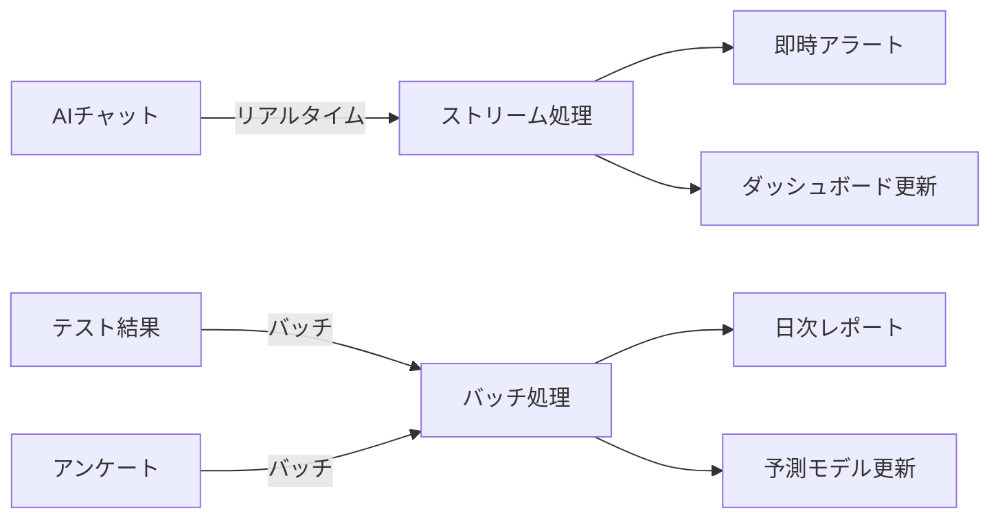

# 第2章: 測定システムの全体設計

## 導入：なぜシステム設計から始めるのか

「測定ツールはたくさんあるが、どう組み合わせればいいか分からない」
「データは集まったが、活用方法が見えない」
「プライバシーの問題でプロジェクトが頓挫した」

多くの学校でAI影響測定を試みますが、**システム全体の設計なしに始めると、必ず壁にぶつかります**。本章では、持続可能で拡張可能な測定システムの設計図を提供します。

## 2.1 測定システムの基本アーキテクチャ

### 2.1.1 3層構造モデル：シンプルかつ強力な設計

効果的な測定システムは、以下の3層構造で設計します。

```
┌─────────────────────────────────────┐
│      フィードバック層               │
│  ・ダッシュボード                   │
│  ・レポート生成                     │
│  ・アラート通知                     │
└─────────────────────────────────────┘
              ↑
┌─────────────────────────────────────┐
│         分析層                      │
│  ・統計処理                         │
│  ・機械学習                         │
│  ・パターン認識                     │
└─────────────────────────────────────┘
              ↑
┌─────────────────────────────────────┐
│      データ収集層                   │
│  ・ログ収集                         │
│  ・テスト実施                       │
│  ・アンケート                       │
└─────────────────────────────────────┘
```

#### 第1層：データ収集層
**役割**: 生データの効率的な収集と前処理

**主要コンポーネント**:
- **AIチャットログコレクター**: リアルタイムでの対話記録
- **認知テスト実施システム**: 定期的な能力測定
- **学習成果トラッカー**: 成績・課題提出状況の追跡
- **行動観察記録システム**: 教師による質的観察データ

**技術要件**:
```yaml
データ収集層の仕様:
  収集頻度:
    - リアルタイムログ: 常時
    - 認知テスト: 月1回
    - アンケート: 学期ごと
  データ形式:
    - 構造化データ: JSON, CSV
    - 非構造化データ: テキスト、音声
  ストレージ:
    - 一次保存: ローカルDB（SQLite）
    - 二次保存: クラウド（AWS S3, Google Cloud Storage）
  暗号化:
    - 転送時: TLS 1.3
    - 保存時: AES-256
```

#### 第2層：分析層
**役割**: 収集データの処理と知見の抽出

**処理パイプライン**:
```python
class AnalysisPipeline:
    def __init__(self):
        self.preprocessor = DataPreprocessor()
        self.analyzer = StatisticalAnalyzer()
        self.ml_engine = MachineLearningEngine()

    def process(self, raw_data):
        # 1. データクレンジング
        clean_data = self.preprocessor.clean(raw_data)

        # 2. 基礎統計分析
        stats = self.analyzer.calculate_statistics(clean_data)

        # 3. パターン検出
        patterns = self.ml_engine.detect_patterns(clean_data)

        # 4. 予測モデル更新
        predictions = self.ml_engine.predict_outcomes(clean_data)

        return {
            'statistics': stats,
            'patterns': patterns,
            'predictions': predictions
        }
```

**主要分析機能**:
- **記述統計**: 平均、分散、相関係数の算出
- **推論統計**: t検定、分散分析、回帰分析
- **機械学習**: クラスタリング、分類、時系列予測
- **自然言語処理**: 感情分析、トピックモデリング

#### 第3層：フィードバック層
**役割**: 分析結果の可視化と行動への転換

**ダッシュボード設計原則**:
```javascript
// ユーザー役割別ビューの実装例
const DashboardViews = {
  student: {
    widgets: ['progress_chart', 'ai_usage_meter', 'skill_radar'],
    updateFrequency: 'daily',
    permissions: ['view_own_data']
  },
  teacher: {
    widgets: ['class_overview', 'alert_panel', 'comparison_chart'],
    updateFrequency: 'real-time',
    permissions: ['view_class_data', 'export_reports']
  },
  administrator: {
    widgets: ['school_metrics', 'trend_analysis', 'risk_dashboard'],
    updateFrequency: 'weekly',
    permissions: ['view_all_data', 'modify_settings']
  }
};
```

### 2.1.2 ステークホルダー別の役割と責任

#### 役割マトリックス（RACI）

| タスク | 生徒 | 教師 | 分析担当 | 管理職 | IT担当 |
|--------|------|------|----------|--------|--------|
| データ提供 | R | R | - | - | - |
| データ収集 | I | A | R | I | C |
| 分析実施 | - | C | R | I | - |
| レポート作成 | - | C | R | A | - |
| 意思決定 | I | C | C | R | - |
| システム保守 | - | - | C | A | R |

*R=Responsible（実行責任）, A=Accountable（説明責任）, C=Consulted（相談）, I=Informed（情報共有）*

#### 各ステークホルダーの具体的責任

**生徒の役割**:
- 正直なデータ提供
- プライバシー設定の管理
- フィードバックへの応答

**教師の役割**:
- 質的観察データの入力
- 分析結果の解釈と活用
- 個別指導計画の調整

**分析担当者の役割**:
- データ品質の保証
- 統計分析の実施
- レポートの作成と配布

**管理職の役割**:
- 方針決定と承認
- リソース配分
- 外部への説明責任

### 2.1.3 データフローの設計

#### リアルタイムフローとバッチフローの使い分け



**リアルタイム処理が必要なデータ**:
- AI依存度の急激な上昇
- 学習困難のサイン
- 不適切な使用パターン

**バッチ処理で十分なデータ**:
- 月次の認知能力テスト
- 学期末の成績データ
- アンケート調査結果

### 2.1.4 プライバシーとセキュリティ考慮事項

#### プライバシー・バイ・デザイン原則

**1. 事前予防的**:
```python
class PrivacyProtector:
    def __init__(self):
        self.anonymizer = DataAnonymizer()
        self.consent_manager = ConsentManager()

    def collect_data(self, user_id, data):
        # 同意確認が最初
        if not self.consent_manager.has_consent(user_id):
            return None

        # 自動匿名化
        anonymized = self.anonymizer.process(data)

        # 最小限データのみ保存
        minimal_data = self.extract_minimal(anonymized)

        return minimal_data
```

**2. デフォルトでプライバシー保護**:
- オプトイン方式の採用
- デフォルト匿名設定
- 自動データ削除期限

**3. 完全な機能性**:
プライバシー保護と機能性の両立：
- 差分プライバシー技術の活用
- 連合学習による分散処理
- 準同型暗号での処理

#### セキュリティ実装チェックリスト

```markdown
## 必須セキュリティ対策
- [ ] データ暗号化（転送時・保存時）
- [ ] アクセス制御（役割ベース）
- [ ] 監査ログの記録
- [ ] 定期的な脆弱性診断
- [ ] インシデント対応計画
- [ ] バックアップとリカバリ
- [ ] 従業員教育プログラム
```

## 2.2 段階的導入アプローチ

### 2.2.1 パイロット期（0-3ヶ月）：基礎を固める

#### 目標とスコープ
**主要目標**:
- システムの基本動作確認
- データ収集プロセスの確立
- 初期仮説の検証

**対象範囲**:
- 1-2クラス（30-60名）
- 限定的な測定項目
- 週次レポーティング

#### 実装チェックリスト

```markdown
## 第1月：準備期間
- [ ] プロジェクトチーム結成
- [ ] 対象クラスの選定
- [ ] 保護者説明会の実施
- [ ] 同意書の収集
- [ ] 基本インフラ構築

## 第2月：データ収集開始
- [ ] AIログ収集開始
- [ ] ベースライン測定実施
- [ ] 教師研修の実施
- [ ] 初期データ品質チェック
- [ ] 週次ミーティング開始

## 第3月：初期分析と調整
- [ ] 初期分析レポート作成
- [ ] システム調整
- [ ] フィードバック収集
- [ ] 次期計画策定
- [ ] パイロット評価
```

#### 成功指標（KPI）

| 指標 | 目標値 | 測定方法 |
|------|--------|----------|
| データ収集率 | 90%以上 | 欠損データ率 |
| システム稼働率 | 95%以上 | ダウンタイム測定 |
| 教師満足度 | 70%以上 | アンケート調査 |
| 分析精度 | ベースライン確立 | 統計的検証 |

### 2.2.2 拡張期（3-9ヶ月）：規模と深度の拡大

#### スケールアップ戦略

**水平展開**（対象の拡大）:
```
月3-4: 2-4クラス（60-120名）
月5-6: 全学年の1割（200-300名）
月7-9: 全学年の3割（600-900名）
```

**垂直展開**（測定項目の深化）:
```
基礎項目（継続）:
- AIログ分析
- 月次認知テスト
- 成績追跡

追加項目（新規）:
- 感情分析
- 協働学習評価
- 創造性測定
- メタ認知評価
```

#### 高度な分析機能の追加

**機械学習モデルの導入**:
```python
class PredictiveModels:
    def __init__(self):
        self.models = {
            'dropout_risk': RandomForestClassifier(),
            'performance_predictor': GradientBoostingRegressor(),
            'dependency_detector': IsolationForest(),
            'learning_style_classifier': KMeans(n_clusters=5)
        }

    def train_models(self, training_data):
        for name, model in self.models.items():
            X, y = self.prepare_features(training_data, name)
            model.fit(X, y)
            self.evaluate_model(model, X, y, name)

    def predict_risk(self, student_data):
        features = self.extract_features(student_data)
        risks = {}
        for name, model in self.models.items():
            risks[name] = model.predict_proba(features)
        return self.aggregate_risks(risks)
```

### 2.2.3 成熟期（9ヶ月以降）：予測と最適化

#### 予測モデルの本格運用

**早期警告システム**:
```python
class EarlyWarningSystem:
    def __init__(self):
        self.threshold_config = {
            'ai_dependency': 0.7,  # 70%以上で警告
            'cognitive_decline': -0.3,  # 30%低下で警告
            'motivation_drop': -0.5  # 50%低下で警告
        }

    def generate_alerts(self, student_metrics):
        alerts = []

        # AI依存度チェック
        if student_metrics['ai_dependency'] > self.threshold_config['ai_dependency']:
            alerts.append({
                'type': 'HIGH_DEPENDENCY',
                'severity': 'warning',
                'message': 'AI依存度が閾値を超えています',
                'recommendation': '自力思考課題の増加を推奨'
            })

        # 認知能力変化チェック
        cognitive_change = student_metrics['cognitive_current'] - student_metrics['cognitive_baseline']
        if cognitive_change < self.threshold_config['cognitive_decline']:
            alerts.append({
                'type': 'COGNITIVE_DECLINE',
                'severity': 'critical',
                'message': '認知能力の有意な低下を検出',
                'recommendation': '個別介入プログラムの実施を推奨'
            })

        return alerts
```

#### 個別最適化エンジン

**AIサポートレベルの動的調整**:
```python
def optimize_ai_support(student_profile, task_difficulty, learning_objective):
    """
    学生プロファイルとタスク特性に基づいて
    最適なAIサポートレベルを決定
    """

    # 基礎能力スコア
    base_capability = student_profile['cognitive_scores']['current']

    # タスク難易度との差分
    capability_gap = task_difficulty - base_capability

    # 学習目標による調整
    if learning_objective == 'skill_development':
        # スキル開発時は低サポート
        support_modifier = -0.3
    elif learning_objective == 'content_understanding':
        # 内容理解時は中サポート
        support_modifier = 0.0
    else:  # efficiency
        # 効率重視時は高サポート
        support_modifier = 0.3

    # 最適サポートレベル計算（0-1の範囲）
    optimal_support = sigmoid(capability_gap + support_modifier)

    return {
        'support_level': optimal_support,
        'recommended_features': get_ai_features(optimal_support),
        'monitoring_frequency': get_monitoring_schedule(optimal_support)
    }
```

### 2.2.4 各段階のマイルストーンと評価基準

#### マイルストーン管理表

```markdown
## パイロット期の主要マイルストーン
M1.1: プロジェクトキックオフ（週1）
M1.2: インフラ構築完了（週4）
M1.3: データ収集開始（週5）
M1.4: 初回分析レポート（週8）
M1.5: パイロット評価完了（週12）

## 拡張期の主要マイルストーン
M2.1: 対象拡大第1弾（月4）
M2.2: 機械学習モデル導入（月5）
M2.3: リアルタイム分析開始（月6）
M2.4: 中間評価実施（月7）
M2.5: 全体システム統合（月9）

## 成熟期の主要マイルストーン
M3.1: 予測モデル本番運用（月10）
M3.2: 自動最適化開始（月12）
M3.3: 年次評価レポート（月13）
M3.4: 次年度計画策定（月14）
M3.5: システム更新（月15）
```

## 2.3 リソース要件と費用対効果

### 2.3.1 人的リソース要件

#### 必要な人材と工数

| 役割 | パイロット期 | 拡張期 | 成熟期 |
|------|-------------|--------|--------|
| プロジェクトマネージャー | 0.5FTE | 1.0FTE | 1.0FTE |
| データアナリスト | 0.5FTE | 1.0FTE | 1.5FTE |
| システムエンジニア | 0.3FTE | 0.5FTE | 0.3FTE |
| 教育コーディネーター | 0.5FTE | 1.0FTE | 0.5FTE |
| 現場教師（協力） | 2名×0.1FTE | 10名×0.1FTE | 20名×0.05FTE |

*FTE = Full Time Equivalent（フルタイム換算）*

#### スキル要件マトリックス

```yaml
プロジェクトマネージャー:
  必須スキル:
    - プロジェクト管理経験: 3年以上
    - 教育現場の理解: 必須
    - データ分析基礎: 望ましい
  推奨資格:
    - PMP or PRINCE2
    - 教員免許（あれば尚可）

データアナリスト:
  必須スキル:
    - 統計解析: R or Python
    - 機械学習: scikit-learn等
    - 可視化: Tableau or PowerBI
  推奨資格:
    - 統計検定2級以上
    - データサイエンティスト資格
```

### 2.3.2 技術的リソース要件

#### ハードウェア要件

```yaml
開発・テスト環境:
  サーバー:
    CPU: 8コア以上
    メモリ: 32GB以上
    ストレージ: SSD 1TB以上

本番環境:
  データ収集サーバー:
    スペック: AWS EC2 t3.large相当
    台数: 2台（冗長構成）

  分析サーバー:
    スペック: AWS EC2 m5.xlarge相当
    GPU: オプション（深層学習使用時）

  データベースサーバー:
    スペック: AWS RDS db.t3.medium相当
    ストレージ: 500GB（自動拡張）
```

#### ソフトウェアライセンス

| ソフトウェア | 用途 | ライセンス形態 | 年間費用 |
|-------------|------|--------------|----------|
| Python/R | 分析 | OSS（無料） | ¥0 |
| PostgreSQL | DB | OSS（無料） | ¥0 |
| Tableau | 可視化 | Creator×2 | ¥200,000 |
| Office365 | 協働 | E3×10 | ¥360,000 |
| AWS | インフラ | 従量制 | ¥600,000 |

### 2.3.3 予算計画テンプレート

#### 3年間の予算推移

```python
def calculate_budget(year):
    """年次予算を計算"""

    base_costs = {
        'personnel': {
            1: 8_000_000,  # パイロット期
            2: 15_000_000,  # 拡張期
            3: 12_000_000   # 成熟期（効率化）
        },
        'technology': {
            1: 2_000_000,  # 初期投資
            2: 1_500_000,  # ライセンス＋拡張
            3: 1_200_000   # 維持管理
        },
        'training': {
            1: 1_000_000,  # 集中研修
            2: 500_000,    # 継続研修
            3: 300_000     # 更新研修
        },
        'external': {
            1: 2_000_000,  # コンサル費用
            2: 500_000,    # 監査費用
            3: 500_000     # 監査費用
        }
    }

    total = sum(costs[year] for costs in base_costs.values())

    return {
        'breakdown': base_costs,
        'total': total,
        'monthly': total / 12
    }

# 3年間の総予算
total_budget = sum(calculate_budget(y)['total'] for y in [1, 2, 3])
print(f"3年間総予算: ¥{total_budget:,}")  # ¥42,500,000
```

### 2.3.4 費用対効果（ROI）の計算

#### 定量的効果の金銭価値換算

```python
def calculate_roi(investment, improvements):
    """
    ROI = (利益 - 投資) / 投資 × 100
    """

    # 定量的利益の計算
    benefits = {
        # 教師の時間削減効果
        'teacher_time': {
            'hours_saved': 100,  # 年間削減時間/教師
            'teachers': 20,
            'hourly_rate': 3000,
            'annual_value': 100 * 20 * 3000  # ¥6,000,000
        },

        # 学習効果向上による追加授業削減
        'tutoring_reduction': {
            'students_improved': 100,
            'tutoring_cost_saved': 50000,
            'annual_value': 100 * 50000  # ¥5,000,000
        },

        # 早期介入による留年率低下
        'retention_reduction': {
            'students_saved': 5,
            'cost_per_retention': 1000000,
            'annual_value': 5 * 1000000  # ¥5,000,000
        }
    }

    total_benefits = sum(b['annual_value'] for b in benefits.values())

    roi = ((total_benefits - investment) / investment) * 100
    payback_period = investment / total_benefits  # 年

    return {
        'roi_percentage': roi,
        'payback_years': payback_period,
        'annual_benefits': total_benefits,
        'net_present_value': calculate_npv(investment, total_benefits, years=3)
    }
```

#### 定性的効果の評価

**測定困難だが重要な効果**:
- 教育の質向上
- 生徒の将来性向上
- 学校のブランド価値
- 教師のモチベーション
- 保護者の満足度

**定性的効果の数値化手法**:
```python
def quantify_qualitative_benefits():
    """定性的効果を間接的に数値化"""

    indicators = {
        'education_quality': {
            'metric': '大学進学率の向上',
            'baseline': 0.60,
            'improved': 0.65,
            'value_per_percent': 2000000
        },
        'school_brand': {
            'metric': '志願者数の増加',
            'baseline': 500,
            'improved': 550,
            'value_per_student': 100000
        },
        'teacher_satisfaction': {
            'metric': '離職率の低下',
            'baseline': 0.15,
            'improved': 0.10,
            'replacement_cost': 3000000
        }
    }

    total_value = 0
    for name, ind in indicators.items():
        improvement = ind['improved'] - ind['baseline']
        if 'value_per_percent' in ind:
            value = improvement * 100 * ind['value_per_percent']
        elif 'value_per_student' in ind:
            value = improvement * ind['value_per_student']
        else:
            value = improvement * ind['replacement_cost'] * 20  # 教師数

        total_value += value

    return total_value
```

## 本章のまとめ：設計から実装へ

本章では、AI影響測定システムの包括的な設計を提示しました。

### 重要ポイント

1. **3層アーキテクチャ**により、拡張性と保守性を確保
2. **段階的導入**により、リスクを最小化しながら着実に展開
3. **ROI分析**により、投資の正当性を定量的に示す

### 成功の鍵

```markdown
## システム設計成功のチェックリスト
- [ ] ステークホルダーの合意形成
- [ ] 明確な役割分担（RACI）
- [ ] プライバシー・バイ・デザイン
- [ ] 段階的展開計画
- [ ] 予算とROIの明確化
- [ ] 継続的改善プロセス
```

### 次章への橋渡し

システムの全体像を把握した今、第3章では具体的な認知能力測定ツールの選択と実装方法を詳しく解説します。理論と設計を実践に移す、最も重要なステップです。