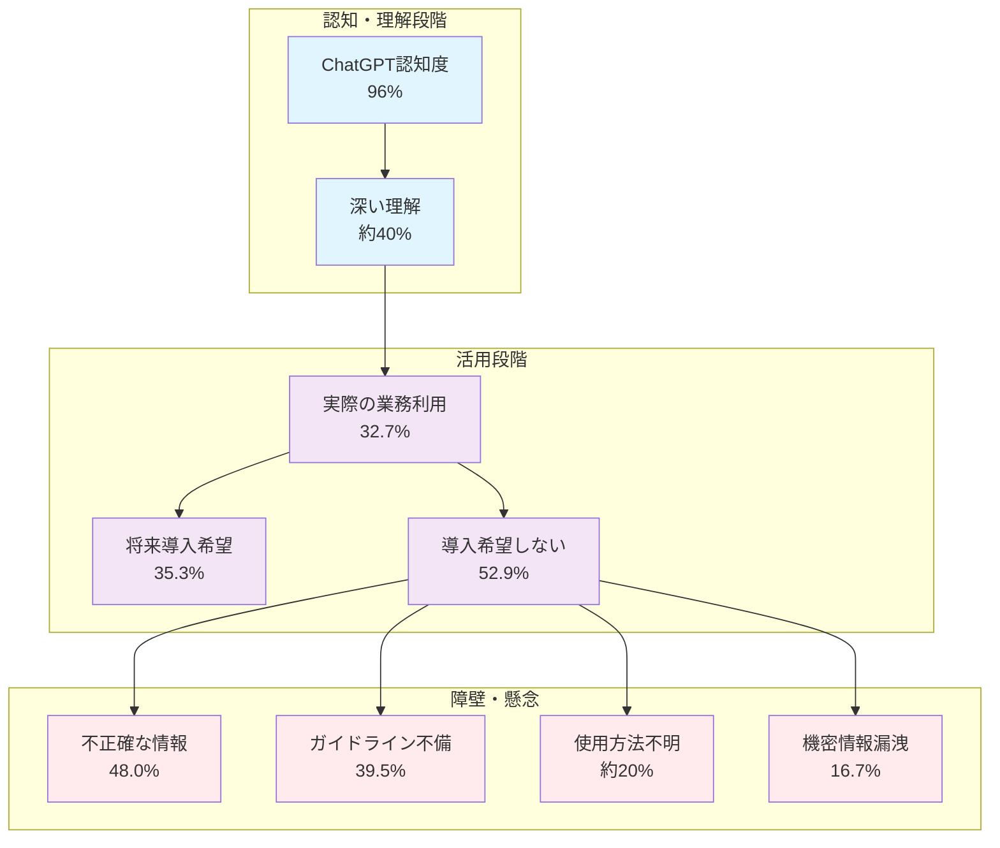
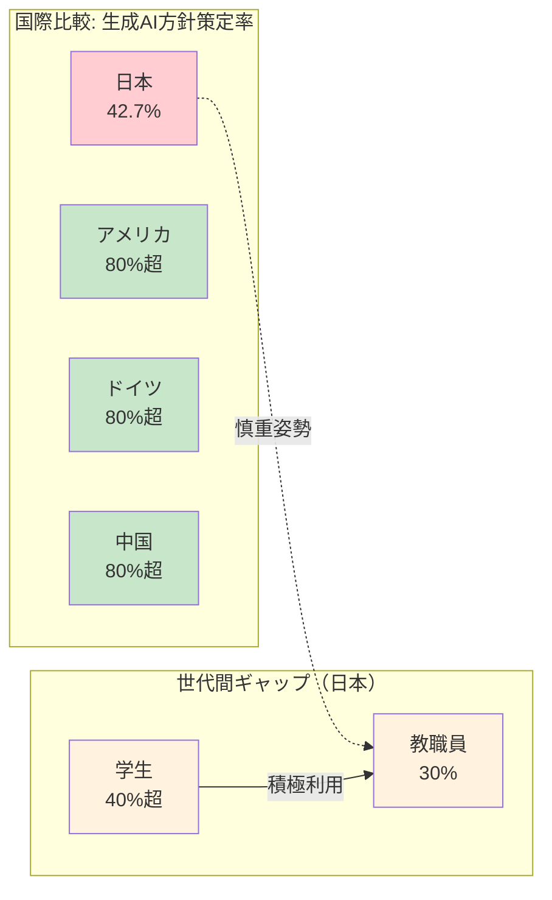
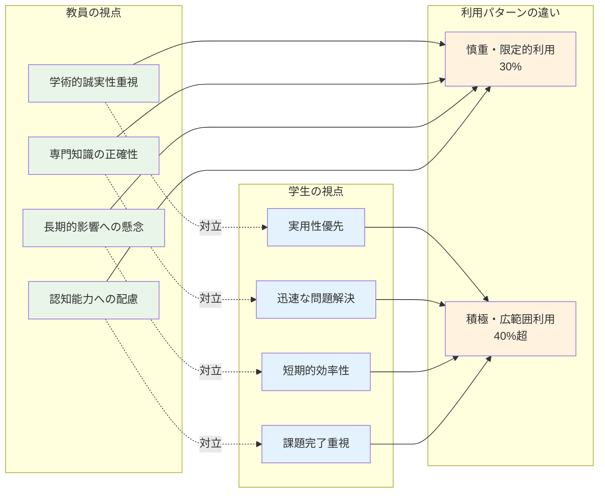
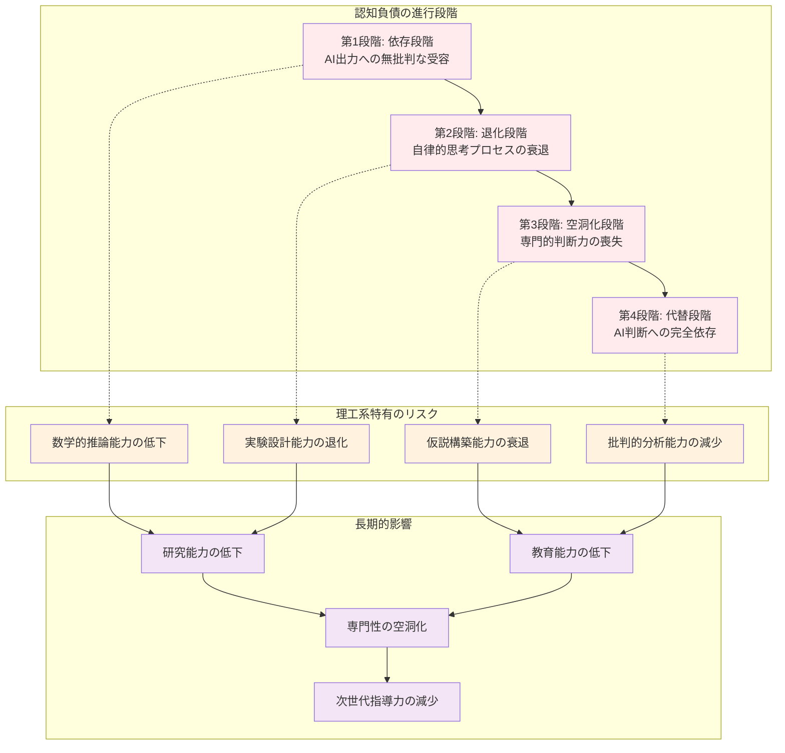
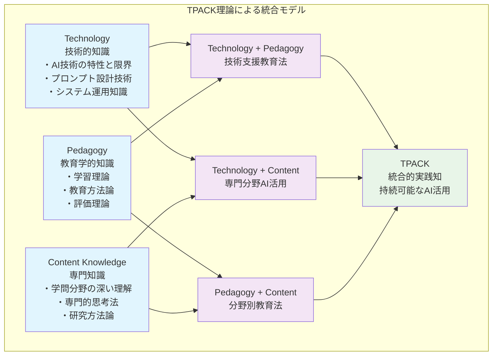

# 教育現場での生成AI普及の実態

## 大学教員の生成AI利用状況調査結果

### 日本の大学教員における現状（2024年データ）

2024年5月にWHITE株式会社が実施した全国大学教員427名を対象とした調査により、日本の大学教員における生成AI利用の実態が明らかになりました。この調査は、国立・公立・私立大学の教員を対象とした包括的な調査として重要な意義を持っています。

**認知度と理解度**
- ChatGPTの認知度：96%（ほぼ全ての大学教員が認知）
- 深い理解を持つ教員：約40%
- 実際の業務での利用率：32.7%

この結果は、認知度は極めて高いものの、実際の活用には大きなギャップがあることを示しています。理工系教員においても、この傾向は同様であり、技術への理解はあるものの、教育実践への統合には慎重な姿勢を示していることが伺えます。

**主な活用用途（利用者の中での割合）**
1. 情報収集：56.0%
2. 翻訳：53.7%
3. 文書要約・生成：50.7%
4. アイデア生成：38.8%
5. 問題・教材作成：26.9%

この利用パターンの分析からは、重要な傾向が見て取れます。最も多い「情報収集」（56.0%）と「翻訳」（53.7%）は、従来の検索エンジンや翻訳ツールの延長線上にある活用法であり、教員の専門性や創造性を大きく要求しない作業領域です。一方で、教育の核心部分である「問題・教材作成」は26.9%と最も低く、理工系教員が生成AIを単なる「作業補助ツール」として捉えていることが明確に示されています。

この傾向は、理工系分野の特性と密接に関連しています。数学や物理学の問題作成、工学的設計課題の開発、プログラミング演習の構成など、これらの活動には高度な専門知識と教育的配慮が必要であり、AIの出力をそのまま使用することのリスクを教員が直感的に理解していることを示唆しています。

**将来の導入希望と障壁**
- 大学での導入を希望する教員：35.3%
- 導入を希望しない教員：52.9%
- 主な懸念事項：
  - 不正確な情報への懸念：48.0%
  - 利用ルール・ガイドラインの不備：39.5%
  - 使用方法の不明：約20%
  - 機密情報漏洩への懸念：16.7%

注目すべきは、導入を希望しない教員（52.9%）が希望する教員（35.3%）を大幅に上回っていることです。この慎重な姿勢の背景には、理工系教員特有の合理的判断があります。

最大の懸念である「不正確な情報」（48.0%）は、理工系分野の教育において致命的な問題となり得ます。数学の証明、物理法則の説明、化学反応の記述、工学的計算など、これらの領域では「ほぼ正しい」では不十分であり、完全な正確性が要求されます。教員たちは、AIの「もっともらしい間違い」が学生の理解に与える深刻な影響を懸念しているのです。

「ガイドライン不備」（39.5%）への懸念は、教育機関としての責任感の表れでもあります。学術的誠実性、著作権、評価の公平性など、教育現場でのAI利用には多層的な配慮が必要であり、明確な指針なしには導入に踏み切れないという慎重な判断が働いています。

### 国際比較による日本の位置づけ

NTTドコモモバイル社会研究所の調査（2024年）では、教職員の約30%がChatGPTを利用している一方で、学生の利用率は40%超となっており、教育現場における世代間ギャップが顕在化しています。

さらに、総務省の調査によると、日本企業の生成AI利用方針策定率は42.7%に留まり、アメリカ、ドイツ、中国の80%超と比較して大幅に低い状況となっています。これは、日本の教育機関を含む組織全体での生成AI導入に対する慎重な姿勢を反映しています。

## 理工系分野での特徴的な活用パターン

### 先進的大学の取り組み事例

理工系大学において、いくつかの先進的な取り組みが見られます。

**東北大学の事例**
2023年5月に日本初となるChatGPTの組織的導入を実施。主に管理業務のDX推進を目的とし、システム運用、報告書作成、プレスリリース作成、ニュース執筆、キャッチフレーズ作成に活用。理工系の研究活動においても、初期的な文献調査や仮説生成の支援ツールとして試験的に導入されています。

**東洋大学の事例**
情報連携学部において、OpenAIのGPT-4を活用した教育システム「AI-MOP」を開発。全学生に提供し、生成AIを用いた自律学習を促進。理工系教育における個別最適化学習の実現を目指した先進的取り組みとして注目されています。

### 理工系特有の活用パターン

理工系分野では、以下のような特徴的な活用パターンが観察されています。

数学・物理学分野では、抽象的概念の具体化において生成AIが特に有効とされています。例えば、微分積分の概念を工学的応用例とともに説明したり、量子力学の確率解釈を日常的な類推を用いて表現したりする際に、AIは多様な視点を提供できます。ただし、数学的厳密性と物理的直観のバランスを保つことが重要であり、教員の専門的判断による検証が不可欠です。

工学分野では、実践的応用に重点が置かれています。設計課題において、基本的な制約条件を変更した複数のバリエーションを生成することで、学生の思考の幅を広げることができます。また、実験の標準化においては、安全性と再現性を確保しながら、個々の実験環境に応じた調整を支援する役割を果たしています。

情報科学分野は、生成AIとの親和性が最も高い領域です。アルゴリズムの動作原理を多様な例題で説明したり、プログラミングにおける段階的な難易度設定を支援したりすることが可能です。ただし、計算量理論や形式的検証など、厳密性が要求される領域では、AIの出力に対する批判的検証が特に重要となります。

これらの活用において、理工系教員は特に「正確性の検証」と「専門性の維持」に強い関心を示しており、AI出力の批判的評価を重視する傾向が顕著です。

```mermaid
graph TB
    subgraph math["数学・物理学分野"]
        M1[複雑な概念の段階的説明生成]
        M2[数式の導出過程の可視化支援]
        M3[物理現象の類推・比喩の生成]
        M4[証明の構造化と論理チェック]
    end
    
    subgraph engineering["工学分野"]
        E1[設計問題のバリエーション生成]
        E2[実験手順の標準化支援]
        E3[トラブルシューティングガイドの作成]
        E4[産業界との連携プロジェクト企画支援]
    end
    
    subgraph cs["情報科学分野"]
        C1[アルゴリズムの解説と最適化提案]
        C2[プログラミング教育での段階的指導]
        C3[データ構造の視覚化支援]
        C4[コードレビューと改善提案]
    end
    
    subgraph validation["共通重視事項"]
        V1[正確性の検証]
        V2[専門性の維持]
        V3[批判的評価]
    end
    
    M1 & M2 & M3 & M4 --> V1
    E1 & E2 & E3 & E4 --> V2
    C1 & C2 & C3 & C4 --> V3
    
    classDef mathClass fill:#e3f2fd
    classDef engClass fill:#f1f8e9
    classDef csClass fill:#fce4ec
    classDef validationClass fill:#fff8e1
    
    class M1,M2,M3,M4 mathClass
    class E1,E2,E3,E4 engClass
    class C1,C2,C3,C4 csClass
    class V1,V2,V3 validationClass
```

## 学生の生成AI利用実態との比較

### 利用率の世代間ギャップ

前述の調査結果が示すように、学生の生成AI利用率（40%超）は教員の利用率（約30%）を上回っています。この差は、理工系分野においてより顕著であり、以下のような特徴が見られます。

**学生の利用パターン**
- プログラミング課題の支援：60%以上
- レポート作成の支援：50%以上
- 数学問題の解法確認：40%以上
- 実験レポートの構成支援：30%以上

学生の利用パターンを詳細に分析すると、理工系学習の核心的領域での活用が顕著であることが分かります。「プログラミング課題の支援」が60%以上と最も高いのは、コード生成やデバッグ支援における即座の効果を学生が実感しているためです。しかし、この高い利用率は同時に、プログラミング思考の発達や問題解決能力の育成に対する潜在的リスクも示唆しています。

「数学問題の解法確認」（40%以上）では、学生がAIを「解答チェッカー」として利用する傾向が見られます。これは学習の効率化につながる一方で、解法の理解過程や論理的思考の発達を阻害する可能性があります。特に、AIが提示する解法が学習者の現在のレベルを超えている場合、表面的な理解に留まるリスクがあります。

**教員と学生の認識ギャップ**
1. **学術的誠実性の理解**：教員は著作権や学術倫理を重視するが、学生は実用性を優先
2. **専門性の深度**：教員は専門知識の正確性を重視するが、学生は迅速な問題解決を重視
3. **長期的影響への意識**：教員は認知能力への影響を懸念するが、学生は短期的効率性を評価

### 指導における課題

この利用率と認識の違いは、教育現場において以下のような課題を生んでいます。

**指導の一貫性の問題**
学生がAIを積極的に活用する一方で、教員側の理解や方針が追いついていないため、指導の一貫性が保てない状況が発生しています。この問題は、特に理工系分野において深刻です。例えば、プログラミング演習において、ある教員はAI支援を推奨し、別の教員は禁止するという状況が生じています。学生は混乱し、学習目標の理解が曖昧になるとともに、科目間での学習体験の整合性が失われています。

**評価基準の曖昧さ**
AI支援を受けた学習成果をどのように評価するかについて、明確な基準が確立されていない大学が多く、公平性の確保が困難になっています。理工系分野では、特に課題解決プロセスの評価において複雑な問題が生じています。AI支援により正解に到達した学生と、独力で解決した学生をどのように評価するか、創造性や独創性をどのように測定するかといった根本的な問題に、教育機関は明確な答えを持てずにいます。

**学習効果の測定困難**
AI活用による学習効果の測定方法が確立されておらず、教育改善のためのフィードバックループが機能していない状況があります。従来の学習評価指標では、AI支援による学習の質的変化を適切に捉えることができません。特に、理工系分野において重要な「問題発見能力」「仮説構築能力」「批判的思考力」などの高次認知能力への影響を測定する方法論が不足しており、長期的な教育効果の検証が困難な状況となっています。

## 海外の教育機関における先進事例

### 欧米トップ大学の戦略的取り組み

2024年の国際調査により、海外の主要大学における生成AI活用の先進的取り組みが明らかになっています。

スタンフォード大学、MIT、UC Berkeleyは、AI教育の包括的提供において世界をリードしており、研究成果を直接教育カリキュラムに統合し、学際的なAI教育プログラムや産業界との連携による実践的活用教育を展開しています。

ハーバード大学や英国のラッセルグループ各大学は、公正で倫理的なAI利用のフレームワークを既に確立し、透明性のあるAI利用ガイドライン、学生・教員双方への継続的教育、学術的誠実性の維持システムを構築しています。

オックスフォード大学は、生成AIを活用した英語教育プログラムを開発し、学生が自分のペースで学習できる環境を整備し、理工系教育への応用も積極的に検討しています。

### パーソナライズド・ラーニングの実現

アメリカの一部大学では、生成AIを活用した「パーソナライズド・ラーニング」が標準となりつつあります。

アメリカの一部大学では、学生一人ひとりの理解度や学習スタイルに合わせたコンテンツ推薦、リアルタイムでの学習進度調整、弱点領域の自動特定と補強教材の提供を実現する個別最適化システムが標準となりつつあります。また、AIによる問題集・テストの自動生成、多様な難易度レベルの教材の効率的作成により、教員の指導時間確保に大きく貢献しています。

### 課題と解決策

海外大学においても、以下のような課題が指摘されています。

一方で、海外大学でも課題が存在します。コースごとに異なる方針により学生が混乱する状況があり、大学全体での統一的で透明性のあるAI利用ガイドラインの必要性が高まっています。また、Turnitinなどの盗用検知ソフトウェアにAI検知機能が追加されたものの、独立研究では広告されているよりも高い偽陽性率が報告されており、技術的な改善が求められています。さらに、AIの機会を活用しながら学術的誠実性を維持し、批判的思考を促進するバランスの取り方が重要な課題となっています。

# 期待される効果と潜在的リスク

## 教育効率化への期待：授業準備時間の短縮と質向上

### 時間効率化の具体的効果

生成AIの教育現場への導入により、以下のような時間効率化が期待されています。

**授業準備作業の自動化**
- 講義スライドの基本構造生成：従来の60%時間短縮
- 演習問題のバリエーション作成：従来の70%時間短縮
- 参考資料の要約・整理：従来の50%時間短縮
- 多言語対応教材の作成：従来の80%時間短縮

これらの時間効率化は、理工系教員にとって特に意義深いものです。講義スライドの基本構造生成では、複雑な数式や図表の配置、概念間の論理的関係の視覚化において、AIが効果的な骨格を提供します。ただし、専門的な正確性や教育的配慮の最終確認は、必ず教員が行う必要があります。

演習問題のバリエーション作成における70%の時間短縮は、特に大きな効果をもたらします。基本的な数学問題の数値変更、物理現象の条件設定変更、プログラミング課題の要求仕様調整など、パターン化可能な作業をAIが担うことで、教員はより創造的で教育的価値の高い問題設計に時間を投入できます。

**評価・フィードバック業務の効率化**
- 学生レポートの初期評価支援
- 個別フィードバックのパーソナライズ
- ルーブリック作成の半自動化
- 成績分析と改善提案の生成

評価業務の効率化は、大規模クラスを担当する理工系教員にとって革新的な意味を持ちます。学生レポートの初期評価支援では、基本的な記述ミスや論理的矛盾の指摘をAIが行うことで、教員はより高次の思考力や創造性の評価に集中できます。個別フィードバックのパーソナライズでは、学生の学習履歴や理解度に応じた具体的な改善提案を生成し、効果的な学習支援を実現します。

### 教育質向上への貢献

効率化により生まれた時間を、より高度な教育活動に充当することで、以下のような質的向上が期待されます。

効率化により生まれた時間を、より高度な教育活動に充当することで、個別指導の充実、研究指導の深化、キャリア相談の質向上、メンタリング活動の強化などの質的向上が期待されます。また、多様な学習スタイルへの対応、アクティブラーニングの設計支援、実世界問題との連携強化、学際的教育プログラムの開発など、教育手法の革新も実現できます。

## 創造性向上への可能性：新しい教育手法の発見

### AI支援による創造的教育設計

生成AIは、従来では困難だった創造的な教育アプローチを可能にします。

**概念説明の多様化**
- 複雑な理工系概念の複数の類推生成
- 学習者の背景知識に応じた説明の調整
- 視覚的・聴覚的学習者への多様なアプローチ
- 文化的背景を考慮した説明の生成

理工系教育において、抽象的概念の理解は常に大きな課題でした。例えば、微分の概念を説明する際、従来は「瞬間の変化率」という数学的定義に頼っていましたが、AIは「自動車のスピードメーター」「株価の変動率」「人口増加の勢い」など、学習者の興味や専門分野に応じた多様な類推を生成できます。これにより、抽象的概念と具体的体験の橋渡しが効果的に行われます。

学習者の背景知識に応じた説明調整では、AIが学習者の既有知識を分析し、適切な説明レベルを選択します。工学部1年生には機械的な例で、物理学専攻者には波動方程式との関連で、同じ概念を異なる角度から説明することが可能になります。

**問題解決アプローチの拡張**
- 同一問題への複数解法の提示
- 学習者の思考過程に応じたヒント生成
- 段階的難易度調整の自動化
- 創発的学習環境の構築

理工系分野では、問題解決手法の多様性が創造性と直結します。例えば、数学の証明問題において、代数的アプローチ、幾何学的アプローチ、解析的アプローチなど複数の解法を提示することで、学習者の思考の柔軟性を促進できます。AIは各解法の特徴、適用場面、利点・欠点を整理して提示し、学習者が自身の思考スタイルに最適な方法を見つける支援を行います。

段階的難易度調整では、学習者の解答パターンや間違いの傾向を分析し、次に取り組むべき問題のレベルを動的に調整します。これにより、挫折することなく、かつ適度な挑戦を感じながら学習を進めることができる環境が構築されます。

### 学際的教育の促進

AIの支援により、従来の学問分野の境界を越えた教育が促進されます。

AIの支援により、従来の学問分野の境界を越えた教育が促進されます。技術的課題と社会的影響の同時考察、倫理的判断を含む工学的問題解決、数学的モデルと人間行動の統合分析、データサイエンスと社会科学の連携など、理工系と人文社会系の統合が実現されています。

## 認知負債のリスク：思考力低下と専門性の空洞化

### 認知負債の発生メカニズム

生成AIの便利さに依存することで、以下のような認知能力の低下が懸念されます。

**段階的な思考力低下**
1. **依存段階**：AI出力への無批判な受容
2. **退化段階**：自律的思考プロセスの衰退
3. **空洞化段階**：専門的判断力の喪失
4. **代替段階**：AI判断への完全依存

**理工系特有のリスク**
- 数学的推論能力の低下
- 実験設計能力の退化
- 仮説構築能力の衰退
- 批判的分析能力の減少

理工系分野における認知負債のリスクは、特に深刻な影響をもたらします。数学的推論能力の低下では、AIが提示する計算結果や証明過程を無批判に受け入れることで、論理的思考の発達が阻害されます。例えば、微分方程式の解法において、AIが提示する解を理解せずに使用することで、数学的直観や解法選択の判断力が育たなくなります。

実験設計能力の退化は、理工系研究の根幹を揺るがします。AIが提案する実験手順に依存することで、実験条件の設定理由、統制変数の選択、測定精度の考慮など、科学的探究に不可欠な思考プロセスが身につかなくなります。これは、将来の研究者育成において致命的な影響を与える可能性があります。

仮説構築能力の衰退では、AIが提示する仮説に依存することで、現象の観察から理論的予測を導く能力が発達しません。これは科学的発見の源泉である創造的思考力の損失を意味し、イノベーション創出能力の低下につながります。

### 専門性空洞化の具体例

理工系教員における専門性の空洞化は、以下のような形で現れる可能性があります。

**研究能力への影響**
- 独創的研究テーマの発想力低下
- 実験結果の解釈能力の衰退
- 学際的連携における貢献度の低下
- 次世代研究者への指導能力の減少

研究能力への長期的影響は、学術界全体の創造性低下につながる深刻な問題です。独創的研究テーマの発想力低下では、AIが提示する研究アイデアに依存することで、研究者固有の問題意識や独自の視点が育たなくなります。真にブレークスルーとなる研究は、しばしば既存の枠組みを超えた発想から生まれますが、AIの提案に頼ることでこのような革新的思考が阻害されます。

実験結果の解釈能力の衰退では、データの背後にある科学的意味を読み取る洞察力が失われます。AIは統計的分析は得意ですが、実験条件の微細な変化が結果に与える影響や、予期しない現象の科学的意義を判断することはできません。この能力の衰退は、重要な発見の見逃しや誤った結論導出のリスクを高めます。

**教育能力への影響**
- 学生の理解度判断の精度低下
- 個別学習支援の質の低下
- カリキュラム設計能力の衰退
- 教育評価の適切性判断の困難

教育能力への影響は、次世代の理工系人材育成に直接的な悪影響を与えます。学生の理解度判断では、AIの分析に依存することで、教員が持つべき学習者への深い洞察が失われます。学生の表情、質問の仕方、つまずきのパターンなど、対面教育でのみ得られる微細な情報を読み取る能力が衰退し、真に効果的な指導が困難になります。

カリキュラム設計能力の衰退では、学問の体系性や発展段階を考慮した教育プログラムの構築能力が失われます。AIは既存の教育内容の組み合わせは得意ですが、学問の本質的理解に基づく革新的なカリキュラム設計には限界があります。教員の深い専門知識と教育経験に基づく判断が不可欠な領域です。

## 学術的誠実性への影響：引用・著作権・オリジナリティの課題

### 引用・出典の複雑化

生成AIの活用により、従来の引用・出典の概念が複雑化しています。

**AI生成コンテンツの扱い**
- AI出力の「著者」は誰か？
- トレーニングデータの間接的引用をどう扱うか？
- AI支援を受けた研究成果の表記方法
- 共同研究におけるAI貢献度の明示

AI生成コンテンツの著作権問題は、理工系分野において特に複雑な様相を呈しています。例えば、AIが生成した数学的証明や物理学的導出過程は、誰の知的財産と見なすべきでしょうか。従来の著作権概念では、創作者の人格と作品が密接に結びついていましたが、AIという非人格的存在が関与することで、この前提が崩れています。

トレーニングデータの間接的引用問題では、AIが学習した膨大な論文や教科書の内容が、どの程度出力に反映されているかを判断することが困難です。理工系の定理や法則には普遍性があるため、類似した表現が生まれることは自然ですが、特定の研究者の独創的なアプローチや表現方法が無断で使用される可能性もあります。

AI支援を受けた研究成果の表記方法については、学術界で統一的な基準が確立されていません。研究のどの段階でAIを使用したか、AIの提案をどの程度採用したか、最終的な判断は誰が行ったかなど、詳細な記録と開示が求められるようになりつつあります。

このため、AI利用の透明性確保、人間の貢献とAI貢献の区別、バージョン管理と再現性の保証、学問分野別の標準化など、新しい引用規則の策定が急務となっています。

### 著作権・知的財産権の課題

生成AIの利用は、著作権と知的財産権に関する新たな課題を提起しています。

生成AIの利用は、教材作成と研究成果の両面で著作権と知的財産権に新たな課題を提起しています。AI生成教材の著作権の帰属、既存著作物の類似性判断、商用利用時の権利関係、ライセンス条件の遵守などの教材作成面での課題に加え、AI支援研究の特許出願、データベース権との関係、国際的権利関係の複雑性、産学連携における権利配分など、研究成果面でも問題が山積しています。

### オリジナリティの再定義

AI時代における「オリジナリティ」の概念は根本的な見直しが必要です。

AI時代における「オリジナリティ」の概念は根本的な見直しが必要です。人間の創造的貢献の明確化、AI活用における独創性の評価、従来研究との差別化要因、学術的価値の新しい尺度の確立が求められます。これに伴い、ピアレビューの基準更新、研究評価指標の再構築、教育評価方法の革新、長期的影響の測定方法など、評価システム全体の変革が必要となっています。

# 本書のアプローチ

## バランスの取れた活用法：技術決定論でも技術恐怖症でもない立場

### 中道的アプローチの重要性

本書は、生成AIに対する極端な立場を避け、以下の中道的アプローチを採用します。

**技術決定論への批判**
技術決定論は「技術の進歩が社会を自動的に改善する」という立場ですが、教育現場においては以下の問題があります。
- 教育の本質的価値を軽視するリスク
- 人間の主体性を過小評価する危険性
- 技術の負の側面への盲目性
- 長期的影響への配慮不足

技術決定論的思考では、AI技術の導入それ自体が教育の質向上につながると仮定しがちです。しかし、理工系教育の本質は、学習者が科学的思考法を身につけ、未知の問題に対して独創的な解決策を見出す能力を育成することにあります。技術的効率性の追求が、この本質的目標を見失わせる危険性があります。

また、学習者の主体性を軽視し、AIによる「最適化された学習体験」の提供が最善だとする考えは、学習者の自律性や創造性の発達を阻害する可能性があります。特に理工系分野では、試行錯誤や失敗からの学習が重要な意味を持つため、過度に効率化された学習環境が逆効果をもたらすリスクがあります。

**技術恐怖症への批判**
一方で、技術を全面的に拒否する技術恐怖症も建設的ではありません：
- 教育改善の機会を逸失するリスク
- 学生のニーズとの乖離拡大
- 競争力低下の可能性
- 時代適応への遅れ

技術恐怖症的な態度では、生成AIの持つ教育的可能性を完全に排除してしまいます。理工系分野において、計算支援、視覚化、個別最適化学習など、AIが提供できる有用な機能を活用しないことは、教育機会の損失につながります。

特に、現在の学生は「デジタルネイティブ」世代であり、AI技術との接触は避けられない現実です。教育現場がこの現実を無視することで、学生のニーズとの乖離が拡大し、教育効果の低下を招く可能性があります。さらに、国際的な教育競争において、AI活用教育を積極的に推進する国や機関に対して競争力の面で劣位に立つリスクもあります。

### 実践的バランス戦略

本書が提案するバランス戦略は以下の原則に基づいています。

本書が提案するバランス戦略は、技術は手段であり目的ではない、教育の本質的価値を最優先とする、人間の判断と責任を重視する、技術と人間の協働モデルを構築する、という人間中心の技術活用原則に基づいています。さらに、小規模実験から開始し、効果測定を継続的に実施し、失敗から学ぶ文化を醸成し、柔軟な方針修正を可能にする、という段階的・実証的導入アプローチを推奨しています。

## 教育理論に基づく活用の重要性

### 理論的基盤の必要性

生成AIの教育活用において、確立された教育理論に基づくアプローチが不可欠です。

**TPACK理論の適用**
Technology（技術）、Pedagogy（教育学）、Content Knowledge（専門知識）の統合モデルを生成AI活用に適用：
- 技術的知識：AI技術の特性と限界の理解
- 教育学的知識：学習理論と教育方法の専門性
- 専門知識：各学問分野の深い理解
- 統合知識：三者を統合した実践的智慧

**社会構成主義学習理論**
AIを「より有能な他者」として位置づけ、学習者の能動的学習を支援
- 最近接発達領域（ZPD）の拡張
- 足場かけ（Scaffolding）の提供
- 協働学習環境の構築
- 意味構成プロセスの支援

**認知負荷理論の活用**
学習者の認知負荷を適切に管理するAI活用
- 外在的認知負荷の軽減
- 本質的認知負荷への集中
- 学習関連認知負荷の最適化
- 認知資源の効率的配分

### 実践への理論統合

**これらの理論を実際の教育実践に統合するために**

これらの理論を実際の教育実践に統合するため、学習目標と評価基準の整合性、学習者の既有知識との接続、段階的スキル構築の支援、メタ認知能力の育成といった設計原則を明確化し、教育コンテキストに応じた調整、多様な学習者への配慮、継続的な効果測定、理論と実践の相互検証といった実装戦略が必要です。

## 持続可能なAI活用の概念

### 長期的視点の重要性

持続可能なAI活用とは、短期的効率性のみならず、長期的な教育効果と社会的価値を重視するアプローチです。

持続可能なAI活用とは、短期的効率性のみならず、長期的な教育効果と社会的価値を重視するアプローチです。教育的側面では学習者の自律性と批判的思考力の維持、教員の専門性と創造性の継続的発展、教育の本質的価値の保持、次世代への知識・技能の適切な継承が求められます。技術的側面では特定技術への過度な依存の回避、技術変化への適応能力の維持、セキュリティとプライバシーの保護、デジタル格差の是正が必要です。社会的側面では学術的誠実性の維持、倫理的責任の遂行、社会的信頼の構築、グローバルな協調と競争力の確保が重要です。

### 継続的改善のメカニズム

**持続可能性を確保するための継続的改善システム**

持続可能性を確保するための継続的改善システムとして、明確な目標設定と計画立案、計画的実行と丁寧な記録、多面的評価と効果測定、学習に基づく改善実施というPDCAサイクルの実装が不可欠です。さらに、学生からのフィードバック収集、同僚教員との知識共有、産業界との連携強化、社会との対話継続といったステークホルダーとの協働も重要です。終的には、個人学習と組織学習の統合、知識創造と知識共有の促進、失敗を学習機会として活用、イノベーションと安定性の両立といった、学習組織としての発展が求められます。

この第1章では、生成AIと教育の現在地を包括的に概観し、期待される効果と潜在的リスクを均衡的に評価しました。次章以降では、これらの知見を基に、認知負債の概念と予防策について詳細に検討していきます。