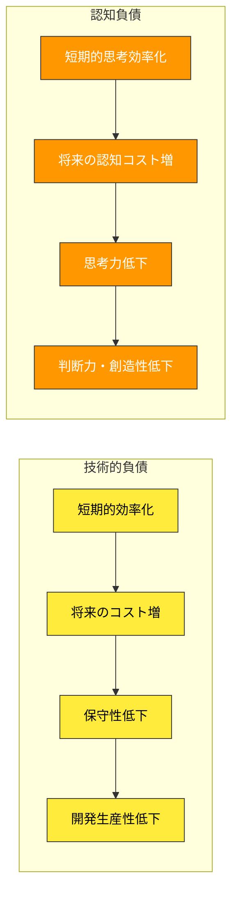
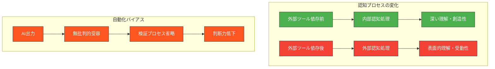
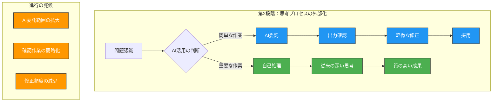
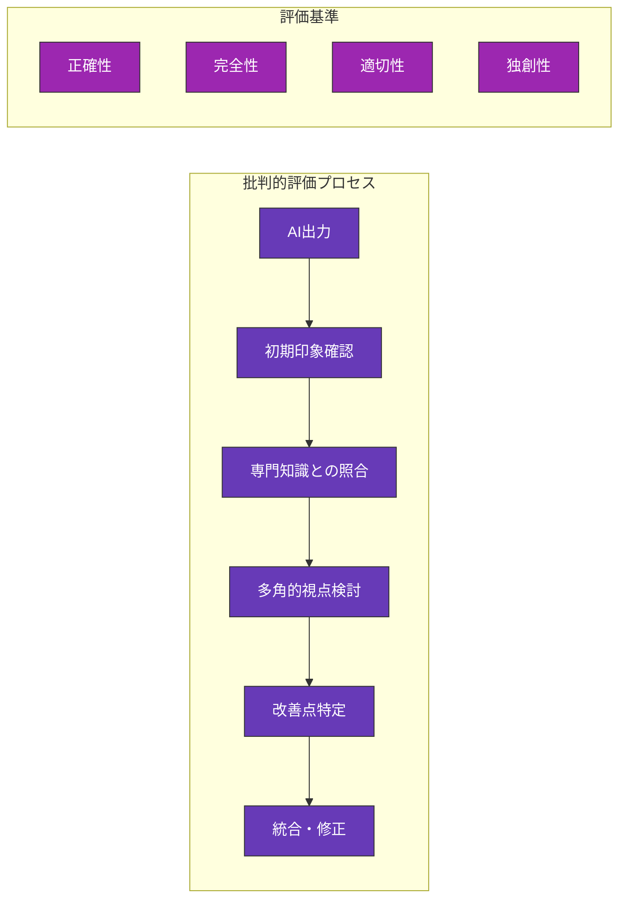

# 認知負債の概念と理論的背景

## 概念の定義：技術的負債との類似性と相違点

**認知負債（Cognitive Debt）** とは、便利な技術への依存によって生じる思考力や判断力の長期的な低下現象を指します。この概念は、ソフトウェア開発における「技術的負債（Technical Debt）」の類推から生まれました。技術的負債が短期的な開発効率を追求する結果として将来のメンテナンスコストを増大させるのと同様に、認知負債は短期的な思考効率を追求する結果として将来の認知能力を低下させます。

技術的負債との重要な相違点は、認知負債が個人の内部認知プロセスに影響を与える点です。技術的負債はコードベースという外部の対象物に蓄積されますが、認知負債は人間の脳内の神経回路や思考パターンに蓄積されます。そのため、認知負債の検出はより困難であり、その影響はより深刻かつ回復に時間を要します。

## 心理学・認知科学からの知見：自動化バイアスと認知的怠慢

認知負債の理論的基盤は、認知心理学における複数の重要な概念に根ざしています。

**自動化バイアス（Automation Bias）** は、自動化されたシステムの出力を過度に信頼し、批判的な検証を怠る傾向を指します。1997年のParasuramanとRileyの研究以来、航空や医療分野での事故分析を通じて明らかになった現象です。生成AI利用においても、この自動化バイアスが認知負債の主要な原因となります。

**認知的怠慢（Cognitive Offloading）** は、外部ツールに思考プロセスを委ねることで、脳内の認知リソースを節約する現象です。スマートフォンのナビゲーションに依存することで空間認知能力が低下する現象と同様に、生成AIへの依存は高次認知機能の退化を招く可能性があります。

**メタ認知の重要性**も認知負債理解において不可欠です。メタ認知とは「認知について認知すること」、つまり自分の思考プロセスを客観視し制御する能力です。認知負債の蓄積は、このメタ認知能力の低下と密接に関連しています。生成AIに依存することで、「なぜそう考えるのか」「この判断は適切か」といった自己省察の機会が減少し、結果として思考の質が低下します。

## 教育分野における認知負債の特殊性

教育分野における認知負債は、他分野と比較して特に深刻な影響をもたらします。なぜなら、教育者の認知能力の低下は、直接的に学習者の教育機会の質に影響するからです。

**知識の二重構造問題**が最も重要な特殊性です。教育者は、①自分自身の専門知識と②その知識を他者に伝える能力（教授学的内容知識：PCK）の両方を維持する必要があります。認知負債は、この両方のレベルで同時に影響を与えます。

専門知識レベルでは、研究文献の要約や分析をAIに依存することで、その分野への深い理解が失われます。教授学的レベルでは、授業設計や学習支援をAIに委ねることで、学習者の認知プロセスへの洞察力が低下します。

**学習者への波及効果**も重要な特殊性です。教育者の認知負債は、以下のような形で学習者に悪影響を与えます：

- **隠れたカリキュラム効果**：教育者のAI依存行動が学習者に無意識に伝達される
- **指導質の低下**：個別学習者のニーズを見抜く洞察力の減少
- **批判的思考の阻害**：教育者自身が批判的思考を実践しないことの影響

# 認知負債の進行メカニズム

認知負債は段階的に進行する特徴があります。初期段階では気づきにくく、症状が顕在化した時点では既に深刻な状態となっていることが多いため、進行メカニズムの理解が重要です。

## 第1段階：便利さの体験と習慣化

最初の段階では、生成AIの便利さを体験し、その利用が習慣化されます。この段階では、明確な負の影響は感じられません。

**典型的な体験パターン**：
- 授業資料作成時間の大幅短縮（2時間 → 30分など）
- 学生への回答作成の効率化
- 研究文献要約の自動化

**習慣化のトリガー**：
- 時間的プレッシャーの解消
- 作業負荷の軽減
- 同僚からの肯定的評価

この段階では、「生産性の向上」として肯定的に捉えられがちです。しかし、この時点で既に思考プロセスの外部化が始まっており、認知負債の蓄積が開始されています。

## 第2段階：思考プロセスの外部化と依存

第2段階では、徐々に思考プロセスの重要な部分をAIに委ねるようになります。この段階では、まだ意識的にAIの出力を検証していますが、その頻度と深度が徐々に低下します。

**進行の兆候**：
- 複雑な問題もAIに相談するようになる
- AIの出力チェックが表面的になる
- 「AIが言っているから正しいだろう」という思考の増加

この段階では、まだ「効率的な活用」として正当化されがちですが、実際には批判的思考や深い分析の機会が失われています。

## 第3段階：専門的判断力の低下

第3段階では、専門分野における判断力の明確な低下が現れ始めます。この段階で初めて、利用者自身が「何かがおかしい」と感じることがあります。

**典型的な症状**：
- 学生からの予想外の質問に答えられない
- 研究論文の批判的評価が困難になる
- 授業中の即興的な説明ができない
- 同僚との学術的議論についていけない

**隠れた影響**：
- 新しい知識の統合能力の低下
- 直感的な問題発見能力の減退
- 創造的なアイデア発想の困難

## 第4段階：教育者としての専門性の空洞化

最終段階では、教育者としての核心的な専門性が深刻に損なわれます。この段階では、単なる「情報の中継者」となり、真の教育的価値の提供が困難になります。

**空洞化の具体的現象**：
- 学習者の理解度を直感的に把握できない
- 個別的な学習支援の設計ができない  
- 分野の本質的な概念を自分の言葉で説明できない
- 新しい教育手法への適応力の欠如

この段階まで進行すると、回復には長期間の意識的な努力が必要となります。

# 理工系教員に特有のリスクパターン

理工系分野では、その学問的特性により、他分野とは異なる認知負債のリスクパターンが存在します。

## 数学的・論理的思考力への影響

数学的思考力は、理工系教員の核心的能力ですが、最も生成AIの支援効果が高い分野でもあるため、認知負債のリスクが特に高くなります。

**証明構築能力の退化**：
生成AIは数学的証明の構築において強力な支援を提供しますが、過度に依存することで以下の能力が低下します：
- 証明のアイデアを発想する直感力
- 論理の飛躍を見抜く批判的思考
- 美しい証明を識別する美的感覚

**問題設定能力の低下**：
AIは与えられた問題を解くことは得意ですが、「何が問題なのか」を発見することは困難です。この依存により、教育者の問題発見能力が退化するリスクがあります。

```mermaid
graph TB
    subgraph MathThinking["数学的思考力の要素"]
        A[直感的洞察] --> B[論理構築]
        B --> C[批判的検証]
        C --> D[美的判断]
        D --> A
    end
    
    subgraph AIImpact["AI利用による影響"]
        E[AI依存度増加] --> F[直感力低下]
        F --> G[検証能力低下]
        G --> H[判断力低下]
        H --> I[思考力空洞化]
    end
    
    subgraph ProblemSetting["問題設定能力"]
        J[現象観察] --> K[問題発見]
        K --> L[問題定式化]
        L --> M[解決方針立案]
    end
    
    classDef thinkingSkill fill:#8bc34a,stroke:#333,color:#fff
    classDef riskProcess fill:#f44336,stroke:#333,color:#fff
    classDef problemSkill fill:#03a9f4,stroke:#333,color:#fff
    
    class A,B,C,D thinkingSkill
    class E,F,G,H,I riskProcess
    class J,K,L,M problemSkill
```

## 問題解決能力の退化リスク

理工系分野の問題解決は、多段階のプロセスを要求します。AIへの依存は、このプロセス全体の理解と実行能力を損なう可能性があります。

**システム思考の単純化**：
複雑なシステムを理解するためには、要素間の相互作用を把握する必要があります。AIの出力に依存することで、この全体論的思考が衰退し、要素還元的な思考に偏る危険があります。

**仮説検証サイクルの形式化**：
科学的問題解決では、仮説設定→実験設計→結果解釈→仮説修正のサイクルが重要です。このプロセスをAIに依存することで、研究者としての基本的な探究能力が低下します。

## 学生指導能力への波及効果

認知負債は、学生指導の質に直接的な悪影響を与えます。特に理工系分野では、以下の点で深刻です。

**概念理解の指導困難**：
理工系の概念は抽象的で、学習者によって理解の困難点が異なります。教員自身の概念理解が表面的になることで、学習者の躓きポイントを見抜けなくなります。

**実験・実習指導の質低下**：
実験や実習では、予期しない現象や失敗から学ぶことが重要です。AIに依存した教員は、このような「計画外の学習機会」を活用する能力が低下します。

## 研究活動への長期的影響

研究活動における認知負債は、教育活動以上に深刻な影響をもたらす可能性があります。

**創造性の源泉の枯渇**：
独創的な研究は、既存知識の新しい組み合わせから生まれます。AIへの依存は、この「知識の組み合わせ能力」を低下させ、研究の独創性を損ないます。

**研究倫理感覚の麻痺**：
AIによる文献要約や データ解析に依存することで、研究プロセスの透明性や再現性への感覚が鈍化する危険があります。

# 認知負債防止の4つの防護壁

認知負債を防止するためには、多層的な防護システムが必要です。本書では、4つの防護壁からなるフレームワークを提案します。

## 防護壁1：目的の明確化と意図的使用

最初の防護壁は、AI利用の目的を明確化し、意図的に使用することです。

**目的分類フレームワーク**：
1. **効率化目的**：定型作業の時短（資料フォーマット作成など）
2. **探索目的**：新しいアイデアや視点の発見
3. **検証目的**：自分の考えの妥当性確認
4. **学習目的**：新しい知識や技術の習得

各目的に応じて、利用方法と注意点を変える必要があります。特に重要なのは、「何をAIに任せて、何を自分で行うか」の境界を明確にすることです。

**意図的使用の実践**：
- AI利用前に「この作業をAIに依頼する理由」を3つ述べる
- 利用後に「この結果から自分が学んだこと」を記録する
- 週次で「AIなしでもできたか」を振り返る

## 防護壁2：批判的評価の習慣化

第2の防護壁は、AIの出力を批判的に評価する習慣の確立です。

**多角的評価の視点**：
- **正確性**：事実の確認と論理の妥当性
- **完全性**：重要な要素や視点の欠落確認  
- **適切性**：文脈や目的との適合性
- **独創性**：新しい価値や洞察の有無

**評価習慣化の方法**：

## 防護壁3：専門知識との統合

第3の防護壁は、AIの出力を自身の専門知識と積極的に統合することです。

**統合プロセス**：
1. **既存知識との関連付け**：新しい情報を既存の知識体系に位置づける
2. **矛盾点の発見**：AI出力と既存知識の不整合を特定する
3. **深化の方向性特定**：さらに探究すべき領域を明確化する
4. **応用可能性検討**：実際の教育・研究場面での活用方法を考案する

**統合を促進する技法**：
- コンセプトマップによる知識構造の可視化
- 同僚との議論を通じた多面的検討
- 学生への説明を通じた理解度確認

## 防護壁4：継続的反省とメタ認知

最後の防護壁は、自己の認知プロセスを継続的に監視し、反省することです。

**メタ認知の要素**：
- **認知的知識**：自分の思考特性の理解
- **認知的制御**：思考プロセスの意図的調整
- **認知的体験**：思考活動の主観的体験の認識

**継続的反省の仕組み**：
- 日次：AI利用場面での「なぜ」「どのように」の記録
- 週次：認知負債の兆候チェック
- 月次：AI活用方法の見直しと改善
- 学期次：学生・研究への影響評価

この4つの防護壁を多層的に機能させることで、生成AIの恩恵を享受しながらも、認知負債のリスクを最小限に抑えることが可能になります。次章では、これらの理論的基盤を踏まえ、具体的なAI活用の枠組みについて詳しく解説します。