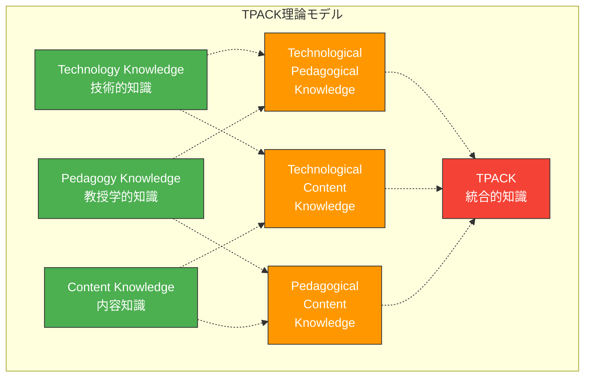
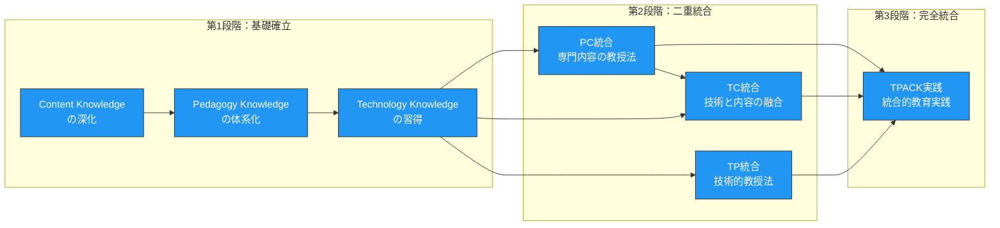
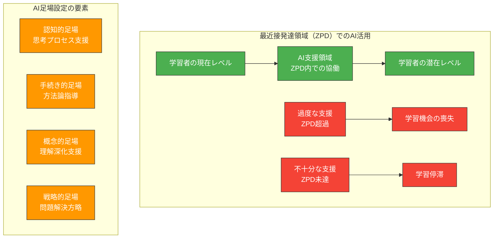
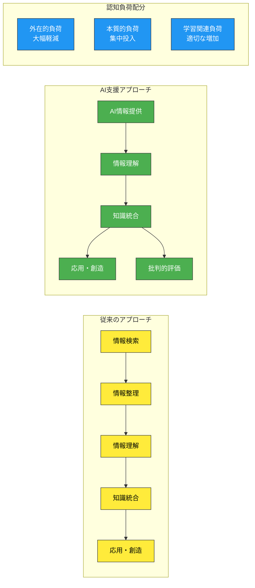
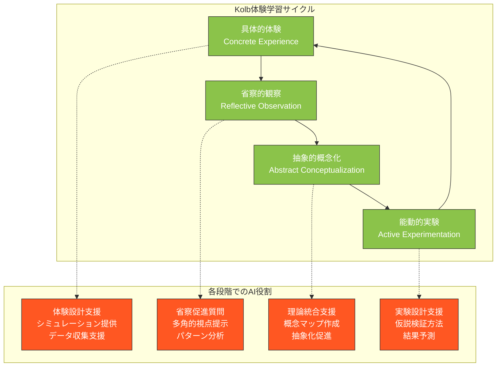
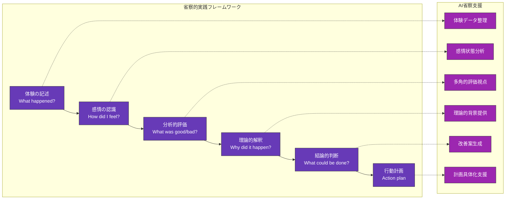

生成AIを教育現場で効果的に活用するためには、単なる技術的な操作方法を学ぶだけでは不十分です。教育学の理論的基盤に基づいた体系的なアプローチが必要です。本章では、教育理論の観点から生成AI活用の枠組みを構築し、認知負債を回避しながら教育の質を向上させる方法論を提示します。

# TPACK理論とAI統合

## Technology、Pedagogy、Content Knowledgeの相互関係

**TPACK理論**（Technology, Pedagogy, And Content Knowledge）は、Mishra と Koehler（2006）によって提唱された教育技術統合の理論的枠組みです。この理論は、効果的な教育技術活用に必要な3つの知識領域とその相互作用を明示しています。

生成AIをこのTPACK理論に統合する際の各知識領域の理解は以下の通りです。

**Technology Knowledge（技術的知識）**：
生成AIの基本原理、機能、限界についての理解です。単にツールの操作方法を知るだけでなく、LLMの仕組み、プロンプトエンジニアリングの原理、AI出力の信頼性評価方法などを包含します。

**Pedagogy Knowledge（教授学的知識）**：
学習理論、教授法、評価方法に関する専門知識です。学習者の認知プロセス、動機づけ理論、個別化指導の原理などが含まれます。

**Content Knowledge（内容知識）**：
教員が担当する専門分野の深い理解です。理工系分野では、数学的概念、物理法則、工学的設計原理、情報科学の理論などがこれに該当します。

## AIをTechnology要素として統合する際の注意点

生成AIをTechnology要素として統合する際には、従来の教育技術とは異なる特殊な配慮が必要です。

**認知処理の外部化リスク**：
従来の教育技術（電卓、シミュレーションソフトなど）は特定の計算や可視化を支援しますが、生成AIは思考プロセス全体を代替する能力を持ちます。このため、どの認知プロセスを外部化し、どれを内部で保持するかの明確な判断が必要です。

**動的適応性の管理**：
生成AIは学習者の応答に応じて動的に適応しますが、この適応が常に教育的に適切とは限りません。教員は、AIの適応プロセスを監視し、必要に応じて介入する能力を維持する必要があります。

**評価と自律性のバランス**：
AIが提供する即座のフィードバックは学習を促進しますが、学習者の自己評価能力の発達を阻害する可能性があります。外部評価と自己評価の適切なバランスの設計が重要です。

## 3つの知識領域のバランス維持戦略

TPACK理論における統合的知識の獲得には、3つの知識領域のバランス維持が不可欠です。

**段階的統合アプローチ**：

**バランス維持の具体的戦略**：

1. **内容知識の継続的深化**：AI支援を活用しつつも、専門分野への深い理解を維持するための継続的学習
2. **教授学的知識の更新**：AI時代に適応した新しい教育手法の研究と実践
3. **技術的知識の適切な範囲設定**：過度に技術的詳細に踏み込まず、教育的活用に必要な範囲での理解

# 社会構成主義学習理論の応用

## AIを「より有能な他者」として位置づける方法

社会構成主義学習理論では、学習は社会的相互作用を通じて構築される過程として理解されます。Vygotsky の理論に基づけば、学習者は「より有能な他者」との相互作用によって発達します。

生成AIを「より有能な他者」として効果的に活用するには、以下の原則が重要です。

**段階的足場設定（Scaffolding）の実現**：
AIは学習者の現在の理解レベルに応じて、適切な支援を提供する必要があります。しかし、この支援は学習者の自律的思考を促進するものでなければなりません。

**対話的学習環境の構築**：
AIとの対話は一方向的な情報提供ではなく、双方向的な探究プロセスとして設計されるべきです。学習者がAIに質問を投げかけ、AIの応答に対してさらに疑問を深める循環的プロセスが重要です。

**文化的ツールとしてのAI**：
社会構成主義では、言語や記号などの文化的ツールが思考の媒介役を果たすと考えます。AIも同様に、学習者の思考を媒介する文化的ツールとして機能させることができます。

## 最近接発達領域（ZPD）の拡張とAI活用

最近接発達領域（Zone of Proximal Development）は、学習者が独力では達成できないが、適切な支援があれば達成可能な領域を指します。AI活用により、このZPDを効果的に拡張できます。

**個別化されたZPDの特定**：
従来の教育では、クラス全体に共通のZPDを想定することが多くありましたが、AIを活用することで、各学習者の個別的なZPDを特定し、それに応じた支援を提供できます。

**動的ZPDの実現**：
学習者の理解が深まるにつれて、ZPDも動的に変化します。AIは学習者の進歩をリアルタイムで追跡し、ZPDを継続的に更新できます。

**ZPD拡張の実践的手法**：

1. **段階的課題提示**：学習者の現在レベルより少し高い課題をAIが自動生成
2. **適応的ヒント提供**：学習者の躓きに応じて、段階的にヒントを提供
3. **省察促進質問**：学習プロセスを振り返る質問をAIが適切なタイミングで提示

## 協働学習におけるAIの適切な役割

協働学習環境では、AIは学習者間の相互作用を促進し、集合知の形成を支援する役割を担います。

**学習コミュニティの促進者として**：
AIは個別学習者への支援だけでなく、学習者間の対話や協働を促進する役割も果たせます。異なる視点を持つ学習者同士の議論を活性化し、多様な観点からの学習を促進します。

**認知的多様性の確保**：
グループ学習では、参加者の背景や能力の均質化により、認知的多様性が失われることがあります。AIは意図的に異なる視点や反対意見を提示することで、この問題を解決できます。

**協働学習プロセスの可視化**：
AIは学習者の協働プロセスを分析し、誰がどのような貢献をしているか、どの部分で協働が停滞しているかを可視化できます。これにより、教員は適切なタイミングで介入できます。

# 認知負荷理論による設計指針

認知負荷理論（Cognitive Load Theory）は、人間の情報処理能力の限界を考慮した学習設計の理論です。Sweller らによって開発されたこの理論は、AI活用教育設計において特に重要な指針を提供します。

## 外在的認知負荷の軽減：作業効率化の戦略

**外在的認知負荷**は、学習内容そのものとは無関係な要素によって生じる認知負荷です。AIを活用することで、この外在的負荷を大幅に軽減できます。

**情報検索の自動化**：
学習者が専門的な情報を探す際の検索時間や整理時間を、AIが代替することで、本質的な学習活動に集中できます。

**技術的操作の簡素化**：
複雑なソフトウェア操作や計算処理をAIが担当することで、学習者は概念理解や問題解決に認知リソースを集中できます。

**表現形式の最適化**：
AIは同じ内容を複数の表現形式（テキスト、図表、数式、アニメーション）で提示し、学習者にとって最も理解しやすい形式を選択できます。

## 本質的認知負荷への集中：学習の核心部分の重視

**本質的認知負荷**は、学習内容そのものの理解に必要な認知負荷です。AI活用により外在的負荷が軽減された分、この本質的負荷に十分な認知リソースを配分できます。

**概念理解の深化**：
表面的な手続き的知識の獲得ではなく、概念の本質的理解に時間をかけることができます。AIが計算や情報整理を担当することで、「なぜそうなるのか」「どのような意味があるのか」といった概念的理解に集中できます。

**問題解決プロセスの可視化**：
AIは複雑な問題解決プロセスを段階的に分解し、各段階での思考プロセスを明示できます。これにより、学習者は解決手順だけでなく、思考の筋道を理解できます。

**多面的視点の獲得**：
一つの問題に対して複数のアプローチや解釈をAIが提示することで、学習者は多角的な視点から概念を理解できます。

## 学習関連認知負荷の最適化：適切な挑戦レベルの設定

**学習関連認知負荷**は、学習プロセス自体から生じる認知負荷です。この負荷は学習効果の向上に寄与するため、適切なレベルで維持する必要があります。

**適応的難易度調整**：
AIは学習者の理解度をリアルタイムで評価し、課題の難易度を動的に調整できます。易しすぎて退屈になることも、難しすぎて挫折することも防げます。

**段階的挑戦の設計**：

**メタ認知の促進**：
AIは学習者に対して、自身の学習プロセスを振り返る機会を定期的に提供します。「なぜこの解法を選んだのか」「どの部分が最も困難だったか」といった省察的質問により、メタ認知能力を育成します。

**エラー分析の活用**：
AIは学習者のエラーパターンを分析し、建設的なフィードバックを提供します。エラーを学習機会として活用し、より深い理解につなげます。

# 体験学習理論とAI活用サイクル

## Kolbの体験学習サイクルの適用

David Kolb の体験学習理論は、学習を4段階の循環プロセスとして捉えます。具体的体験（Concrete Experience）、省察的観察（Reflective Observation）、抽象的概念化（Abstract Conceptualization）、能動的実験（Active Experimentation）。

AIを活用した体験学習サイクルの設計では、各段階でのAIの役割を明確に定義する必要があります。

**具体的体験段階でのAI活用**：
AIはリアルな問題状況のシミュレーションや、実際のデータに基づく演習環境を提供します。理工系分野では、実験環境の事前体験や、複雑なシステムの仮想体験が可能になります。

**省察的観察段階でのAI活用**：
AIは学習者の体験を多角的に分析し、気づかなかった視点や隠れたパターンを指摘します。「なぜその現象が起きたのか」「他の条件下では何が起こるか」といった省察を促進する質問を提供します。

**抽象的概念化段階でのAI活用**：
個別の体験から一般的な原理や理論を抽出する過程で、AIは既存の理論との関連性を示し、概念の体系化を支援します。

**能動的実験段階でのAI活用**：
新しい仮説を検証するための実験設計や、異なる条件下での結果予測において、AIが支援を提供します。

## AI活用における省察的実践の重要性

省察的実践（Reflective Practice）は、Schön によって提唱された専門職の継続的発達理論です。AI活用においても、この省察的実践が認知負債防止と質の向上に不可欠です。

**行為の中の省察（Reflection-in-Action）**：
AI活用の最中に、その効果や適切性を継続的に評価し、必要に応じて方向性を修正する能力です。

- AI出力の妥当性をリアルタイムで判断
- 学習者の反応に基づくAI活用方法の調整
- 予期しない結果への柔軟な対応

**行為についての省察（Reflection-on-Action）**：
AI活用セッション終了後に、その体験を振り返り、改善点を特定する省察プロセスです。

**省察促進のフレームワーク**：

## 継続的改善のためのフレームワーク

AI活用の質を継続的に向上させるには、体系的な改善フレームワークが必要です。

**PDCA サイクルの適用**：

1. **Plan（計画）**：AI活用の目標設定と方法論の計画
2. **Do（実行）**：計画に基づく実際のAI活用
3. **Check（評価）**：結果の評価と課題の特定
4. **Act（改善）**：評価結果に基づく改善策の実施

**多層的評価システム**：

- **即時評価**：個別のAI活用セッションごとの効果測定
- **短期評価**：週単位でのAI活用パターンの分析
- **中期評価**：月単位での教育効果の評価
- **長期評価**：学期単位での総合的成果評価

**継続的改善を支える要素**：

**学習コミュニティとの連携**：
同僚教員との実践共有やピアレビューを通じて、AI活用方法の継続的改善を図ります。

**学生フィードバックの活用**：
学習者からの直接的なフィードバックを収集し、AI活用が学習体験に与える影響を評価します。

**エビデンスベースの改善**：
主観的印象だけでなく、学習成果データや行動ログに基づく客観的な改善を行います。

この第3章で提示した教育理論に基づく枠組みは、第2章で説明した認知負債の防止と密接に関連しています。理論的基盤を持つことで、AI活用が一時的なブームに終わることなく、教育の本質的価値を高める持続可能な実践となります。次章では、これらの理論的基盤を踏まえ、具体的なプロンプト設計の技術について詳しく解説します。