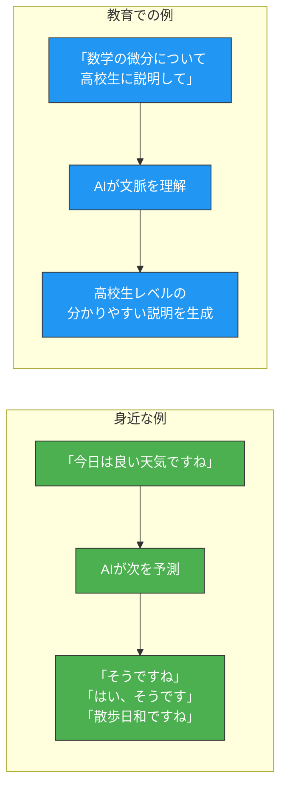
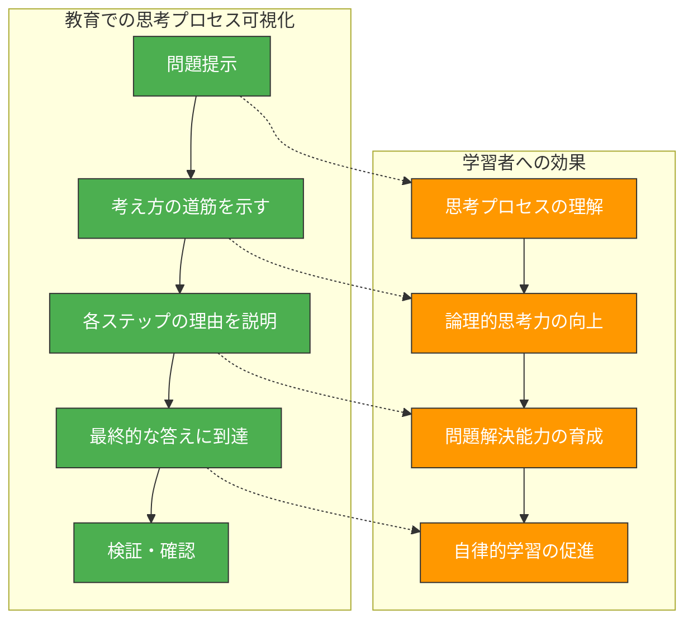
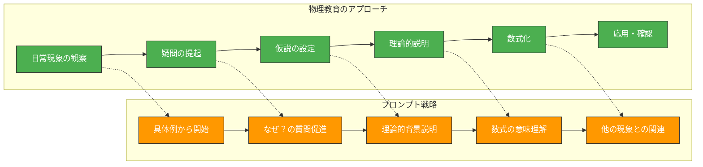

生成AIを教育現場で効果的に活用するためには、プロンプト設計の基本を理解することが重要です。本章では、プロンプトエンジニアリング初心者でも理解できるよう、基礎から応用まで段階的に解説し、教育分野での実践的な活用方法を提示します。

# プロンプトエンジニアリングとは何か

## 基本概念の理解

**プロンプトエンジニアリング**とは、AI（特に大規模言語モデル）に対して適切な指示を与え、期待する出力を得るための技術です。単に「質問の仕方を工夫する」だけでなく、AIの特性を理解し、効果的なコミュニケーションを設計する総合的なアプローチです。

教育現場では、プロンプトエンジニアリングの理解により以下が可能になります：
- 学習者に適した説明の生成
- 段階的な問題解決支援
- 個別化された学習支援
- 効率的な教材作成

## LLMの基本的な仕組み：初心者向け解説

大規模言語モデル（LLM）は、**「次にくる単語を予測する」**ことを基本原理とするAIです。これを身近な例で説明してみましょう。

**日常での予測例**：
- 「おはよう」と言われたら → 「ございます」が続くと予測
- 「雨が降って」の後には → 「いる」「きた」「いそう」などが予測される

LLMは、この予測を非常に高度なレベルで行います。インターネット上の膨大なテキストから学習し、文脈に応じて最も適切な単語を選択します。

**教育での意味**：
この仕組みを理解することで、なぜ明確で具体的な指示が重要なのか、なぜAIの回答を検証する必要があるのかが分かります。



**教育現場での重要なポイント**：

1. **AIは「理解」ではなく「パターン認識」**：
   AIは人間のように概念を理解するのではなく、大量のデータから学んだパターンに基づいて応答します。

2. **明確な指示が重要**：
   曖昧な指示では期待する回答が得られません。「分かりやすく説明して」よりも「中学2年生に分かるように、具体例を使って説明して」の方が良い結果を得られます。

3. **常に検証が必要**：
   AIの回答は必ず教員が確認し、教育的に適切かどうか判断する必要があります。

## トークンとは何か：教育現場での実用的理解

**トークン**とは、AIがテキストを理解するための「単位」です。単語や文字を、AIが処理しやすい形に分割したものと考えてください。

**身近な例で理解するトークン**：
- 「こんにちは」→ 約2-3トークン
- 「Hello」→ 1トークン  
- 「x² + 2x + 1」→ 約5-6トークン

**教育実践での重要な点**：

1. **長い文章への対応**：
   AIには一度に処理できる文字数に限界があります。長い教材を扱う際は、章ごとや単元ごとに分割して処理します。

2. **数式の扱い方**：
   複雑な数式は、AIにとって理解が困難な場合があります。数式を使う際は、文章での説明も併記すると効果的です。

3. **実用的な対策**：
   - 一度に大量の情報を投げ込まず、段階的に処理
   - 重要な数式は文章でも説明
   - 明確で簡潔な表現を心がける

# 効果的なプロンプト設計の基本

## まずは基本を押さえよう

良いプロンプトを作るための基本原則は、実はシンプルです。以下の4つのポイントを意識するだけで、AIからの回答の質が大幅に向上します。

```mermaid
graph TB
    subgraph BasicPrinciples["プロンプト設計の4つの基本"]
        A[1. 明確で具体的に] --> B[2. 肯定形で指示]
        B --> C[3. 例を示す]
        C --> D[4. 段階的に考えさせる]
    end
    
    subgraph EducationExamples["教育現場での実例"]
        E[「高校2年生に<br/>微分を説明」] --> F[「○○しないで」ではなく<br/>「○○してください」]
        F --> G[「例：y=x²の微分は2x」<br/>のように具体例を提示]
        G --> H[「まず基本概念から<br/>順番に説明して」]
    end
    
    A -.-> E
    B -.-> F
    C -.-> G
    D -.-> H
    
    classDef basicPrinciple fill:#4caf50,stroke:#333,color:#fff
    classDef practicalExample fill:#2196f3,stroke:#333,color:#fff
    
    class A,B,C,D basicPrinciple
    class E,F,G,H practicalExample
```



## よく使われるパターンを活用する

AIは、一般的によく使われる教育パターンで最も良い性能を発揮します。以下のような「定番の形式」を使うことで、安定した高品質な出力を得られます。

**教育でよく使われる効果的なパターン**：

1. **問題→解法→説明の流れ**：
   理工系で最も効果的なパターンです。

2. **具体例→一般化→応用の順序**：
   概念理解に適したパターンです。

3. **質問→回答→確認の対話形式**：
   ソクラテス式の学習に最適です。

# 「考えながら答える」仕組みを作る：Chain of Thought

## 「段階的に考えさせる」ことの重要性

**Chain of Thought（思考の連鎖）**とは、AIに「考える過程」を示しながら答えてもらう手法です。これは教育現場で特に効果的で、学習者が思考プロセスを理解できるようになります。

**基本的な使い方**：
プロンプトに「**段階的に考えて**」「**ステップごとに説明して**」「**理由も含めて答えて**」といった指示を加えるだけです。

**実際の比較例**：

❌ **悪い例**：
```
「二次方程式 x² - 5x + 6 = 0 を解いて」
```
→ AIは答えだけを出力：「x = 2, 3」

✅ **良い例**：
```
「二次方程式 x² - 5x + 6 = 0 を解いてください。
段階的に考えて、各ステップの理由も説明してください。」
```
→ AIは考える過程を示しながら解答

## 教育現場での具体的な活用方法



## 実践的なプロンプト例

**数学の問題解決**：
```
中学3年生に、二次関数 y = x² - 4x + 3 のグラフの特徴を説明してください。
以下の順序で段階的に考えて説明してください：
1. まず何を調べるべきか
2. 各特徴をどのように求めるか
3. なぜその方法を使うのか
4. 最終的にどのようなグラフになるか
```

**物理の概念説明**：
```
高校生に「慣性の法則」を説明してください。
思考の流れを示しながら説明してください：
1. 日常の具体例から始める
2. なぜその現象が起こるのかを考える
3. 法則として一般化する
4. 他の例でも確認する
```

# 効果的なプロンプト構造の作り方

## プロンプトの「設計図」を理解する

良いプロンプトには「型」があります。以下の構造を意識するだけで、格段に良い結果が得られます。

**基本的なプロンプト構造**：
1. **役割設定**：「あなたは○○の専門教員です」
2. **対象者明示**：「中学2年生に」「初学者に」
3. **具体的指示**：「○○について説明してください」  
4. **出力形式**：「段階的に」「例を含めて」
5. **注意事項**：「専門用語は分かりやすく説明して」

## 実際に使える「型」の例

**基本形（初心者向け）**：
```
あなたは[科目]の教員です。
[対象学年・レベル]の学習者に、[トピック]について説明してください。
分かりやすい例を含めて、段階的に説明してください。
専門用語を使う場合は、必ず説明を加えてください。
```

**応用形（詳細指導向け）**：
```
## 役割
あなたは[科目]の専門教員です。

## 対象
[具体的な学習者レベル]

## 課題
[具体的な学習目標]

## 指導方針
- 学習者の理解度を確認しながら進める
- 具体例から抽象概念へ段階的に導く  
- 間違いやすいポイントを事前に説明する

## 出力形式
1. [ステップ1の内容]
2. [ステップ2の内容]
3. [確認・まとめ]
```

# 分野別の実践的プロンプト集

## 数学分野：抽象概念を具体的に理解させる

数学では、抽象的な概念を段階的に具体化することが重要です。

**数学指導の基本プロンプト**：
```
あなたは数学教員です。[学年]の学習者に[数学概念]を教えてください。

指導の流れ：
1. まず身近な例から始める
2. 視覚的な説明（図やグラフ）を含める
3. 数式での表現を説明する
4. 練習問題で確認する
5. 応用例を示す

注意：
- 専門用語は必ず分かりやすく説明
- 「なぜそうなるのか」の理由も含める
- 間違いやすいポイントを事前に説明
```

**具体例：微分の指導**：
```
あなたは高校数学教員です。
高校2年生に「微分」の概念を初めて教えてください。

以下の順序で説明してください：
1. 「瞬間の変化率」を車のスピードメーターで例える
2. 平均の変化率から瞬間の変化率への移行を図で示す
3. 極限の概念を導入する
4. 簡単な関数の微分を計算で示す
5. 微分の意味（接線の傾き）を確認する

生徒が混乱しやすいポイントも説明してください。
```

## 物理分野：現象と理論を結び付ける



**物理指導の基本プロンプト**：
```
あなたは物理教員です。[学年]の学習者に[物理現象/法則]を教えてください。

指導の流れ：
1. 身近な現象から問題提起
2. 観察・実験結果の提示
3. 現象の理論的説明
4. 数式での表現（必要に応じて）
5. 他の現象との関連性

重要ポイント：
- 数式の物理的意味を必ず説明
- 単位の重要性を強調
- 近似や理想化の条件を明確に
```

## 工学分野：理論と実践の橋渡し

**工学指導の基本プロンプト**：
```
あなたは工学専門教員です。
[専門分野]の学習者に[工学概念/技術]を教えてください。

指導アプローチ：
1. 現実の問題・課題から開始
2. なぜその技術が必要かを説明
3. 理論的背景の解説
4. 実際の設計・計算例
5. 制約条件や限界の説明
6. 実用例・応用事例の紹介

注意事項：
- 理論と実践の両方をバランス良く
- 安全性や社会的影響も考慮
- 複数の解決方法があることを示す
```

## 情報科学分野：アルゴリズム思考の育成

**情報科学指導の基本プロンプト**：
```
あなたは情報科学教員です。
[学年・レベル]の学習者に[コンピュータ概念/プログラミング技法]を教えてください。

指導の順序：
1. 問題の理解と分析
2. 問題の分解（小さな部分に分ける）
3. パターンの発見
4. 抽象化（一般的な方法を考える）
5. アルゴリズムの設計
6. 実装と検証

重要ポイント：
- 「なぜそのアルゴリズムを選ぶのか」の理由
- 効率性（時間、メモリ）の考え方
- エラーのデバッグ方法
- 実際のコード例（可能であれば）
```

# まとめ：効果的なプロンプト設計のチェックリスト

最後に、良いプロンプトかどうかを確認するためのチェックリストを提示します。

**基本チェック項目**：
- [ ] 明確で具体的な指示になっているか？
- [ ] 対象者（学年・レベル）が明記されているか？
- [ ] 肯定形で書かれているか？
- [ ] 段階的な説明を求めているか？
- [ ] 具体例を求めているか？

**教育的配慮のチェック項目**：
- [ ] 学習者の理解度確認を含んでいるか？
- [ ] 間違いやすいポイントへの言及があるか？
- [ ] 専門用語の説明を求めているか？
- [ ] 実践的な応用例を求めているか？
- [ ] 検証・確認の指示があるか？

これらのポイントを意識することで、教育現場でのAI活用がより効果的になり、認知負債のリスクを避けながら、質の高い学習支援を実現できます。

本章で学んだプロンプトエンジニアリングの基本技術は、第3章の教育理論的基盤と第2章の認知負債防止策を実践的に実現するための基礎となります。次章では、これらの技術を実際の授業設計とカリキュラム開発に応用する方法を詳しく説明します。