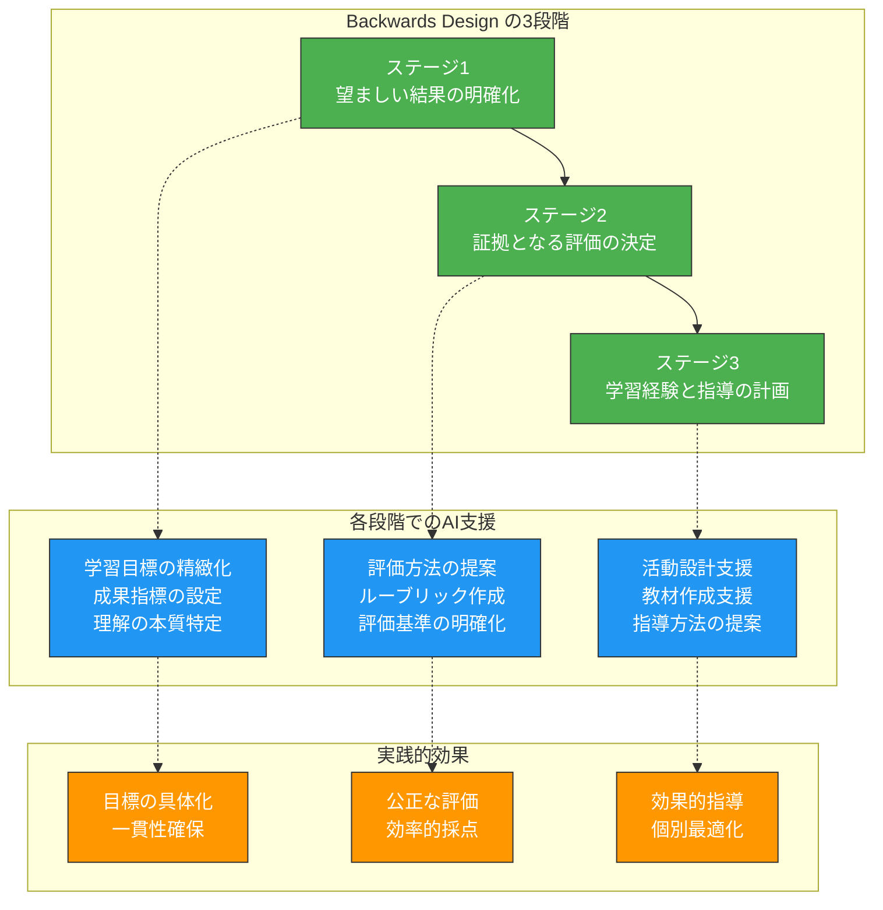
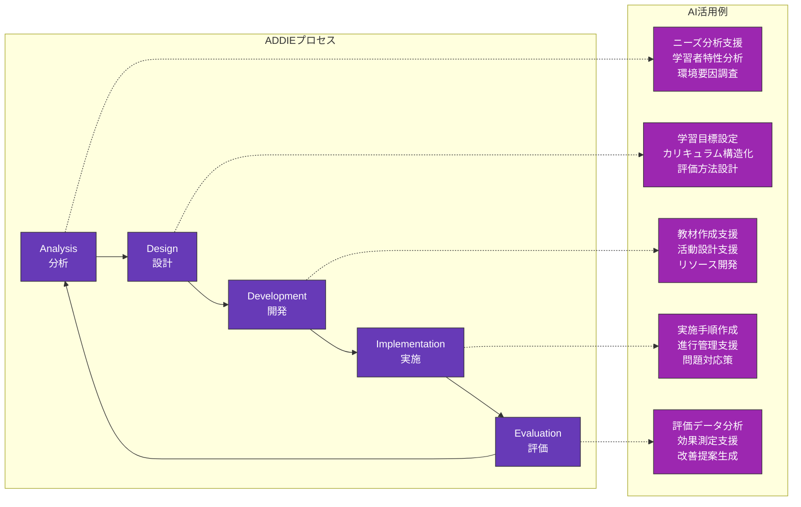
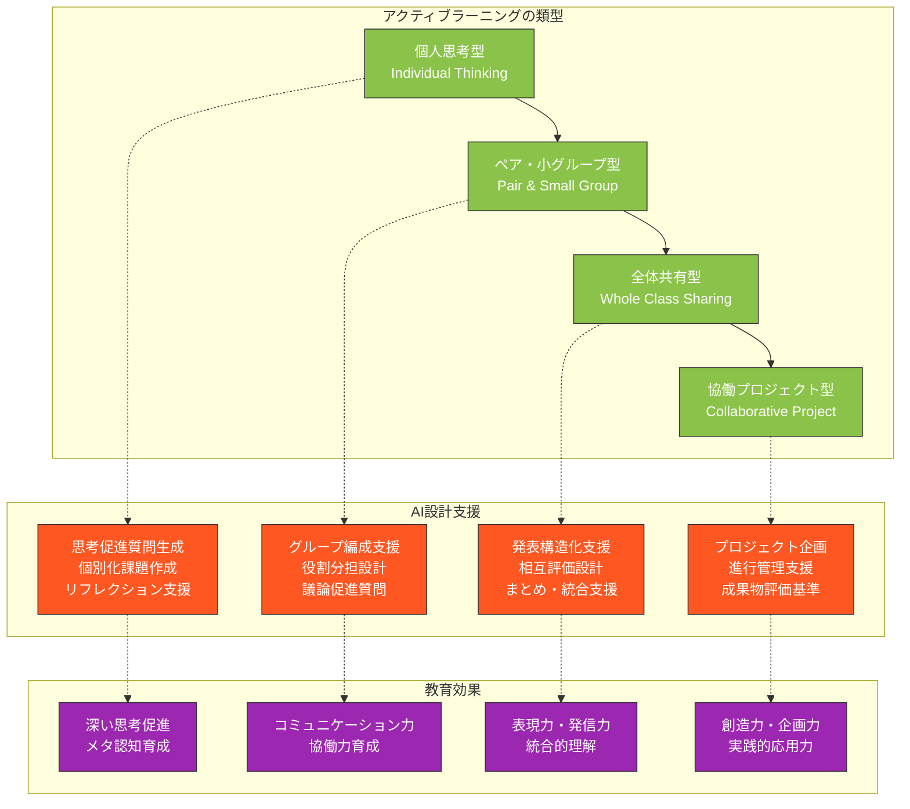
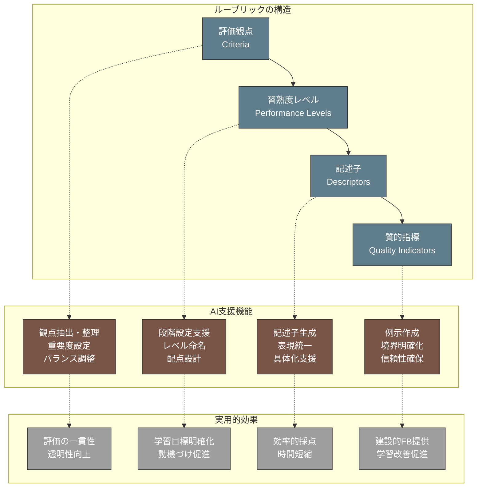
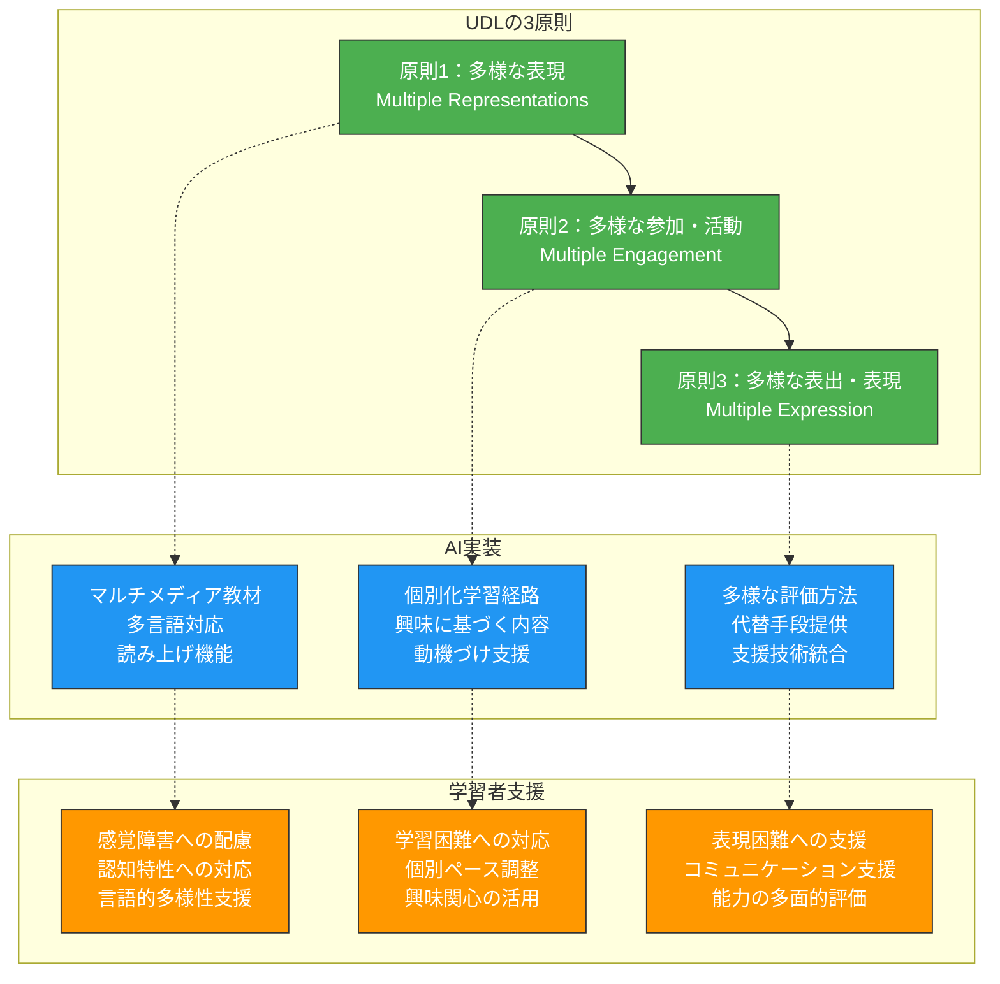

第4章で学んだプロンプト設計の技術を、実際の授業設計とカリキュラム開発に応用する方法を解説します。教育設計理論に基づいた体系的なAI活用により、学習効果の高い授業と継続的な学習プログラムを効率的に構築できます。

# 教育設計理論とAIの統合

## Backwards Design（逆向き設計）とAI支援

**Backwards Design**は、Grant Wiggins と Jay McTighe によって提唱された教育設計手法で、「目標→評価→活動」の順序で設計を行います。この理論的枠組みにAI支援を統合することで、より質の高い授業設計が可能になります。

### 逆向き設計の3段階とAI活用



### ステージ1：望ましい結果の明確化をAIで支援

**学習目標設定のプロンプト例**：
```
あなたは教育設計の専門家です。
理工系大学2年生向けの「線形代数」科目について、以下の観点から学習目標を設定してください。

## 分析対象
- 科目：線形代数
- 対象：理工系大学2年生
- 期間：1学期（15週）

## 設定すべき目標の種類
1. 獲得する知識（know）
2. 理解すべき概念（understand）  
3. 実行できる技能（do）

## 出力要求
各目標について：
- 具体的で測定可能な表現
- ブルームの分類学における認知レベル
- 他科目との関連性
- 実社会での応用可能性

段階的に考えて、理由も含めて提案してください。
```

### ステージ2：証拠となる評価の決定

**評価設計支援のプロンプト例**：
```
線形代数の学習目標に基づいて、以下の評価方法を設計してください。

## 評価の種類
1. 形成的評価（学習過程での評価）
2. 総括的評価（学習成果の最終評価）

## 各評価について設計すべき要素
- 評価方法（試験、レポート、発表等）
- 評価基準（何をどのレベルで評価するか）
- 評価タイミング（いつ実施するか）
- 配点・重み付け

## 重要な観点
- 学習目標との整合性
- 学習者の負担とのバランス
- 公正性と透明性の確保
- フィードバックの効果性

理由を含めて段階的に説明してください。
```

## ADDIEモデルの各段階でのAI活用

**ADDIEモデル**（Analysis, Design, Development, Implementation, Evaluation）は、教育システム設計の標準的なフレームワークです。各段階でのAI活用により、効率的で効果的な教育プログラム開発が可能になります。

### ADDIE各段階の詳細とAI支援



### Analysis段階：学習ニーズと環境の分析

**学習者分析のプロンプト例**：
```
理工系大学の学習環境分析を支援してください。

## 分析対象
- 対象者：理工系大学1-2年生
- 科目分野：数学・物理・工学基礎
- 課題：学習意欲の低下、基礎学力の不足

## 分析すべき要素
1. 学習者特性（予備知識、学習スタイル、動機）
2. 学習環境（物理的環境、技術的環境、社会的環境）
3. 制約条件（時間、予算、人的リソース）

## 出力要求
- 現状の問題点の整理
- 根本原因の分析
- 改善の方向性
- AI活用の可能性

データに基づいた客観的な分析をお願いします。
```

## ブルームの分類学に基づく学習目標設定

**ブルームの分類学**は、学習目標を認知的複雑さの段階で分類する枠組みです。AIを活用することで、各段階に適した学習目標と活動を効率的に設計できます。

### 認知プロセスの6段階とAI支援

**学習目標階層化プロンプト**：
```
ブルームの分類学に基づいて、微分積分学の学習目標を6段階で設計してください。

## 対象科目
- 科目：微分積分学I
- 対象：工学部1年生
- 期間：前期15週

## 各段階での目標設定
1. 記憶（Remember）：基本概念や定義の記憶
2. 理解（Understand）：概念の意味や関係性の理解
3. 応用（Apply）：学んだ知識の具体的問題への適用
4. 分析（Analyze）：複雑な問題の要素分解と関係分析
5. 評価（Evaluate）：解法や結果の妥当性判断
6. 創造（Create）：新しい問題設定や解法の開発

## 出力要求
各段階について：
- 具体的な学習目標（測定可能な形で）
- 適切な学習活動例
- 評価方法の提案
- 段階間のつながり

工学分野での応用も考慮して設計してください。
```

# 学習活動の設計と最適化

## アクティブラーニング活動の企画支援

アクティブラーニングは、学習者が能動的に学習プロセスに参加する教育手法です。AIを活用することで、学習者の特性や学習内容に応じた効果的なアクティブラーニング活動を設計できます。

### アクティブラーニングの類型とAI支援



### 具体的な活動設計例

**Think-Pair-Share活動設計プロンプト**：
```
物理学「運動量保存則」の理解を深めるThink-Pair-Share活動を設計してください。

## 基本情報
- 対象：高校2年生（物理選択）
- 時間：50分授業の20分間
- 人数：40名（ペア20組）

## 活動設計要素
### Think段階（個人思考）
- 思考を促す問いの設計
- 思考時間の設定
- 思考支援ツール

### Pair段階（ペア討論）
- ペア編成の方法
- 討論のフォーカス
- 役割分担（話し手・聞き手等）

### Share段階（全体共有）
- 発表方法
- 他ペアとの相互作用
- 教員のファシリテーション

## 注意点
- 運動量保存則の理解に直結する設計
- 学習者の多様性への配慮
- 時間管理の具体化

段階的に設計理由も含めて説明してください。
```

## 問題解決型学習（PBL）の課題設計

**Problem-Based Learning（PBL）** は、現実的な問題を通じて学習を進める教育手法です。AIを活用することで、学習目標に適した質の高いPBL課題を効率的に設計できます。

### PBL課題設計の原則とAI活用

**工学系PBL課題設計プロンプト**：
```
機械工学科2年生向けのPBL課題を設計してください。

## 学習目標
- 材料力学の基礎概念（応力・ひずみ・弾性変形）の理解
- 設計思考プロセスの体験
- チームワークとコミュニケーション能力の育成

## 課題設計要件
### 現実性
- 実社会で実際に直面する問題
- 複数の解決方法が存在する
- 明確な正解がない複雑さ

### 教育的価値
- 学習目標との直接的関連
- 学習者のレベルに適した難易度
- 協働学習の必要性

### 実行可能性
- 利用可能なリソース内での実現
- 適切な期間設定（4-6週間）
- 評価可能な成果物

## 出力要求
1. 問題シナリオの詳細
2. 学習プロセスの設計
3. 中間マイルストーンの設定
4. 最終成果物の要件
5. 評価基準とルーブリック

工学的思考と実践的応用を重視して設計してください。
```

## 協働学習活動の構造化

協働学習では、学習者同士の相互作用を通じて学習を深めます。AIを活用することで、効果的な協働学習環境を構造化できます。

### 協働学習設計の要素

**協働学習構造化プロンプト**：
```
情報工学科の「データ構造とアルゴリズム」科目で、協働学習活動を設計してください。

## 基本設定
- 対象：大学2年生
- グループサイズ：4名
- 学習期間：3週間
- 学習内容：ソートアルゴリズムの比較研究

## 構造化すべき要素
### グループ編成
- メンバー選定基準
- 多様性の確保方法
- 役割分担の設計

### 学習プロセス
- 週ごとの活動計画
- 個人学習と協働学習のバランス
- 進捗確認の仕組み

### 相互作用促進
- 議論を促進する仕組み
- 知識共有の方法
- 相互評価の組み込み

### 成果統合
- 個人の学習と集団の学習の統合
- 最終的な成果物の設計
- 学習成果の可視化

## 期待する効果
- アルゴリズムの深い理解
- 批判的思考力の育成
- コミュニケーション能力の向上

具体的で実行可能な設計をお願いします。
```

# 評価とフィードバックシステム

## ルーブリック作成の効率化

**ルーブリック**は、評価基準を明確化し、学習者と教員の両方にとって透明性の高い評価を可能にする工具です。AIを活用することで、質の高いルーブリックを効率的に作成できます。

### ルーブリック設計の構造とAI支援



### 分野別ルーブリック作成例

**数学プレゼンテーション評価ルーブリック作成プロンプト**：
```
数学科目でのプレゼンテーション評価用ルーブリックを作成してください。

## 評価対象
- 活動：数学的概念の説明プレゼンテーション
- 対象：大学1年生
- 時間：1人あたり5分

## ルーブリック設計要件
### 評価観点（4-5項目）
数学的内容の正確性、論理的説明、視覚的表現、聴衆との相互作用等

### 習熟度レベル（4段階）
優秀・良好・要改善・不十分（具体的な記述が必要）

### 各セルの記述子
- 具体的で観察可能な行動
- 学習者が理解しやすい表現
- 評価者間の一貫性を保つ明確さ

## 特別な配慮
- 数学的概念の理解度を適切に評価
- プレゼンテーション技術と内容理解のバランス
- 建設的なフィードバックにつながる設計

## 出力形式
表形式で整理し、各記述子に具体例も含めてください。
```

## 形成的評価の設計支援

**形成的評価**は、学習プロセス中に実施される評価で、学習改善を目的とします。AIを活用することで、効果的な形成的評価システムを設計できます。

### 形成的評価設計プロンプト例

**継続的理解度確認システム設計**：
```
物理学「電磁気学」の形成的評価システムを設計してください。

## 基本情報
- 科目：電磁気学
- 対象：理工系大学2年生
- 期間：後期15週

## 形成的評価の要件
### 評価頻度とタイミング
- 毎週の理解度確認
- 単元終了時の振り返り
- 中間時点での総合確認

### 評価方法の多様性
- 小テスト・クイズ
- 概念マップ作成
- ピア評価活動
- リフレクションペーパー

### フィードバックシステム
- 即座のフィードバック提供
- 個別化された学習支援
- 次週の学習計画調整

## 重要な観点
- 学習者の負担とのバランス
- 教員の負担軽減
- 学習動機の維持・向上
- データに基づく改善

具体的な実施手順と評価ツールも含めて設計してください。
```

## 個別化フィードバックの生成

個別化フィードバックは、各学習者の学習状況に応じたカスタマイズされた指導を提供します。AIを活用することで、質の高い個別フィードバックを効率的に生成できます。

### 個別化フィードバック生成の仕組み

**学習データ分析・フィードバック生成プロンプト**：
```
学習者の提出課題に基づいて、個別化フィードバックを生成してください。

## 学習者情報
- 学年：大学2年生（工学部）
- 科目：微分積分学II
- 課題：偏微分の応用問題（5問）

## 提出内容分析
### 正答状況
- 正解した問題：1, 3番
- 部分点の問題：2, 4番
- 不正解の問題：5番

### エラーパターン分析
- 計算ミス：符号の間違い
- 概念理解不足：偏微分の意味
- 応用力不足：実問題への適用

## フィードバック設計要件
### 個別化要素
- 学習者の強みの認識
- 具体的な改善点の指摘
- 次のステップの明確化

### 建設的な内容
- 肯定的な側面から開始
- 具体的で実行可能な提案
- 学習意欲を維持する表現

### 学習支援情報
- 参考資料の推薦
- 復習すべき内容の特定
- 発展学習の方向性

段階的に考えて、効果的なフィードバックを作成してください。
```

# 個別化・差異化指導への応用

## Universal Design for Learning（UDL）の実践

**UDL**は、多様な学習者のニーズに対応できる教育環境を設計する枠組みです。AIを活用することで、UDLの原則に基づいた包括的な教育を効率的に実現できます。

### UDL3原則とAI統合



### UDL実践のためのAI活用プロンプト

**包括的授業設計プロンプト**：
```
UDLの原則に基づいて、多様な学習者に対応できる「データ分析入門」の授業を設計してください。

## 授業基本情報
- 科目：データ分析入門
- 対象：大学1年生（混合学部）
- 時間：90分授業
- 内容：記述統計の基礎

## 学習者の多様性
### 感覚的多様性
- 視覚に困難のある学習者
- 聴覚に困難のある学習者

### 認知的多様性
- 学習ペースの違い
- 数学的背景知識の差
- 注意集中の特性

### 言語的多様性
- 留学生（日本語が第二言語）
- 専門用語への習熟度差

## UDL実装要求
### 原則1：多様な表現
- 視覚的・聴覚的・体験的な情報提示
- 複数の説明方法の併用
- アクセシビリティの確保

### 原則2：多様な参加・活動
- 個別最適化された学習経路
- 多様な興味・関心への対応
- 内在的動機の喚起

### 原則3：多様な表出・表現
- 複数の評価・表現方法
- 学習成果の多面的評価
- 支援技術の活用

具体的で実行可能な授業計画を提示してください。
```

## 学習者特性に応じた教材カスタマイズ

学習者の特性や習熟度に応じて教材をカスタマイズすることで、より効果的な学習を支援できます。

### 適応的教材生成プロンプト

**個別化教材作成支援**：
```
学習者の特性に基づいて、個別化された数学教材を作成してください。

## 学習者プロファイル
### 学習者A
- レベル：中級（基本は理解、応用に課題）
- 学習スタイル：視覚的学習者
- 興味：ゲーム・プログラミング
- 課題：抽象的概念の理解

### 学習者B  
- レベル：初級（基礎から丁寧に）
- 学習スタイル：聴覚的学習者
- 興味：音楽・芸術
- 課題：計算ミスが多い

## 教材内容
- トピック：三角関数
- 学習目標：基本的な三角関数の理解と応用

## カスタマイズ要素
### 内容の調整
- 難易度レベルの最適化
- 説明の詳細度調整
- 例題の選択・配列

### 表現方法の調整
- 視覚的vs聴覚的アプローチ
- 興味に基づく文脈設定
- 学習スタイルに応じた活動

### 支援機能の調整
- ヒントの提供レベル
- フィードバックの詳細度
- 復習内容の個別化

各学習者に最適な教材を設計してください。
```

## 特別支援を要する学習者への配慮

特別な教育的ニーズを持つ学習者に対して、AIを活用した個別支援システムを構築できます。

### 特別支援教育対応プロンプト

**個別教育支援計画作成**：
```
特別な教育的ニーズを持つ学習者への支援計画を作成してください。

## 学習者情報
- 対象：理工系大学1年生
- 診断：注意欠陥多動性障害（ADHD）
- 特性：集中持続困難、衝動性、過活動

## 学習上の困難
### 認知的側面
- 注意の維持・転換困難
- 作業記憶の限界
- 実行機能の弱さ

### 行動的側面
- 授業中の離席・私語
- 課題の途中放棄
- 時間管理の困難

## 支援計画要素
### 環境調整
- 物理的環境の工夫
- 刺激の制御
- 構造化された空間

### 学習支援
- 課題の細分化
- 視覚的手がかりの提供
- 即座のフィードバック

### 行動支援
- 適切な行動の強化
- 代替行動の教示
- セルフモニタリング支援

### 評価の配慮
- 評価方法の調整
- 時間延長等の合理的配慮
- 強みに焦点を当てた評価

実現可能で効果的な支援計画を提案してください。
```

この第5章では、第4章で学んだプロンプト設計技術を、実際の教育設計に統合する方法を詳しく解説しました。教育設計理論に基づいた体系的なAI活用により、より質の高い教育を効率的に実現できます。次章では、これらの設計を具体的な教材開発に応用する方法について説明します。