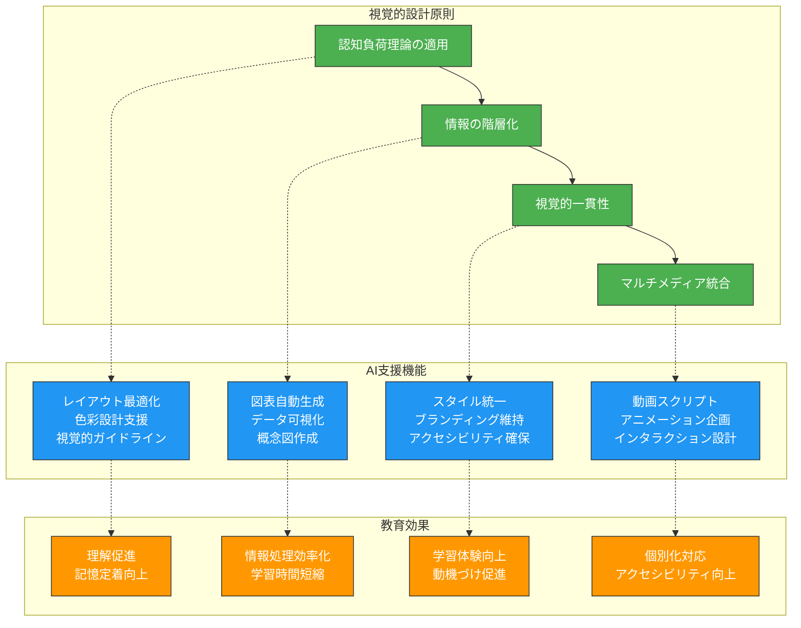
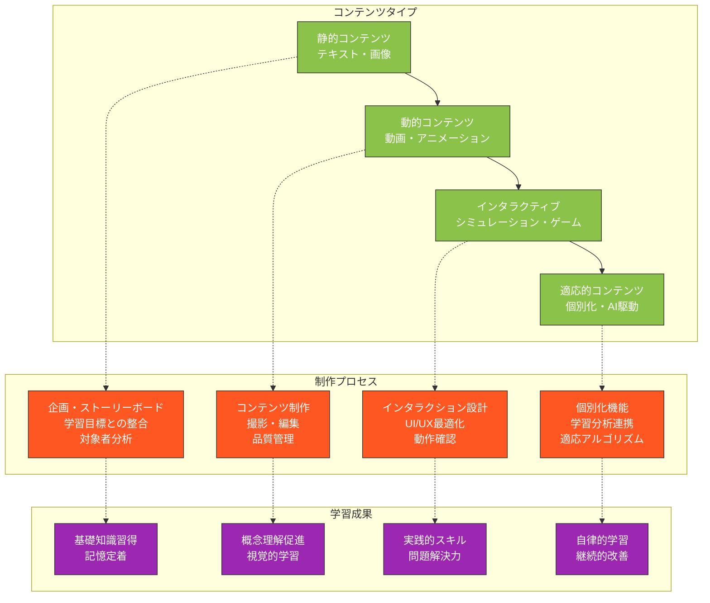
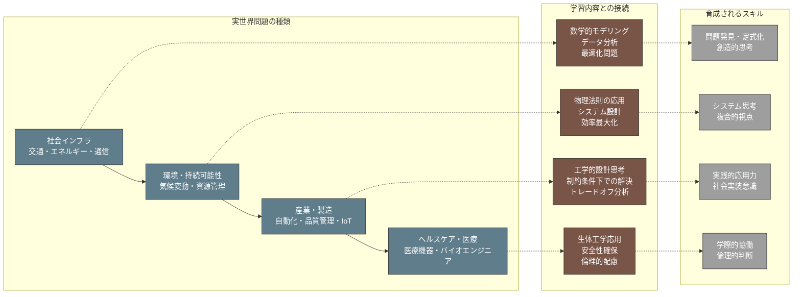
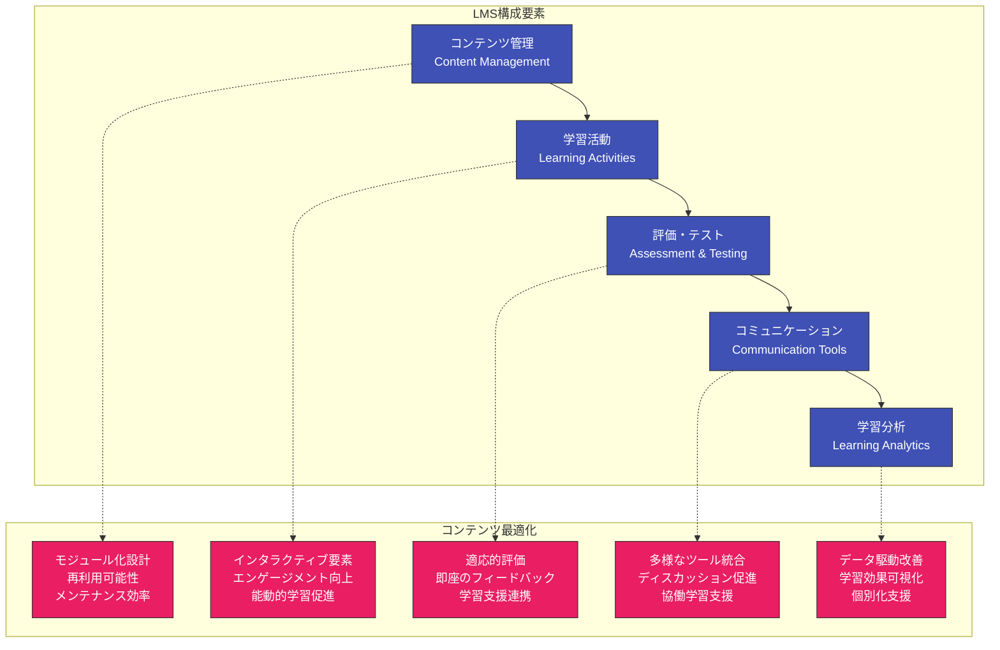
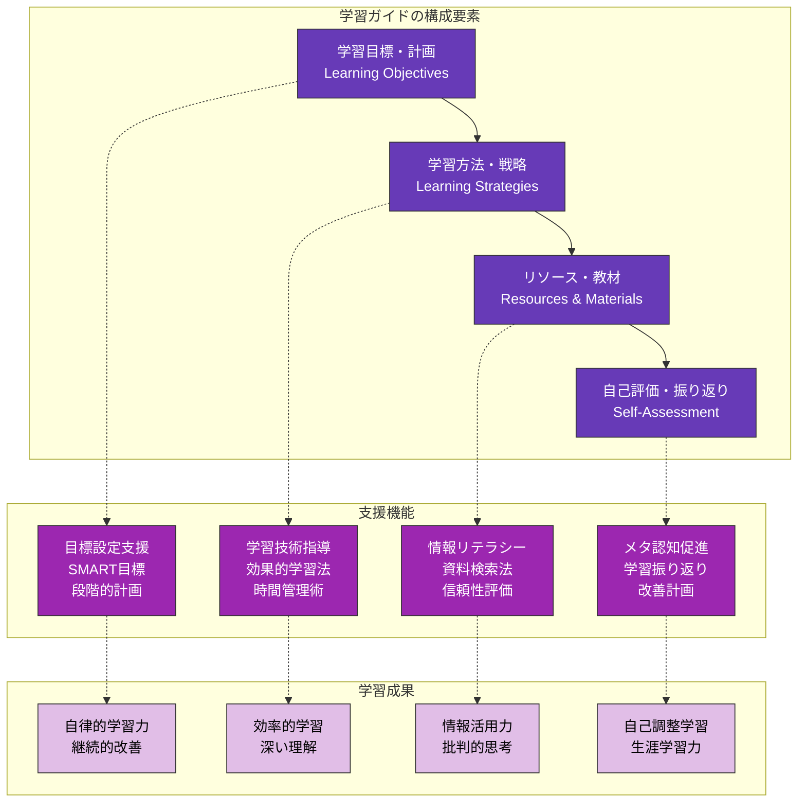

第5章で学んだ授業設計の理論を、具体的な教材開発に応用します。AIを活用することで、質の高い教材を効率的に作成し、学習者の多様なニーズに対応できる豊富な学習リソースを開発できます。本章では、講義資料から実習教材、デジタルコンテンツまで、包括的な教材開発の実践方法を解説します。

# 講義資料・教材作成の効率化

## 視覚的理解を促進する資料設計

理工系分野では、複雑な概念や抽象的な理論を視覚的に表現することで、学習者の理解を大幅に促進できます。AIを活用することで、効果的な視覚的教材を効率的に設計できます。

### 視覚的教材設計の原則とAI支援



### 理工系概念の視覚化プロンプト例

**数学概念視覚化支援プロンプト**：
```
大学1年生向けの「ベクトル」概念を視覚的に説明する教材を設計してください。

## 学習目標
- ベクトルの基本概念（大きさと向き）の理解
- ベクトルの演算（加算・減算・内積）の視覚的理解
- 物理学や工学での応用イメージの獲得

## 視覚化要件
### 基本概念の視覚化
- ベクトルの矢印表現
- 大きさと向きの明確な表現
- 座標系との関係

### 演算の視覚化
- ベクトル加算の平行四辺形法則
- 内積の幾何学的意味
- 段階的な計算プロセス

### 応用例の視覚化
- 物理現象（力の合成等）での具体例
- 工学的応用（構造解析等）のイメージ
- 日常生活での身近な例

## 設計要求
### 教材構成
- 導入→基本概念→演算→応用の流れ
- 各段階での理解確認ポイント
- 学習者の能動的参加を促す要素

### 視覚的要素
- 色彩設計（色覚多様性への配慮）
- アニメーション効果の活用
- インタラクティブ要素の組み込み

### 技術的実装
- PowerPoint/Keynoteでの実現方法
- WebベースGeoGebraの活用
- 印刷配布資料との連携

具体的で実行可能な教材設計案を提示してください。
```

## 概念説明のための類推・比喩の活用

抽象的な理工系概念を身近な事象と関連付けることで、学習者の理解を促進できます。AIは豊富な知識ベースから適切な類推や比喩を提案できます。

### 効果的な類推・比喩設計

**物理概念類推生成プロンプト**：
```
高校生に「電気回路」の概念を説明するための類推・比喩を開発してください。

## 説明対象
### 基本概念
- 電流：電荷の流れ
- 電圧：電位差、電気的な「押す力」
- 抵抗：電流の流れにくさ
- オームの法則：V = IR

### 回路要素
- 電池：電圧源
- 抵抗器：電流を制限する部品
- 導線：電流の経路

## 類推・比喩の要件
### 身近さと理解しやすさ
- 高校生の日常体験に基づく
- 視覚的にイメージしやすい
- 一貫性のある比喩体系

### 概念の正確な対応
- 電気的概念と比喩の要素が適切に対応
- 誤解を招かない正確な類推
- 限界も含めた説明

## 類推候補と評価
### 水流モデル
- 電流 ↔ 水の流れ
- 電圧 ↔ 水圧（高低差）
- 抵抗 ↔ パイプの細さ・摩擦

### 交通システムモデル
- 電流 ↔ 車の流れ
- 電圧 ↔ 坂道の傾斜
- 抵抗 ↔ 道路の混雑・障害物

## 出力要求
- 最適な類推モデルの選択と理由
- 具体的な説明例とストーリー
- 視覚的表現の提案
- 類推の限界と注意点

段階的に考えて、教育効果の高い類推を開発してください。
```

## マルチメディア教材の企画支援

動画、音声、インタラクティブコンテンツを統合したマルチメディア教材により、多様な学習スタイルに対応できます。

### マルチメディア教材企画フレームワーク



**動画教材企画プロンプト**：
```
工学部「材料力学」の動画教材シリーズを企画してください。

## 基本情報
- 対象：工学部2年生
- 単元：「梁の曲げ」
- 総時間：1回あたり10-15分、全5回シリーズ
- 配信方法：LMS組み込み、モバイル対応

## 学習目標
- 曲げモーメントと曲げ応力の概念理解
- 断面二次モーメントの計算方法習得
- 実際の構造物における応用理解

## 動画シリーズ構成
### 各回の企画要求
1. 学習目標の明確化
2. 導入部での動機づけ
3. 核心内容の段階的説明
4. 実例・演習の組み込み
5. まとめと次回予告

### 視覚的要素
- 実物・模型を使った実演
- CGアニメーションによる概念説明
- グラフィックによる数式展開
- 実構造物の事例紹介

### インタラクティブ要素
- 動画内クイズの組み込み
- 計算演習のポーズポイント
- 関連資料へのリンク
- ディスカッション促進要素

## 制作仕様
### 技術的要件
- 解像度・音質の基準
- 字幕・多言語対応
- アクセシビリティ配慮
- モバイル最適化

### 評価・改善システム
- 視聴データ分析
- 理解度測定方法
- フィードバック収集
- 継続的改善プロセス

具体的で実行可能な企画書を作成してください。
```

# 演習・実習教材の開発

## 段階的難易度設定の自動化

学習者の習熟度に応じて段階的に難易度を調整した演習問題により、効果的なスキル習得を支援できます。

### 適応的難易度調整システム

**数学演習問題生成プロンプト**：
```
「微分積分学」の演習問題を段階的難易度で自動生成するシステムを設計してください。

## 対象範囲
- 内容：関数の微分（基本→合成関数→積の微分→商の微分）
- レベル：大学1年生
- 問題数：各段階10問ずつ、全40問

## 難易度段階設計
### レベル1：基本的な微分
- 多項式関数の微分
- 指数関数・対数関数の基本
- 明確なパターン、計算量少

### レベル2：合成関数の微分
- 連鎖律の適用
- 三角関数との組み合わせ
- 中程度の計算複雑さ

### レベル3：積・商の微分
- 積の微分法則の適用
- 商の微分法則の適用
- より複雑な関数構造

### レベル4：総合的な応用
- 複数の公式の組み合わせ
- 実用的な文脈での問題
- 創意工夫を要する解法

## 自動生成要件
### 問題の多様性
- パラメータの変動（係数、指数等）
- 関数形の組み合わせパターン
- 文脈設定の変更

### 教育的配慮
- 段階間の適切な接続
- 誤答パターンの予測
- ヒント・解説の自動生成

### 品質管理
- 解の存在・一意性確認
- 計算複雑度の適正化
- 教育目標との整合性

## 実装アプローチ
- 問題テンプレートの設計
- パラメータ生成アルゴリズム
- 自動採点システム
- 学習分析との連携

具体的なシステム設計と実装例を提示してください。
```

## 実世界問題との関連付け

理工系の学習内容を実際の社会問題や産業応用と関連付けることで、学習動機と実践的理解を促進できます。

### 実世界応用問題設計



**実世界問題設計プロンプト**：
```
「線形代数」の学習内容を実世界問題と関連付けた教材を開発してください。

## 対象学習内容
- 行列の基本演算
- 連立方程式の解法
- 固有値・固有ベクトル
- 線形変換

## 実世界応用分野
### データサイエンス・AI
- 画像処理における行列演算
- 機械学習での最適化問題
- 主成分分析での次元削減

### 工学設計
- 構造解析での剛性行列
- 制御システムでの状態方程式
- 信号処理でのフィルタ設計

### 経済・経営
- 投入産出分析
- ポートフォリオ最適化
- ゲーム理論での戦略分析

## 教材設計要求
### 問題の現実性
- 実際のデータ・パラメータ使用
- 現実的な制約条件の設定
- 社会的意義の明確化

### 学習段階との整合
- 基礎概念から応用への段階的発展
- 数学的厳密性と実用性のバランス
- 学習者レベルに応じた複雑さ調整

### 動機づけ要素
- 現代社会での重要性の説明
- キャリアとの関連性の明示
- 成功事例・影響の紹介

## 具体的な問題例
各分野について：
- 背景説明とデータ提供
- 段階的な解決プロセス
- 結果の解釈と意義
- 発展的な課題設定

実践的で教育効果の高い教材を設計してください。
```

## 自己学習支援教材の作成

学習者が自律的に学習を進められる支援教材により、個別化された学習環境を提供できます。

### 自己学習教材の構成要素

**自己学習ガイド作成プロンプト**：
```
「プログラミング基礎（Python）」の自己学習支援教材を作成してください。

## 対象学習者
- 理工系大学1年生
- プログラミング初心者
- 自主的な学習意欲を持つ

## 学習範囲
- Python基本文法
- データ型と制御構造
- 関数とモジュール
- 基本的なアルゴリズム

## 自己学習支援機能
### 学習ガイダンス
- 学習目標の明確化
- 推奨学習順序の提示
- 時間配分の目安
- 前提知識の確認

### 理解度確認システム
- 各章末の確認問題
- 理解度に応じた次ステップ提案
- 復習が必要な内容の特定
- 学習進捗の可視化

### 問題解決支援
- よくあるエラーと対処法
- デバッグのヒントとコツ
- 段階的なヒントシステム
- 模範解答例の提供

### 学習継続支援
- 学習習慣化のアドバイス
- モチベーション維持の工夫
- 学習コミュニティへの誘導
- 実践プロジェクトの提案

## 教材構成
### 基本構造
- 導入→説明→例題→練習→確認の流れ
- 各セクションの学習時間目安
- 理解度チェックポイント
- 復習・発展学習の方向性

### インタラクティブ要素
- コード実行環境の提供
- 即座のフィードバック
- 学習者同士の情報交換
- 教員への質問システム

具体的で使いやすい教材設計を提案してください。
```

# デジタル教材・e-Learning支援

## LMS用コンテンツの効率的作成

Learning Management System（LMS）に最適化されたコンテンツにより、オンライン学習の効果を最大化できます。

### LMS統合教材設計



**LMS教材開発プロンプト**：
```
「熱力学」のLMS用デジタル教材を設計してください。

## 基本仕様
- 対象：機械工学科2年生
- 期間：1学期（15週）
- LMS：Moodle環境
- 学習形態：ブレンデッド学習

## コンテンツ構成
### モジュール設計
1. 熱力学の基礎概念
2. 第一法則とエンタルピー
3. 第二法則とエントロピー
4. 理想気体とサイクル
5. 実ガスと相変化

### 各モジュールの要素
- 導入動画（5-10分）
- インタラクティブ資料
- 概念確認クイズ
- 計算演習問題
- ディスカッションフォーラム

## LMS機能活用
### 学習進捗管理
- チェックポイントの設定
- 習熟度に応じた推奨経路
- 学習時間の記録と分析
- 遅れの早期発見システム

### インタラクティブ要素
- シミュレーション組み込み
- バーチャル実験室
- 計算ツールの統合
- 3Dモデルの活用

### 評価システム
- 形成的評価の自動化
- 適応的テスト機能
- ピア評価の組み込み
- ポートフォリオ評価

### コミュニケーション促進
- 質問・回答システム
- グループワーク支援
- 学習者同士の相互評価
- 教員との個別相談

## 技術的考慮事項
- モバイル対応設計
- アクセシビリティ確保
- 外部ツール連携
- データエクスポート機能

具体的な実装計画を含めて設計してください。
```

## インタラクティブな学習体験の設計

学習者が能動的に参加できるインタラクティブな学習体験により、深い理解と長期記憶を促進できます。

### インタラクション設計パターン

**物理シミュレーション教材設計プロンプト**：
```
「電磁気学」のインタラクティブシミュレーション教材を設計してください。

## 学習目標
- 電場・磁場の概念理解
- クーロンの法則の体験的理解
- 電磁誘導現象の可視化理解

## インタラクティブ要素設計
### パラメータ操作
- 電荷の大きさ・符号の変更
- 位置の動的変更
- 距離や角度の調整
- 時間変化の制御

### 視覚化フィードバック
- 電場線の動的表示
- 力の方向・大きさの表現
- 数値計算結果の即座表示
- グラフの同時更新

### 探究活動促進
- 仮説設定のガイド
- 実験計画の支援
- データ収集の自動化
- 結果分析の誘導

## 学習活動統合
### 段階的学習設計
1. 基本概念の確認
2. パラメータ操作体験
3. 予測と検証活動
4. 応用問題への発展

### 協働学習要素
- 結果共有機能
- ディスカッション促進
- ピア学習支援
- 集合知の活用

### 評価・フィードバック
- 操作過程の記録
- 理解度の自動判定
- 個別化ヒント提供
- 学習成果の可視化

## 技術実装
### プラットフォーム
- Web技術（HTML5/JavaScript）
- レスポンシブデザイン
- クロスプラットフォーム対応
- LMS統合可能性

### ユーザビリティ
- 直感的インターフェース
- アクセシビリティ配慮
- 多言語対応
- ヘルプシステム

教育効果の高いインタラクティブ教材を設計してください。
```

## モバイル学習対応教材の開発

スマートフォンやタブレットでの学習に最適化された教材により、いつでもどこでも学習できる環境を提供できます。

### モバイル最適化設計原則

**モバイル学習アプリ企画プロンプト**：
```
「化学」学習用のモバイルアプリ教材を企画してください。

## アプリ基本情報
- 対象：高校化学・大学基礎化学
- プラットフォーム：iOS/Android対応
- 利用場面：通学時間・休憩時間・復習時間

## 学習コンテンツ設計
### マイクロラーニング対応
- 1回あたり5-10分の学習単位
- スキマ時間での利用を想定
- 集中力持続可能な内容量
- 中断・再開が容易な設計

### 視覚的学習支援
- 分子構造の3D表示
- 化学反応のアニメーション
- 実験動画の組み込み
- AR（拡張現実）機能の活用

### インタラクティブ学習
- タッチ操作による分子組み立て
- 実験シミュレーション
- ゲーミフィケーション要素
- 即座のフィードバック

## モバイル特有機能
### デバイス活用
- カメラを使った化学式認識
- 音声での元素名学習
- 振動フィードバック
- オフライン学習対応

### 学習管理機能
- 学習進捗の自動記録
- 苦手分野の自動特定
- 個別化された復習提案
- 学習習慣化の支援

### ソーシャル機能
- 学習記録の共有
- 友人との競争要素
- 質問・回答コミュニティ
- 学習成果の可視化

## ユーザビリティ設計
### モバイルUI/UX
- タッチ操作に最適化
- 片手操作への配慮
- 読みやすいフォントサイズ
- バッテリー消費の最適化

### アクセシビリティ
- 視覚障害者への対応
- 音声読み上げ機能
- 高コントラスト表示
- 操作簡素化オプション

実装可能で教育効果の高いアプリを企画してください。
```

# 学習支援ツールの開発

## 学習者用ガイド・手引きの作成

学習者が効果的に学習を進められるガイドや手引きにより、自律的な学習を支援できます。

### 学習ガイド設計フレームワーク



**学習ガイド作成プロンプト**：
```
理工系大学生向けの「効果的な学習ガイド」を作成してください。

## 対象読者
- 理工系大学1-2年生
- 高校から大学への学習環境変化に直面
- 自主的な学習習慣の確立が必要

## ガイドの構成
### 第1部：学習マインドセット
- 大学での学習の特徴
- 主体的学習の重要性
- 成長マインドセットの育成
- 失敗から学ぶ姿勢

### 第2部：学習計画と時間管理
- 長期・中期・短期目標設定
- 優先順位付けの方法
- 時間ブロック法の活用
- 学習習慣の形成

### 第3部：効果的な学習技術
- アクティブリーディング
- ノートテイキング技術
- 記憶術と復習法
- 理解度確認方法

### 第4部：理工系特有の学習法
- 数学・物理の学習アプローチ
- 問題解決思考の育成
- 実験・実習の活用法
- プログラミング学習のコツ

### 第5部：学習環境の最適化
- 集中できる環境作り
- デジタルツールの活用
- 学習コミュニティの活用
- モチベーション維持法

## 実践的要素
### チェックリスト
- 学習計画立案チェックリスト
- 効果的学習法実践チェックリスト
- 定期的振り返りチェックリスト

### ワークシート
- 目標設定ワークシート
- 時間管理プランニングシート
- 学習振り返りシート

### トラブルシューティング
- よくある学習の悩みと解決法
- 学習に行き詰まった時の対処法
- 支援リソースの活用方法

具体的で実践しやすいガイドを設計してください。
```

## 自律学習支援リソースの開発

学習者が自分のペースで継続的に学習できる支援リソースにより、生涯学習の基盤を築けます。

### 自律学習支援システム

**自律学習プラットフォーム設計プロンプト**：
```
理工系学習者向けの自律学習支援プラットフォームを設計してください。

## プラットフォームの基本概念
- 学習者中心の設計
- 個別化された学習経路
- 継続的な学習支援
- コミュニティ基盤の学習

## 核心機能設計
### 個別化学習システム
- 学習者プロファイル分析
- 適応的学習経路生成
- 個別化コンテンツ推薦
- 学習効果の最適化

### 学習進捗管理
- 多面的な進捗可視化
- 学習マイルストーン設定
- 達成度評価システム
- 継続的改善サイクル

### 知識構築支援
- 概念マップ生成
- 知識間の関連性可視化
- 学習ポートフォリオ
- 成果物の蓄積・共有

### コミュニティ機能
- ピア学習の促進
- エキスパートとの接続
- 協働プロジェクト支援
- 知識共有プラットフォーム

## 学習支援機能
### 適応的支援
- 学習困難の早期発見
- 個別化されたヒント提供
- 代替学習経路の提案
- 学習方法の最適化

### モチベーション維持
- 学習成果の可視化
- 達成感の演出
- 社会的認知の仕組み
- 内発的動機の促進

### メタ認知支援
- 学習過程の振り返り
- 学習戦略の評価
- 自己調整スキルの育成
- 生涯学習力の発達

## 技術的実装
### AI・機械学習活用
- 学習データ分析
- 推薦システム
- 自然言語処理
- 学習効果予測

### ユーザビリティ
- 直感的インターフェース
- マルチデバイス対応
- アクセシビリティ確保
- 継続利用しやすい設計

革新的で実現可能なプラットフォーム設計を提案してください。
```

## キャリア・進路指導資料の充実

理工系学習者のキャリア形成を支援する資料により、学習動機の向上と将来設計を促進できます。

### キャリア教育統合設計

**キャリア指導教材開発プロンプト**：
```
理工系学生向けの「キャリア設計・進路指導」教材を開発してください。

## 対象と目的
- 対象：理工系大学1-3年生
- 目的：学習と将来キャリアの関連性理解、主体的キャリア設計能力の育成

## 教材構成
### 第1部：理工系キャリアの理解
- 理工系職種・業界の全体像
- 技術者・研究者のキャリアパス
- 社会での理工系人材の役割
- 最新技術動向とキャリア機会

### 第2部：自己理解と適性発見
- 理工系適性の多面的評価
- 興味・価値観の明確化
- 強み・弱みの客観的分析
- 学習経験とスキルの棚卸し

### 第3部：キャリア設計の実践
- 長期・中期・短期目標設定
- 必要スキル・知識の特定
- 学習計画との連携
- ネットワーキング戦略

### 第4部：就職活動・進学準備
- 就職活動の理工系特有ポイント
- 大学院進学の判断基準
- 研究室選択の考え方
- 国際的キャリアの可能性

## インタラクティブ要素
### 自己分析ツール
- キャリア適性診断
- 価値観アセスメント
- スキルインベントリー
- 学習スタイル分析

### 情報収集ガイド
- 業界研究の方法
- 企業分析のポイント
- 情報源の活用法
- ネットワーキング技術

### 計画立案支援
- キャリアロードマップ作成
- 学習計画連携シート
- 目標達成進捗管理
- 定期的見直しシステム

## 実践的支援
### 事例・ロールモデル
- 多様なキャリアパス事例
- 先輩・卒業生の体験談
- 成功・失敗事例の分析
- メンター制度との連携

### 実践機会の提供
- インターンシップ準備
- 研究発表・論文作成支援
- ポートフォリオ作成ガイド
- 面接・プレゼンテーション練習

### 継続的サポート
- 定期的なキャリア相談
- 最新情報の提供
- 卒業生ネットワーク活用
- 生涯キャリア発達支援

実効性の高いキャリア教育教材を設計してください。
```

この第6章では、第5章の授業設計理論を具体的な教材開発に応用する方法を詳しく解説しました。講義資料から演習教材、デジタルコンテンツ、学習支援ツールまで、包括的な教材開発のアプローチを提示しています。次章では、これらの教材を活用した分野別の実践事例について説明します。