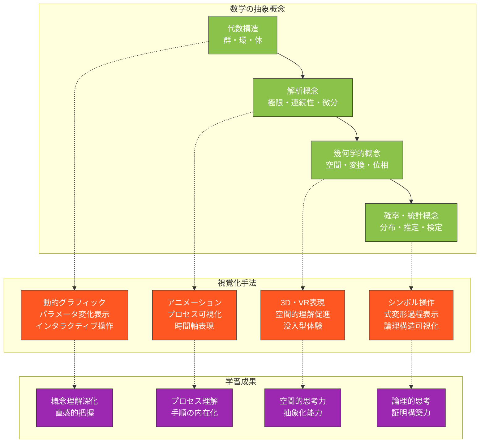
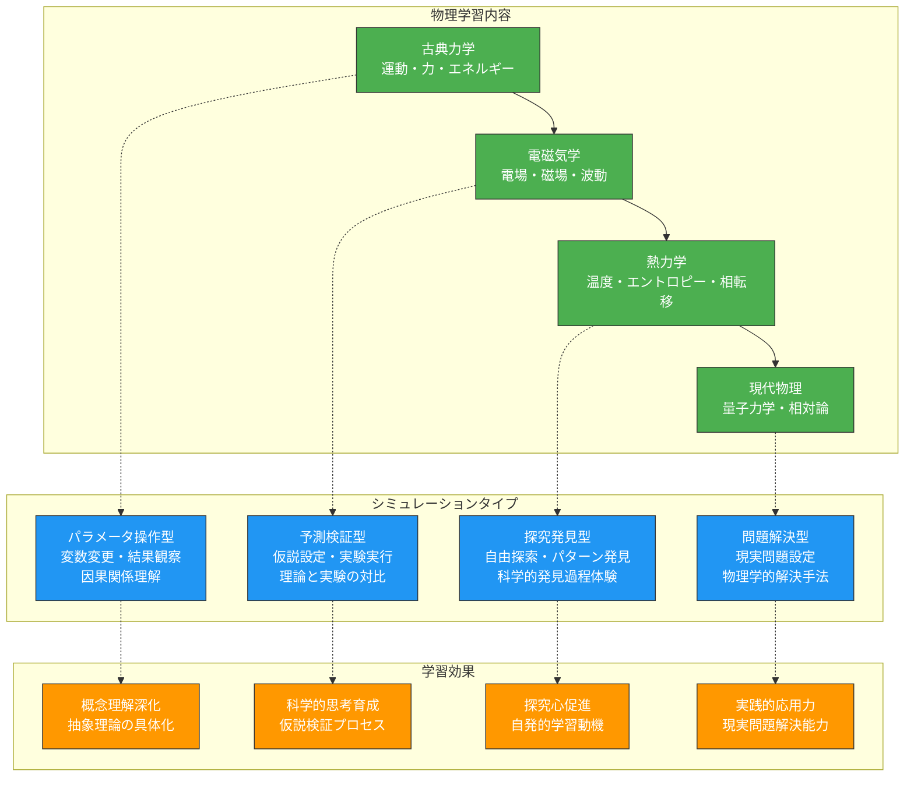
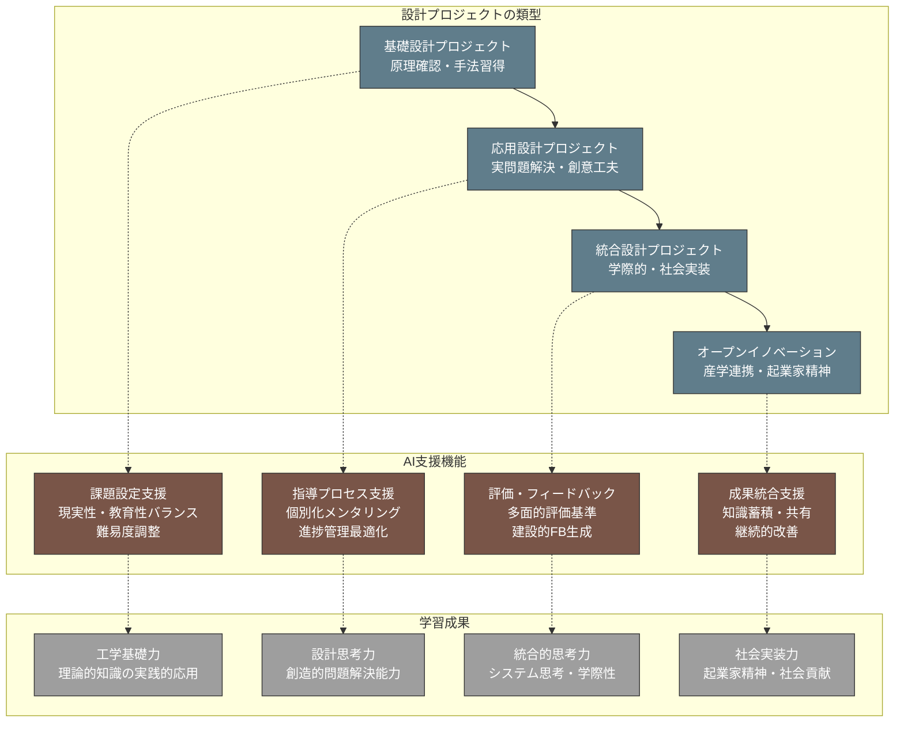
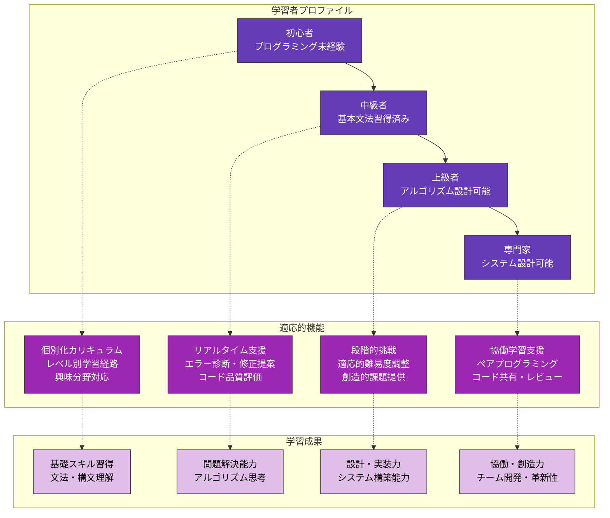
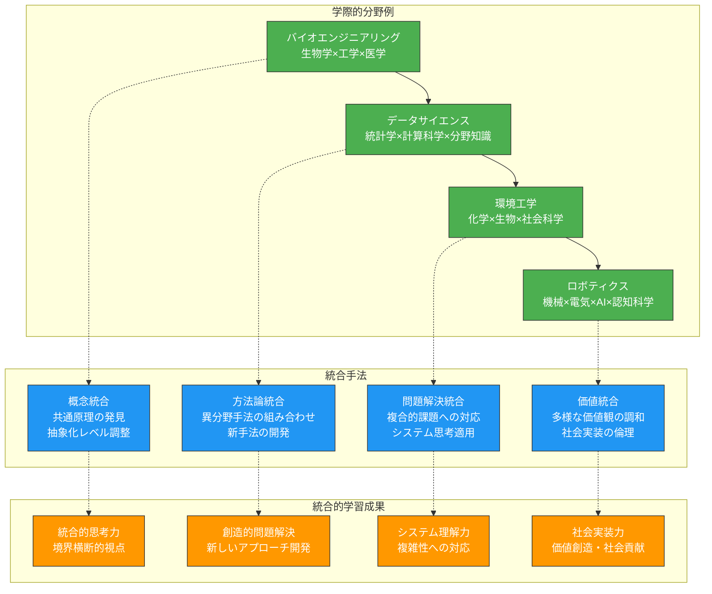

これまでの章で学んだ理論と技術を、理工系の各専門分野での具体的な実践に応用します。本章では、数学、物理学、工学、情報・計算科学、そして学際的融合分野における生成AI活用の実際の事例とベストプラクティスを詳しく解説し、各分野特有の課題と効果的な解決策を提示します。

# 数学系分野での実践

## 抽象概念の視覚化と直感的理解の促進

数学の抽象的概念を学習者に理解させることは、数学教育における最大の挑戦の一つです。生成AIを活用することで、複雑な数学的概念を視覚的に表現し、直感的理解を促進できます。

### 抽象概念視覚化の体系的アプローチ



### 具体的な実践事例：複素数の理解促進

**複素数概念視覚化プロンプト**：
```
大学1年生に「複素数」の概念を視覚的に教える教材を設計してください。

## 学習目標
- 複素数の幾何学的意味の理解
- 複素数の四則演算の視覚的理解
- オイラーの公式への直感的アプローチ

## 視覚化コンテンツ設計
### 基本概念の導入
- 実数直線から複素平面への拡張
- 複素数の点表示と極表示
- 絶対値と偏角の幾何学的意味

### 演算の視覚化
- 複素数の加法：ベクトル加法として表現
- 複素数の乗法：回転と拡大として表現
- 複素数の累乗：螺旋運動として表現

### 応用概念への発展
- 単位円上の複素数と三角関数
- オイラーの公式の視覚的導出
- 複素関数の基本的性質

## インタラクティブ要素
### 操作可能な要素
- 複素数の実部・虚部のスライダー操作
- 複素平面上での点の直接移動
- 演算結果のリアルタイム表示

### 探究活動促進
- パターン発見のためのガイド質問
- 予想と検証のサイクル
- 多様な表現の相互確認

## 実装アプローチ
### 技術選択
- GeoGebra等の動的数学ソフト活用
- WebGL/Three.jsでの3D表現
- タブレット対応のタッチインターフェース

### 段階的提示
1. 静的な図から動的な操作へ
2. 2次元表現から3次元表現へ
3. 個別概念から統合的理解へ

効果的で実装可能な視覚化教材を設計してください。
```

## 証明指導の効率化と個別支援

数学的証明の指導では、論理的思考力の育成と個別学習者への対応が重要です。AIを活用することで、証明プロセスの可視化と個別化された指導を実現できます。

### 証明指導におけるAI支援システム

**証明指導支援プロンプト**：
```
「数学的帰納法」の証明指導を効率化し、個別支援を充実させるシステムを設計してください。

## 指導対象
- 対象：大学1年生（微分積分学・線形代数履修中）
- 内容：数学的帰納法による証明
- 期間：3週間（6コマ）

## AI支援機能設計
### 証明プロセス分析
- 学習者の証明試行の自動分析
- 論理構造の視覚化
- エラーパターンの特定
- 改善点の自動抽出

### 個別化フィードバック
- 学習者のレベルに応じたヒント提供
- 段階的な誘導質問生成
- 類似問題の自動推薦
- 理解度に基づく復習提案

### 証明構築支援
- 証明の骨格テンプレート提供
- 論理ステップの検証支援
- 代替アプローチの提示
- 証明の完成度評価

## 学習活動設計
### 段階的指導プロセス
1. **基本パターン学習**
   - 典型的な帰納法証明の構造理解
   - 基底ステップと帰納ステップの役割
   - 具体例での手順確認

2. **ガイド付き実践**
   - AI支援下での証明構築体験
   - 段階的ヒントによる誘導
   - リアルタイムでの構造チェック

3. **自律的証明構築**
   - 最小限のAI支援での独立証明
   - ピア評価との組み合わせ
   - 創造的な証明アプローチの奨励

### 評価とフィードバック
- 証明の論理的正確性評価
- 表現の明確さ・簡潔さ評価
- 創造性・独創性の評価
- 学習進歩の可視化

## 技術実装
### 自然言語処理活用
- 証明文の構造解析
- 論理関係の自動抽出
- 数学的表現の正規化
- エラー検出アルゴリズム

### 学習分析
- 学習者行動パターン分析
- 困難点の早期発見
- 学習効果予測
- 個別化推薦システム

実践的で効果的な証明指導システムを設計してください。
```

## 数学的思考力評価方法の革新

従来の数学評価を超えて、思考プロセスや問題解決能力を多面的に評価するシステムにより、真の数学的能力を育成できます。

### 多面的評価システムの構築

**数学的思考力評価システムプロンプト**：
```
「線形代数」における数学的思考力を多面的に評価するシステムを開発してください。

## 評価対象能力
### 認知的側面
- 概念理解：定義・定理の本質的理解
- 手続き的知識：計算技能・アルゴリズム適用
- 問題解決：戦略選択・プロセス管理
- 創造的思考：新しいアプローチ・一般化

### メタ認知的側面
- 自己監視：解決過程の自己チェック
- 自己評価：結果の妥当性判断
- 戦略調整：アプローチ変更の判断
- 省察：学習プロセスの振り返り

## 評価方法の革新
### プロセス重視評価
- 問題解決プロセスの記録・分析
- 思考の言語化（Think-aloud）評価
- 試行錯誤過程の価値評価
- 部分的理解の段階的評価

### 多様な表現形式
- 数式による表現
- 図形・グラフによる表現
- 言語による説明
- プログラムによる実装

### 動的・適応的評価
- 学習者の応答に基づく問題調整
- リアルタイムでの理解度判定
- 個別化された評価基準
- 継続的な成長測定

## 具体的評価課題設計
### 概念理解評価
- 多重表現課題：同一概念を複数の方法で表現
- 関連性説明課題：概念間の関係性説明
- 応用判断課題：定理の適用可能性判断

### 問題解決プロセス評価
- 段階的解決課題：複数ステップでの問題解決
- 戦略選択課題：複数アプローチの比較選択
- エラー分析課題：間違いの発見と修正

### 創造的思考評価
- 問題作成課題：学習者による問題設定
- 一般化課題：特殊ケースから一般原理の抽出
- 証明改善課題：既存証明の改良・短縮

## AI支援評価システム
### 自動分析機能
- 解答プロセスの自動解析
- エラーパターンの自動分類
- 思考戦略の自動識別
- 学習進歩の自動追跡

### フィードバック生成
- 個別化された改善提案
- 強みと課題の明確化
- 次の学習目標の提示
- 学習リソースの推薦

革新的で実用的な評価システムを設計してください。
```

# 物理学分野での実践

## 物理現象のシミュレーション設計支援

物理現象の理解には、抽象的な理論と具体的な現象の結びつきが重要です。AIを活用したシミュレーション設計により、複雑な物理現象を学習者が体験的に理解できます。

### 物理シミュレーション教材の体系的設計



### 実践事例：電磁気学シミュレーション

**電磁気学シミュレーション設計プロンプト**：
```
高校生・大学1年生向けの「電磁誘導」シミュレーション教材を設計してください。

## 学習目標
- ファラデーの法則の直感的理解
- 磁束変化と誘導電流の関係理解
- レンツの法則の物理的意味理解

## シミュレーション機能設計
### 基本シミュレーション
- 磁石とコイルの相対運動シミュレーション
- 磁力線の可視化とリアルタイム更新
- 誘導電流の方向と大きさの表示
- 磁束変化の定量的表示

### インタラクティブ操作
- 磁石の位置・速度の自由操作
- コイルの形状・巻数の変更
- 磁石の強さの調整
- 時間軸での変化の確認

### 学習支援機能
- 物理量の数値表示（磁束・誘導起電力等）
- グラフ表示（時間変化の可視化）
- 理論式との対応表示
- 予測と結果の比較機能

## 教育活動統合
### 段階的学習設計
1. **現象観察段階**
   - 基本的な磁石・コイル相互作用の観察
   - 現象の記述と疑問の抽出

2. **法則発見段階**
   - パラメータ変更による系統的実験
   - データ収集と関係性の発見
   - ファラデー・レンツ法則の導出

3. **応用理解段階**
   - 発電機・変圧器への応用
   - 渦電流現象の理解
   - 電磁ブレーキの原理理解

### 評価・確認活動
- 予測課題：条件変更時の結果予測
- 説明課題：観察現象の物理的説明
- 応用課題：実用機器への原理応用

## 技術実装仕様
### 物理エンジン
- 正確な物理法則の実装
- リアルタイム計算の最適化
- 視覚的に理解しやすい表現

### ユーザビリティ
- 直感的な操作インターフェース
- 段階的な複雑さの提示
- 学習者のペースに応じた進行

実装可能で教育効果の高いシミュレーションを設計してください。
```

## 実験指導の事前準備最適化

物理実験の教育効果を最大化するために、AIを活用した事前準備と指導計画により、効率的で安全な実験環境を構築できます。

### 実験指導最適化システム

**物理実験準備支援プロンプト**：
```
大学物理実験「光学実験（干渉・回折）」の指導を最適化するシステムを設計してください。

## 実験概要
- 対象：理工系大学2年生
- 実験：ヤングの二重スリット、回折格子、マイケルソン干渉計
- 期間：3週間（各実験1週間ずつ）

## 事前準備最適化
### 学習者準備支援
- 理論的背景の事前学習教材
- 実験手順の動画ガイド
- 安全注意事項の確認システム
- 必要計算スキルの確認テスト

### 実験設計支援
- 実験条件の最適化提案
- 測定精度向上のためのヒント
- よくある失敗パターンと対策
- データ処理方法の事前説明

### 指導者支援
- 個別指導ポイントの特定
- 学習者レベルに応じた指導計画
- 実験トラブル対応マニュアル
- 評価基準の明確化

## 実験中支援システム
### リアルタイム指導支援
- 実験進行状況の自動モニタリング
- 適切なタイミングでのヒント提供
- 安全性チェックと警告システム
- データ品質の即座確認

### 学習支援機能
- 測定値の妥当性自動判定
- グラフ作成の半自動化
- 理論値との比較分析
- エラー原因の診断支援

### 協働学習促進
- グループ間のデータ共有
- 結果比較・議論の促進
- ピア評価システム
- 集合知の活用

## 実験後フォローアップ
### データ分析支援
- 統計処理の自動化
- 誤差解析の詳細化
- グラフ・表の最適化
- 結論導出の支援

### 理解度確認
- 実験結果に基づく概念確認
- 応用問題の自動生成
- 他実験との関連性確認
- 実世界応用への発展

### 改善サイクル
- 実験手順の改善提案
- 学習効果の定量評価
- 次年度への改善反映
- 継続的品質向上

## システム実装
### データ収集・分析
- 実験データの自動収集
- 学習行動の分析
- 指導効果の測定
- 最適化アルゴリズムの適用

### 個別化対応
- 学習者特性に応じた支援
- 進度調整の自動化
- 苦手分野の重点支援
- 得意分野の発展学習

効果的で実用的な実験指導システムを設計してください。
```

## 概念的理解促進のための教材開発

物理学の概念は抽象的で理解が困難な場合が多いため、AIを活用した多角的アプローチにより、深い概念理解を促進する教材を開発できます。

### 概念理解促進教材の設計原理

**熱力学概念教材開発プロンプト**：
```
「エントロピー」概念の理解を促進する包括的教材を開発してください。

## 概念理解の課題
- エントロピーの抽象性と直感との乖離
- 統計力学的解釈と熱力学的解釈の統合
- 日常経験との関連付けの困難
- 数学的定式化と物理的意味の結合

## 多層的アプローチ設計
### 直感的導入
- 日常現象からの類推（部屋の散らかり等）
- 可逆・不可逆プロセスの身近な例
- 情報理論的類推（情報の無秩序）
- ゲーム理論的アプローチ（確率と状態）

### 統計力学的理解
- 分子運動論的視点からの説明
- ボルツマン分布の視覚化
- ミクロ状態とマクロ状態の関係
- 確率論的解釈の段階的構築

### 熱力学的理解
- カルノーサイクルでの役割
- 第二法則との関係
- 自由エネルギーとの関連
- 実用的応用（エンジン・冷却器）

### 現代的発展
- 情報理論との関係
- 生命現象での役割
- 宇宙論での意義
- 量子情報理論への発展

## 教材コンポーネント
### インタラクティブシミュレーション
- 分子運動のミクロシミュレーション
- 熱力学サイクルの可視化
- パラメータ変更による影響確認
- 統計的揺らぎの体験

### 段階的説明教材
- 概念の歴史的発展
- 多重表現による説明
- 数学的厳密性の段階的導入
- 応用分野との関連付け

### 問題解決活動
- 段階的難易度の問題群
- 概念応用の多様な文脈
- 創造的思考を促す発展問題
- 実世界問題との関連

## 評価・フィードバックシステム
### 概念理解度測定
- 多重選択による概念テスト
- 説明課題による理解度評価
- 類推生成課題による創造性評価
- 応用問題による転移評価

### 個別化支援
- 理解の弱点自動診断
- 個別化された復習提案
- 発展学習の方向性提示
- 学習意欲維持の工夫

包括的で効果的な概念理解教材を設計してください。
```

# 工学分野での実践

## 設計プロジェクトの課題設定と指導

工学教育では、実践的な設計プロジェクトを通じて、理論と実践を統合した問題解決能力を育成することが重要です。AIを活用することで、質の高い設計課題と効果的な指導を実現できます。

### 設計プロジェクト教育の統合フレームワーク



### 実践事例：機械工学設計プロジェクト

**機械設計プロジェクト管理システムプロンプト**：
```
機械工学科3年生向けの「持続可能輸送機器設計」プロジェクトを企画・管理するシステムを設計してください。

## プロジェクト基本設定
- 期間：1学期（15週間）
- チーム構成：4-5名/チーム
- 課題：電気自動車の軽量化設計
- 制約：コスト・安全性・環境負荷を考慮

## AI支援による課題設定
### 現実性と教育性のバランス
- 実際の産業課題を基にした設定
- 学習目標との整合性確保
- 実現可能性の評価
- 学習者レベルに応じた調整

### 多面的制約条件設定
- 技術的制約（材料・加工・性能）
- 経済的制約（コスト・市場性）
- 環境的制約（LCA・リサイクル性）
- 社会的制約（安全・法規制・受容性）

### 段階的目標設定
- 短期目標：基本概念理解・調査完了
- 中期目標：設計案作成・初期評価
- 長期目標：最終設計・プロトタイプ

## 指導プロセス最適化
### 個別化メンタリング
- チーム特性に応じた指導戦略
- 個人の役割・貢献度の最適化
- 学習進度に応じた支援レベル調整
- 創造性と実現性のバランス指導

### プロジェクト進行管理
- マイルストーン設定と進捗監視
- リスク要因の早期発見・対処
- チーム内コミュニケーション促進
- 外部リソース活用の調整

### 技術的支援
- 設計ツール活用の指導
- 解析・シミュレーション支援
- プロトタイピング技術指導
- データ分析・評価手法指導

## 評価システム設計
### 多面的評価基準
- 技術的完成度（設計品質・革新性）
- プロセス評価（協働・管理・改善）
- プレゼンテーション（説明・説得・質疑応答）
- 社会実装可能性（実用性・影響・持続性）

### 継続的フィードバック
- 週次進捗レビューと改善提案
- ピア評価と相互学習促進
- 専門家・産業界からの外部評価
- 自己省察と学習成果の内省

## 成果統合・発展
### 知識蓄積システム
- 設計プロセス・成果の体系化
- 成功・失敗事例の蓄積
- ベストプラクティスの抽出
- 次年度への改善反映

### 社会連携・発展
- 産業界への成果発信
- 学会発表・論文投稿支援
- 起業・事業化への発展支援
- 社会貢献プロジェクトへの展開

実践的で包括的なプロジェクト管理システムを設計してください。
```

## 実験・実習指導の標準化と個別化

工学実験・実習では、安全性確保と教育効果の両立が重要です。AIを活用することで、標準化された安全な環境下で個別化された学習体験を提供できます。

### 実験・実習教育最適化システム

**工学実習指導システムプロンプト**：
```
「材料試験実習」の指導を標準化しつつ個別化対応を実現するシステムを設計してください。

## 実習概要
- 対象：機械工学科2年生
- 内容：引張試験・硬度試験・衝撃試験
- 期間：4週間（各試験1週間、まとめ1週間）

## 標準化要素
### 安全管理標準化
- 統一された安全手順の確立
- 事故防止チェックリスト
- 緊急時対応プロトコル
- 安全教育の標準化

### 実習手順標準化
- 手順書の統一フォーマット
- 品質管理基準の明確化
- データ記録方法の統一
- 評価基準の標準化

### 設備・環境標準化
- 実習設備の統一仕様
- 測定器具の校正管理
- 環境条件の標準化
- メンテナンス手順の統一

## 個別化対応要素
### 学習者特性対応
- 予備知識レベルに応じた支援
- 学習スタイルに応じた指導
- 進度調整と個別ペース対応
- 特別な配慮が必要な学習者への対応

### 適応的指導
- リアルタイム理解度判定
- 個別化されたヒント提供
- 追加説明・演習の自動提供
- 発展的課題の個別提示

### 評価の個別化
- 個人の成長に重点を置いた評価
- 多様な評価方法の組み合わせ
- 強みを活かした役割分担
- 個別フィードバックの充実

## AI支援機能
### インテリジェント監視
- 実習行動の自動監視・分析
- 安全違反の即座検出・警告
- 作業効率・品質の自動評価
- 学習困難の早期発見

### 適応的支援
- 学習者状態に応じた支援レベル調整
- 最適なタイミングでの介入
- 個別化された学習リソース提供
- 協働学習の促進

### データ統合分析
- 実習データの自動収集・分析
- 学習効果の定量的評価
- 改善点の自動特定
- 次回実習への改善反映

## 実装アーキテクチャ
### センサー・IoT統合
- 実習設備のセンサー化
- 作業状況のリアルタイム監視
- データの自動収集・蓄積
- ネットワーク連携システム

### AI分析エンジン
- 機械学習による行動分析
- 異常検出アルゴリズム
- 個別化推薦システム
- 予測分析機能

### インターフェース設計
- 直感的操作画面
- 多言語対応
- アクセシビリティ確保
- モバイル対応

効果的で安全な実習指導システムを設計してください。
```

## 産業界連携プログラムの企画

大学と産業界の連携により、実践的で社会に直結した工学教育を実現できます。AIを活用することで、効果的な産学連携プログラムを企画・運営できます。

### 産学連携教育プログラム設計

**産学連携プログラム企画プロンプト**：
```
「IoT・AI活用による製造業DX人材育成」の産学連携プログラムを企画してください。

## プログラム基本構想
- 対象：工学系大学3-4年生、大学院生
- 期間：1年間（準備3ヶ月、実施6ヶ月、評価3ヶ月）
- 連携企業：製造業3社（自動車・電機・化学）
- 育成目標：DXリーダー候補の実践的スキル習得

## ステークホルダー価値設計
### 学生への価値
- 実践的技術スキルの習得
- 産業界ネットワークの構築
- キャリア選択肢の拡大
- 社会貢献実感の獲得

### 企業への価値
- 優秀人材の早期発掘・育成
- 大学研究成果の活用
- イノベーション創出の促進
- 企業ブランディング向上

### 大学への価値
- 実践的教育の充実
- 産業界との関係強化
- 研究成果の社会実装
- 教育プログラムの差別化

## プログラム構成設計
### Phase 1：基礎習得（3ヶ月）
- IoT・AI技術の基礎講義
- 製造業DXの現状理解
- データ分析・機械学習演習
- チームビルディング

### Phase 2：実践プロジェクト（6ヶ月）
- 企業実課題への取り組み
- 現場見学・ヒアリング
- プロトタイプ開発
- 中間発表・評価

### Phase 3：統合・発展（3ヶ月）
- 最終成果物完成
- 企業への提案発表
- 社会実装可能性評価
- 次年度への改善反映

## AI活用による運営最適化
### マッチング最適化
- 学生特性と企業ニーズの最適マッチング
- チーム編成の最適化
- メンター割り当ての最適化
- プロジェクト配分の最適化

### 進捗管理・支援
- プロジェクト進捗の自動監視
- リスク要因の早期発見
- 個別支援ニーズの特定
- コミュニケーション促進

### 成果評価・分析
- 多面的成果評価の自動化
- 学習効果の定量分析
- 産業界満足度の測定
- 改善点の自動抽出

## 持続可能性確保
### 制度・仕組み設計
- 継続的な企業参加の仕組み
- 費用負担の適切な分担
- 知的財産の取り扱い明確化
- 成果共有・活用の仕組み

### 改善・発展サイクル
- 毎年の評価・改善サイクル
- 新技術・新課題への対応
- 参加企業・大学の拡大
- 国際連携への発展

実効性の高い産学連携プログラムを企画してください。
```

# 情報・計算科学分野での実践

## プログラミング教育の個別最適化

プログラミング教育では、学習者の多様な背景とペースに対応した個別化が重要です。AIを活用することで、各学習者に最適化されたプログラミング学習環境を提供できます。

### 適応的プログラミング学習システム



**適応的プログラミング学習プラットフォームプロンプト**：
```
「Python プログラミング基礎」の個別最適化学習システムを設計してください。

## 対象学習者
- 理工系大学1年生
- プログラミング経験：未経験〜初級者
- 学習期間：1学期（15週間）
- 最終目標：基本的なアルゴリズムの実装能力

## 個別化要素設計
### 学習者プロファイリング
- プログラミング経験の詳細分析
- 数学・論理的思考力の評価
- 学習スタイル・認知特性の把握
- 興味分野・将来目標の調査

### 適応的学習経路
- 個人の理解度に基づく進度調整
- 苦手分野の重点的フォロー
- 得意分野での発展的課題提供
- 興味に基づく応用例の選択

### リアルタイム支援システム
- コーディング中のリアルタイムヒント
- エラー原因の特定と修正提案
- コード品質の自動評価・改善提案
- 最適な学習リソースの動的推薦

## 学習内容モジュール設計
### 基礎モジュール
- 変数・データ型の理解
- 制御構造（条件分岐・繰り返し）
- 関数・モジュールの概念
- エラー処理・デバッグ技法

### 応用モジュール
- データ構造（リスト・辞書・セット）
- ファイル入出力・データ処理
- オブジェクト指向プログラミング基礎
- 外部ライブラリの活用

### 発展モジュール
- アルゴリズム設計と実装
- データサイエンス入門
- Webアプリケーション開発基礎
- AI・機械学習ライブラリ入門

## AI支援機能詳細
### 自動評価・フィードバック
- コードの正確性自動判定
- 効率性・可読性の評価
- 改善提案の自動生成
- 学習進捗の可視化

### 個別化課題生成
- 学習者レベルに応じた問題自動生成
- 興味分野に基づくコンテキスト設定
- 段階的難易度調整
- 創造性を促す発展課題

### 学習支援チャットボット
- 24時間質問対応
- コンテキストを理解した回答
- 学習方法のアドバイス
- モチベーション維持支援

## 評価・改善システム
### 多面的評価
- コーディングスキルの定量評価
- 問題解決プロセスの評価
- 創造性・独創性の評価
- 協働・コミュニケーション能力

### 継続的改善
- 学習データの分析による改善
- 教材・システムの継続的アップデート
- 新技術動向の反映
- 学習者フィードバックの活用

効果的で実装可能な個別最適化システムを設計してください。
```

## アルゴリズム理解促進の教材開発

アルゴリズムの抽象的概念を具体的に理解させるため、AIを活用した視覚化と体験型学習により、深い理解を促進できます。

### アルゴリズム学習教材の革新

**アルゴリズム視覚化教材プロンプト**：
```
「ソートアルゴリズム」の理解を促進する包括的教材システムを開発してください。

## 学習目標
- 各ソートアルゴリズムの動作原理理解
- 時間・空間計算量の概念理解
- アルゴリズム選択の判断力育成
- 実装力と最適化能力の習得

## 視覚化システム設計
### 動的アルゴリズム表示
- バブルソート・選択ソート・挿入ソートの動的表示
- クイックソート・マージソートの分割統治可視化
- ヒープソートの木構造表示
- 各ステップでの比較・交換過程の詳細表示

### インタラクティブ操作
- データサイズ・初期配列の自由設定
- 実行速度の調整・一時停止機能
- ステップバイステップ実行
- 複数アルゴリズムの同時比較表示

### 性能分析機能
- 実行時間のリアルタイム測定
- 比較回数・交換回数の計測
- 最悪・平均・最良ケースの実験
- 計算量グラフの自動生成

## 段階的学習設計
### Level 1：基本理解
- 各アルゴリズムの基本動作観察
- 簡単なデータでの手順確認
- アルゴリズムの特徴理解
- 基本的な実装練習

### Level 2：比較分析
- 複数アルゴリズムの性能比較
- データ特性と適用場面の理解
- 計算量の実測と理論の照合
- 最適アルゴリズム選択の判断

### Level 3：応用・最適化
- 特殊ケース対応の実装
- ハイブリッドアルゴリズムの設計
- 実世界データでの性能評価
- オリジナルアルゴリズムの開発

## 実装支援機能
### コード生成・解説
- 疑似コードの自動生成
- 複数言語での実装例提示
- コード各行の詳細解説
- 最適化技法の提案

### デバッグ支援
- 実装エラーの自動検出
- 論理エラーの診断支援
- 性能問題の特定・改善提案
- テストケース自動生成

### 学習進捗管理
- 理解度の自動評価
- 苦手ポイントの特定
- 個別化された復習提案
- 発展学習の方向性提示

## 協働学習促進
### ソーシャル機能
- アルゴリズム実装の共有・評価
- ピアレビューシステム
- 議論フォーラム
- チーム開発プロジェクト

### 競技プログラミング連携
- 実際の競技問題との連携
- 効率性を競うコンテスト
- リーダーボード・ランキング
- 上級者による指導機会

革新的で教育効果の高いアルゴリズム教材を設計してください。
```

## データサイエンス実習の設計支援

データサイエンス教育では、理論と実践を結びつけた体験型学習が重要です。AIを活用することで、実データを用いた実践的な学習環境を構築できます。

### データサイエンス実習プログラム設計

**データサイエンス実習システムプロンプト**：
```
「実データを活用したデータサイエンス実習」プログラムを設計してください。

## 実習概要
- 対象：情報系学部3年生
- 期間：1学期（15週間）
- 目標：データ分析の全プロセス習得
- 使用言語：Python（pandas, scikit-learn, matplotlib等）

## 実習プロジェクト設計
### 段階的プロジェクト構成
1. **データ探索・可視化プロジェクト（4週間）**
   - 公開データセットの探索的分析
   - データ品質評価・前処理
   - 効果的な可視化手法の習得

2. **予測モデル構築プロジェクト（4週間）**
   - 機械学習アルゴリズムの実装
   - モデル選択・パラメータチューニング
   - 性能評価・検証手法

3. **実課題解決プロジェクト（4週間）**
   - 実際の業界課題への取り組み
   - データ収集から結果報告まで
   - ステークホルダーへの説明

4. **総合プロジェクト（3週間）**
   - 自由テーマでの独創的分析
   - 最終発表・ポートフォリオ作成

### 実データ活用戦略
- 多様な分野の実データセット提供
- 企業・研究機関との連携データ
- リアルタイムストリーミングデータ
- 社会課題に関連するオープンデータ

## AI支援機能
### インテリジェント指導支援
- コード品質の自動評価・改善提案
- データ分析アプローチの最適化提案
- 統計的妥当性の自動チェック
- 可視化効果の向上提案

### 個別化学習支援
- 学習者の強み・弱みの自動診断
- 個別化された課題・リソース提供
- 進度に応じた難易度調整
- キャリア志向に応じた専門化支援

### 協働学習促進
- チーム編成の最適化
- 知識・スキル共有の促進
- ピアレビュー・相互評価
- 集合知活用の仕組み

## 評価システム設計
### 多面的評価基準
- 技術的スキル（プログラミング・分析手法）
- 問題解決能力（課題設定・アプローチ選択）
- コミュニケーション力（結果説明・可視化）
- 創造性・独創性（新しい視点・手法）

### 継続的フィードバック
- リアルタイムでの進捗確認
- 中間成果物への詳細フィードバック
- ピア評価による多角的視点
- 専門家・業界人による外部評価

## 実世界連携
### 産業界との協働
- 企業からの実課題提供
- 現役データサイエンティストによる指導
- インターンシップ機会の提供
- 就職・キャリア支援

### 社会貢献プロジェクト
- NPO・自治体との連携分析
- 社会課題解決への貢献
- 研究成果の社会実装
- 地域コミュニティへの還元

## 技術基盤整備
### クラウド分析環境
- スケーラブルな計算資源提供
- 協働作業環境の構築
- バージョン管理・共有システム
- セキュリティ・プライバシー保護

### 最新技術対応
- 新しいライブラリ・ツールの継続的導入
- MLOps・データパイプライン構築
- 自動化・効率化ツールの活用
- クラウドサービス活用技術

実践的で社会に貢献できる実習プログラムを設計してください。
```

# 学際的・融合分野での実践

## 複数分野統合型カリキュラムの設計

現代の複雑な課題解決には、複数分野の知識を統合したアプローチが必要です。AIを活用することで、効果的な学際的カリキュラムを設計し、統合的思考力を育成できます。

### 学際的教育プログラムの設計フレームワーク



**学際的カリキュラム設計プロンプト**：
```
「持続可能社会実現のための統合工学」カリキュラムを設計してください。

## カリキュラム基本構想
- 対象：理工系大学3-4年生・大学院生
- 期間：2年間（学部4年＋修士1年、または修士1-2年）
- 目標：複雑な社会課題に対する統合的解決能力の育成

## 統合分野の選定
### 核心分野
- 環境工学：持続可能技術・環境影響評価
- エネルギー工学：再生可能エネルギー・効率化
- 社会システム工学：政策・経済・行動科学
- データサイエンス：モデリング・予測・最適化

### 支援分野
- 材料科学：新素材開発・ライフサイクル評価
- 情報通信技術：IoT・AI・シミュレーション
- 経営学：イノベーション・事業化・マーケティング
- 倫理学：技術倫理・社会責任・価値判断

## カリキュラム構成
### Year 1：基礎統合期
- **分野基礎強化**（6ヶ月）
  - 各分野の核心概念・方法論の習得
  - 分野間の関連性・相違点の理解
  - 統合的視点の基礎構築

- **統合方法論**（6ヶ月）
  - システム思考・複雑系理論
  - 学際的研究方法論
  - 統合評価手法・意思決定理論

### Year 2：実践統合期
- **実課題プロジェクト**（8ヶ月）
  - 実際の社会課題への取り組み
  - ステークホルダーとの協働
  - 統合的解決策の開発・実装

- **統合・発展**（4ヶ月）
  - 成果統合・社会実装準備
  - 専門性深化・キャリア設計
  - 次世代への知識継承

## AI支援統合システム
### 知識統合支援
- 分野間概念の自動マッピング
- 統合ポイントの自動特定
- 知識ギャップの診断・補完提案
- 新しい統合視点の発見支援

### 学習経路最適化
- 個人の背景・興味に基づく経路設計
- 分野バランスの最適化
- 段階的統合の進度管理
- 個別化された統合課題生成

### 協働学習促進
- 異分野学習者のマッチング
- 相互学習・教え合いの促進
- 専門家ネットワークへの接続
- 知識共有プラットフォーム

## 実践プロジェクト設計
### 実課題の選定・設定
- 地域・企業・国際機関との連携
- SDGs目標との整合性
- 複数分野の統合が必要な課題
- 社会実装可能性のある課題

### プロジェクト運営支援
- チーム編成・役割分担最適化
- 進捗管理・リスク管理
- ステークホルダー調整
- 成果評価・改善サイクル

## 評価・認定システム
### 統合的能力評価
- 分野知識の習得度評価
- 統合思考力の多面的評価
- 問題解決プロセス評価
- 社会実装能力評価

### 認定・資格制度
- 統合工学認定制度の創設
- 産業界認知の資格付与
- 継続的専門性開発支援
- 国際的認定との連携

先進的で実現可能な統合カリキュラムを設計してください。
```

## チーム型プロジェクト学習の運営

複雑な現代課題には、多様な専門性を持つチームでの協働が不可欠です。AIを活用することで、効果的なチーム学習環境を構築し、協働力と統合的問題解決力を育成できます。

### チーム型学習最適化システム

**チーム学習運営システムプロンプト**：
```
「スマートシティ設計」のチーム型プロジェクト学習を運営するシステムを設計してください。

## プロジェクト概要
- 参加者：工学・情報・経済・都市計画・社会学の学生混成
- 期間：1学期（15週間）
- チーム構成：6-8名/チーム、各分野から1-2名
- 成果物：特定都市地域のスマートシティ改善提案

## AI支援によるチーム編成最適化
### 多面的マッチング
- 専門分野のバランス確保
- 個人特性・性格の相補性
- 過去のチーム経験・成果分析
- 学習目標・キャリア志向の整合

### 動的チーム調整
- プロジェクト進行に応じた役割調整
- 新たな専門性ニーズへの対応
- パフォーマンス不均衡の修正
- チーム内コンフリクトの早期発見・対処

## 協働学習プロセス支援
### コミュニケーション促進
- 分野間の専門用語翻訳・説明
- 効果的な議論の進行支援
- 意見集約・合意形成の支援
- 文化的・認知的多様性への配慮

### 知識統合支援
- 各分野知識の統合ポイント特定
- 統合案の実現可能性評価
- 新しい統合アプローチの提案
- 知識ギャップの特定・補完支援

### プロジェクト管理支援
- タスク分解・配分の最適化
- 進捗監視・リスク管理
- 品質管理・成果物評価
- タイムライン・資源管理

## 段階的学習設計
### Phase 1：チーム形成・理解促進（3週間）
- チームビルディング活動
- 各分野の基本概念共有
- プロジェクト目標・方針の合意
- 役割分担・コミュニケーション方法の確立

### Phase 2：調査・分析・設計（8週間）
- 現状分析・課題特定
- 各分野からのアプローチ検討
- 統合的解決策の設計
- プロトタイプ・モデルの構築

### Phase 3：統合・実装・評価（4週間）
- 最終提案の統合・完成
- ステークホルダーへのプレゼンテーション
- 相互評価・省察
- 学習成果の体系化

## 評価システム設計
### 多面的評価基準
- 個人貢献度評価
- チーム協働力評価  
- 統合的成果物評価
- 学習プロセス評価

### 360度評価システム
- チームメンバー相互評価
- 自己評価・省察
- 指導教員評価
- 外部専門家評価

### 継続的フィードバック
- リアルタイム進捗フィードバック
- 中間評価による方向修正
- 個別・チーム別改善提案
- 学習成果の可視化

## 成果統合・発展
### 知識・経験の蓄積
- プロジェクト成果のデータベース化
- ベストプラクティスの抽出
- 失敗事例・教訓の共有
- 改善サイクルの継続

### 社会実装支援
- 実際の都市計画への提案
- 産業界・自治体との連携
- 政策提言・社会発信
- 起業・事業化支援

効果的でスケーラブルなチーム学習システムを設計してください。
```

## 社会実装志向の教育プログラム開発

理工系教育の最終目標は、学んだ知識・技術を社会の課題解決に活用することです。AIを活用することで、社会実装を強く意識した実践的教育プログラムを開発できます。

### 社会実装教育プログラム設計

**社会実装教育プログラムプロンプト**：
```
「社会課題解決エンジニア育成」プログラムを設計してください。

## プログラム基本理念
- 技術的専門性と社会実装力の両立
- 持続可能で包括的な解決策の創出
- ステークホルダーとの協働による価値創造
- グローバルな視点とローカルな実践の統合

## 対象・構成
- 対象：理工系大学院生・社会人
- 期間：1年間（集中講義＋実践プロジェクト）
- 規模：20-30名/期、多様な専門分野から選抜

## カリキュラム設計
### モジュール1：社会課題理解・分析（3ヶ月）
- **グローバル課題の理解**
  - SDGs・ESG・社会的インパクト
  - 課題の構造分析・ステークホルダー分析
  - 技術と社会の相互作用理論

- **ローカル課題の深掘り**
  - 地域課題の現場調査・分析
  - 住民・行政・企業へのヒアリング
  - 課題の根本原因特定

### モジュール2：解決策設計・開発（6ヶ月）
- **技術的解決策の開発**
  - 先端技術の課題適用
  - プロトタイプ・MVP開発
  - 技術検証・改良サイクル

- **社会システム設計**
  - ビジネスモデル・サービス設計
  - 政策・制度設計提案
  - 実装戦略・普及計画

### モジュール3：実装・評価・発展（3ヶ月）
- **実証実験・パイロット実装**
  - 実際のフィールドでの検証
  - ユーザー・受益者からのフィードバック
  - データ収集・効果測定

- **スケールアップ・普及**
  - 拡大戦略・持続可能性確保
  - 投資・資金調達計画
  - 政策提言・制度化提案

## AI支援による学習最適化
### 課題発見・分析支援
- 社会課題データベースからの最適課題抽出
- 多角的分析視点の提供
- 隠れた関連性・因果関係の発見
- 解決可能性・影響度の予測分析

### 解決策開発支援
- 技術的解決手段の提案・評価
- 実現可能性・リスク分析
- ステークホルダー影響評価
- 最適な実装戦略の提案

### 学習プロセス支援
- 個人の専門性に応じた学習経路
- チーム編成・役割分担最適化
- プロジェクト進行管理・リスク予測
- 成果評価・改善提案

## 実践プロジェクト運営
### 課題パートナーとの連携
- 自治体・NPO・国際機関との協働
- 企業の社会課題解決部門との連携
- コミュニティ・市民団体との協働
- 研究機関・シンクタンクとの連携

### メンタリング・指導体制
- 技術専門家による技術指導
- 社会起業家による実装指導
- 政策専門家による制度設計指導
- 投資家・金融専門家による資金調達指導

## 成果評価・社会実装
### 多面的成果評価
- 技術的革新性・実現可能性
- 社会的インパクト・持続可能性
- 実装戦略・普及可能性
- チーム協働・リーダーシップ

### 実装支援・継続発展
- 実証実験・パイロット実装支援
- 資金調達・投資家紹介
- 起業・事業化支援
- 政策提言・アドボカシー支援

### 成果蓄積・発展
- 成功・失敗事例の体系化
- ベストプラクティスの共有
- アルムナイネットワーク構築
- 次世代プログラムへの継承

革新的で社会インパクトの高い教育プログラムを設計してください。
```

この第7章では、理工系各分野における生成AI活用の具体的な実践事例と効果的な手法を詳しく解説しました。各分野の特性を活かしながら、共通する教育課題に対する体系的なアプローチを提示しています。次章では、これらの教育実践を研究活動支援に拡張する方法について説明します。