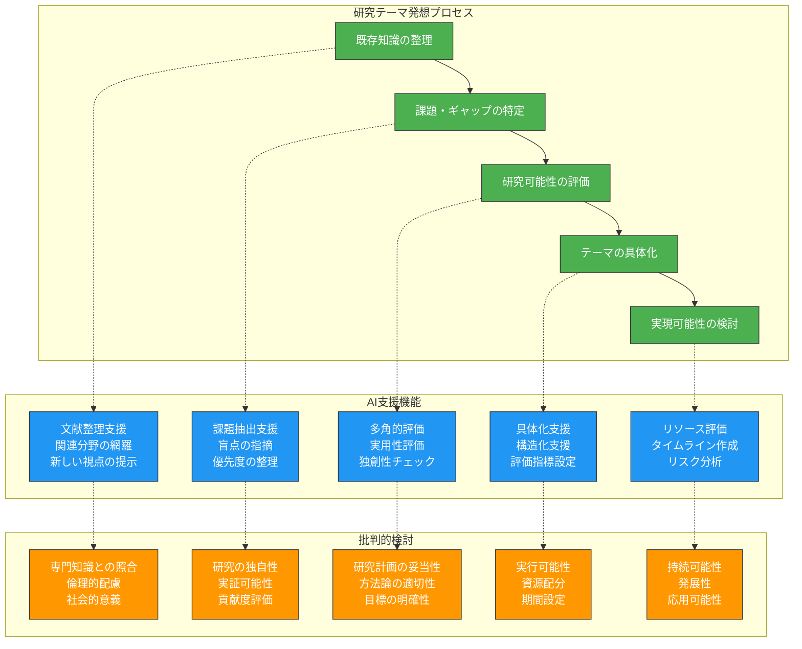
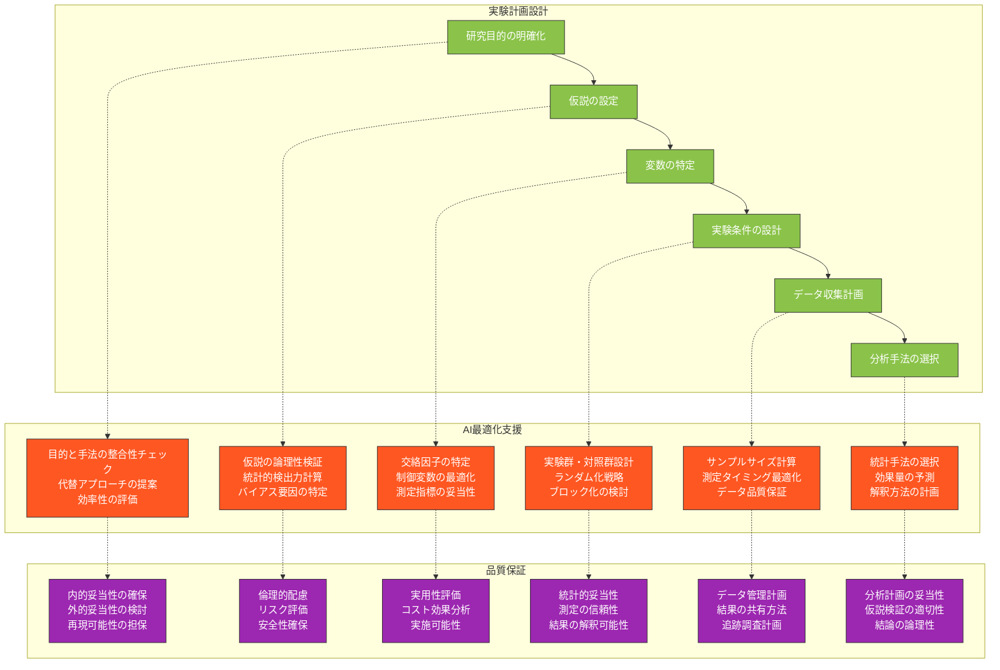
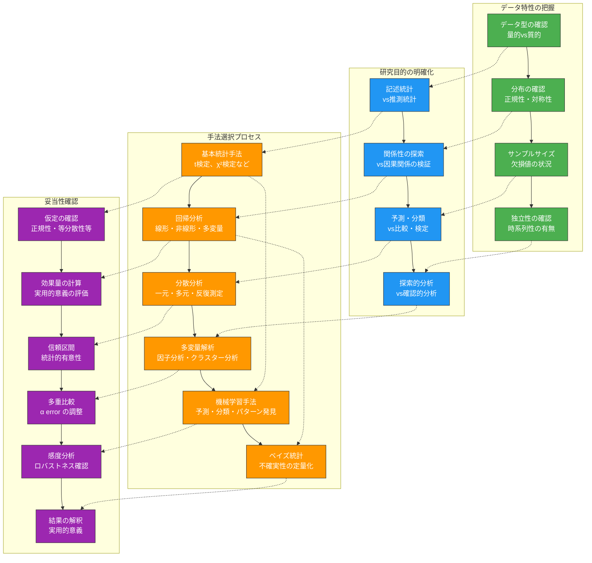
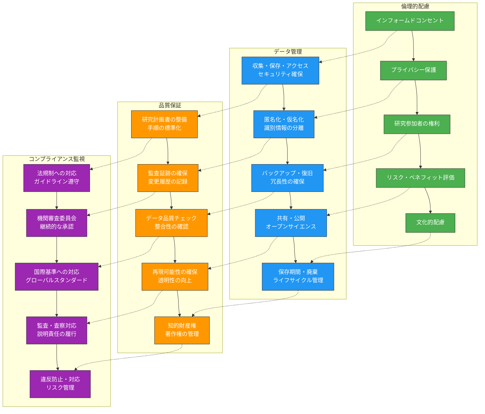
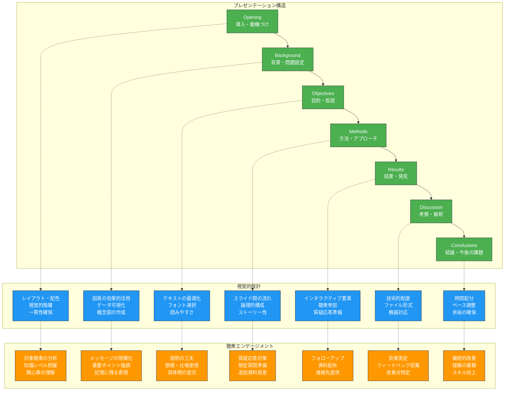

生成AIを研究活動に効果的に統合することで、研究の質を向上させながら効率性を高めることができます。本章では、認知負債のリスクを避けながら、研究企画から成果発表まで、研究活動の各段階での戦略的なAI活用方法を解説します。

# 研究企画・計画立案の支援

## 研究テーマ設定と先行研究調査

**研究テーマ設定**は、研究の出発点となる重要な段階です。生成AIを活用することで、より体系的で包括的な研究企画を効率的に行えます。ただし、AIの提案をそのまま採用するのではなく、研究者自身の専門性と批判的思考で検証することが不可欠です。

### 研究テーマ発想支援の仕組み



### 研究テーマ設定支援プロンプト

**包括的テーマ探索プロンプト**：
```
あなたは[専門分野]の研究コンサルタントです。
新しい研究テーマの設定を支援してください。

## 背景情報
- 研究者の専門分野：[具体的な専門領域]
- 研究経験：[経験レベル]
- 利用可能リソース：[研究設備、期間、予算等]
- 興味のある方向性：[具体的な関心領域]

## 探索すべき観点
### 1. 現在の研究動向分析
- この分野で現在注目されている主要テーマ
- 解決されていない重要な課題
- 新たに生まれつつある研究領域

### 2. 研究ギャップの特定
- 既存研究で不足している視点
- 技術的・方法論的な改善の余地
- 学際的アプローチの可能性

### 3. 実現可能性の評価
- 利用可能なリソースでの実行可能性
- 必要な技術・設備の入手可能性
- 適切な研究期間の設定

## 出力要求
1. 3-5個の具体的な研究テーマ候補
2. 各テーマの背景と意義
3. 予想される困難と対策
4. 期待される成果と社会的インパクト
5. 次のステップの具体的提案

段階的に分析し、各判断の根拠も含めて提案してください。
```

## 先行研究調査の効率化

**先行研究調査**は研究の基盤を築く重要なプロセスです。AIを活用することで、膨大な文献から関連性の高い研究を効率的に特定し、整理できます。

### 文献調査支援戦略

**段階的文献調査プロンプト**：
```
[研究テーマ]に関する先行研究の包括的調査を支援してください。

## 調査対象
- 研究テーマ：[具体的なテーマ]
- 調査期間：過去[年数]年間
- 対象分野：[主分野＋関連分野]

## 調査の段階的進行
### ステージ1：概観把握
- この分野の主要な研究者・研究機関
- 代表的な研究の流れと発展
- 主要な論争点や見解の相違

### ステージ2：詳細分析
- 研究手法の変遷と現在の主流
- 未解決の課題と今後の方向性
- 技術的・理論的な限界点

### ステージ3：ギャップ分析
- 既存研究で扱われていない側面
- 改善の余地がある方法論
- 新しい視点から取り組める課題

## 整理すべき要素
1. 時系列での研究発展の整理
2. 研究手法の分類と比較
3. 主要な発見・成果の体系化
4. 残された課題の優先度評価
5. 自身の研究との関連性分析

各段階で重要な論文や研究を具体的に挙げ、その貢献と限界を説明してください。
```

## 実験計画法の最適化支援

**実験計画**の設計において、AIは様々な角度からの検討を支援し、見落としがちな要因の特定や効率的な実験設計を可能にします。

### 実験設計支援の構造



### 実験計画最適化プロンプト

**実験設計総合支援プロンプト**：
```
[研究分野]の実験計画を最適化してください。

## 研究概要
- 研究目的：[具体的な目的]
- 検証したい仮説：[明確な仮説]
- 対象：[実験対象の詳細]
- 利用可能リソース：[設備、期間、予算等]

## 最適化すべき要素
### 1. 実験設計の基本構造
- 実験群・対照群の設定
- ランダム化とブロック化の戦略
- 交絡因子の制御方法

### 2. 測定・データ収集
- 測定指標の選択と妥当性
- サンプルサイズの計算
- データ収集のタイミングと頻度

### 3. 統計的考慮事項
- 適切な統計手法の選択
- 検出力分析と効果量の予測
- 多重比較の問題への対処

### 4. 実用的考慮事項
- 実施可能性と効率性
- 倫理的配慮と安全性
- コストと時間の最適化

## 出力要求
1. 最適化された実験設計の詳細
2. 各選択の科学的根拠
3. 予想される問題と対策
4. 代替設計案の提示
5. 実施時の注意点とチェックリスト

実験の妥当性と効率性を両立する設計を提案してください。
```

## 予算・資源配分の効率化

研究プロジェクトの成功には、限られたリソースの効率的な配分が重要です。AIを活用することで、より戦略的で現実的な資源配分計画を立てることができます。

### 資源配分計画支援プロンプト

**研究資源最適配分プロンプト**：
```
研究プロジェクトの資源配分を最適化してください。

## プロジェクト概要
- 研究期間：[開始日〜終了日]
- 総予算：[金額]
- 研究チーム：[人数、専門性]
- 主要な研究活動：[具体的な活動内容]

## 配分すべきリソース
### 1. 人的リソース
- 研究者の時間配分
- 専門性に応じた役割分担
- 外部協力者の活用

### 2. 物的リソース
- 実験設備・機器
- 消耗品・材料
- ソフトウェア・ライセンス

### 3. 資金配分
- カテゴリ別予算配分
- 時期別支出計画
- 予備費の設定

### 4. 時間配分
- フェーズ別スケジュール
- クリティカルパスの特定
- バッファ時間の設定

## 最適化の観点
- 研究目標達成への貢献度
- コストパフォーマンス
- リスク軽減効果
- 柔軟性の確保

効率的で現実的な配分計画を、リスク対策も含めて提案してください。
```

# データ解析・統計処理の支援

## 適切な統計手法の選択支援

**統計手法の選択**は、研究の妥当性を決定する重要な要素です。AIを活用することで、データの特性と研究目的に最適な統計手法を選択し、適切な解釈を行うことができます。

### 統計手法選択の体系的アプローチ



### 統計手法選択支援プロンプト

**統計解析戦略設計プロンプト**：
```
研究データに最適な統計解析戦略を設計してください。

## データ概要
- データ型：[量的・質的データの詳細]
- サンプルサイズ：[n = ?]
- 測定レベル：[名義・順序・間隔・比率尺度]
- データ構造：[独立・対応・時系列等]

## 研究目的
- 主要な研究仮説：[具体的な仮説]
- 検証したい関係性：[変数間の関係]
- 期待する分析結果：[記述・推測・予測等]

## 分析戦略の設計要素
### 1. 記述統計
- 中心傾向と散布度の測定
- データの分布特性の把握
- 外れ値・異常値の検出

### 2. 推測統計
- 適切な検定手法の選択
- 効果量の計算と解釈
- 信頼区間の設定

### 3. 多変量解析
- 複数変数間の関係分析
- 交絡因子の制御
- モデルの妥当性評価

### 4. 結果の解釈
- 統計的有意性vs実用的意義
- 結果の一般化可能性
- 限界と今後の課題

## 出力要求
1. 段階的な分析手順
2. 各手法選択の理由
3. 仮定の確認方法
4. 結果解釈の指針
5. 注意すべき落とし穴

データの特性と研究目的に最適な分析戦略を提案してください。
```

## 解析結果の解釈と可視化

**データの可視化と解釈**は、研究成果を効果的に伝達し、新たな知見を発見するための重要なスキルです。AIを活用することで、より洞察に富んだ分析と表現が可能になります。

### 効果的な可視化戦略

**可視化・解釈支援プロンプト**：
```
統計解析結果の効果的な可視化と解釈を支援してください。

## 解析結果概要
- 使用した統計手法：[具体的な手法]
- 主要な結果：[統計量、p値、効果量等]
- 検証された仮説：[支持・棄却の結果]

## 可視化の要求
### 1. 基本的な可視化
- データの分布を示すグラフ
- 主要な結果を明示する図表
- 比較しやすい形での表現

### 2. 高度な可視化
- 多変数間の関係の可視化
- 時系列変化の表現
- 相互作用効果の図示

### 3. 学術的表現
- 論文掲載に適した図表
- 国際基準に準拠した表記
- 色覚障害への配慮

## 解釈の要素
### 1. 統計的解釈
- 数値的結果の意味
- 統計的仮定の確認結果
- 効果量の実用的意義

### 2. 理論的解釈
- 既存理論との関連
- 新たな知見の位置づけ
- 理論的含意の説明

### 3. 実用的解釈
- 現実への応用可能性
- 政策・実践への示唆
- 社会的インパクト

具体的な図表案と解釈文を提示してください。
```

## 研究倫理・データ管理の支援

**研究倫理とデータ管理**は、研究の信頼性と持続可能性を確保するための基盤です。AIを活用することで、包括的で実践的な管理システムを構築できます。

### 研究倫理支援の枠組み



### 研究倫理・データ管理支援プロンプト

**包括的研究管理システム設計プロンプト**：
```
研究プロジェクトの倫理的配慮とデータ管理システムを設計してください。

## 研究概要
- 研究分野：[具体的な分野]
- 研究対象：[人・動物・データ等]
- データ種別：[個人情報・機密情報等の有無]
- 研究期間：[期間]
- 関連法規制：[適用される法律・ガイドライン]

## 設計すべき要素
### 1. 倫理的配慮
- 研究参加者の権利保護
- インフォームドコンセントの取得
- プライバシー・機密性の確保
- リスクの最小化

### 2. データ管理計画
- データ収集・整理・保存の手順
- セキュリティ対策
- アクセス権限の管理
- バックアップ・復旧計画

### 3. 品質保証システム
- データ品質の管理
- 監査証跡の確保
- 変更管理・バージョン管理
- 文書化・標準化

### 4. コンプライアンス対応
- 法規制・ガイドラインへの対応
- 機関審査委員会への対応
- 継続的なモニタリング
- 違反防止・対応計画

## 出力要求
1. 包括的な管理システムの設計
2. 実施手順とチェックリスト
3. リスク評価と対策
4. 継続的改善の仕組み
5. 緊急時対応計画

実用的で継続可能なシステムを提案してください。
```

# 学術発表・論文執筆の支援

## 論文構成の改善と効率化

**論文執筆**は研究成果の発信において重要な段階です。AIを活用することで、より論理的で読みやすい論文構成を効率的に作成できます。ただし、論文の独創性と学術的誠実性を保つことが前提となります。

### 論文構成最適化の戦略

**論文構成支援プロンプト**：
```
学術論文の構成を最適化してください。

## 論文概要
- 研究分野：[具体的な分野]
- 論文種別：[原著・総説・ケースレポート等]
- 対象ジャーナル：[ジャーナル名・投稿規定]
- 研究内容：[主要な発見・貢献]

## 構成要素の最適化
### 1. Abstract
- 背景・目的の簡潔な説明
- 方法の要点
- 主要な結果
- 結論と意義

### 2. Introduction
- 研究背景の体系的説明
- 先行研究のレビューと問題点
- 研究目的と仮説の明確化
- 研究の意義と新規性

### 3. Methods
- 研究設計の詳細
- 対象・材料の説明
- 手順の再現可能な記述
- 統計解析方法

### 4. Results
- データの体系的提示
- 図表の効果的配置
- 客観的事実の記述
- 統計結果の正確な報告

### 5. Discussion
- 結果の解釈と意義
- 先行研究との比較
- 限界点の認識
- 今後の展望

## 改善の観点
- 論理的一貫性
- 読みやすさ・明確性
- 学術的厳密性
- 国際標準への準拠

構造的で説得力のある論文構成を提案してください。
```

## 英語表現の向上支援

**英語論文の執筆**において、正確で自然な英語表現は重要な要素です。AIを活用することで、学術英語の質を向上させることができます。

### 学術英語改善支援

**英語表現改善プロンプト**：
```
学術論文の英語表現を改善してください。

## 改善対象
- 文章の種類：[Abstract/Introduction/Methods等]
- 専門分野：[具体的な分野]
- 対象読者：[国際的な研究者]

## 改善の観点
### 1. 正確性
- 専門用語の適切な使用
- 文法的な正確性
- 意味の明確性

### 2. 自然性
- 学術英語らしい表現
- 読みやすい文体
- 適切な語彙選択

### 3. 簡潔性
- 冗長な表現の削除
- 効率的な情報伝達
- 明瞭な論理展開

### 4. 一貫性
- 用語の統一
- 表記の統一
- 文体の統一

## 出力要求
1. 改善された英語表現
2. 修正理由の説明
3. 代替表現の提案
4. 学術英語の特徴説明
5. 避けるべき表現の指摘

読者にとって理解しやすく、学術的に適切な英語を提案してください。
```

## プレゼンテーション資料の最適化

**学術発表**における効果的なプレゼンテーションは、研究成果の理解促進と影響力向上に重要です。

### プレゼンテーション最適化戦略



### プレゼンテーション最適化プロンプト

**学術発表資料最適化プロンプト**：
```
学術発表用プレゼンテーション資料を最適化してください。

## 発表概要
- 発表時間：[分数]
- 聴衆：[専門家・一般・学生等]
- 発表形式：[口頭発表・ポスター等]
- 研究内容：[主要な成果]

## 最適化要素
### 1. 構成・流れ
- 論理的で分かりやすいストーリー
- 時間配分の最適化
- 聴衆の注意を維持する工夫

### 2. 視覚的設計
- 効果的な図表の配置
- 読みやすいレイアウト
- 一貫したデザイン

### 3. 内容の最適化
- 重要ポイントの強調
- 適切な詳細レベル
- 分かりやすい説明

### 4. 聴衆対応
- 対象聴衆に適した内容
- インタラクティブな要素
- 質疑応答の準備

## 出力要求
1. 最適化されたスライド構成
2. 各スライドの改善提案
3. 発表時の注意点
4. 想定質問と回答案
5. 効果測定の方法

聴衆に分かりやすく、印象に残る発表資料を提案してください。
```

# 学生研究指導の質向上

## 個別指導計画の立案支援

**学生研究指導**において、個々の学生の特性と研究段階に応じた指導計画の立案は、教育効果を最大化するために重要です。

### 個別指導計画立案プロンプト

**学生指導計画作成プロンプト**：
```
学生の研究指導計画を個別に立案してください。

## 学生情報
- 学年・専攻：[具体的な情報]
- 研究経験：[過去の経験レベル]
- 研究テーマ：[現在のテーマ]
- 強み・課題：[学習特性の分析]

## 指導計画要素
### 1. 段階別目標設定
- 短期目標（1-3ヶ月）
- 中期目標（6ヶ月-1年）
- 長期目標（最終目標）

### 2. 指導方法の個別化
- 学習スタイルに応じた指導
- 動機づけの方法
- フィードバックの頻度・方法

### 3. 研究スキル育成
- 必要なスキルの特定
- 段階的な習得計画
- 実践機会の提供

### 4. 進捗管理システム
- 定期的な確認方法
- 評価基準の設定
- 軌道修正の仕組み

効果的で実現可能な指導計画を立案してください。
```

## 進捗管理と評価システム

**進捗管理**は、学生の研究活動を支援し、適切なタイミングで指導を行うために不可欠です。

### 進捗管理システム設計

**進捗管理システム構築プロンプト**：
```
学生研究の進捗管理システムを設計してください。

## 管理対象
- 学生数：[指導学生数]
- 研究期間：[研究期間]
- 研究の多様性：[テーマの種類]

## システム要件
### 1. 進捗可視化
- 研究段階の明確化
- マイルストーンの設定
- 進捗状況の把握

### 2. 評価機能
- 多面的評価の実施
- 客観的指標の設定
- 継続的な改善支援

### 3. コミュニケーション
- 定期的な面談計画
- フィードバックの記録
- 問題の早期発見

### 4. 支援機能
- リソースの提供
- 同期とのつながり
- メンタルサポート

実用的で持続可能なシステムを設計してください。
```

## 研究倫理教育の充実

**研究倫理教育**は、次世代の研究者育成において不可欠な要素です。AIを活用することで、より実践的で効果的な倫理教育を実現できます。

### 研究倫理教育プログラム設計

**研究倫理教育カリキュラム設計プロンプト**：
```
実践的な研究倫理教育プログラムを設計してください。

## 対象
- 学習者：[大学院生・学部生等]
- 専門分野：[具体的な分野]
- 教育期間：[期間]

## 教育内容
### 1. 基礎知識
- 研究倫理の基本原則
- 学術的誠実性
- 法的・制度的枠組み

### 2. 実践的応用
- 具体的事例の検討
- 判断力の育成
- 問題解決能力の向上

### 3. 継続的学習
- 最新動向の把握
- 自己点検の習慣
- 同僚との相談体制

効果的で実践的な教育プログラムを提案してください。
```

この第8章では、研究活動の各段階におけるAI活用方法を包括的に解説しました。研究企画から成果発表、学生指導まで、認知負債を避けながら効果的にAIを活用することで、研究の質と効率性を同時に向上させることができます。次章では、学生指導とメンタリングにおけるより詳細な応用方法について説明します。