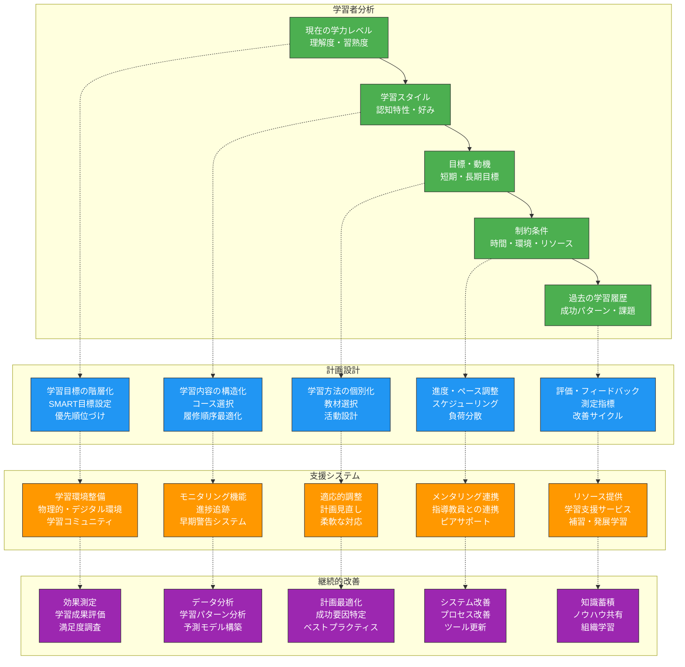
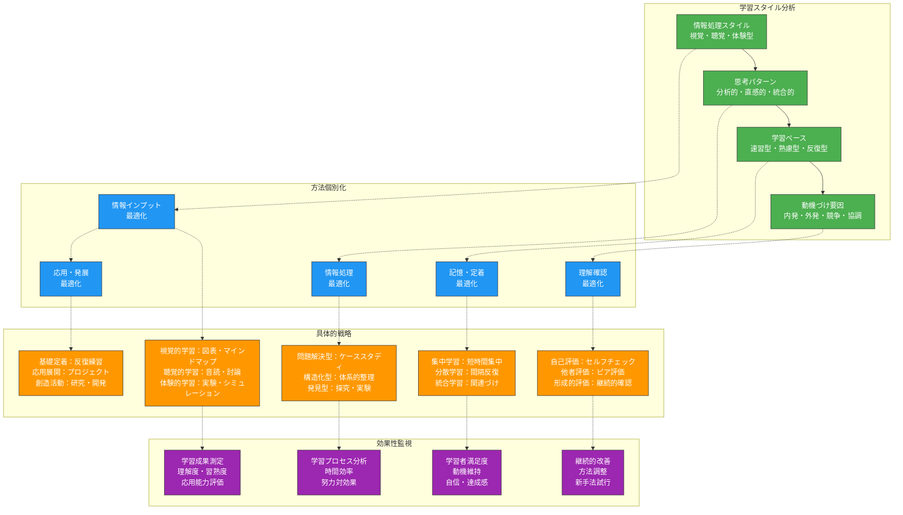
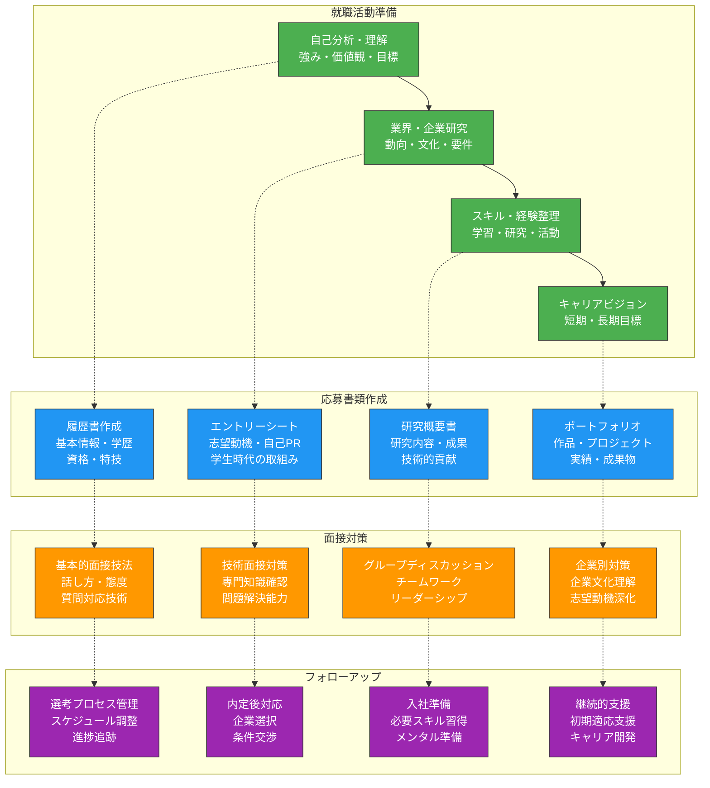
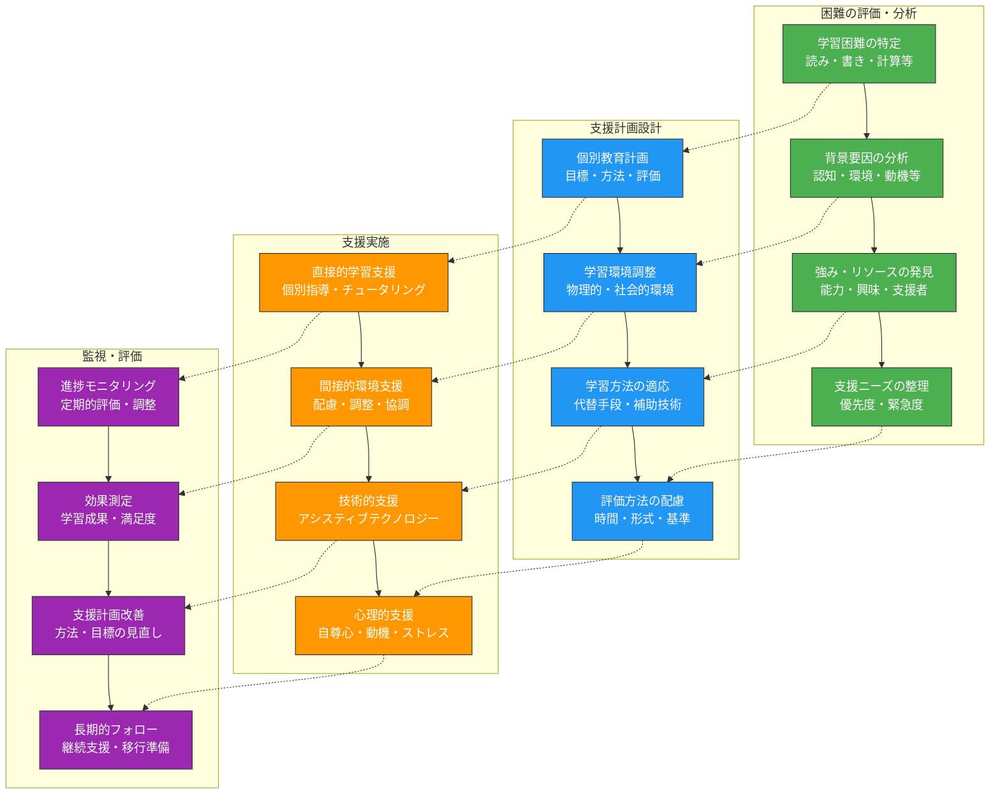
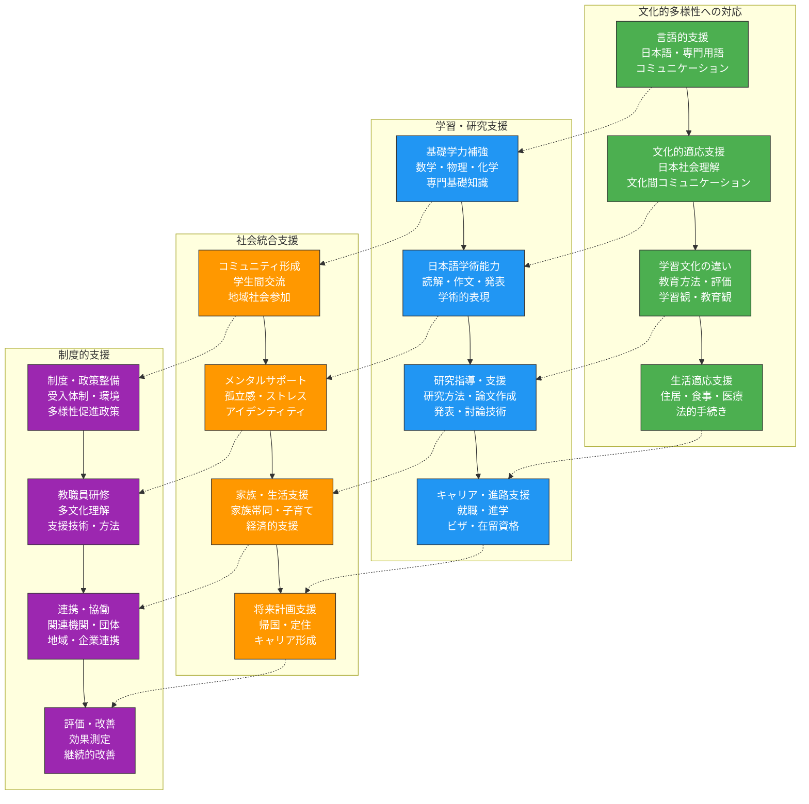

生成AIを学生指導とメンタリングに統合することで、より個別化された効果的な支援を実現できます。本章では、認知負債のリスクを回避しながら、学習相談から進路指導、多様な学習者への支援まで、包括的な学生支援の革新的アプローチを解説します。

# 学習相談・アドバイジングの効率化

## 個別学習計画の立案支援

**個別学習計画の立案**は、学生一人ひとりの学習効果を最大化するための基盤となります。AIを活用することで、学生の特性、目標、制約条件を総合的に考慮した最適な学習計画を効率的に作成できます。

### 個別学習計画立案の体系的アプローチ



### 個別学習計画作成支援プロンプト

**包括的学習計画設計プロンプト**：
```
学生の個別学習計画を包括的に設計してください。

## 学習者プロファイル
- 学年・専攻：[具体的な情報]
- 現在の学力レベル：[各科目の習熟度]
- 学習スタイル：[視覚・聴覚・体験型等]
- 学習目標：[短期・中期・長期目標]
- 制約条件：[時間・環境・健康状態等]

## 分析すべき要素
### 1. 学習者特性分析
- 認知能力・学習速度
- 興味・関心・動機
- 既習内容・基礎知識
- 学習困難・苦手分野

### 2. 目標設定・優先順位
- 必修・選択科目の整理
- 短期目標（1学期）の具体化
- 中期目標（1年）の設定
- 長期目標（卒業・進路）との整合

### 3. 学習戦略・方法
- 効果的な学習法の選択
- 時間配分・スケジューリング
- 復習・定着のタイミング
- 発展・応用学習の計画

### 4. 支援・サポート体制
- 指導教員との連携
- 学習グループ・ピアサポート
- 学習支援サービスの活用
- 家族・環境からの支援

## 出力要求
1. 詳細な学習計画（週単位・月単位）
2. 各段階での達成目標と評価基準
3. 学習方法・戦略の具体的提案
4. 想定される困難と対策
5. 定期的な見直し・調整の仕組み

実現可能で効果的な個別学習計画を提案してください。
```

## 履修指導の効率化と質向上

**履修指導**は、学生の学習効果を最大化し、確実な単位取得と能力育成を支援する重要な活動です。AIを活用することで、より戦略的で個別化された履修指導を効率的に実施できます。

### 履修指導の多角的アプローチ

**戦略的履修計画支援プロンプト**：
```
理工系学生の戦略的履修計画を支援してください。

## 学生基本情報
- 学年・専攻：[詳細情報]
- 既取得単位：[科目・成績]
- 進路希望：[就職・大学院・研究等]
- 興味分野：[具体的な関心領域]

## 履修計画の要素
### 1. 卒業要件の確認
- 必修科目の履修状況
- 選択科目の取得状況
- 実験・実習・ゼミの計画
- 卒業研究・論文の準備

### 2. 能力開発の観点
- 専門基礎力の段階的構築
- 応用・発展能力の育成
- 学際的知識の獲得
- 実践的スキルの向上

### 3. 進路実現の観点
- 就職希望業界に必要な知識・スキル
- 大学院進学に向けた準備
- 資格取得に向けた学習
- 研究活動への参加

### 4. 学習効率の観点
- 科目間の関連性・順序性
- 学習負荷の分散
- 理解困難科目への対策
- 得意分野の伸長

## 指導内容
### 1. 履修科目選択
- 各学期の履修科目推奨
- 科目選択の理由・根拠
- 代替選択肢の提示
- リスク要因の説明

### 2. 学習戦略
- 各科目の効果的学習法
- 関連科目の統合的理解
- 予習・復習の計画
- 評価・試験対策

### 3. 進路準備
- 必要な追加学習の特定
- インターンシップ・研究参加
- 資格取得の計画
- ポートフォリオ構築

実用的で実現可能な履修指導案を提案してください。
```

## 学習方法改善の個別提案

**学習方法の改善**は、学習効率と学習効果を同時に向上させるために重要です。学生一人ひとりの特性に応じた個別化された学習方法を提案することで、より効果的な学習を支援できます。

### 学習方法個別化の戦略



### 学習方法改善支援プロンプト

**個別学習方法最適化プロンプト**：
```
学習者の特性に基づいて、個別化された学習方法改善案を提案してください。

## 現状分析
- 現在の学習方法：[具体的な学習手順]
- 学習成果：[成績・理解度・満足度]
- 学習時間：[投入時間・効率性]
- 困難・課題：[具体的な問題点]

## 学習者特性
### 1. 認知特性
- 情報処理スタイル：[視覚・聴覚・体験型]
- 注意特性：[集中持続時間・注意範囲]
- 記憶特性：[短期・長期記憶の特徴]
- 思考スタイル：[論理・直感・創造的]

### 2. 学習環境
- 物理的環境：[場所・時間・条件]
- 社会的環境：[一人・グループ・指導]
- 技術的環境：[デジタルツール活用]
- 心理的環境：[ストレス・動機・自信]

### 3. 目標・制約
- 学習目標：[短期・長期目標]
- 時間的制約：[利用可能時間]
- 能力的制約：[現在の能力レベル]
- 環境的制約：[利用可能リソース]

## 改善提案要素
### 1. インプット最適化
- 情報提示方法の改善
- 教材・リソースの選択
- 学習順序・ペースの調整
- 予習・準備の方法

### 2. プロセス最適化
- 理解促進技法
- 記憶・定着方法
- 思考・分析技法
- 問題解決アプローチ

### 3. アウトプット最適化
- 理解確認方法
- 応用・実践機会
- 表現・発信活動
- 振り返り・改善活動

## 出力要求
1. 現在の方法の課題分析
2. 特性に基づく改善戦略
3. 具体的な学習手順の提案
4. 実施上の注意点・コツ
5. 効果測定・調整の方法

実践的で継続可能な改善案を提案してください。
```

# キャリア指導・進路相談の充実

## 進路選択肢の情報収集と整理

**進路選択支援**において、豊富で正確な情報の収集と整理は、学生が適切な判断を行うための基盤となります。AIを活用することで、包括的で個別化された進路情報を効率的に提供できます。

### 進路情報収集・整理の体系化

**進路情報総合分析プロンプト**：
```
理工系学生の進路選択を支援する包括的な情報収集・整理を行ってください。

## 学生プロファイル
- 専攻分野：[具体的な専門領域]
- 学年・成績：[現在の状況]
- 興味・関心：[研究・技術分野]
- 価値観：[重視する要素]
- 制約条件：[地理・経済・家庭等]

## 情報収集範囲
### 1. 就職関連情報
#### 業界動向
- 理工系関連業界の現状・将来性
- 技術革新・市場変化の影響
- 成長分野・衰退分野の分析
- グローバル化・デジタル化の影響

#### 職種・キャリアパス
- 技術職・研究職・開発職の詳細
- 管理職・コンサルタント等の可能性
- スタートアップ・ベンチャーでの機会
- 公務員・教員等の公的セクター

#### 企業情報
- 大手企業・中小企業の特徴比較
- 外資系企業・日系企業の違い
- 勤務条件・待遇・福利厚生
- 企業文化・働き方の多様性

### 2. 進学関連情報
#### 大学院進学
- 修士・博士課程の特徴
- 研究室選択のポイント
- 指導教員との関係
- 研究費・奨学金の確保

#### 留学・海外進学
- 海外大学院の選択肢
- 申請手続き・準備事項
- 資金調達・奨学金制度
- 語学・文化的準備

### 3. 資格・スキル開発
- 専門資格の取得メリット
- 必要なスキル・能力の開発
- 継続教育・生涯学習の重要性
- ポートフォリオ構築の方法

## 整理・分析の観点
### 1. 適性マッチング
- 学生の特性と進路の適合性
- 強み・弱みと職業要件の対比
- 興味・価値観と職業文化の一致
- 将来目標と進路の整合性

### 2. 実現可能性評価
- 必要な準備・努力の程度
- 競争の激しさ・難易度
- 経済的・時間的コスト
- 家族・環境の支援状況

### 3. リスク・機会分析
- 各選択肢のリスク要因
- 将来の変化に対する適応性
- 代替選択肢の確保
- 失敗時の回復可能性

## 出力要求
1. 体系的に整理された進路選択肢
2. 各選択肢の詳細分析
3. 学生特性との適合性評価
4. 実現に向けた具体的ステップ
5. 意思決定支援ツール・フレームワーク

学生の自律的な意思決定を支援する包括的な情報を提供してください。
```

## 就職活動支援資料の作成

**就職活動支援**において、効果的な支援資料の作成は学生の成功確率を大幅に向上させます。AIを活用することで、個々の学生の特性と志望に応じたカスタマイズされた支援資料を効率的に作成できます。

### 就職活動総合支援戦略



### 就職活動支援資料作成プロンプト

**個別化就職支援資料作成プロンプト**：
```
理工系学生の就職活動を包括的に支援する資料を作成してください。

## 学生情報
- 専攻・研究分野：[具体的な分野]
- 研究内容・成果：[主要な研究・プロジェクト]
- スキル・経験：[技術・語学・リーダーシップ等]
- 志望業界・職種：[希望する方向性]
- 個人特性：[性格・価値観・強み]

## 作成すべき支援資料
### 1. 自己分析・整理ツール
#### 強み・特徴の整理
- 技術的強み・専門性の特定
- 人間的魅力・ソフトスキルの発見
- 成功体験・課題克服経験の整理
- 学習能力・成長性の証明

#### 価値観・目標の明確化
- 仕事に求める価値・意味
- キャリアビジョン・将来像
- ワークライフバランスの考え方
- 社会貢献・やりがいの源泉

### 2. 応募書類作成支援
#### 効果的な自己PR
- 研究・学習経験の魅力的表現
- 技術的成果の分かりやすい説明
- チームワーク・リーダーシップ体験
- 困難克服・成長エピソード

#### 志望動機の構築
- 業界・企業選択の論理的理由
- 自身の強みと企業ニーズの一致
- 将来のキャリアビジョンとの整合
- 具体的な貢献可能性の提示

### 3. 面接対策資料
#### 基本的質問への回答準備
- 自己紹介・自己PRの構成
- 志望動機・企業選択理由
- 学生時代の取組み・研究内容
- 将来の目標・キャリアプラン

#### 技術面接対策
- 専門知識の整理・確認
- 研究内容の分かりやすい説明
- 問題解決プロセスの実演
- 最新技術動向への理解

### 4. 企業・業界研究支援
#### 効率的な情報収集方法
- 企業情報の収集・整理手法
- 業界動向・将来性の分析
- 社員・OB/OGからの情報収集
- インターンシップ・説明会活用

#### 比較・評価の観点
- 企業文化・働き方の評価基準
- キャリア成長機会の比較
- 待遇・条件面の検討事項
- 長期的視点での企業選択

## 出力要求
1. 段階的な準備スケジュール
2. 各段階での具体的行動計画
3. チェックリスト・評価基準
4. よくある失敗と対策
5. 継続的改善の仕組み

実践的で効果的な就職活動支援資料を作成してください。
```

## 大学院進学指導の個別化

**大学院進学指導**では、学生の研究関心、能力、将来目標を総合的に考慮した個別化されたアドバイスが重要です。AIを活用することで、より戦略的で実現可能な進学計画を支援できます。

### 大学院進学総合指導プロンプト

**大学院進学戦略設計プロンプト**：
```
理工系学生の大学院進学を包括的に指導してください。

## 学生背景
- 現在の専攻・成績：[具体的情報]
- 研究経験・実績：[研究室配属・成果]
- 研究関心・志向：[興味分野・方向性]
- 語学能力・国際経験：[TOEIC/TOEFL・留学等]
- 将来目標：[研究者・技術者・その他]

## 指導内容
### 1. 進学目的・目標の明確化
#### 進学の動機・理由
- 研究への関心・情熱の確認
- キャリア目標との整合性
- 学部教育では不十分な理由
- 代替選択肢との比較検討

#### 学位取得の意義
- 修士・博士の違いと選択基準
- 各学位がもたらすキャリア機会
- 投資対効果の現実的評価
- 長期的なキャリア形成への影響

### 2. 進学先選択・戦略
#### 国内大学院選択
- 研究室・指導教員の選択基準
- 研究環境・設備の評価
- 学位取得要件・期間の確認
- 奨学金・経済支援の確保

#### 海外大学院選択
- 国・地域の選択基準
- 大学・プログラムの評価方法
- 申請要件・選考プロセス
- 資金計画・生活準備

### 3. 受験・申請準備
#### 国内大学院受験
- 入試科目・内容の確認
- 研究計画書の作成支援
- 面接・口述試験の準備
- 推薦状の依頼・準備

#### 海外大学院申請
- 必要書類の準備・作成
- 英語能力試験の対策
- 研究提案書の作成
- 推薦状・エッセイの準備

### 4. 研究計画・準備
#### 研究テーマの設定
- 関心分野の具体化・焦点化
- 既存研究の調査・分析
- 独創性・実現可能性の評価
- 社会的意義・インパクトの検討

#### 研究能力の向上
- 必要な知識・技術の習得
- 研究手法・分析技術の学習
- 学会発表・論文執筆の経験
- 国際的な研究交流の機会

## 支援要素
### 1. 情報提供・収集
- 最新の入試情報・動向
- 研究室・指導教員の情報
- 奨学金・助成制度の案内
- 先輩・OB/OGの体験談

### 2. 能力開発支援
- 研究スキルの向上支援
- 英語力・国際性の向上
- プレゼンテーション能力
- ネットワーキング・人脈形成

### 3. メンタル・ライフサポート
- 進学への不安・懸念への対応
- 経済的・生活面の相談
- 家族・周囲との調整支援
- ストレス管理・メンタルケア

実現可能で効果的な進学指導計画を提案してください。
```

# 多様な学習者への支援

## 学習困難学生への個別支援計画

**学習困難を抱える学生**への支援において、個々の困難の特性を理解し、適切な支援計画を立案することが重要です。AIを活用することで、エビデンスに基づいた効果的な個別支援を実現できます。

### 学習困難支援の包括的アプローチ



### 学習困難支援計画作成プロンプト

**個別学習困難支援計画プロンプト**：
```
学習困難を抱える理工系学生への包括的支援計画を作成してください。

## 学生情報
- 基本情報：[学年・専攻・成績状況]
- 学習困難の特徴：[具体的な困難・症状]
- 診断・評価：[専門的診断・検査結果]
- 既存の支援：[現在受けている支援]
- 本人・家族の希望：[支援への期待・要望]

## 困難の詳細分析
### 1. 認知的困難
- 注意・集中の問題
- 記憶・情報処理の困難
- 言語理解・表現の問題
- 数学・論理的思考の困難

### 2. 学習行動の困難
- 学習方法・戦略の未習得
- 時間管理・計画性の問題
- 動機・意欲の低下
- 学習習慣の未確立

### 3. 環境的要因
- 物理的学習環境の問題
- 社会的支援の不足
- 経済的制約・家庭環境
- 教育機関の理解・配慮不足

## 支援計画の構成要素
### 1. 学習支援
#### 直接的指導
- 個別指導・チュータリング
- 学習方法・戦略の指導
- 補習・追加学習の機会
- ピアサポート・グループ学習

#### 環境調整
- 座席・照明等の物理的配慮
- 試験・課題の時間延長
- 代替評価方法の提供
- 情報提供方法の調整

### 2. 技術的支援
- アシスティブテクノロジーの活用
- デジタル教材・ツールの使用
- 音声認識・読み上げソフト
- 視覚的支援・構造化ツール

### 3. 心理・社会的支援
- カウンセリング・メンタルサポート
- 自己理解・自己受容の促進
- 社会的スキル・コミュニケーション
- 将来計画・キャリア支援

### 4. 連携・協働
- 教員・職員間の情報共有
- 専門機関との連携
- 家族・保護者との協働
- 同級生・友人への理解促進

## 実施・評価計画
### 1. 短期目標（1-3ヶ月）
- 具体的・測定可能な目標設定
- 実施方法・担当者の明確化
- 進捗確認の方法・頻度
- 調整・修正の基準

### 2. 中長期目標（6ヶ月-2年）
- 段階的な能力向上目標
- 自立・自律性の向上
- 社会参加・キャリア形成
- 生活の質・満足度向上

包括的で実現可能な支援計画を提案してください。
```

## 優秀学生の才能伸長プログラム

**優秀な学生の才能を最大限に伸長**するためには、通常の教育カリキュラムを超えた挑戦的で個別化されたプログラムが必要です。AIを活用することで、各学生の特性と潜在能力に応じた最適な才能開発プログラムを設計できます。

### 才能伸長プログラム設計

**高能力学生育成プログラム設計プロンプト**：
```
優秀な理工系学生の才能を最大限に伸長するプログラムを設計してください。

## 学生プロファイル
- 学力・成績：[具体的な成績・順位]
- 特に優秀な分野：[数学・物理・プログラミング等]
- 研究・プロジェクト経験：[既存の経験・成果]
- 興味・関心：[深い関心を持つ領域]
- 性格・学習スタイル：[個人特性]

## プログラム設計要素
### 1. 挑戦的学習機会
#### 発展的学習内容
- 標準カリキュラムを超えた高度な内容
- 最新研究・技術動向の学習
- 学際的・融合的アプローチ
- 国際的視点・グローバルスタンダード

#### 研究活動参加
- 教員研究室での研究参加
- 独立研究プロジェクトの実施
- 産学連携プロジェクトへの参加
- 国際研究交流・共同研究

### 2. 能力開発・スキル向上
#### 高次思考能力
- 批判的思考・創造的思考
- 問題発見・問題設定能力
- システム思考・統合的思考
- メタ認知・学習方略

#### 研究・実践スキル
- 研究方法論・分析技術
- プレゼンテーション・発表技術
- 論文執筆・学術コミュニケーション
- プロジェクト管理・リーダーシップ

### 3. 機会・経験の提供
#### 学術活動
- 学会・シンポジウムでの発表
- 論文投稿・査読経験
- 国際会議・ワークショップ参加
- 学術ジャーナル編集協力

#### 実践・応用機会
- インターンシップ・企業連携
- コンテスト・コンペティション参加
- 起業・ベンチャー体験
- 社会問題解決プロジェクト

### 4. ネットワーク・メンタリング
#### 指導体制
- 複数教員による指導
- 外部専門家・研究者との交流
- 先輩・OB/OGとのネットワーク
- 国際的な研究者との接触

#### 同期・コミュニティ
- 同レベル学生との切磋琢磨
- 異分野優秀学生との交流
- オンライン・グローバルコミュニティ
- 生涯学習ネットワークの構築

## 実施・運営計画
### 1. 選抜・評価システム
- 多面的な能力評価方法
- 継続的な適性評価
- 動機・意欲の評価
- 成長可能性の判断

### 2. カリキュラム・進度管理
- 個別化された学習計画
- 柔軟なペース・進度調整
- 段階的な挑戦レベル設定
- 継続的な目標更新

### 3. 支援・リソース
- 特別な学習環境・設備
- 研究費・活動費の支援
- 時間・スケジュールの調整
- 心理的・精神的サポート

革新的で実効性の高い才能伸長プログラムを提案してください。
```

## 留学生・社会人学生への配慮

**多様な背景を持つ学生**への支援において、文化的・社会的背景の違いを理解し、それぞれのニーズに応じた配慮を提供することが重要です。

### 多様性対応支援戦略



### 多様な学習者支援プロンプト

**留学生・社会人学生総合支援プロンプト**：
```
多様な背景を持つ学習者への包括的支援システムを設計してください。

## 対象学習者の特性
### 留学生
- 出身国・文化背景：[具体的な国・地域]
- 日本語能力・学習経験：[JLPT レベル等]
- 専門分野・学習目標：[具体的な専攻・目標]
- 在留期間・将来計画：[学位取得・就職・帰国等]

### 社会人学生
- 職業・勤務経験：[具体的な職歴・経験]
- 学習動機・目標：[スキルアップ・転職・研究等]
- 時間的制約：[勤務・家庭・その他]
- 学習環境・条件：[通学・オンライン・夜間等]

## 支援領域・内容
### 1. 学習・学術支援
#### 基礎学力・日本語支援
- 専門分野の基礎知識補強
- 学術日本語・専門用語の習得
- レポート・論文作成技術
- プレゼンテーション・討論技術

#### 学習方法・環境調整
- 日本の教育システム・方法の理解
- 効果的な学習方法・時間管理
- ICT・デジタルツール活用
- 図書館・研究設備の利用

### 2. 生活・社会適応支援
#### 日常生活支援
- 住居・生活環境の確保
- 行政手続き・法的事項
- 医療・保険・金融サービス
- 交通・通信・買い物等

#### 文化間適応支援
- 日本社会・文化の理解
- コミュニケーション様式
- 人間関係・ネットワーク形成
- 文化的アイデンティティの維持

### 3. キャリア・将来支援
#### 進路・就職支援
- 日本での就職活動方法
- 業界・企業文化の理解
- ビザ・在留資格の手続き
- 帰国後のキャリア形成

#### ネットワーク・コミュニティ
- 同国出身者・同世代との交流
- 日本人学生・地域住民との交流
- 専門分野・業界関係者との接触
- 卒業生・OB/OGネットワーク

### 4. 特別配慮・個別支援
#### 学習上の配慮
- 言語的ハンディキャップへの配慮
- 文化的背景を考慮した評価
- 時間的制約への対応
- 家庭・仕事との両立支援

#### 心理・精神的支援
- 文化適応ストレスへの対応
- 孤立感・疎外感の軽減
- アイデンティティ・自尊心の維持
- 将来への不安・悩みの相談

## 実施体制・方法
### 1. 支援組織・体制
- 専門部署・担当者の配置
- 多職種・多分野の連携
- 外部機関・団体との協働
- ピアサポート・チューター制度

### 2. プログラム・サービス
- 段階的・継続的支援プログラム
- 個別ニーズに応じたカスタマイズ
- グループ・コミュニティ活動
- オンライン・遠隔支援

実効性が高く持続可能な支援システムを提案してください。
```

# メンタルヘルス・ウェルビーイング支援

## 学生の心理的支援の充実

**学生のメンタルヘルス支援**は、学習効果の向上と人格的成長にとって不可欠な要素です。AIを活用することで、より早期の発見と適切な支援を効率的に提供できます。

### 心理的支援体制の構築

**学生メンタルヘルス支援プロンプト**：
```
理工系学生の包括的メンタルヘルス・ウェルビーイング支援システムを設計してください。

## 対象学生の特徴
- 理工系特有のストレス要因
- 学年・発達段階別の課題
- 個人的リスク・保護要因
- 既存の支援・治療状況

## 支援システムの構成要素
### 1. 予防・啓発活動
- メンタルヘルス教育・リテラシー向上
- ストレス管理・コーピングスキル
- レジリエンス・回復力の育成
- 健康的な生活習慣の促進

### 2. 早期発見・アセスメント
- 定期的なスクリーニング・チェック
- リスク要因・警告サインの特定
- 多面的・継続的な評価
- プライバシー保護・倫理的配慮

### 3. 個別支援・介入
- カウンセリング・心理療法
- 薬物療法・医療連携
- 危機介入・緊急対応
- 継続的フォローアップ

### 4. 環境調整・支援
- 学習環境・負荷の調整
- 人間関係・ソーシャルサポート
- 経済的・生活面の支援
- 制度的配慮・合理的調整

実効性の高い支援システムを提案してください。
```

## ストレス管理・時間管理指導

**ストレス管理と時間管理**は、学業成功と心理的健康の両方にとって重要なスキルです。

### ストレス・時間管理指導プロンプト

**統合的ストレス・時間管理プログラム**：
```
理工系学生向けの包括的ストレス・時間管理指導プログラムを設計してください。

## プログラム構成要素
### 1. ストレス理解・評価
- ストレスの科学的理解
- 個人的ストレス要因の特定
- ストレス反応・症状の認識
- 適応的・非適応的対処の区別

### 2. 時間管理技術
- 優先順位設定・目標管理
- スケジューリング・計画立案
- 集中力・効率性の向上
- 完璧主義・拖延の克服

### 3. 統合的対処戦略
- 問題焦点・情動焦点対処
- マインドフルネス・リラクゼーション
- 社会的支援・コミュニケーション
- 生活習慣・セルフケア

実践的で効果的なプログラムを提案してください。
```

## 学習動機の維持・向上支援

**学習動機の維持・向上**は、継続的な学習と成長にとって重要な要素です。

### 動機づけ支援戦略プロンプト

**包括的学習動機支援プロンプト**：
```
理工系学生の学習動機を維持・向上させる包括的支援戦略を設計してください。

## 動機づけ要因の分析
### 1. 内発的動機
- 興味・好奇心・探究心
- 達成感・効力感・自律性
- 成長・発達・自己実現
- 創造性・独創性・革新性

### 2. 外発的動機
- 目標・報酬・評価
- 競争・比較・承認
- 将来・キャリア・実用性
- 社会的期待・責任・義務

### 3. 阻害要因
- 学習困難・挫折経験
- 過度な競争・プレッシャー
- 無関連感・無意味感
- 失敗恐怖・完璧主義

## 支援戦略・介入
### 1. 動機づけ環境の整備
- 挑戦的で達成可能な課題設定
- 自律性・選択権の保障
- 協働・相互支援の促進
- 多様性・個性の尊重

### 2. 個別化された支援
- 個人の動機パターン理解
- 強み・関心に基づく活動
- 段階的・継続的な成功体験
- 適切なフィードバック・評価

効果的で持続可能な動機づけ支援戦略を提案してください。
```

この第9章では、学生指導・メンタリングにおけるAI活用による革新的アプローチを包括的に解説しました。学習相談から進路指導、多様な学習者への配慮、メンタルヘルス支援まで、認知負債を避けながら効果的な学生支援を実現する方法を提示しています。次章では、これらの取り組みの評価と効果測定について詳しく説明します。