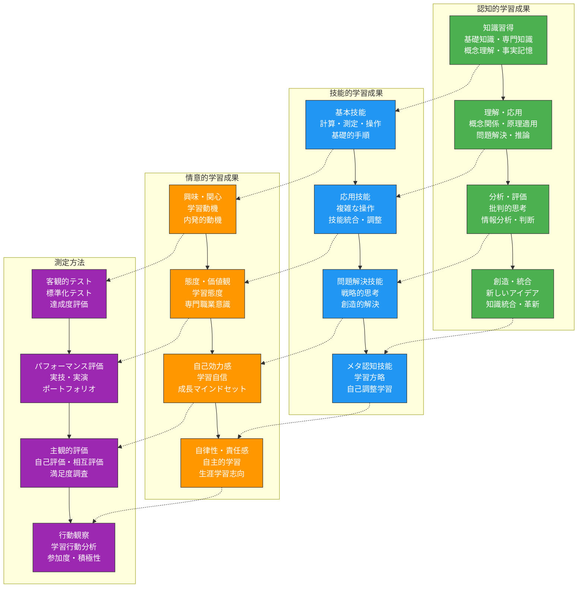
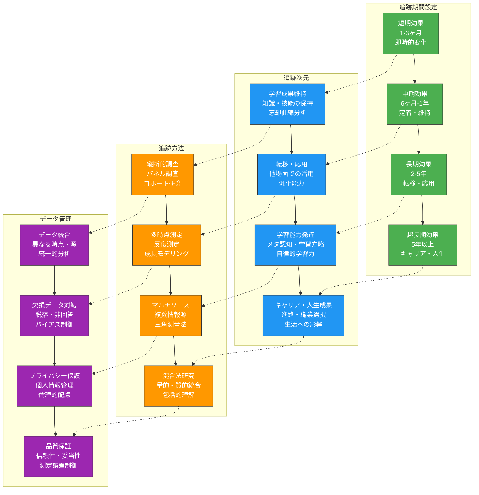
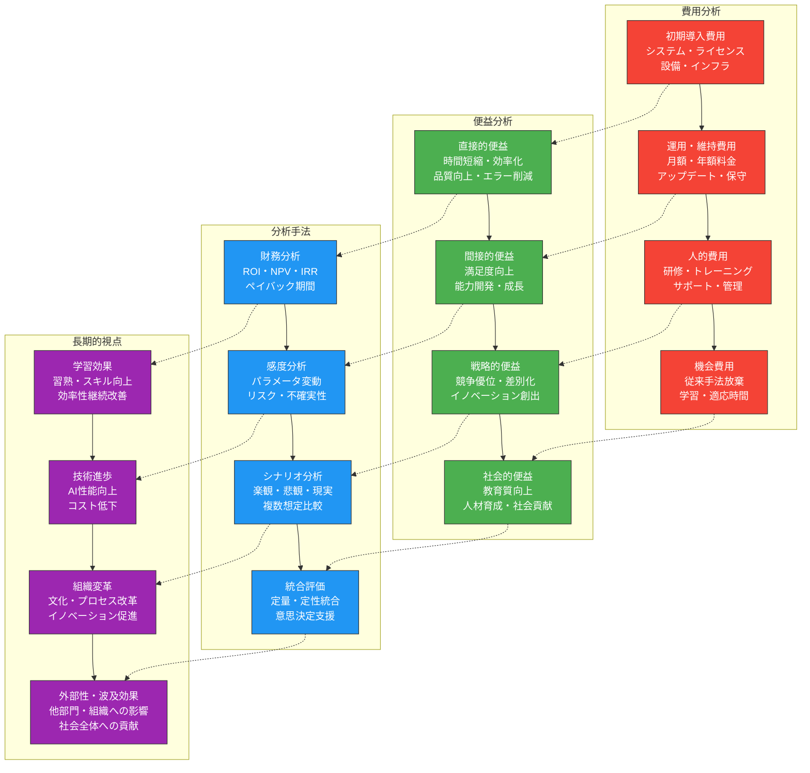
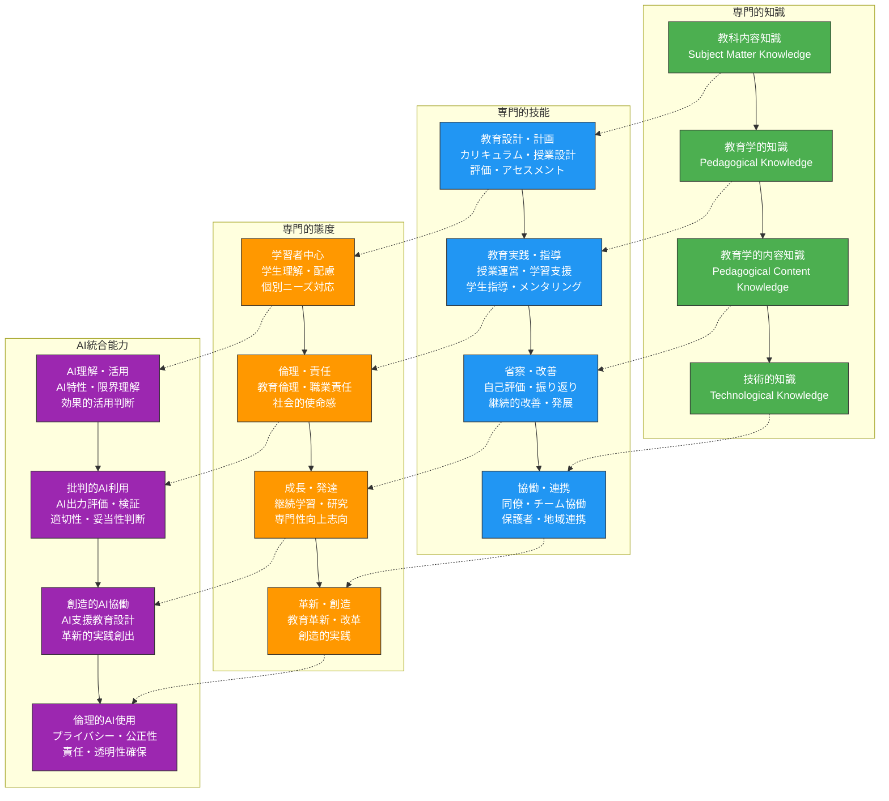

生成AIを教育現場に導入した後、その効果を適切に評価し測定することは、継続的な改善と持続可能な活用のために不可欠です。本章では、認知負債のリスクを監視しながら、教育効果、効率性、質的改善を多角的に評価する方法論を解説します。

# 教育効果の多角的評価

## 学習成果向上の定量的評価手法

**学習成果の定量的評価**は、AI活用の効果を客観的に判断するための基盤となります。単一の指標ではなく、多面的な測定により包括的な効果を把握することが重要です。

### 学習成果評価の体系的フレームワーク



### 学習成果評価設計プロンプト

**包括的学習成果評価システム設計プロンプト**：
```
AI活用教育の学習成果を多角的に評価するシステムを設計してください。

## 評価対象の基本情報
- 科目・分野：[具体的な科目名・分野]
- 対象学年：[学習者のレベル]
- AI活用内容：[具体的な活用方法]
- 評価期間：[短期・中期・長期の設定]
- 比較群：[従来手法との比較方法]

## 評価次元・指標
### 1. 認知的学習成果
#### 知識・理解レベル
- 基礎知識の習得度（正答率・理解度）
- 概念理解の深さ（説明品質・関連づけ）
- 知識の定着度（時間経過後の保持率）
- 転移可能性（他場面での応用能力）

#### 高次思考能力
- 批判的思考力（論理性・妥当性判断）
- 創造的思考力（独創性・柔軟性）
- 問題解決能力（戦略・効率性）
- メタ認知能力（学習調整・反省）

### 2. 技能的学習成果
#### 実践的技能
- 基本技能の習熟度（正確性・速度）
- 複合技能の統合度（協調性・流暢性）
- 応用技能の柔軟性（適応性・創造性）
- 自律的技能使用（自発性・継続性）

#### デジタルリテラシー
- AI活用技能（効果的使用・適切判断）
- 情報処理技能（収集・分析・活用）
- デジタル創作技能（制作・表現・共有）
- 批判的デジタル思考（信頼性評価・倫理判断）

### 3. 情意的学習成果
#### 動機・態度
- 学習動機の変化（内発・外発・無動機）
- 学習態度の改善（積極性・持続性）
- 自己効力感の向上（自信・挑戦意欲）
- 学習満足度（楽しさ・達成感）

#### 自律性・主体性
- 自主的学習行動（計画・実行・評価）
- 目標設定能力（現実性・挑戦性）
- 学習調整能力（方法改善・困難対処）
- 生涯学習志向（継続意欲・成長志向）

## 測定方法・ツール
### 1. 定量的測定
#### 客観的評価
- 標準化テスト・達成度テスト
- プレ・ポストテスト設計
- 学習分析・ラーニングアナリティクス
- 行動データ・ログ分析

#### パフォーマンス評価
- ルーブリック評価・ポートフォリオ
- 実技試験・プロジェクト評価
- ピア評価・相互評価
- 自己評価・振り返り

### 2. 質的測定
#### インタビュー・観察
- 構造化・半構造化インタビュー
- フォーカスグループディスカッション
- 参与観察・行動観察
- 学習プロセス分析

#### 文書分析
- 学習日記・振り返りレポート
- 作品・成果物分析
- ディスカッション・フォーラム分析
- 自由記述回答分析

## 評価実施・分析計画
### 1. 評価スケジュール
- ベースライン測定（導入前）
- 中間評価（導入中・複数回）
- 最終評価（導入後）
- フォローアップ評価（一定期間後）

### 2. データ分析手法
- 記述統計・推測統計
- 効果量・実用的意義の計算
- 多変量解析・因子分析
- 質的データ分析・テーマ抽出

### 3. 結果解釈・活用
- 統計的有意性vs実用的意義
- 個人差・群差の分析
- 成功要因・阻害要因の特定
- 改善提案・次年度計画への反映

実用的で科学的に妥当な評価システムを提案してください。
```

## 学習者満足度・エンゲージメントの測定

**学習者の満足度とエンゲージメント**は、AI活用の成功を示す重要な指標です。これらを適切に測定することで、学習体験の質を評価し改善できます。

### 満足度・エンゲージメント測定の多面的アプローチ

**学習者エンゲージメント評価プロンプト**：
```
AI活用教育における学習者満足度・エンゲージメントを包括的に測定する仕組みを設計してください。

## 測定対象・次元
### 1. 認知的エンゲージメント
#### 学習への集中・注意
- 授業・課題への集中度
- 注意持続時間・深度
- 能動的情報処理・思考
- 学習内容への没入感

#### 学習戦略・方法
- 効果的学習方法の使用
- メタ認知的学習調整
- 困難時の対処・粘り強さ
- 自主的な発展学習

### 2. 行動的エンゲージメント
#### 参加・関与行動
- 授業・活動への参加率
- 質問・発言・貢献度
- 課題提出・完成度
- 自主的学習時間

#### 協調・相互作用
- 同級生との協働・議論
- 教員との相互作用
- 学習コミュニティへの参加
- 知識共有・支援行動

### 3. 情意的エンゲージメント
#### 学習への感情・態度
- 学習の楽しさ・興味
- 挑戦への積極性・意欲
- 達成感・満足感
- 学習に対する誇り・愛着

#### 帰属感・つながり
- クラス・学校への帰属感
- 教員・同級生との関係性
- 学習コミュニティでの居場所
- 学問分野への同一視

## 測定方法・ツール
### 1. 量的測定
#### 質問紙調査
- エンゲージメント尺度
- 満足度調査・評価
- 学習動機・態度尺度
- 自己効力感・自信尺度

#### 行動データ分析
- LMS・学習プラットフォームデータ
- アクセス時間・頻度・パターン
- 課題取組み・完了率
- ディスカッション参加度

### 2. 質的測定
#### インタビュー・FGD
- 学習体験・感想の詳細聴取
- AI活用に対する意見・評価
- 改善提案・要望の収集
- 学習プロセス・困難の理解

#### 観察・エスノグラフィー
- 学習行動・相互作用の観察
- 感情・態度の表出観察
- 自然な学習環境での行動
- 非言語的エンゲージメント指標

## 評価・改善サイクル
### 1. 継続的モニタリング
- 定期的・リアルタイム測定
- 早期警告システム・アラート
- 個別・群レベルでの追跡
- トレンド・変化パターン分析

### 2. データ統合・分析
- 量的・質的データの統合
- 多面的・多層的分析
- 個人差・文脈要因の考慮
- 因果関係・影響要因の探索

### 3. フィードバック・改善
- 学習者・教員へのフィードバック
- 教育方法・AI活用の調整
- 学習環境・支援の改善
- 継続的改善サイクルの構築

実用的で継続可能な測定・改善システムを提案してください。
```

## 長期的な学習効果の追跡方法

**長期的な学習効果の追跡**は、AI活用の真の価値を評価するために重要です。短期的な成果だけでなく、持続的な影響を測定する必要があります。

### 長期効果追跡の設計原則



### 長期効果追跡システム設計プロンプト

**縦断的学習効果追跡プロンプト**：
```
AI活用教育の長期的学習効果を体系的に追跡するシステムを設計してください。

## 追跡計画の基本設計
- 対象集団：[学習者・コホートの詳細]
- 追跡期間：[開始から終了まで]
- 測定時点：[具体的なタイミング]
- 比較群：[統制群・対照群の設定]
- 研究デザイン：[縦断・実験・準実験]

## 長期効果の測定領域
### 1. 学習成果の持続性
#### 知識・技能の保持
- 学習内容の長期記憶・定着
- 技能の維持・自動化
- 忘却曲線・再学習効率
- 知識構造・概念理解の深化

#### 学習転移・応用
- 近転移：類似場面での活用
- 遠転移：異なる文脈での応用
- 創造的応用・革新的活用
- 実社会・職業場面での活用

### 2. 学習能力・態度の発達
#### メタ認知・学習方略
- 学習方法・戦略の洗練
- 自己調整学習能力
- 困難対処・問題解決力
- 批判的思考・創造的思考

#### 動機・態度・価値観
- 内発的学習動機の維持
- 生涯学習志向・成長マインド
- 学問・専門分野への愛着
- AI・技術に対する態度

### 3. キャリア・人生への影響
#### 教育・進路選択
- 進学・専攻選択への影響
- 学習継続・深化の動機
- 研究・創作活動への参加
- 学習コミュニティでの活動

#### 職業・社会参加
- 職業選択・キャリア形成
- 職場での学習・適応
- 社会貢献・市民参加
- 人間関係・ネットワーク形成

## 測定方法・データ収集
### 1. 量的測定
#### 標準化・客観的測定
- 認知能力・学力テスト
- 技能・パフォーマンステスト
- 心理尺度・質問紙調査
- 行動データ・ログ分析

#### 自然発生データ
- 学業成績・進路データ
- 就職・キャリアデータ
- 社会活動・参加データ
- オンライン活動・デジタル足跡

### 2. 質的測定
#### インタビュー・ライフヒストリー
- 深層インタビュー・生活史聴取
- フォーカスグループディスカッション
- エスノグラフィー・参与観察
- ナラティブ・ストーリー収集

#### 文書・アーティファクト分析
- 作品・成果物の変化分析
- 日記・振り返り記録分析
- ソーシャルメディア・発信分析
- 履歴書・ポートフォリオ分析

## 分析・解釈・活用
### 1. データ分析手法
#### 縦断データ分析
- 成長曲線モデリング
- 多レベル・階層分析
- 時系列分析・変化点検出
- 潜在クラス・軌跡分析

#### 因果推論・効果検証
- 傾向スコア・マッチング
- 差の差分析・回帰不連続
- 機器変数・自然実験活用
- ランダム化比較試験

### 2. 結果解釈・活用
#### 効果の評価・判断
- 効果量・実用的意義
- 費用対効果・投資収益率
- 個人差・群差の分析
- 成功要因・阻害要因特定

#### 政策・実践への反映
- エビデンスベース政策形成
- 教育実践・方法の改善
- AI活用ガイドライン作成
- 次世代教育システム設計

実施可能で科学的に妥当な長期追跡システムを提案してください。
```

# 効率性・生産性の評価

## 教員の作業時間短縮効果の測定

**教員の作業時間短縮効果**は、AI活用の直接的なメリットを示す重要な指標です。正確な測定により、AI導入の投資対効果を評価できます。

### 作業時間分析の体系的アプローチ

**教員作業効率性評価プロンプト**：
```
AI活用による教員の作業時間短縮効果を包括的に測定・評価するシステムを設計してください。

## 測定対象・範囲
### 1. 教育活動領域
#### 授業準備・設計
- 授業計画・シラバス作成時間
- 教材作成・準備時間
- 課題・試験問題作成時間
- 資料収集・整理時間

#### 授業実施・運営
- 授業進行・管理時間
- 学生対応・質問回答時間
- 技術的準備・操作時間
- 授業記録・報告時間

#### 評価・フィードバック
- 課題・試験採点時間
- フィードバック作成時間
- 成績処理・管理時間
- 学習相談・指導時間

### 2. 研究活動領域
#### 研究企画・計画
- 研究計画書作成時間
- 文献調査・整理時間
- 実験計画・設計時間
- 申請書・報告書作成時間

#### データ分析・処理
- データ収集・整理時間
- 統計分析・解釈時間
- 図表作成・可視化時間
- 結果検証・考察時間

#### 成果発表・論文
- 論文執筆・推敲時間
- プレゼンテーション作成時間
- 投稿・査読対応時間
- 学会発表準備時間

### 3. 管理・サービス業務
#### 学生指導・支援
- 履修指導・相談時間
- 進路指導・面談時間
- 研究指導・面談時間
- 生活指導・相談時間

#### 委員会・会議
- 会議準備・資料作成時間
- 会議参加・議論時間
- 議事録・報告書作成時間
- フォローアップ・実施時間

## 測定方法・ツール
### 1. 直接測定
#### タイムトラッキング
- 作業時間記録・ログ
- タスク別詳細時間測定
- AI活用前後の比較
- 継続的モニタリング

#### 生産性指標
- 単位時間あたり成果物
- 作業完了速度・効率
- 品質維持での時間短縮
- エラー・修正時間削減

### 2. 間接測定
#### 自己報告・調査
- 時間配分・負担感調査
- 業務効率性・満足度
- ストレス・疲労度評価
- ワークライフバランス

#### 行動・環境データ
- PCアクティビティ・ログ
- アプリケーション使用時間
- メール・通信データ
- 施設利用・在校時間

## 分析・評価の観点
### 1. 効率性分析
#### 時間短縮率
- 絶対的時間短縮（分・時間）
- 相対的短縮率（パーセント）
- タスク別・領域別効果
- 個人差・変動要因

#### 生産性向上
- アウトプット量・質の向上
- 新規活動・発展的業務時間
- 創造的・付加価値活動
- 専門性発揮・成長機会

### 2. 質的影響分析
#### 業務品質・満足度
- 業務の質・精度向上
- 創造性・革新性向上
- 職業満足度・やりがい
- ストレス軽減・負担感

#### 能力開発・成長
- 新スキル・知識習得
- 専門性・専門領域拡大
- キャリア発展・機会拡大
- 研究・教育能力向上

実用的で信頼性の高い測定・評価システムを提案してください。
```

## 教育準備プロセスの最適化評価

**教育準備プロセスの最適化**は、教育の質と効率の両方を向上させる重要な要素です。AIがこのプロセスに与える影響を評価することで、より効果的な活用方法を見出せます。

### 教育準備プロセス評価の枠組み

**教育準備プロセス最適化評価プロンプト**：
```
AI活用による教育準備プロセスの最適化効果を評価するフレームワークを設計してください。

## 評価対象プロセス
### 1. カリキュラム・授業設計
#### 学習目標設定・構造化
- 目標設定の精度・適切性
- 学習内容の体系化・構造化
- 評価基準・方法の整合性
- 個別化・差異化の程度

#### 授業計画・進行設計
- 授業構成・流れの論理性
- 活動・方法の多様性・適切性
- 時間配分・ペース設定
- 柔軟性・適応可能性

### 2. 教材・リソース開発
#### 教材作成・選択
- 教材の質・適切性・魅力
- 学習者ニーズとの適合
- 最新性・正確性・信頼性
- アクセシビリティ・使いやすさ

#### デジタルリソース活用
- マルチメディア・インタラクティブ要素
- 個別化・適応的機能
- 共有・再利用可能性
- 技術的安定性・互換性

### 3. 評価・フィードバック設計
#### 評価方法・ツール開発
- 評価の妥当性・信頼性
- 多様性・包括性
- 効率性・実用性
- 形成的・総括的評価バランス

#### フィードバックシステム
- 適時性・個別性
- 具体性・建設性
- 学習改善への効果
- 自律学習促進効果

## 最適化指標・メトリクス
### 1. 効率性指標
#### 時間・労力削減
- 準備時間の短縮率
- 反復作業の自動化度
- エラー・修正回数削減
- 再利用・応用可能性

#### プロセス改善
- 手順の標準化・体系化
- ワークフロー最適化
- ボトルネック・無駄排除
- 継続的改善サイクル

### 2. 品質指標
#### 教育内容・方法
- 学習目標達成度向上
- 学習者満足度・エンゲージメント
- 教育効果・学習成果
- 個別ニーズ対応度

#### 創造性・革新性
- 新しいアイデア・アプローチ
- 従来手法からの脱却
- 学際的・統合的視点
- 未来志向・先進性

## 評価方法・手順
### 1. プロセス分析
#### プロセスマッピング
- 現状プロセスの詳細分析
- AI導入後の変化追跡
- ボトルネック・改善点特定
- ベストプラクティス抽出

#### 時間・動作研究
- 各工程の所要時間測定
- 作業効率・生産性分析
- 品質・精度の変化
- 学習・適応曲線分析

### 2. 比較・対照研究
#### AI活用前後比較
- 同一教員・科目での比較
- 準備時間・工数変化
- 成果物品質・学習効果
- 満足度・負担感変化

#### 群間比較
- AI活用群vs非活用群
- 異なるAI活用方法間比較
- 教員特性・経験別分析
- 科目・分野別効果差

実践的で包括的な評価フレームワークを提案してください。
```

## 費用対効果の分析手法

**費用対効果分析**は、AI導入の経済的合理性を評価し、持続可能な活用戦略を策定するために重要です。

### 教育AI投資効果分析の構造



### 費用対効果分析設計プロンプト

**教育AI投資収益分析プロンプト**：
```
AI活用教育の費用対効果を包括的に分析するフレームワークを設計してください。

## 分析対象・スコープ
- 対象組織：[大学・学部・学科]
- 分析期間：[短期・中期・長期]
- AI活用範囲：[具体的な活用内容]
- 比較基準：[従来手法・他システム]

## 費用構造分析
### 1. 直接費用
#### 初期投資
- システム導入・ライセンス費用
- ハードウェア・インフラ整備
- カスタマイズ・設定費用
- 初期研修・トレーニング費用

#### 運用費用
- 月額・年額利用料金
- 保守・サポート費用
- アップデート・バージョンアップ
- 継続研修・スキル開発

### 2. 間接費用
#### 人的コスト
- 導入・管理人員の時間コスト
- 学習・適応期間の生産性低下
- 変更管理・組織対応コスト
- 技術サポート・ヘルプデスク

#### 機会費用
- 従来手法・システム放棄コスト
- 代替投資機会の放棄
- リスク・不確実性コスト
- 時間・タイミング逸失コスト

## 便益構造分析
### 1. 定量的便益
#### 直接的効果
- 作業時間短縮による時間コスト削減
- 人件費・労務費削減
- エラー・ミス削減による損失回避
- 生産性・効率性向上効果

#### 品質向上効果
- 教育効果・学習成果向上
- 学生満足度・エンゲージメント向上
- 教員満足度・職務満足向上
- 組織評価・ブランド価値向上

### 2. 定性的便益
#### 戦略的価値
- 競争優位・差別化効果
- イノベーション・創造性促進
- 組織文化・風土改革
- 将来投資・成長基盤構築

#### 社会的価値
- 教育質向上・人材育成貢献
- 知識社会・デジタル社会推進
- 持続可能性・社会責任履行
- ステークホルダー価値創造

## 分析手法・モデル
### 1. 財務分析
#### 投資収益率分析
- ROI（Return on Investment）
- NPV（Net Present Value）
- IRR（Internal Rate of Return）
- ペイバック期間・回収年数

#### 感度・シナリオ分析
- 主要パラメータの感度分析
- 楽観・現実・悲観シナリオ
- モンテカルロシミュレーション
- リスク調整収益率

### 2. 統合評価
#### 多基準意思決定
- AHP（Analytic Hierarchy Process）
- DEA（Data Envelopment Analysis）
- TOPSIS法・重み付け評価
- ステークホルダー価値分析

#### 実オプション分析
- 段階的投資・拡張オプション
- 撤退・中止オプション
- 時期選択・タイミングオプション
- 柔軟性・適応性価値

## 結果解釈・意思決定支援
### 1. 投資判断基準
- 財務的実行可能性
- 戦略的適合性・重要性
- リスク・不確実性許容度
- 実施・運用可能性

### 2. 改善・最適化提案
- コスト削減・効率化方策
- 便益向上・価値最大化
- リスク軽減・対策
- 段階的・継続的改善計画

科学的で実用的な費用対効果分析フレームワークを提案してください。
```

# 質的改善の評価

## 教育の創造性・革新性の評価

**教育の創造性・革新性**は、AI活用がもたらす質的変化を示す重要な指標です。従来の定量的評価では捉えきれない教育の本質的改善を評価する必要があります。

### 創造性・革新性評価の多面的アプローチ

**教育創造性・革新性評価プロンプト**：
```
AI活用による教育の創造性・革新性向上を多面的に評価するシステムを設計してください。

## 評価対象・次元
### 1. 教育内容・カリキュラムの革新
#### 学際性・統合性
- 分野横断的アプローチの導入
- 理論と実践の統合・融合
- 現実問題・社会課題との接続
- グローバル・ローカル視点の統合

#### 最新性・先進性
- 最新研究・技術動向の反映
- 未来志向・先見性
- エビデンスベース・科学性
- イノベーション・創発性

### 2. 教育方法・アプローチの革新
#### 学習者中心・個別化
- 学習者主体・能動的学習
- 個別ニーズ・特性への対応
- 多様性・包摂性の実現
- 自律的・自己調整学習促進

#### 協働性・相互作用性
- 学習者間協働・相互学習
- 教員・学習者パートナーシップ
- 地域・社会・産業界連携
- 国際的・文化間交流

### 3. 教育環境・システムの革新
#### 技術統合・デジタル変革
- 効果的技術活用・統合
- デジタル・アナログ融合
- 新しい学習体験・経験創出
- 未来型学習環境構築

#### 柔軟性・適応性
- 時間・空間・ペースの柔軟化
- 多様な学習形態・経路
- 変化対応・進化可能性
- 持続可能性・発展性

## 評価方法・指標
### 1. 直接評価
#### 専門家評価・ピアレビュー
- 教育専門家による質的評価
- 同僚教員・外部評価者評価
- 学会・学術コミュニティ評価
- 国際比較・ベンチマーキング

#### 学習者・ステークホルダー評価
- 学生による授業・学習体験評価
- 卒業生・雇用者フィードバック
- 保護者・地域社会評価
- 学内外関係者・パートナー評価

### 2. 間接評価・エビデンス
#### 成果物・アウトプット分析
- 教育プログラム・教材の革新性
- 学習者作品・プロジェクト創造性
- 研究・論文・発表の新規性
- 受賞・表彰・メディア注目

#### プロセス・活動分析
- 教育設計・実践プロセス革新
- 学習活動・相互作用創造性
- 問題解決・意思決定革新性
- 組織・文化変革・発展

## 評価基準・ルーブリック
### 1. 創造性評価基準
#### 独創性・新規性
- 従来にない新しいアイデア・アプローチ
- 既存概念・方法の創造的組合せ
- 独自の視点・発想・着眼点
- パラダイム転換・ブレイクスルー

#### 有用性・価値性
- 教育効果・学習成果向上
- 問題解決・課題対応効果
- 実用性・実現可能性
- 社会的価値・意義・インパクト

### 2. 革新性評価基準
#### 変革度・影響度
- 従来慣行からの脱却・変革
- システム・構造・文化変革
- 広範囲・持続的影響
- 他者・組織への波及・普及

#### 先進性・先見性
- 時代・社会ニーズ先取り
- 技術・理論最前線活用
- 未来志向・ビジョン実現
- 国際的・グローバル水準

## 評価プロセス・運用
### 1. 多面的・継続的評価
#### 多様な視点・ステークホルダー
- 内部・外部評価者組合せ
- 専門家・非専門家評価
- 短期・長期視点統合
- 量的・質的データ統合

#### 段階的・発展的評価
- 計画・設計段階評価
- 実施・プロセス評価
- 成果・影響評価
- 改善・発展評価

### 2. フィードバック・改善サイクル
#### 評価結果活用
- 強み・成功要因特定・共有
- 課題・改善点明確化・対策
- ベストプラクティス抽出・普及
- 継続的改善・イノベーション促進

包括的で実用性の高い創造性・革新性評価システムを提案してください。
```

## 学習者の批判的思考力向上の測定

**批判的思考力**は、AI時代においてより重要性を増す能力です。AIを活用しながら、この能力をどのように育成し測定するかが重要な課題となります。

### 批判的思考力測定の包括的フレームワーク

**批判的思考力評価システム設計プロンプト**：
```
AI活用教育における学習者の批判的思考力向上を包括的に測定・評価するシステムを設計してください。

## 批判的思考力の構成要素
### 1. 認知的スキル
#### 分析・解釈能力
- 情報・データの正確な理解・解釈
- 論理構造・論証の分析
- 前提・仮定の特定・検討
- 因果関係・相関関係の区別

#### 推論・判断能力
- 演繹・帰納・仮説的推論
- エビデンス・根拠の評価
- 結論の妥当性・信頼性判断
- 代替説明・反証の検討

#### 評価・総合能力
- 情報源の信頼性・妥当性評価
- 多角的視点・観点の統合
- 価値判断・優先順位づけ
- 意思決定・行動選択

### 2. メタ認知的要素
#### 自己認識・省察
- 自己の思考プロセス認識
- バイアス・先入観の自覚
- 知識・理解の限界認識
- 学習・成長ニーズ特定

#### 思考調整・制御
- 思考戦略の選択・調整
- 注意・集中の管理・制御
- 目標・計画の設定・修正
- エラー・ミスの発見・修正

### 3. 態度・志向性
#### 知的謙遜・開放性
- 異なる意見・視点への開放性
- 自己批判・修正への意欲
- 不確実性・曖昧性への寛容
- 継続的学習・成長志向

#### 知的勇気・独立性
- 権威・多数意見への健全な懐疑
- 困難・複雑問題への挑戦意欲
- 独立的・自律的思考
- 責任・倫理的判断

## 測定方法・ツール
### 1. 標準化テスト・尺度
#### 既存の批判的思考測定ツール
- Watson-Glaser批判的思考力テスト
- California批判的思考スキルテスト
- Cornell批判的思考テスト
- 日本版批判的思考力尺度

#### カスタマイズ・適応版
- 理工系分野特化版
- AI時代対応版
- 文化・言語適応版
- 学習者レベル別版

### 2. パフォーマンス課題・評価
#### 真正性評価・実践課題
- 現実問題・ケース分析
- ディベート・討論・議論
- レポート・論文・エッセイ
- プロジェクト・研究・調査

#### AI活用場面での評価
- AI生成情報の批判的評価
- AI活用判断・意思決定
- AI倫理・社会的影響考察
- AI限界・リスク認識

### 3. 質的評価・観察
#### 思考過程の可視化
- Think-aloud protocol
- 概念マップ・思考マップ
- 学習日記・振り返りジャーナル
- ディスカッション・対話分析

#### 行動・態度観察
- 授業・活動中の思考行動
- 質問・発言・相互作用
- 問題解決・意思決定プロセス
- 学習・探究・発見活動

## 評価基準・ルーブリック
### 1. 発達段階・レベル設定
#### 初級レベル
- 基本的分析・解釈能力
- 明確な論理・根拠の理解
- 単純な判断・評価能力
- 指導下での批判的思考

#### 中級レベル
- 複雑情報の分析・統合
- 多角的視点・観点の考慮
- 自律的な判断・評価
- バイアス・限界の認識

#### 上級レベル
- 高度な推論・論証能力
- 創造的・革新的思考
- メタ認知的思考制御
- 社会的・倫理的判断

### 2. 評価観点・項目
#### 正確性・妥当性
- 情報理解・解釈の正確性
- 推論・判断の論理的妥当性
- 結論・決定の適切性
- エビデンス活用の適切性

#### 深さ・複雑性
- 分析・考察の深さ・詳細性
- 多面的・多層的理解
- 複雑性・不確実性対処
- 統合・総合的判断

実効性が高く発達的な批判的思考力評価システムを提案してください。
```

## 教員の専門性発達の評価

**教員の専門性発達**は、AI活用の長期的効果を示す重要な指標です。AIとの協働により、教員がより高次の専門性を発揮できるようになることが期待されます。

### 教員専門性発達評価の構造



### 教員専門性発達評価プロンプト

**教員専門性発達包括評価プロンプト**：
```
AI活用による教員の専門性発達を包括的に評価するシステムを設計してください。

## 専門性発達の評価領域
### 1. 知識・理解の深化
#### 教科専門知識
- 専門分野の最新知識・動向
- 学問的理解の深さ・広がり
- 研究・探究能力の向上
- 知識統合・応用能力

#### 教育学的知識
- 学習理論・教育理論理解
- 教育方法・技法の習得
- 学習者理解・発達理論
- 評価・アセスメント理論

#### AI・技術知識
- AI・技術の理解・活用能力
- デジタルリテラシー・技術統合
- 批判的技術評価・選択
- 倫理的・責任的技術使用

### 2. 実践的技能の向上
#### 教育設計・計画能力
- 学習目標設定・構造化
- カリキュラム・授業設計
- 教材・活動開発・選択
- 評価・フィードバック設計

#### 教育実践・指導技術
- 授業運営・管理技術
- 学習支援・促進技術
- 個別指導・差異化指導
- クラス・グループマネジメント

#### 省察・改善能力
- 自己評価・省察技術
- 課題発見・問題解決
- 継続的改善・発展
- エビデンス活用・実践研究

### 3. 専門的態度・価値観
#### 学習者中心志向
- 学生理解・共感・配慮
- 多様性・包摂性重視
- 個別ニーズ・特性対応
- 学習者エンパワーメント

#### 専門職倫理・責任
- 教育倫理・職業責任感
- 継続的学習・成長志向
- 社会的使命・貢献意識
- 説明責任・透明性

#### 協働・連携志向
- 同僚・チーム協働
- 保護者・地域連携
- 専門コミュニティ参加
- 知識共有・相互学習

## 評価方法・データ収集
### 1. 多面的評価
#### 自己評価・省察
- 専門性自己評価尺度
- 学習・成長ポートフォリオ
- 省察日記・ジャーナル
- 目標設定・達成度評価

#### 他者評価・観察
- 管理職・同僚評価
- 学生・保護者評価
- 専門家・外部評価者
- 授業観察・実践分析

### 2. 成果物・エビデンス
#### 教育実践・成果
- 授業・カリキュラム設計
- 教材・リソース開発
- 学習者成果・効果
- 実践研究・論文・発表

#### 専門活動・貢献
- 研修・研究会参加
- 学会・専門組織活動
- 指導・メンタリング
- 社会・地域貢献

### 3. 継続的追跡・分析
#### 縦断的発達分析
- 時系列変化・成長軌跡
- 段階的発達・質的変化
- 転機・変革ポイント
- 影響要因・促進条件

#### 比較・ベンチマーク
- 同僚・他校教員比較
- 専門基準・期待水準
- 国際的・最先端実践
- ベストプラクティス

## 発達支援・改善計画
### 1. 個別発達計画
- 強み・成長領域特定
- 具体的目標・計画設定
- 必要な研修・支援
- 進捗監視・調整

### 2. 組織的支援システム
- メンタリング・コーチング
- 専門学習コミュニティ
- 研修・研究機会提供
- 評価・フィードバック文化

発達志向で持続可能な教員専門性評価システムを提案してください。
```

# 継続的改善のメカニズム

## PDCAサイクルによる継続改善

**PDCAサイクル**は、AI活用教育の継続的改善を実現するための基本的なフレームワークです。体系的な改善プロセスにより、持続的な教育効果の向上を図ることができます。

### 教育AI活用PDCAサイクルの設計

**継続的改善PDCAシステム設計プロンプト**：
```
AI活用教育の継続的改善を実現するPDCAサイクルシステムを設計してください。

## PDCAサイクルの各段階
### Plan（計画）段階
#### 現状分析・課題特定
- 現在のAI活用状況・効果分析
- 学習者・教員・組織のニーズ調査
- 課題・問題点・改善機会特定
- ステークホルダー期待・要求整理

#### 目標設定・戦略立案
- SMART目標設定（具体的・測定可能・達成可能・関連性・時限）
- 短期・中期・長期目標の階層化
- 改善戦略・アプローチ選択
- 成功指標・評価基準設定

#### 実施計画・資源配分
- 具体的行動計画・タイムライン
- 必要資源・予算・人員配分
- 責任・役割分担・体制整備
- リスク評価・対策・コンティンジェンシープラン

### Do（実行）段階
#### 計画実施・活動展開
- 計画的・段階的実施
- 活動・介入・改善策実行
- 進捗管理・モニタリング
- 柔軟な調整・適応

#### データ収集・記録
- 実施プロセス・活動記録
- 定量・定性データ収集
- 継続的・体系的記録
- 標準化・構造化データ管理

### Check（評価）段階
#### 成果・効果測定
- 目標達成度・成果評価
- 予期した・予期しない効果分析
- 定量・定性効果統合評価
- 短期・中長期効果追跡

#### 原因・要因分析
- 成功・失敗要因特定
- プロセス・構造・文化要因分析
- 個人・組織・環境要因
- 因果関係・相互作用分析

### Act（改善）段階
#### 学習・知識化
- 経験・ノウハウ・教訓抽出
- ベストプラクティス・失敗事例整理
- 知識・スキル・能力向上
- 組織学習・文化醸成

#### 標準化・制度化
- 効果的実践・方法の標準化
- プロセス・手順・ガイドライン整備
- 制度・仕組み・システム改善
- 次サイクル計画・戦略策定

## 実施・運用体制
### 1. 組織・体制整備
#### 推進組織・チーム
- PDCA推進委員会・チーム
- 各段階・領域責任者
- 外部専門家・アドバイザー
- ステークホルダー代表

#### 役割・責任・権限
- 明確な役割分担・責任範囲
- 意思決定・承認権限
- 情報共有・コミュニケーション
- 説明責任・透明性確保

### 2. プロセス・手順
#### 標準化・文書化
- PDCA実施手順・ガイドライン
- 評価・測定方法・ツール
- 報告・記録・文書フォーマット
- 品質管理・保証手順

#### システム・ツール
- データ収集・管理システム
- 分析・可視化ツール
- コミュニケーション・共有プラットフォーム
- 進捗管理・追跡システム

効果的で持続可能なPDCA継続改善システムを提案してください。
```

## 同僚との相互評価・学習

**同僚間の相互評価・学習**は、教員の専門性向上と組織全体の改善を促進する重要なメカニズムです。

### 相互評価・学習システム設計

**教員相互学習・評価システムプロンプト**：
```
AI活用教育における教員間の相互評価・学習システムを設計してください。

## 相互評価・学習の目的・効果
### 1. 専門性向上・能力開発
- 多様な視点・経験からの学習
- ベストプラクティス・ノウハウ共有
- 課題・困難の共同解決
- 継続的成長・発達促進

### 2. 組織・文化改善
- 協働・連携文化醸成
- 開放性・信頼関係構築
- 質的向上・革新促進
- 組織学習・知識創造

## システム構成要素
### 1. 相互授業観察・評価
#### 観察・記録
- 構造化観察・記録シート
- ビデオ録画・分析
- リアルタイム・事後観察
- 焦点・観点設定

#### フィードバック・討議
- 建設的・発展的フィードバック
- 双方向対話・討議
- 改善提案・アイデア交換
- 省察・振り返り促進

### 2. 教材・実践共有
#### 共有・公開プラットフォーム
- 教材・リソース共有システム
- 実践事例・ケーススタディ
- 成功・失敗体験談
- 評価・コメント・レビュー

#### 協働開発・改善
- 共同教材・カリキュラム開発
- 実践・実験・試行
- 集合知・創発的改善
- イノベーション・創造促進

効果的で持続可能な相互学習システムを提案してください。
```

## 学習コミュニティでの知識共有

**学習コミュニティでの知識共有**は、個人の学習を組織的な学習に発展させる重要なメカニズムです。

### 知識共有コミュニティ設計プロンプト

**AI活用教育学習コミュニティ設計プロンプト**：
```
AI活用教育に関する知識共有・学習コミュニティを設計してください。

## コミュニティの目的・ビジョン
### 1. 知識創造・共有
- 集合知・知識ベース構築
- 実践知・暗黙知の形式知化
- イノベーション・創発促進
- 継続的学習・成長文化

### 2. ネットワーク・つながり
- 専門家・実践者ネットワーク
- 相互支援・協力関係
- 多様性・包摂性促進
- グローバル・ローカル連携

## コミュニティ活動・機能
### 1. 知識共有活動
#### 情報・経験共有
- 実践事例・成功事例発表
- 課題・困難・解決策共有
- 最新動向・研究成果紹介
- Q&A・相談・アドバイス

#### 協働学習・研究
- 共同研究・プロジェクト
- 勉強会・ワークショップ
- オンライン・オフライン交流
- 国際・学際的連携

### 2. 支援・促進機能
#### プラットフォーム・ツール
- オンライン・コミュニティプラットフォーム
- 知識管理・検索システム
- コミュニケーション・ツール
- イベント・活動管理

#### 運営・ガバナンス
- コミュニティリーダー・モデレーター
- 参加・貢献ルール・規範
- 品質管理・評価システム
- 持続可能性・発展戦略

包括的で活発な学習コミュニティを提案してください。
```

この第10章では、AI活用教育の多角的評価と継続的改善の仕組みを包括的に解説しました。教育効果、効率性、質的改善の評価により、エビデンスに基づいた持続可能なAI活用を実現し、認知負債を避けながら真の教育改善を達成する方法を提示しています。次章では、これらの活用における重要なリスク管理と倫理的配慮について詳しく説明します。