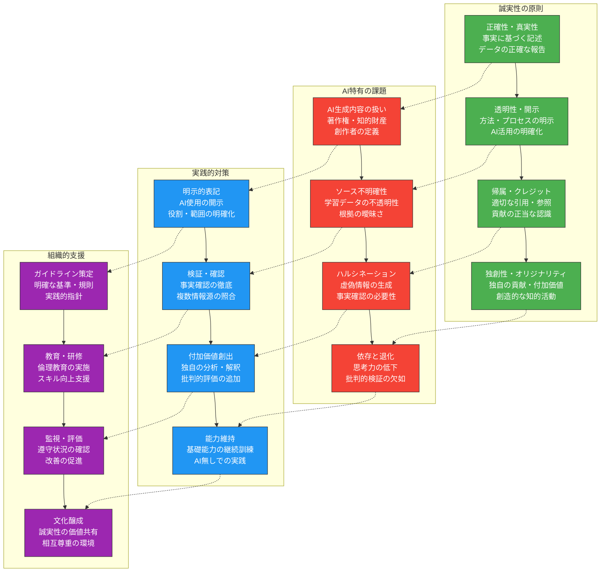
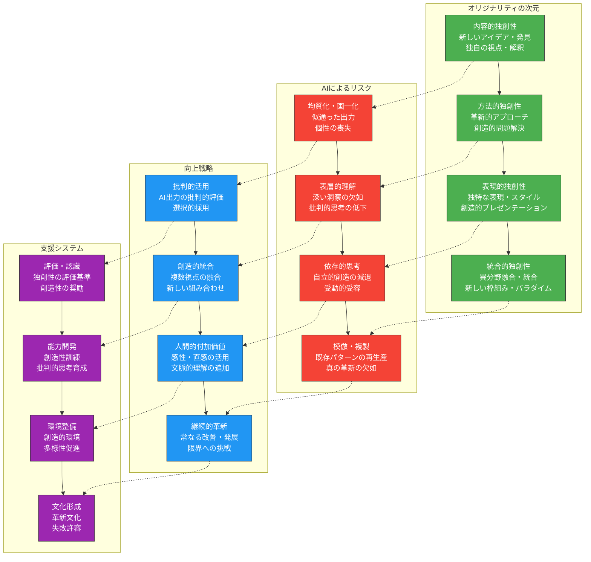
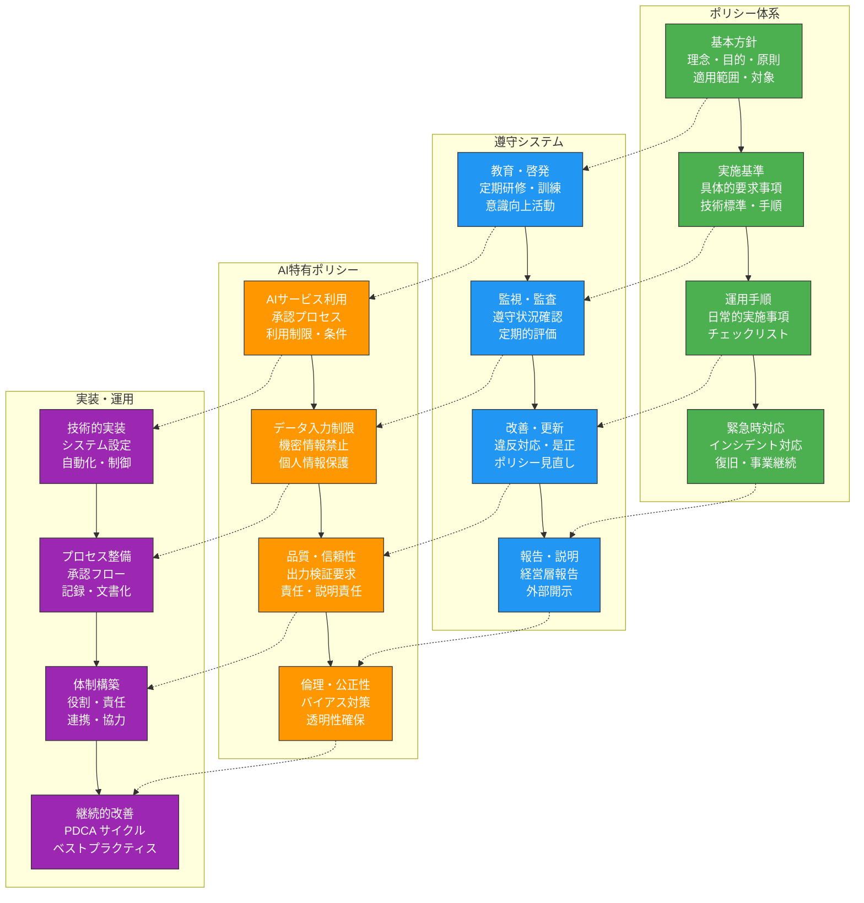
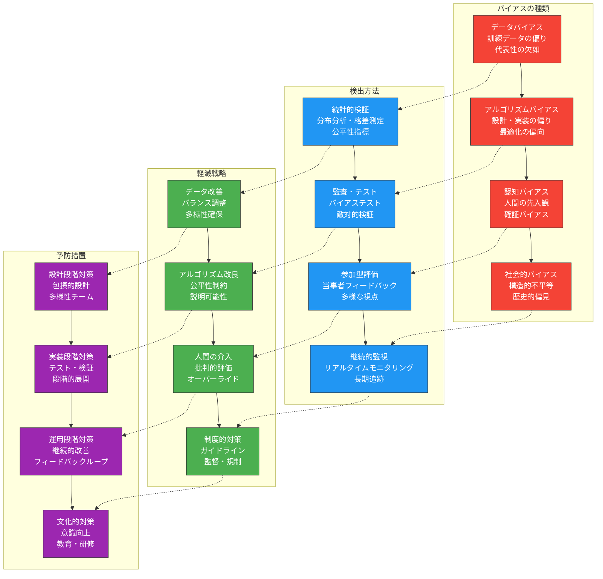

生成AIを教育現場で活用する際、その利便性と同時に生じるリスクを適切に管理し、倫理的な配慮を行うことが不可欠です。本章では、学術的誠実性の維持、プライバシー保護、公平性の確保、そして長期的な社会的責任について、実践的な指針と対策を解説します。

# 学術的誠実性の維持

## 適切な引用・出典表示の実践

**学術的誠実性**は、教育・研究活動の根幹をなす価値です。AI活用においても、この原則を堅持し、さらに新たな文脈での誠実性を確立する必要があります。

### 学術的誠実性確保の体系的フレームワーク



### 学術的誠実性確保のための実践プロンプト

**AI活用における引用・出典管理プロンプト**：
```
教育・研究活動でAIを活用する際の適切な引用・出典表示の実践ガイドラインを策定してください。

## 対象・文脈
- 活動領域：[教育・研究・学習]
- AI活用内容：[文章生成・要約・分析・翻訳等]
- 成果物種別：[論文・レポート・教材・プレゼンテーション]
- 対象者：[教員・研究者・学生]

## ガイドライン構成要素
### 1. AI活用の明示・開示
#### 使用の透明性確保
- AI使用の明確な表記方法
- 使用範囲・程度の具体的説明
- 使用目的・役割の明示
- バージョン・モデル情報の記載

#### 表記例・テンプレート
- 脚注・注釈での表記方法
- 謝辞・クレジットでの記載
- 方法論セクションでの説明
- 付録・補足資料での詳細開示

### 2. 内容の検証・確認
#### 事実確認プロセス
- AI生成内容の必須検証項目
- 信頼できる情報源との照合方法
- 専門家レビュー・査読の活用
- エラー・誤情報の修正記録

#### 根拠・出典の追跡
- AI提示情報の元ソース特定
- 一次資料・原典の確認
- 引用の連鎖・伝言ゲーム回避
- 出典不明情報の扱い方

### 3. 独自性・付加価値の確保
#### 人間の知的貢献
- AI出力への批判的評価
- 独自の分析・解釈の追加
- 創造的な統合・発展
- 新たな知見・洞察の創出

#### オリジナリティの証明
- 独自貢献部分の明確化
- AI支援vs人間主導の区別
- 創造的プロセスの記録
- 知的労働の価値証明

### 4. 倫理的配慮事項
#### 剽窃・盗用の防止
- 意図的/非意図的剽窃の回避
- 類似性チェック・検証
- 自己剽窃の防止策
- グレーゾーンへの対処

#### 共同作業での責任
- AI使用時の責任所在
- 共著者間での合意形成
- 貢献度の公正な評価
- 説明責任の明確化

## 実施・運用方法
### 1. 教育・啓発活動
#### 研修・ワークショップ
- 倫理的AI活用の理解促進
- 実践的スキルの習得
- ケーススタディ・演習
- 最新動向・事例の共有

#### 継続的学習支援
- オンライン学習リソース
- FAQ・ヘルプデスク
- ピアサポート・メンタリング
- コミュニティ・フォーラム

### 2. 制度・システム整備
#### 規程・ポリシー
- 明確な規則・基準の制定
- 違反時の対応・処分
- 異議申し立て・救済手続き
- 定期的な見直し・更新

#### 技術的支援ツール
- 引用管理ソフトウェア
- AI検出・分析ツール
- 類似性チェックシステム
- 文書管理・追跡システム

実用的で倫理的なガイドラインを提案してください。
```

## 著作権・知的財産権への配慮

**著作権と知的財産権**の保護は、AI時代においてより複雑な課題となっています。AIが生成したコンテンツの権利関係を適切に理解し、管理することが重要です。

### 著作権・知的財産権管理の実践

**AI時代の知的財産権管理プロンプト**：
```
教育現場でのAI活用における著作権・知的財産権の適切な管理システムを設計してください。

## 権利関係の整理
### 1. AI生成コンテンツの権利
#### 著作権の帰属
- AI生成物の著作権者の特定
- 利用者・開発者・データ提供者の権利関係
- 派生的著作物の権利処理
- 国際的な法的枠組みの違い

#### 利用許諾・ライセンス
- AI サービスの利用規約理解
- 教育利用での特例・例外
- 商用利用vs非商用利用
- 二次利用・改変の許諾範囲

### 2. 既存著作物の保護
#### 学習データの著作権
- AIの学習データに含まれる著作物
- フェアユース・引用の範囲
- 著作権侵害リスクの評価
- 権利者への配慮・対応

#### 生成物での侵害回避
- 既存作品との類似性チェック
- 意図しない複製・模倣の防止
- トレードマーク・特許の確認
- クリエイティブ・コモンズの活用

### 3. 教育現場での実践
#### 教材作成での配慮
- オリジナル教材vs AI支援教材
- 引用・参照の適切な処理
- 学生作品の権利保護
- オープン教育リソース(OER)の活用

#### 研究活動での管理
- 研究データ・成果の権利
- 共同研究での権利配分
- 特許・実用新案への対応
- 産学連携での知財管理

## 管理システムの構築
### 1. 組織的対応体制
#### 専門組織・担当者
- 知的財産管理部門の設置
- 専門家・アドバイザーの配置
- 教職員への相談窓口
- 外部専門機関との連携

#### 規程・ガイドライン
- 知的財産ポリシーの策定
- AI活用ガイドラインの整備
- 契約・同意書のテンプレート
- チェックリスト・フローチャート

### 2. 実務的対応策
#### 事前確認・予防
- 権利関係の事前調査
- リスクアセスメントの実施
- 適法性の確認プロセス
- 代替案・回避策の準備

#### 記録・証跡管理
- AI使用履歴の記録
- 生成プロセスの文書化
- 権利処理の証跡保存
- 監査・検証への対応

包括的で実用的な知的財産権管理システムを提案してください。
```

## オリジナリティの確保と向上

**オリジナリティ**は、学術・教育活動の本質的価値です。AI活用においても、人間の創造性と独自性を維持・向上させることが重要です。

### オリジナリティ確保の戦略的アプローチ



### オリジナリティ向上実践プロンプト

**教育・研究における独創性確保プロンプト**：
```
AI活用時代における教育・研究活動のオリジナリティを確保・向上させる実践的方策を提案してください。

## 現状分析・課題
### 1. オリジナリティへの脅威
#### AI依存による問題
- 思考の外部化・アウトソーシング
- 批判的検証の省略・軽視
- 創造的プロセスの短絡化
- 深い理解・洞察の欠如

#### 均質化・標準化圧力
- AI出力の類似性・画一性
- 最適化による多様性喪失
- 個性・独自性の埋没
- 革新的逸脱の抑制

### 2. 人間固有の価値
#### 認知的独自性
- 直感・ひらめき・洞察
- 文脈的・状況的理解
- 感情・価値観の統合
- 暗黙知・経験知の活用

#### 創造的能力
- 問題発見・課題設定
- パラダイムシフト・革新
- 芸術的・美的感覚
- 倫理的・哲学的思考

## オリジナリティ確保策
### 1. AI活用の戦略的アプローチ
#### 補完的活用
- AIを道具として位置づけ
- 人間主導の創造プロセス
- 批判的フィルタリング
- 選択的・部分的採用

#### 創造的対話
- AIとの建設的対話・議論
- 反論・批判・発展
- 新しい問いの生成
- 予想外の組み合わせ探索

### 2. 人間能力の維持・向上
#### 基礎能力の継続訓練
- AI無しでの思考・創作練習
- 手書き・手作業の維持
- 記憶力・計算力の保持
- 言語能力・表現力の向上

#### 高次能力の開発
- 批判的思考力の強化
- 創造性・想像力の育成
- 統合的・体系的思考
- メタ認知能力の向上

### 3. 評価・奨励システム
#### 独創性評価基準
- プロセスの独自性評価
- 深い理解・洞察の重視
- リスクテイキングの奨励
- 失敗からの学習評価

#### インセンティブ設計
- 創造的挑戦への報酬
- 独自研究・探究の支援
- 多様性・個性の称賛
- 長期的視点での評価

## 実践的実施方法
### 1. 個人レベルの実践
#### 日常的習慣
- 定期的な「AI断食」期間
- 創造的活動・趣味の維持
- 読書・思索・対話の重視
- 手書きノート・スケッチ

#### 能力開発活動
- 創造性ワークショップ参加
- 異分野学習・探索
- 芸術・文化活動への参加
- 瞑想・内省の実践

### 2. 組織レベルの施策
#### 制度・環境整備
- 創造的時間・空間の確保
- 実験・試行の奨励
- 失敗許容文化の醸成
- 多様性・異質性の促進

#### 支援・育成プログラム
- 創造性研修・訓練
- メンタリング・コーチング
- 学際的プロジェクト推進
- イノベーション・コンテスト

実効性の高いオリジナリティ確保・向上策を提案してください。
```

# プライバシー・セキュリティ管理

## 学生情報の適切な取り扱い

**学生の個人情報保護**は、教育機関の基本的責務です。AI活用により、より慎重で体系的な情報管理が求められます。

### 学生情報保護の包括的フレームワーク

**学生プライバシー保護システム設計プロンプト**：
```
AI活用教育における学生情報の適切な保護・管理システムを設計してください。

## 保護対象情報の分類
### 1. 個人識別情報
#### 基本的個人情報
- 氏名・生年月日・住所
- 学籍番号・学生証情報
- 連絡先・メールアドレス
- 顔写真・生体情報

#### 学業関連情報
- 成績・評価・単位情報
- 出席・学習履歴
- 課題・レポート・作品
- 研究データ・成果

### 2. センシティブ情報
#### 健康・医療情報
- 身体的・精神的健康状態
- 障害・特別支援ニーズ
- 医療記録・診断情報
- カウンセリング記録

#### 社会的・経済的情報
- 家族構成・家庭環境
- 経済状況・奨学金情報
- 宗教・信条・政治的見解
- 国籍・民族・文化背景

## リスク評価・管理
### 1. AI特有のリスク
#### データ漏洩・不正利用
- AI学習データへの混入
- クラウドサービスでの保存
- 第三者AIサービスへの入力
- 不適切な共有・公開

#### プロファイリング・差別
- 自動的な分類・評価
- バイアスに基づく判断
- 不当な差別・排除
- プライバシー侵害

### 2. 対策・保護措置
#### 技術的対策
- データの暗号化・匿名化
- アクセス制御・認証強化
- ログ記録・監査証跡
- セキュアな通信・保存

#### 運用的対策
- 最小限利用の原則
- 目的外利用の禁止
- 保存期間の限定
- 定期的な見直し・削除

## 実施体制・手順
### 1. ガバナンス体制
#### 責任体制
- データ保護責任者(DPO)
- プライバシー委員会
- 各部門責任者
- 監査・監督機能

#### 規程・ポリシー
- プライバシーポリシー
- データ管理規程
- インシデント対応計画
- 教職員行動規範

### 2. 実務的運用
#### 同意取得・透明性
- 明確な説明・情報提供
- 適切な同意取得手続き
- オプトアウト権の保障
- 問い合わせ・苦情対応

#### 教育・訓練
- 教職員研修プログラム
- 学生への啓発活動
- 定期的な注意喚起
- ベストプラクティス共有

包括的で実効性の高い学生情報保護システムを提案してください。
```

## 研究データの保護と管理

**研究データの保護**は、研究の信頼性と持続可能性を確保する上で重要です。AI活用により、データ管理の複雑性が増しています。

### 研究データ管理の戦略的アプローチ

**研究データ保護管理プロンプト**：
```
AI活用研究における研究データの包括的保護・管理戦略を策定してください。

## データライフサイクル管理
### 1. データ収集・生成段階
#### 適法性・倫理性確保
- インフォームドコンセント取得
- 倫理審査委員会承認
- 法的要件の遵守
- 文化的配慮・尊重

#### 品質・完全性確保
- データ収集プロトコル
- 品質管理・検証手順
- メタデータの記録
- バージョン管理

### 2. データ処理・分析段階
#### AI処理での注意点
- 機密データのマスキング
- ローカル処理の優先
- クラウドサービス利用制限
- 処理履歴の記録

#### 分析の再現性確保
- 分析手順の文書化
- コード・スクリプトの保存
- 環境・設定の記録
- 結果の検証可能性

### 3. データ保存・共有段階
#### 長期保存戦略
- 適切な保存形式選択
- 定期的なバックアップ
- 災害復旧計画
- アクセス性の維持

#### 適切な共有・公開
- オープンサイエンス対応
- 機密性レベル別管理
- 利用条件の明確化
- 引用・謝辞の要求

## セキュリティ対策
### 1. 技術的セキュリティ
#### 暗号化・保護
- 保存時暗号化
- 転送時暗号化
- 暗号鍵管理
- 定期的な更新

#### アクセス制御
- 役割ベースアクセス制御
- 多要素認証
- 最小権限の原則
- 定期的な権限見直し

### 2. 物理的・環境的セキュリティ
#### 施設・設備管理
- サーバールームセキュリティ
- 物理的アクセス制限
- 環境モニタリング
- 災害対策

#### デバイス管理
- 端末セキュリティ
- リムーバブルメディア管理
- 廃棄・処分手順
- 盗難・紛失対策

実用的で堅固な研究データ保護管理戦略を提案してください。
```

## 機関のセキュリティポリシー遵守

**組織のセキュリティポリシー**は、AI活用においても厳格に遵守される必要があります。新技術導入に伴い、ポリシーの更新と徹底が求められます。

### セキュリティポリシー遵守の実践



### セキュリティポリシー遵守実践プロンプト

**AI時代のセキュリティポリシー遵守プロンプト**：
```
教育機関におけるAI活用時のセキュリティポリシー遵守を確実にする実践的システムを設計してください。

## ポリシー体系の整備
### 1. AI対応ポリシーの策定
#### 既存ポリシーの拡張
- 情報セキュリティポリシーへのAI条項追加
- データガバナンスポリシーの更新
- 利用規程・ガイドラインの改訂
- リスク管理フレームワークの拡充

#### 新規ポリシーの制定
- AI利用ポリシー・ガイドライン
- AIセキュリティ基準
- AI倫理規程
- AI インシデント対応計画

### 2. 実施基準・手順の具体化
#### 技術的基準
- 承認済みAIサービスリスト
- セキュリティ設定要件
- データ分類・取扱基準
- 暗号化・認証要件

#### 運用手順
- AI利用申請・承認プロセス
- リスクアセスメント手順
- 監査・レビュー手順
- 報告・エスカレーション手順

## 遵守確保の仕組み
### 1. 予防的統制
#### 事前承認・審査
- AI導入前のセキュリティ審査
- リスク評価・影響分析
- 代替案の検討
- 条件付き承認・制限

#### アクセス制御・制限
- AIサービスへのアクセス管理
- 利用者権限の設定
- データ入力制限・フィルタリング
- 利用時間・場所の制限

### 2. 発見的統制
#### モニタリング・監視
- AI利用ログの記録・分析
- 異常検知・アラート
- 定期的な利用状況レビュー
- コンプライアンス監査

#### 報告・通報制度
- インシデント報告体制
- 内部通報制度
- ヒヤリハット収集
- 改善提案制度

### 3. 是正的統制
#### 違反対応・処分
- 違反レベル別対応基準
- 教育的措置・指導
- 懲戒処分・制裁
- 再発防止策の実施

#### 改善・強化
- 根本原因分析
- システム・プロセス改善
- ポリシー・基準の見直し
- 教育・訓練の強化

## 組織文化・意識醸成
### 1. 教育・啓発プログラム
#### 階層別研修
- 経営層向けブリーフィング
- 管理職向け責任者研修
- 一般教職員向け利用者研修
- 新入職員オリエンテーション

#### 継続的啓発活動
- 定期的なリマインダー
- セキュリティ月間・キャンペーン
- ニュースレター・掲示物
- e-ラーニング・クイズ

### 2. インセンティブ・動機づけ
#### 正のインセンティブ
- 優良事例の表彰・共有
- 改善提案への報奨
- スキル認定・資格支援
- キャリア開発機会

#### リスク認識・共有
- インシデント事例の共有
- 影響・損害の可視化
- 個人責任の明確化
- 社会的責任の認識

実効性の高いセキュリティポリシー遵守システムを提案してください。
```

# 公平性・包摂性の確保

## AI活用の機会格差への対応

**デジタル格差とAI格差**は、教育の公平性を脅かす重要な課題です。すべての学習者が等しくAIの恩恵を受けられる環境を整備する必要があります。

### AI活用機会格差対策の包括的アプローチ

**教育AI格差解消プロンプト**：
```
教育現場におけるAI活用の機会格差を解消する包括的対策を設計してください。

## 格差の現状分析
### 1. アクセス格差
#### 技術的アクセス
- デバイス・機器の所有状況
- インターネット接続環境
- ソフトウェア・ライセンス
- 技術サポートの利用可能性

#### 経済的障壁
- AI サービス利用料金
- 必要機器の購入費用
- 通信費・データ料金
- 追加学習・研修費用

### 2. 能力・スキル格差
#### デジタルリテラシー
- 基本的ICTスキル
- AI理解・活用能力
- 批判的評価能力
- トラブルシューティング能力

#### 学習準備性
- 自己調整学習能力
- 情報処理・統合能力
- 言語能力・読解力
- メタ認知能力

## 格差解消策
### 1. アクセス保障
#### インフラ整備
- 学内Wi-Fi・ネットワーク拡充
- 共用端末・ラボの設置
- 貸出機器プログラム
- リモートアクセス環境

#### 経済的支援
- AIツール無償提供・割引
- 奨学金・助成制度
- 機器購入支援
- 通信費補助

### 2. 能力開発支援
#### 段階的スキル育成
- 基礎デジタルスキル研修
- AI活用入門プログラム
- 個別化学習支援
- ピアサポート・チュータリング

#### 多様な学習形態
- 対面・オンライン併用
- 自己ペース学習オプション
- 多言語対応・翻訳支援
- アクセシビリティ配慮

### 3. 包摂的設計
#### ユニバーサルデザイン
- 直感的インターフェース
- 多様な入出力方法
- カスタマイズ可能性
- エラー許容・回復支援

#### 文化的配慮
- 多文化対応コンテンツ
- 地域特性への適応
- 言語的多様性の尊重
- 価値観・信念への配慮

## 実施戦略
### 1. 組織的取り組み
#### 推進体制
- 格差解消タスクフォース
- 多様性・包摂委員会
- 学生支援センター連携
- 地域・企業パートナーシップ

#### モニタリング・評価
- 格差指標の定期測定
- 利用状況データ分析
- 学習成果の公平性評価
- 改善効果の検証

### 2. 持続可能性確保
#### 財源確保
- 予算の優先配分
- 外部資金・助成金獲得
- 企業スポンサーシップ
- クラウドファンディング

#### 長期的視点
- 段階的整備計画
- 技術更新への対応
- 人材育成・確保
- 制度的保障

実効性の高い格差解消対策を提案してください。
```

## 多様な学習者への公平な配慮

**学習者の多様性**を尊重し、個々のニーズに応じた公平な支援を提供することは、包摂的な教育の実現に不可欠です。

### 多様性配慮の実践的フレームワーク

**多様な学習者支援システムプロンプト**：
```
AI活用教育において多様な学習者への公平な配慮を実現するシステムを設計してください。

## 多様性の次元
### 1. 学習特性の多様性
#### 認知的多様性
- 学習スタイル（視覚・聴覚・体験型）
- 処理速度・ペース
- 注意・集中特性
- 記憶・理解パターン

#### 発達的多様性
- 学習障害・困難
- ADHD・ASD等の特性
- ギフテッド・才能
- 発達段階の個人差

### 2. 背景・文脈の多様性
#### 文化的・言語的多様性
- 母語・使用言語
- 文化的背景・価値観
- 学習文化・教育経験
- コミュニケーションスタイル

#### 社会経済的多様性
- 経済状況・家庭環境
- 地理的条件・アクセス
- 社会資本・ネットワーク
- 時間的制約・責任

## 配慮・支援策
### 1. 個別化・適応的支援
#### AIによる個別最適化
- 学習ペース・難易度調整
- 提示方法のカスタマイズ
- フィードバックの個別化
- 学習経路の多様化

#### 支援技術の活用
- 読み上げ・音声認識
- 自動翻訳・多言語対応
- 視覚的支援・図解
- 代替入力・出力方法

### 2. 合理的配慮の提供
#### 評価・試験での配慮
- 時間延長・分割実施
- 代替評価方法
- 環境調整・個別対応
- 支援機器・ソフトウェア使用

#### 学習環境の調整
- 物理的環境の最適化
- 感覚刺激の調整
- 社会的環境の配慮
- 技術的バリアの除去

### 3. 強みベースアプローチ
#### 才能・強みの発見
- 多面的能力評価
- 興味・関心の探索
- 創造性・独創性の認識
- 潜在能力の開発

#### 強みを活かす学習
- 得意分野での挑戦
- 興味に基づくプロジェクト
- ピアティーチング機会
- リーダーシップ育成

実効性の高い多様性配慮システムを提案してください。
```

## バイアス・偏見の防止策

**AIのバイアス**は、教育の公平性を損なう深刻なリスクです。バイアスの検出、軽減、防止のための体系的な対策が必要です。

### バイアス対策の多層的アプローチ



### バイアス防止実践プロンプト

**教育AIバイアス対策プロンプト**：
```
教育現場でのAI活用におけるバイアス・偏見を防止する包括的対策を設計してください。

## バイアスリスク評価
### 1. 潜在的バイアス源
#### AIシステム由来
- 訓練データの偏り・不均衡
- アルゴリズムの設計思想
- 評価指標の偏向
- フィードバックループ

#### 人間由来
- 教員の無意識バイアス
- 選択・確認バイアス
- ステレオタイプ・偏見
- 文化的前提・仮定

### 2. 影響・リスク分析
#### 学習者への影響
- 不公平な評価・判定
- 機会の不平等
- 自己効力感への影響
- ステレオタイプの強化

#### 教育システムへの影響
- 格差の拡大・固定化
- 多様性の抑制
- 創造性・革新の阻害
- 信頼性・正当性の毀損

## バイアス対策
### 1. 予防的措置
#### 設計・開発段階
- 多様性チームでの開発
- 包摂的要件定義
- バイアス影響評価
- 代替案の検討

#### データ・アルゴリズム
- データセットの多様化
- サンプリング戦略改善
- 公平性制約の組み込み
- 説明可能AIの採用

### 2. 検出・監視
#### 定期的監査
- バイアステストの実施
- 結果の統計的分析
- 格差指標のモニタリング
- 第三者評価・認証

#### 継続的フィードバック
- 学習者からの報告収集
- 教員の観察・気づき
- コミュニティとの対話
- 専門家レビュー

### 3. 是正・改善
#### 即時対応
- バイアス検出時の停止
- 影響を受けた者への対応
- 代替手段の提供
- 透明な説明・謝罪

#### システム改善
- 根本原因の分析
- アルゴリズム・データ修正
- プロセス・手順の見直し
- 再発防止策の実装

## 組織的対応
### 1. ガバナンス体制
#### 責任・監督体制
- AI倫理委員会設置
- 多様性・公平性責任者
- 定期的レビュー・報告
- 外部監査・評価

#### 方針・基準
- バイアス防止ポリシー
- 公平性基準・指標
- 対応手順・プロトコル
- 説明責任の明確化

### 2. 能力構築
#### 教育・研修
- バイアス認識研修
- 批判的AI利用教育
- ケーススタディ・演習
- 最新知見の共有

#### 文化・意識改革
- 多様性の価値認識
- 批判的思考の奨励
- オープンな対話促進
- 継続的学習文化

実効性の高いバイアス防止対策を提案してください。
```

# 長期的な社会的責任

## 次世代教育者の育成責任

**次世代教育者の育成**は、AI時代における教育の持続可能性を確保する上で重要な社会的責任です。

### 次世代教育者育成の戦略的プログラム

**AI時代の教育者育成プロンプト**：
```
AI時代に対応できる次世代教育者を育成する包括的プログラムを設計してください。

## 求められる資質・能力
### 1. 基本的教育能力
#### 教科専門性
- 深い学問的知識・理解
- 最新動向への精通
- 学際的視点・統合力
- 研究・探究能力

#### 教育学的能力
- 学習理論・教育原理
- カリキュラム設計力
- 評価・フィードバック技術
- 学習者理解・支援

### 2. AI時代特有の能力
#### AI活用能力
- AI技術の理解・活用
- 批判的AI評価
- 創造的AI協働
- 倫理的AI使用

#### 21世紀型スキル指導
- 批判的思考力育成
- 創造性・革新性促進
- 協働・コミュニケーション
- デジタルシティズンシップ

### 3. 人間的資質
#### 倫理的資質
- 教育倫理・職業倫理
- 社会的責任感
- 公正性・包摂性
- 持続可能性志向

#### 成長的資質
- 生涯学習志向
- 適応性・柔軟性
- レジリエンス
- 自己省察能力

## 育成プログラム
### 1. 養成段階（Pre-Service）
#### カリキュラム革新
- AI・技術統合科目
- 実践的教育実習
- 研究・探究プロジェクト
- 国際的視野育成

#### 実践的経験
- AIツール実習
- 模擬授業・マイクロティーチング
- 学校現場体験
- メンタリング制度

### 2. 初任段階（Induction）
#### 体系的研修
- 初任者研修プログラム
- AI活用実践研修
- 個別指導・支援
- 段階的責任付与

#### サポート体制
- メンター教員配置
- ピアサポートグループ
- 定期的フィードバック
- 成長記録・ポートフォリオ

### 3. 継続的専門性開発（CPD）
#### 研修・学習機会
- 定期的スキルアップ研修
- 最新技術・理論学習
- 実践研究・アクションリサーチ
- 学位・資格取得支援

#### 専門コミュニティ
- 実践共同体参加
- 学会・研究会活動
- 国際交流・協力
- 知識創造・共有

実効性の高い次世代教育者育成プログラムを提案してください。
```

## 社会に対する説明責任

**説明責任（アカウンタビリティ）**は、公教育機関として社会からの信頼を維持する上で不可欠です。

### 説明責任履行システムの構築

**教育AI活用の説明責任プロンプト**：
```
教育機関のAI活用における社会への説明責任を果たすシステムを設計してください。

## 説明責任の範囲
### 1. ステークホルダー
#### 直接的関係者
- 学生・学習者
- 保護者・家族
- 教職員・スタッフ
- 管理者・経営層

#### 間接的関係者
- 地域社会・住民
- 雇用者・産業界
- 政府・行政機関
- 一般市民・納税者

### 2. 説明すべき事項
#### AI活用の実態
- 導入目的・方針
- 活用範囲・方法
- 効果・成果
- リスク・課題

#### 影響・結果
- 教育効果・学習成果
- 公平性・包摂性
- 倫理的配慮
- 社会的影響

## 説明責任の履行
### 1. 透明性確保
#### 情報公開
- AI活用方針・ガイドライン公開
- 実施状況・統計データ開示
- 評価結果・改善計画共有
- インシデント・課題報告

#### アクセス可能性
- 多様な形式での情報提供
- 平易な言語での説明
- 多言語対応
- 問い合わせ窓口設置

### 2. 対話・参加
#### ステークホルダー参画
- 意見聴取・パブリックコメント
- 諮問委員会・審議会
- タウンホール・説明会
- オンライン・フォーラム

#### フィードバック対応
- 意見・要望の収集分析
- 改善への反映・実施
- 結果のフィードバック
- 継続的対話の維持

### 3. 監督・評価
#### 内部統制
- 内部監査・自己評価
- リスク管理・コンプライアンス
- 品質保証・改善
- 報告・レビュー体制

#### 外部評価
- 第三者評価・認証
- 外部監査・レビュー
- ベンチマーキング
- 国際基準準拠

包括的で実効性のある説明責任システムを提案してください。
```

## 技術発展への建設的貢献

**技術発展への貢献**は、教育機関が果たすべき重要な社会的役割です。AI技術の健全な発展に寄与することが求められます。

### 技術発展貢献の戦略的アプローチ

**教育機関の技術貢献戦略プロンプト**：
```
教育機関がAI技術の建設的発展に貢献する戦略を策定してください。

## 貢献領域
### 1. 研究・開発貢献
#### 基礎研究
- AI教育応用研究
- 学習科学とAIの融合
- 倫理的AI研究
- 人間中心AI設計

#### 実践的開発
- 教育特化型AIツール開発
- オープンソース貢献
- データセット提供
- ベストプラクティス共有

### 2. 人材育成貢献
#### AI人材育成
- AI研究者・開発者育成
- データサイエンティスト養成
- AI倫理専門家育成
- 学際的人材開発

#### AI教育普及
- AIリテラシー教育
- 市民向けAI教育
- 教員AI研修
- 生涯学習プログラム

### 3. 社会的貢献
#### 政策・制度形成
- AI教育政策提言
- ガイドライン策定参加
- 規制・基準検討
- 国際協力・標準化

#### 倫理・価値形成
- AI倫理議論の主導
- 社会的対話の促進
- 批判的検討の提供
- 未来ビジョン提示

## 実施戦略
### 1. 組織的取り組み
#### 研究体制強化
- AI研究センター設立
- 学際的研究チーム
- 産学官連携強化
- 国際研究ネットワーク

#### リソース配分
- 研究予算確保
- 人材採用・育成
- インフラ整備
- 知財管理強化

### 2. 協働・連携
#### 産業界連携
- 共同研究開発
- 技術移転・実用化
- インターンシップ
- 人材交流

#### 社会連携
- 市民参加型研究
- 地域課題解決
- 公開講座・イベント
- メディア発信

建設的で持続可能な技術貢献戦略を提案してください。
```

この第11章では、AI活用教育におけるリスク管理と倫理的配慮について包括的に解説しました。学術的誠実性、プライバシー保護、公平性確保、社会的責任という4つの重要な領域において、認知負債を避けながら責任あるAI活用を実現する方法を提示しています。次章では、これらの取り組みの未来展望と持続可能な発展について詳しく説明します。