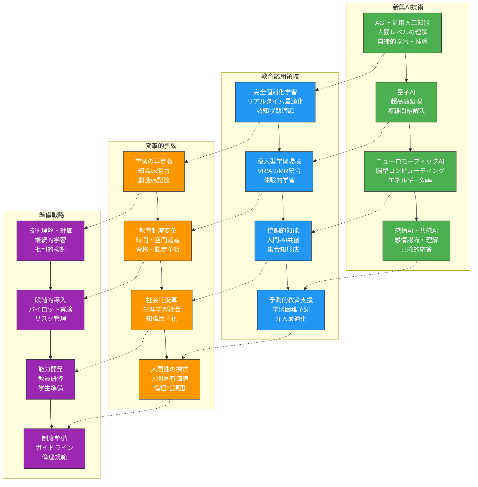
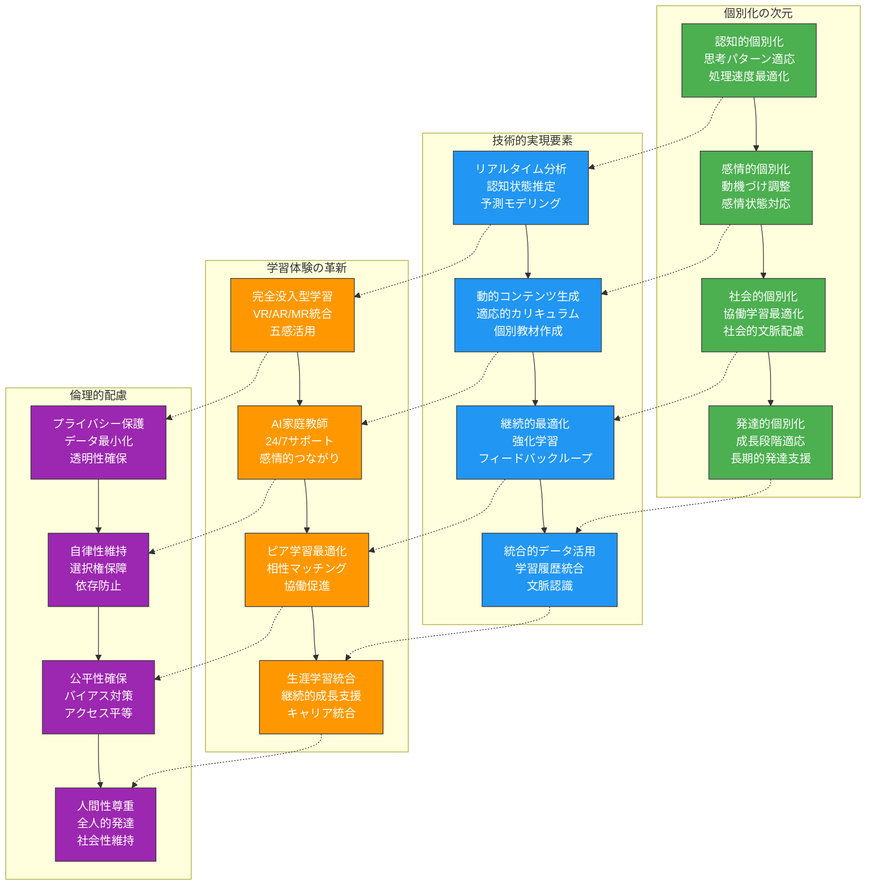
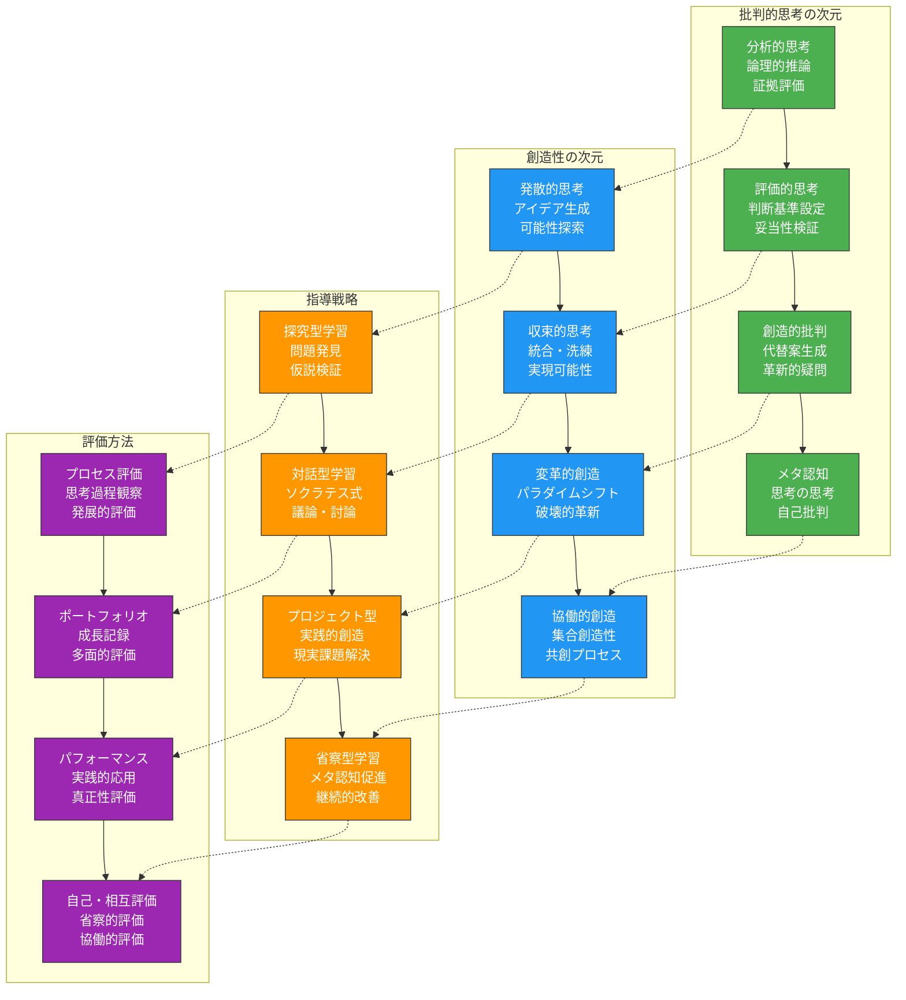

生成AIと教育の融合は、まだ始まったばかりの壮大な変革です。本章では、AI技術の発展予測と教育への影響、教育者の役割変化、持続可能な教育イノベーションの実現、そして実践者コミュニティの構築について、未来志向の視点から展望します。

# AI技術の発展予測と対応

## 次世代AI技術の教育応用可能性

**次世代AI技術**は、現在の生成AIを超えた革新的な能力を持ち、教育のあり方を根本的に変革する可能性を秘めています。これらの技術動向を理解し、適切に準備することが重要です。

### 次世代AI技術の教育応用フレームワーク



### 次世代AI教育応用戦略プロンプト

**未来AI技術の教育統合戦略プロンプト**：
```
次世代AI技術の教育応用に向けた包括的準備戦略を策定してください。

## 技術動向分析
### 1. 短期的展望（1-3年）
#### 技術進化
- 大規模言語モデルの高度化
- マルチモーダルAIの実用化
- 推論・計画能力の向上
- エージェント型AIの発展

#### 教育応用可能性
- より自然な対話型学習
- 視覚・音声統合型教材
- 高度な問題解決支援
- 自律的学習アシスタント

### 2. 中期的展望（3-7年）
#### 技術革新
- AGIへの接近
- 量子コンピューティング統合
- 脳-コンピュータインターフェース
- 感情・共感AI実用化

#### 教育パラダイムシフト
- 完全適応型学習システム
- 没入型仮想学習環境
- 脳直接学習支援
- 感情認識型指導

### 3. 長期的展望（7-15年）
#### 技術特異点の可能性
- 人間レベルAGIの実現
- 意識・自我を持つAI
- 生物学的知能との融合
- 新しい知能形態の創発

#### 教育の根本的再定義
- 知識の即時転送・共有
- 認知能力の拡張・強化
- 個体vs集合知の融合
- 人間性・創造性の再評価

## 準備・対応戦略
### 1. 技術評価・選択
#### 継続的モニタリング
- 技術動向の体系的追跡
- 教育効果のエビデンス収集
- リスク・機会の評価
- 国際的ベンチマーキング

#### 戦略的技術選択
- 教育目標との整合性評価
- 費用対効果の分析
- 段階的導入計画
- 代替技術の検討

### 2. 組織的準備
#### インフラ・システム
- 技術基盤の段階的整備
- セキュリティ・プライバシー強化
- 相互運用性・標準化
- スケーラビリティ確保

#### 人材・能力開発
- 未来スキルの特定・育成
- 継続的学習プログラム
- イノベーション人材確保
- 変革リーダーシップ育成

### 3. 教育設計革新
#### カリキュラム・教育方法
- 未来志向カリキュラム開発
- 新しい教育方法論探求
- 評価・認定システム革新
- 学習科学との統合深化

#### 学習者準備
- デジタル・AIリテラシー
- メタ学習能力育成
- 創造性・批判的思考強化
- 倫理的判断力養成

## リスク管理・倫理対応
### 1. 技術リスク対策
#### 依存・退化リスク
- 人間能力の維持戦略
- バランスの取れた活用
- 代替手段の確保
- 定期的な「技術断食」

#### セキュリティ・安全性
- 高度なセキュリティ対策
- AIの暴走・誤動作対策
- バックアップ・復旧計画
- 人間による最終統制

### 2. 倫理的課題対応
#### 人間性・尊厳の保護
- 人間中心の設計原則
- 自律性・主体性の維持
- プライバシー・人権保護
- 多様性・包摂性確保

#### 社会的責任
- 技術格差への対応
- 民主的ガバナンス
- 透明性・説明責任
- 持続可能性配慮

包括的で前向きな未来準備戦略を提案してください。
```

## マルチモーダルAIの教育活用

**マルチモーダルAI**は、テキスト、画像、音声、動画などを統合的に処理し、より豊かな学習体験を提供します。この技術の教育応用は、学習の質を飛躍的に向上させる可能性があります。

### マルチモーダルAI教育活用の実践

**マルチモーダル学習環境設計プロンプト**：
```
マルチモーダルAIを活用した革新的な学習環境を設計してください。

## マルチモーダル統合の次元
### 1. 入力モダリティ
#### 学習者からの入力
- 音声による質問・対話
- 手書き数式・図解
- ジェスチャー・身体動作
- 表情・視線追跡

#### 環境情報の取得
- 学習空間の状況把握
- 学習者の生理状態
- 社会的相互作用
- 文脈的手がかり

### 2. 処理・分析統合
#### 多感覚情報の統合理解
- クロスモーダル学習
- 文脈認識・状況理解
- 感情・認知状態推定
- 学習パターン分析

#### 知識表現・推論
- マルチモーダル知識グラフ
- 視覚的・言語的推論統合
- 類推・メタファー生成
- 創造的問題解決

### 3. 出力・フィードバック
#### 適応的提示
- 学習者特性に応じた形式選択
- 視覚・聴覚・触覚フィードバック
- 拡張現実(AR)オーバーレイ
- 仮想現実(VR)没入体験

#### インタラクティブ応答
- 自然な対話・会話
- 動的視覚化・アニメーション
- 適応的難易度調整
- 即時的・文脈的支援

## 教育応用シナリオ
### 1. 理工系教育での活用
#### 数学・物理教育
- 3D視覚化による概念理解
- インタラクティブシミュレーション
- 手書き数式の即時解析
- 実験データの多角的分析

#### 工学・技術教育
- 仮想ラボ・実験環境
- CAD/CAM統合学習
- プロトタイピング支援
- 故障診断・トラブルシューティング

### 2. 実践的スキル習得
#### 実験・実習技能
- 動作認識による技能評価
- リアルタイムフィードバック
- エラー検出・修正指導
- 安全性モニタリング

#### プレゼンテーション能力
- 音声・身体言語分析
- スライド・資料最適化
- 聴衆反応シミュレーション
- 改善提案生成

## 実装・運用計画
### 1. 段階的導入
#### パイロットプロジェクト
- 特定科目での試験導入
- 効果測定・評価
- フィードバック収集
- 改善・最適化

#### スケールアップ
- 成功事例の横展開
- インフラ拡充
- 教員研修拡大
- 全学的展開

### 2. 技術基盤整備
#### ハードウェア要件
- 高性能コンピューティング
- センサー・カメラシステム
- VR/ARデバイス
- ネットワークインフラ

#### ソフトウェア・プラットフォーム
- マルチモーダルAIエンジン
- 統合学習管理システム
- コンテンツ作成ツール
- 分析・評価ダッシュボード

革新的で実現可能なマルチモーダル学習環境を提案してください。
```

## 個別化学習の究極的発展

**個別化学習の究極形**は、各学習者の認知特性、感情状態、学習履歴をリアルタイムで把握し、最適な学習体験を瞬時に生成する完全適応型システムです。

### 究極的個別化学習の実現戦略



### 究極的個別化学習システムプロンプト

**完全適応型学習システム設計プロンプト**：
```
究極的な個別化学習を実現する完全適応型システムを設計してください。

## システムの中核機能
### 1. 学習者モデリング
#### 多次元プロファイリング
- 認知能力・学習スタイル
- 感情状態・動機パターン
- 社会的特性・文化背景
- 身体的状態・健康情報

#### 動的状態推定
- リアルタイム認知負荷測定
- 注意・集中レベル追跡
- 感情変動モニタリング
- 疲労・ストレス検出

### 2. 適応的介入
#### コンテンツ適応
- 難易度の動的調整
- 提示形式の最適化
- ペース・順序の個別化
- 関心に基づく文脈設定

#### 教育戦略適応
- 指導方法の切り替え
- フィードバックタイミング
- 動機づけ戦略調整
- 支援レベル変更

### 3. 長期的最適化
#### 学習経路計画
- 個別カリキュラム生成
- マイルストーン設定
- 分岐・選択肢提供
- 将来予測・推奨

#### 成長支援
- 強み・弱み分析
- 才能発見・育成
- メタ認知能力開発
- レジリエンス構築

## 実現への道筋
### 1. 技術統合
#### AI・機械学習
- 深層学習モデル
- 強化学習エージェント
- 自然言語処理
- コンピュータビジョン

#### センシング技術
- 生体センサー
- 環境センサー
- 行動追跡
- 脳波測定

### 2. データ基盤
#### データ収集・管理
- プライバシー保護収集
- リアルタイム処理
- 長期保存・活用
- 相互運用性確保

#### 分析・洞察
- パターン認識
- 予測モデリング
- 因果推論
- 説明可能AI

### 3. 人間中心設計
#### ユーザー体験
- 直感的インターフェース
- 自然な相互作用
- 透明性・制御性
- 楽しさ・魅力

#### 倫理的設計
- プライバシーバイデザイン
- 公平性・包摂性
- 自律性・主体性
- ウェルビーイング

実現可能で倫理的な究極の個別化学習システムを提案してください。
```

# 教育者の役割変化と適応戦略

## 知識伝達者から学習促進者への転換

**教育者の役割**は、AI時代において根本的に変化しています。知識の単純な伝達から、学習プロセスの設計と促進へと重心が移っています。

### 役割転換の戦略的フレームワーク

**教育者役割転換支援プロンプト**：
```
AI時代における教育者の役割転換を支援する包括的プログラムを設計してください。

## 新しい役割定義
### 1. 学習設計者
#### カリキュラムアーキテクト
- 学習目標の戦略的設定
- 学習経路の設計・最適化
- AI活用の統合計画
- 評価システムの構築

#### 体験デザイナー
- 学習体験の演出
- 動機づけ環境の創造
- 協働学習の促進
- 創造的活動の設計

### 2. 学習ファシリテーター
#### 対話促進者
- 批判的対話の促進
- 質問・探究の刺激
- 議論・討論の運営
- 省察・内省の支援

#### つながり構築者
- 学習コミュニティ形成
- ピア学習の促進
- 外部リソース接続
- ネットワーク構築

### 3. メンター・コーチ
#### 個別成長支援者
- 個人目標設定支援
- 強み・才能の発見
- 困難・挫折への対応
- キャリア発達支援

#### 全人的育成者
- 人格形成支援
- 価値観・倫理観育成
- 社会性・情動発達
- ウェルビーイング促進

## 転換支援プログラム
### 1. マインドセット変革
#### 意識改革
- 役割変化の必要性理解
- 新しいアイデンティティ形成
- 成長マインドセット醸成
- 変化への前向きな姿勢

#### 価値観再構築
- 教育の本質的価値再考
- 人間教師の独自価値認識
- AI協働の意義理解
- 未来教育ビジョン共有

### 2. スキル開発
#### 新規スキル習得
- 学習設計スキル
- ファシリテーション技術
- コーチング・メンタリング
- テクノロジー活用

#### 既存スキル進化
- 教科専門性の深化
- 対人スキルの洗練
- 創造性・革新性
- 批判的思考力

### 3. 実践的移行支援
#### 段階的移行計画
- 現状評価・ギャップ分析
- 個別移行計画策定
- 段階的実践・実験
- 継続的改善サイクル

#### サポート体制
- メンタリング制度
- ピアサポートグループ
- 専門家コンサルティング
- 継続的研修プログラム

効果的で人間的な役割転換支援プログラムを提案してください。
```

## メンター・コーチとしての専門性開発

**メンタリングとコーチング**は、AI時代の教育者にとって中核的な専門性となります。この能力を体系的に開発することが重要です。

### メンター・コーチ専門性開発プログラム

**教育者コーチング能力開発プロンプト**：
```
教育者のメンタリング・コーチング専門性を開発する体系的プログラムを設計してください。

## コア・コンピテンシー
### 1. 関係構築能力
#### 信頼関係形成
- 共感的理解・傾聴
- 心理的安全性創出
- 無条件の肯定的関心
- 境界設定・倫理

#### コミュニケーション
- アクティブリスニング
- 強力な質問技法
- フィードバック技術
- 非言語コミュニケーション

### 2. 成長促進能力
#### 目標設定支援
- ビジョン明確化
- SMART目標設定
- 行動計画策定
- 進捗管理支援

#### 能力開発促進
- 強み発見・活用
- 成長機会創出
- 挑戦促進・支援
- 省察・学習促進

### 3. 問題解決支援
#### 課題分析
- 問題の本質把握
- 根本原因探求
- システム思考適用
- 多角的視点提供

#### 解決策創出
- 創造的問題解決
- リソース活用支援
- 行動変容促進
- 障害除去支援

## 開発プログラム構成
### 1. 理論的基盤
#### コーチング理論
- コーチング心理学
- 成人学習理論
- 動機づけ理論
- 変革理論

#### 実践モデル
- GROWモデル
- ソリューションフォーカス
- 認知行動アプローチ
- ポジティブ心理学

### 2. 実践的スキル訓練
#### スキル演習
- ロールプレイ
- ケーススタディ
- シミュレーション
- 実践フィードバック

#### 実地訓練
- スーパービジョン下実践
- ピアコーチング
- 実習・インターンシップ
- アクションラーニング

### 3. 継続的専門性開発
#### 自己開発
- 自己省察・内省
- スーパービジョン
- 継続教育
- 専門資格取得

#### コミュニティ参加
- 実践コミュニティ
- 研究会・学会
- メンター制度
- 国際交流

包括的で実践的なメンター・コーチ開発プログラムを提案してください。
```

## 批判的思考・創造性指導の重要性

**批判的思考と創造性**は、AI時代において人間が担うべき最も重要な能力です。これらを効果的に指導する専門性が求められます。

### 批判的思考・創造性指導の体系



### 批判的思考・創造性指導力向上プロンプト

**高次思考能力指導プログラムプロンプト**：
```
批判的思考と創造性を効果的に指導する能力を開発するプログラムを設計してください。

## 指導能力の構成要素
### 1. 理論的理解
#### 思考の科学
- 認知科学の知見
- 思考プロセスの理解
- 創造性の心理学
- 批判的思考の哲学

#### 発達的視点
- 思考能力の発達段階
- 個人差・多様性
- 文化的影響
- 環境要因

### 2. 実践的指導技術
#### 促進的介入
- 適切な問いかけ
- 思考の足場かけ
- 認知的葛藤創出
- 挑戦的課題設定

#### 支援的環境
- 心理的安全性
- 失敗許容文化
- 多様性尊重
- 自律性支援

### 3. 評価・フィードバック
#### 形成的評価
- 思考プロセス観察
- 即時的フィードバック
- 発達的視点
- 個別化対応

#### 総括的評価
- 多面的評価基準
- ポートフォリオ活用
- 成長の可視化
- 自己評価促進

## プログラム実施方法
### 1. 研修カリキュラム
#### 基礎モジュール
- 理論的基盤学習
- 基本技術習得
- 実践演習
- 省察・討議

#### 発展モジュール
- 高度技術開発
- 研究的実践
- イノベーション創出
- リーダーシップ育成

### 2. 実践的学習
#### アクションリサーチ
- 自己実践研究
- データ収集・分析
- 改善サイクル
- 成果共有

#### 協働的学習
- 授業研究
- ピア観察
- 共同設計
- 実践共有

### 3. 継続的発展
#### 専門性向上
- 継続研修参加
- 資格・認定取得
- 研究活動
- 国際交流

#### コミュニティ形成
- 実践者ネットワーク
- 研究会組織
- オンラインコミュニティ
- メンタリング関係

実効性の高い高次思考能力指導プログラムを提案してください。
```

# 持続可能な教育イノベーション

## 技術と人間性のバランス

**技術と人間性の調和**は、持続可能な教育イノベーションの鍵です。技術の力を活用しながら、人間の本質的価値を守り育てることが重要です。

### 技術-人間性バランス戦略

**人間中心AI教育設計プロンプト**：
```
技術と人間性のバランスを保った持続可能な教育イノベーション戦略を策定してください。

## バランスの原則
### 1. 人間中心設計
#### 人間の尊厳尊重
- 個人の自律性保護
- 多様性・個性尊重
- プライバシー保護
- 選択の自由保障

#### 全人的発達支援
- 認知的発達
- 情動的発達
- 社会的発達
- 身体的発達

### 2. 技術の適切な位置づけ
#### 道具としての技術
- 人間の能力拡張
- 創造性の促進
- アクセシビリティ向上
- 効率性改善

#### 技術の限界認識
- 人間判断の優位性
- 倫理的判断の必要性
- 文脈理解の重要性
- 感情的つながりの価値

### 3. 相補的関係構築
#### 強みの統合
- 人間の創造性×AIの処理能力
- 人間の共感×AIの客観性
- 人間の直感×AIの分析
- 人間の価値判断×AIの情報処理

#### 弱点の相互補完
- 人間の限界をAIが補完
- AIの限界を人間が補完
- 相互チェック機能
- 冗長性による安全性

## 実践的アプローチ
### 1. 設計原則
#### 価値敏感設計
- 人間価値の明確化
- 価値の設計への反映
- トレードオフの検討
- 継続的評価

#### 参加型設計
- ステークホルダー参画
- 共同設計プロセス
- フィードバック統合
- 反復的改善

### 2. 実装戦略
#### 段階的統合
- パイロット実験
- 効果測定
- 漸進的拡大
- リスク管理

#### 人間能力維持
- 基礎能力の継続訓練
- 技術なし期間設定
- 多様な学習方法
- 代替手段確保

### 3. 評価・調整
#### バランス評価指標
- 技術依存度測定
- 人間能力評価
- 相互作用効果
- 長期的影響

#### 継続的調整
- 定期的見直し
- バランス調整
- 新技術への対応
- 価値の再確認

持続可能で人間的な教育イノベーション戦略を提案してください。
```

## 長期的視点での教育改善

**長期的視点**は、一時的な流行に左右されない、本質的で持続可能な教育改善を実現するために不可欠です。

### 長期的教育改善の戦略的計画

**長期的教育改善ロードマッププロンプト**：
```
10-20年スパンでの長期的教育改善ロードマップを策定してください。

## 長期ビジョン
### 1. 2035年の教育像
#### 学習の姿
- 完全個別化・適応型学習
- 生涯学習の常態化
- グローバル・ローカル統合
- 現実・仮想融合学習

#### 教育システム
- 柔軟な教育制度
- 多様な学習経路
- 能力ベース認定
- 分散型教育ネットワーク

### 2. 2045年への展望
#### 人間-AI共生社会
- 拡張知能による学習
- 集合知の形成
- 新しい知の創造
- 人間性の再定義

#### 教育の役割
- 人間性の育成
- 創造性の解放
- 社会的つながり
- 意味・価値の探求

## 段階的実施計画
### 1. 短期（2025-2030）
#### 基盤整備期
- インフラ構築
- 教員能力開発
- パイロット実験
- 制度的準備

#### 初期成果
- 効率性向上
- アクセス改善
- 品質標準化
- 格差縮小

### 2. 中期（2030-2035）
#### 変革加速期
- 本格的AI統合
- 教育パラダイムシフト
- 新評価システム
- 国際標準確立

#### 中間成果
- 個別化実現
- 創造性向上
- グローバル化
- 社会連携強化

### 3. 長期（2035-2045）
#### 成熟・進化期
- 次世代技術統合
- 教育の再定義
- 新しい学習形態
- 人間性の探求

#### 最終成果
- 全人的発達
- 社会変革
- 持続可能性
- 人類の進化

## 成功要因
### 1. 継続性確保
#### 制度的保障
- 長期計画制度化
- 予算確保
- 人材育成
- 知識継承

#### 適応的進化
- 環境変化対応
- 技術進歩統合
- 社会ニーズ反映
- 継続的改善

### 2. 多様な参画
#### ステークホルダー協働
- 教育者主導
- 学習者参加
- 社会連携
- 国際協力

#### 世代間継承
- 知識・経験伝承
- 若手育成
- 世代間対話
- 未来への責任

実現可能で野心的な長期改善ロードマップを提案してください。
```

## グローバルな教育課題への貢献

**グローバルな教育課題**への貢献は、持続可能な発展目標(SDGs)の達成と人類全体の進歩に不可欠です。

### グローバル教育貢献戦略

**国際教育協力プログラムプロンプト**：
```
AI活用によるグローバル教育課題解決への貢献戦略を策定してください。

## グローバル課題の特定
### 1. 教育アクセス格差
#### 地理的格差
- 農村・僻地の教育
- 紛争地域の教育
- 難民・移民の教育
- 島嶼国の教育

#### 社会経済的格差
- 貧困層の教育
- ジェンダー格差
- 障害者の教育
- 少数民族の教育

### 2. 教育の質的課題
#### 21世紀スキル
- 批判的思考力
- 創造性・革新性
- デジタルリテラシー
- グローバルコンピテンス

#### 持続可能性教育
- 環境教育
- 平和教育
- 人権教育
- 多文化理解

## AI活用ソリューション
### 1. スケーラブルな教育提供
#### オンライン・遠隔教育
- 低帯域対応システム
- オフライン学習対応
- 多言語自動翻訳
- 文化適応コンテンツ

#### 教員不足対策
- AI教師アシスタント
- 自動評価・フィードバック
- 教員研修支援
- 知識共有プラットフォーム

### 2. 質的向上支援
#### 個別化・適応学習
- 学習スタイル適応
- 言語・文化配慮
- 特別支援ニーズ対応
- 才能発掘・育成

#### 創造性・批判的思考
- 探究型学習支援
- プロジェクト学習促進
- 協働学習ファシリテーション
- メタ認知能力開発

## 国際協力実施
### 1. パートナーシップ構築
#### 多国間協力
- UNESCO連携
- 世界銀行協働
- 地域機構連携
- NGO/NPO協力

#### 技術移転・能力構築
- 技術共有
- 現地人材育成
- 持続可能性確保
- 自立支援

### 2. 実施プログラム
#### パイロットプロジェクト
- 対象地域選定
- ニーズアセスメント
- カスタマイズ実装
- 効果測定

#### スケールアップ
- 成功モデル展開
- 資金調達
- 政策提言
- 国際標準化

包括的で実効性のあるグローバル貢献戦略を提案してください。
```

# 実践者コミュニティの構築

## 継続的学習ネットワークの重要性

**学習コミュニティ**は、個人の経験を集合知に変換し、継続的な改善と革新を促進する重要な基盤です。

### 学習ネットワーク構築戦略

**AI教育実践者ネットワークプロンプト**：
```
AI活用教育の実践者による継続的学習ネットワークを構築してください。

## ネットワークの構造
### 1. 多層的組織
#### ローカルレベル
- 学内実践コミュニティ
- 地域教育者グループ
- 学科・専門別サークル
- 研究会・勉強会

#### 国内レベル
- 全国実践者ネットワーク
- 専門学会・協会
- 政策提言グループ
- 産学官連携組織

#### 国際レベル
- グローバルコミュニティ
- 国際会議・シンポジウム
- 共同研究ネットワーク
- 標準化組織

### 2. 機能的役割
#### 知識創造・共有
- ベストプラクティス収集
- 失敗事例・教訓共有
- 研究成果発信
- イノベーション創出

#### 相互支援・協力
- ピアサポート
- メンタリング
- 技術支援
- リソース共有

#### 政策・社会影響
- 政策提言
- 社会啓発
- メディア発信
- 標準策定

## 活動内容
### 1. 定期的活動
#### オンライン活動
- ウェビナー・セミナー
- オンラインディスカッション
- バーチャル研究会
- デジタルワークショップ

#### オフライン活動
- 年次大会・総会
- 地域ミーティング
- 実践共有会
- 合宿・リトリート

### 2. 協働プロジェクト
#### 研究・開発
- 共同研究プロジェクト
- ツール・教材開発
- 実証実験
- 評価研究

#### 実践・普及
- モデル授業開発
- 研修プログラム
- 認定制度
- アウトリーチ活動

## 持続可能性確保
### 1. 組織運営
#### ガバナンス
- 民主的意思決定
- 透明性確保
- 多様性尊重
- 倫理規範

#### 財務基盤
- 会費制度
- 助成金獲得
- スポンサーシップ
- 事業収入

### 2. 参加促進
#### インセンティブ
- 専門性認定
- 表彰制度
- キャリア支援
- 研究機会

#### 参加障壁除去
- 多様な参加形態
- 言語サポート
- 経済的支援
- 時間的配慮

活発で持続可能な学習ネットワークを提案してください。
```

## 知識共有・相互支援の仕組み

**知識共有と相互支援**は、コミュニティの生命線です。効果的な仕組みを構築することで、集合知の力を最大化できます。

### 知識共有プラットフォーム設計

**実践知共有システムプロンプト**：
```
AI教育実践者の知識共有と相互支援を促進するシステムを設計してください。

## 知識管理基盤
### 1. 知識の類型化
#### 形式知
- 研究論文・報告書
- 教材・カリキュラム
- ツール・ソフトウェア
- ガイドライン・マニュアル

#### 暗黙知
- 実践的ノウハウ
- 経験則・コツ
- 失敗体験・教訓
- 直感・洞察

### 2. 知識の構造化
#### 分類・タグ付け
- 分野別分類
- 難易度レベル
- 用途・目的別
- 効果・エビデンス

#### 関連付け・リンク
- 知識間の関係
- 前提・依存関係
- 発展・応用関係
- 類似・対比関係

## 共有メカニズム
### 1. 貢献・投稿
#### 投稿プロセス
- 簡単な投稿手順
- 多様な形式対応
- 品質チェック
- フィードバック機能

#### 貢献インセンティブ
- 貢献度ポイント
- 著者クレジット
- ピアレビュー
- 引用・利用統計

### 2. 発見・活用
#### 検索・発見
- 高度検索機能
- レコメンデーション
- トレンド表示
- Q&A機能

#### 活用支援
- 実装ガイド
- カスタマイズ支援
- 導入事例
- サポートフォーラム

## 相互支援機能
### 1. 直接支援
#### メンタリング
- メンター・マッチング
- 目標設定支援
- 定期的フォロー
- 成長記録

#### ピアサポート
- 相談・質問
- 問題解決支援
- 経験共有
- 励まし・応援

### 2. 協働機会
#### プロジェクト形成
- プロジェクト提案
- メンバー募集
- リソース調整
- 進捗管理

#### イベント・交流
- 勉強会企画
- ワークショップ
- 交流会
- 共同研究

効果的で活発な知識共有システムを提案してください。
```

## 教育の未来を創る共同責任

**共同責任**の認識は、持続可能で包摂的な教育の未来を創造するための基盤です。すべてのステークホルダーが責任を共有し、協働することが必要です。

### 共同責任実現の戦略

**教育未来共創プログラムプロンプト**：
```
教育の未来を創る共同責任を実現するプログラムを設計してください。

## 共同責任の構造
### 1. ステークホルダーの責任
#### 教育者
- 専門性向上責任
- 倫理的実践責任
- 次世代育成責任
- 社会貢献責任

#### 学習者
- 主体的学習責任
- 相互支援責任
- 社会参加責任
- 未来創造責任

#### 社会
- 支援・投資責任
- 参画・協力責任
- 評価・改善責任
- 継承・発展責任

### 2. 共同行動領域
#### ビジョン共創
- 未来像の共同描画
- 価値観の共有
- 目標の合意形成
- 戦略の共同策定

#### 実践協働
- リソース共有
- 知識・経験交流
- 共同プロジェクト
- 相互支援

#### 評価・改善
- 共同評価
- 相互フィードバック
- 継続的対話
- 共同学習

## 実現プログラム
### 1. 対話・合意形成
#### マルチステークホルダー対話
- 定期的フォーラム
- 円卓会議
- タウンホール
- オンライン対話

#### 合意形成プロセス
- 課題共有
- 解決策探索
- 優先順位設定
- 行動計画策定

### 2. 協働アクション
#### 共同プロジェクト
- パイロット事業
- 実証実験
- 社会実装
- スケールアップ

#### 役割分担
- 責任明確化
- リソース配分
- タイムライン設定
- 成果共有

### 3. 持続的発展
#### 制度化
- 協働の制度化
- ガバナンス構築
- 財源確保
- 法的枠組み

#### 文化形成
- 協働文化醸成
- 信頼関係構築
- 相互尊重促進
- 世代間継承

包括的で実効性のある共同責任プログラムを提案してください。
```

この第12章では、AI技術と教育の未来を展望し、持続可能な発展への道筋を示しました。技術の発展予測から教育者の役割変化、そして実践者コミュニティの構築まで、認知負債を避けながら人間性を中心に据えた教育イノベーションを実現する包括的なビジョンと戦略を提示しています。本書全体を通じて、生成AIを責任を持って活用し、教育の質を高めながら人間の本質的価値を守り育てる実践的アプローチを解説してきました。