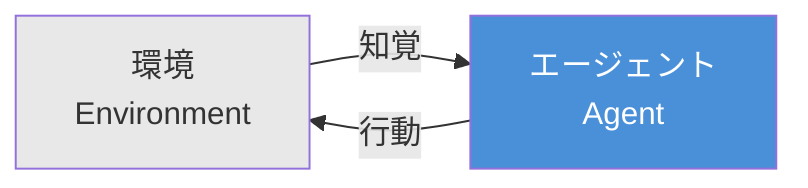
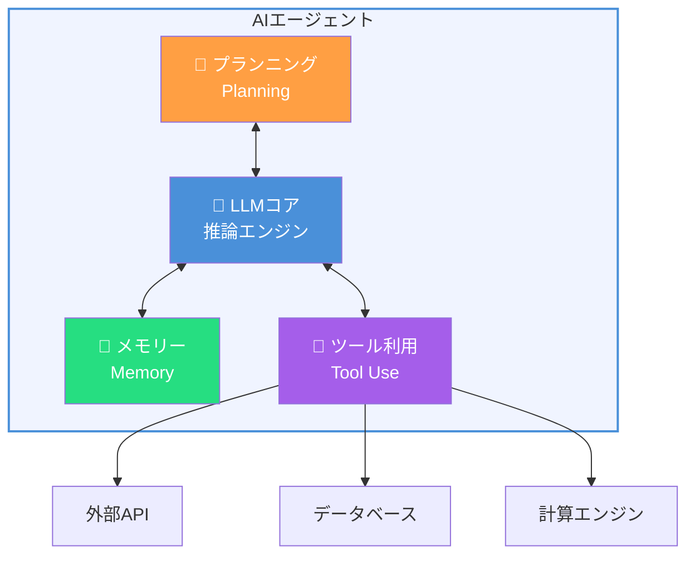
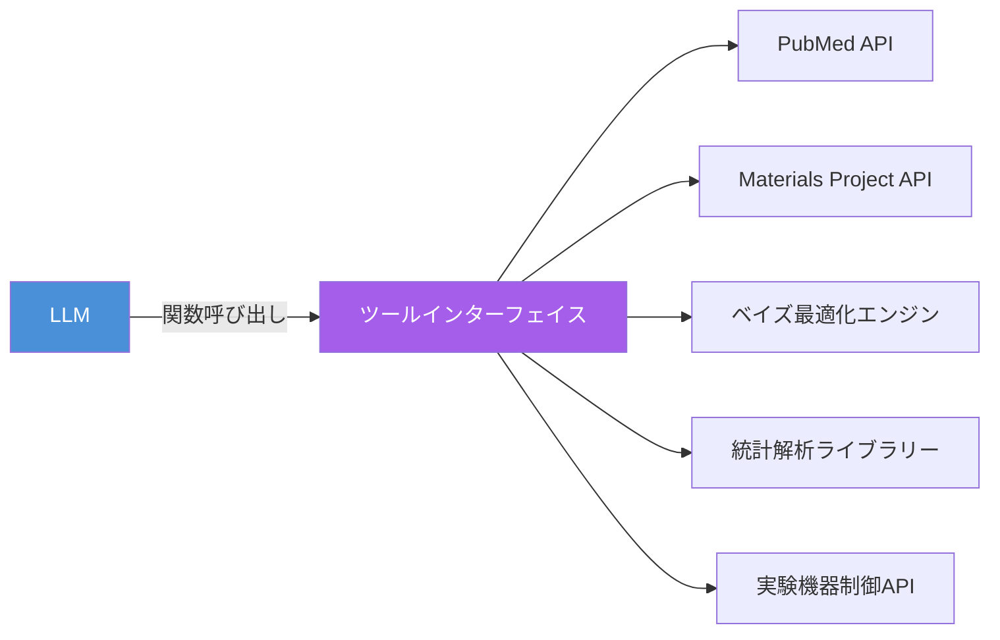
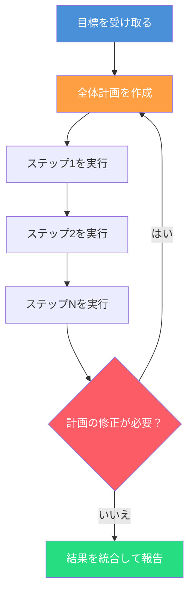
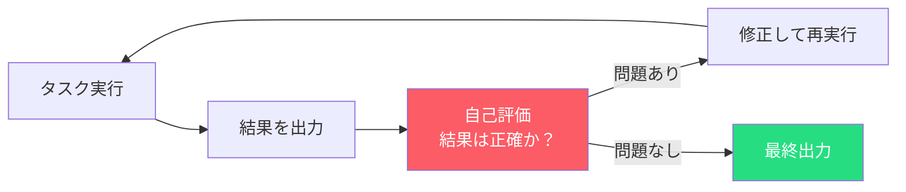
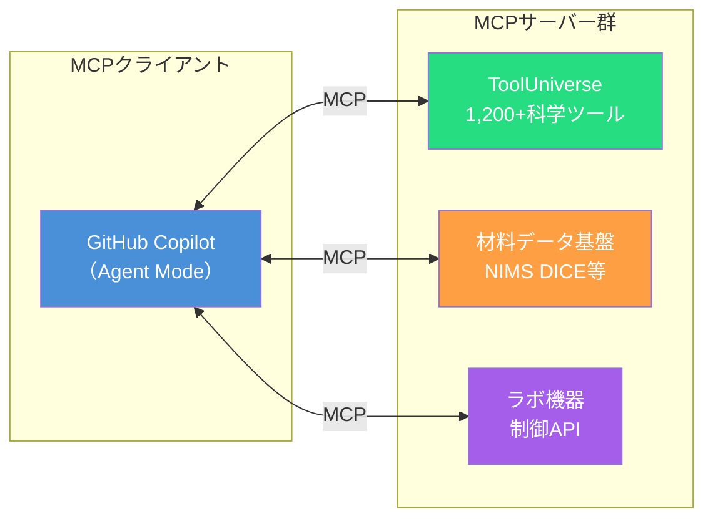
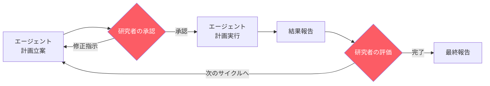

序論では、科学研究にAIエージェントが必要な理由と本書の全体像を示しました。本章では、AIエージェントとは何か、どのような構成要素で成り立つのか、そしてどのような推論パターンで動作するのかを体系的に解説します。以降の章で科学研究エージェントを実際に設計・実装するための**基礎概念**を、ここで押さえましょう。

## AIエージェントとは何か

### 古典的定義から現代のLLMエージェントへ

AIエージェント（AI Agent）という概念は、人工知能研究の黎明期から存在します。Russell & Norvigの教科書[^1]では、エージェントを「環境を**知覚**（perceive）し、**推論**（reason）し、**行動**（act）する存在」と定義しています。



この定義自体は現在でも有効ですが、2023年以降のLLM（大規模言語モデル）の飛躍的な進歩により、エージェントの実現形態は大きく変わりました。従来のエージェントが事前にプログラムされたルールや強化学習で動作していたのに対し、**LLMベースのエージェント**は自然言語による柔軟な推論とツール呼び出しを通じて、はるかに広範なタスクに対応できます。

### エージェントの本質的特性

AIエージェントを他のソフトウェアと区別する本質的な特性は、以下の4つです。

| 特性 | 説明 | 従来のソフトウェアとの違い |
| ---- | ---- | ---- |
| **自律性**（Autonomy） | 与えられた目標に対して自らの判断で行動を選択する | スクリプトは事前に決められた手順を実行するだけ |
| **目標指向性**（Goal-directedness） | 最終的な目標達成に向けて計画を立て、行動を最適化する | 関数は入力に対して出力を返すだけで、目標という概念がない |
| **ツール利用**（Tool Use） | 外部ツールやAPIを選択・呼び出して能力を拡張する | 従来のプログラムは組み込まれた機能のみ使用する |
| **適応性**（Adaptability） | 実行結果をフィードバックとして受け取り、次の行動を修正する | バッチ処理は結果に関係なく同じ処理を続ける |

これらの特性をすべて備えたソフトウェアシステムが、本書でいうAIエージェントです。重要なのは、チャットボットやLLM APIの単純な呼び出しとは根本的に異なるという点です。

:::message
**チャットボットとエージェントの違い**

- **チャットボット**: ユーザーの質問に応答を返す。1回の質問に対して1回の回答で完結する
- **AIエージェント**: ユーザーの「目標」を受け取り、計画を立てて複数のステップを自律的に実行する。途中で外部ツールを呼び出し、結果を評価し、必要に応じて計画を修正する

たとえば「PubMedで免疫チェックポイント阻害薬の最新レビュー論文を5件探して」と依頼した場合、チャットボットは知識に基づいて回答を「生成」しますが、エージェントはPubMed APIを実際に呼び出し、検索結果を評価し、条件に合う論文を選別して返します。
:::

### 科学研究に求められるエージェントの役割

科学研究においてAIエージェントが担うべき役割は、単なるタスク自動化ではありません。研究者の**認知的パートナー**として、以下のような知的作業を支援することが求められます。

1. **情報の網羅的探索**: 人間が読み切れない量の文献やデータベースを体系的に調査する
2. **パラメーター空間の効率的探索**: 実験条件の組合せ爆発に対してベイズ最適化などの戦略的手法を適用する
3. **パターンの発見**: 大量の実験データから人間が見落とすトレンドや相関を検出する
4. **研究ワークフローの連結**: 文献調査→実験設計→データ解析→知識更新というサイクルを途切れなくつなぐ

## LLMベースエージェントのアーキテクチャ

序論で述べた「GitHub Copilot（エージェントモード）+ SATORI（エージェントスキル）+ ToolUniverse（外部ツール）」の構成は、LLMベースエージェントの一般的なアーキテクチャに基づいています。ここでは、そのアーキテクチャの各構成要素を詳しく見ていきます。

### 4つの構成要素

LLMベースのエージェントは、大きく4つのコンポーネントで構成されます[^2]。



#### 1. LLMコア（推論エンジン）

エージェントの「頭脳」にあたる部分です。GPT-5.2、Claude Opus 4.6、Gemini 3などのLLMが、自然言語による推論・判断・コード生成を担います。GitHub Copilotでは、タスクに応じてモデルを切り替えられるため、複雑な科学的推論にはClaude Opus 4.6を、高速なコード生成にはGPT-5.2 miniを使い分けるといった運用が可能です。

科学研究エージェントにおいてLLMコアに求められる能力は次のとおりです。

- 論文中の数式や化学式の理解
- 実験プロトコルの解釈と生成
- 統計的手法の適切な選択判断
- 結果の科学的な解釈と考察

#### 2. メモリー（記憶と文脈管理）

エージェントが過去の行動結果や取得した情報を保持し、後続の判断に活用するための仕組みです。

| メモリーの種類 | 説明 | 科学研究での例 |
| ---- | ---- | ---- |
| **短期メモリー**（ワーキングメモリー） | 現在のタスク実行中に保持するコンテキスト | 「この検索セッションで見つけた論文リスト」 |
| **長期メモリー**（知識ベース） | 永続的に保存される知識や過去の経験 | 「過去の実験で最適だったパラメーター範囲」 |
| **エピソード記憶** | 過去のタスク実行の履歴とその結果 | 「前回の文献調査で有効だった検索戦略」 |

GitHub Copilotのエージェントモードでは、会話コンテキストが短期メモリーとして機能し、エージェントスキル（SATORIなど）に記述された知識が長期メモリーの役割を果たします。

#### 3. プランニング（計画と分解）

複雑なタスクを実行可能なサブタスクに分解し、実行順序を決定する能力です。「この材料の熱電特性を調査して」という曖昧な指示を受けたエージェントは、以下のように計画を立てます。

```
目標: 材料Xの熱電特性を調査する

計画:
  1. Materials Projectで材料Xの基本物性データを取得
  2. StarryData2で既報の実測値を検索
  3. PubMedとarXivで関連論文を検索
  4. 論文から報告されているZT値・ゼーベック係数を抽出
  5. データを整理し、温度依存性のトレンドを分析
  6. 結果をレポートとしてまとめる
```

プランニングの質は、エージェントの有用性を左右するもっとも重要な要素の1つです。後述する推論パターンの選択によって、プランニングの柔軟性と精度が変わります。

#### 4. ツール利用（外部能力の拡張）

LLM単体では実行できない操作を、外部ツールの呼び出しによって実現する仕組みです。とくに科学研究エージェントでは、ツール利用の重要性が際立ちます。



ツール利用は「LLMが関数の名前・引数・説明を読み取り、適切なタイミングで適切な関数を呼び出す」という仕組みで動作します（function calling）。序論で紹介した**MCP（Model Context Protocol）**は、このツール呼び出しのインターフェイスを標準化するプロトコルであり、第3章で詳しく解説します。

### 本書のアーキテクチャとの対応

ここまで説明した4つの構成要素が、本書の技術スタックにどう対応するかを整理します。

| 構成要素 | 本書での実装 | 担当 |
| ---- | ---- | ---- |
| LLMコア | Claude Opus 4.6 / GPT-5.2 / Gemini 3 | GitHub Copilot（モデル選択） |
| メモリー | 会話コンテキスト + エージェントスキル | GitHub Copilot + SATORI |
| プランニング | LLMの推論 + スキル内の手順定義 | LLM + SATORIパイプラインフロー |
| ツール利用 | MCP経由の外部ツール呼び出し | ToolUniverse + 材料データ基盤 |

## エージェントの推論パターン

エージェントがタスクを実行する際の「考え方」にはいくつかの代表的なパターンがあります。科学研究エージェントを設計するうえで、タスクの性質に応じて適切なパターンを選択することが重要です。

### ReAct: 推論と行動の交互実行

ReAct（Reasoning + Acting）[^3]は、LLMの推論ステップとツール呼び出し（行動）を交互に繰り返すパターンです。思考の過程が明示的に言語化されるため、エージェントの判断根拠を追跡しやすいという利点があります。

```
Thought: PubMedで免疫チェックポイント阻害薬のレビュー論文を検索する必要がある
Action:  search_pubmed(query="immune checkpoint inhibitor review", 
         filter="Review", max_results=20)
Observation: 20件の結果を取得。2024年以降の論文が8件

Thought: 8件の最新レビューから、臨床試験の効果データを含むものに絞り込む
Action:  filter_papers(criteria="clinical trial efficacy data")
Observation: 5件が該当

Thought: 5件の要旨を分析し、主要な知見を整理する
Action:  summarize_abstracts(paper_ids=[...])
Observation: 主要な知見をカテゴリー別に整理完了
```

**科学研究での適用場面**: 文献調査、探索的データ解析、仮説検証など、段階的な判断が必要なタスク。

### Plan-and-Execute: 計画先行型

Plan-and-Execute[^4]は、まず全体計画を作成し、その後で計画に沿ってステップを実行するパターンです。長期的なタスクや複雑な実験プロトコルの遂行に適しています。



**科学研究での適用場面**: 実験計画の立案と実行、マルチステップの合成手順、体系的なパラメーター探索。

### Reflection: 自己評価と修正

Reflection（反省）[^5]パターンは、エージェントが自身の出力を批判的に評価し、誤りを検出して修正するメカニズムです。科学研究では結果の正確性がとくに重要であるため、このパターンの価値は大きくなります。



```
初回出力: t検定の結果、p = 0.03で有意差あり

Reflection: 待て。サンプルサイズn=8で正規性の検定を行っていない。
           また、多重比較補正も適用していない。
           小標本ではWilcoxonの順位和検定を使うべきではないか。

修正後: Shapiro-Wilk検定で正規性を確認（p = 0.12、正規性棄却できず）。
        ただしn=8のため、念のためWilcoxon順位和検定も実施。
        両手法で有意差を確認（t検定: p = 0.03、Wilcoxon: p = 0.04）。
```

**科学研究での適用場面**: 統計的検定手法の選択、実験結果の妥当性検証、コードのデバッグ。

### 推論パターンの使い分け

| パターン | 強み | 弱み | 科学研究での推奨場面 |
| ---- | ---- | ---- | ---- |
| ReAct | 逐次的な判断が透明、デバッグしやすい | 長期的な計画が苦手 | 文献調査、探索的解析 |
| Plan-and-Execute | 複雑なタスクを体系的に処理 | 計画修正のオーバーヘッドが大きい | 実験計画、合成手順 |
| Reflection | 出力品質の向上、誤り修正 | 実行時間が増加 | 統計解析、論文執筆 |

:::message
実際のエージェント開発では、これらのパターンを組み合わせて使います。たとえばSATORIのパイプラインフローでは、全体をPlan-and-Executeで構成しつつ、各ステップの実行にはReActを使い、最終出力にはReflectionを適用するというハイブリッドなアプローチを採用しています（詳しくは第2章で解説）。
:::

## ツール連携プロトコル — MCPとA2Aの概観

エージェントがツールを呼び出し、他のエージェントと協調するための「通信規格」が、2024〜2025年にかけて急速に整備されました。ここではその概要を示します（プロトコルの詳細な実装は第3章で扱います）。

### MCP（Model Context Protocol）

**MCP**はAnthropicが提唱したオープンプロトコルで、LLMと外部ツールの接続を標準化します[^6]。従来、ツールごとに個別のアダプターコードを書く必要がありましたが、MCPに準拠したツール（MCPサーバー）は統一的なインターフェイスで呼び出せます。



MCPの特徴は次のとおりです。

- **ツール発見**（Tool Discovery）: エージェントが利用可能なツールの一覧と仕様を動的に取得できる
- **標準化された呼び出し**: JSON-RPCベースの統一的なリクエスト/レスポンス形式
- **コンテキスト提供**: ツールの実行に必要な情報（認証情報やセッション状態など）をプロトコルレベルで管理

### A2A（Agent-to-Agent Protocol）

**A2A**はGoogleが提唱したプロトコルで、異なるエージェント間の通信を標準化します[^7]。文献調査エージェントが見つけた知見を実験計画エージェントに直接渡し、協調して研究を進めるといった連携が可能になります。


A2Aの特徴は次のとおりです。

- **エージェント発見**: Agent Cardによる能力の公開と発見
- **タスク委譲**: あるエージェントが別のエージェントにサブタスクを依頼
- **ストリーミング対応**: 長時間タスクの進捗をリアルタイムで共有

### MCPとA2Aの役割の違い

| 観点 | MCP | A2A |
| ---- | ---- | ---- |
| 接続対象 | エージェント ↔ ツール | エージェント ↔ エージェント |
| 目的 | 外部機能の呼び出し | エージェント間の協調 |
| 通信モデル | リクエスト/レスポンス | タスク委譲と結果返却 |
| 本書での活用 | ToolUniverse、材料データ基盤接続 | マルチエージェント・パイプライン（第9章） |

## 科学研究エージェントの設計原則

科学研究エージェントには、汎用的なAIエージェントにはない固有の設計要件があります。ここでは、科学研究エージェントを設計する際に遵守すべき4つの原則を整理します。

### 原則1: 再現性の保証

科学研究の成果は**再現可能**でなければなりません。エージェントが実行したすべての操作（検索クエリー、使用したツール、パラメーター設定、得られた結果）を記録し、第三者が同じ結果を再現できるようにする必要があります。

```
❌ 悪い例: 「関連論文を探しました。結果は以下のとおりです。」
✅ 良い例: 「PubMed API（検索日: 2026-03-01）でクエリー
           'thermoelectric AND ZT > 2' を実行し、
           フィルター条件: Review[PT], 2024-2026[DP] で
           12件を取得しました。」
```

### 原則2: ドメイン知識の明示的な注入

LLMの汎用知識だけでは、科学的に誤った判断を下すリスクがあります。**エージェントスキル**として科学的な判断基準を明示的にエージェントに組み込むことで、このリスクを低減します。

| 汎用LLMの判断 | ドメイン知識注入後の判断 |
| ---- | ---- |
| 「2群の比較なのでt検定を使います」 | 「n<30かつ正規性が不明なのでMann-Whitney U検定を第一候補とし、Shapiro-Wilk検定で正規性を確認後に手法を決定します」 |
| 「精度を上げるためにすべてのパラメーターを最適化します」 | 「事前の感度分析で影響の大きい上位3因子を特定し、ベイズ最適化で効率的に探索します」 |

SATORIのエージェントスキルは、まさにこの「ドメイン知識の明示的な注入」を実現するための仕組みであり、第2章で詳しく解説します。

### 原則3: Human-in-the-Loop

科学研究エージェントは、すべてを全自動で実行すべきではありません。とくに以下の場面では、研究者の判断を介在させる設計が求められます。

- **仮説の選択**: 複数の仮説候補からどれを優先するか
- **実験の承認**: 高コストな実験やリスクのある操作の実行前
- **結果の解釈**: 予想外の結果が得られた場合の意味づけ
- **倫理的判断**: 安全性やコンプライアンスに関わる判断



### 原則4: 安全性と制約条件

科学研究エージェントは、物理的な実験機器の制御やデータベースへの書き込みなど、不可逆的な操作を伴う場合があります。以下の安全設計が不可欠です。

- **操作の制限**: 破壊的な操作（試薬の混合やデータの削除など）には明示的な承認を要求
- **リソース制約**: API呼び出し回数や計算コストの上限設定
- **フォールバック**: ツール呼び出し失敗時の代替手段の定義
- **監査ログ**: すべてのエージェント操作の記録と追跡可能性

## 本章のまとめ

本章では、AIエージェントの基礎知識として以下の内容を解説しました。

| トピック | 要点 |
| ---- | ---- |
| エージェントの定義 | 自律性・目標指向性・ツール利用・適応性の4特性を持つシステム |
| アーキテクチャ | LLMコア・メモリー・プランニング・ツール利用の4構成要素 |
| 推論パターン | ReAct、Plan-and-Execute、Reflectionの3パターンとハイブリッド運用 |
| ツール連携 | MCP（エージェント↔ツール）とA2A（エージェント↔エージェント） |
| 科学研究での設計原則 | 再現性・ドメイン知識注入・Human-in-the-Loop・安全性 |

次章では、SATORIのエージェントスキルを題材に「ドメイン知識をエージェントにどう組み込むか」を具体的に学びます。190個のスキルがどのように科学研究の各フェーズをカバーし、パイプラインフローとして連携するのかを見ていきましょう。


[^1]: Russell, S. & Norvig, P. (2020). *Artificial Intelligence: A Modern Approach* (4th ed.). Pearson.
[^2]: Wang, L., Ma, C., Feng, X., et al. (2024). A Survey on Large Language Model based Autonomous Agents. *Frontiers of Computer Science*, 18(6), 186345. DOI: 10.1007/s11704-024-40231-1
[^3]: Yao, S., Zhao, J., Yu, D., et al. (2023). ReAct: Synergizing Reasoning and Acting in Language Models. *ICLR 2023*. arXiv: 2210.03629
[^4]: Wang, L., Xu, W., Lan, Y., et al. (2023). Plan-and-Solve Prompting: Improving Zero-Shot Chain-of-Thought Reasoning by Large Language Models. *ACL 2023*. arXiv: 2305.04091
[^5]: Shinn, N., Cassano, F., Gopinath, A., et al. (2023). Reflexion: Language Agents with Verbal Reinforcement Learning. *NeurIPS 2023*. arXiv: 2303.11366
[^6]: Anthropic. (2024). Model Context Protocol Specification. https://modelcontextprotocol.io/
[^7]: Google. (2025). Agent2Agent Protocol (A2A). https://github.com/google/A2A
