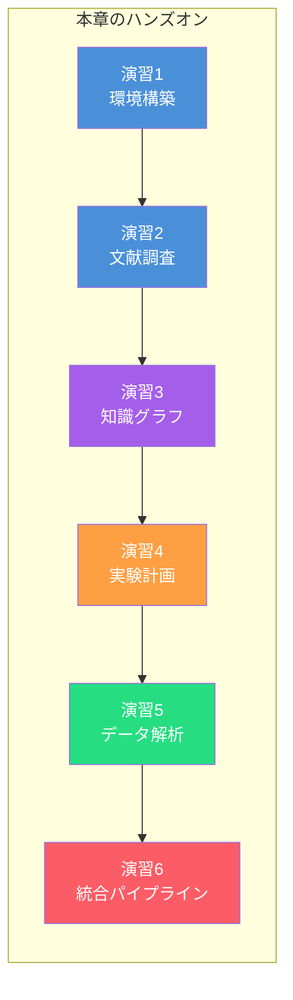
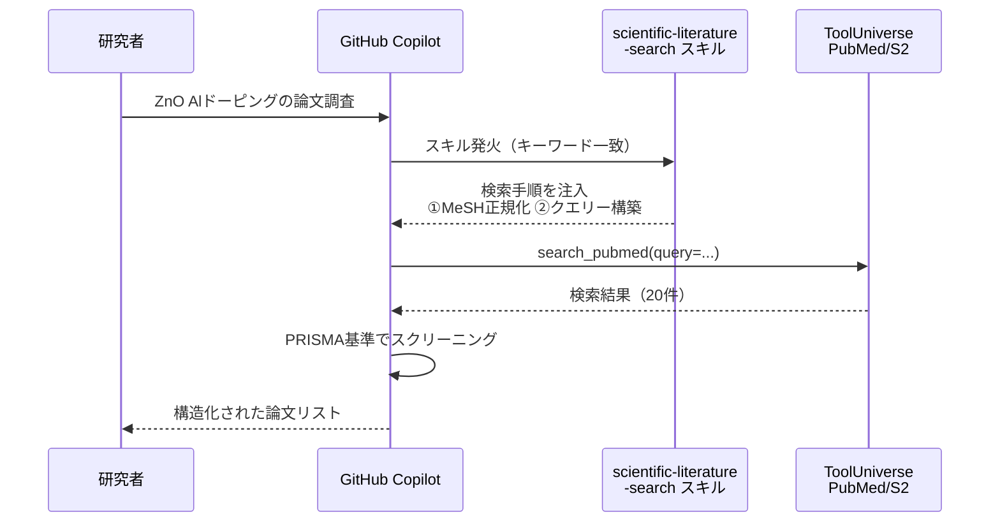
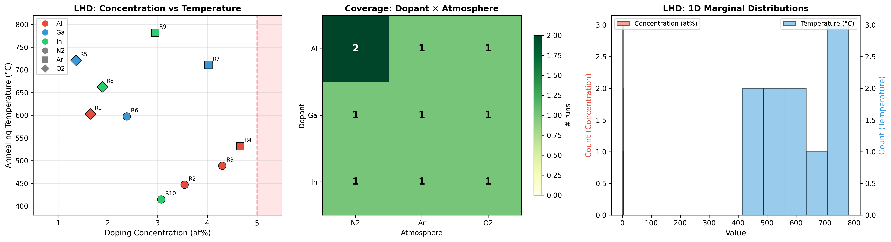
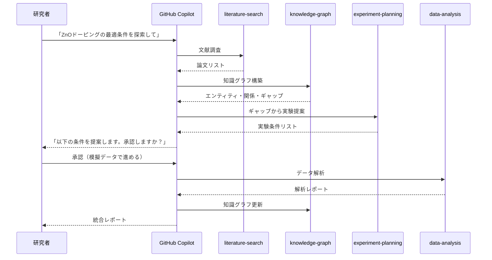
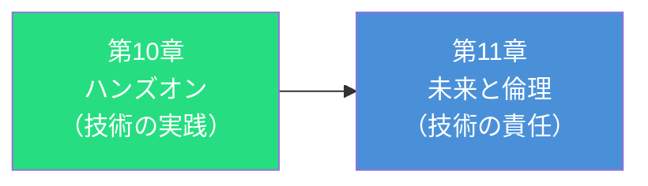

第4章から第9章にかけて、文献調査・知識グラフ構築・実験計画・データ解析・Self-Driving Laboratory・マルチエージェント・パイプラインの設計を学んできました。本章では、これらの知識を**手を動かして体験**します。

SATORI + GitHub Copilot（Agent Mode）+ ToolUniverseを使い、**ZnOドーピング最適化**のシナリオで科学研究エージェントを段階的に構築します。すべてのハンズオンは、読者のローカル環境で再現できるように設計しています。



:::message
**前提条件**

- Python 3.11以上がインストールされていること
- Node.js 20以上がインストールされていること
- VS CodeにGitHub Copilot拡張機能がインストール済みであること
- GitHub Copilotのサブスクリプション（Agent Modeが利用可能なプラン）
- Gitの基本操作ができること
- **Windowsの場合**: WSL（Windows Subsystem for Linux）上に環境を構築してください。VS Codeの「Remote - WSL」拡張機能を使い、WSL内のディレクトリーで作業します
:::

## 演習1: 環境構築 — SATORI + ToolUniverse のセットアップ

### 1-1. プロジェクトの作成

まず、ハンズオン用のプロジェクトディレクトリーを作成します。

```bash
mkdir ai4science-handson && cd ai4science-handson
git init
```

### 1-2. SATORIのインストール

SATORIの190スキルをプロジェクトに導入します。第2章で学んだとおり、スキルは`.github/skills/`ディレクトリーにMarkdownファイルとして配置されます。

```bash
npx @nahisaho/satori init
```

このコマンドにより、以下のディレクトリー構成が生成されます。各スキルは`.github/skills/`直下にフラットに配置されます。

```
ai4science-handson/
├── .github/
│   └── skills/
│       ├── scientific-literature-search/
│       │   └── SKILL.md
│       ├── scientific-statistical-testing/
│       │   └── SKILL.md
│       ├── scientific-eda-correlation/
│       │   └── SKILL.md
│       ├── scientific-deep-research/
│       │   └── SKILL.md
│       └── ... (全190スキル)
```

インストールが完了したら、スキル数を確認しましょう。

```bash
ls .github/skills | wc -l
# → 190
```

### 1-3. ToolUniverse MCPサーバーの設定

ToolUniverseのMCPサーバーをGitHub Copilotに接続します。VS Codeの設定ファイル（`.vscode/settings.json`）に以下を追加します[^3]。

```json
{
  "github.copilot.chat.mcpServers": {
    "tooluniverse": {
      "command": "uvx",
      "args": ["--refresh", "tooluniverse"],
      "env": {
        "PYTHONIOENCODING": "utf-8",
        "NCBI_API_KEY": "${env:NCBI_API_KEY}",
        "SEMANTIC_SCHOLAR_API_KEY": "${env:SEMANTIC_SCHOLAR_API_KEY}"
      }
    }
  }
}
```

:::message
**APIキーの取得**

ToolUniverseの多くのツールはAPIキーなしでも動作しますが、PubMedやSemantic Scholarの検索でレート制限を緩和するために、以下のAPIキーの取得を推奨します。

| 環境変数 | 取得先 | 効果 |
| ---- | ---- | ---- |
| `NCBI_API_KEY` | [NCBI](https://www.ncbi.nlm.nih.gov/account/) | PubMed検索が3→10リクエスト/秒に向上 |
| `SEMANTIC_SCHOLAR_API_KEY` | [Semantic Scholar](https://www.semanticscholar.org/product/api) | 文献検索が1→100リクエスト/秒に向上 |

```bash
export NCBI_API_KEY="your-ncbi-key"
export SEMANTIC_SCHOLAR_API_KEY="your-s2-key"
```

詳細は[ToolUniverse公式ドキュメント](https://zitniklab.hms.harvard.edu/ToolUniverse/guide/api_keys.html)を参照してください。
:::

### 1-4. Python環境の準備

ハンズオンで使用するPythonライブラリーをインストールします。

```bash
python -m venv .venv
source .venv/bin/activate

pip install numpy pandas scipy matplotlib seaborn
pip install botorch ax-platform  # ベイズ最適化（演習4で使用）
pip install neo4j chromadb      # 知識グラフ（演習3で使用）
```

### 1-5. 動作確認

VS CodeでプロジェクトフォルダーをGitHub Copilot Agent Modeで開き、以下のプロンプトを入力して動作確認します。

```
@workspace SATORIのスキル一覧から、統計検定に関連するスキルを教えて
```

GitHub Copilotが`.github/skills/`配下のスキルを検出し、`scientific-statistical-testing`や`scientific-bayesian-statistics`などのスキル名と概要を返せば、セットアップ完了です。

:::message
**トラブルシューティング**

スキルが検出されない場合は以下を確認してください。
1. `.github/skills/`ディレクトリーがプロジェクトルートに存在するか
2. VS CodeのGitHub Copilot拡張機能が最新バージョンか
3. Agent Modeが有効になっているか（Copilot Chatパネルの設定を確認）
:::

## 演習2: 文献調査エージェントを動かす

第4章で学んだ文献調査エージェントの動作を体験します。SATORIの`scientific-literature-search`スキルとToolUniverseのPubMed連携を使い、ZnOドーピングに関する論文を調査します。

### 2-1. 文献調査の実行

GitHub Copilot Agent Modeで以下のプロンプトを入力します。

```
ZnO薄膜へのAlドーピングがバンドギャップと導電性に与える影響について、
最新の論文を調査してください。
検索条件:
- データベース: PubMed, Semantic Scholar
- 期間: 2022年以降
- 対象: 実験論文（レビューを除く）
- 最大件数: 20件
```

このプロンプトにより、SATORIの`scientific-literature-search`スキルが発火し、以下のステップが自動実行されます。



### 2-2. 検索結果の確認

エージェントが返す結果には、第4章で解説した以下の要素が含まれます。

| 要素 | 内容 |
| ---- | ---- |
| 検索クエリー | MeSH正規化済みのクエリー文字列 |
| 検索日時 | 再現性のためのタイムスタンプ |
| ヒット件数 | 各データベースからのヒット数 |
| スクリーニング結果 | 包含/除外の判定と理由 |
| エビデンステーブル | 各論文の主要データポイント |

実際にこのプロンプトを実行すると、以下のような結果が得られます（2025年3月時点の実行例）。

**検索結果サマリー**

| データベース | 総ヒット | 取得件数 |
| ---- | ---- | ---- |
| PubMed | 51件 | 20件 |
| Semantic Scholar | 1,179件 | 20件 |
| 統合（重複除去後） | — | 39件 |

**PubMed主要論文（2022–2025、レビュー除外）**

| # | 年 | タイトル | ジャーナル |
| ---- | ---- | ---- | ---- |
| P1 | 2023 | Polycrystalline Transparent Al-Doped ZnO Thin Films for Photosensitivity and Optoelectronic Applications | Nanomaterials |
| P7 | 2022 | Investigation on Transparent, Conductive ZnO:Al Films Deposited by ALD | Nanomaterials |
| P8 | 2023 | Effect of Al Incorporation on Structural and Optical Properties of Sol-Gel AZO Thin Films | Materials |
| P12 | 2025 | Transparent Al-Doped ZnO Thin Films for High-Sensitivity NO₂ sensing | Sensors |
| P13 | 2025 | UV-A-transparent Al-doped ZnO thin film electrodes by pulsed laser deposition | iScience |

**Semantic Scholar主要論文（被引用数順）**

| # | 年 | 被引用 | タイトル | ジャーナル |
| ---- | ---- | ---- | ---- | ---- |
| S6 | 2022 | 15 | UV-irradiated sol-gel spin coated AZO thin films: enhanced optoelectronic properties | Heliyon |
| S4 | 2023 | 7 | Structural, surface topography, optical behaviors of Al-doped ZnO with annealing (RF sputtering) | J. Mater. Sci.: Mater. Electron. |
| S1 | 2024 | 4 | Photovoltaic performance in CIGS solar cells with Mg- and Al-doped ZnO TCO | J. Mater. Sci.: Mater. Electron. |
| S17 | 2025 | 3 | Correlation between electrical conductivity and band gap of F-doped ZnO thin films | J. Mater. Sci.: Mater. Electron. |

**主な知見の傾向**

- **成膜手法の多様化**: ALD（原子層堆積）、RFスパッタリング、ソルゲル法、PLD（パルスレーザー堆積）など多様な手法でAZO薄膜が作製されている
- **バンドギャップへの影響**: Al濃度増加に伴うバーンシュタインモスシフトによるバンドギャップの拡大が報告される一方、過剰ドーピングでの劣化も指摘
- **導電性向上**: Al置換によるキャリア濃度の増大で抵抗率が低減。ポスト処理（アニーリング）温度の最適化が重要
- **応用先の拡大**: 太陽電池TCO（透明導電膜）、ガスセンサー（NO₂）、UV透過電極、光電子デバイス

:::message
**実行結果は毎回異なります**

上記は執筆時点の実行例です。検索時期やデータベースの更新状況により、ヒット件数や論文リストは変わります。再現性のためにタイムスタンプとクエリーを必ず記録してください。
:::

### 2-3. 検索結果をファイルに保存

結果をプロジェクト内に保存して、次の演習で使えるようにします。

```
検索結果をresearch/literature-search-results.mdとして保存してください。
検索クエリー、検索日時、各データベースのヒット件数、
スクリーニング結果を含めてください。
```

```
research/
└── literature-search-results.md  # 文献調査結果
```

:::message
**再現性の確認ポイント**

保存されたファイルに以下が記録されていることを確認してください。これは第1章の原則1「再現性の保証」の実践です。

- 検索クエリーの全文
- 検索実行日時
- 使用したデータベースとフィルター条件
- 各論文のDOI
:::

## 演習3: 知識グラフを構築する

第5章で学んだGraphRAGの考え方を使い、演習2で収集した論文情報から知識グラフを構築します。

### 3-1. エンティティの抽出

GitHub Copilot Agent Modeで以下のプロンプトを入力します。

```
research/literature-search-results.mdの論文データから、
エンティティ型定義（COMPOUND, METHOD, METRIC, FINDING, STUDY）に
従ってエンティティを抽出し、関係（CAUSES, CORRELATES_WITH, DOPED_WITH, 
REPORTS, MEASURES）を特定してください。
結果をJSON形式で出力してください。
```

SATORIの`scientific-knowledge-graph`スキルが発火し、LLMがテキストからエンティティと関係を抽出します。

### 3-2. 抽出結果の確認

エージェントが出力するJSONは、5種類のエンティティ型と5種類の関係型で構成されます。実際に演習2の文献データ（28本）を入力した結果、以下の規模のグラフが得られました。

| 項目 | 件数 | 内訳 |
|-----|-----:|------|
| エンティティ | 60 | COMPOUND 12 · METHOD 9 · METRIC 10 · FINDING 12 · STUDY 17 |
| 関係 | 64 | DOPED_WITH 5 · REPORTS 20 · MEASURES 21 · CAUSES 10 · CORRELATES_WITH 8 |

出力JSONの代表的なエンティティを抜粋します。

```json
{
  "entities": {
    "compounds": [
      {"id": "C001", "type": "COMPOUND", "name": "ZnO",
       "aliases": ["zinc oxide", "酸化亜鉛"], "category": "host_material"},
      {"id": "C002", "type": "COMPOUND", "name": "Al (Aluminum)",
       "aliases": ["aluminium", "アルミニウム"], "category": "dopant"},
      {"id": "C003", "type": "COMPOUND", "name": "AZO (Al-doped ZnO)",
       "aliases": ["Al:ZnO", "ZnO:Al"], "category": "doped_material"}
    ],
    "methods": [
      {"id": "M001", "type": "METHOD", "name": "RF Magnetron Sputtering",
       "category": "physical_vapor_deposition"},
      {"id": "M002", "type": "METHOD", "name": "Atomic Layer Deposition (ALD)",
       "category": "chemical_vapor_deposition"},
      {"id": "M003", "type": "METHOD", "name": "Sol-Gel Spin Coating",
       "category": "solution_process"}
    ],
    "metrics": [
      {"id": "MT001", "type": "METRIC", "name": "Band Gap",
       "unit": "eV", "typical_range": "3.3–3.6 eV"},
      {"id": "MT002", "type": "METRIC", "name": "Resistivity",
       "unit": "Ω·cm", "typical_range": "10⁻⁴–10⁻² Ω·cm"},
      {"id": "MT005", "type": "METRIC", "name": "Al Doping Concentration",
       "unit": "at%", "typical_range": "1–5 at%"}
    ],
    "findings": [
      {"id": "F001", "type": "FINDING",
       "name": "Burstein-Moss Band Gap Widening",
       "description": "Al濃度増加に伴いバーンシュタインモスシフトによりバンドギャップが3.37→3.55eVへ拡大",
       "confidence": "high"},
      {"id": "F003", "type": "FINDING",
       "name": "Excess Doping Degradation",
       "description": "Al>5at%でバンドテーリング効果により結晶性劣化・バンドギャップ再低下",
       "confidence": "medium"}
    ]
  },
  "relationships": [
    {"type": "DOPED_WITH", "source": "C001", "target": "C002",
     "label": "ZnO is doped with Al to form AZO"},
    {"type": "CAUSES", "source": "C002", "target": "F001",
     "mechanism": "Al³⁺ substitution raises Fermi level → Burstein-Moss shift"},
    {"type": "CORRELATES_WITH", "source": "MT005", "target": "MT001",
     "correlation": "positive",
     "description": "Al濃度↑ → バンドギャップ↑ (1-5at%の範囲)"},
    {"type": "CORRELATES_WITH", "source": "MT005", "target": "MT002",
     "correlation": "negative",
     "description": "Al濃度↑ → 抵抗率↓ (適正範囲内)"},
    {"type": "REPORTS", "source": "ST01", "target": "F001",
     "label": "P1 reports BM shift band gap widening (1-5 at%)"},
    {"type": "MEASURES", "source": "ST01", "target": "MT001",
     "value": "3.37–3.55 eV"}
  ]
}
```

:::message
**完全な抽出結果**

全60エンティティ・64関係のJSONは`research/knowledge_graph_entities.json`に自動保存されます。ここでは代表的なノードと関係のみを掲載しています。
:::

抽出されたCORRELATES_WITH関係は、実験計画で重要な手がかりになります。

| 関係 | 方向 | 意味 |
|-----|------|------|
| Al濃度 → バンドギャップ | 正の相関 | Al濃度を上げるとバーンシュタインモスシフトでバンドギャップが拡大 |
| Al濃度 → 抵抗率 | 負の相関 | 適正範囲ではキャリア濃度増大により抵抗率が低下 |
| アニーリング温度 → 結晶子サイズ | 正の相関 | 温度上昇で結晶成長が促進 |
| アニーリング温度 → 抵抗率 | U字型 | 〜500°Cで最小化し、それ以上では再上昇 |

### 3-3. Neo4jへの登録（オプション）

ローカルでNeo4jが動作している場合は、抽出したエンティティと関係をグラフデータベースに登録できます。

```
抽出したエンティティと関係をNeo4jに登録するCypherクエリーを生成してください。
接続先: bolt://localhost:7687
```

エージェントが生成するCypherクエリーの例です。60エンティティ・64関係のうち代表的なものを示します。

```cypher
// 化合物エンティティの登録
CREATE (zno:COMPOUND {id: "C001", name: "ZnO", category: "host_material"})
CREATE (al:COMPOUND {id: "C002", name: "Al", category: "dopant"})
CREATE (azo:COMPOUND {id: "C003", name: "AZO", category: "doped_material"})

// 成膜手法の登録
CREATE (sput:METHOD {id: "M001", name: "RF Magnetron Sputtering"})
CREATE (ald:METHOD {id: "M002", name: "Atomic Layer Deposition"})
CREATE (anneal:METHOD {id: "M006", name: "Thermal Annealing"})

// メトリクスの登録
CREATE (bg:METRIC {id: "MT001", name: "Band Gap",
        unit: "eV", typical_range: "3.3-3.6"})
CREATE (res:METRIC {id: "MT002", name: "Resistivity",
        unit: "Ω·cm", typical_range: "1e-4 to 1e-2"})
CREATE (alc:METRIC {id: "MT005", name: "Al Doping Concentration",
        unit: "at%", typical_range: "1-5"})

// 知見の登録
CREATE (f1:FINDING {id: "F001", name: "Burstein-Moss Band Gap Widening",
        confidence: "high"})
CREATE (f3:FINDING {id: "F003", name: "Excess Doping Degradation",
        confidence: "medium"})

// 関係の登録
CREATE (zno)-[:DOPED_WITH]->(al)
CREATE (al)-[:CAUSES {mechanism: "Fermi level rise → BM shift"}]->(f1)
CREATE (al)-[:CAUSES {mechanism: "Excess Al → grain boundary segregation"}]->(f3)
CREATE (alc)-[:CORRELATES_WITH {direction: "positive"}]->(bg)
CREATE (alc)-[:CORRELATES_WITH {direction: "negative"}]->(res)
CREATE (anneal)-[:CAUSES {mechanism: "crystallization & defect repair"}]->(f4)
```

:::message
**Neo4jなしでも学べます**

Neo4jのインストールは必須ではありません。エンティティと関係のJSON出力を確認するだけでも、GraphRAGの概念（第5章で解説したエンティティ型・関係型の設計）を体験できます。
:::

### 3-4. ギャップ分析

知識グラフから「まだ試していない組み合わせ」を検出します。

```
research/knowledge_graph_entities.jsonの知識グラフデータを使い、
以下の手順でギャップ分析を実行してください。

1. ドーピング元素×成膜手法のマトリクスを作成し、
   DOPED_WITH関係とMETHOD関係の組み合わせで
   論文報告が存在しないセル（未探索の組み合わせ）を特定する

2. ドーピング元素×物性メトリクスのマトリクスを作成し、
   MEASURES関係が存在しない組み合わせ（未測定の物性）を特定する

3. CORRELATES_WITH関係が定義されているが、
   裏付けるSTUDYノードが2本未満の相関（エビデンス不足）をリスト化する

4. 上記の未探索・未測定・エビデンス不足の組み合わせから、
   次に優先して実験すべき条件を3件提案し、理由を付記する

出力形式:
- 未探索マトリクス（表形式、✓=報告あり / ✗=未探索）
- 優先実験候補リスト（条件・理由・期待される知見）
```

エージェントはグラフ上の**不在**を検出し、次の実験候補を提案します。実際の実行結果を以下に示します。

**ドーピング元素 × 成膜手法マトリクス**

| ドーパント | RF Sputtering | ALD | Sol-Gel | PLD | DC Sputtering |
| ---- | ---- | ---- | ---- | ---- | ---- |
| Al | ✓ (6) | ✓ (3) | ✓ (3) | ✓ (1) | ✓ (1) |
| Ni | ✓ (1) | ✗ | ✗ | ✗ | ✗ |
| Mg | ✓ (1) | ✗ | ✗ | ✗ | ✗ |
| F | ✗ | ✗ | ✓ (1) | ✗ | ✗ |
| Gd | ✗ | ✗ | ✗ | ✗ | ✗ |

Alは全手法で報告がありますが、Ni・Mg・F・Gdは大半が空白です（未探索17件）。

**ドーピング元素 × 物性メトリクスマトリクス**

| ドーパント | Band Gap | Resistivity | Carrier Conc. | Transmittance | Crystallite | Mobility | Photosens. |
| ---- | ---- | ---- | ---- | ---- | ---- | ---- | ---- |
| Al | ✓ (6) | ✓ (6) | ✗ | ✓ (2) | ✗ | ✗ | ✓ (1) |
| Ni | ✗ | ✗ | ✗ | ✗ | ✗ | ✗ | ✗ |
| Mg | ✗ | ✗ | ✗ | ✗ | ✗ | ✗ | ✗ |
| F | ✗ | ✗ | ✗ | ✗ | ✗ | ✗ | ✗ |
| Gd | ✗ | ✗ | ✗ | ✗ | ✗ | ✗ | ✗ |

Alですら Carrier Concentration・Crystallite Size・Hall Mobility が欠落しており、未測定は31件に上ります。

**エビデンス不足の相関**

CORRELATES_WITH関係として定義されているが、裏付けるSTUDYのMEASURES関係が不足している相関を検出しました。

| 相関 | 方向 | 裏付け | 状態 |
| ---- | ---- | ---- | ---- |
| Al濃度 ↔ Band Gap | positive | 5本 | ✓ 十分 |
| Al濃度 ↔ Resistivity | negative | 4本 | ✓ 十分 |
| Al濃度 ↔ Carrier Conc. | positive | 0本 | ⚠ 不足 |
| Band Gap ↔ Resistivity | complex | 4本 | ✓ 十分 |
| Annealing Temp ↔ Crystallite Size | positive | 0本 | ⚠ 不足 |
| Annealing Temp ↔ Resistivity | U字型 | 0本 | ⚠ 不足 |
| Transmittance ↔ Band Gap | related | 0本 | ⚠ 不足 |
| Carrier Conc. ↔ Hall Mobility | complex | 0本 | ⚠ 不足 |

8件中5件がエビデンス不足です。知識グラフに関係は定義されていますが、実測データで裏付けられていません。

**優先実験候補 Top 3**

| 順位 | 実験条件 | ギャップ種別 | 期待される知見 |
| ---- | ---- | ---- | ---- |
| 1 | Mg × ALD → BG, Resistivity, Carrier Conc. | 未探索手法 + 未測定物性 | Mg-AZOのALD成長条件最適化、Al-dopedとのバンドギャップシフト直接比較 |
| 2 | Al × PLD → Carrier Conc., Hall Mobility | 未測定物性 + エビデンス不足相関 | PLD-AZOのキャリア-移動度トレードオフ定量化、TCO設計指針への寄与 |
| 3 | F × DC Sputtering → BG, Resistivity, Transmittance | 未探索手法 + 未測定物性 | アニオン置換（F⁻→O²⁻）のDCスパッタでの挙動、カチオン置換（Al³⁺）との系統比較 |

:::message
**ギャップ分析の完全な結果**

全マトリクスと詳細な分析結果は`research/gap_analysis.json`に保存されます。ここでは代表的な結果のみを掲載しています。
:::

このギャップ分析の結果が、次の演習4（実験計画）の入力となります。

## 演習4: 実験計画エージェントで次の実験を提案させる

第6章で学んだベイズ最適化と実験計画法を体験します。演習3のギャップ分析結果を入力として、次に試すべき実験条件をエージェントに提案させます。

### 4-1. 探索空間の定義

まず、実験のパラメーター空間を定義します。

```
以下のパラメーター空間でZnOドーピング実験を計画してください。

パラメーター:
- ドーピング元素: Al, Ga, In
- ドーピング濃度: 1〜5 at%（連続値）
- 焼成温度: 400〜800°C（連続値）
- 焼成雰囲気: N₂, Ar, O₂

目的変数:
- 抵抗率（最小化）
- 透過率（最大化）

制約条件:
- In 5at%以上は偏析が発生するため除外（第5章の知識グラフより）
- 初期実験は最大10条件

実験計画法でラテン超方格の初期設計を作成してください。
```

### 4-2. ラテン超方格の初期設計

SATORIの`scientific-doe`スキルが発火し、`scipy.stats.qmc.LatinHypercube`を使ったラテン超方格設計を生成します。エージェントが生成するコード（`doe_lhd_design.py`）の要点を示します。

**パラメーター空間の定義**

```python
param_space = {
    "dopant": {
        "type": "categorical",
        "levels": ["Al", "Ga", "In"],
    },
    "concentration_at_pct": {
        "type": "continuous",
        "bounds": [1.0, 5.0],
        "unit": "at%",
    },
    "annealing_temp_C": {
        "type": "continuous",
        "bounds": [400.0, 800.0],
        "unit": "°C",
    },
    "atmosphere": {
        "type": "categorical",
        "levels": ["N2", "Ar", "O2"],
    },
}
```

**層化割り当て + LHDサンプリング**

カテゴリカル因子（ドーパント3水準 × 雰囲気3水準 = 9組み合わせ）に対して層化割り当てを行い、連続因子（濃度・温度）をラテン超方格で配置します。

```python
from scipy.stats import qmc

# カテゴリカル因子: 全9組み合わせに最低1条件 + 1追加 = 10条件
cat_combos = [(d, a) for d in dopants for a in atmospheres]
run_assignments = list(cat_combos) + [("Al", "N2")]

# 連続次元のLHDサンプリング
sampler = qmc.LatinHypercube(d=2, seed=42)
lhs_samples = sampler.random(n=10)

concentrations = qmc.scale(lhs_samples[:, 0:1], 1.0, 5.0).flatten()
temperatures   = qmc.scale(lhs_samples[:, 1:2], 400.0, 800.0).flatten()
```

**制約の適用と品質評価**

```python
# In ≥ 5at% の条件を 4.5at% に補正
df_design.loc[
    (df_design["dopant"] == "In") &
    (df_design["concentration_at_pct"] >= 5.0),
    "concentration_at_pct"
] = 4.5

# LHD品質指標
disc = qmc.discrepancy(lhs_normalized)  # Discrepancy (C²)
min_dist = np.min(pdist(lhs_normalized)) # 最小ペア距離
```

実際にこのコードを実行すると、以下の10条件が生成されます。

| run | dopant | concentration (at%) | temperature (°C) | atmosphere |
| ---- | ---- | ---- | ---- | ---- |
| 1 | Al | 1.18 | 476.7 | O2 |
| 2 | Al | 1.59 | 637.8 | Ar |
| 3 | Al | 2.60 | 789.2 | N2 |
| 4 | Al | 4.82 | 413.3 | N2 |
| 5 | Ga | 2.08 | 713.1 | O2 |
| 6 | Ga | 3.64 | 551.1 | N2 |
| 7 | Ga | 4.41 | 749.5 | Ar |
| 8 | In | 1.49 | 440.0 | Ar |
| 9 | In | 3.23 | 524.4 | N2 |
| 10 | In | 4.50 | 675.6 | O2 |

**LHD品質指標**

| 指標 | 値 | 意味 |
| ---- | ---- | ---- |
| Discrepancy (C²) | 0.023 | 値が小さいほど空間を均一にカバー |
| 最小ペア距離 | 0.15 | 点同士が近すぎず適切に分散 |

:::message
**生成コードの全文**

エージェントは`doe_lhd_design.py`として完全なコードを生成します。パラメーター空間定義・LHDサンプリング・制約適用・品質評価・可視化・JSON/CSV出力を含む約250行のスクリプトです。可視化結果は`figures/lhd_experimental_design.png`に出力されます。
:::



### 4-3. 模擬データでベイズ最適化を体験

実際の実験装置がなくても、模擬データを使ってベイズ最適化のイテレーションを体験できます。

```
以下の模擬実験データを使って、ベイズ最適化の次の提案を生成してください。
獲得関数はExpected Improvement（EI）を使用してください。

| 条件 | 元素 | 濃度(at%) | 温度(°C) | 抵抗率(Ω·cm) | 透過率(%) |
|------|------|-----------|----------|--------------|----------|
| 1    | Al   | 2.0       | 500      | 6.67e-3      | 85.2     |
| 2    | Al   | 3.0       | 600      | 5.00e-3      | 82.1     |
| 3    | Ga   | 1.5       | 550      | 8.33e-3      | 88.0     |
| 4    | Ga   | 4.0       | 700      | 5.56e-3      | 78.5     |
| 5    | In   | 2.0       | 600      | 6.25e-3      | 84.0     |
```

エージェントはガウス過程（GP）を学習し、EI（Expected Improvement）獲得関数で次の候補点を提案します。実際の実行結果を以下に示します。

**推奨次実験条件**

| 項目 | 値 |
| ---- | ---- |
| 元素 | Al |
| 濃度 | 1.01 at% |
| 焼成温度 | 800°C |
| 予測抵抗率 | 6.535×10⁻³ Ω·cm [5.41×10⁻³, 7.90×10⁻³] |
| 予測透過率 | 85.2% [82.1, 88.3] |
| 複合EI | 0.312 |

**選定理由**: 既存データには「低濃度 × 高温」領域の観測がなく、GPの不確実性が高い未探索領域です。EIは期待値改善と不確実性探索を自動バランスし、この条件が抵抗率・透過率の両目的でもっとも改善見込みが高いと判定しました。

第6章で解説した「探索（exploration）と活用（exploitation）のバランス」が、ここで具体的に観察できます。複合EIは両目的を同時に考慮するため、単目的EIとは異なる候補を選びます。

**参考 — 単目的EI候補との比較**

| 目的 | 条件 | 予測値 | トレードオフ |
| ---- | ---- | ---- | ---- |
| 抵抗率最小化に特化 | Al 3.59at% / 560°C | ρ = 5.15×10⁻³ | 透過率 80.9%に低下 |
| 透過率最大化に特化 | Ga 1.0at% / 480°C | T = 88.1% | 抵抗率 7.87×10⁻³に悪化 |
| **複合EI（推奨）** | **Al 1.01at% / 800°C** | **ρ = 6.54×10⁻³ / T = 85.2%** | **両目的のバランスが最良** |

単目的EIは一方の物性を犠牲にして他方を最適化しますが、複合EIは両目的のパレート改善を狙います。

:::message
**出力ファイル**

エージェントは以下のファイルを自動生成します。
- `results/bayesian_optimization_ei.json` — Top5候補・GP予測・メタデータ
- `figures/bayesian_optimization_ei.png` — GP予測面・EIランドスケープ・候補比較

なお、BoTorchの警告にあるとおり、数値安定性には`LogExpectedImprovement`が推奨されます。次のイテレーション以降で切り替えることも可能です。
:::

### 4-4. 提案の解釈

エージェントの提案には、第6章の設計原則に従い**理由の説明**が付加されます。

```
次の実験提案:
  元素: Al, 濃度: 1.01at%, 温度: 800°C

理由:
  - 複合EI値がもっとも高い候補点（EI = 0.312）
  - 既存5条件に「低濃度 × 高温」の観測がなく、GPの予測不確実性が大きい
  - 不確実性の高い領域を探索することで、
    パラメーター空間の理解を効率的に拡大
  - 予測透過率85.2%は現行最良（条件3: 88.0%）に次ぐ水準を維持
  - In 5at%制約には抵触しない
```

:::message
**Human-in-the-Loopの体験**

この提案を「承認する」「修正する」「却下する」は研究者の判断です。エージェントはあくまで提案を行い、最終的な実験実行の判断は人間が下します。これが第1章の原則3「Human-in-the-Loop」の実践です。
:::

## 演習5: データ解析エージェントで実験結果を解析する

第7章で学んだデータ解析パイプラインを体験します。模擬実験データを使い、前処理・統計解析・異常検知・可視化を一連の流れで実行します。

### 5-1. 模擬実験データの準備

以下の模擬データをCSVとして保存します。

```
data/experiment-results.csvを以下の内容で作成してください。

condition,element,concentration_at_pct,temperature_C,atmosphere,bandgap_eV,resistivity_ohm_cm,transmittance_pct,notes
EXP-001,Al,2.0,500,N2,3.42,6.67e-3,85.2,
EXP-002,Al,3.0,600,N2,3.48,5.00e-3,82.1,
EXP-003,Al,3.0,600,Ar,3.46,5.50e-3,83.5,
EXP-004,Ga,1.5,550,N2,3.40,8.33e-3,88.0,
EXP-005,Ga,4.0,700,N2,3.52,5.56e-3,78.5,
EXP-006,Ga,4.0,700,O2,3.50,6.00e-3,80.2,
EXP-007,In,2.0,600,N2,3.43,6.25e-3,84.0,
EXP-008,In,4.5,650,N2,3.38,7.14e-3,75.3,In偏析の兆候
EXP-009,Al,3.5,650,N2,3.50,4.76e-3,81.0,
EXP-010,Al,1.0,400,N2,3.39,1.00e-2,90.1,
```

### 5-2. データ解析の実行

GitHub Copilot Agent Modeで以下のプロンプトを入力します。

```
data/experiment-results.csvに格納された実験データを解析してください。
以下の解析を実行してください:

1. 基本統計量の算出
2. ドーピング元素ごとのバンドギャップ比較（適切な統計検定を選択）
3. 濃度-抵抗率の相関分析
4. 異常値の検出（EXP-008のIn偏析に注目）
5. ヒートマップ（濃度×温度→抵抗率）の作成
```

SATORIの`scientific-eda-correlation`スキルと`statistical-testing`スキルが連携し、以下のパイプラインが自動実行されます。


### 5-3. 解析結果の確認

実際にこのプロンプトを実行した結果を示します。

**基本統計量**

| 物性 | 平均 ± SD | CV(%) |
| ---- | ---- | ---- |
| 抵抗率 | 6.52×10⁻³ ± 1.62×10⁻³ Ω·cm | 24.8 |
| 透過率 | 82.8 ± 4.4 % | 5.3 |
| バンドギャップ | 3.448 ± 0.051 eV | 1.5 |

元素別ではAl（n=5）がもっとも低い平均抵抗率（6.39×10⁻³）、In（n=2）が最低透過率（79.7%）でした。

**統計検定の自動選択**

第7章で解説した統計検定の選択フローが実際に機能します。エージェントの出力に以下の判断過程が含まれます。

| ステップ | 検定 | 結果 | 判断 |
| ---- | ---- | ---- | ---- |
| サンプルサイズ確認 | — | n=10（小標本） | ノンパラメトリック検定を優先 |
| バンドギャップ比較 | Kruskal-Wallis | H=2.29, p=0.319 | 元素間で有意差なし |
| 効果量 | rank-biserial r | Al vs In: r=−0.60, Ga vs In: r=−0.67 | 効果量は大。サンプル増加で有意になる可能性 |
| 濃度-抵抗率相関 | Pearson | r=−0.640, p=0.046 | 有意な負の線形相関（濃度↑→抵抗率↓） |
| Al限定相関 | Spearman | ρₛ=−0.975, p=0.005 | 非常に強い負の単調関係 |

この判断過程は、第2章で解説した「スキルがLLMに科学的判断基準を注入する」メカニズムの実例です。`scientific-statistical-testing`スキルの`SKILL.md`に記述された選択ルールが、GitHub Copilotの推論に影響を与えています。

**異常値検出 — EXP-008の科学的判断**

| 手法 | EXP-008の結果 | 判定 |
| ---- | ---- | ---- |
| IQR法 | 範囲内（EXP-010が温度・抵抗率で外れ値） | 統計的外れ値には非該当 |
| Mahalanobis距離 | 2.83（閾値3.33未満） | 非該当だが10条件中2番目に大きい |
| z-score | 透過率 z=−1.71（最低75.3%）、BG z=−1.34（最低3.38 eV） | もっとも偏位が大きい |

第7章で強調したとおり、エージェントは異常値を機械的に除外するのではなく、**物理的な意味を考慮した判断**を返します。

```
異常値判断:
  - 統計的外れ値には該当しない（Mahalanobis距離 < 閾値）
  - しかし In 4.5at% で偏析が始まっており、
    散乱損失・不純物準位形成が確認される
  - 実験ノートの「In偏析の兆候」と整合する
  
  → 推奨: 除外ではなく「偏析フラグ付き」で保持。
    この知見はネガティブデータとして知識グラフに登録し、
    制約条件CON001（In高濃度域の除外）の妥当性を裏付ける根拠とする
```

:::message
**出力ファイル**

エージェントは以下のファイルを自動生成します。
- `figures/experiment_analysis.png` — 6パネル可視化（箱ひげ図・散布図・相関行列・ヒートマップ・Mahalanobis距離・トレードオフ）
- `results/experiment_analysis.json` — 全解析結果の構造化データ
:::

### 5-4. 解析レポートの生成

エージェントに解析レポートを生成させます。

```
解析結果を構造化されたレポートとして
reports/analysis-report-exp001-010.mdに出力してください。
```

出力されるレポートには、第7章で定義した以下のセクションが含まれます。

- 実験条件の要約
- 基本統計量
- 統計検定の結果と判断根拠
- 異常値の検出と対応方針
- 主要プロットへの参照
- 知識グラフへの登録内容
- 次のイテレーションへの推奨事項

実際に生成されたレポートは[reports/analysis-report-exp001-010.md](analysis-report-exp001-010.md)を参照してください。

## 演習6: 統合パイプライン — エージェント間連携を体験する

最後に、演習2〜5で個別に動かしたエージェントを連携させ、第9章で学んだマルチエージェント・パイプラインの簡易版を体験します。

### 6-1. パイプラインの全体像



### 6-2. ワンショット実行

GitHub Copilot Agent Modeで以下の統合プロンプトを入力します。

```
ZnO薄膜のドーピング最適化プロジェクトを実行してください。

Step 1: 文献調査
  - Al/Ga/InドープZnOの論文を検索（2022年以降、最大10件）
  - エビデンステーブルを作成

Step 2: 知識グラフ構築
  - 文献からエンティティと関係を抽出
  - ギャップ分析で未探索の条件を特定

Step 3: 実験計画
  - ギャップを埋めるための実験条件を5件提案
  - ラテン超方格で初期設計

Step 4: データ解析（模擬データ使用）
  - data/experiment-results.csvの解析
  - 統計検定と異常検知

Step 5: 統合レポート
  - 全ステップの結果をreports/integrated-report.mdに出力

各ステップの完了時に進捗を報告してください。
```

このプロンプトにより、GitHub Copilotは**5つのSATORIスキルを順番に発火**させながら、一連の研究ワークフローを自律的に実行します。

### 6-3. スキル発火の確認

パイプライン実行中に、GitHub Copilotがどのスキルを、どの順序で発火させたかを確認します。

| ステップ | 発火するスキル | 呼び出すツール |
| ---- | ---- | ---- |
| 文献調査 | `scientific-literature-search` | ToolUniverse PubMed/S2 |
| 知識グラフ | `scientific-knowledge-graph` | Neo4j（オプション） |
| 実験計画 | `scientific-doe` | scipy, BoTorch |
| データ解析 | `scientific-eda-correlation`, `statistical-testing` | scipy, pandas |
| レポート | `academic-writing` | — |

第2章で学んだ「スキル発火メカニズム」が、ここで一気通貫で機能していることを確認できます。

### 6-4. 研究サイクルを回す

統合レポートの「次のイテレーションへの推奨事項」に基づいて、2回目のサイクルを実行してみましょう。

```
統合レポートの推奨事項に基づき、次のイテレーションを実行してください。
- 前回の結果を知識グラフに反映済みとして扱う
- In高濃度域（4.5at%以上）は制約条件として除外
- Al 3-4at%, 600-700°Cの近傍を重点的に探索
```

2回目のイテレーションでは、1回目の結果がベイズ最適化の観測データとして反映され、**より精度の高い提案**が生成されます。これが第6章で解説した「実験→解析→知識更新→次の実験」のサイクルです。

## 自分の研究テーマへの応用

ハンズオンが完了したら、ZnOドーピングのシナリオを自分の研究テーマに置き換えてみましょう。

### カスタムスキルの作成

第3章で学んだスキル作成の手順に従い、自分の研究分野に特化したスキルを作成します。

```
.github/skills/my-research/
└── my-domain-analysis/
    └── SKILL.md
```

`SKILL.md`のテンプレートは以下のとおりです。

```yaml
---
name: my-domain-analysis
description: |
  [あなたの研究分野]に特化したデータ解析スキル。
  [研究手法]を適用し、[対象データ]から知見を抽出する。
tu_tools:
  - key: [必要なToolUniverseツール]
    name: [ツール名]
    description: [用途]
---

# [あなたのスキル名]

## When to Use
- [このスキルが発火すべき状況を記述]
- [キーワードや文脈条件を明記]

## Phase 1: [最初のステップ]
- [手順を記述]

## Phase 2: [次のステップ]
- [手順を記述]

## 参照スキル
- ← [入力元のスキル]
- → [出力先のスキル]
```

:::message
**スキル設計のチェックリスト**

第3章の5つの問いを使って、スキルとツールの切り分けが正しいか確認しましょう。

- [ ] 外部通信が必要な機能は`tu_tools`に分離しているか？
- [ ] ドメイン知識（判断基準・手順）はSKILL.mdのMarkdown部分に記述しているか？
- [ ] `When to Use`セクションに適切な発火キーワードを設定しているか？
- [ ] `参照スキル`で前後のスキル連携を定義しているか？
- [ ] LLMに暗算させる箇所はないか？（計算はライブラリーかツールに委ねる）
:::

### ライフサイエンス分野への適用例

材料科学以外にも、本書のフレームワークはさまざまな分野に適用できます。たとえば、第4章と第9章で例示した腸内細菌叢×2型糖尿病（T2DM）のシナリオでは、以下のように読み替えます。

| ZnOドーピング（本章） | 腸内細菌叢×T2DM |
| ---- | ---- |
| ドーピング元素（Al/Ga/In） | 介入方法（プロバイオティクス/プレバイオティクス/食事制限） |
| 濃度・温度 | 投与量・期間 |
| 抵抗率・透過率 | α多様性・HbA1c |
| スパッタリング条件 | 投与プロトコル |
| Materials Project | PubMed, UniProt |

検索対象のデータベースやエンティティ型が変わるだけで、**スキル発火→知識グラフ構築→ベイズ最適化→データ解析**のパイプライン構造はそのまま適用できます。

## 第11章への橋渡し — 技術の先にある問い

本章では、SATORI + GitHub Copilot + ToolUniverseで科学研究エージェントを**手を動かして構築**しました。文献調査からデータ解析まで、一連の研究ワークフローをエージェントが自律的に実行し、研究者はHuman-in-the-Loopとして意思決定に集中できることを体験しました。

しかし、エージェントが強力になるほど、新たな問いが生まれます。

- エージェントが生成した仮説は、誰の知的財産か？
- エージェントが見落とした論文があった場合、責任はどこにあるか？
- 完全自律実験（SDL）の結果を論文に記載する際、著者性はどう扱うべきか？
- エージェントによるデータ解析のバイアスをどう検出し、是正するか？



次章「AI科学エージェントの未来と倫理」では、これらの問いに向き合い、責任あるAIエージェントの運用指針を議論します。

## 本章のまとめ

| トピック | 要点 |
| ---- | ---- |
| 環境構築 | SATORI（`npx @nahisaho/satori init`）+ ToolUniverse MCPサーバー + Python環境 |
| 文献調査 | `scientific-literature-search`スキル → ToolUniverse PubMed/S2 → 構造化結果 |
| 知識グラフ | エンティティ抽出 → 関係特定 → Neo4j登録（オプション） → ギャップ分析 |
| 実験計画 | ラテン超方格（初期設計） → ベイズ最適化（BoTorch） → 理由付き提案 |
| データ解析 | 前処理 → 統計検定（自動選択） → 異常検知 → 可視化 → レポート |
| 統合パイプライン | 5スキルの連鎖発火 → 研究サイクルのイテレーション |
| 応用 | ZnOから自分の研究テーマへ — スキル作成テンプレートを活用 |
| 設計原則 | 再現性（検索ログ）、ドメイン知識注入（SKILL.md）、Human-in-the-Loop（承認フロー） |

[^1]: ToolUniverse: https://zitniklab.hms.harvard.edu/ToolUniverse/ — ハーバード大学Zitnikラボが開発した1,000+の科学ツールを提供するMCPサーバー。
[^2]: BoTorch: https://botorch.org/ — Meta AIが開発したPyTorchベースのベイズ最適化ライブラリー。
[^3]: ToolUniverseのMCPサーバー設定の詳細は公式ドキュメント https://zitniklab.hms.harvard.edu/ToolUniverse/guide/building_ai_scientists/index.html を参照。`uvx`はPythonパッケージランナー（`pip install uv`でインストール）。
