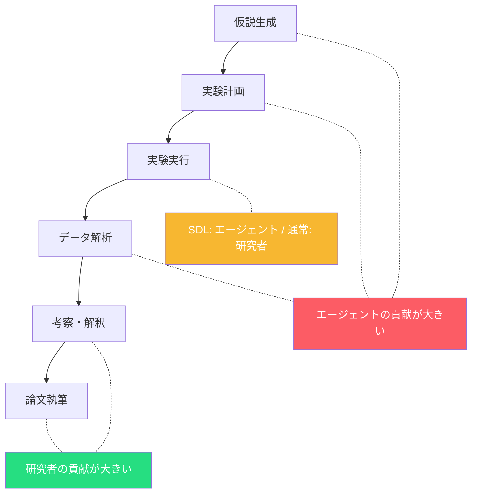
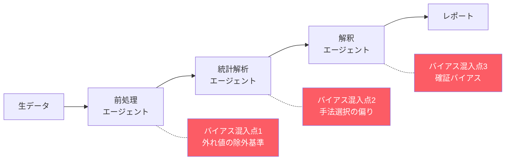
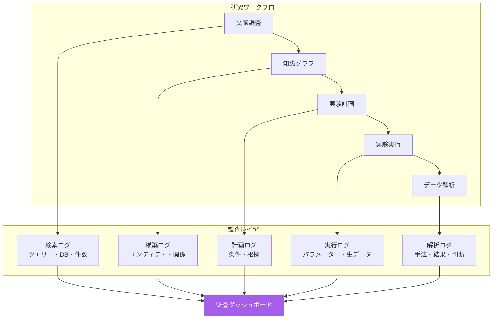
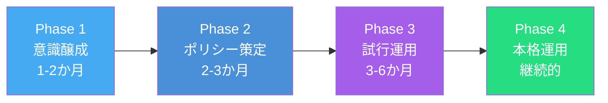
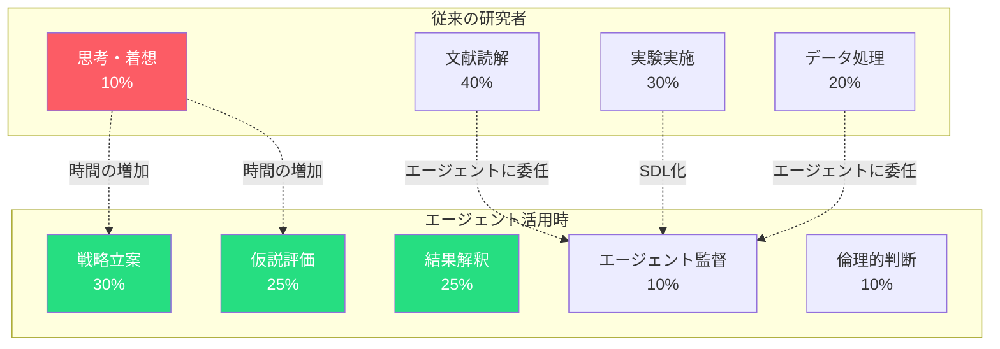
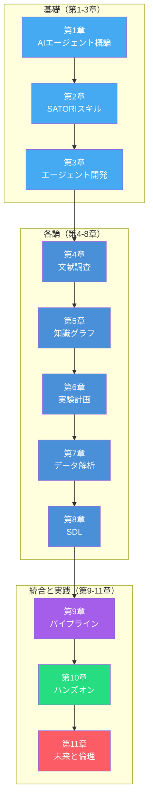

第10章のハンズオンでは、SATORI + GitHub Copilot + ToolUniverseで科学研究エージェントを構築し、文献調査からデータ解析までのワークフローを体験しました。

エージェントが強力になるほど、技術的な問いの先にある**倫理的・社会的な問い**が重要になります。本章では、第10章の末尾で提起した4つの問い — 知的財産、責任の所在、著者性、バイアス — に正面から向き合い、**責任あるAIエージェントの運用指針**を議論します。

## AIエージェントがもたらす倫理的課題

### 知的財産と発明者性

エージェントが網羅的な文献調査と知識グラフ分析から新たな仮説を生成した場合、その仮説は**誰の知的財産**でしょうか。

主要な法域では、発明者は原則として自然人（人間）であると解釈されています。*Thaler v. Vidal*事件（2022年）ではAIシステム「DABUS」を発明者とした出願が退けられ、米国の最高裁も上告を受理しませんでした[^1]。

しかし、AI for Scienceの文脈では状況はより複雑です。

| シナリオ | 現状の法的解釈 | 実務上の対応 |
| ---- | ---- | ---- |
| 研究者がエージェントをツールとして使い仮説を精緻化 | 研究者が発明者 | 従来と同様 |
| エージェントが自律的に仮説を生成し研究者が検証のみ | 発明者の特定が困難 | 研究者の創造的貢献の文書化が必要 |
| SDL（Level 4）が仮説生成→実験→検証を完全自律実行 | 法的空白地帯 | 組織としての権利帰属を事前に規定 |

:::message
**実務上のポイント**

エージェントによる仮説生成プロセスでは、**研究者がどの段階でどのような判断・修正をしたか**を記録しておくことが重要です。第1章の原則1「再現性の保証」で求めた操作ログが、知的財産の帰属を証明する根拠にもなります。
:::

### 著者性と貢献の帰属

論文の著者性（authorship）は、研究倫理のもっとも根幹にかかわる問題です。

学術誌・国際会議では、AIを著者として扱わず、利用時の開示を求める方針が広がっています。例としてNatureは、ChatGPT等のAIを著者として認めず、利用した場合の開示を求めています[^2]。

| 区分 | 方針の例 |
| ---- | ---- |
| 学術誌 | AIは著者に含めない。利用範囲をMethods等で開示する |
| 国際会議 | AIツール利用の開示を求める（投稿規定に従う） |

第8章で設計したSDL（Level 3-4）では、実験計画から結果の解析まで自律的に行われるため、**各工程における人間の知的貢献**をどう評価するかが課題になります。



**推奨される対応策**:
1. **AI貢献セクションの設置**: 論文にAIエージェントの使用範囲と貢献を明記するセクションを設ける。
2. **操作ログの保存**: エージェントの全操作ログを補足資料として公開可能な状態で保存する。
3. **判断ポイントの明示**: 研究者が独自の判断をした箇所を明確にする。

### 文献調査の網羅性と責任

第10章のハンズオンで体験したように、エージェントによる文献調査はPubMedやSemantic Scholarなどの**特定のデータベースに依存**します。エージェントが重要な論文を見落とした場合、その責任はどこにあるのでしょうか。

**見落としが起こりうる3つの要因**:

| 要因 | 具体例 | 対策 |
| ---- | ---- | ---- |
| **データベースの網羅性** | プレプリントサーバーにしか掲載されていない論文 | 複数DBの横断検索（第4章のマルチソース戦略） |
| **クエリーの設計** | 同義語や略語がカバーされていない | ドメイン辞書の活用（SATORIスキルによる展開） |
| **言語の偏り** | 非英語論文（日本語、中国語等）の見落とし | 多言語クエリーの設計 |

:::message alert
**エージェントの文献調査は「補助」であり「代替」ではない**

エージェントが生成した文献リストを**最終成果としてそのまま使う**のは危険です。エージェントの出力は「効率的な初期スクリーニング」として位置づけ、研究者自身による確認・補完を必ず行ってください。これは第1章の原則3「Human-in-the-Loop」の直接的な適用です。
:::

### データ解析におけるバイアス

第7章・第10章で構築したデータ解析エージェントは、統計手法の自動選択や異常値検出を実施します。しかし、この自動化にはバイアスの介在リスクがあります。

**科学研究エージェント特有のバイアスリスク**:

1. **手法選択バイアス**: LLMの学習データに頻出する統計手法（t検定、線形回帰など）を過度に優先する傾向。
2. **確証バイアスの増幅**: 仮説に合致するデータを優先的に解釈する可能性。
3. **外れ値の扱い**: 異常値を「ノイズ」として除外するか「発見」として注目するかの判断。
4. **多重検定の問題**: 大量の変数を自動的にテストすることで偶然の有意差を検出してしまう（p-hacking）。



**対策として有効なアプローチ**:

| 対策 | 具体的な実装 | 本書の対応箇所 |
| ---- | ---- | ---- |
| 複数手法の並行実行 | パラメトリック・ノンパラメトリック両方を実施し結果を比較 | 第7章: 統計検定の自動選択 |
| 効果量の報告 | p値だけでなくCohen's d等の効果量を必ず併記 | 第10章: 解析スキル |
| 前登録（Pre-registration） | 解析前に仮説と手法を事前登録 | 新規推奨事項 |
| 感度分析 | パラメーター設定を変化させた場合の結果の安定性を確認 | 新規推奨事項 |

## 責任あるAIエージェントの設計原則

### 第1章の設計原則の倫理的拡張

第1章で定義した4つの設計原則は、技術的な要件であると同時に、倫理的な基盤でもあります。ここでは、各原則を倫理的な観点から拡張します。

| 第1章の原則 | 技術的側面 | 倫理的拡張 |
| ---- | ---- | ---- |
| **原則1: 再現性の保証** | 操作ログの記録 | **知的財産の帰属証明** + **科学的不正の防止** |
| **原則2: ドメイン知識注入** | スキルによる判断基準 | **バイアス低減** + **専門家の責任の明示化** |
| **原則3: Human-in-the-Loop** | 承認フローの設計 | **最終責任の所在の明確化** + **倫理的判断の担保** |
| **原則4: 安全性と制約** | リソース制限・フォールバック | **不可逆操作の倫理的審査** + **社会的影響の考慮** |

### 透明性と説明可能性

科学研究エージェントには、**なぜその判断をしたか**を説明できる設計が求められます。

```yaml
# 推奨: エージェント操作の透明性ログ
agent_decision_log:
  timestamp: "2026-03-10T14:30:00Z"
  action: "statistical_test_selection"
  input:
    sample_size: 15
    normality_test: "Shapiro-Wilk p=0.023"
    groups: 3
  decision: "Kruskal-Wallis検定を選択"
  reasoning:
    - "n=15 < 30: 小サンプル"
    - "Shapiro-Wilk p=0.023 < 0.05: 正規性棄却"
    - "3群比較: ノンパラメトリック検定が適切"
  alternatives_considered:
    - "一元配置ANOVA: 正規性が棄却されたため不採用"
    - "Welch ANOVA: 正規性仮定が必要なため不採用"
  skill_invoked: "scientific-statistical-testing"
  human_override: false
```

このログ形式は、第10章のハンズオンで体験した統計検定の自動選択プロセスを**監査可能な形**で記録するものです。

### 監査可能性のアーキテクチャ

エージェントの全操作を事後的に検証できるアーキテクチャを設計します。



**監査ログに含めるべき5要素**:

| 要素 | 内容 | 目的 |
| ---- | ---- | ---- |
| **What** | 実行した操作と結果 | 再現性の担保 |
| **Why** | 判断の根拠（推論ログ） | 説明可能性 |
| **Who** | 人間の介入ポイントと判断内容 | 責任の帰属 |
| **When** | タイムスタンプ（UTC） | 時系列の追跡 |
| **Which** | 使用したスキル・ツール・バージョン | 依存関係の特定 |

## 研究室レベルのガバナンス

### AIエージェント利用ポリシーの策定

組織やラボ単位で、AIエージェントの利用に関するポリシーを事前に策定しておくことを推奨します。

**ポリシーに含めるべき項目**:

```markdown
# AI科学エージェント利用ポリシー（テンプレート）

## 1. 適用範囲
- 対象: 研究グループ内のすべてのAIエージェント利用
- 対象ツール: GitHub Copilot、SATORI、ToolUniverse

## 2. 利用レベルの定義
| レベル | 用途 | 承認 |
|--------|------|------|
| Level A | 文献検索・要約 | 事前承認不要 |
| Level B | データ解析・統計処理 | PI（研究代表者）への報告 |
| Level C | 仮説生成・実験計画 | PIの事前承認 |
| Level D | SDL自律実験 | PIの承認 + 安全審査 |

## 3. 記録義務
- エージェント操作ログの保存期間: 研究プロジェクト終了後5年
- 論文投稿時: AI利用の開示（Methods or Acknowledgements）

## 4. 品質管理
- エージェント出力の検証: 研究者による確認を必須とする
- 統計解析結果: 独立した手法での検証を推奨
```

### 段階的導入のロードマップ

第8章のSDL成熟度レベル（Level 0-4）の考え方は、倫理ガバナンスの導入にも応用できます。



| フェーズ | 主な活動 | 成果物 |
| ---- | ---- | ---- |
| **Phase 1** | 研究グループ内でのAIエージェント倫理の勉強会 | 課題リストの作成 |
| **Phase 2** | 利用ポリシーの策定、操作ログの記録ルール整備 | ポリシー文書 |
| **Phase 3** | 限定プロジェクトでの試行、課題の洗い出し | 運用レポート |
| **Phase 4** | ポリシーの改訂と全プロジェクトへの展開 | 継続的な改善サイクル |

### AIエージェント利用の倫理チェックリスト

論文投稿前やプロジェクト完了時に確認すべきチェックリストです。

**研究計画段階**:
- [ ] エージェントの利用範囲を事前に定義したか
- [ ] データの取り扱いに関するポリシーを確認したか
- [ ] 関連する学術誌のAI利用ガイドラインを確認したか

**研究実施段階**:
- [ ] エージェントの全操作ログを保存しているか
- [ ] 研究者による判断ポイントを記録しているか
- [ ] 文献調査結果を研究者自身で確認・補完したか
- [ ] 統計解析結果を独立した手法で検証したか

**論文投稿段階**:
- [ ] AI利用をMethodsまたはAcknowledgementsに明記したか
- [ ] エージェントの操作ログを補足資料として添付可能か
- [ ] 投稿先のAI利用ポリシーに準拠しているか
- [ ] エージェントが生成した図表にその旨を注記したか

## AI for Scienceの未来展望

### 技術的な進化の方向性

本書で構築したSATORI + ToolUniverseのアーキテクチャは、AI for Scienceの「現在地」を反映しています。今後5年間で、以下の進化が見込まれます。

| 領域 | 現在（2025-2026年） | 今後（2027-2030年） |
| ---- | ---- | ---- |
| **マルチモーダル統合** | テキスト中心の論文解析 | 画像（SEM/TEM）・スペクトル・動画の統合解析 |
| **エージェント間協調** | 単一エージェント or 固定パイプライン | 動的なタスク分配と交渉（A2Aプロトコル） |
| **シミュレーション統合** | 実験後のデータフィット | DFT・MDシミュレーションとの双方向連携 |
| **科学基盤モデル** | 汎用LLM + ドメインスキル | 科学専用基盤モデル（分子・材料・生命科学） |
| **ハードウェア統合** | ソフトウェア中心（Level 1-2） | 装置制御の標準化（Level 3-4の普及） |

:::message
**科学基盤モデルとSATORIの関係**

科学専用の基盤モデルが登場しても、SATORIのようなエージェントスキルの重要性は変わりません。基盤モデルが「広く深い科学的知識」を提供するのに対し、エージェントスキルは**特定の研究室や研究プロジェクトに特化した判断基準とワークフロー**を提供します。汎用知識とローカル知識の組合せこそが、実践的なエージェントの要です。
:::

### 研究スタイルの変革

AIエージェントの普及は、研究者の役割そのものを変えていきます。



この変革で重要なのは、**研究者の価値がなくなるのではなく、価値の重心が移動する**ということです。定型作業をエージェントに委ねることで、研究者には以下の能力がいっそう求められます。

- **問いを立てる力**: 何を調べるべきかを定義する能力
- **批判的評価**: エージェントの出力を科学的に検証する能力
- **統合的解釈**: 複数の結果を統合し、新たな知見を導く能力
- **倫理的判断**: 研究の社会的影響を評価する能力

### 博士課程・若手研究者への指針

AIエージェントの台頭に対して、若手研究者はどのように向き合うべきでしょうか。

| やるべきこと | やるべきでないこと |
| ---- | ---- |
| エージェントを「強力な研究補助」として活用する | エージェントの出力を無批判に受け入れる |
| ドメイン知識を深め、エージェントの判断を検証できる力をつける | 「AIがあるからドメイン知識は不要」と考える |
| エージェントの設計・カスタマイズのスキルを身につける | エージェントをブラックボックスとして使い続ける |
| 自分の研究分野に特化したスキルを作成・貢献する | 汎用プロンプトだけに頼る |
| 倫理的課題を理解し、責任ある利用を実践する | 倫理的考慮なしに全面的にAI化する |

:::message
**第2章・第3章で学んだスキル設計が武器になる**

本書の第2章（SATORIスキルの構造）と第3章（エージェント開発の基礎）で学んだスキル設計のノウハウは、AI for Scienceの時代にもっとも価値のあるスキルの1つです。自分の研究分野のドメイン知識をエージェントスキルとして体系化し、共有できる研究者は、コミュニティ全体の研究加速に貢献できます。
:::

## 本章のまとめ

| トピック | 要点 |
| ---- | ---- |
| 知的財産 | 発明者は原則として自然人（現行制度）。エージェント貢献の記録が帰属証明の鍵 |
| 著者性 | 多くの学術誌・会議ではAIを著者として扱わず、AI利用の開示とMethods等への記載を求める |
| 文献調査の責任 | エージェントは補助であり代替ではない。Human-in-the-Loopによる確認が必須 |
| バイアス | 手法選択・確証・外れ値・多重検定の4リスク。複数手法の並行実行と効果量報告で対策 |
| 設計原則の拡張 | 第1章の4原則を倫理的に拡張（再現性→帰属証明、Human-in-the-Loop→最終責任） |
| ガバナンス | 利用ポリシーの策定、4フェーズの段階的導入、倫理チェックリスト |
| 未来展望 | マルチモーダル・科学基盤モデル・SDL Level 3-4の普及 |

## 本書全体のまとめ

本書を通じて、AI for Science専用の科学研究AIエージェントの設計と実装を学んできました。



| 章 | テーマ | 核心 |
| ---- | ---- | ---- |
| 序論 | AI for Scienceの背景 | 国家戦略としてのAIエージェント開発 |
| 第1章 | AIエージェント概論 | ReAct・MCP・A2A、4つの設計原則 |
| 第2章 | SATORIスキル | 190スキル・パイプラインフロー |
| 第3章 | エージェント開発 | SKILL.mdの設計方法論 |
| 第4章 | 文献調査エージェント | マルチソース検索・構造化・批判的評価 |
| 第5章 | GraphRAG for Science | 知識グラフ構築・ギャップ分析 |
| 第6章 | 実験計画エージェント | DoE・ラテン超方格・ベイズ最適化 |
| 第7章 | データ解析エージェント | 統計検定の自動選択・異常検知 |
| 第8章 | Self-Driving Laboratory | SDL Level 0-4・安全設計 |
| 第9章 | マルチエージェント | ハブ＆スポーク + パイプライン統合 |
| 第10章 | ハンズオン | ZnOドーピング最適化の実践 |
| 第11章 | 未来と倫理 | 知的財産・著者性・バイアス・ガバナンス |

本書の核心は、**エージェントスキル**というアプローチにあります。LLMの汎用的な能力に、研究者のドメイン知識をMarkdownファイルとして注入し、再利用可能・共有可能な形で科学研究エージェントを構築する。このアプローチは、特定のモデルやフレームワークに依存しないため、技術が進化しても本質的な価値を持ち続けます。

AI for Scienceは、科学研究のあり方を根本的に変えつつあります。その変革の中で、**技術を使いこなす力**と**技術の限界と責任を理解する力**の両方を持つ研究者が、次の時代の科学を切り拓いていくでしょう。

本書がその一歩目となれば幸いです。

[^1]: Thaler v. Vidal, 43 F.4th 1207 (Fed. Cir. 2022), cert. denied, 143 S. Ct. 1783 (2023). AIシステム「DABUS」を発明者として記載した特許出願を認めない判決。
[^2]: Nature Editorial. (2023). Tools such as ChatGPT threaten transparent science. *Nature*, 613, 612. https://doi.org/10.1038/d41586-023-00191-1

