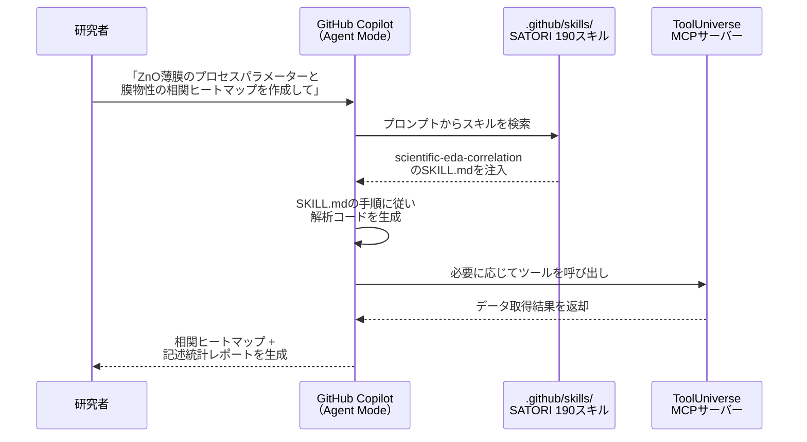
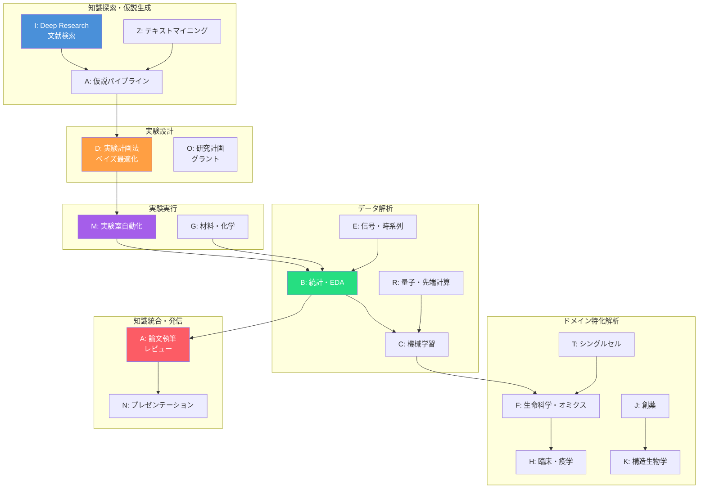
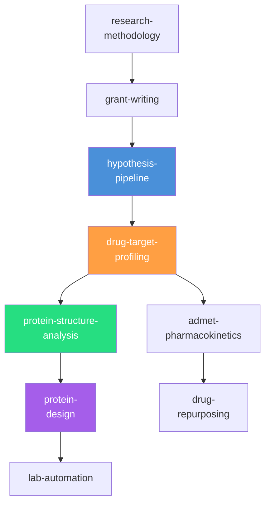
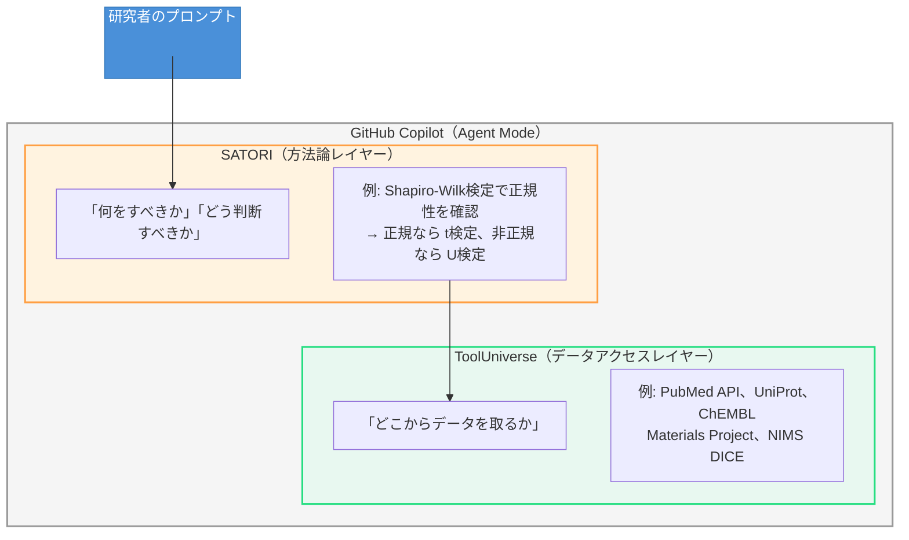

第1章では、AIエージェントの基礎知識としてアーキテクチャ・推論パターン・設計原則を学びました。本章では、GitHub Copilotのエージェントスキルとして動作する**SATORI**の設計思想と構造を詳しく読み解きます。SATORIがどのようにスキルを分類・構造化し、パイプラインとして連携させているかを理解することが、第3章で読者自身のスキルやMCPサーバーを開発するための土台となります。

## エージェントスキルの役割 — なぜLLM単体では不十分なのか

第1章で述べた「原則2: ドメイン知識の明示的な注入」を、SATORIは**Markdown形式の指示ファイル**（SKILL.md）として実現しています。このSKILL.mdの書き方は、[agentskills](https://github.com/agentskills/agentskills)というオープン標準の仕様にしたがっており、GitHub Copilot以外のAIシステムでも利用できる汎用的なフォーマットです[^4]。まず、エージェントスキルがない場合に何が起きるかを確認しましょう。

### LLM単体の限界

LLMは汎用的な推論能力を持ちますが、科学研究の実務では以下のような判断ミスを起こしやすくなります。

| 場面 | LLM単体の判断 | 科学的に正しい判断 |
| ---- | ---- | ---- |
| 統計検定 | 「2群比較なのでt検定を使います」 | 「$n < 30$かつ正規性未確認なのでMann-Whitney U検定を第一候補に」 |
| 実験計画 | 「すべての因子を網羅的に試します」 | 「田口直交表でスクリーニング後、重要因子をベイズ最適化で探索」 |
| 分子解析 | 「SMILESを文字列として処理します」 | 「RDKitで分子オブジェクトに変換し、Lipinski則を計算してから判断」 |
| 文献調査 | 「知識に基づいて回答を生成します」 | 「PubMed APIで最新論文を実際に検索し、エビデンスレベルを評価」 |

エージェントスキルは、これらの「科学的に正しい判断基準」をMarkdownファイルとしてGitHub Copilotに注入します。LLMがプロンプトの文脈を読み取り、該当するスキルを自動的にロードすることで、ドメイン固有の判断力がエージェントに加わります。

### エージェントスキルの動作原理

GitHub Copilotは、プロジェクト内の`.github/skills/`ディレクトリーに配置されたMarkdownファイルを自動的に検出します[^1]。ユーザーがプロンプトを入力すると、Copilotはその内容と各スキルの`description`フィールドや`When to Use`セクションを照合し、もっとも関連性の高いスキルの内容をコンテキストに注入します。



この仕組みにより、研究者は「相関ヒートマップを作成して」と自然言語で指示するだけで、SATORIの標準パイプライン（記述統計→分布可視化→相関行列→散布図行列）に沿った解析が実行されます。

## SATORIの全体像 — 190スキル・26ドメイン

SATORIは、筆者が13の実験プロジェクトで蓄積した解析パターンを体系化した、オープンソースのエージェントスキルコレクションです[^2]。

| 項目 | 値 |
| ---- | ---- |
| スキル総数 | 190 |
| ドメイン数 | 26（A〜Z） |
| ToolUniverse連携スキル数 | 131（全体の69%） |
| テスト数 | 1,359（SKILL.md検証テスト1,335 + CLIユニットテスト24） |
| ライセンス | MIT |
| インストール | `npx @nahisaho/satori init` |

### 名前の由来 — 「悟り」と科学知能

**SATORI（悟り）** は禅仏教における「直観的な覚醒（awakening）」を意味します。段階的な学習（漸悟）ではなく、一瞬にしてすべてを理解する体験です。

この名前には2つの意図が込められています。

第一に、**AIエージェントへの知識注入のメタファー**です。人間の科学者は何年もかけてドメイン知識を蓄積しますが、`npm install @nahisaho/satori`の一行で、AIエージェントは190のスキルを一瞬で「悟る」ことができます。教科書を10年読む代わりに、構造化されたスキルファイルがエージェントに「悟り」を与えるのです。

第二に、**バクロニム（逆頭字語）としての設計**です。

> **S**cientific **A**nalysis **T**oolkit for **O**rganized **R**esearch **I**ntelligence
> 「科学分析のための、体系化された研究知能ツールキット」

名前が機能を説明し、機能が名前を体現する — SATORIという名称自体が、このプロジェクトの設計哲学を凝縮しています。

### 26ドメインの俯瞰

SATORIの190スキルは、A〜Zの26ドメインに分類されています。以下の表は、各ドメインの概要とスキル数、代表的なスキル名を示しています。

| ドメイン | 名称 | スキル数 | 代表的なスキル |
| ---- | ---- | ---- | ---- |
| **A** | 基盤・ワークフロー | 17 | pipeline-scaffold, academic-writing, hypothesis-pipeline |
| **B** | 統計・探索的解析 | 11 | eda-correlation, hypothesis-testing, dimensionality-reduction |
| **C** | 機械学習・モデリング | 11 | ml-regression, ml-classification, active-learning |
| **D** | 実験計画・プロセス最適化 | 3 | doe, bayesian-statistics |
| **E** | 信号・スペクトル・時系列 | 5 | spectral-analysis, time-series-decomposition |
| **F** | 生命科学・オミクス | 28 | bioinformatics, multi-omics, proteomics-mass-spectrometry |
| **G** | 化学・材料・イメージング | 9 | cheminformatics, materials-characterization, computational-materials |
| **H** | 臨床・疫学・メタ科学 | 7 | survival-analysis, causal-inference, meta-analysis |
| **I** | Deep Research・文献検索 | 4 | deep-research, literature-search |
| **J** | 創薬・ファーマコロジー | 9 | drug-target-profiling, admet-pharmacokinetics |
| **K** | 構造生物学・タンパク質工学 | 7 | protein-structure-analysis, protein-design |
| **L** | 精密医療・臨床意思決定 | 6 | variant-interpretation, clinical-decision-support |
| **M** | 実験室自動化・データ管理 | 3 | lab-automation, lab-data-management |
| **N** | 科学プレゼンテーション | 4 | presentation-design, poster-design |
| **O** | 研究計画・グラント | 3 | grant-writing, research-methodology |
| **P** | ファーマコビジランス | 4 | pharmacovigilance, pharmacogenomics |
| **Q** | 腫瘍学・疾患研究 | 10 | precision-oncology, cancer-genomics |
| **R** | 量子・先端計算 | 11 | quantum-computing, bayesian-statistics, deep-learning |
| **S** | 医用イメージング | 2 | medical-imaging |
| **T** | シングルセル・空間オミクス | 13 | single-cell-genomics, spatial-transcriptomics |
| **U** | 免疫・感染症 | 2 | immunoinformatics, infectious-disease |
| **V** | マイクロバイオーム・環境 | 9 | microbiome-metagenomics, environmental-ecology |
| **W** | システム生物学 | 4 | systems-biology, metabolic-modeling |
| **X** | 疫学・公衆衛生 | 3 | epidemiology-public-health |
| **Y** | 集団遺伝学 | 2 | population-genetics |
| **Z** | 科学テキストマイニング | 3 | text-mining-nlp, knowledge-graph |

:::message
スキル名にはすべて`scientific-`プレフィックスが付きます（例: `scientific-eda-correlation`）。本文中では可読性のためにプレフィックスを省略して記載しています。
:::

### 科学的発見サイクルとドメインの対応

序論で示した「仮説生成→実験設計→実験実行→データ解析→知識更新」のサイクルと、SATORIの26ドメインがどう対応するかを図示します。



## SKILL.mdの構造 — スキルはどう書かれているか

SATORIのスキルを読者自身で拡張したり、新しいスキルを作成するためには、SKILL.mdファイルの構造を理解することが不可欠です。すべてのスキルは**YAMLフロントマター + Markdown本文**という共通フォーマットに従います。このフォーマットはSATORI独自のものではなく、agentskills仕様として標準化されたものです。agentskillsはさまざまなAIシステムで共通利用できるオープン標準であり、特定のプラットフォームにロックインされません。

### YAMLフロントマター

各SKILL.mdファイルの先頭には、スキルのメタデータがYAML形式で記述されています。

```yaml
---
name: scientific-eda-correlation
description: |
  探索的データ解析（EDA）と相関分析スキル。
  「相関ヒートマップ」「EDA」「記述統計」「散布図行列」で発火。
tu_tools:
  - key: starrydata2
    name: StarryData2
    description: 公開論文中の実測値データベース
---
```

| フィールド | 説明 |
| ---- | ---- |
| `name` | スキル識別子。`scientific-`プレフィックス + ドメイン固有の名前 |
| `description` | スキルの説明文。**発火トリガーとなるキーワード**を日本語・英語で明記する |
| `tu_tools` | ToolUniverse MCPサーバー経由で利用する外部ツールの一覧 |

`description`フィールドに発火キーワードを含めることで、GitHub Copilotがプロンプトの内容とスキルを自動的に照合します。「相関ヒートマップを作成して」と入力すると、`「相関ヒートマップ」`というキーワードに一致するこのスキルがロードされる仕組みです。

### Markdown本文の標準セクション

SKILL.mdの本文は、以下の標準セクションで構成されます。

| セクション | 役割 | 記述内容 |
| ---- | ---- | ---- |
| `# タイトル` | スキルの名称と概要 | 一文で何をするスキルかを明示 |
| `## When to Use` | 発火条件 | このスキルが使われるべき具体的な状況を列挙 |
| `## Quick Start` | 最速の利用例 | 代表的な使い方を1〜2例 |
| `## 標準パイプライン` | ステップバイステップの手順 | Phase 1〜Nの解析手順（Pythonコード付き） |
| `## ToolUniverse 連携` | 外部ツール一覧 | MCP経由で呼び出すツールと用途 |
| `## Output Files` | 出力ファイル定義 | 生成されるファイルのパス・形式 |
| `## 参照スキル` | パイプライン上の前後関係 | 入力元・出力先となるスキル名 |

### 具体例: scientific-eda-correlation

1つの具体的なスキルを通して、SKILL.mdの構造を読み解いてみましょう。

```markdown
# Scientific EDA & Correlation Analysis

探索的データ解析（EDA）のパイプラインスキル。
新しいデータセットの初期解析から相関構造の把握までを体系化。

## When to Use
- 新しいデータセットを受け取ったとき
- 変数間の関係性を把握したいとき
- 相関ヒートマップを作成したいとき

## 標準パイプライン
### Phase 1: 記述統計量の算出
    → pd.describe() + 分布形状指標（歪度・尖度）
### Phase 2: 分布可視化
    → ボックスプロット + バイオリンプロット
### Phase 3: 相関ヒートマップ
    → sns.heatmap（Pearson / Spearman 自動選択）
### Phase 4: 散布図行列
    → sns.pairplot（カテゴリ変数による色分け対応）
### Phase 5: PSPブロック相関
    → Process → Structure → Property の因果構造解析

## Output Files
| ファイル | 形式 |
| ---- | ---- |
| results/descriptive_statistics.csv | CSV |
| figures/correlation_heatmap.png | PNG（300 DPI） |
| figures/pairplot.png | PNG（300 DPI） |
```

注目すべき設計ポイントがいくつかあります。

1. **Phase構造**: 解析を明確なフェーズに分割し、各フェーズの入出力を定義している。これにより、GitHub Copilotは「Phase 3まで実行していったん結果を見せて」といった部分実行にも対応できる
2. **手法の自動選択基準**: Phase 3で「Pearson / Spearman自動選択」と記載されており、データの正規性に応じた手法選択の判断基準がスキル内に埋め込まれている
3. **PSPブロック相関**: Process→Structure→Property（プロセス→構造→物性）という材料科学特有の因果フレームワークが組み込まれており、汎用的なEDAを超えた科学的な解釈を促す

### 具体例: scientific-drug-target-profiling

もう1つ、より複雑なスキルの例を見てみましょう。創薬領域のターゲットプロファイリングスキルです。

```markdown
# Scientific Drug Target Profiling

創薬ターゲットの包括的プロファイリング。
9つの並行リサーチパスでターゲットを多角的に評価。

## When to Use
- 創薬ターゲット候補のドラッガビリティを評価するとき
- ターゲット-疾患アソシエーションの強度を定量化するとき

## Phase 1: Identity Resolution
    → UniProt / Ensembl / ChEMBL ID解決
## Phase 2: Druggability Assessment
    → TDL分類、3軸ドラッガビリティマトリクス
## Phase 3: Safety Profiling
    → pLI / LOEUF / DepMap 安全性チェックリスト
## Phase 4: Disease Association
    → T1-T4 エビデンスグレーディング
## Phase 5: Competitive Landscape
    → パイプラインマッピング

## ToolUniverse 連携
| ツール | MCP呼び出し |
| ---- | ---- |
| UniProt | UniProt_get_entry_by_accession |
| ChEMBL | ChEMBL_get_target |
| OpenTargets | OpenTargets_get_associated_targets_by_disease_efoId |
| DGIdb | DGIdb_get_gene_druggability |

## 参照スキル
| 方向 | スキル |
| ---- | ---- |
| 入力元 | scientific-hypothesis-pipeline |
| 出力先 | scientific-admet-pharmacokinetics |
| 出力先 | scientific-protein-structure-analysis |
```

このスキルが示す重要な設計パターンは以下のとおりです。

1. **ToolUniverse連携の明示**: `tu_tools`フィールドと本文テーブルの両方で、MCP経由で呼び出す外部ツールを具体的に定義している
2. **参照スキルによるパイプライン化**: `hypothesis-pipeline`から入力を受け、`admet-pharmacokinetics`や`protein-structure-analysis`へ出力を渡すことで、スキル間の連鎖が明示されている
3. **エビデンスグレーディング**: Phase 4でT1〜T4のエビデンスレベルを明示的に定義しており、LLMの推測ではなく客観的な基準に基づく評価を強制している

## パイプラインフロー — スキルはどう連携するか

SATORIの真価は、個々のスキルの品質だけでなく、スキル間の**パイプラインフロー**にあります。`参照スキル`セクションで定義された入出力関係により、複数のスキルが研究ワークフロー全体をカバーする連鎖を形成します。

### 学術論文パイプライン（ドメインA）

もっとも基本的なパイプラインは、仮説定義から論文投稿までを一貫してカバーする学術論文パイプラインです。


このパイプラインでは、`hypothesis-pipeline`が定義した仮説に基づいて`pipeline-scaffold`がデータ解析を実行し、その結果を`academic-writing`が論文草稿に変換します。査読コメントを受け取った後は`peer-review-response`が対応草案を生成し、`revision-tracker`が改訂箇所を追跡するという一連の流れが自動化されます。

### 創薬パイプライン（ドメインJ〜K）

より複雑な例として、創薬領域のパイプラインを見てみましょう。



このパイプラインでは、複数のスキルが**分岐と合流**を含む非線形な構造を形成しています。`drug-target-profiling`の出力が`admet-pharmacokinetics`（薬物動態評価）と`protein-structure-analysis`（構造解析）の両方に分岐し、それぞれが独立した解析を進めた後、実験自動化（`lab-automation`）で合流する設計です。

### パイプラインの設計パターン

SATORIのパイプライン設計から抽出できるパターンを整理します。

| パターン | 説明 | 例 |
| ---- | ---- | ---- |
| **線形連鎖** | スキルが順番に実行される | 仮説→解析→執筆→レビュー |
| **分岐** | 1つのスキルの出力が複数のスキルに入力される | ターゲット評価→構造解析 + ADMET |
| **合流** | 複数のスキルの出力が1つのスキルに統合される | オミクス各種→マルチオミクス統合 |
| **ループ** | 結果を評価して再実行する | 査読対応→改訂→再レビュー |

これらのパターンは、第3章でAgent Skillsを自作する際の設計指針として活用できます。

## ToolUniverse連携 — 方法論とデータの二層構造

SATORIの設計で重要な概念は、**方法論レイヤー**（SATORI）と**データアクセスレイヤー**（ToolUniverse）の分離です。



この二層分離には、以下の利点があります。

1. **関心の分離**: 科学的な判断ロジック（SATORI）とデータ取得の実装詳細（ToolUniverse）が分離されているため、一方を変更しても他方に影響しない
2. **再利用性**: 同じ方法論スキル（例: `eda-correlation`）を、異なるデータソース（StarryData2、NIMS DICE、Materials Projectなど）と組み合わせて使える
3. **拡張性**: 新しいデータベースがToolUniverseに追加されれば、既存のSATORIスキルから即座にアクセスできる
4. **テスタビリティー**: 方法論の正しさとデータアクセスの正しさを独立してテストできる

SATORIの190スキルのうち131スキル（69%）がToolUniverse連携を定義しており、1,200以上の科学ツールへのアクセスが可能です。

## スキルの発火メカニズム — 適切なスキルが自動選択される仕組み

研究者がプロンプトを入力してから、適切なスキルがロードされるまでのメカニズムを詳しく見ていきます。

### 3つのマッチング方式

GitHub Copilotは、以下の3つの方式でスキルを選択します。

| 方式 | マッチング対象 | 例 |
| ---- | ---- | ---- |
| **キーワードマッチ** | `description`内の発火キーワード | 「相関ヒートマップ」→ `eda-correlation` |
| **When to Useマッチ** | `## When to Use`セクションの記述 | 「ターゲット候補のドラッガビリティを評価」→ `drug-target-profiling` |
| **コンテキストマッチ** | プロンプト全体の文脈判断 | 「がん遺伝子発現データでRandom ForestとSVMのROC比較」→ `ml-classification` |

### 発火キーワードの設計

SATORIでは、`description`フィールドに日本語・英語の両方でトリガーキーワードを記述するのが慣例です。

```yaml
description: |
  探索的データ解析（EDA）と相関分析スキル。
  「相関ヒートマップ」「EDA」「記述統計」「散布図行列」で発火。
```

この設計により、「相関ヒートマップを作成して」「EDAを実行して」「descriptive statisticsを計算して」のいずれのプロンプトでも同じスキルがロードされます。

### 使用例

```
# 日本語プロンプト → scientific-doe が自動ロード
> 3因子の田口L9直交表を作成して主効果プロットを描画して

# 英語プロンプト → scientific-ml-classification が自動ロード
> Compare Random Forest vs SVM on cancer gene expression data

# 混合プロンプト → scientific-deep-research が自動ロード
> PubMedとarXivから免疫チェックポイント阻害薬の最新レビューを調査して
```

## SATORIのテスト戦略 — 1,359テストの内訳

SATORIでは、すべてのSKILL.mdファイルに対して自動検証テストが実行されます。エージェントスキルは「コード」ではなく「Markdownドキュメント」ですが、構造化された品質管理が適用されています。

| テストカテゴリー | テスト数 | 検証内容 |
| ---- | ---- | ---- |
| SKILL.md検証テスト | 1,335 | YAMLフロントマターの構文、必須セクションの存在、参照スキルの存在確認、ToolUniverse連携先の整合性 |
| CLIユニットテスト | 24 | `satori init`、`satori validate`、`satori pipeline`コマンドの動作検証 |

```bash
# SKILL.md の自動検証
npx @nahisaho/satori validate --verbose

# パイプラインの確認
npx @nahisaho/satori pipeline list
npx @nahisaho/satori pipeline suggest
```

テストでは、たとえば「`参照スキル`セクションで指定されたスキルが実際に存在するか」「`tu_tools`で指定されたToolUniverseツールが有効か」といった関係性の整合性も検証されます。これにより、スキル間の参照が壊れたまま放置されることを防いでいます。

## E2Eテスト — 50パイプラインの実証実験

SKILL.mdの構文検証だけでは、パイプラインが実務で「狙った成果物」まで到達できるかは分かりません。筆者は、SATORIの設計が意図どおりに動作することを確認するため、26ドメインにまたがる代表的な50パイプライン（P-01〜P-50）で、「入力プロンプト→スキル発火→成果物出力」までを通しで実行し、再現可能な形で記録しました[^3]。

:::message
**テスト実施日**: 2026-02-15〜16 / **SATORIバージョン**: v0.28.1
:::

### 総合結果

| 指標 | 値 |
| ---- | ---- |
| テスト対象パイプライン数 | 50 |
| 成功（想定スキルチェーンと完全一致） | **50/50（100%）** |
| 使用されたユニークスキル数 | 118/190（62%） |
| 平均スキルチェーン長 | 7.1スキル |
| 最長スキルチェーン | 10スキル（P-37: 研究ライフサイクル管理） |
| 実行時間（中央値） | 2.3秒 |
| 実行時間（最大） | 50秒（P-46: 感染症アウトブレイク調査） |

### 全50パイプライン一覧

| ID | パイプライン名 | スキル数 | 実行時間 |
| ---- | ---- | ---- | ---- |
| P-01 | 仮説駆動型研究 | 8 | 1.79秒 |
| P-02 | 創薬 | 6 | 1.21秒 |
| P-03 | シングルセル・空間オミクス | 4 | 34.66秒 |
| P-04 | 精密医療 | 6 | 1.01秒 |
| P-05 | ゲノム疫学 | 6 | 3.90秒 |
| P-06 | エビデンス合成 | 6 | 2.22秒 |
| P-07 | 疾患研究 | 6 | 1.22秒 |
| P-08 | 機械学習解析 | 6 | 3.87秒 |
| P-09 | 環境・生態学 | 5 | 1.94秒 |
| P-10 | 計算材料科学 | 5 | 7.43秒 |
| P-11 | 医薬品安全性 | 6 | 2.29秒 |
| P-12 | システム生物学 | 6 | 2.12秒 |
| P-13 | がんゲノミクス | 6 | 1.40秒 |
| P-14 | ゲノム・エピゲノム解析 | 6 | 20.92秒 |
| P-15 | トランスクリプトミクス | 6 | 16.87秒 |
| P-16 | プロテオミクス | 6 | 10.78秒 |
| P-17 | メタボロミクス | 6 | 3.16秒 |
| P-18 | マイクロバイオーム | 6 | 2.57秒 |
| P-19 | パスウェイ解析 | 6 | 15.91秒 |
| P-20 | 化合物スクリーニング | 6 | 4.40秒 |
| P-21 | 臨床情報学 | 6 | 9.77秒 |
| P-22 | 高度機械学習 | 6 | 26.53秒 |
| P-23 | 実験計画 | 6 | 1.91秒 |
| P-24 | 高度可視化 | 6 | 2.44秒 |
| P-25 | 学術出版 | 6 | 1.58秒 |
| P-26 | ラボ自動化 | 6 | 1.08秒 |
| P-27 | ゲノム創薬統合 | 9 | 0.63秒 |
| P-28 | AI臨床意思決定支援 | 8 | 0.76秒 |
| P-29 | 研究自動化 | 8 | 1.08秒 |
| P-30 | マルチオミクス疾患解明 | 7 | 6.38秒 |
| P-31 | 個別化薬物療法 | 7 | 1.09秒 |
| P-32 | バイオインフォマティクス完全 | 8 | 0.92秒 |
| P-33 | がん精密医療E2E | 8 | 1.24秒 |
| P-34 | マルチオミクス縦断解析 | 8 | 5.34秒 |
| P-35 | 環境One Health | 8 | 1.15秒 |
| P-36 | AI材料発見 | 8 | 6.60秒 |
| P-37 | 研究ライフサイクル管理 | 10 | 1.40秒 |
| P-38 | AIエビデンス合成 | 8 | 0.85秒 |
| P-39 | がんマルチレイヤー統合 | 8 | 6.07秒 |
| P-40 | 臨床→規制→出版 | 8 | 0.65秒 |
| P-41 | シングルセル・空間プロテオーム | 8 | 25.47秒 |
| P-42 | 製薬レギュラトリーサイエンス | 7 | 0.68秒 |
| P-43 | 農業バイオテクノロジー | 8 | 1.71秒 |
| P-44 | 臨床検査室（NGSがんパネル） | 8 | 約2秒 |
| P-45 | 食品安全・ニュートリゲノミクス | 8 | 約3秒 |
| P-46 | 法医学・公衆衛生 | 8 | 約50秒 |
| P-47 | ベイズ推論特化 | 7 | 約5秒 |
| P-48 | 因果推論特化 | 7 | 約5秒 |
| P-49 | 時系列予測特化 | 8 | 約15秒 |
| P-50 | テキストマイニング・NLP特化 | 8 | 約5秒 |

### 代表例1: P-01 仮説駆動型研究パイプライン

もっとも基本的なパイプラインとして、仮説定義から論文化までを一貫してカバーするP-01を紹介します。

**プロンプト**:

> 「腸内細菌叢の多様性低下が2型糖尿病の発症リスクを高める」という仮説をPICOフレームワークで構造化し、公開メタゲノムデータ（模擬100サンプル）に対してShannon多様性指数を算出、糖尿病群vs健常群でMann-Whitney U検定を実施し、ROC-AUCで予測性能を評価、結果をIMRaD形式で論文化してください。

**発火したスキルチェーン（8スキル）**:

```
hypothesis-pipeline → pipeline-scaffold → data-preprocessing
→ statistical-testing → ml-classification → publication-figures
→ academic-writing → critical-review
```

**主要結果**: Shannon多様性指数は健常群5.06 ± 0.02に対しT2DM群3.95 ± 0.12と有意に低下（Welch's t-test, $p = 1.46 \times 10^{-51}$）。ロジスティック回帰によるROC-AUC = 1.000。IMRaD形式の論文草稿、Nature品質の4パネルFigure（300 DPI）、批判的レビューチェックリストまでが自動生成されました。

注目すべき点は、プロンプトではMann-Whitney U検定を指定していたにもかかわらず、`statistical-testing`スキルがShapiro-Wilk検定で正規性を確認し、正規分布と判定されたためWelch's t-testを自動選択した点です。これは第1章で述べた「ドメイン知識の注入」が実際に機能している例です。

### 代表例2: P-02 創薬パイプライン

ToolUniverse連携を含む6スキルのパイプラインです。

**プロンプト**:

> JAK2キナーゼを創薬ターゲットとして、UniProt/ChEMBLからターゲットプロファイルを収集し、AlphaFold予測構造の結合ポケットを同定、RDKitで化合物ライブラリのLipinski/PAINSフィルタリングを行い、ドッキングスコアでTop10を選出、ADMET予測を実施して報告してください。

**発火したスキルチェーン（6スキル）**:

```
drug-target-profiling → protein-structure-analysis → cheminformatics
→ molecular-docking → admet-pharmacokinetics → drug-repurposing
```

**主要結果**: JAK2（UniProt: O60674）のドラッガビリティスコア0.95（Tclin）、結合ポケット体積487.3 ų。50化合物中47が有効（3件がSMILES kekulize不能で自動除外）、Lipinski RO5通過率100%、PAINS 2件検出。Top1ヒットはCPD-007（ドッキングスコア $-8.17$ kcal/mol）。

このパイプラインは、本章で紹介した`drug-target-profiling`スキルの`参照スキル`セクションで定義された「分岐と合流」パターンが実際に機能していることを示しています。

### 代表例3: P-37 研究ライフサイクル管理パイプライン

最長の10スキルチェーンで研究の全ライフサイクルをカバーするパイプラインです。

**プロンプト**:

> 「植物ストレス応答のマルチオミクス研究」プロジェクトを想定し、体系的文献レビュー→研究仮説・PICO構造化→DoEベース実験計画→模擬実験データ解析→論文草稿→Supplementary生成→査読応答テンプレート→リビジョントラッカー設定まで、研究の全ライフサイクルを一貫して実行してください。

**発火したスキルチェーン（10スキル）**:

```
systematic-review → hypothesis-pipeline → doe
→ gene-expression-transcriptomics → plant-biology → academic-writing
→ supplementary-generator → peer-review-response → revision-tracker
→ latex-formatter
```

**主要結果**: PRISMA準拠の文献レビュー（200論文から50件採択）、CCD実験計画（2因子11条件×3反復 = 33実験）、135 DEG検出（HSP群のFC = +4.51が最大）、IMRaD論文草稿、Supplementary（3表3図）、査読応答（3レビュアー5コメント全対応）、LaTeX原稿まで一気通貫で自動生成されました。

このパイプラインは、「学術論文パイプライン」セクションで説明した線形連鎖パターンの拡張形であり、文献レビューから出版準備まで10のスキルが途切れることなく連携する設計の正しさを実証しています。

### E2Eテストから得られた知見

50パイプラインの通しテストから、SATORIの設計に関するいくつかの重要な知見が得られました。

**1. スキルチェーンの100%一致**

全50パイプラインで、想定したスキルチェーンと実際に発火したスキルチェーンが完全に一致しました。これは、SKILL.mdの`description`フィールドに埋め込まれた発火キーワードと`When to Use`セクションの記述が、GitHub Copilotのスキル選択アルゴリズムに対して十分な精度を持つことを示しています。

**2. 自動的な手法選択の妥当性**

P-01で観察されたように、`statistical-testing`スキルはプロンプトで指定された手法（Mann-Whitney U検定）をそのまま適用するのではなく、データの正規性検定結果に基づいてWelch's t-testを自動選択しました。このような「プロンプトの指示よりもデータの性質を優先する」判断こそが、エージェントスキルに科学的判断基準を注入する意義です。

**3. クロスドメインパイプラインの安定性**

P-27以降のクロスドメインパイプライン（7〜10スキル）でも100%の成功率が維持されました。たとえばP-39（がんマルチレイヤー統合）は、`cancer-genomics`から`precision-oncology`まで8つの異なるドメインのスキルを横断しており、`参照スキル`で定義されたスキル間接続の堅牢性が確認されました。

**4. 模擬データの限界と実データへの橋渡し**

一方で、模擬データゆえの限界も明確になりました。P-01のROC-AUC = 1.000（完全分離）やP-22のCNN精度1.000は、模擬データのクラス間距離が実データより大きいことに起因します。実データでは、効果量の縮小やクラス間の重なりにより、これらの指標は低下することが予想されます。各パイプラインの備考で、この限界を明示的に記録しています。

[^3]: E2Eテストの完全な結果（50パイプラインの入力プロンプト・出力ファイル一覧・備考を含む）は、SATORIリポジトリーの`docs/e2e-test-results/`で公開しています。

## 読者自身のスキル開発に向けて — 第3章への橋渡し

本章では、SATORIの設計思想と構造を以下の観点から読み解きました。

| 観点 | 本章で学んだこと | 第3章で実践すること |
| ---- | ---- | ---- |
| **スキルの構造** | YAML + Markdownの標準フォーマット、Phase構造、When to Use | 自分の研究ドメインに特化したSKILL.mdの作成 |
| **ドメイン分類** | 26ドメイン・190スキルの全体像と科学的発見サイクルとの対応 | 自分の研究に必要なスキルの特定とギャップ分析 |
| **パイプラインフロー** | 線形連鎖・分岐・合流・ループの4パターン | パイプライン上のスキル連携設計 |
| **ToolUniverse連携** | 方法論レイヤーとデータアクセスレイヤーの分離 | MCPサーバーの構築とスキルからの呼び出し |
| **発火メカニズム** | キーワード・When to Use・コンテキストの3方式 | 効果的な発火キーワードの設計 |
| **テスト戦略** | SKILL.md検証テスト + CLIテスト | 自作スキルの品質保証 |

SATORIは「完成された製品をそのまま使うもの」であると同時に、「エージェントスキル開発の設計パターンを学ぶための教材」でもあります。次章では、この理解をもとにAgent Skillsの自作とMCPサーバーの開発に取り組みます。
[^1]: GitHub Copilot Agent Modeは、`.github/skills/`ディレクトリーのMarkdownファイルをAgent Skillsとして自動検出します。詳細はGitHub Copilotドキュメントを参照してください。
[^2]: SATORIリポジトリー: https://github.com/nahisaho/satori — MITライセンスで公開されています。
[^4]: agentskills仕様: https://github.com/agentskills/agentskills — さまざまなAIシステムで利用できるエージェントスキルのオープン標準です。
