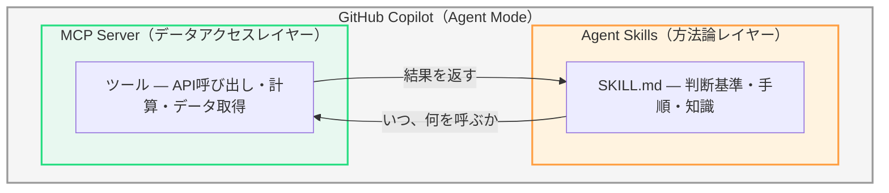
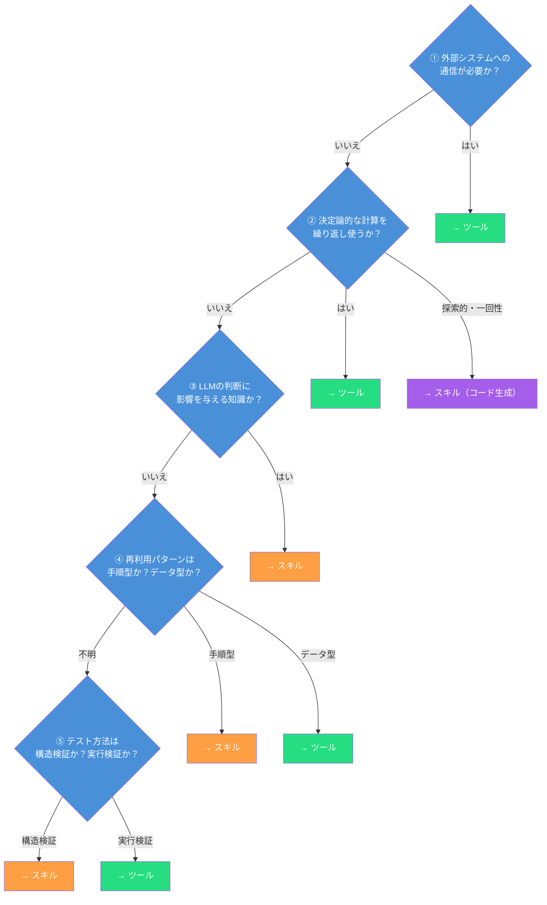
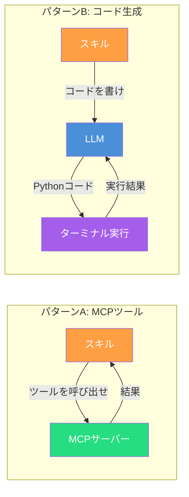

第2章では、SATORIの190スキルがどのように構造化され、パイプラインとして連携するかを学びました。本章では、いよいよ読者自身の手で **エージェントスキル** と **MCPサーバー（ツール）** を開発します。

開発に入る前に、もっとも重要な設計判断があります。ある機能を「スキル」として実装すべきか、それとも「ツール」として実装すべきか — この切り分けを誤ると、保守性が低下し、再利用もテストも困難になります。本章ではまず、この切り分けの原則を確立してから、具体的な開発に進みます。

## スキルとツールの切り分け — 何をどちらで作るべきか

### 二層構造の復習

第2章で示した「方法論レイヤー」と「データアクセスレイヤー」の二層構造を思い出してください。



- **Agent Skills（SKILL.md）**: 「何をすべきか」「どう判断すべきか」を定義する。Markdown形式の指示ファイル
- **MCP Server（ツール）**: 「どうやってデータを取得・加工するか」を実装する。TypeScript/Pythonで書かれた実行可能なサーバー

この二層は相互補完的ですが、それぞれに適した責務があります。

### 判断基準: 5つの問い

ある機能をスキルとツールのどちらで実装すべきかを判断するために、以下の5つの問いを順に確認します。



それぞれの問いを詳しく見ていきましょう。

#### ① 外部システムへの通信が必要か？

もっともシンプルで強力な判断基準です。APIリクエスト、データベースクエリー、ファイルシステム操作など、**外部システムとの通信**が必要な機能は**ツール**として実装します。スキル（SKILL.md）はLLMにコードを生成・実行させることもできますが（後述する「コード生成パターン」）、認証管理やレートリミット、エラーリトライといった通信の信頼性を担保する仕組みはMCPサーバーの責務です。

| 例 | 判定 | 理由 |
| ---- | ---- | ---- |
| PubMedから論文を検索する | **ツール** | PubMed APIへのHTTPリクエストが必要 |
| UniProtからタンパク質情報を取得する | **ツール** | UniProt REST APIへの通信が必要 |
| ローカルCSVファイルを読み込む | **ツール** | ファイルシステムアクセスが必要 |
| 「PubMed検索の前にMeSH用語で検索語を正規化すべき」という知識 | **スキル** | 外部通信不要。LLMの判断を導く知識 |

#### ② 決定論的な計算を繰り返し使うか？

数値計算、データ変換、統計処理など、**決定論的な計算ロジック**が必要で、かつ**複数のスキルから繰り返し呼び出す**場合は、MCPツールとして実装します。一方、探索的な解析や一回性のタスクでは、スキルがLLMにPythonコードを生成させ、scipy・pandasなどのライブラリーに計算を実行させる「コード生成パターン」も有効です（詳細は後述）。

いずれの場合も、**LLMに暗算させることはアンチパターン**です。計算は必ず、ライブラリーかMCPツールに実行させてください。

| 例 | 判定 | 理由 |
| ---- | ---- | ---- |
| Tanimoto類似度を計算する | **ツール**（繰り返し使用） | 分子フィンガープリントの数値計算。多数のスキルから呼ばれる |
| Shannon多様性指数を算出する | **コード生成** or **ツール** | 探索的な場面はコード生成、繰り返し使うならツール化 |
| p値の多重比較補正（Bonferroni）を適用する | **コード生成** or **ツール** | 数値演算。どちらでも実行可能 |
| 「$n < 30$ の場合はノンパラメトリック検定を優先する」というルール | **スキル** | 計算ではなく判断基準 |

#### ③ LLMの判断に影響を与える知識か？

「いつ」「なぜ」「どの順番で」行動すべきかという**判断基準や手順の知識**は、スキルとして実装します。これらの知識はLLMのコンテキストに注入されることで、適切な意思決定を導きます。

| 例 | 判定 | 理由 |
| ---- | ---- | ---- |
| 「相関分析の前に外れ値検出を実行する」という手順 | **スキル** | 解析のワークフロー知識 |
| 「Lipinski RO5違反の化合物は除外する」という判断基準 | **スキル** | 創薬のドメイン知識 |
| 「エビデンスレベルをT1〜T4で分類する」という評価基準 | **スキル** | 体系化された評価フレームワーク |
| Lipinski則の5項目を化合物ごとに計算する | **ツール** | 知識ではなく計算処理 |

#### ④ 再利用パターンは手順型かデータ型か？

再利用の形態も重要な判断材料です。**手順型**（「こういう順番で、この条件分岐で進める」）はスキル、**データ型**（「このAPIからこの形式でデータを取得する」）はツールに適しています。

| 再利用パターン | 判定 | 例 |
| ---- | ---- | ---- |
| 「EDAは必ず記述統計→分布可視化→相関行列→散布図行列の順で」 | **スキル** | 手順の標準化 |
| 「創薬ターゲット評価は9つの観点を並行で実施する」 | **スキル** | 評価フレームワーク |
| 「Materials Project APIのエンドポイントXにパラメーターYを渡す」 | **ツール** | APIアクセスパターン |
| 「PDFをテキストに変換して構造化データを抽出する」 | **ツール** | データ変換パイプライン |

#### ⑤ テスト方法は構造検証か実行検証か？

テストの性質も切り分けの指標になります。**YAMLフロントマターの構文、必須セクションの存在、参照先の整合性**といった構造的な検証が中心ならスキル。**関数の入出力、APIレスポンスの処理、エラーハンドリング**といった実行検証が中心ならツールです。

| テスト対象 | 判定 | テスト内容 |
| ---- | ---- | ---- |
| SKILL.mdの構文とセクション | **スキル** | YAML構文チェック、必須セクション存在確認 |
| 参照スキルの存在確認 | **スキル** | パイプライン整合性検証 |
| 検索APIの応答処理 | **ツール** | 正常系・異常系のレスポンスハンドリング |
| 数値計算の精度 | **ツール** | 期待値との一致検証 |

### 第3の選択肢: スキルによるコード生成パターン

ここまでの説明では、計算処理は「ツール（MCPサーバー）」の責務としてきました。しかし、重要な第3の選択肢があります。**スキルがLLMにコードを書かせ、GitHub Copilotのエージェントモードがそれをターミナルで実行する**パターンです。



SATORIのスキルの多くは、実際にこのパターンBを採用しています。たとえば`scientific-eda-correlation`スキルのPhase 3では次のように記述されています。

```markdown
### Phase 3: 相関ヒートマップ
以下のPythonコードを生成して実行する:

import pandas as pd
import seaborn as sns
from scipy import stats

# Shapiro-Wilk検定で正規性を確認
_, p_value = stats.shapiro(df[column])
# p < 0.05 なら Spearman、そうでなければ Pearson
method = 'spearman' if p_value < 0.05 else 'pearson'
corr_matrix = df.corr(method=method)
sns.heatmap(corr_matrix, annot=True, fmt='.2f')
```

この場合、LLMが「頭の中で」相関係数を計算するのではなく、**scipyやpandasといったライブラリーが決定論的に計算を実行**します。LLMの役割はコードを正しく生成することであり、計算の実行はPythonランタイムが担います。

#### 3つの実行パターンの比較

| | LLMが直接計算 | スキル → コード生成 | MCPツール |
| ---- | ---- | ---- | ---- |
| **計算の正確性** | ❌ 不正確 | ✅ ライブラリーが実行 | ✅ サーバーが実行 |
| **事前準備** | 不要 | ライブラリーのインストール | MCPサーバーの構築・起動 |
| **柔軟性** | — | ✅ あらゆる計算に対応 | △ 事前定義した関数のみ |
| **再現性** | ❌ 毎回結果が異なりうる | △ コードは毎回生成される | ✅ 同一入力で同一出力 |
| **テスタビリティー** | ❌ テスト不可 | △ 生成コードの品質に依存 | ✅ ユニットテスト可能 |
| **エラーハンドリング** | ❌ | △ LLMがエラーを見て修正 | ✅ try/catchで制御 |

#### いつコード生成パターンを選ぶか

**コード生成パターンが適している場面**:
- **探索的な解析**: 事前にどんな計算が必要かわからない場合。EDA（探索的データ解析）はまさにこのケース
- **一回性のタスク**: 繰り返し使わない、その場限りの解析
- **プロトタイピング**: MCPツールとして汎用化する前の試行段階
- **多様な入力**: データの形状やカラム構成が毎回異なり、汎用ツール化が難しい場合

**MCPツールが適している場面**:
- **繰り返し呼び出す処理**: 同じ関数を多くのスキルから共有する場合
- **外部APIアクセス**: 認証・レートリミット・キャッシュなどの管理が必要な場合
- **品質保証が必要**: テスト付きで信頼性を担保すべき基幹処理
- **バージョン管理**: APIの仕様変更に対応する必要がある場合

:::message
**判断基準②の補足**

「計算処理が必要か？」への答えが「はい」の場合、選択肢は2つあります:

1. **MCPツール**: 再利用性が高く、テスト可能で、品質保証ができる。繰り返し使う計算に最適
2. **スキルによるコード生成**: 柔軟で事前準備が少ない。探索的な解析や一回性のタスクに最適

「LLMが頭の中で計算する」は**どちらの場合もアンチパターン**です。計算は必ず、ライブラリーかMCPツールに実行させてください。
:::

#### コード生成パターンの設計指針

スキルでコード生成パターンを採用する場合、以下の点に注意して設計します。

**1. 使用ライブラリーを明示する**

```markdown
<!-- ✅ 良い例: 使用ライブラリーを明示 -->
## 必要なライブラリー
- pandas >= 2.0
- scipy >= 1.11
- seaborn >= 0.13
- scikit-learn >= 1.3
```

ライブラリーを明示することで、LLMが正しいAPIを使ったコードを生成しやすくなり、環境の事前準備も明確になります。

**2. 期待する出力形式を定義する**

```markdown
<!-- ✅ 良い例: 出力形式を定義 -->
## Output Files
| ファイル | 形式 | 内容 |
| ---- | ---- | ---- |
| results/correlation_matrix.csv | CSV | 相関行列（変数×変数） |
| figures/heatmap.png | PNG（300 DPI） | 相関ヒートマップ |
| results/normality_test.json | JSON | 各変数のShapiro-Wilk検定結果 |
```

出力形式を定義しておくことで、生成されたコードの結果が後続のスキルやパイプラインに正しく引き継がれます。

**3. エラー時の対処を記述する**

```markdown
<!-- ✅ 良い例: エラー対処を記述 -->
## エラー対応
- ライブラリーが未インストールの場合: `pip install` で自動インストール
- データ読み込みエラー: ファイルパスとエンコーディングを確認して再試行
- 計算エラー（NaN, Inf）: 該当行を除外し、除外数を報告
```

### 判断フレームワークの適用例

5つの問いを、具体的な科学研究シナリオに適用してみましょう。

#### シナリオ1: 「メタゲノムデータのα多様性解析フロー」

> 研究者のプロンプト: 「このメタゲノムデータのα多様性を解析して」

このタスクには複数の機能が含まれます。それぞれを切り分けます。

| 機能 | ①通信 | ②計算 | ③知識 | 判定 |
| ---- | ---- | ---- | ---- | ---- |
| 「Shannon指数、Simpson指数、Chao1を算出する」 | × | ✓ | | **ツール or コード生成** |
| 「αだけでなくβ多様性も必ずセットで評価する」 | × | × | ✓ | **スキル** |
| 「群間比較にはKruskal-Wallis検定を使う（3群以上の場合）」 | × | × | ✓ | **スキル** |
| 「希薄化曲線（rarefaction curve）を描画する」 | × | ✓ | | **コード生成**（探索的） |
| 「サンプルサイズが不均一な場合、リサンプリングで深度を揃える」 | × | × | ✓ | **スキル** |

**結果**: 解析フローの手順と判断基準は**スキル**、多様性指数の計算と可視化は**ツールまたはコード生成パターン**で実装します。EDAのような探索的場面では、スキルがPythonコード（scikit-bio、scipy）を生成・実行させるパターンが柔軟です。繰り返し使う計算であればMCPツール化を検討します。

#### シナリオ2: 「創薬ターゲットのドラッガビリティ評価」

> 研究者のプロンプト: 「このタンパク質のドラッガビリティを評価して」

| 機能 | ①通信 | ②計算 | ③知識 | 判定 |
| ---- | ---- | ---- | ---- | ---- |
| 「UniProtからタンパク質情報を取得する」 | ✓ | | | **ツール** |
| 「ChEMBLから既知リガンド情報を取得する」 | ✓ | | | **ツール** |
| 「TDL分類（Tclin/Tchem/Tbio/Tdark）で評価する」 | × | × | ✓ | **スキル** |
| 「pLI > 0.9 は安全性リスクフラグとする」 | × | × | ✓ | **スキル** |
| 「9つの評価軸を並行で実施し、総合スコアを算出する」 | × | × | ✓ | **スキル** |
| 「結合ポケットの体積を計算する」 | × | ✓ | | **ツール** or **コード生成** |

**結果**: データ取得と計算は**ツール**、評価フレームワークは**スキル**。第2章で見た`drug-target-profiling`スキルの`tu_tools`セクションとの対応がわかります。

#### シナリオ3: 「材料特性のPSPブロック相関」

> 研究者のプロンプト: 「この薄膜データでProcess→Structure→Propertyの相関を解析して」

| 機能 | ①通信 | ②計算 | ③知識 | 判定 |
| ---- | ---- | ---- | ---- | ---- |
| 「StarryData2から類似組成の既報データを取得する」 | ✓ | | | **ツール** |
| 「Pearson / Spearman相関係数を計算する」 | × | ✓ | | **コード生成**（scipy） |
| 「正規性に応じてPearsonとSpearmanを自動選択する」 | × | × | ✓ | **スキル** |
| 「PSP（Process→Structure→Property）の因果方向に沿って解釈する」 | × | × | ✓ | **スキル** |
| 「相関ヒートマップを300 DPIのPNGで出力する」 | × | ✓ | | **コード生成**（seaborn） |

### 切り分けの原則 — まとめ

| | Agent Skills（SKILL.md） | MCP Server（ツール） |
| ---- | ---- | ---- |
| **本質** | 知識・判断基準・手順の体系 | 実行可能なコード |
| **実装言語** | Markdown（YAML + 本文） | TypeScript / Python |
| **実行主体** | LLMがコンテキストとして読む | サーバープロセスが実行する |
| **責務** | 「何を」「なぜ」「どの順番で」 | 「どうやって」「どこから」 |
| **外部通信** | 不可 | 可（API、DB、ファイルシステム） |
| **計算** | コード生成でライブラリーに実行させる | 決定論的に実行可能 |
| **テスト** | 構造検証（YAML構文、参照整合性） | 実行検証（入出力、エラー処理） |
| **変更頻度** | 手順改善時（比較的低頻度） | API仕様変更時（外部依存） |
| **配置** | `.github/skills/` | MCPサーバーとして起動 |

:::message
**アンチパターン: LLMに暗算させる**

```markdown
<!-- ❌ 悪い例: LLMが「頭の中で」計算することを期待する記述 -->
## Phase 3: 統計検定
Bonferroni補正を適用する。p値に比較回数Nを掛ける。
p_corrected = p_original × N
```

この記述では、LLMが「p値に比較回数を掛ける」という計算を**自らの推論で実行**しようとします。LLMの数値計算は不正確であり、結果が誤る可能性があります。

**✅ 正しいアプローチは2つあります。**

```markdown
<!-- ✅ 方法A: MCPツールに委ねる -->
## Phase 3: 統計検定
多重比較が発生する場合（2つ以上の検定を実施する場合）、
Bonferroni補正を適用する。
→ 補正の計算には statistics_multiple_comparison_correction ツールを使用
```

```markdown
<!-- ✅ 方法B: Pythonコードを生成・実行させる -->
## Phase 3: 統計検定
多重比較が発生する場合、以下のPythonコードを生成して実行する:
from statsmodels.stats.multitest import multipletests
reject, p_corrected, _, _ = multipletests(p_values, method='bonferroni')
```

重要なのは、「いつBonferroni補正を適用すべきか」をスキルが定義し、**実際の計算はMCPツールかライブラリーに実行させる**という点です。LLMに暗算させるのだけがアンチパターンです。
:::

:::message
**アンチパターン: ツールにドメイン判断を埋め込む**

```typescript
// ❌ 悪い例: ツール内で手法選択の判断をハードコードする
function analyzeCorrelation(data: number[][]): string {
  if (data.length < 30) {
    return spearman(data); // サンプルサイズだけで判断している
  }
  return pearson(data);
}
```

この実装は「$n < 30$ ならSpearman」というドメイン知識をツール内に埋め込んでいます。実際には、正規性検定の結果、外れ値の有無、変数間の関係の線形性など、複数の要因を考慮して手法を選択すべきです。

```typescript
// ✅ 良い例: ツールは計算に徹し、手法選択はスキル（LLM）に委ねる
function pearsonCorrelation(x: number[], y: number[]): CorrelationResult { ... }
function spearmanCorrelation(x: number[], y: number[]): CorrelationResult { ... }
function shapiroWilkTest(data: number[]): NormalityResult { ... }
```

ツールは`pearson`、`spearman`、`shapiro-wilk`をそれぞれ独立した関数として提供し、「どの関数をいつ呼ぶか」はスキルが定義する — これが正しい責務分離です。
:::

### グレーゾーンの判断

実際の開発では、スキルとツールのどちらにも分類しにくい機能が出てきます。以下に代表的なグレーゾーンと推奨される判断を示します。

| グレーゾーン | 推奨 | 理由 |
| ---- | ---- | ---- |
| ファイルテンプレート生成（LaTeXの定型文など） | **スキル** | LLMがテンプレートを理解してカスタマイズ生成できる |
| 可視化のスタイル定義（色、フォント、レイアウト） | **スキル** | 判断基準であり、実際の描画はツールが行う |
| バリデーションルール（入力データの妥当性チェック） | **両方** | ルールの定義はスキル、チェックの実行はツール |
| エラーメッセージの出し分け | **ツール** | 実行時の条件分岐はツールの責務 |
| 結果のナラティブ生成（解析結果の文章化） | **スキル** | LLMの言語生成能力を活用する場面 |

**迷ったときの原則**:

> 「LLMのコンテキストに入れて、判断に使える知識か？」→ **スキル**
>
> 「LLMにコードを書かせて、ライブラリーに実行させればよいか？」→ **スキル（コード生成）**
>
> 「信頼性・再利用性・認証管理が必要か？」→ **MCPツール**
