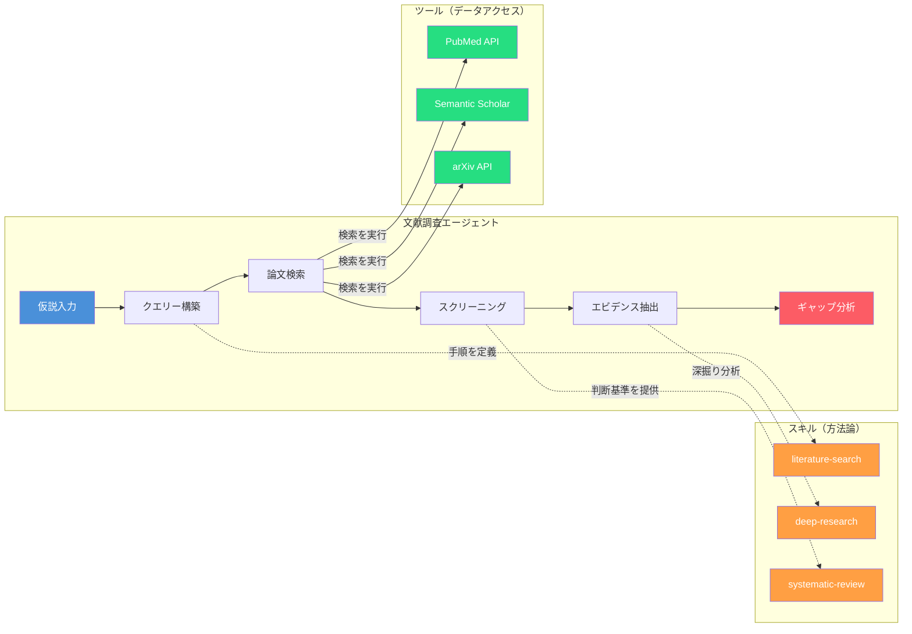
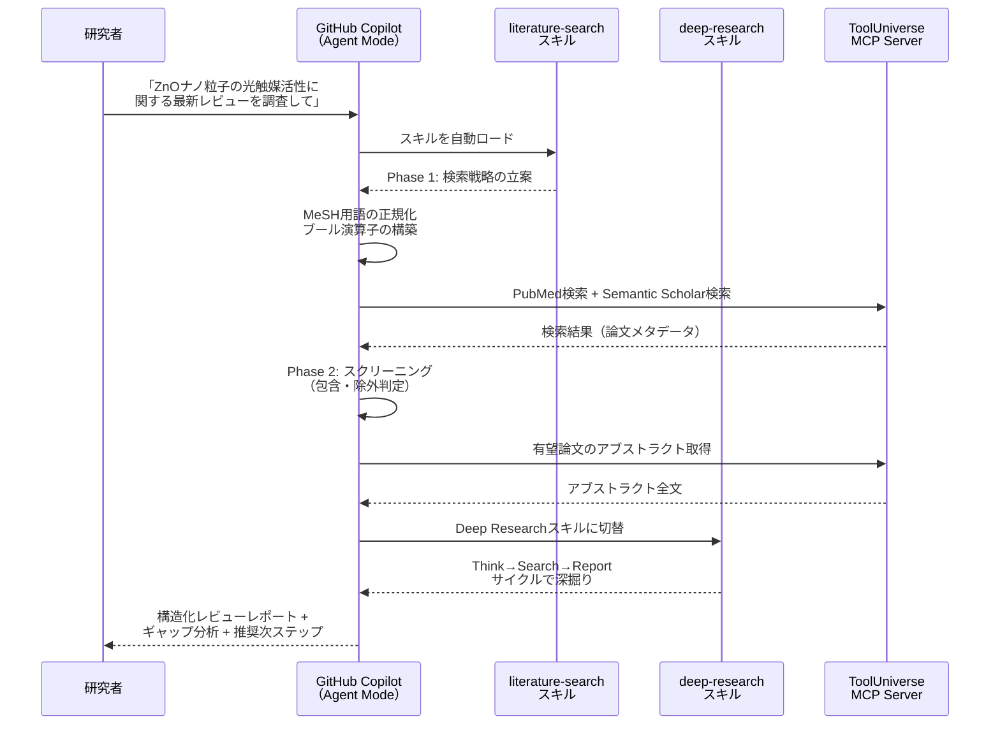
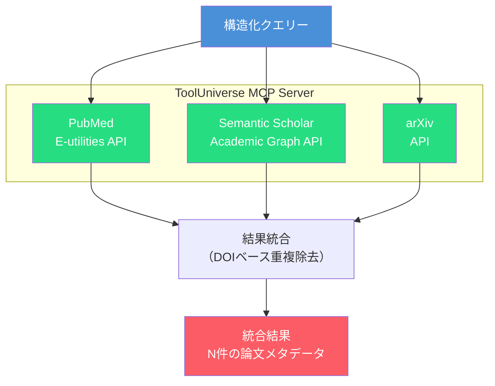
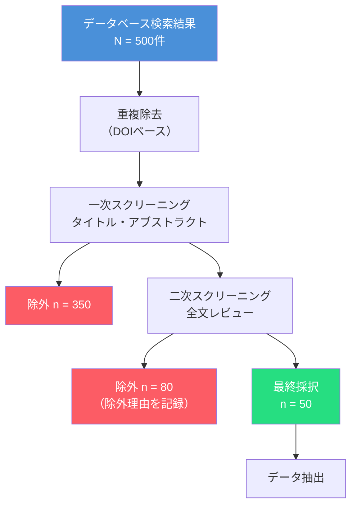
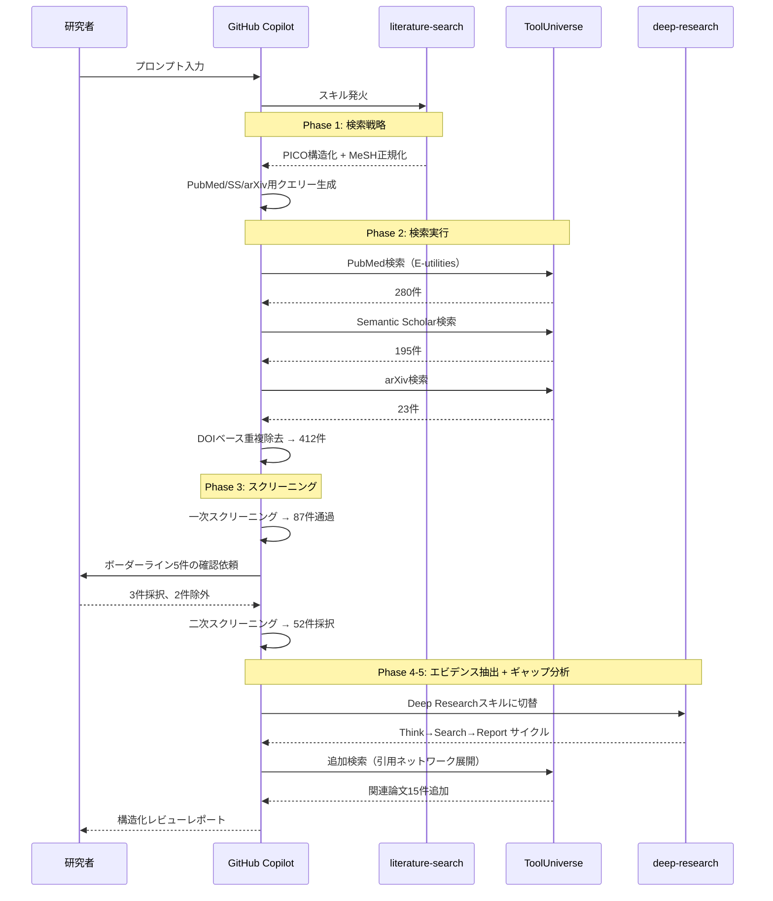
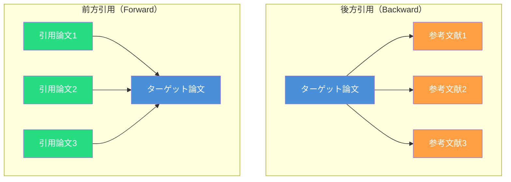
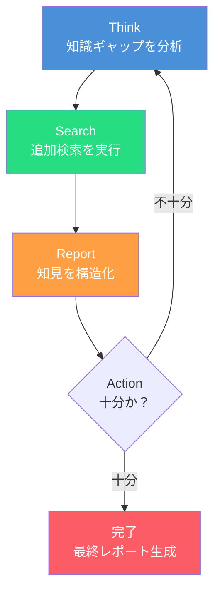

第3章で確立した「スキルとツールの切り分け」の原則を、ここから実践に移します。本章では、科学研究における4つのエージェントパターンの最初の1つ — **文献調査エージェント**を構築します。

文献調査は、あらゆる研究の出発点です。新しい仮説を立てるにも、実験を設計するにも、まず「この分野で何がわかっていて、何がまだわかっていないのか」を把握する必要があります。しかし、年間数百万本ペースで増え続ける論文の中から、自分の研究仮説に関連する知見を漏れなく・偏りなく抽出することは、人手だけでは限界があります。

本章で構築するエージェントは、以下を自律的に実行します。

1. **検索クエリーの構築**: 研究仮説をMeSH用語やブール演算子を使った構造化クエリーに変換
2. **論文の検索・取得**: PubMed、arXiv、Semantic ScholarなどのAPIを横断的に検索
3. **スクリーニング**: タイトル・アブストラクトに基づく包含・除外判定
4. **エビデンスの抽出と整理**: 各論文から仮説に関連するデータポイントを構造化
5. **ギャップ分析**: 既存のエビデンスから研究の空白領域を特定



## スキルとツールの切り分け — 文献調査への適用

第3章の判断フレームワークを、文献調査エージェントの各機能に適用してみましょう。

| 機能 | ①通信 | ②計算 | ③知識 | 判定 | 理由 |
| ---- | ---- | ---- | ---- | ---- | ---- |
| PubMed APIで論文を検索する | ✓ | | | **ツール** | HTTPリクエスト + XML解析が必要 |
| Semantic Scholar APIで引用ネットワークを取得する | ✓ | | | **ツール** | API認証 + ページネーション管理 |
| arXiv APIでプレプリントを検索する | ✓ | | | **ツール** | Atom XML解析が必要 |
| 「PubMed検索の前にMeSH用語で検索語を正規化すべき」 | × | × | ✓ | **スキル** | 検索品質を左右するドメイン知識 |
| 「PRISMA 2020ガイドラインに沿ってスクリーニングを実施する」 | × | × | ✓ | **スキル** | 系統的レビューの方法論 |
| エビデンスレベルをT1〜T4に分類する | × | × | ✓ | **スキル** | 評価フレームワーク |
| 論文のTF-IDFスコアを計算してランキングする | × | ✓ | | **コード生成** | 探索的な一回性の計算 |
| 検索結果の重複除去（DOIベース） | × | ✓ | | **ツール** | 複数のスキルから繰り返し呼ばれる |

このように、データベースへのアクセスは**ツール**、検索戦略や評価基準は**スキル**、一回性の付加的な計算は**コード生成パターン**と、明確に分離されます。

## 文献検索の標準パイプライン

### 全体アーキテクチャ

文献調査エージェントは、SATORIの`scientific-literature-search`スキルと`scientific-deep-research`スキルを中心に、ToolUniverseのPubMed・Semantic Scholar・arXiv連携ツールを組み合わせて構成されます。



### Phase 1: 検索戦略の立案 — 何をどう検索するか

文献検索の品質は、**検索クエリーの構築方法**でほぼ決まります。`scientific-literature-search`スキルは、研究者の自然言語プロンプトを構造化された検索クエリーに変換する手順を定義しています。

#### ステップ1: PICO/PECOフレームワークによる構造化

臨床研究ではPICO（Population, Intervention, Comparison, Outcome）、基礎研究ではPECO（Population, Exposure, Comparison, Outcome）フレームワークで研究課題を分解します。PECOは介入（Intervention）の代わりに曝露（Exposure）を用いる点が異なり、観察研究や環境因子の影響を調べる研究に適しています。

```markdown
## PICO構造化の例

研究者のプロンプト:
「腸内細菌叢の多様性低下が2型糖尿病の発症リスクを高めるか調査して」

| 要素 | 内容 |
| ---- | ---- |
| P（Population） | 2型糖尿病患者 / 健常者 |
| I（Intervention/Exposure） | 腸内細菌叢の多様性低下 |
| C（Comparison） | 正常な腸内細菌叢多様性 |
| O（Outcome） | 2型糖尿病の発症リスク |
```

#### ステップ2: MeSH用語への正規化

自然言語のキーワードを、PubMedの統制語彙（MeSH: Medical Subject Headings）に変換します。この変換をLLMに任せるのではなく、スキルが具体的な変換ルールを提供します。

| 自然言語 | MeSH用語 | MeSH ID |
| ---- | ---- | ---- |
| 腸内細菌叢 | Gastrointestinal Microbiome | D000069196 |
| 多様性 | Biodiversity | D044822 |
| 2型糖尿病 | Diabetes Mellitus, Type 2 | D003924 |
| 発症リスク | Risk Factors | D012307 |

:::message
**なぜMeSH正規化がスキルの責務なのか？**

MeSH用語は「2型糖尿病」を`Diabetes Mellitus, Type 2`と表記し、`Type 2 Diabetes`や`T2DM`では検索できません。この「正しい統制語彙を使うべき」という知識は、PubMed APIの呼び出し方（ツールの責務）とは独立した方法論的知識です。MeSH用語とIDの対応表自体は[NLM MeSH Browser](https://meshb.nlm.nih.gov/)で確認できますが、「研究課題からどのMeSH用語を選択すべきか」という判断はスキルが担います。
:::

#### ステップ3: 検索クエリーの構築

PICO要素とMeSH用語を組み合わせて、データベースごとの検索クエリーを構築します。

**PubMed用クエリー**:

```
("Gastrointestinal Microbiome"[MeSH] OR "gut microbiota"[tiab])
AND ("Diabetes Mellitus, Type 2"[MeSH] OR "T2DM"[tiab])
AND ("Biodiversity"[MeSH] OR "alpha diversity"[tiab] OR "Shannon index"[tiab])
AND ("Risk Factors"[MeSH] OR "risk"[tiab])
AND 2022:2026[dp]
AND (Review[pt] OR Systematic Review[pt] OR Meta-Analysis[pt])
```

**Semantic Scholar用クエリー**:

```
gut microbiome diversity type 2 diabetes risk
  fieldsOfStudy: Medicine, Biology
  year: 2022-2026
  openAccessPdf: true
```

**arXiv用クエリー**（計算生物学のプレプリント）:

```
cat:q-bio.GN AND (microbiome AND diabetes AND diversity)
```

このように、同じ研究課題に対して**データベースごとに最適化されたクエリー**を生成します。PubMedではMeSH用語とフィールドタグ、Semantic Scholarでは分野フィルター、arXivではカテゴリー指定という、それぞれの検索システムの特性を活用する知識がスキルに埋め込まれています。

### Phase 2: 検索の実行 — ToolUniverseによるマルチソース検索

構築されたクエリーを実際にAPIに投げるのは、MCPツール（ToolUniverse）の責務です。



#### なぜマルチソース検索が必要か

単一のデータベースだけでは、必然的に検索漏れが生じます。

| データベース | 強み | 弱み |
| ---- | ---- | ---- |
| **PubMed** | 生物医学分野の網羅性、MeSH統制語彙 | 物理・化学・工学の論文が少ない |
| **Semantic Scholar** | 全分野横断、引用ネットワーク解析、セマンティック検索 | MeSHのような統制語彙がない |
| **arXiv** | 最新プレプリントへの即日アクセス | 査読未了、生物医学分野が限定的 |

エージェントがこれら3つを並行検索し、DOIベースで重複を除去することで、**網羅性**と**最新性**の両方を確保します。

#### 検索結果のデータ構造

ツールが返す検索結果の統一フォーマットを定義します。異なるAPIからの結果を同一構造に正規化することで、後続のスクリーニングフェーズでの処理を統一できます。

```typescript
interface PaperMetadata {
  doi: string;                    // 重複除去のキー
  title: string;
  authors: string[];
  journal: string;
  year: number;
  abstract: string;
  source: 'pubmed' | 'semantic_scholar' | 'arxiv';
  publicationType: string;       // Review, Original, Meta-Analysis等
  citationCount: number;         // 被引用数
  openAccess: boolean;
  meshTerms?: string[];          // PubMedのみ
  fieldsOfStudy?: string[];      // Semantic Scholarのみ
  semanticScholarId?: string;    // 引用ネットワーク解析用
}
```

### Phase 3: スクリーニング — 論文の包含・除外判定

検索で得られた数百〜数千件の論文を、研究目的に合致するものに絞り込みます。この判定基準は**スキル**の責務です。

#### PRISMA 2020準拠のスクリーニング

`scientific-systematic-review`スキルは、PRISMA 2020ガイドライン[^1]に準拠したスクリーニング手順を定義しています。



#### スクリーニング基準の定義

スキルは以下の包含・除外基準をLLMに提供します。LLMはこの基準に照らして各論文のアブストラクトを評価し、判定結果を構造化して記録します。

```markdown
## 包含基準（スキルが定義）
1. PICO要素がすべてアブストラクトに含まれる
2. 出版年が指定範囲内（例: 2022年以降）
3. 査読済み論文、またはプレプリント（arXivの場合は明記）
4. 英語または日本語で記述されている

## 除外基準（スキルが定義）
1. 症例報告（n < 10の小規模研究）
2. 動物実験のみ（ヒトデータを含まない）— ただしPICO次第
3. 会議抄録のみ（全文なし）
4. リトラクション（撤回）された論文
```

#### LLMによるアブストラクト評価

LLMが各論文のアブストラクトを読み、包含基準への適合度を判定します。ここでのLLMの役割は「計算」ではなく「文章理解と判断」であり、スキルが提供する基準に基づく意思決定です。

```markdown
## 判定記録の出力フォーマット（スキルが定義）

| DOI | タイトル | 判定 | 理由 | PICO適合 |
| ---- | ---- | ---- | ---- | ---- |
| 10.1234/xxxx | Gut microbiome... | ✅ 採択 | P,I,C,O すべて適合 | P✓ I✓ C✓ O✓ |
| 10.5678/yyyy | Mouse model... | ❌ 除外 | 動物実験のみ | P✗ I✓ C✓ O✓ |
```

:::message
**Human-in-the-Loop: スクリーニング判定の確認**

第1章で述べた「原則3: Human-in-the-Loop」がここで適用されます。エージェントが自動判定した結果を研究者に提示し、**ボーダーラインの論文**（包含/除外の判断が微妙なもの）については明示的に確認を求めます。

```
エージェント: 「以下の3件はボーダーラインです。採択/除外を判断してください。」
  1. [DOI] - 動物実験中心だがヒトへの外挿を議論（除外基準2に抵触するが関連性あり）
  2. [DOI] - n=8の小規模研究（除外基準1に抵触するがパイロットスタディ）
  3. [DOI] - 2021年出版（年数制限の境界）
```

この設計により、完全自動化のリスク（重要な論文の見落とし）を避けつつ、作業の大部分はエージェントに委ねることができます。
:::

### Phase 4: エビデンスの抽出と構造化

スクリーニングを通過した論文群から、研究目的に関連するデータポイントを構造化して抽出します。

#### エビデンステーブルの構成

`scientific-literature-search`スキルは、抽出すべき情報の構造（エビデンステーブル）を定義しています。

```markdown
## エビデンステーブル（スキルが定義するフォーマット）

| 論文 | 研究デザイン | サンプルサイズ | 主要指標 | 主な結果 | エビデンスレベル | 備考 |
| ---- | ---- | ---- | ---- | ---- | ---- | ---- |
| Author (2024) | 前向きコホート | n=1,200 | Shannon index | T2DM群で有意に低下 (p<0.001) | T2 | 多民族コホート |
| Author (2023) | メタアナリシス | k=15研究 | α多様性各指標 | 統合効果量 g=-0.82 | T1 | 出版バイアスあり |
```

#### エビデンスレベルの分類

科学的知見の信頼度を体系的に評価するため、スキルがエビデンスレベルの分類基準を提供します。

| レベル | 研究デザイン | 信頼度 |
| ---- | ---- | ---- |
| **T1** | メタアナリシス、系統的レビュー | 最高 |
| **T2** | ランダム化比較試験（RCT）、大規模コホート | 高 |
| **T3** | 横断研究、ケースコントロール | 中 |
| **T4** | 症例報告、専門家意見、in vitro | 低 |

この分類により、「メタアナリシスの結果」と「個別の症例報告」を同等に扱うという過ちを防ぎます。LLMは抽出した各知見にエビデンスレベルを付与し、レビューレポートの中で重み付けされた議論を展開できるようになります。

### Phase 5: ギャップ分析 — 何がまだわかっていないか

既存のエビデンスを構造化したら、最後に**研究の空白領域（Research Gap）**を特定します。この分析は`scientific-deep-research`スキルのThink→Search→Report→Actionサイクルで実行されます。

```markdown
## ギャップ分析のフレームワーク（スキルが定義）

### Gapの分類
| Gap種別 | 説明 | 例 |
| ---- | ---- | ---- |
| Evidence Gap | データが存在しない領域 | 日本人コホートでの腸内細菌叢とT2DMの研究がない |
| Consistency Gap | 研究間で結果が矛盾する | α多様性の低下が原因か結果か未確定 |
| Methodological Gap | 研究手法の限界 | 16S rRNAのみでメタゲノムショットガンの研究がない |
| Population Gap | 特定の集団が研究されていない | 小児/高齢者での知見が不足 |
| Temporal Gap | 時間的な追跡が不足 | 介入後の長期フォローアップ（>5年）がない |
```

ギャップ分析の結果は、研究者が次の仮説を立てるための直接的な入力になります。ここで文献調査エージェントの成果が、第6章で扱う実験計画エージェントへと引き継がれていきます。

## 実装例: 腸内細菌叢×2型糖尿病のレビュー

ここまでの5つのフェーズを通しで実行する具体例を示します。

### プロンプト

```
「腸内細菌叢の多様性低下が2型糖尿病の発症リスクを高める」
という仮説について、2022年以降の論文を系統的にレビューし、
以下を報告してください。
1. 仮説を支持するエビデンスのまとめ
2. 仮説と矛盾するエビデンスのまとめ
3. エビデンスギャップの特定
4. 次に検証すべき研究課題の提案
```

### 発火するスキルチェーン

```
literature-search → deep-research → systematic-review → critical-review
```

### 実行フローの詳細



### 出力レポートの構造

エージェントが最終的に生成するレポートの構造は以下のとおりです。

```markdown
# 系統的レビュー: 腸内細菌叢多様性と2型糖尿病リスク

## エグゼクティブサマリー
67件の論文（データベース検索52件 + 引用ネットワーク15件）を系統的に
レビューした結果、腸内細菌叢のα多様性低下とT2DM発症リスクの間に
中程度の関連（統合効果量 g = -0.82, 95% CI...）が認められた。
ただし、因果方向の確定にはさらなる介入研究が必要である。

## 1. 検索戦略
- データベース: PubMed, Semantic Scholar, arXiv
- 検索期間: 2022-01-01 ~ 2026-03-01
- 検索クエリー: [完全なクエリー文字列]
- 検索日: 2026-03-15

## 2. PRISMA フローダイアグラム
- 検索ヒット: 498件（重複除去後 412件）
- 一次スクリーニング通過: 87件
- 二次スクリーニング通過: 52件
- 追加（引用ネットワーク）: 15件
- 最終採択: 67件

## 3. エビデンステーブル
[構造化された論文データ]

## 4. 仮説を支持するエビデンス
[T1-T4レベル別の整理]

## 5. 仮説と矛盾するエビデンス
[反証的知見の整理]

## 6. エビデンスギャップ
| Gap種別 | 内容 | 重要度 |
| ---- | ---- | ---- |
| Population Gap | 日本人コホートの研究が2件のみ | 高 |
| Methodological Gap | ショットガンメタゲノム研究が少ない | 中 |
| Temporal Gap | 5年以上の縦断研究が存在しない | 高 |

## 7. 推奨次ステップ
1. 日本人コホートでのショットガンメタゲノム解析
2. 食事介入による前向き研究（前後比較）
3. メンデルランダム化による因果推論

## References
[全論文のDOI付き引用リスト]
```

:::message
**再現性の保証（原則1）の適用**

このレポートには、検索クエリー・検索日・データベース・フィルター条件が完全に記録されています。第三者が同じクエリーを同じ日に実行すれば、同一の検索結果が得られます。これは第1章で述べた「再現性の保証」の実践です。
:::

## 引用ネットワーク解析 — Semantic Scholarの活用

キーワード検索だけでは見つからない重要論文を発見するために、**引用ネットワーク解析**を活用します。Semantic Scholar Academic Graph APIは、各論文の引用・被引用関係をグラフ構造で提供しています。

### 前方引用探索と後方引用探索



| 探索方向 | 目的 | 発見できる論文 |
| ---- | ---- | ---- |
| **後方引用**（参考文献をたどる） | 理論的基盤の把握 | 分野の基盤となるセミナル論文 |
| **前方引用**（その論文を引用した論文をたどる） | 最新の発展の追跡 | ターゲット論文の知見を発展させた最新研究 |

### スノーボールサンプリング

引用ネットワークを段階的に展開する手法です。スキルが展開の深さと停止条件を定義し、ツールがAPIを介して実際のネットワークデータを取得します。

```markdown
## スノーボールサンプリングのルール（スキルが定義）

1. シード論文: スクリーニング通過論文のうち被引用数上位10件
2. 展開の深さ: 最大2ホップ（シード→引用→引用の引用）
3. 各ホップでの上限: 被引用数上位20件
4. 停止条件:
   - 新規論文が5件未満になったら停止
   - PICO適合率が20%を下回ったら停止
5. 重複チェック: 既にスクリーニング済みの論文は除外
```

この手法により、キーワード検索では発見できなかった関連論文（異なる用語で同じ現象を記述している論文など）を補完的に収集できます。

## エビデンスの信頼性評価

収集した論文のエビデンスを盲目的に信頼してはいけません。スキルが提供する評価フレームワークに基づき、各エビデンスの信頼性を体系的に評価します。

### バイアスリスク評価

```markdown
## バイアスリスク評価基準（スキルが定義）

| バイアスの種類 | チェック項目 | 該当時のリスク |
| ---- | ---- | ---- |
| 選択バイアス | ランダム化の方法が明記されているか | 高リスク: 記載なし |
| 実施バイアス | 盲検化が行われているか | 中リスク: 一重盲検のみ |
| 検出バイアス | アウトカム評価の客観性 | 高リスク: 自己報告のみ |
| 報告バイアス | プロトコル登録と結果の一致 | 高リスク: 未登録 |
| 出版バイアス | ファンネルプロットの対称性 | 中リスク: 非対称 |
```

### 研究間の矛盾への対処

第3章で触れた「情報の矛盾処理」の原則は、文献調査でとくに重要です。同じトピックで異なる結論を報告する論文が見つかった場合、エージェントは以下のプロセスに従います。

```markdown
## 矛盾処理のルール（スキルが定義）

1. 矛盾の検出: 同一アウトカムに対して効果の方向（正/負/null）が異なる研究を検出
2. 原因の分析: サンプルサイズ、研究デザイン、対象集団、測定方法の違いを比較
3. 重み付け: エビデンスレベル（T1>T2>T3>T4）と研究の質に基づいて重み付け
4. 報告: 矛盾を隠蔽せず、すべての立場のエビデンスを併記
```

文献調査では、情報の矛盾を以下のマーカーで明示します。`(⚡)` は事実の矛盾（同一指標の値が研究間で異なる）、`(💭)` は解釈の相違（同じデータから異なる結論が導かれている）を表します。矛盾を隠蔽せず可視化することで、読者が自ら判断できるレビューになります。

## スキルの自作 — 自分の研究分野に特化した文献検索スキル

SATORIに組み込まれた汎用的な文献検索スキルをそのまま使うこともできますが、自分の研究分野に特化したスキルを作成することで、検索精度をさらに高められます。

### 分野特化スキルの設計例: 材料科学

```yaml
---
name: scientific-materials-literature-search
description: |
  材料科学分野の文献検索スキル。
  「材料論文」「物性データ検索」「結晶構造文献」で発火。
tu_tools:
  - key: materials_project
    name: Materials Project
    description: 第一原理計算による材料物性データベース
  - key: starrydata2
    name: StarryData2
    description: 公開論文中の実測値データベース
---

# Materials Science Literature Search

材料科学分野に特化した文献検索パイプライン。

## When to Use
- 特定の材料（合金、セラミックス、薄膜など）に関する文献を系統的に収集したい
- 物性値（熱伝導率、ZT値、バンドギャップなど）と組成の関係を文献から抽出したい
- Process-Structure-Property（PSP）関係の先行研究を調査したい

## Phase 1: 検索戦略
### 材料科学特有の検索ルール
1. 組成式の表記揺れに対応する
   - 例: "ZnO"、"zinc oxide"、"酸化亜鉛" をOR結合
2. 物性名の正規化
   - 例: "ZT" = "figure of merit" = "dimensionless figure of merit"
3. データベースの使い分け
   - 実験値: StarryData2、NIMS DICE
   - 計算値: Materials Project
   - 論文: PubMed（バイオ材料）、Web of Science（材料全般）

## Phase 2: 物性値の構造化抽出
論文から物性値を抽出する際、以下のフォーマットで記録する:

| 組成 | 物性 | 値 | 条件 | 出典 |
| ---- | ---- | ---- | ---- | ---- |
| ZnO | バンドギャップ | 3.37 eV | 室温、バルク | [1] |
| ZnO:Al | 抵抗率 | 2.5×10⁻⁴ Ω·cm | 300°C成膜 | [2] |

## 参照スキル
- ← hypothesis-pipeline（仮説からの検索起点）
- → materials-characterization（抽出データの解析へ）
- → eda-correlation（物性相関の解析へ）
```

### 設計のポイント

1. **`description`に分野特有の発火キーワードを含める**: 「材料論文」「物性データ検索」など、汎用の`literature-search`スキルでは拾えないトリガーを設定
2. **`tu_tools`で分野固有のデータベースを指定**: Materials ProjectやStarryData2は材料科学固有のリソースであり、汎用スキルには含まれない
3. **Phase内で分野固有の検索ルールを定義**: 組成式の表記揺れ対応は材料科学特有の知識
4. **`参照スキル`でパイプライン上の位置を明示**: 前後のスキルとの接続を定義し、パイプラインフローに組み込む

:::message
**Chapter 3の原則との対応**

このスキル設計は、第3章の「スキルとツールの切り分け」を忠実に反映しています。

- **スキルの責務**: 「組成式の表記揺れに対応する」「物性名を正規化する」→ ドメイン知識
- **ツールの責務**: Materials ProjectやStarryData2への実際のAPIアクセス → `tu_tools`で指定
- **コード生成の活用**: 物性値の抽出結果をCSVやJSON形式に変換する処理 → 探索的な一回性タスク
:::

## Deep Researchスキルとの連携

`scientific-literature-search`スキルが「論文を見つけて整理する」役割を担うのに対し、`scientific-deep-research`スキルは「見つけた論文の内容を深く分析し、知見を統合する」役割を担います。

### Think→Search→Report→Actionサイクル

`scientific-deep-research`スキルは、以下の反復サイクルで調査を深めます。



各サイクル（ラウンド）で、エージェントは以下を実行します。

| ステップ | 実行内容 | 具体例 |
| ---- | ---- | ---- |
| **Think** | 現時点で確定している事実とギャップを整理 | 「α多様性の低下は確認されたが、因果方向が不明」 |
| **Search** | ギャップを埋めるための追加検索 | 「gut microbiome causality Mendelian randomization」で検索 |
| **Report** | 新たに得られた知見を既存の構造に統合 | メンデルランダム化研究3件を発見、因果の方向を支持 |
| **Action** | 次のラウンドが必要かを判断 | 「介入研究のエビデンスがまだ不足 → 次ラウンドへ」 |

### literature-search と deep-research の連携パターン


- **literature-search**: キーワード検索、マルチソース検索、PRISMA準拠スクリーニングで**網羅的に**論文を収集
- **deep-research**: 収集された論文をThink→Search→Reportサイクルで**深掘り**し、エビデンスの統合とギャップ分析を実行

この連携により、「広く浅く集めてから、狭く深く分析する」という、人間の研究者が自然に行う文献調査のプロセスをエージェントが再現します。

## 再現性の確保 — 検索の監査証跡

科学研究における文献調査は、第1章で述べた「原則1: 再現性の保証」を厳密に満たす必要があります。エージェントが実行したすべての検索操作を監査可能な形で記録します。

### 検索ログのフォーマット

```yaml
# literature_search_log.yaml
search_session:
  id: "LS-2026-0315-001"
  date: "2026-03-15"
  researcher: "Nahisa Ho"
  hypothesis: "腸内細菌叢の多様性低下が2型糖尿病の発症リスクを高める"

queries:
  - database: "pubmed"
    query: '"Gastrointestinal Microbiome"[MeSH] AND ...'
    date: "2026-03-15T09:00:00Z"
    results_count: 280
    filters:
      date_range: "2022/01/01:2026/03/01"
      publication_type: ["Review", "Systematic Review", "Meta-Analysis"]

  - database: "semantic_scholar"
    query: "gut microbiome diversity type 2 diabetes risk"
    date: "2026-03-15T09:01:23Z"
    results_count: 195
    filters:
      fields_of_study: ["Medicine", "Biology"]
      year: "2022-2026"

  - database: "arxiv"
    query: "cat:q-bio.GN AND (microbiome AND diabetes AND diversity)"
    date: "2026-03-15T09:02:10Z"
    results_count: 23
    filters:
      category: "q-bio.GN"

screening:
  total_after_dedup: 412
  primary_screening:
    included: 87
    excluded: 325
    criteria: "PICO適合性 + 年代フィルター"
  secondary_screening:
    included: 52
    excluded: 35
    exclusion_reasons:
      - reason: "動物実験のみ"
        count: 15
      - reason: "症例報告 (n<10)"
        count: 12
      - reason: "会議抄録のみ"
        count: 8

snowball:
  seed_papers: 10
  hops: 2
  additional_papers: 15
  final_total: 67
```

この検索ログは、論文のMethodsセクションに記載する情報源として、また第三者による再現・検証のための記録として機能します。

## 第5章への橋渡し — GraphRAGによる知識の深化

本章で構築した文献調査エージェントは、**論文を見つけて構造化する**ところまでを担当します。しかし、67件の論文から得られた個別の知見を、研究分野全体の**知識構造**として把握するには、さらに高度な手法が必要です。

次章「GraphRAG・Lazy GraphRAGによる論文と実験ノートからの知識発見」では、本章で収集・構造化した論文群を入力として、**知識グラフ**を構築します。論文間の概念的つながりを可視化し、自身の実験ノートとも統合することで、文献調査の成果を研究活動全体の知識基盤へと昇華させます。


## 本章のまとめ

| トピック | 要点 |
| ---- | ---- |
| スキルとツールの切り分け | 検索戦略・評価基準はスキル、API接続はツール、付加的計算はコード生成 |
| 検索パイプライン | PICO構造化 → MeSH正規化 → マルチソース検索 → スクリーニング → エビデンス抽出 → ギャップ分析 |
| マルチソース検索 | PubMed + Semantic Scholar + arXiv を並行検索し、DOIベースで重複除去 |
| スクリーニング | PRISMA 2020準拠、ボーダーラインは研究者に確認（Human-in-the-Loop） |
| エビデンス評価 | T1〜T4のレベル分類、バイアスリスク評価、矛盾の明示的記録 |
| 引用ネットワーク | Semantic Scholarの前方/後方引用、スノーボールサンプリングで補完 |
| 再現性 | 検索クエリー・日時・フィルターの完全記録（search log） |
| Deep Research連携 | literature-search（広く浅く）→ deep-research（狭く深く）の二段構成 |
| 分野特化 | 自分の研究分野に特化した検索スキルを自作して精度を向上 |

次章では、文献調査で収集した知識をGraphRAG・Lazy GraphRAGで構造化し、実験ノートと統合することで、研究の知識基盤を構築する手法を学びます。

[^1]: Page, M.J., McKenzie, J.E., Bossuyt, P.M., et al. (2021). The PRISMA 2020 statement: an updated guideline for reporting systematic reviews. *BMJ*, 372, n71. DOI: 10.1136/bmj.n71

