第4章では、PubMed・Semantic Scholar・arXivからの論文収集とPRISMA準拠のスクリーニングを通じて、構造化されたエビデンステーブルを生成しました。しかし、67件の論文から得られた個別の知見は、まだ「リスト」に過ぎません。

本章では、これらの知見を **知識グラフ** として構造化することで、論文間の隠れた関係性や研究の空白領域を機械的に発見します。さらに、学術論文だけでなく研究者自身の **実験ノート（ラボノート）** も同じグラフに統合することで、「読んだ論文」と「自分の実験結果」をつなぐ知識基盤を構築します。

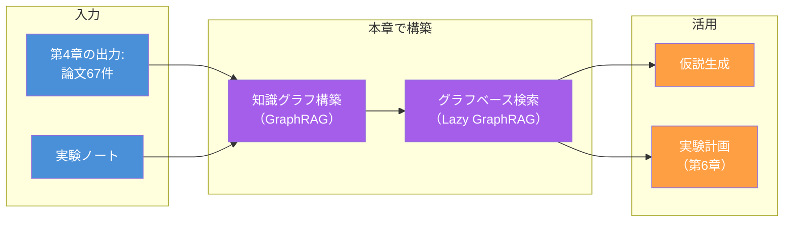

## なぜ従来のRAGでは不十分なのか

### 従来のRAGの限界

**RAG（Retrieval-Augmented Generation）** は、外部ドキュメントからの検索結果をLLMのコンテキストに注入する手法です。従来のRAGでは、テキストをチャンク（断片）に分割し、ベクトル類似度で検索します。

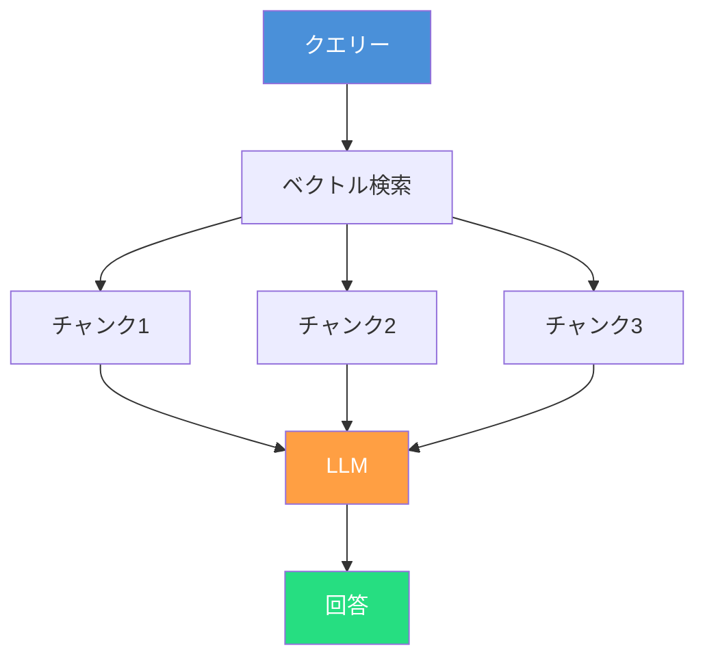

この方式は「特定のキーワードに一致する情報を引き出す」には有効ですが、科学研究の文脈では本質的な限界があります。

| 質問の種類 | 従来のRAG | GraphRAG |
| ---- | ---- | ---- |
| 「ZnOの光触媒活性は？」（局所的な事実検索） | ✅ 得意 | ✅ 得意 |
| 「ZnOの光触媒活性に関する研究全体の傾向は？」（グローバルな要約） | ❌ 苦手 | ✅ 得意 |
| 「腸内細菌叢研究とZnOナノ粒子研究の意外なつながりは？」（分野横断的な発見） | ❌ 不可能 | ✅ 可能 |
| 「この分野でまだ調べられていない組み合わせは？」（不在の発見） | ❌ 不可能 | ✅ 可能 |

従来のRAGが苦手な **グローバルな要約** や **分野横断的な関係性の発見** は、科学研究の知識探索でもっとも価値のある質問です。GraphRAGは、これらの質問に答える能力を提供します。

### GraphRAGの基本アイデア

**GraphRAG**[^1]は、Microsoftが提案した手法で、ドキュメントから**知識グラフ**を構築し、グラフ構造を活用した検索と回答生成を行います。

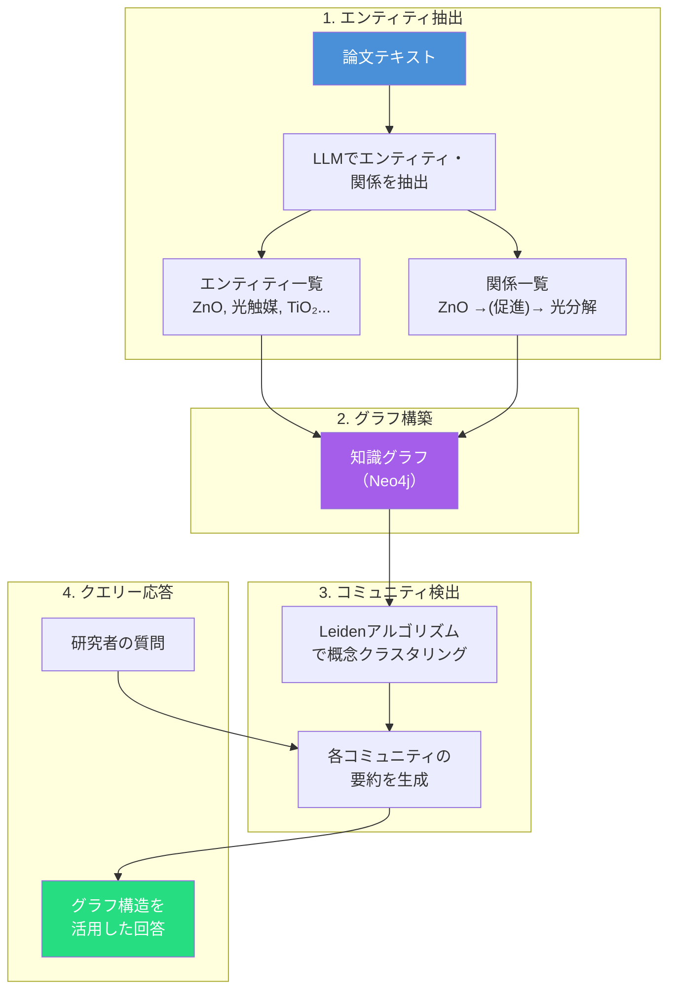

従来のRAGが「テキストの断片」を検索するのに対し、GraphRAGは「概念間の関係構造」を検索します。この違いにより、以下が可能になります。

1. **グローバルサマリゼーション**: 67件の論文全体を俯瞰する要約の生成
2. **関係性の発見**: 直接的に言及されていない概念間のつながりの推論
3. **空白領域の特定**: 知識グラフ上で接続されていない領域の可視化

## GraphRAGのアーキテクチャ

### 科学論文のための知識グラフ設計

科学論文の知識グラフを構築するにあたり、エンティティの型と関係の型を設計します。ここでのエンティティ型の定義は**スキル**の責務です。科学的に意味のある概念分類をLLMに提供することで、抽出精度を高めます。

#### エンティティ型の定義

```markdown
## エンティティ型（スキルが定義）

| 型 | 説明 | 例 |
| ---- | ---- | ---- |
| COMPOUND | 化合物、物質、材料 | ZnO, TiO₂, メトホルミン |
| ORGANISM | 生物、菌種 | Bacteroides fragilis, Homo sapiens |
| DISEASE | 疾患、症状 | 2型糖尿病, 炎症性腸疾患 |
| GENE_PROTEIN | 遺伝子、タンパク質 | SCFA受容体, GLP-1, インスリン |
| METHOD | 実験手法、解析手法 | 16S rRNA解析, ショットガンメタゲノム |
| METRIC | 指標、測定量 | Shannon指数, α多様性, HbA1c |
| CONDITION | 実験条件、環境条件 | 高脂肪食, 抗生物質投与, 嫌気条件 |
| FINDING | 研究知見、結論 | 多様性低下はT2DMリスク因子 |
| STUDY | 研究、論文 | Author et al. (2024) |
| EXPERIMENT | 実験記録 | EXP-2026-0301-001 |
```

#### 関係型の定義

```markdown
## 関係型（スキルが定義）

| 関係 | 説明 | 例 |
| ---- | ---- | ---- |
| CAUSES | 因果関係 | 高脂肪食 → CAUSES → 多様性低下 |
| CORRELATES_WITH | 相関関係 | α多様性 → CORRELATES_WITH → HbA1c |
| INHIBITS | 抑制関係 | メトホルミン → INHIBITS → 糖新生 |
| PROMOTES | 促進関係 | SCFA → PROMOTES → インスリン感受性 |
| PRODUCES | 産生関係 | 腸内細菌叢 → PRODUCES → 短鎖脂肪酸 |
| MEASURED_BY | 測定方法 | 多様性 → MEASURED_BY → Shannon指数 |
| USED_IN | 手法の使用 | 16S rRNA → USED_IN → Study A |
| BELONGS_TO | 分類関係 | Bacteroides → BELONGS_TO → Bacteroidetes |
| CONTRADICTS | 矛盾関係 | Finding A → CONTRADICTS → Finding B |
| SUPPORTS | 支持関係 | Finding C → SUPPORTS → Finding A |
| REPORTS | 報告関係 | Study A → REPORTS → Finding B |
| CAUSED_BY | 原因帰属（CAUSESの逆方向） | Finding → CAUSED_BY → Study |
| ABOUT | 対象関係 | Finding → ABOUT → Compound |
| MEASURES | 測定対象 | Finding → MEASURES → Metric |
| DOPED_WITH | ドーピング関係（材料科学） | ZnO → DOPED_WITH → Al |
| USES | 使用関係 | Experiment → USES → Compound |
```

:::message
**因果関係（CAUSES）と相関関係（CORRELATES_WITH）の区別**

科学研究において、因果関係と相関関係の区別はきわめて重要です。スキルは以下のルールをLLMに提供します。

- 「A → CAUSES → B」: 介入研究（RCT）またはメンデルランダム化で因果が確認された場合のみ
- 「A → CORRELATES_WITH → B」: 観察研究で統計的関連が報告された場合
- 関係型が不明確な場合は、より弱い`CORRELATES_WITH`を使用する（因果の過剰主張を防ぐ）

この判断基準はスキルがLLMに注入する**ドメイン知識**であり、第1章の「原則2: ドメイン知識の明示的な注入」の実践です。
:::

### エンティティ抽出パイプライン

論文テキストからエンティティと関係を抽出するパイプラインを構築します。

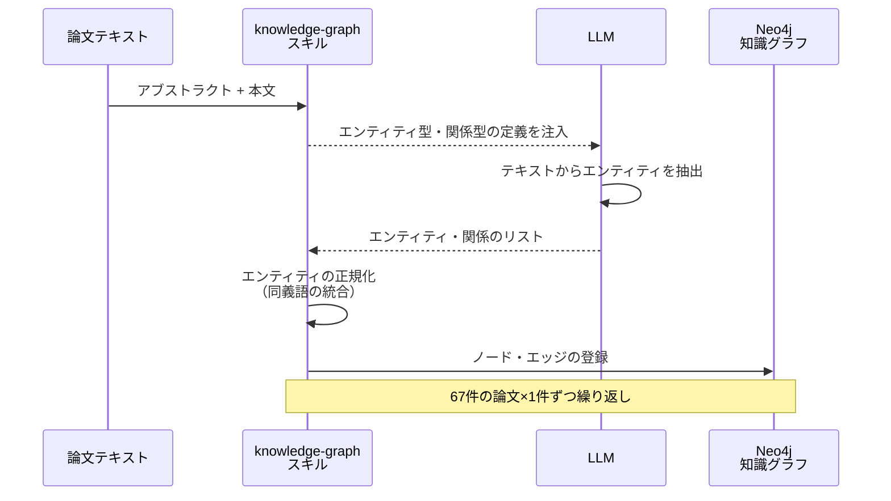

#### エンティティの正規化

異なる論文が同じ概念を異なる表現で記述している場合、**正規化**によって統合します。これはスキルが定義する知識であり、分野ごとのスキルに表記揺れ知識を埋め込むアプローチです。

| 表記揺れ | 正規化されたエンティティ |
| ---- | ---- |
| gut microbiome, gut microbiota, intestinal microflora | **Gastrointestinal Microbiome** |
| T2DM, type 2 diabetes, 2型糖尿病 | **Type 2 Diabetes Mellitus** |
| Shannon index, Shannon diversity, Shannon entropy | **Shannon Diversity Index** |
| short-chain fatty acids, SCFA, 短鎖脂肪酸 | **Short-Chain Fatty Acids** |

この正規化テーブルは、分野ごとのスキルに埋め込みます。汎用のLLMでは「gut microbiome」と「intestinal microflora」が同義であることを知っている場合もありますが、スキルとして明示的に定義することで、抽出の再現性と信頼性を保証します。

### グラフ構造の可視化例

67件の腸内細菌叢×T2DM論文から抽出された知識グラフの一部を示します。

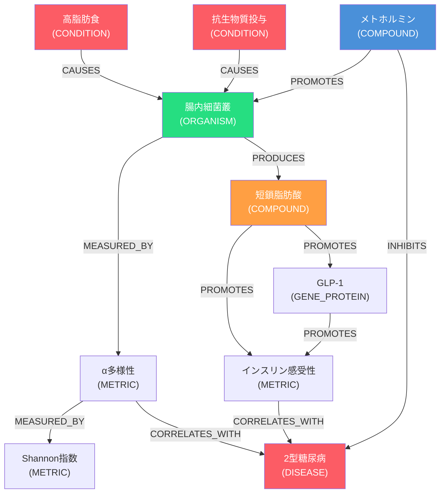

このグラフから、たとえば以下の洞察が機械的に得られます。

- **経路の発見**: 高脂肪食→腸内細菌叢→短鎖脂肪酸→インスリン感受性→T2DMという因果経路
- **介入ポイント**: メトホルミンが腸内細菌叢を促進するという経路（従来の血糖降下メカニズムとは別の作用機序）
- **ハブノード**:「腸内細菌叢」「短鎖脂肪酸」が多くのエッジを持つハブ→研究の中心概念

## Lazy GraphRAG — 軽量かつ柔軟な代替アプローチ

### GraphRAGの課題

GraphRAGは強力な手法ですが、実運用にはいくつかの課題があります。

| 課題 | 詳細 |
| ---- | ---- |
| **構築コスト** | 全文を処理してエンティティ・関係を抽出するため、LLM呼び出しが多い（67件の論文で数百回） |
| **更新の難しさ** | 新しい論文が追加されるたびにグラフ全体の再構築が必要になる場合がある |
| **過剰な構造化** | 探索的な質問には、厳密なエンティティ型定義が足かせになる場合がある |

### Lazy GraphRAGとは

**Lazy GraphRAG**[^2]は、Microsoftが提案した「怠惰な」GraphRAGです。事前にグラフを完全構築するのではなく、**クエリー時に必要な部分だけグラフを構築する**アプローチを取ります。

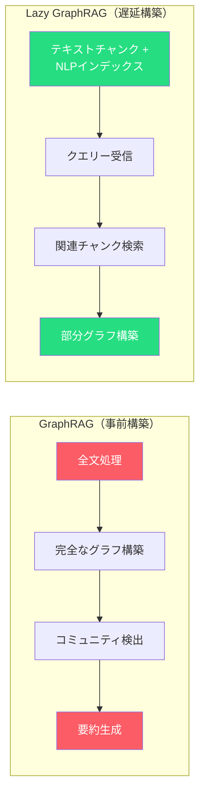

| 比較項目 | GraphRAG | Lazy GraphRAG |
| ---- | ---- | ---- |
| **構築タイミング** | 事前（インデックス時） | 遅延（クエリー時） |
| **初期コスト** | 高い（全文をLLMで処理） | 低い（NLPベースの軽量インデックス） |
| **クエリーコスト** | 低い（構築済みグラフを検索） | 中程度（部分グラフをオンデマンド構築） |
| **グローバル質問** | ✅ 得意（コミュニティ要約） | ✅ 可能（Best-first検索 + マップリデュース） |
| **ローカル質問** | ✅ 得意 | ✅ 得意 |
| **更新容易性** | △ 再構築が必要な場合あり | ✅ チャンク追加のみ |
| **適するデータ量** | 中〜大規模（安定したコーパス） | 小〜中規模（頻繁に追加されるデータ） |

### 科学研究での使い分け

| シナリオ | 推奨手法 | 理由 |
| ---- | ---- | ---- |
| 確立した研究分野のレビュー（100+論文、更新頻度低） | **GraphRAG** | 事前構築のコストを正当化できる安定したコーパス |
| 探索的な文献調査（20〜50論文、随時追加） | **Lazy GraphRAG** | 論文追加のたびに再構築不要。初期コストが低い |
| 自分の実験ノート + 関連論文（動的、個人的） | **Lazy GraphRAG** | データが頻繁に更新される。柔軟性が重要 |
| 系統的レビューの最終分析 | **GraphRAG** | 確定した論文セットに対する網羅的な構造分析 |

:::message
**実用的な推奨**

多くの研究者にとって、**Lazy GraphRAGから始めて、データが安定したらGraphRAGに移行する**のが現実的なアプローチです。探索的な初期段階ではLazy GraphRAGの柔軟性を活かし、系統的レビューの最終段階ではGraphRAGの網羅性と構造を活用します。
:::

## 実験ノートの統合 — 論文と自分のデータをつなぐ

### なぜ実験ノートを知識グラフに含めるのか

研究者の最大の知的資産は、自分自身の**実験ノート**です。しかし、ほとんどの研究者の実験ノートは構造化されておらず、過去の記録から有用な知見を再発見するのが困難です。

| データソース | 特徴 | 知識グラフへの価値 |
| ---- | ---- | ---- |
| **学術論文** | 査読済み、構造化、公開 | 分野のコンセンサス |
| **実験ノート** | 非公開、非構造化、リアルタイム | **自分だけの知見**（失敗実験を含む） |

とりわけ重要なのは、**失敗実験のデータ**です。学術論文に掲載されるのはほとんどが成功した結果ですが、「この条件ではうまくいかなかった」という記録は、実験計画を最適化するうえで極めて有用です。知識グラフに登録することで、次の実験計画でネガティブデータを自動的に参照できるようになります。

### 実験ノートのフォーマットと取り込み

実験ノートを知識グラフに取り込むために、以下の構造化フォーマットを定義します。

```yaml
# experiment_note.yaml
experiment:
  id: "EXP-2026-0301-001"
  date: "2026-03-01"
  researcher: "Nahisa Ho"
  objective: "ZnOナノ粒子のドーピング元素がバンドギャップに与える影響を調査"

conditions:
  - parameter: "ドーピング元素"
    values: ["Al", "Ga", "In"]
  - parameter: "ドーピング濃度"
    values: ["1 at%", "3 at%", "5 at%"]
  - parameter: "焼成温度"
    values: ["400°C", "600°C", "800°C"]

results:
  - condition: "Al 3at%, 600°C"
    bandgap: "3.15 eV"
    resistivity: "3.2×10⁻³ Ω·cm"
    status: "success"
    notes: "もっともバンドギャップが低下した条件"

  - condition: "In 5at%, 800°C"
    bandgap: null
    resistivity: null
    status: "failure"
    notes: "In析出が発生し薄膜が不均一。この濃度・温度の組み合わせは不適"

observations:
  - "Al 3at%ではバンドギャップの低下とともに可視光応答が改善した"
  - "In 5at%は固溶限を超えており、偏析が顕著"
  - "焼成温度600°Cが結晶性と透明性のバランスがもっとも良い"

related_papers:
  - doi: "10.1234/zno-doping-2024"
    relation: "結果が一致（Al 3at%でのバンドギャップ低下）"
  - doi: "10.5678/in-doping-limit"
    relation: "Inの固溶限に関するデータを参照"
```

### 論文ノードと実験ノードの統合

学術論文と実験ノートの知識を同一のグラフに統合することで、両者のつながりが可視化されます。

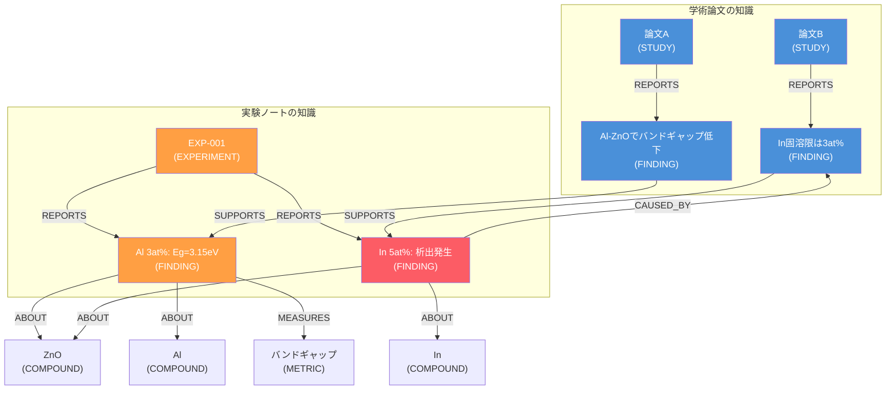

この統合グラフにより、以下のような質問にエージェントが回答できるようになります。

| 質問 | 回答に使う情報 |
| ---- | ---- |
| 「AlドープZnOのバンドギャップについて、論文と自分の実験結果は一致しているか？」 | 論文F1 + 実験EF1の比較 |
| 「In 5at%がうまくいかなかった理由を文献で説明できるか？」 | 実験EF2 → CAUSED_BY → 論文F2 の関係 |
| 「これまでの実験で試していないドーピング元素は何か？」 | グラフ上でZnOに接続されていないCOMPOUNDの列挙 |

最後の質問はとくに重要です。知識グラフ上の**不在**を検出することで、次に試すべき実験条件を機械的に提案できます。これは第4章のギャップ分析を、自分の実験データにまで拡張したものです。

## 実装: Neo4j + ChromaDB による知識基盤

### 技術スタックの選択

本章の知識基盤は、以下の技術スタックで構築します。

| コンポーネント | 技術 | 役割 |
| ---- | ---- | ---- |
| **グラフデータベース** | Neo4j | 知識グラフの格納と関係検索（Cypher） |
| **ベクトルデータベース** | ChromaDB | テキストチャンクのベクトル検索（Lazy GraphRAG用） |
| **LLM** | GitHub Copilot（Claude/GPT/Gemini） | エンティティ抽出、関係抽出、回答生成 |
| **エージェントスキル** | `scientific-knowledge-graph` | エンティティ型・関係型の定義、正規化ルール |
| **MCPツール** | Neo4j MCP, ChromaDB MCP | データベースへのCRUD操作 |

### スキルとツールの切り分け

第3章の原則をこの実装に適用します。

| 機能 | 判定 | 理由 |
| ---- | ---- | ---- |
| エンティティ型・関係型の定義 | **スキル** | 科学的に意味のある概念分類（ドメイン知識） |
| 因果関係と相関関係の区別ルール | **スキル** | 研究デザインに基づく判断基準 |
| 正規化テーブル（同義語統合） | **スキル** | 分野固有の表記揺れ知識 |
| Neo4jへのCypherクエリー実行 | **ツール** | データベースへの通信 |
| ChromaDBへのベクトル登録・検索 | **ツール** | データベースへの通信 |
| グラフの可視化（Mermaid生成） | **コード生成** | 探索的な一回性タスク |
| コミュニティ検出（Leidenアルゴリズム） | **ツール** | 決定論的なグラフアルゴリズム |

### Neo4jへのデータ登録

論文からのエンティティ・関係を、Cypherクエリーでデータベースに登録します。

```cypher
// エンティティ（ノード）の作成
CREATE (gm:ORGANISM {
  name: "Gastrointestinal Microbiome",
  aliases: ["gut microbiome", "gut microbiota", "intestinal microflora"],
  source: "literature"
})

CREATE (t2d:DISEASE {
  name: "Type 2 Diabetes Mellitus",
  aliases: ["T2DM", "type 2 diabetes", "2型糖尿病"],
  source: "literature"
})

CREATE (si:METRIC {
  name: "Shannon Diversity Index",
  aliases: ["Shannon index", "Shannon entropy"],
  source: "literature"
})

// 関係（エッジ）の作成
CREATE (gm)-[:CORRELATES_WITH {
  direction: "negative",
  effect_size: -0.82,
  p_value: 0.001,
  evidence_level: "T1",
  source_doi: "10.xxxx/meta-analysis-2024",
  relationship_type: "correlation"
}]->(t2d)

CREATE (gm)-[:MEASURED_BY {
  context: "α多様性の評価"
}]->(si)
```

### Cypherによる知識検索

グラフが構築されると、以下のような知識検索が可能になります。

```cypher
// 質問: 「腸内細菌叢とT2DMをつなぐ経路は何か？」
MATCH path = (gm:ORGANISM {name: "Gastrointestinal Microbiome"})
  -[*1..3]-(t2d:DISEASE {name: "Type 2 Diabetes Mellitus"})
RETURN path
ORDER BY length(path) ASC
LIMIT 10

// 質問: 「グラフ上でもっともハブとなっている概念は？」
MATCH (n)-[r]-()
RETURN n.name, labels(n)[0] AS type, COUNT(r) AS degree
ORDER BY degree DESC
LIMIT 10

// 質問: 「実験で試していないドーピング元素は？」
MATCH (zno:COMPOUND {name: "ZnO"})-[:DOPED_WITH]->(tried:COMPOUND)
WITH COLLECT(tried.name) AS tried_elements
MATCH (candidate:COMPOUND)
WHERE candidate.name IN ["Ga", "Mg", "Cu", "Fe", "Mn"]
  AND NOT candidate.name IN tried_elements
RETURN candidate.name AS untried_element
```

## 日本語論文を扱う場合の注意点

GraphRAGは英語テキストを前提に設計されています。日本語の学術論文を知識グラフに取り込む際には、**チャンク分割**と**埋め込みモデル**の2つの観点で対策が必要です[^4]。

### チャンク分割の課題

GraphRAGのデフォルトではtiktokenのトークン境界でテキストを分割しますが、日本語では以下の問題が発生します。

| 課題 | 詳細 |
| ---- | ---- |
| **単語境界がない** | 英語はスペースで単語が区切られるが、日本語にはスペースがなくトークン境界が意味の区切りと一致しない |
| **トークン効率が悪い** | `cl100k_base`では日本語1文字あたり約1〜3トークンを消費し、同じチャンクサイズでも英語より格納できる情報量が少ない |
| **文字化けの発生** | マルチバイト文字の途中で分割されると文字化けが発生する場合がある |

```
デフォルト分割: ...形態素解析ベースの�          ← 文字化け
文ベース分割:   ...形態素解析ベースのチャンク分割  ← 適切
```

### GiNZAによる文ベース分割

解決策として、**GiNZA**（spaCy + SudachiPy）を使用した文境界検出ベースのチャンク分割を行います。GiNZAは日本語の文構造を正確に解析し、意味のある単位での分割を実現します。

```python
import spacy

nlp = spacy.load("ja_ginza")

text = "腸内細菌叢のα多様性は短鎖脂肪酸の産生と密接に関連する。多様性の低下はSCFA産生の減少を通じて代謝機能に影響を及ぼす。"

doc = nlp(text)
sentences = [sent.text for sent in doc.sents]
# → ["腸内細菌叢のα多様性は短鎖脂肪酸の産生と密接に関連する。",
#    "多様性の低下はSCFA産生の減少を通じて代謝機能に影響を及ぼす。"]
```

チャンクサイズも調整が必要です。日本語はトークン効率が低いため、英語の1,200トークンに対して**800トークン**程度に設定するのが適切です。

### 日本語対応埋め込みモデル

エンティティ抽出後のベクトル検索（Lazy GraphRAG、ChromaDB）でも、日本語に対応した埋め込みモデルが必要です。

| 環境 | 推奨モデル | 特徴 |
| ---- | ---- | ---- |
| ローカル（Ollama） | **bge-m3** | BAAI製、100言語対応、567MB |
| クラウド（Azure AI Foundry） | **text-embedding-3-large** | MIRACLベンチマーク高スコア、次元数調整可能 |
| クラウド（Azure AI Foundry） | **Cohere-embed-v3-multilingual** | 日本語含む10言語対応 |

```yaml
# settings.yaml - ローカル環境（Ollama + bge-m3）
embeddings:
  llm:
    type: openai_embedding
    model: bge-m3
    api_base: http://localhost:11434/v1

# チャンク設定（日本語最適化）
chunks:
  size: 800
  overlap: 80
  strategy: sentences
```

:::message
**スキルとしての日本語対応**

チャンクサイズの調整（800トークン）やGiNZAの使用判定は、スキルに記述するドメイン知識です。「入力テキストが日本語の場合、文ベース分割に切り替え、チャンクサイズを800に調整する」というルールをスキルに埋め込むことで、エージェントが言語を自動判定して適切な前処理を選択できるようになります。これも第3章のスキル/ツール切り分けの実践であり、**言語固有の処理知識はスキル、トークナイザーの実行はツール**に分離します。
:::

## NLP抽出精度の強化 — scispaCyとドメイン辞書

Lazy GraphRAGはLLMを使わずNLPベースの名詞句抽出でグラフを構築しますが、デフォルトの汎用NLPモデルでは科学論文の専門用語を十分に認識できません[^6]。この課題に対して、**scispaCy**（科学論文特化のspaCyモデル）と**ドメイン辞書**（Semantic Scholar APIからの用語補完）の2段階で抽出精度を強化します[^7]。

### scispaCyによる科学用語認識の向上

**scispaCy**は、生物医学・科学文献に特化したspaCyモデルです。汎用モデル（`en_core_web_sm`）と比較して、以下の改善が得られます。

| 評価項目 | scispaCy（`en_core_sci_lg`） | 汎用モデル（`en_core_web_sm`） | 差分 |
| ---- | ---- | ---- | ---- |
| エンティティ抽出数（3論文） | 5,257 | 2,908 | **+81%** |
| 材料科学カバレッジ | 91.7% | 75.0% | **+16.7%** |
| 平均ドメインカバレッジ | 82.4% | 78.9% | +3.5% |

とくに注目すべきは、scispaCyが全エンティティを`ENTITY`タイプとして統一認識する点です。汎用モデルでは`ORG`、`PERSON`、`CARDINAL`などのNERタイプに分散しますが、scispaCyでは科学用語が統一的に扱われ、グラフ構造がより密になります。

Lazy GraphRAGへの統合は`settings.yaml`の変更のみで完了します。

```yaml
# settings.yaml — scispaCy統合
extract_graph_nlp:
  text_analyzer:
    extractor_type: syntactic_parser  # regex_english から変更
    model_name: en_core_sci_lg        # 科学論文特化モデル（531MB）
    # model_name: ja_core_news_lg     # 日本語論文の場合
```

日本語論文では`ja_core_news_lg`モデルがscispaCyを上回り（カバレッジ+20%）、「深層学習技術」「自然言語処理分野」などの複合名詞を正確に抽出できます。前述のGiNZAによるチャンク分割と組み合わせることで、日本語論文の知識グラフ構築が実用的な品質に達します。

### ドメイン辞書による補完 — Semantic Scholar API

scispaCyは強力ですが、学習済みモデルの語彙は固定されており、最新の研究用語（GPT-4o、LLaMAなど）には対応できません。また、「self-attention mechanism」のような3語以上の複合名詞は、NLPモデルが個別トークンに分割してしまう場合があります。

**Semantic Scholar API**から学術用語を動的に収集し、**ドメイン辞書**としてNLP抽出を補完するアプローチでこの課題を解決します。

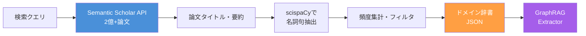

5つのAI/MLサブドメインから15論文ずつ収集した結果、**172の固有用語**が辞書として抽出されました。この辞書をNLP抽出に組み合わせると、以下の効果が得られます。

| 効果 | 詳細 |
| ---- | ---- |
| **ブーストされた用語** | 抽出された用語の36.5%が辞書と一致し、グラフ上の重みが2倍に強化 |
| **新規発見された複合名詞** | `self-attention mechanism`、`downstream tasks`、`deep neural network`など6用語 |
| **動的更新** | Semantic Scholar APIから定期収集し、最新用語へ追従可能 |

### ハイブリッドアプローチの推奨

2つの手法は補完関係にあります。scispaCyは「量」（大量のエンティティを漏れなく抽出）、ドメイン辞書は「質」（重要な複合名詞の確実な認識）にそれぞれ寄与します。

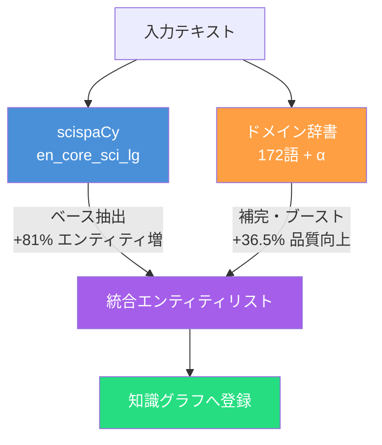

| 優先度 | アクション | 期待効果 |
| ---- | ---- | ---- |
| 1 | scispaCy導入 | **+81%** エンティティ増（最大の改善） |
| 2 | ドメイン辞書統合 | **+36.5%** 品質向上（複合名詞の補完） |
| 3 | 辞書自動更新パイプライン | 最新用語への継続的な追従 |

:::message
**スキルとツールの切り分け**

辞書に含める用語の選定基準（最小出現頻度、最大語長、優先ドメインの定義）は**スキル**の責務です。一方、Semantic Scholar APIへのHTTPリクエストや辞書JSONの入出力は**ツール**が担当します。辞書の構築ポリシーはドメイン知識であり、APIの叩き方は汎用的な処理です。第3章の切り分け原則がここでも一貫して適用されます。
:::

## コミュニティ検出 — 知識の構造を可視化する

### Leidenアルゴリズムによるクラスタリング

GraphRAGの中核技術の1つが、**Leidenアルゴリズム**[^3]によるコミュニティ検出です。知識グラフのノードを、密に接続されたグループ（コミュニティ）に分割し、各コミュニティの要約を自動生成します。

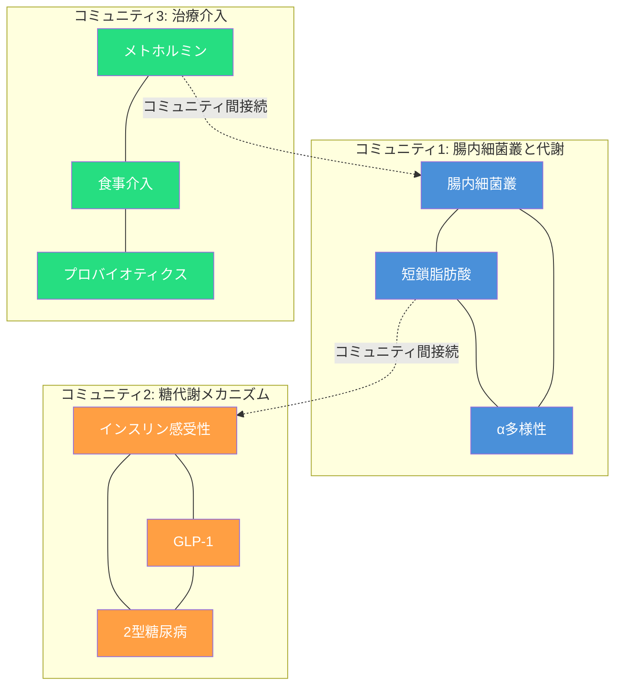

### コミュニティ要約の生成

各コミュニティに対してLLMが要約を生成します。この要約がグローバルサマリゼーションの基盤になります。

| コミュニティ | 自動生成された要約 |
| ---- | ---- |
| **C1: 腸内細菌叢と代謝** | 腸内細菌叢のα多様性は短鎖脂肪酸（SCFA）の産生と密接に関連する。多様性の低下はSCFA産生の減少を通じて代謝機能に影響を及ぼす。Shannon指数とChao1指数が主要な評価指標として使用される。 |
| **C2: 糖代謝メカニズム** | GLP-1はインスリン感受性を向上させ、T2DMリスクを低減する。SCFAがGLP-1分泌を促進するメカニズムが複数の研究で報告されている。ただし、因果関係は介入研究で十分に検証されていない。 |
| **C3: 治療介入** | メトホルミンはT2DM治療薬であるが、腸内細菌叢の組成変化を通じた副次的な効果も示唆されている。食事介入とプロバイオティクスが多様性改善の有望なアプローチとして研究されている。 |

グローバルな質問（「この分野の研究傾向は？」）に対しては、これらのコミュニティ要約をマップリデュースで統合して回答を生成します。これが、従来のチャンクベースRAGでは不可能だった**分野全体の俯瞰**を実現する仕組みです。

## 科学研究エージェントでの実践的な知識検索

### 検索モードと質問タイプの対応

GraphRAGには4つの検索モードがあり、質問の性質に応じて使い分けます[^5]。

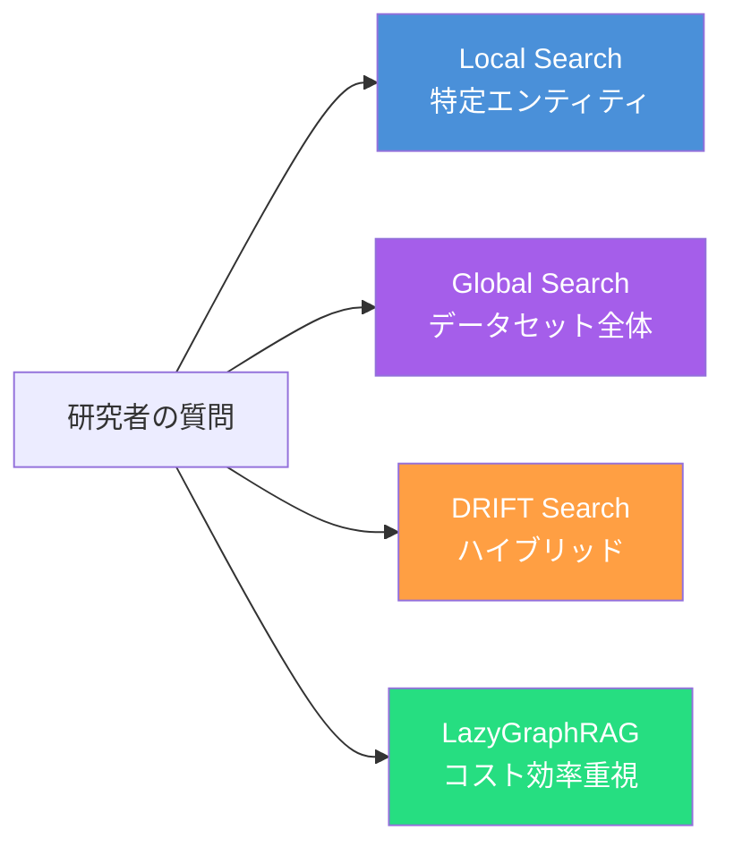

| 検索モード | 戦略 | 科学研究での質問例 | コスト |
| ---- | ---- | ---- | ---- |
| **Local Search** | 特定ノードの近傍を検索 | 「SCFAにはどんな種類があるか？」 | 低 |
| **Global Search** | コミュニティ要約をMap-Reduce | 「腸内細菌叢研究の主要トレンドは何か？」 | 高 |
| **DRIFT Search** | Global→Localの反復深化 | 「高脂肪食からT2DMへの因果経路を比較分析して」 | 中 |
| **LazyGraphRAG** | オンデマンドで部分グラフ構築 | 「まだ研究されていない組み合わせは？」 | 最低 |

DRIFT Search（Dynamic Reasoning and Inference with Flexible Traversal）は、Global Searchで概要を把握し、Local Searchで詳細を掘り下げる反復的なアプローチです。複数のトピックを横断する複合的な質問に適しています。

:::message
**質問タイプの自動判定**

どの検索モードを使うかの判定ロジックもスキルに記述します。「主要テーマ」「全体の傾向」などのキーワードはGlobal Search、「とは」「定義」はLocal Search、「比較」「分析」はDRIFT Searchに振り分けます。この判定ルールはドメイン知識（スキル）であり、検索の実行はツールの責務です。
:::

### 研究者の典型的な質問に対する回答フロー

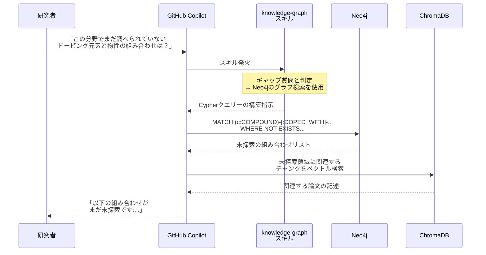

## 検索品質の評価 — GraphRAGは本当に優れているのか

知識グラフを構築したら、その検索品質を定量的に評価する必要があります。「GraphRAGを導入して検索精度が上がったのか？」を客観的に示すことは、科学研究における再現性の原則（第1章の原則1）にも関わります。

### Microsoft公式の評価指標

Microsoft Researchは、GraphRAGの品質評価に**LLM-as-Judge**（LLMを評価者として使用する手法）を採用し、3つの指標を定義しています[^5]。

| 指標 | 英語名 | 評価観点 | 科学研究での重要性 |
| ---- | ---- | ---- | ---- |
| **網羅性** | Comprehensiveness | 質問のすべての側面をカバーしているか | 系統的レビューでの見落とし防止 |
| **多様性** | Diversity | 異なる視点・洞察を提供しているか | 分野横断的な発見の促進 |
| **有用性** | Empowerment | 読者が判断を下せるほど理解を助けるか | 実験計画への直接的な貢献 |

### ベンチマーク結果

Microsoft Researchの公式ベンチマーク（AP News 5,000+記事）では、以下の結果が報告されています。

| 比較 | 網羅性勝率 | 多様性勝率 | コスト |
| ---- | ---- | ---- | ---- |
| DRIFT vs Local | **78%** | **81%** | 中 vs 低 |
| LazyGraphRAG vs 全競合手法（ローカル質問） | **有意に優位** | **有意に優位** | GraphRAGの0.1% |
| LazyGraphRAG vs Global Search | 同等品質 | 同等品質 | **700分の1** |

とくに注目すべきは**LazyGraphRAGのコスト効率**です。インデックス構築コストがGraphRAGの0.1%でありながら、検索品質は同等以上という結果は、前述の「Lazy GraphRAGから始めてGraphRAGに移行する」戦略を強く支持しています。

### 科学研究での評価の実践

科学研究エージェントの検索品質を評価する際は、以下のアプローチを推奨します。

```python
EVALUATION_PROMPT = """以下の回答を1-5で評価してください。

【質問】{question}
【回答】{answer}

1. 網羅性: 質問のすべての側面をカバーしているか
2. 多様性: 異なる視点・洞察を提供しているか
3. 有用性: 次の実験計画に活用できる情報か

JSON: {{"comprehensiveness": <1-5>, "diversity": <1-5>,
        "empowerment": <1-5>, "reason": "..."}}
"""
```

3つ目の指標「有用性」を科学研究の文脈に合わせて**「次の実験計画に活用できるか」**と再定義しているのがポイントです。一般的な回答の有用性ではなく、第6章の実験計画エージェントへの入力として機能するかどうかを評価します。

:::message
**評価もスキルの責務**

上記の評価プロンプトはスキルに埋め込むドメイン知識です。「科学研究において有用な回答とは何か」の判断基準は分野によって異なり、LLMの汎用的な判断に任せるべきではありません。材料科学であれば「具体的な組成や条件が記載されているか」、生命科学であれば「エビデンスレベルが明示されているか」など、分野固有の評価基準をスキルに定義します。
:::

## スキルの自作 — 知識グラフ構築スキル

本章の手法を自分の研究分野に適用するためのスキル設計例を示します。

```yaml
---
name: scientific-knowledge-graph
description: |
  知識グラフ構築・検索スキル。
  「知識グラフ」「GraphRAG」「概念マップ」「関係抽出」で発火。
tu_tools:
  - key: neo4j
    name: Neo4j
    description: グラフデータベース（Cypherクエリー）
  - key: chromadb
    name: ChromaDB
    description: ベクトルデータベース（類似度検索）
---

# Scientific Knowledge Graph Construction

学術論文と実験ノートから知識グラフを構築するパイプラインスキル。

## When to Use
- 文献調査結果を構造化して俯瞰したい
- 論文間の隠れた関係性を発見したい
- 自分の実験データと文献知識を統合したい
- 研究の空白領域を機械的に特定したい

## Phase 1: エンティティ型の定義
研究分野に応じてエンティティ型をカスタマイズする。
デフォルト型: COMPOUND, ORGANISM, DISEASE, GENE_PROTEIN,
METHOD, METRIC, CONDITION, FINDING, STUDY, EXPERIMENT

## Phase 2: テキストからの抽出
各論文のアブストラクトと本文から、定義済みのエンティティ型に
基づいてエンティティと関係を抽出する。

## Phase 3: 正規化と統合
同義語テーブルを用いてエンティティを正規化し、Neo4jに登録する。
実験ノートのデータも同一グラフに統合する。

## Phase 4: コミュニティ検出
Leidenアルゴリズムでコミュニティを検出し、各コミュニティの
要約を生成する。

## Phase 5: 検索と分析
Local / Global / DRIFT / LazyGraphRAGの4つの検索モードで質問に回答する。

## 参照スキル
- ← literature-search（論文収集の入力）
- ← deep-research（深掘り分析の結果）
- → hypothesis-pipeline（ギャップから仮説を生成）
- → doe（実験計画への入力）
```

## 第6章への橋渡し — 知識グラフから実験計画へ

本章で構築した知識グラフは、文献と実験データを統合した**研究の知識基盤**です。次章「実験計画エージェントの設計」では、この知識基盤を活用して、以下を実現します。

- **ギャップ質問の結果**から「次に試すべき実験条件」を提案
- **ネガティブデータ**（失敗実験）を考慮した探索空間の絞り込み
- **文献の知見**に基づく初期パラメーター範囲の設定

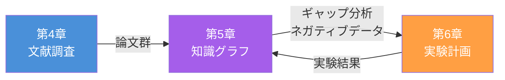

知識グラフと実験計画エージェントが双方向に接続されることで、**実験→知識更新→次の実験**という科学的発見のサイクルが閉じます。

## 本章のまとめ

| トピック | 要点 |
| ---- | ---- |
| 従来のRAGの限界 | グローバルサマリゼーション、分野横断発見、不在の検出が不可能 |
| GraphRAG | テキストから知識グラフを事前構築。コミュニティ検出で俯瞰的要約を生成 |
| Lazy GraphRAG | クエリー時に部分グラフを遅延構築。初期コスト低、動的データに適合 |
| エンティティ設計 | COMPOUND, ORGANISM, DISEASEなど科学的概念分類をスキルで定義 |
| 因果と相関の区別 | 研究デザインに基づく関係型の厳密な使い分け（ドメイン知識） |
| 実験ノート統合 | 失敗データを含むラボノートを同一グラフに統合し、不在を検出 |
| 技術スタック | Neo4j（グラフDB）+ ChromaDB（ベクトルDB）+ LLM |
| 日本語対応 | GiNZAで文ベース分割、bge-m3/text-embedding-3-largeで埋め込み |
| NLP抽出強化 | scispaCy（+81%エンティティ）+ ドメイン辞書（+36.5%品質向上）のハイブリッド |
| 検索モード | Local / Global / DRIFT / LazyGraphRAG の4モードを質問タイプで使い分け |
| 品質評価 | 網羅性・多様性・有用性の3指標（LLM-as-Judge） |
| 使い分け | 動的データ → Lazy GraphRAG、安定コーパス → GraphRAG |

次章では、知識グラフのギャップ分析と文献知見を活用し、ベイズ最適化と実験計画法を組み合わせた実験計画エージェントを設計します。

[^1]: Edge, D., Trinh, H., Cheng, N., et al. (2024). From Local to Global: A Graph RAG Approach to Query-Focused Summarization. *arXiv preprint*. arXiv: 2404.16130
[^2]: Barnett, H., Trinh, H., Edge, D., et al. (2024). LazyGraphRAG: Setting a new standard for quality and cost. *Microsoft Research Blog*. https://www.microsoft.com/en-us/research/blog/lazygraphrag-setting-a-new-standard-for-quality-and-cost/
[^3]: Traag, V.A., Waltman, L., & van Eck, N.J. (2019). From Louvain to Leiden: guaranteeing well-connected communities. *Scientific Reports*, 9, 5233. DOI: 10.1038/s41598-019-41695-z
[^4]: 筆者のQiitaシリーズ「GraphRAGで日本語論文を扱う」第6回で詳細な実装を解説しています。https://qiita.com/hisaho/items/89a49e156b61609e5664
[^5]: 筆者のQiitaシリーズ第7回「検索精度評価とパフォーマンス最適化」で、LLM-as-Judge評価の完全な実装とベンチマーク結果を解説しています。https://qiita.com/hisaho/items/4bf9281e0f6d12d098cd
[^6]: 筆者のQiitaシリーズ第10回「Lazy GraphRAGのNLP最適化：scispaCyによる科学論文検索精度向上の検証」で、scispaCy統合のベンチマーク詳細を解説しています。https://qiita.com/hisaho/items/40b3042371067322ea81
[^7]: 筆者のQiitaシリーズ第11回「Semantic Scholar APIを使ったドメイン辞書統合」で、辞書構築パイプラインとハイブリッドアプローチの実装を解説しています。https://qiita.com/hisaho/items/d8a8ed7d2022b9e60dc5

