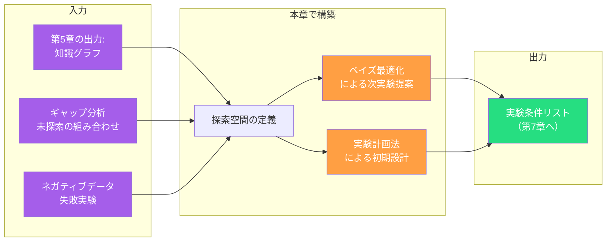
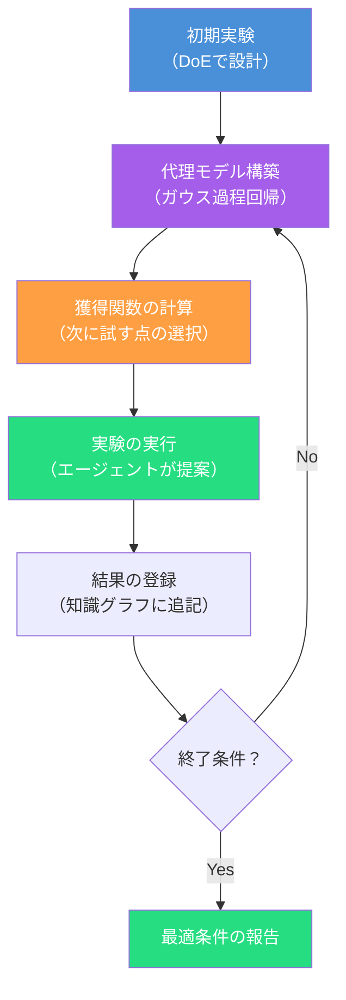
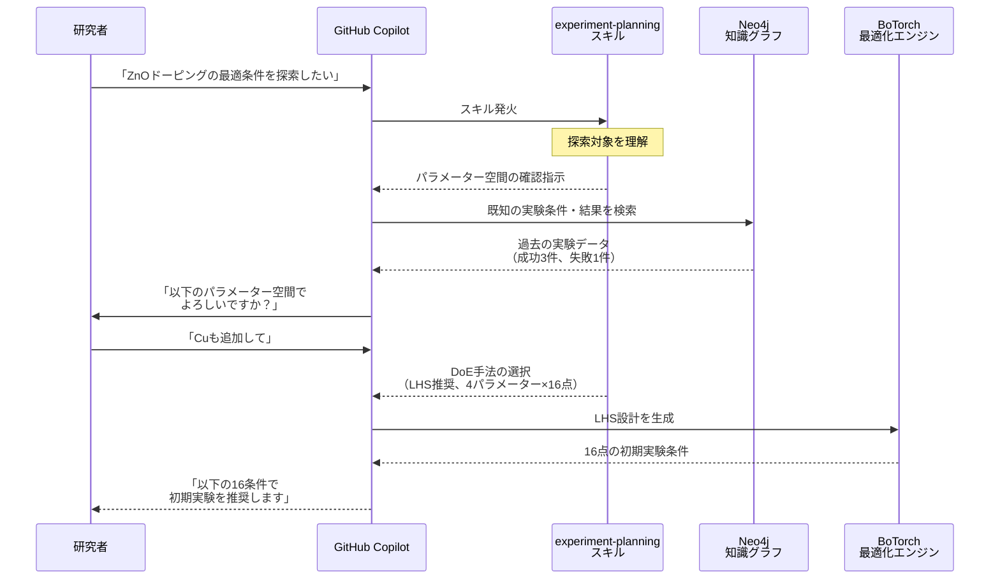
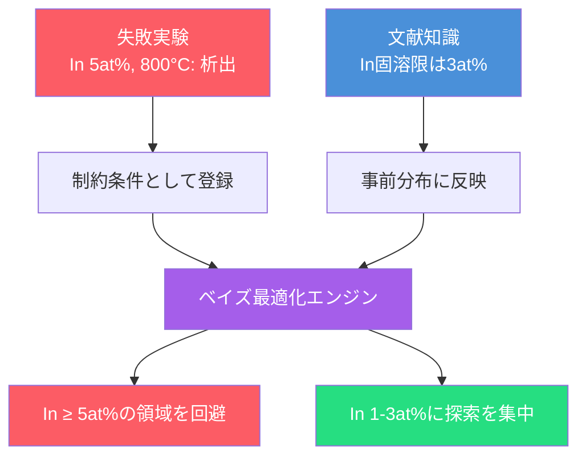
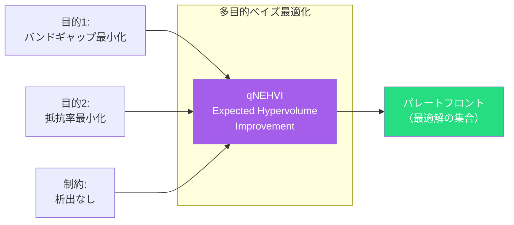
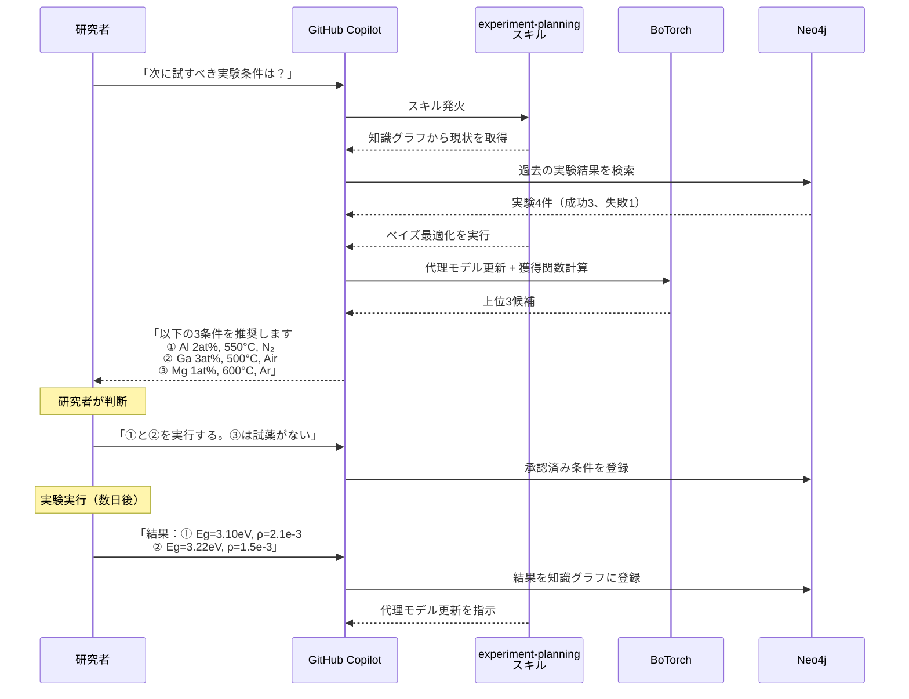

第5章では、論文と実験ノートから知識グラフを構築し、ギャップ分析で「まだ探索されていない領域」を特定しました。しかし、空白領域が見えただけでは研究は進みません。次に必要なのは、**どの条件を、どの順番で、何回試すか** を合理的に決める仕組み — すなわち**実験計画**です。

本章では、知識グラフのギャップ分析と文献知見を入力として、**ベイズ最適化**（Bayesian Optimization）と**実験計画法**（Design of Experiments: DoE）を組み合わせた実験計画エージェントを設計します。



## なぜ実験計画にエージェントが必要か

### 組合せ爆発の問題

科学実験のパラメーター空間は、しばしば組合せ爆発を起こします。第5章の例で考えます。

| パラメーター | 候補数 |
| ---- | ---- |
| ドーピング元素 | 5種（Al, Ga, In, Mg, Cu） |
| ドーピング濃度 | 5段階（1, 2, 3, 4, 5 at%） |
| 焼成温度 | 4段階（400, 500, 600, 800°C） |
| 雰囲気 | 3種（Air, N₂, Ar） |

全組合せ: 5 × 5 × 4 × 3 = **300条件**

1条件に半日かかるとすると、全探索には **150日** — 約半年が必要です。しかし実際に有望な領域は全空間のごく一部であり、すべてを試す必要はありません。

### 研究者が無意識にやっていること

経験豊富な研究者は、過去の知見と直感で探索空間を絞り込みます。

1. 「文献でAlドープが有望だからAlを優先しよう」→ **文献知識による事前分布**
2. 「In 5at%は析出するから除外」→ **ネガティブデータによる制約**
3. 「まず粗い格子で傾向をつかんでから詳細に」→ **階層的探索戦略**

これらの判断は暗黙知であり、属人的です。実験計画エージェントは、**この暗黙知をスキルとして明示化**し、最適化アルゴリズムと組み合わせることで、誰でも再現可能な形にします。

## ベイズ最適化の基本概念

### なぜベイズ最適化か

実験計画の最適化手法には複数の選択肢がありますが、科学実験には**ベイズ最適化**がとくに適しています。

| 手法 | 特徴 | 科学実験との適合性 |
| ---- | ---- | ---- |
| グリッドサーチ | 全組合せを網羅 | ❌ 組合せ爆発で非現実的 |
| ランダムサーチ | ランダムにサンプリング | △ 初期探索には有効だが収束が遅い |
| 遺伝的アルゴリズム | 集団ベースの進化的探索 | △ 大量の評価が必要 |
| **ベイズ最適化** | 既知の結果から未知を予測 | ✅ 少数の実験で効率的に最適解に接近 |

ベイズ最適化が科学実験に適している理由は3つあります。

1. **評価コストが高い**: 1回の実験に数時間〜数日かかるため、試行回数を最小化したい
2. **ブラックボックス関数**: バンドギャップや触媒活性は解析的に計算できず、実験でしか測定できない
3. **事前知識の活用**: 文献データやネガティブデータを事前分布として組み込める

### ベイズ最適化のサイクル



| ステップ | 内容 | 担当 |
| ---- | ---- | ---- |
| **初期実験** | 探索空間を粗くカバーする初期データ点 | DoE（実験計画法） |
| **代理モデル構築** | ガウス過程回帰で目的関数を近似。平均（予測値）と分散（不確実性）を算出 | ツール（BoTorch / Ax） |
| **獲得関数の計算** | 「どこを次に試すともっとも情報が得られるか」を定量化 | ツール（BoTorch / Ax） |
| **実験の実行** | エージェントが研究者に次の実験条件を提案 | エージェント |
| **結果の登録** | 実験結果を知識グラフ（第5章）に追記し、代理モデルを更新 | エージェント + ツール |

### 獲得関数 — 探索と活用のバランス

獲得関数は、「まだ試していない場所のどこがもっとも有望か」を評価する関数です。科学実験では、以下の3つの戦略を使い分けます。

| 獲得関数 | 略称 | 戦略 | 適する場面 |
| ---- | ---- | ---- | ---- |
| **Expected Improvement** | EI | 現在の最良値をどれだけ改善できそうか | 最適値近傍の精密探索 |
| **Upper Confidence Bound** | UCB | 予測値 + 不確実性のバランス | 探索と活用のバランス |
| **Knowledge Gradient** | KG | 1回の実験で得られる知識の増分 | 実験回数が限られる場合 |

:::message
**獲得関数の選択もスキルの責務**

どの獲得関数をいつ使うかの判断基準はスキルに記述します。たとえば、「探索初期（実験回数 < 10）ではUCBで広く探索、中盤以降はEIで精密化、残り回数が3以下ならKGで情報最大化」というルールはドメイン知識です。BoTorchへの具体的な関数呼び出しはツールが担当します。
:::

## 実験計画法（DoE）による初期設計

### なぜ初期設計が重要か

ベイズ最適化を始めるには、代理モデルを構築するための**初期データ**が必要です。この初期データをどのように取るかで、最適化の効率が大きく変わります。

ランダムにサンプリングするのではなく、**実験計画法（DoE）**を使って、パラメーター空間を効率的にカバーする初期点を設計します。

### 主要な実験計画手法

| 手法 | 特徴 | 初期点数の目安 | 適する場面 |
| ---- | ---- | ---- | ---- |
| **Latin Hypercube Sampling** | 各パラメーターの全範囲を均等にカバー | $2d$ 〜 $10d$（$d$: パラメーター数） | もっとも汎用的。最初の選択肢 |
| **Sobol列** | 準ランダム列で均一分布を近似 | 2の冪乗 | 高次元空間 |
| **フルファクトリアル設計** | 全組合せの格子点 | $l^d$（$l$: 水準数） | 低次元・少水準のみ現実的 |
| **D-最適計画** | モデルの情報行列を最大化 | 柔軟（予算に合わせて） | モデルの推定精度を重視 |

4パラメーターの場合、Latin Hypercubeで8〜40点、Sobol列で16点（$2^4$）が目安です。300条件の全探索に比べて、初期実験は**5〜13%**で済みます。

### エージェントによる初期設計の提案



## 知識グラフとの連携 — 文献知識を事前分布に変換する

### 事前知識の活用

ベイズ最適化の強みは、**事前知識を定量的に組み込める**点です。第5章の知識グラフから得られる情報を、ベイズ最適化の事前分布に変換します。

| 知識グラフからの情報 | 事前分布への変換 | 効果 |
| ---- | ---- | ---- |
| 「AlドープZnOのバンドギャップは3.15 eV（自分の実験）」 | Al近傍の予測値を3.15付近に初期化 | 既知データの再利用 |
| 「In 5at%は析出する（失敗実験）」 | In 5at%領域にペナルティ制約を追加 | ムダな実験の回避 |
| 「論文AでGa 2at%が最良と報告」 | Ga 2at%付近の予測値に文献バイアスを加算 | 文献知識の活用 |
| 「Mgドープの報告なし（ギャップ分析）」 | Mg領域の不確実性を高く設定 | 未知領域の積極的探索 |

```python
import torch
from botorch.models import SingleTaskGP
from botorch.models.transforms import Normalize, Standardize

# 知識グラフから取得した既知データ
known_data = {
    "Al_3at%_600C": {"bandgap": 3.15, "source": "experiment"},
    "Ga_2at%_500C": {"bandgap": 3.08, "source": "literature"},
}

# 失敗実験による制約
constraints = [
    {"element": "In", "concentration": ">= 5", "reason": "析出発生"},
]

# 既知データをベイズ最適化の事前データとして設定
train_X = torch.tensor([[...]])  # パラメーターのエンコーディング
train_Y = torch.tensor([[...]])  # 測定値

# ガウス過程回帰モデルの構築
gp = SingleTaskGP(
    train_X, train_Y,
    input_transform=Normalize(d=4),
    outcome_transform=Standardize(m=1)
)
```

### ネガティブデータの活用

第5章で強調した**失敗実験のデータ**は、ベイズ最適化においてとくに重要です。



ネガティブデータの活用方法には、以下の選択肢があります。

| 方法 | 実装 | トレードオフ |
| ---- | ---- | ---- |
| **ハード制約** | 当該領域を探索空間から完全に除外 | 偶然の発見を逃すリスクあり |
| **ソフト制約** | ペナルティ項として目的関数に加算 | バランスの調整が必要 |
| **情報として統合** | 失敗データを低評価の観測値としてモデルに追加 | もっとも自然だが、数値の設定が必要 |

:::message
**制約の強度もスキルの判断**

失敗の原因が物理的に不可避（固溶限の超過）であれば**ハード制約**、再現性が不明（特定ロットの試薬問題かもしれない）であれば**ソフト制約**を適用します。この判断は研究分野の知識に基づくものであり、スキルに記述すべきドメイン知識です。
:::

## 多目的最適化 — 複数の物性を同時に最適化する

### 科学実験における多目的問題

実際の材料開発では、1つの物性だけを最適化することは稀です。たとえば透明導電膜の開発では、**バンドギャップ**と**抵抗率**を同時に最適化する必要があります。

| 目的 | 最適化方向 | 相互関係 |
| ---- | ---- | ---- |
| バンドギャップを下げる（可視光吸収拡大） | 最小化 | ドーピング濃度を上げると低下 |
| 抵抗率を下げる（導電性向上） | 最小化 | ドーピング濃度を上げると低下するが、析出で急上昇 |

これらはしばしば**トレードオフ**の関係にあり、両方を同時に最適化する単一の解は存在しません。代わりに、**パレート最適解の集合**（パレートフロント）を求めます。



### BoTorchによる多目的最適化

BoTorchは、多目的ベイズ最適化のための強力なツールです。qNEHVI（q-Noisy Expected Hypervolume Improvement）獲得関数を用いて、パレートフロントを効率的に探索します。

```python
from botorch.acquisition.multi_objective import (
    qNoisyExpectedHypervolumeImprovement,
)
from botorch.utils.multi_objective.box_decompositions import (
    NondominatedPartitioning,
)

# 参照点（これより悪い解は考慮しない）
ref_point = torch.tensor([-4.0, -1e-1])  # [bandgap, resistivity]

# パレート分割
partitioning = NondominatedPartitioning(
    ref_point=ref_point,
    Y=train_Y  # 既知の観測値
)

# 多目的獲得関数
acqf = qNoisyExpectedHypervolumeImprovement(
    model=gp,
    ref_point=ref_point,
    X_baseline=train_X,
    partitioning=partitioning,
)
```

:::message
**パレートフロントの解釈もスキルの役割**

パレートフロントから「どの解を実際に採用するか」の判断基準は、アプリケーション要件に依存するドメイン知識です。たとえば「透明電極用途では抵抗率 ≤ 10⁻³ Ω·cmが必須なので、この制約を満たす範囲でバンドギャップを最小化する」という優先順位付けは、スキルがLLMに提供します。
:::

## エージェントの実行フロー — 提案から承認まで

### Human-in-the-Loop設計

実験計画エージェントは、第1章の原則3「Human-in-the-Loop」に従い、**実験の実行自体は研究者が判断・承認**します。エージェントが完全自律で実験を進めるのは、第8章のSelf-Driving Laboratoryで扱います。



### 提案の説明可能性

エージェントが提案する実験条件には、**なぜその条件を推奨するのか**の説明を付加します。これは第1章の原則2「ドメイン知識の明示的な注入」の実践でもあります。

| 提案 | 獲得関数値 | 推奨理由 |
| ---- | ---- | ---- |
| Al 2at%, 550°C, N₂ | EI = 0.85 | 既知の Al 3at%/600°C に隣接。550°C は未探索で改善余地あり |
| Ga 3at%, 500°C, Air | EI = 0.72 | 文献でGaドープの有効性が報告済み。500°C は結晶性が良好な温度域 |
| Mg 1at%, 600°C, Ar | UCB = 1.34 | Mg は完全な未探索領域。不確実性が高く、情報獲得価値が大きい |

3番目の提案が獲得関数をEIからUCBに切り替えているのは、スキルが「未探索元素の初回実験では不確実性重視（UCB）で探索する」というルールを適用した結果です。

## スキルの自作 — 実験計画スキル

本章の手法を自分の研究分野に適用するためのスキル設計例を示します。

```yaml
---
name: scientific-experiment-planning
description: |
  実験計画スキル。ベイズ最適化とDoEで次の実験条件を提案。
  「実験計画」「次に試す条件」「最適化」「パラメーター探索」で発火。
tu_tools:
  - key: botorch
    name: BoTorch
    description: ベイズ最適化エンジン（ガウス過程、獲得関数）
  - key: neo4j
    name: Neo4j
    description: 知識グラフ（過去の実験データ取得）
  - key: ax
    name: Ax Platform
    description: 実験管理プラットフォーム（DoE設計、結果記録）
---

# Scientific Experiment Planning

知識グラフの情報を活用し、ベイズ最適化で次の実験条件を提案するスキル。

## When to Use
- 新しい材料・条件の探索を開始したい
- 次に試すべき実験条件を知りたい
- 実験の優先順位を合理的に決めたい
- 多目的最適化でトレードオフを可視化したい

## 入力の確認
1. 目的変数を確認する（最小化/最大化、単目的/多目的）
2. パラメーター空間を知識グラフから取得する
3. 既知の実験データ（成功・失敗）を取得する
4. 文献知識を事前分布に変換する

## 探索戦略の選択
- 初回探索: Latin Hypercube + UCB（広く探索）
- 中盤: EI（有望領域の精密化）
- 終盤（残り3回以下）: KG（情報最大化）

## 制約の適用
- 物理的制約（固溶限等）: ハード制約
- 再現性不明の失敗: ソフト制約
- コスト制約: 試薬コスト・装置時間を制約に追加

## 出力の要件
- 上位3-5候補を提案（理由付き）
- 各候補の獲得関数値と不確実性を提示
- 多目的の場合はパレートフロントを可視化
- 研究者の承認を待つ（自動実行しない）

## 参照スキル
- ← scientific-knowledge-graph（知識グラフからのデータ取得）
- → data-analysis（実験結果の解析）
- → hypothesis-pipeline（新仮説の生成）
```

## 第7章への橋渡し — 実験計画からデータ解析へ

本章で設計した実験計画エージェントは、**研究者が実験を実行するまで**を支援します。次章「データ解析エージェントの実装」では、実験から得られた生データを解析し、知識グラフにフィードバックするサイクルを完成させます。


実験計画→実験実行→データ解析→知識更新のサイクルが閉じることで、**研究のイテレーション全体がエージェントによって加速**されます。

## 本章のまとめ

| トピック | 要点 |
| ---- | ---- |
| 組合せ爆発 | 300条件の全探索は非現実的。効率的な探索戦略が必要 |
| ベイズ最適化 | ガウス過程で目的関数を近似し、獲得関数で次の実験点を選択 |
| 実験計画法（DoE） | Latin Hypercube等で初期データを効率的に設計（全空間の5〜13%） |
| 知識グラフ連携 | 文献知識を事前分布に、失敗データを制約条件に変換 |
| 多目的最適化 | パレートフロントでトレードオフを可視化（qNEHVI） |
| 獲得関数の選択 | 探索段階に応じてEI/UCB/KGを使い分け（スキルの判断） |
| Human-in-the-Loop | 提案は理由付き、実行は研究者が承認。第8章で完全自律化 |
| 技術スタック | BoTorch / Ax + Neo4j + GitHub Copilot |

次章では、実験から得られた生データを可視化・統計解析・異常検知するデータ解析エージェントを実装します。

[^1]: Garnett, R. (2023). *Bayesian Optimization*. Cambridge University Press. https://bayesoptbook.com/
[^2]: Snoek, J., Larochelle, H., & Adams, R.P. (2012). Practical Bayesian Optimization of Machine Learning Hyperparameters. *Advances in Neural Information Processing Systems*, 25.
[^3]: Ax Platform. Meta. https://ax.dev/
