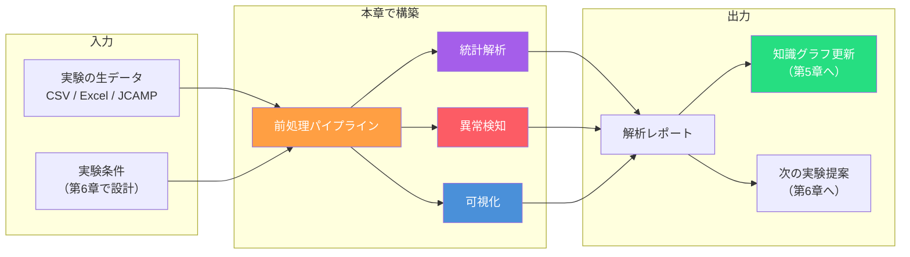
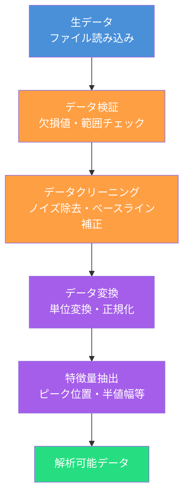
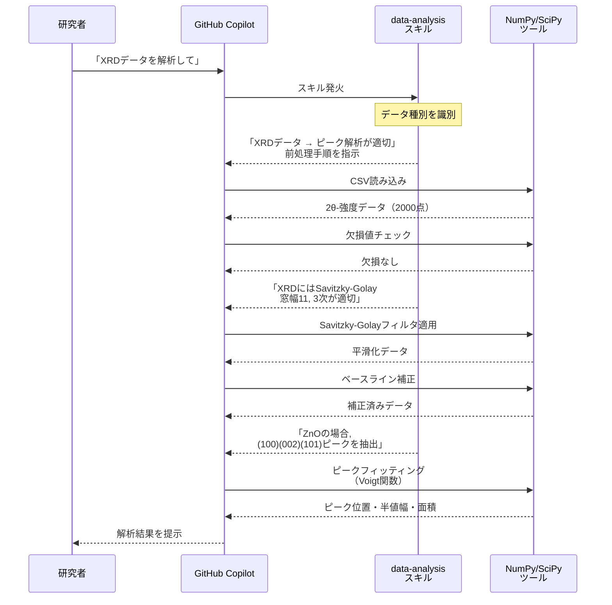
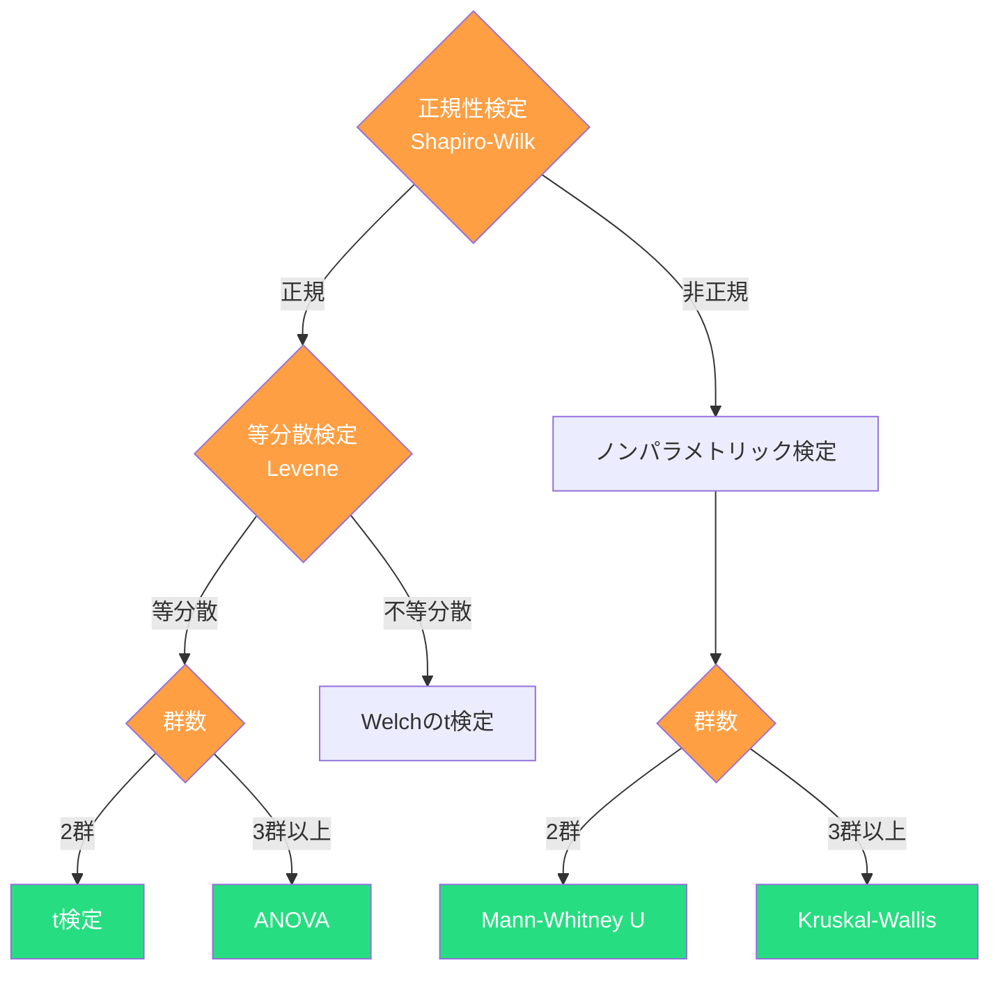
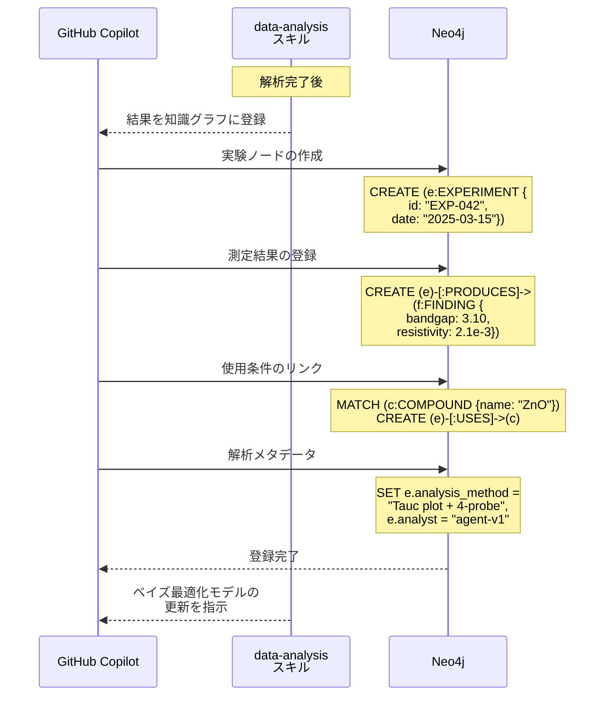

第6章では、ベイズ最適化と実験計画法で「次に試すべき実験条件」を提案するエージェントを設計しました。しかし、実験が終わればデータが生まれ、そのデータを正しく解析しなければ次のイテレーションに進めません。

本章では、実験から得られた**生データ（Raw Data）**を取り込み、前処理・可視化・統計解析・異常検知を行い、結果を知識グラフにフィードバックする**データ解析エージェント**を実装します。



## 科学データの特殊性

### なぜ汎用のデータ解析では不十分か

科学実験のデータは、ビジネスデータとは異なる特殊性を持ちます。

| 特性 | 科学データ | ビジネスデータ |
| ---- | ---- | ---- |
| データ量 | 数件〜数十件（高コスト） | 数千〜数百万件 |
| 次元 | 高次元（多パラメーター） | 比較的低次元 |
| ノイズ | 装置由来・環境由来の系統誤差 | ランダムノイズが主 |
| 単位・スケール | 物理単位が重要（eV, Ω·cm, nm） | 通貨・個数が中心 |
| 再現性 | 同条件でもバッチ間変動あり | データは確定値 |
| ファイル形式 | JCAMP-DX, CIF, HDF5 等の専門形式 | CSV, JSON が主流 |

これらの特殊性に対応するため、データ解析エージェントには**ドメイン知識を注入したスキル**が不可欠です。

### 典型的な科学データの形式

| 分野 | 主なデータ形式 | 含まれる情報 |
| ---- | ---- | ---- |
| X線回折（XRD） | CSV, JCAMP-DX | 2θ-強度プロファイル |
| 光学特性 | CSV, ASCII | 波長-透過率/吸収率 |
| 電気特性 | CSV, Excel | I-V曲線、ホール測定 |
| 質量分析 | mzML, CSV | m/z-強度スペクトル |
| 顕微鏡画像 | TIFF, DM3, HDF5 | 電子顕微鏡像 |
| シーケンシング | FASTQ, BAM | 塩基配列データ |

## データ前処理パイプライン

### パイプラインの全体構成



### 前処理の各ステップとスキル/ツールの切り分け

第3章で確立した判断基準に基づき、前処理の各ステップを**スキル**と**ツール**に分けます。

| ステップ | 処理内容 | 分類 | 理由 |
| ---- | ---- | ---- | ---- |
| ファイル読み込み | CSV/JCAMP/HDF5パーサー | ツール | 決定論的な I/O 処理 |
| 欠損値の検出 | 欠損パターンの判定 | ツール | 単純なルールベース処理 |
| 欠損値の対処法選択 | 補間/除外/代入の判断 | **スキル** | データの性質に応じたLLM判断 |
| ノイズ除去 | Savitzky-Golay, 移動平均等 | ツール | 数値計算 |
| フィルターのパラメーター選択 | 窓幅・次数の決定 | **スキル** | データの特性に基づく判断 |
| ベースライン補正 | 非対称最小二乗法等 | ツール | 数値計算 |
| 単位変換 | eV↔nm, Pa↔atm | ツール | 決定論的な計算 |
| 特徴量の選択 | どの物理量を抽出するか | **スキル** | 解析目的に依存する判断 |
| 特徴量の計算 | ピークフィッティング等 | ツール | 数値計算 |

:::message
**判断はスキル、計算はツール**

前処理パイプラインでは、「何をどう処理するか」の判断とルール選択をスキルが担い、実際の数値計算をツールが実行します。この分離により、同じ計算コードを異なるドメインのスキルで再利用できます。
:::

### 前処理の実行例 — XRDデータ



## 統計解析と仮説検定

### 実験データの統計処理

科学データの解析では、**測定値が偶然のばらつきか有意な差か**を判定する統計処理が不可欠です。

| 解析手法 | 用途 | 適用条件 |
| ---- | ---- | ---- |
| t検定 | 2群の平均値比較 | 正規分布・等分散 |
| 分散分析（ANOVA） | 3群以上の平均値比較 | 正規分布・等分散 |
| Mann-Whitney U検定 | 2群の比較（ノンパラメトリック） | 正規分布でない場合 |
| Kruskal-Wallis検定 | 3群以上の比較（ノンパラメトリック） | 正規分布でない場合 |
| 線形回帰 | パラメーターと物性の関係 | 線形関係の仮定 |
| 相関分析 | パラメーター間の相関 | 連続変数 |

### エージェントによる統計手法の選択

統計手法の選択は、データの性質に基づく判断であり、スキルが担います。



:::message
**統計手法の選択フローをスキルに実装**

上記の判定フローは、統計の教科書に書かれた定型的な手順です。しかし実際の実験データでは「N=5で正規性検定は有意義か」「外れ値を含むときの処理は」など、文脈に応じた判断が求められます。これらの判断基準をスキルに明示することで、統計の専門知識がない研究者でも適切な手法を選択できます。
:::

```python
from scipy import stats
import numpy as np

def select_statistical_test(groups: list[np.ndarray]) -> dict:
    """データの性質に基づいて適切な統計検定を選択する"""
    n_groups = len(groups)
    
    # 正規性検定（各群）
    normality = all(
        stats.shapiro(g).pvalue > 0.05 for g in groups if len(g) >= 3
    )
    
    if normality and n_groups == 2:
        # 等分散検定
        _, p_levene = stats.levene(*groups)
        if p_levene > 0.05:
            stat, p = stats.ttest_ind(*groups)
            return {"test": "t-test", "statistic": stat, "p_value": p}
        else:
            stat, p = stats.ttest_ind(*groups, equal_var=False)
            return {"test": "Welch's t-test", "statistic": stat, "p_value": p}
    
    elif normality and n_groups >= 3:
        stat, p = stats.f_oneway(*groups)
        return {"test": "ANOVA", "statistic": stat, "p_value": p}
    
    elif not normality and n_groups == 2:
        stat, p = stats.mannwhitneyu(*groups)
        return {"test": "Mann-Whitney U", "statistic": stat, "p_value": p}
    
    else:
        stat, p = stats.kruskal(*groups)
        return {"test": "Kruskal-Wallis", "statistic": stat, "p_value": p}
```

## 異常検知 — 外れ値と装置異常の検出

### 科学データにおける外れ値の扱い

科学データの外れ値は、単なるノイズとは限りません。**新発見の端緒**である可能性もあります。

| 外れ値の種類 | 原因 | 対応 |
| ---- | ---- | ---- |
| 装置異常 | 検出器の飽和、温度制御の失敗 | 除外（再実験が望ましい） |
| 試料異常 | 試料の不均一性、汚染 | 要調査（原因特定後に判断） |
| 物理的特異点 | 相転移、臨界現象 | **保持** — 科学的に重要な発見の可能性 |
| 入力ミス | 単位の間違い、転記ミス | 修正（元データと照合） |

:::message
**外れ値の判断はスキルの最重要責務の1つ**

外れ値を機械的に除外すると、科学的に重要なシグナルを見落とすリスクがあります。一方、すべての外れ値を残すと解析精度が低下します。この判断には「データの物理的な意味」の理解が必要であり、まさにスキルが提供すべきドメイン知識です。
:::

### 異常検知の手法

| 手法 | 原理 | 適する場面 |
| ---- | ---- | ---- |
| **IQR法** | 四分位範囲の1.5倍超 | 小規模データの簡易検出 |
| **Grubbsの検定** | 最大偏差の統計的有意性 | 正規分布データの単一外れ値 |
| **Isolation Forest** | ランダムフォレストによる孤立度 | 多変量データの異常検知 |
| **時系列異常検知** | 移動平均からの逸脱 | 連続測定データ |

```python
from sklearn.ensemble import IsolationForest
import pandas as pd

def detect_anomalies(df: pd.DataFrame, features: list[str]) -> pd.DataFrame:
    """多変量データの異常検知"""
    clf = IsolationForest(contamination=0.1, random_state=42)
    df["anomaly"] = clf.fit_predict(df[features])
    
    anomalies = df[df["anomaly"] == -1]
    return anomalies
```

## 可視化 — 解析結果を研究者に伝える

### 科学可視化の原則

データ解析エージェントは、解析結果を研究者が直感的に理解できる形で可視化します。

| 可視化タイプ | 用途 | ライブラリ |
| ---- | ---- | ---- |
| 散布図 + 回帰線 | パラメーター vs 物性の関係 | matplotlib / plotly |
| ヒートマップ | 2パラメーターの交互作用 | seaborn |
| パレート図 | 多目的最適化の結果 | plotly |
| バイオリンプロット | 分布の比較 | seaborn |
| XRDパターン重ね描き | 条件間の結晶構造比較 | matplotlib |

### エージェントが生成する可視化の例

```python
import matplotlib.pyplot as plt
import numpy as np

def plot_optimization_progress(
    iterations: list[int],
    best_values: list[float],
    uncertainties: list[float],
    target_name: str = "バンドギャップ (eV)"
):
    """ベイズ最適化の収束過程を可視化"""
    fig, ax = plt.subplots(figsize=(10, 6))
    
    ax.plot(iterations, best_values, "o-", color="#a55eea", label="最良値")
    ax.fill_between(
        iterations,
        np.array(best_values) - np.array(uncertainties),
        np.array(best_values) + np.array(uncertainties),
        alpha=0.2, color="#a55eea"
    )
    
    ax.set_xlabel("実験回数")
    ax.set_ylabel(target_name)
    ax.set_title("ベイズ最適化の収束過程")
    ax.legend()
    
    return fig
```

:::message
**可視化のカスタマイズもスキルの責務**

「XRDデータにはCu Kα1/Kα2のピーク分離を示す」「バンドギャップの推定にはTaucプロットを使う」といった分野固有の可視化手法は、スキルが指示しツールが生成します。
:::

## 知識グラフへのフィードバック

### 解析結果を知識グラフに登録

データ解析の結果は、第5章で構築した知識グラフに登録します。これにより、実験→解析→知識更新のサイクルが閉じます。



登録のCypherクエリ例を示します。

```cypher
// 実験結果の登録
CREATE (exp:EXPERIMENT {
  id: "EXP-042",
  date: date("2025-03-15"),
  conditions: "Al 2at%, 550°C, N₂, 2h"
})

// 材料との関連付け
MATCH (c:COMPOUND {name: "ZnO"})
CREATE (exp)-[:USES]->(c)

// 測定結果の登録
CREATE (finding:FINDING {
  bandgap_eV: 3.10,
  resistivity_ohm_cm: 2.1e-3,
  method: "Tauc plot + 4-probe"
})
CREATE (exp)-[:PRODUCES]->(finding)

// 文献との比較データ登録
MATCH (study:STUDY {doi: "10.xxxx/yyyy"})
CREATE (exp)-[:REPORTS {
  comparison: "文献値3.15eVに対し3.10eV（-1.6%）"
}]->(study)
```

### 解析レポートの自動生成

エージェントは、解析結果を構造化したレポートとして出力します。

```markdown
## 実験解析レポート: EXP-042

### 条件
| パラメーター | 値 |
| ---- | ---- |
| ドーピング元素 | Al |
| ドーピング濃度 | 2 at% |
| 焼成温度 | 550°C |
| 雰囲気 | N₂ |

### 主要結果
| 物性 | 測定値 | 文献値 | 差異 |
| ---- | ---- | ---- | ---- |
| バンドギャップ | 3.10 eV | 3.15 eV | -1.6% |
| 抵抗率 | 2.1×10⁻³ Ω·cm | 3.0×10⁻³ Ω·cm | -30% |

### 統計的評価
- p値 = 0.023 → 文献値との有意差あり（t検定, α=0.05）

### 考察
- バンドギャップの低下は焼成温度の低下（600→550°C）による結晶性の変化が寄与と推察
- 抵抗率は文献値より良好。N₂雰囲気が酸素欠陥を増加させた可能性

### 推奨次ステップ
- ベイズ最適化モデル更新 → Al 2at%, 500°C, N₂ を次候補に追加
```

## スキルの自作 — データ解析スキル

```yaml
---
name: scientific-data-analysis
description: |
  科学データ解析スキル。前処理・統計解析・異常検知・可視化を実行。
  「データ解析」「結果を解析」「XRDを解析」「統計検定」で発火。
tu_tools:
  - key: numpy
    name: NumPy
    description: 数値計算
  - key: scipy
    name: SciPy
    description: 統計検定・信号処理・フィッティング
  - key: matplotlib
    name: Matplotlib
    description: 科学可視化
  - key: pandas
    name: pandas
    description: データフレーム操作
  - key: neo4j
    name: Neo4j
    description: 知識グラフへの結果登録
---

# Scientific Data Analysis

実験の生データを解析し、知識グラフにフィードバックするスキル。

## When to Use
- 実験データを前処理・解析したい
- 統計検定で有意差を判定したい
- 外れ値や異常データを検出したい
- 解析結果を知識グラフに登録したい

## 前処理プロトコル
1. データの種別を識別する（XRD, UV-Vis, I-V等）
2. 分野に適した前処理手順を適用する
3. 前処理パラメーターの選択理由を記録する

## 統計手法の選択
- 正規性検定（Shapiro-Wilk）→ 等分散検定（Levene）→ 適切な検定を選択
- N < 10 の場合はノンパラメトリック検定を優先
- 多重比較の場合はBonferroni補正を適用

## 外れ値の判定
- 物理的に不可能な値 → 除外（理由を記録）
- 物理的に起こりうるが稀な値 → 保持してフラグ付与
- 判断に迷う場合 → 研究者に確認を求める

## 出力の要件
- 解析レポートをMarkdownで生成
- すべての数値に単位と有効数字を明記
- 結果を知識グラフに登録
- ベイズ最適化モデルの更新を通知

## 参照スキル
- ← scientific-experiment-planning（実験条件の取得）
- ← scientific-knowledge-graph（過去データとの比較）
- → scientific-experiment-planning（次の実験提案への入力）
```

## 本章のまとめ

| トピック | 要点 |
| ---- | ---- |
| 科学データの特殊性 | 少量・高次元・専門形式。汎用ツールだけでは不十分 |
| 前処理パイプライン | 検証→クリーニング→変換→特徴量抽出の4段階 |
| スキル/ツール分離 | 判断（手法選択・パラメーター設定）＝スキル、計算＝ツール |
| 統計解析 | 正規性・等分散をチェックし適切な検定を自動選択 |
| 異常検知 | 外れ値を一律除外せず、物理的意味を考慮して判断 |
| 可視化 | 分野固有のプロット手法をスキルが指示 |
| 知識グラフ連携 | 解析結果をNeo4jに登録し、次の実験計画に活用 |
| 解析レポート | 条件・結果・統計・考察・次ステップを構造化出力 |

次章では、実験計画（第6章）とデータ解析（本章）を**自動的に繰り返す**完全自律実験システム — Self-Driving Laboratoryを実現します。

[^1]: Savitzky, A., & Golay, M.J.E. (1964). Smoothing and Differentiation of Data by Simplified Least Squares Procedures. *Analytical Chemistry*, 36(8), 1627-1639.
[^2]: scikit-learn: Isolation Forest. https://scikit-learn.org/stable/modules/generated/sklearn.ensemble.IsolationForest.html
