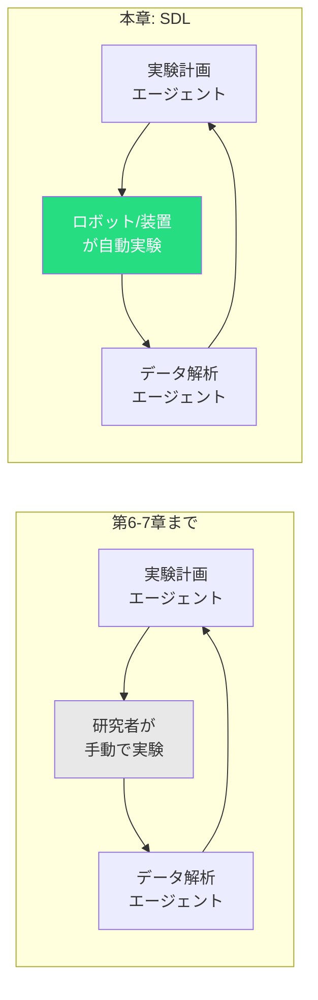
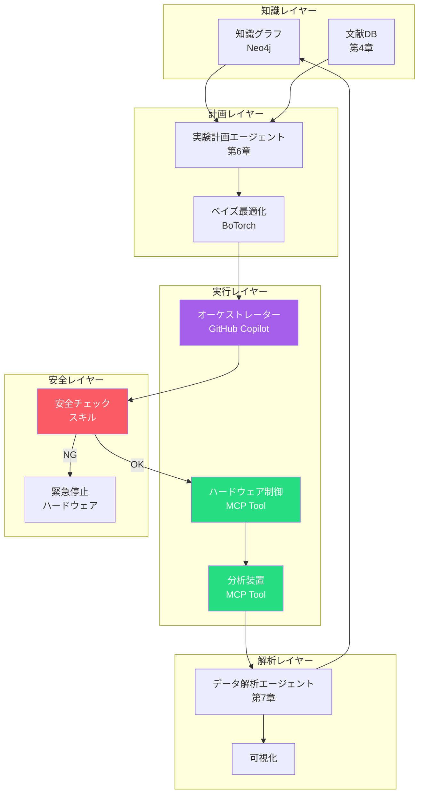
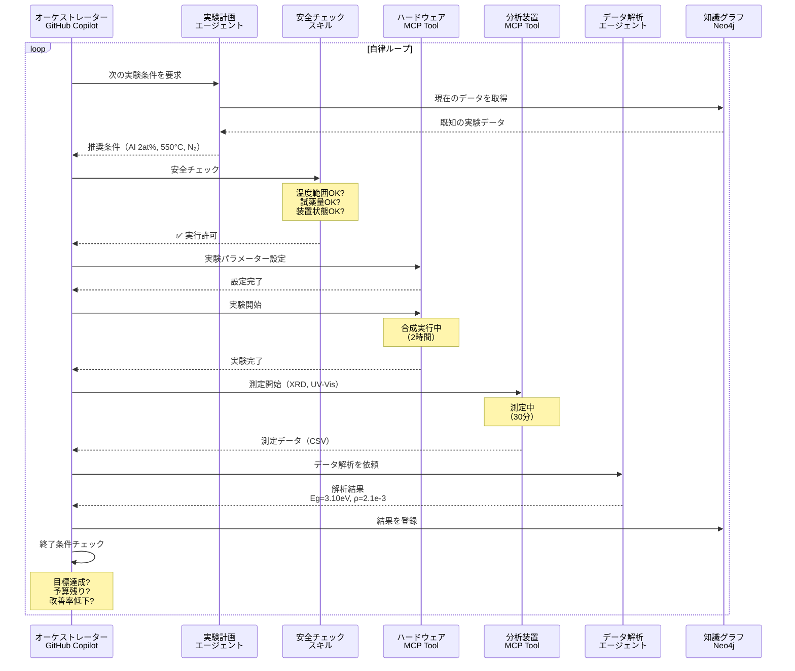
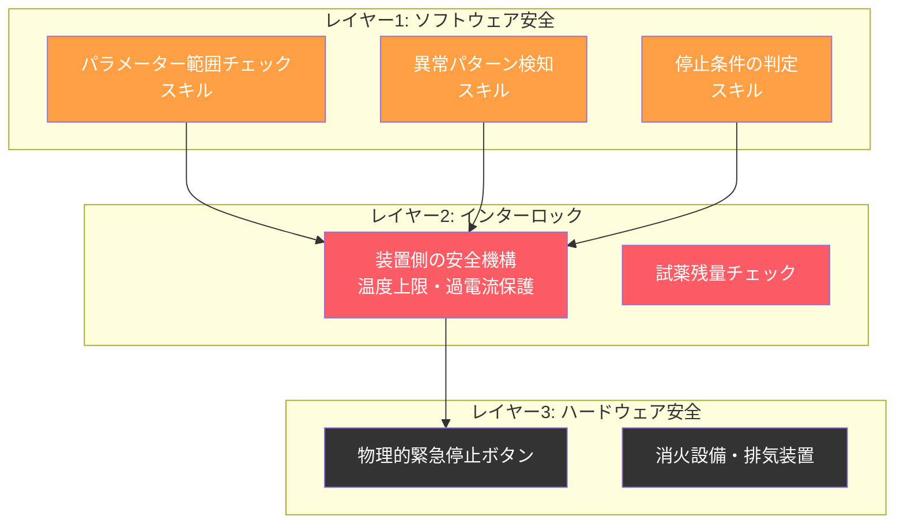
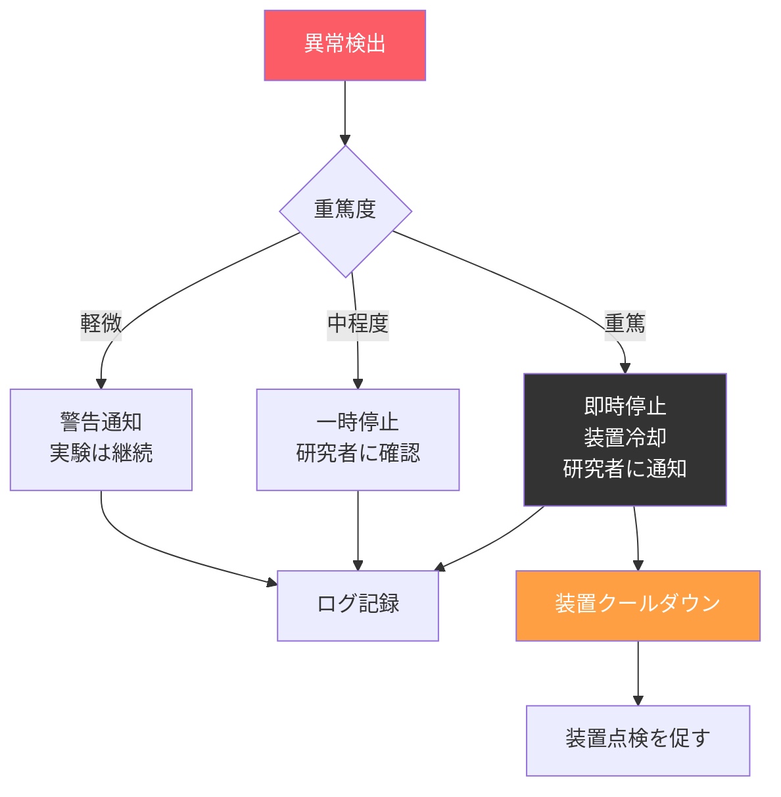
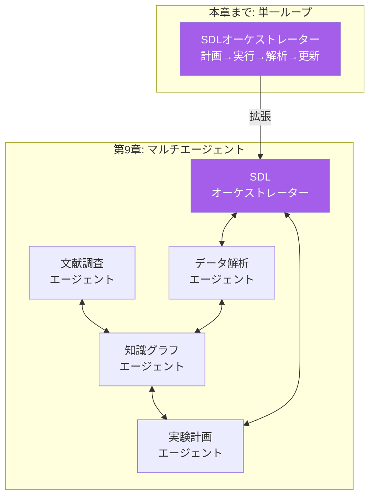

第6章で実験計画エージェント、第7章でデータ解析エージェントを構築しました。これまでのワークフローでは、**実験の実行は研究者が手動で行い**、結果をエージェントに入力していました。

本章では、このループを**完全に自動化**し、実験計画→実験実行→データ解析→知識更新→次の実験計画のサイクルを自律的に回す **Self-Driving Laboratory（SDL）** のアーキテクチャを設計します。

:::message alert
**注意: 実験の完全自律化は段階的に**

自律実験の導入は、必ず段階的に行ってください。いきなり完全自律モードで夜間稼働するのではなく、まず**監視付き自律モード**で十分な検証を経てから段階を上げます。第1章の原則4「Safety（安全性）」のもっとも重要な実践です。
:::



## Self-Driving Laboratoryとは

### SDLの定義と構成要素

Self-Driving Laboratory（SDL）は、仮説生成から実験実行、データ解析までを**自律的に繰り返す**実験システムです[^1]。

| 構成要素 | 役割 | 本書での対応 |
| ---- | ---- | ---- |
| **オーケストレーター** | 全体制御と判断 | GitHub Copilot + SATORIスキル |
| **計画エンジン** | 次の実験条件を決定 | 第6章の実験計画エージェント |
| **実験ハードウェア** | 物理的な実験の実行 | ロボットアーム、合成装置、分析装置 |
| **データパイプライン** | 生データの取得と前処理 | 第7章のデータ解析エージェント |
| **知識ベース** | 蓄積された実験データと文献知識 | 第5章の知識グラフ |

### SDLの成熟度レベル

SDLの導入は段階的に進めるべきです。各レベルの特徴と要件を示します。

| レベル | 名称 | 自律性 | 人間の関与 | 安全性要件 |
| ---- | ---- | ---- | ---- | ---- |
| **Level 0** | 手動実験 | なし | すべて手動 | 通常の実験室安全基準 |
| **Level 1** | 支援型 | 計画の提案 | 実験実行+検証 | 第6-7章の水準 |
| **Level 2** | 半自律型 | 計画+データ解析 | 実行の承認+結果確認 | 停止条件の事前定義 |
| **Level 3** | 監視付き自律型 | 全サイクル自動 | 異常時の介入 | リアルタイム監視必須 |
| **Level 4** | 完全自律型 | 全サイクル自動+夜間稼働 | 事後レビューのみ | 自動安全停止機構必須 |

:::message
**多くのラボではLevel 2-3を目指すのが現実的**

完全自律（Level 4）には高度なハードウェア統合と安全機構が必要であり、専用の設備投資が前提です。本書のSATORI+GitHub Copilotアプローチは、**Level 1（手動→Level 2（半自律）への移行**をもっとも効率的に支援します。Level 3以降はハードウェア制御インターフェイスの整備が鍵になります。
:::

## SDLのアーキテクチャ

### 全体構成



### 実行ループの詳細

SDLの自律ループは以下のように動作します。



## ハードウェア制御 — MCPツールとしての装置統合

### 科学装置のMCPインターフェイス

第3章で学んだとおり、外部システムとの通信は**MCPツール**が担当します。SDLでは、実験装置と分析装置をMCPサーバーとしてラップし、GitHub Copilotから直接制御します。

| 装置カテゴリー | 具体例 | MCPツールの責務 |
| ---- | ---- | ---- |
| **合成装置** | スパッタリング装置、CVD、溶液合成ロボット | パラメーター設定、プロセス実行、状態監視 |
| **分析装置** | XRD、UV-Vis、SEM、AFM | 測定パラメーター設定、測定実行、データ取得 |
| **環境制御** | グローブボックス、クリーンベンチ | 雰囲気制御、温湿度監視 |
| **試料搬送** | ロボットアーム、ステージ | 試料の移動、ポジショニング |

### MCPサーバーの設計例

```typescript
// 合成装置の MCP Tool 定義（概念例）
const sputteringTool = {
  name: "sputter_deposit",
  description: "スパッタリング装置でZnO薄膜を成膜する",
  inputSchema: {
    type: "object",
    properties: {
      target: {
        type: "string",
        description: "ターゲット材料（例: ZnO, ZnO:Al）"
      },
      power_W: {
        type: "number",
        description: "RF出力（W）",
        minimum: 50,
        maximum: 300
      },
      pressure_Pa: {
        type: "number",
        description: "成膜圧力（Pa）",
        minimum: 0.1,
        maximum: 10
      },
      duration_min: {
        type: "number",
        description: "成膜時間（分）",
        minimum: 1,
        maximum: 120
      },
      substrate_temp_C: {
        type: "number",
        description: "基板温度（°C）",
        minimum: 25,
        maximum: 800
      },
      gas_atmosphere: {
        type: "string",
        enum: ["Ar", "Ar/O2", "N2"],
        description: "雰囲気ガス"
      }
    },
    required: ["target", "power_W", "pressure_Pa",
               "duration_min", "substrate_temp_C", "gas_atmosphere"]
  }
};
```

:::message
**MCPインターフェイスの標準化が鍵**

装置メーカーごとに制御プロトコルが異なるのが現状です。MCPサーバーとしてラップすることで、上位のエージェントは装置の違いを意識せず「成膜する」「測定する」というセマンティックなコマンドを発行できます。この抽象化がSDLの汎用性を高めます。
:::

## 安全設計 — 自律実験のリスク管理

### 安全チェックの3層構造

SDLの安全設計は、第1章の原則4「Safety」をもっとも徹底的に実践する部分です。



### ソフトウェア安全チェックの実装

安全チェックスキルの主要な検証項目を示します。

| チェック項目 | 内容 | 検出時のアクション |
| ---- | ---- | ---- |
| パラメーター範囲 | 設定値が装置の許容範囲内か | 実験中止 + 警告 |
| 異常トレンド | 温度の異常上昇、圧力の急変 | 実験中止 + 装置冷却 |
| 試薬残量 | 次の実験に必要な試薬があるか | 実験スキップ + 通知 |
| 累積運転時間 | 装置のメンテナンス周期を超過していないか | 実験延期 + メンテナンス通知 |
| データ品質 | 測定データにノイズ混入の兆候がないか | 再測定を提案 |
| 収束判定 | ベイズ最適化の改善率が閾値以下か | ループ終了を提案 |

```python
class SafetyChecker:
    """SDL安全チェッカー"""
    
    def __init__(self, equipment_limits: dict):
        self.limits = equipment_limits
    
    def check_parameters(self, params: dict) -> tuple[bool, str]:
        """パラメーターが装置の許容範囲内かチェック"""
        for key, value in params.items():
            if key in self.limits:
                min_val, max_val = self.limits[key]
                if not (min_val <= value <= max_val):
                    return False, (
                        f"⚠️ {key}={value} は許容範囲外"
                        f"（{min_val}〜{max_val}）"
                    )
        return True, "✅ 全パラメーター正常"
    
    def check_trend(
        self, 
        history: list[float], 
        threshold: float = 3.0
    ) -> tuple[bool, str]:
        """過去の測定値から異常トレンドを検出"""
        if len(history) < 3:
            return True, "データ不足（3点未満）"
        
        import numpy as np
        mean = np.mean(history[:-1])
        std = np.std(history[:-1])
        latest = history[-1]
        
        if std > 0 and abs(latest - mean) > threshold * std:
            return False, (
                f"⚠️ 最新値 {latest:.3f} が過去平均 {mean:.3f} から"
                f" {threshold}σ 以上乖離"
            )
        return True, "✅ トレンド正常"
```

### 緊急停止のプロトコル



:::message
**ハードウェア安全はソフトウェアに委ねない**

装置の最終的な安全機構（温度ヒューズ、過電流ブレーカー等）は、AIとは独立した物理的メカニズムである必要があります。ソフトウェアのバグやネットワーク障害で安全機構が無効になってはなりません。
:::

## 終了条件の設計 — いつ自律ループを止めるか

### 収束判定

SDLの自律ループには、適切な終了条件が必要です。

| 終了条件 | 判定方法 | 典型的な閾値 |
| ---- | ---- | ---- |
| **目標達成** | 目的関数が目標値に到達 | Eg ≤ 3.0eV かつ ρ ≤ 10⁻³ Ω·cm |
| **改善率低下** | 直近N回の改善率が閾値以下 | 5回連続で改善率 < 1% |
| **予算消費** | 実験回数またはコストが上限に到達 | 50回 / 100万円 |
| **飽和検出** | ガウス過程の不確実性が全域で低下 | 最大不確実性 < 閾値 |
| **時間制約** | 指定の稼働時間に到達 | 72時間 |

```python
class ConvergenceChecker:
    """SDLの収束判定"""
    
    def __init__(
        self, 
        target: dict,
        max_iterations: int = 50,
        patience: int = 5,
        min_improvement: float = 0.01
    ):
        self.target = target
        self.max_iterations = max_iterations
        self.patience = patience
        self.min_improvement = min_improvement
        self.history: list[float] = []
    
    def check(
        self, 
        iteration: int, 
        best_value: float
    ) -> tuple[bool, str]:
        """終了条件のチェック"""
        self.history.append(best_value)
        
        # 目標達成
        if best_value <= self.target.get("threshold", float("-inf")):
            return True, "🎯 目標値に到達しました"
        
        # 予算消費
        if iteration >= self.max_iterations:
            return True, "📊 最大実験回数に到達しました"
        
        # 改善率低下
        if len(self.history) >= self.patience:
            recent = self.history[-self.patience:]
            improvement = abs(recent[-1] - recent[0]) / abs(recent[0])
            if improvement < self.min_improvement:
                return True, (
                    f"📉 直近{self.patience}回の改善率が"
                    f"{self.min_improvement*100}%未満です"
                )
        
        return False, f"▶ 継続（{iteration}/{self.max_iterations}）"
```

## 現実的な導入ステップ

### Level 1→Level 2への移行パス

多くの研究室では、まず **Level 1（支援型）** から始め、段階的にLevel 2（半自律型）へ移行するのが現実的です。

| ステップ | 内容 | 期間目安 | 必要なもの |
| ---- | ---- | ---- | ---- |
| 1. スキル整備 | 実験計画・データ解析スキルの作成 | 1-2週間 | SATORI + GitHub Copilot |
| 2. 手動稼働 | 研究者が手動で実験、エージェントで解析 | 1-2か月 | 既存の実験環境 |
| 3. 装置接続 | 分析装置のMCPインターフェイス構築 | 2-4週間 | 装置のAPI/SDK |
| 4. 半自律化 | 測定の自動化（合成は手動） | 1か月 | MCP Server + 安全チェック |
| 5. 検証稼働 | 監視付きで全サイクルを試行 | 1-2か月 | 安全機構の整備 |
| 6. 本格稼働 | Level 3（監視付き自律型）へ | — | 十分な検証実績 |

### コスト対効果

| 項目 | 手動実験 | SDL（Level 2） | 効果 |
| ---- | ---- | ---- | ---- |
| 実験計画の時間 | 2-3時間/回 | 5分/回 | **95%削減** |
| データ解析の時間 | 1-2時間/回 | 10分/回 | **90%削減** |
| 実験スループット | 2-3回/日 | 5-8回/日（装置依存） | **2-3倍** |
| 最適化に要する実験回数 | 50-100回（試行錯誤） | 15-25回（BO活用） | **60-75%削減** |
| 人為ミスの発生率 | 記録忘れ、転記ミス | 自動記録 | **ほぼゼロ** |

## スキルの自作 — SDL制御スキル

```yaml
---
name: scientific-sdl-orchestrator
description: |
  Self-Driving Laboratory制御スキル。
  「自律実験」「SDLを開始」「夜間実験」「連続実験」で発火。
tu_tools:
  - key: botorch
    name: BoTorch
    description: ベイズ最適化（実験計画）
  - key: neo4j
    name: Neo4j
    description: 知識グラフ（実験記録）
  - key: equipment_mcp
    name: 装置制御MCP
    description: 実験装置のMCPインターフェイス
---

# Scientific SDL Orchestrator

実験計画→実行→解析→知識更新のループを自律的に制御するスキル。

## When to Use
- 連続的な条件探索を自動化したい
- 夜間・週末に実験を走らせたい
- ベイズ最適化ループを自動で回したい

## 自律レベルの選択
- Level 2（半自律）: 各実験前に研究者の承認を求める
- Level 3（監視付き自律）: 異常時のみ停止・通知
- Level 4（完全自律）: 事前に全パラメーターの安全範囲を定義

## 安全チェック（必須）
1. 全パラメーターが装置の許容範囲内か
2. 試薬・消耗品の残量は十分か
3. 装置の累積運転時間はメンテナンス周期内か
4. 前回の実験データに異常はないか

## 終了条件
- 目標値に到達
- 改善率が閾値を下回る
- 実験回数が上限に到達
- 安全上の問題が検出された場合は即時停止

## 参照スキル
- ← scientific-experiment-planning（実験計画）
- ← scientific-data-analysis（データ解析）
- ← scientific-knowledge-graph（知識グラフ）
```

## 第9章への橋渡し — SDL×マルチエージェント

本章で設計したSDLは、**1つの実験系**を対象としたループでした。しかし現実の研究プロジェクトでは、複数のエージェントが異なる役割で連携し、全体としてのパイプラインを構成します。



次章では、第4-8章で作ったエージェント群を**マルチエージェント・パイプライン**として統合し、エージェント間通信のプロトコルやタスクの分散管理を設計します。

## 本章のまとめ

| トピック | 要点 |
| ---- | ---- |
| SDLの定義 | 仮説生成→実験実行→解析→知識更新の自律ループ |
| 成熟度レベル | Level 0-4の5段階。多くのラボではLevel 2-3が現実的 |
| アーキテクチャ | 知識・計画・実行・解析・安全の5レイヤー構成 |
| ハードウェア統合 | 装置をMCPサーバーとしてラップし抽象化 |
| 安全設計 | ソフトウェア・インターロック・ハードウェアの3層 |
| 終了条件 | 目標達成、改善率低下、予算消費、飽和検出 |
| 導入ステップ | Level 1→2への段階的移行（3-6か月） |
| コスト対効果 | 実験スループット2-3倍、最適化の実験回数60-75%削減 |

次章では、本章までに構築したエージェント群を**マルチエージェント・パイプライン**として統合するアーキテクチャを設計します。

[^1]: Abolhasani, M., & Kumacheva, E. (2023). The rise of self-driving labs in chemical and materials sciences. *Nature Synthesis*, 2, 483-492. https://doi.org/10.1038/s44160-022-00231-0
[^2]: MacLeod, B.P., et al. (2020). Self-driving laboratory for accelerated discovery of thin-film materials. *Science Advances*, 6(20), eaaz8867.
