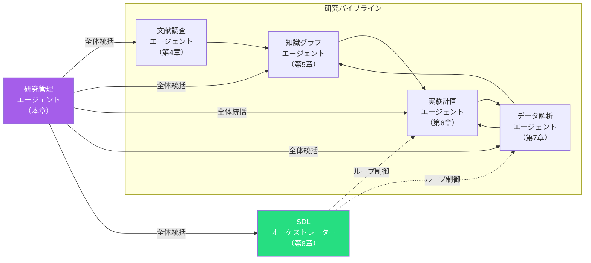
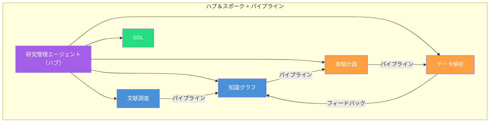
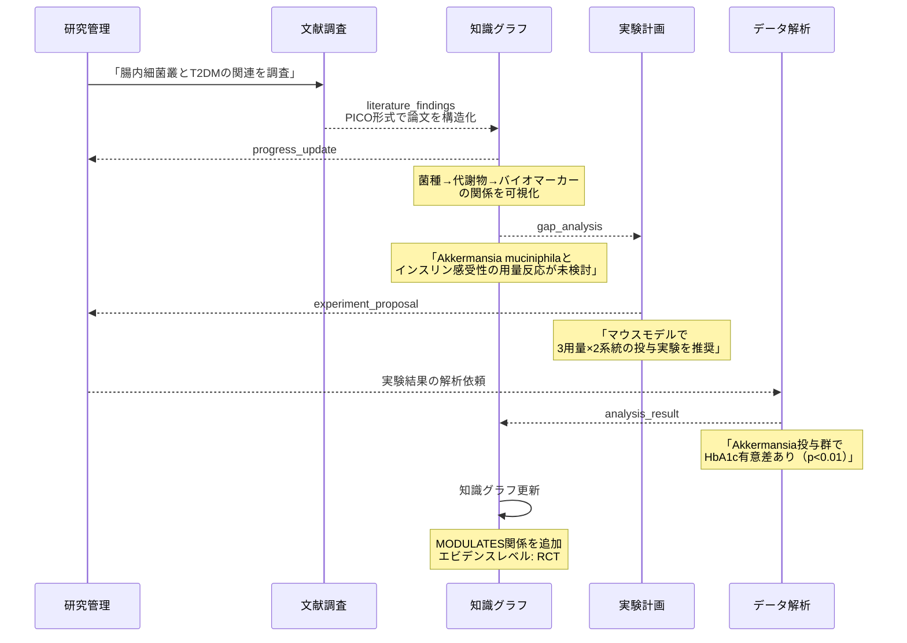
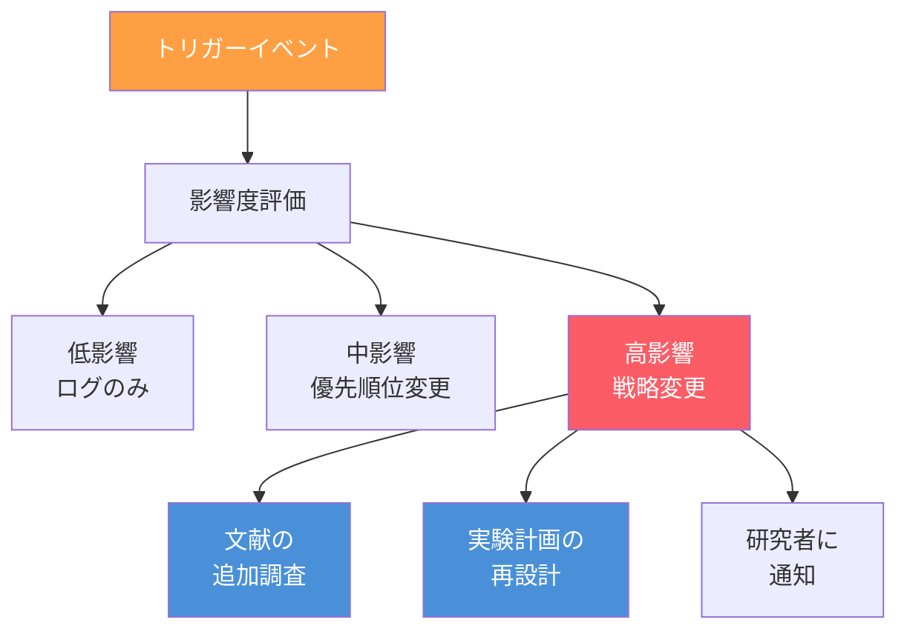
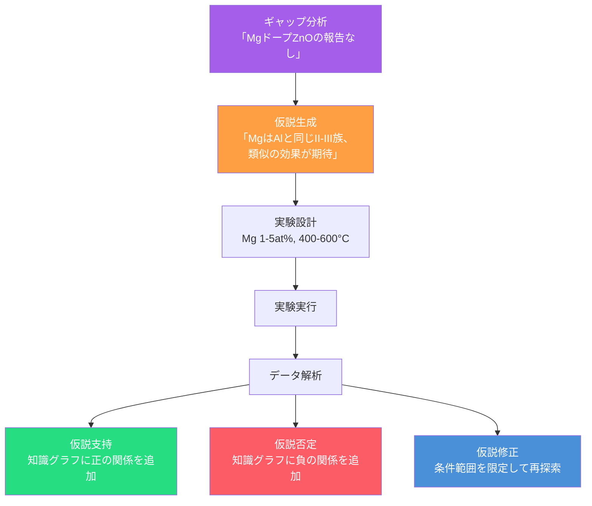
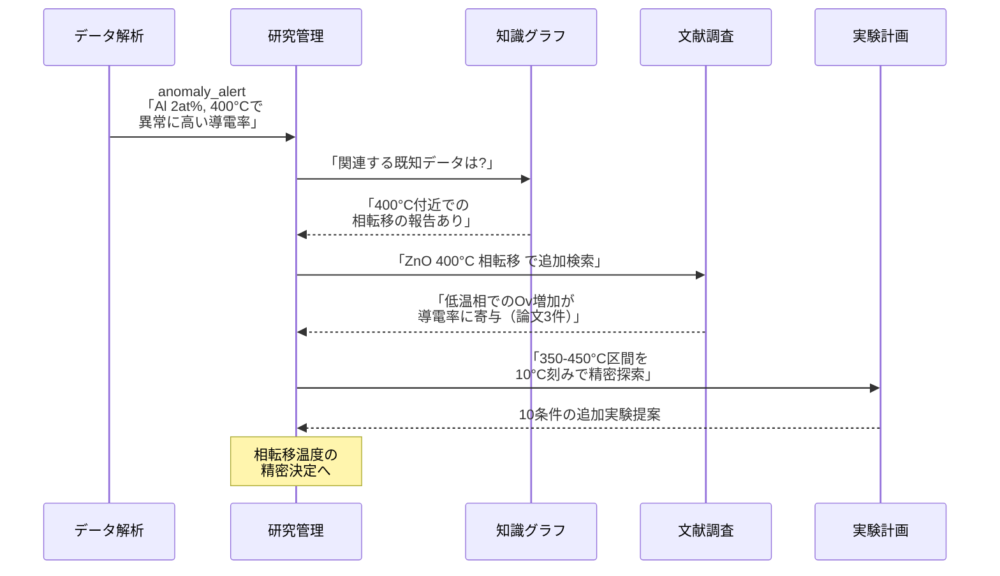

第4章から第8章にかけて、文献調査、知識グラフ構築、実験計画、データ解析、Self-Driving Laboratoryと、研究プロセスの各段階を担う個別のエージェントを構築してきました。

しかし実際の研究では、これらは**独立に動くのではなく、連携して1つの研究プロジェクトを推進**します。ある論文の発見が実験計画を変更し、実験結果が知識グラフを更新し、新たな文献調査のクエリを生成する — このような**エージェント間の連鎖**がマルチエージェント・パイプラインです。

本章では、各エージェントを統合するアーキテクチャと通信プロトコルを設計し、研究プロジェクト全体を一気通貫で管理するパイプラインを構築します。



## マルチエージェントのアーキテクチャパターン

### 3つの統合パターン

マルチエージェントシステムには、主に3つのアーキテクチャパターンがあります。

| パターン | 構造 | 利点 | 欠点 |
| ---- | ---- | ---- | ---- |
| **ハブ＆スポーク型** | 中央のオーケストレーターが全エージェントを制御 | 制御が明確、デバッグしやすい | 中央が単一障害点になる |
| **パイプライン型** | エージェントが順序的に処理をリレー | データの流れが直感的 | 逆方向のフィードバックが複雑 |
| **メッシュ型** | 各エージェントが対等に通信 | 柔軟で耐障害性が高い | 通信の複雑性が爆発的に増加 |

本書では、**ハブ＆スポーク型をベースに、パイプライン型の順序制御を組み合わせた**ハイブリッドアーキテクチャを採用します。



このアーキテクチャの利点は以下のとおりです。

1. **研究管理エージェント**がプロジェクト全体の進捗を把握し、優先順位を制御
2. **パイプライン接続**により、データの流れが明確
3. **フィードバックループ**により、解析結果が知識グラフを更新し次の計画に反映

## エージェント間通信のプロトコル

### タスクメッセージの標準化

エージェント間でやり取りするメッセージを標準化することで、各エージェントの実装を独立に保ちつつ連携を可能にします。

```yaml
# タスクメッセージの標準フォーマット
task_message:
  id: "TASK-2025-0315-001"
  type: "experiment_planning"
  priority: "high"
  source:
    agent: "knowledge-graph-agent"
    skill: "scientific-knowledge-graph"
  target:
    agent: "experiment-planning-agent"
    skill: "scientific-experiment-planning"
  payload:
    gap_analysis:
      unexplored_combinations:
        - element: "Mg"
          concentration_range: [1, 5]
          temperatures: [400, 500, 600]
          atmospheres: ["N2", "Ar"]
      priority_reason: "先行研究なし、高い探索価値"
    constraints:
      - type: "exclude"
        condition: "In >= 5at%"
        reason: "析出確認済み（EXP-038）"
    context:
      project: "ZnO透明導電膜の最適化"
      iteration: 7
      total_experiments: 23
  metadata:
    created_at: "2025-03-15T10:30:00Z"
    deadline: "2025-03-16T18:00:00Z"
    trace_id: "proj-zno-2025-trace-007"
```

### メッセージの種類

| メッセージタイプ | 送信元 → 送信先 | 内容 |
| ---- | ---- | ---- |
| `literature_findings` | 文献調査 → 知識グラフ | 新しく発見した論文情報 |
| `gap_analysis` | 知識グラフ → 実験計画 | 未探索の組み合わせリスト |
| `experiment_proposal` | 実験計画 → SDL/研究者 | 推奨実験条件 |
| `analysis_result` | データ解析 → 知識グラフ | 解析済みの実験結果 |
| `anomaly_alert` | データ解析 → 研究管理 | 異常値の検出通知 |
| `progress_update` | 各エージェント → 研究管理 | 進捗報告 |
| `priority_change` | 研究管理 → 各エージェント | 優先順位の変更指示 |

## パイプラインの具体的な流れ

### シナリオ: ZnOドーピング最適化プロジェクト

第5章から続くZnOドーピングの例で、パイプライン全体の流れを追います。

```mermaid
sequenceDiagram
    participant R as 研究者
    participant MGR as 研究管理<br>エージェント
    participant LIT as 文献調査<br>エージェント
    participant KG as 知識グラフ<br>エージェント
    participant PLAN as 実験計画<br>エージェント
    participant DATA as データ解析<br>エージェント

    R->>MGR: 「ZnO透明導電膜の最適条件を見つけたい」
    
    MGR->>LIT: フェーズ1: 文献調査を依頼
    Note over LIT: PICO/PRISMA2020に従い<br>系統的に文献収集
    LIT-->>KG: literature_findings<br>論文42件の構造化データ

    KG->>KG: 知識グラフ構築
    Note over KG: エンティティ抽出<br>関係構築<br>コミュニティ検出
    KG-->>MGR: progress_update<br>「ノード328, エッジ1,247」

    KG-->>PLAN: gap_analysis<br>「Mg/Cu領域が未探索」
    
    PLAN->>PLAN: 初期実験計画
    Note over PLAN: LHS 16点 + BO設定
    PLAN-->>MGR: experiment_proposal<br>「16条件の初期実験を推奨」
    MGR-->>R: 承認依頼

    R->>MGR: 「承認。ただしCuは除外」
    MGR-->>PLAN: priority_change<br>「Cu除外制約を追加」
    PLAN-->>R: 修正版: 12条件

    Note over R: 実験実行（1週間）

    R->>DATA: 「12件の実験結果を解析して」
    DATA->>DATA: 前処理→統計解析→異常検知
    DATA-->>KG: analysis_result<br>12件の解析データ

    KG->>KG: 知識グラフ更新
    KG-->>PLAN: gap_analysis<br>「Al 1-2at%, 500-550°Cが有望」

    PLAN-->>R: 「次の5条件を推奨します」
    Note over R: イテレーション2...
```



### ライフサイエンスのシナリオ: 腸内細菌叢×T2DM

材料科学だけでなく、ライフサイエンスにもパイプラインは適用できます。



## 研究管理エージェント — パイプラインの司令塔

### 役割と機能

研究管理エージェントは、プロジェクト全体を俯瞰し、各エージェントの活動を調整します。

| 機能 | 説明 |
| ---- | ---- |
| **進捗追跡** | 各エージェントの状態と進捗を集約 |
| **優先順位制御** | 新発見や研究者の指示に基づき優先順位を動的に変更 |
| **リソース管理** | 実験予算、計算リソース、時間の管理 |
| **品質ゲート** | フェーズ間の移行条件をチェック |
| **レポート生成** | プロジェクト全体の進捗レポートを生成 |

### プロジェクト状態の管理

```yaml
# プロジェクト状態管理
project_state:
  name: "ZnO透明導電膜の最適化"
  phase: "iteration_3"
  
  agents:
    literature_agent:
      status: "idle"
      last_run: "2025-03-10"
      papers_found: 42
      
    knowledge_graph_agent:
      status: "active"
      nodes: 380
      edges: 1,520
      last_gap_analysis: "2025-03-14"
      
    experiment_planning_agent:
      status: "waiting_approval"
      proposed_conditions: 5
      completed_experiments: 23
      
    data_analysis_agent:
      status: "idle"
      last_analysis: "2025-03-14"
      analyses_completed: 23
  
  metrics:
    best_bandgap_eV: 3.05
    best_resistivity_ohm_cm: 1.8e-3
    improvement_rate: 0.02  # 直近5回の平均改善率
    budget_remaining: 27  # 残り実験回数
  
  quality_gates:
    literature_coverage: 0.85  # 85%カバー
    graph_credibility: 0.78   # 信頼性スコア
    statistical_power: 0.8    # 検出力
```

### 動的な戦略変更

パイプライン実行中に新しい情報が得られた場合、研究管理エージェントは戦略を動的に変更します。



| トリガー | 影響度 | アクション |
| ---- | ---- | ---- |
| 文献調査で画期的な新論文を発見 | 高 | 実験計画の見直し + 知識グラフ更新 |
| データ解析で予想外の異常値 | 中〜高 | 追加実験提案 + 仮説検証 |
| 実験の改善率が3回連続で1%未満 | 中 | 探索戦略の切り替え（局所→大域） |
| 研究者から新しい制約条件 | 中 | パラメーター空間の再定義 |
| 競合グループの先行発表 | 高 | 差別化ポイントの再検討 |

## エージェント連携の実践パターン

### パターン1: 仮説駆動型探索

知識グラフのギャップから仮説を生成し、実験で検証するパターンです。



### パターン2: 文献フォローアップ型

文献調査の結果から直接実験を計画するパターンです。

| ステップ | エージェント | アクション |
| ---- | ---- | ---- |
| 1 | 文献調査 | 新規論文の発見「Ga-Nコドーピングで高移動度」 |
| 2 | 知識グラフ | 既存グラフにコドーピングのノード・関係を追加 |
| 3 | 実験計画 | コドーピングの条件を追加パラメーターとして設計 |
| 4 | 研究管理 | 優先順位の調整（コドーピング系を優先） |
| 5 | データ解析 | 論文の結果との比較解析 |
| 6 | 知識グラフ | 再現性の検証結果を登録 |

### パターン3: 異常値起点の発見型

データ解析で検出された異常値から、科学的発見につながるパターンです。



## パイプラインの監視と可視化

### ダッシュボードの設計

研究管理エージェントは、パイプライン全体の状態を可視化するダッシュボードを生成します。

```markdown
## 研究プロジェクト ダッシュボード

### 📊 全体進捗
| 指標 | 値 | 目標 | 達成率 |
| ---- | ---- | ---- | ---- |
| 実験回数 | 23/50 | 50 | 46% |
| 最良バンドギャップ | 3.05 eV | ≤ 3.0 eV | 97% |
| 最良抵抗率 | 1.8×10⁻³ | ≤ 10⁻³ | 56% |
| 知識グラフノード | 380 | — | — |
| 論文収集数 | 42 | — | — |

### 🔄 エージェント状態
| エージェント | 状態 | 最終実行 |
| ---- | ---- | ---- |
| 文献調査 | 🟢 待機中 | 3/10 |
| 知識グラフ | 🟡 更新中 | 3/14 |
| 実験計画 | 🔴 承認待ち | 3/14 |
| データ解析 | 🟢 待機中 | 3/14 |

### 📈 最適化の収束
イテレーション7: 改善率 2.0%（閾値 1.0%以上）→ 継続
```

## スキルの自作 — 研究管理スキル

```yaml
---
name: scientific-research-manager
description: |
  研究プロジェクト管理スキル。マルチエージェントの統括・調整。
  「プロジェクト状態」「進捗確認」「戦略変更」で発火。
tu_tools:
  - key: neo4j
    name: Neo4j
    description: 知識グラフ（プロジェクト状態も管理）
---

# Scientific Research Manager

マルチエージェント・パイプライン全体を統括する研究管理スキル。

## When to Use
- プロジェクト全体の進捗を確認したい
- エージェント間の優先順位を調整したい
- 新しい発見に基づいて研究戦略を変更したい
- プロジェクトのダッシュボードを生成したい

## 管理プロトコル
1. 各エージェントの状態を定期的にチェック
2. 品質ゲートの条件を検証してフェーズ移行を判断
3. 異常アラートを受信したら影響度を評価
4. 研究者への報告は構造化フォーマットで

## 戦略変更の判断基準
- 改善率低下 → 探索戦略の切り替え
- 新論文の発見 → 優先順位の再設定
- 異常値の検出 → 追加調査の計画
- 予算の制約 → フォーカスエリアの絞り込み

## 参照スキル
- ← scientific-literature-search（文献調査状態）
- ← scientific-knowledge-graph（知識グラフ状態）
- ← scientific-experiment-planning（実験計画状態）
- ← scientific-data-analysis（データ解析状態）
- ← scientific-sdl-orchestrator（SDL状態）
```

## 第10章への橋渡し — ハンズオンで体験する

ここまで、文献調査（第4章）、知識グラフ構築（第5章）、実験計画（第6章）、データ解析（第7章）、Self-Driving Laboratory（第8章）、そしてマルチエージェント・パイプライン（本章）と、AI for Scienceの全体アーキテクチャを学んできました。

次章「ハンズオン」では、これらの知識を実際のプロジェクトに適用し、SATORI + GitHub Copilotで**動くエージェントを手を動かして構築**します。


## 本章のまとめ

| トピック | 要点 |
| ---- | ---- |
| アーキテクチャ | ハブ＆スポーク + パイプラインのハイブリッド型 |
| 通信プロトコル | 標準化されたタスクメッセージ（YAML形式） |
| 研究管理エージェント | プロジェクト全体の進捗追跡・優先順位制御・品質ゲート |
| 連携パターン | 仮説駆動型、文献フォローアップ型、異常値起点の発見型 |
| 動的戦略変更 | 新情報に基づく優先順位の再設定と探索戦略の切り替え |
| プロジェクト状態管理 | 各エージェントの状態、メトリクス、品質ゲートをYAMLで管理 |
| ダッシュボード | マルチエージェントの状態をリアルタイムに可視化 |
| 適用分野 | 材料科学（ZnOドーピング）、ライフサイエンス（腸内細菌叢×T2DM） |

[^1]: Park, S., et al. (2024). Multi-agent systems for scientific discovery. *Nature Machine Intelligence*, 6, 28-39.
