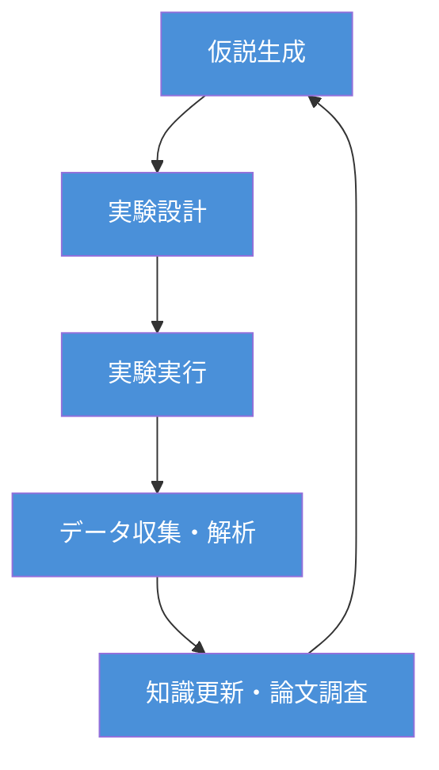
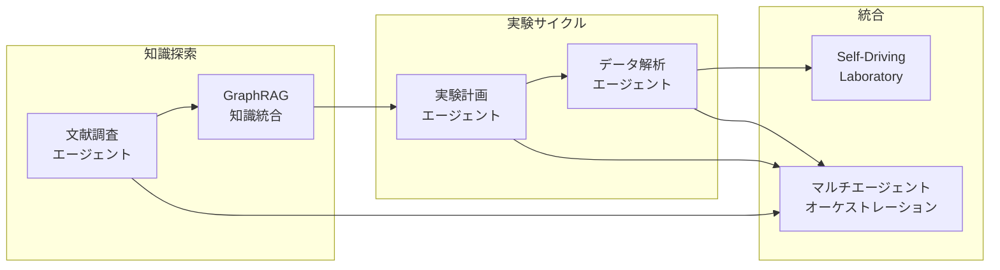
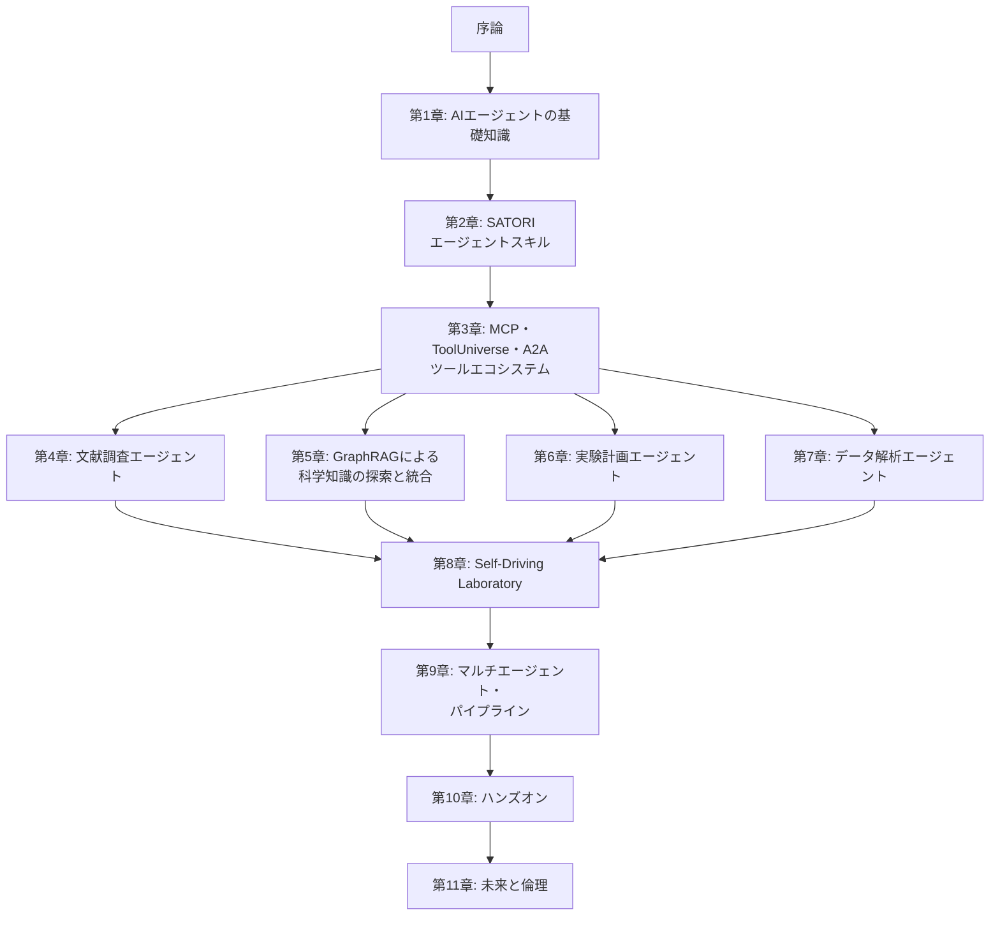

## 本書の背景

2020年、米国エネルギー省（DOE）の報告書「AI for Science」[^1]によって体系化された**AI for Science**は、わずか5年で科学の歴史を塗り替えました。AlphaFold2によるタンパク質構造予測の革命（2020年）、GNoMEによる220万種の新規材料発見（2023年）、そして2024年にはノーベル化学賞（Hassabis・Jumper・Baker）とノーベル物理学賞（Hopfield・Hinton）の両方でAI・計算科学研究者が受賞するに至りました。

日本においても、文部科学省が **「AI for Scienceによる科学研究の革新」** を重点施策として位置づけ、令和7年度補正予算で1,143億円（関連経費を含めると1,527億円）を計上しています[^2]。とりわけ**AI for Scienceによる科学研究革新プログラム**（370億円）では、科学基盤モデル・**AIエージェント開発**と次世代AI駆動ラボシステム開発が一体的に推進されることになりました。

ここで注目すべきは、「AIエージェント開発」が国の施策として明示的に掲げられている点です。AI for Scienceは、個別のAIモデルを「道具」として使う段階から、**AIが研究プロセス全体を自律的に遂行する段階**へと進化しつつあります。

本書では、筆者が開発するAI for Science用エージェントスキルコレクション **[SATORI](https://github.com/nahisaho/satori)**（190スキル・26ドメイン）と、ハーバード大学Zitnikラボが開発する科学ツールエコシステム **[ToolUniverse](https://github.com/mims-harvard/ToolUniverse)**（1,200以上の外部科学ツール）を活用し、GitHub Copilot上で動作する科学研究AIエージェントの設計と実装を解説します。

## なぜ「エージェント」なのか

AI for Scienceの究極的な目標の1つは、**仮説生成→実験設計→実験実行→データ解析→知識更新**という科学的発見のサイクルを自律的に回すことです。DOEの報告書ではこれを「Autonomous Discovery」と呼び、2023年の後続報告書[^3]ではさらにその野心が拡大されました。

しかし、現実の科学研究においてこのサイクルを回すには、**多種多様なツールとの連携**が不可避です。

| 研究プロセス | 必要な外部ツール・リソース | SATORI スキル例 |
| ---- | ---- | ---- |
| 文献調査 | PubMed、arXiv、Semantic Scholar | literature-search, deep-research |
| 仮説生成 | 知識グラフ、既存実験データ | hypothesis-pipeline, text-mining-nlp |
| 実験設計 | ベイズ最適化、シミュレーター | doe, bayesian-statistics |
| 実験実行 | ロボティクスAPI、LIMS | lab-automation, lab-data-management |
| データ解析 | 数値計算、統計、ML | eda-correlation, ml-regression |
| 知識統合 | GraphRAG、ベクトルDB | academic-writing, critical-review |

単一のAIモデルでは、これらすべてを扱うことはできません。ここで必要となるのが、LLM（大規模言語モデル）を中核とし、外部ツールを自在に呼び出しながら目的を達成する**AIエージェント**です。本書では、**SATORI**が研究方法論・判断ロジックを提供し、**ToolUniverse**がMCPサーバー経由で1,200以上の科学データベースツール（PubMed、UniProt、KEGG、ClinVar等）へのアクセスを提供する、二層構成のエージェントアーキテクチャを採用します。

:::message
**AIエージェント**とは、与えられた目標に対して、自ら計画を立て、必要なツールを選択・実行し、結果を評価して次の行動を決定する自律的なAIシステムです。単なるモデル推論とは異なり、**環境との相互作用**を通じて目的を達成します。
:::

### 科学研究における4つのエージェントパターン

本書では、科学研究に不可欠な4つのエージェントパターンを扱います。

1. **文献調査エージェント**: 学術論文を自律的に検索・取得・要約し、研究の現状を把握する
2. **実験計画エージェント**: ベイズ最適化やドメイン知識に基づいて、最適な実験条件を提案する
3. **データ解析エージェント**: 実験結果を自動的に処理・分析し、統計的検定やパターン発見を行う
4. **マルチエージェントシステム**: 上記のエージェントを連携させ、Self-Driving Laboratoryのような自律的研究サイクルを実現する

## なぜ「今」エージェント開発に取り組むべきか

2025年は、科学研究AIエージェントの開発を始めるのに最適なタイミングです。3つの技術的ブレークスルーがこの分野を実用化の段階に押し上げています。

### 1. エージェントプロトコルの標準化とGitHub Copilotの進化

2024〜2025年にかけて、AIエージェントが外部ツールと連携するための**標準プロトコル**が急速に整備されました。

- **MCP（Model Context Protocol）**: Anthropicが提唱した、LLMと外部ツールを接続するオープンプロトコル。科学機器のAPI、データベース、計算エンジンなどをエージェントから統一的に呼び出せる
- **A2A（Agent-to-Agent Protocol）**: Googleが提唱した、エージェント間の通信プロトコル。文献調査エージェントと実験計画エージェントが直接対話し、協調して研究を進められる

とりわけ重要なのが、**GitHub Copilot**がMCPをネイティブにサポートし、エージェントモードを備えた汎用的なAIエージェント開発プラットフォームへと進化したことです。VS Code上の**GitHub Copilot（Agent Mode）**とターミナルで動作する**GitHub Copilot CLI**を組み合わせることで、研究者は使い慣れた開発環境の中でMCPサーバーを介した科学ツール連携やマルチエージェントワークフローを構築できるようになりました。

さらに、**ToolUniverse**がMCPサーバーとしてネイティブに動作し、1,200以上の科学ツールをCompact Mode（4〜5個のコアディスカバリーツールに集約）で効率的に利用できるようになったことで、GitHub Copilotからの科学ツール呼び出しが飛躍的に容易になっています。

### 2. 科学ツールエコシステムの成熟 — ToolUniverse

AlphaFold、MatterSim、MatterGenなどの科学AIモデルがオープンソースで公開され、APIとして利用可能になっています。ハーバード大学Zitnikラボが開発する**[ToolUniverse](https://github.com/mims-harvard/ToolUniverse)**は、これら1,200以上の機械学習モデル・データセット・API・科学パッケージを**AI-Tool Interaction Protocol**で標準化し、MCPサーバーとして統合的に利用可能にしています。

ToolUniverseを介することで、GitHub Copilotのエージェントモードから「タンパク質Xの構造を予測して」「材料Yの安定性をシミュレーションして」「ClinVarでバリアントの病原性を確認して」といった指示を自然言語で受けて実行できるようになります。

### 3. LLMの推論能力の向上とSATORI Agent Skills

GitHub Copilotが採用するGPT-5.2、Claude Opus 4.6、Gemini 3 といった最新のLLMは、科学論文の理解、実験データの解釈、コード生成において実用的な精度を達成しています。論文中の数式を理解し、実験パラメータの意味を把握し、結果を科学的に解釈する能力が、エージェントの「頭脳」としてようやく十分なレベルに到達しました。GitHub Copilotではモデルを切り替えて使用できるため、タスクに応じて最適なLLMを選択できる点も大きな利点です。

さらに、**[SATORI](https://github.com/nahisaho/satori)**（190スキル・26ドメイン）がGitHub Copilotの**Agent Skills**として動作し、プロンプト内容に応じて適切な科学的方法論（統計検定、ベイズ最適化、メタアナリシス等）を自動ロードします。SATORIが「科学的判断力」を、ToolUniverseが「データ取得・計算力」を提供し、GitHub Copilotが両者を統合することで、初めて実用的な科学研究AIエージェントが実現します。

## 本書の目的

本書は、**SATORI + ToolUniverse + GitHub Copilot を用いた科学研究AIエージェントの設計と実装を、実践的に学ぶ**ための開発ガイドです。

姉妹書である『はじめての AI for Science (入門編)』[^4]がAI for Scienceの基本概念・政策動向・個別手法を概説したのに対し、本書はそれらの知識を前提として、**SATORIのスキルベースアーキテクチャとToolUniverseのツールエコシステムを活用し、エージェントとして統合・実装する方法**に焦点を当てます。

とくに以下のような方々を対象としています。

- AI for Scienceの政策動向を踏まえ、**科学研究AIエージェントの開発**に取り組みたい研究者・エンジニア
- 文部科学省の**科学研究革新プログラム**（プロジェクト型・チャレンジ型）において、AIエージェント開発を計画している大学・研究機関の関係者
- **SATORI**や**ToolUniverse**を活用し、GitHub Copilot上で科学エージェントを構築したいソフトウェア開発者
- Self-Driving Laboratoryなどの**自律実験システム**の設計・導入を検討している実験科学者
- GraphRAGを活用した**科学文献マイニング**のシステム構築を目指す情報科学研究者

:::message
本書はPythonによるコード例を多く含む実践書です。Pythonの基本文法、GitHub Copilotの基本的な利用経験があることを前提としています。AI for Scienceの基礎知識については、姉妹書『はじめての AI for Science (入門編)』を参照してください。
:::

## 本書の構成

本書は全11章と付録で構成されています。

| 章 | タイトル | 内容 |
| ---- | ---- | ---- |
| 序論 | なぜ科学研究にAIエージェントが必要なのか | 背景、SATORI/ToolUniverseの位置づけ、対象読者 |
| 第1章 | AIエージェントの基礎知識 | エージェントの定義、ReAct・Plan-and-Execute、ツール使用パターン |
| 第2章 | SATORI — 科学研究エージェントスキルのアーキテクチャ | 190スキル・26ドメインの設計思想、パイプラインフロー、スキル自動ロードの仕組み |
| 第3章 | MCP・ToolUniverse・A2Aによるツールエコシステム | MCPサーバーの実装、ToolUniverse 1,200+ツール連携、Compact Mode、A2A通信 |
| 第4章 | 文献調査エージェントの構築 | SATORI literature-search/deep-research + ToolUniverse PubMed/Semantic Scholar連携 |
| 第5章 | GraphRAGによる科学知識の探索と統合 | GraphRAG・Lazy GraphRAGの仕組み、SATORI text-mining-nlpスキルによる知識グラフ構築 |
| 第6章 | 実験計画エージェントの設計 | SATORI doe/bayesian-statisticsスキル、ベイズ最適化、制約条件、能動学習 |
| 第7章 | データ解析エージェントの実装 | SATORI統計・MLスキル群 + ToolUniverseデータアクセス連携 |
| 第8章 | Self-Driving Laboratory | SATORI lab-automationスキル、ロボティクス連携、閉ループ制御 |
| 第9章 | マルチエージェント・パイプライン | SATORIパイプラインフロー、エージェント間協調、タスク分配、ワークフロー管理 |
| 第10章 | ハンズオン — SATORIで科学研究エージェントを作ろう | SATORI + ToolUniverseによる科学研究エージェントの構築実践演習 |
| 第11章 | AI科学エージェントの未来と倫理 | 責任あるAI、再現性、安全性、今後の展望 |
| 付録 | 参考文献・リソース集 | 主要論文、SATORIスキル一覧、ToolUniverseツール一覧、MCPサーバー一覧 |

:::message
第1〜3章で基盤技術（AIエージェントの基礎・SATORIスキル・ToolUniverseツール連携）を学んだ後、第4〜7章で個別のエージェントを実装し、第8〜9章でそれらを統合するという構成です。各章は独立して読むこともできますが、初学者は順番に読み進めることを推奨します。
:::

## 本書で使用する技術スタック

| カテゴリ | 技術 | 用途 |
| ---- | ---- | ---- |
| エージェント基盤 | GitHub Copilot (Agent Mode), GitHub Copilot CLI | エージェントの実行環境・開発プラットフォーム |
| エージェントスキル | [SATORI](https://github.com/nahisaho/satori) (190スキル・26ドメイン) | 科学的方法論・判断ロジック・パイプラインフロー |
| 外部ツール | [ToolUniverse](https://github.com/mims-harvard/ToolUniverse) (1,200+ツール) | MCP経由の科学データベースアクセス |
| LLM | Claude, GPT, Gemini（GitHub Copilot経由） | エージェントの推論エンジン（モデル切替可能） |
| エージェントプロトコル | MCP, A2A | ツール連携・エージェント間通信 |
| 知識探索 | GraphRAG, Lazy GraphRAG | 科学文献の構造化・探索 |
| 最適化 | BoTorch, Optuna | ベイズ最適化、実験計画 |
| 言語 | Python 3.x, TypeScript | エージェント実装、MCPサーバー |
| データ基盤 | Neo4j, ChromaDB | 知識グラフ、ベクトル検索 |

## 表記について

- **英語の専門用語**: はじめて登場する際に日本語訳と英語表記を併記し、以降は文脈に応じて使い分けます
- **数式**: KaTeX記法で記述しています
- **コード**: Python 3.xを主に使用し、MCPサーバーの実装にはTypeScriptを使用します。SATORIスキルのインストールは `npx @nahisaho/satori init` で行います。エージェントの実行にはGitHub Copilot（VS Code Agent Mode）およびGitHub Copilot CLIを使用します
- **参考文献**: 脚注と巻末付録の両方で示しています

## AI for Science政策とエージェント開発の接点

本書の内容は、日本のAI for Science政策が求める技術開発と密接に対応しています。

| 政策が求める技術 | 本書の対応章 |
| ---- | ---- |
| 科学基盤モデル・**AIエージェント開発** | 第1〜3章（基礎・SATORI・ToolUniverse）、第4〜7章（個別エージェント） |
| 次世代**AI駆動ラボシステム**開発 | 第8章（Self-Driving Laboratory） |
| 研究データの**取得・活用** | 第5章（GraphRAG）、第7章（データ解析） |
| **マルチエージェント**によるワークフロー自動化 | 第9章（マルチエージェント・パイプライン） |

文部科学省の科学研究革新プログラムでは、「実験データの取得・活用によるAI基盤モデル・AIエージェント開発と次世代AI駆動ラボシステム開発を一体的に推進」することが求められています。本書は、まさにこの「一体的な推進」を技術的に実現するための知識とスキルを提供します。

---

本書を通じて、読者のみなさんがAI for Scienceにおけるエージェント開発の全体像を掴み、自らの研究分野で科学研究AIエージェントを設計・実装できるようになることを目指します。それでは、第1章でAIエージェントの基礎知識から始めましょう。

[^1]: Stevens, R., Taylor, V., Nichols, J., Maccabe, A.B., Yelick, K., Brown, D. (2020). *AI for Science: Report on the Department of Energy (DOE) Town Halls on Artificial Intelligence (AI) for Science*. Argonne National Laboratory. DOI: 10.2172/1604756
[^2]: 文部科学省「AI for Scienceに関する令和7年度補正予算および令和8年度当初予算案について」AI for Science推進委員会（第1回）資料、令和8年2月9日（https://www.mext.go.jp/content/20260209-mxt_jyohoka01-000047243_3.pdf）
[^3]: Carter, J., Feddema, J., Kothe, D., Neely, R., Pruet, J., Stevens, R. (2023). *Advanced Research Directions on AI for Science, Energy, and Security: Report on Summer 2022 Workshops*. Argonne National Laboratory. DOI: 10.2172/1999614
[^4]: 『はじめての AI for Science』Zenn Books（https://zenn.dev/nahisaho/books/8a46cdc39337ae）
