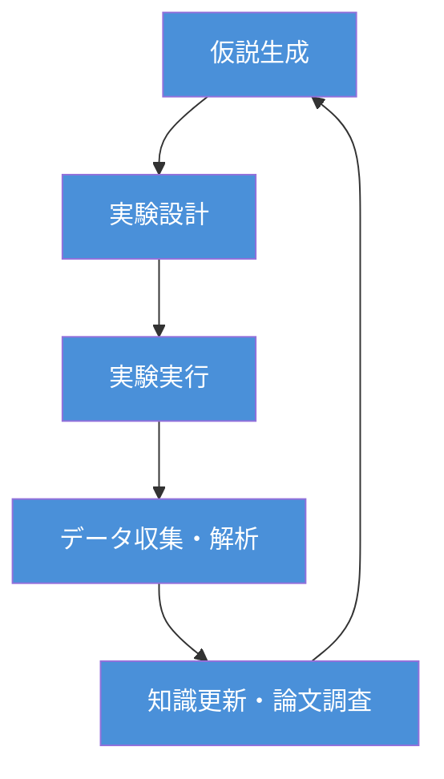
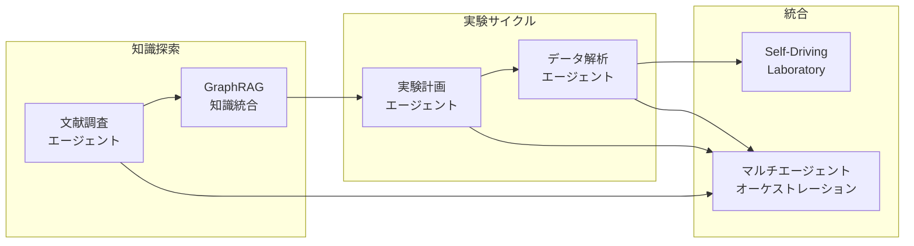
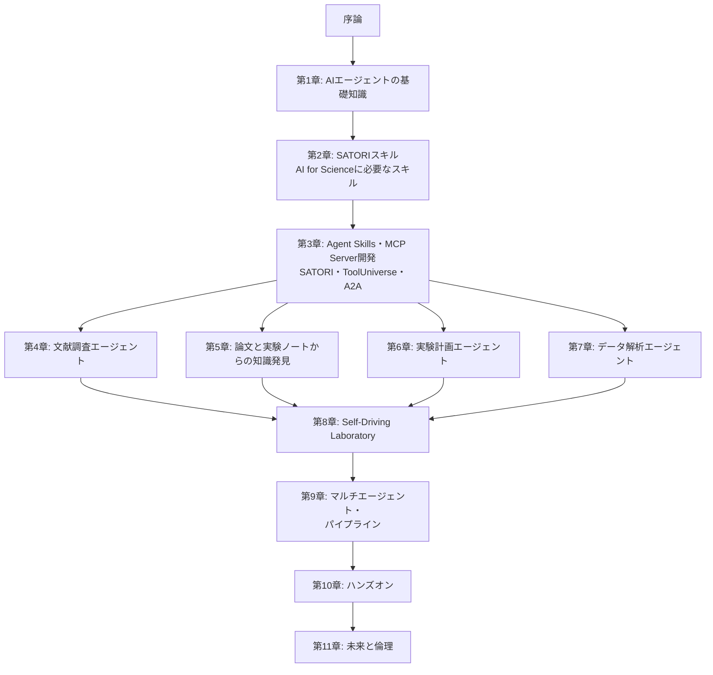

> 「PubMedとarXivから関連論文200本の要旨を整理し、我々の仮説を支持するデータと矛盾するデータを分類して。そのうえで、次に試すべき実験条件を3つ提案して。」

もしこの一言で、大学院生が1週間かけていた作業が2時間で終わるとしたら、あなたの研究はどう変わるでしょうか。

文献調査、実験パラメーターの探索、データの前処理と統計解析。研究者の時間の大半を占めるこれらの反復的な作業をAIエージェントに委ね、**仮説の着想や実験結果の解釈といった、人間にしかできない知的活動に集中できる環境**を自ら構築すること。それが本書のテーマです。

## 本書の背景

2020年、米国エネルギー省（DOE）の報告書「AI for Science」[^1]によって体系化された**AI for Science**は、わずか5年で科学の歴史を塗り替えました。AlphaFold2によるタンパク質構造予測の革命（2020年）、GNoMEによる220万種の新規材料発見（2023年）、そして2024年にはノーベル化学賞（Hassabis・Jumper・Baker）とノーベル物理学賞（Hopfield・Hinton）の両方でAI・計算科学研究者が受賞するに至りました。

日本においても、文部科学省が **「AI for Scienceによる科学研究の革新」** を重点施策として位置づけ、令和7年度補正予算で1,143億円（関連経費を含めると1,527億円）を計上しています[^2]。とりわけ**AI for Scienceによる科学研究革新プログラム**（370億円）では、科学基盤モデル・**AIエージェント開発**と次世代AI駆動ラボシステム開発が一体的に推進されることになりました。

ここで注目すべきは、「AIエージェント開発」が国の施策として明示的に掲げられている点です。AI for Scienceは、個別のAIモデルを「道具」として使う段階から、**AIが研究プロセス全体を自律的に遂行する段階**へと進化しつつあります。

本書では、筆者自身が設計・開発しているAI for Science専用の**エージェントスキル**コレクション **[SATORI](https://github.com/nahisaho/satori)**（190スキル・26ドメイン）と、ハーバード大学Zitnikラボが開発する科学ツールエコシステム **[ToolUniverse](https://github.com/mims-harvard/ToolUniverse)**（1,200以上の外部科学ツール）を活用し、GitHub Copilot上で動作する科学研究**AIエージェント**の設計と実装を解説します。ここでいうエージェントスキルとは、GitHub Copilotに科学的な判断基準やワークフローを教えるMarkdown形式の指示ファイルのことです（詳しくは後述）。SATORIの実装を参照しながら、読者が自身の研究分野に特化した独自のエージェントを開発できるようになることが本書の最終目標です。

## なぜ「エージェント」なのか

AI for Scienceの究極的な目標の1つは、**仮説生成→実験設計→実験実行→データ解析→知識更新**という科学的発見のサイクルを自律的に回すことです。DOEの報告書ではこれを「Autonomous Discovery」と呼び、2023年の後続報告書[^3]ではその構想がさらに発展しました。

しかし、現実の研究現場では、このサイクルの各ステップが依然として手作業の連続です。文献検索に数日を費やし、実験パラメーターの組合せ爆発に直面し、得られたデータの前処理に追われる。しかも各ステップで異なるツールやデータベースを使い分ける必要があり、**ツール間の連携そのもの**が研究のボトルネックになっています。

| 研究プロセス | 必要な外部ツール・リソース | SATORI スキル例 |
| ---- | ---- | ---- |
| 文献調査 | PubMed、arXiv、Semantic Scholar | literature-search, deep-research |
| 仮説生成 | 知識グラフ、既存実験データ | hypothesis-pipeline, text-mining-nlp |
| 実験設計 | ベイズ最適化、シミュレーター | doe, bayesian-statistics |
| 測定データ・物質パラメーター取得 | [NIMS DICE](https://dice.nims.go.jp/)、[ARIM](https://www.arim.jp/)、[StarryData2](https://www.starrydata2.org/)、[Materials Project](https://materialsproject.org/) | lab-data-management, materials-characterization |
| 実験実行 | ロボティクスAPI、LIMS | lab-automation, lab-data-management |
| データ解析 | 数値計算、統計、ML | eda-correlation, ml-regression |
| 知識統合 | GraphRAG、ベクトルDB | academic-writing, critical-review |

単一のAIモデルでは、これらすべてを扱うことはできません。ここで必要となるのが、LLM（大規模言語モデル）を中核とし、外部ツールを自在に呼び出しながら目的を達成する**AIエージェント**です。本書では、**SATORI**が研究方法論・判断ロジックを、**ToolUniverse**がMCPサーバー経由での科学ツール・データベースアクセスを提供する二層構成のエージェントアーキテクチャを採用します。上表に示した材料・測定データ基盤との連携もこのアーキテクチャの中で実現します。

:::message alert
**本書で使う3つの用語を区別してください。**

- **AIエージェント（AI Agent）**: 与えられた目標に対して自ら計画を立て、ツールを選択・実行し、結果を評価して次の行動を決定する**自律的なAIシステム**の総称です。本書全体を通じて構築する対象がこれにあたります
- **エージェントモード（Agent Mode）**: GitHub Copilotが備える動作モードの1つで、AIエージェントとして振る舞う機能です。ファイル編集やターミナル操作、MCPサーバー呼び出しなどを自律的に実行できます
- **エージェントスキル（Agent Skills）**: GitHub Copilotにドメイン固有の知識や判断基準を与える**Markdown形式の指示ファイル**（`.md`）です。SATORIはこのエージェントスキルを190個集めたコレクションであり、AIエージェントそのものではなく、エージェントの**判断力を拡張する知識レイヤー**にあたります

つまり、GitHub Copilot（エージェントモード）+ SATORI（エージェントスキル）+ ToolUniverse（外部ツール）を組み合わせることで、科学研究に特化した**AIエージェント**が構成されます。
:::

### 科学研究における4つのエージェントパターン

本書では、科学研究に不可欠な4つのエージェントパターンを扱います。

1. **文献調査エージェント**: 学術論文を自律的に検索・取得・要約し、研究の現状を把握する。数千本の論文から自分の仮説に関連する知見を数時間で抽出できる
2. **実験計画エージェント**: ベイズ最適化やドメイン知識を組み合わせて最適な実験条件を提案する。パラメーター空間の探索回数を大幅に削減し、限られた予算と時間で成果を最大化できる
3. **データ解析エージェント**: 実験結果を自動的に処理・分析し、統計的検定やパターン発見を行う。「この結果にどの検定を使うべきか」という判断まで含めてエージェントが支援する
4. **マルチエージェントシステム**: 上記のエージェントを連携させ、Self-Driving Laboratoryのような自律的研究サイクルを実現する。夜間にエージェントが次の実験を計画し、翌朝には結果の解析レポートが届いている — そんな研究スタイルが現実になる

## なぜ「今」エージェント開発に取り組むべきか

いまこそ、科学研究AIエージェントの開発を始める最適なタイミングです。2024〜2025年にかけて成熟した3つの技術的ブレークスルーが、この分野を実用化の段階に押し上げました。

### 1. エージェントプロトコルの標準化とGitHub Copilotの進化

2024〜2025年にかけて、AIエージェントが外部ツールと連携するための**標準プロトコル**が急速に整備されました。

- **MCP（Model Context Protocol）**: Anthropicが提唱した、LLMと外部ツールを接続するオープンプロトコル。科学機器のAPI、データベース、計算エンジンなどをエージェントから統一的に呼び出せる
- **A2A（Agent-to-Agent Protocol）**: Googleが提唱した、エージェント間の通信プロトコル。文献調査エージェントと実験計画エージェントが直接対話し、協調して研究を進められる

とりわけ重要なのが、**GitHub Copilot**がMCPをネイティブにサポートし、エージェントモードを備えた汎用的なAIエージェント開発プラットフォームへと進化したことです。VS Code上の**GitHub Copilot（Agent Mode）**とターミナルで動作する**GitHub Copilot CLI**を組み合わせることで、研究者は使い慣れた開発環境の中でMCPサーバーを介した科学ツール連携やマルチエージェントワークフローを構築できるようになりました。

さらに、**ToolUniverse**がMCPサーバーとしてネイティブに動作し、1,200以上の科学ツールをCompact Mode（4〜5個のコアディスカバリーツールに集約）で効率的に利用できるようになったことで、GitHub Copilotからの科学ツール呼び出しが飛躍的に容易になっています。

### 2. 科学ツールエコシステムの成熟 — ToolUniverse

AlphaFold、MatterSim、MatterGenなどの科学AIモデルがオープンソースで公開され、APIとして利用可能になっています。ハーバード大学Zitnikラボが開発する **[ToolUniverse](https://github.com/mims-harvard/ToolUniverse)** は、これら1,200以上の機械学習モデル・データセット・API・科学パッケージを **AI-Tool Interaction Protocol** で標準化し、MCPサーバーとして統合的に利用可能にしています。

ToolUniverseを介することで、「タンパク質Xの構造を予測して」「材料Yの安定性をシミュレーションして」「ClinVarでバリアントの病原性を確認して」といった自然言語の指示をGitHub Copilotのエージェントモードに与えるだけで実行できるようになります。

さらに材料科学分野では、**[NIMS DICE](https://dice.nims.go.jp/)**（Data Infrastructure for Chemical Exploration）や **[ARIM](https://www.arim.jp/)**（先端研究基盤共用促進事業）が提供する測定データ・物質パラメーター、**[StarryData2](https://www.starrydata2.org/)** による公開論文中の実測値データ、**[Materials Project](https://materialsproject.org/)** の計算物性データベースなど、研究に不可欠な材料データ基盤が整備されています。これらのデータベースにMCPサーバー経由でアクセスすることで、AIエージェントが物質の結晶構造・状態図・機械特性・電子構造などのパラメーターを自動取得し、実験計画や解析に活用できるようになります。

### 3. LLMの推論能力の向上とSATORIエージェントスキル

GitHub Copilotが採用するGPT-5.2、Claude Opus 4.6、Gemini 3といった最新のLLMは、科学論文の理解、実験データの解釈、コード生成において実用的な精度を達成しています。論文中の数式を理解し、実験パラメーターの意味を把握し、結果を科学的に解釈する能力が、AIエージェントの「頭脳」としてようやく十分なレベルに到達しました。GitHub Copilotではモデルを切り替えて使用できるため、タスクに応じて最適なLLMを選択できる点も大きな利点です。

しかし、LLMだけでは「ベイズ最適化を使うべき場面でt検定を選ぶ」といった科学的判断の誤りを避けられません。ここで力を発揮するのが、**SATORI**のエージェントスキルです。SATORIの各スキルはMarkdownファイルとして記述されており、GitHub Copilotはプロンプト内容に応じて適切なスキル（統計検定、ベイズ最適化、メタアナリシス等）を自動ロードします。これにより、LLMの汎用的な推論能力にドメイン固有の科学的判断基準が加わります。各スキルには筆者の実験プロジェクトで検証済みの解析パターンが凝縮されています。

まとめると、以下の三者が組み合わさることではじめて実用的な科学研究AIエージェントが実現します。GitHub Copilot（エージェントモード）がAIエージェントの実行基盤を、SATORIのエージェントスキルが「科学的判断力」を、ToolUniverseが「データ取得・計算力」を担います。

## 本書の目的

本書は、筆者が開発した**SATORI**のアーキテクチャと実装を実例として参照しながら、**読者が独自の科学研究AIエージェントを設計・開発できるようになる**ことを目的としています。

前述のとおりSATORIは、13の実験プロジェクトで蓄積した解析パターンを190個のAgent Skillsとして体系化したオープンソースプロジェクトです。本書では、SATORIがなぜこのような設計に至ったのか、各スキルがどのような科学的判断を実装しているのかを解説します。そのうえで、読者がSATORIをそのまま活用するだけでなく、同様のアプローチで自身の研究ドメインに特化したエージェントスキルやパイプラインを構築できるようになることを目指します。

外部ツールとしては、ハーバード大学Zitnikラボの **ToolUniverse** + GitHub Copilotを組み合わせることで、読者は最小限のコードで実用的な科学エージェントを動かしながら学ぶことができます。

姉妹書である『はじめてのAI for Science（入門編）』[^4]がAI for Scienceの基本概念・政策動向・個別手法を概説したのに対し、本書はそれらの知識を前提として、**筆者開発のSATORIを「生きた教材」として読み解きながら、エージェントの設計原則・スキル分割・パイプライン構成・ToolUniverse連携の方法**を身につけられる実践書です。

とくに以下のような方々を対象としています。

- AI for Scienceの政策動向を踏まえ、**科学研究AIエージェントの開発**に取り組みたい研究者・エンジニア
- 文部科学省の**科学研究革新プログラム**（プロジェクト型・チャレンジ型）において、AIエージェント開発を計画している大学・研究機関の関係者
- **SATORI**（筆者開発）や**ToolUniverse**を活用しつつ、**独自のエージェント**をGitHub Copilot上で構築したいソフトウェア開発者
- Self-Driving Laboratoryなどの**自律実験システム**の設計・導入を検討している実験科学者
- GraphRAG・Lazy GraphRAGを活用し、**学術論文と自身の実験ノートから知見を発見**するシステム構築を目指す情報科学研究者

:::message
本書はPythonによるコード例を多く含む実践書です。Pythonの基本文法、GitHub Copilotの基本的な利用経験があることを前提としています。AI for Scienceの基礎知識については、姉妹書『はじめてのAI for Science（入門編）』を参照してください。
:::

## 本書の構成

本書は全11章と付録で構成されています。

| 章 | タイトル | 内容 |
| ---- | ---- | ---- |
| 序論 | なぜ科学研究にAIエージェントが必要なのか | 背景、SATORI/ToolUniverseの位置づけ、対象読者 |
| 第1章 | AIエージェントの基礎知識 | エージェントの定義、LLMベースエージェントの構成要素、科学研究への応用可能性 |
| 第2章 | SATORIエージェントスキル — AI for Scienceに必要なスキルを理解する | 190スキル・26ドメインの全体像、AI for Scienceに必要なスキル領域、パイプラインフロー |
| 第3章 | Agent Skills・MCP Server 開発 | エージェントスキル（Markdown指示書）の設計・実装、MCPサーバーの構築、A2Aプロトコル連携、ToolUniverse 1,200+ツール接続、[NIMS DICE](https://dice.nims.go.jp/)・[ARIM](https://www.arim.jp/)・[Materials Project](https://materialsproject.org/)との材料データ基盤接続 |
| 第4章 | 文献調査エージェントの構築 | SATORI literature-search/deep-research + ToolUniverse PubMed/Semantic Scholar連携 |
| 第5章 | GraphRAG・Lazy GraphRAGによる論文と実験ノートからの知識発見 | GraphRAG・Lazy GraphRAGの仕組み、学術論文と実験ノート（ラボノート）からの知識グラフ構築、自身の実験記録から知見を再発見する手法 |
| 第6章 | 実験計画エージェントの設計 | SATORI doe/bayesian-statisticsスキル、ベイズ最適化、制約条件、能動学習 |
| 第7章 | データ解析エージェントの実装 | SATORI統計・MLスキル群 + ToolUniverse・[NIMS DICE](https://dice.nims.go.jp/)・[Materials Project](https://materialsproject.org/)からの測定データ取得・解析連携 |
| 第8章 | Self-Driving Laboratory | SATORI lab-automationスキル、ロボティクス連携、閉ループ制御 |
| 第9章 | マルチエージェント・パイプライン | SATORIパイプラインフロー、エージェント間協調、タスク分配、ワークフロー管理 |
| 第10章 | ハンズオン — SATORIで科学研究エージェントを作ろう | SATORI + ToolUniverseによる科学研究エージェントの構築実践演習 |
| 第11章 | AI科学エージェントの未来と倫理 | 責任あるAI、再現性、安全性、今後の展望 |
| 付録 | 参考文献・リソース集 | 主要論文、SATORIスキル一覧、ToolUniverseツール一覧、MCPサーバー一覧 |

:::message
第1〜3章で基盤技術（AIエージェントの基礎知識・AI for Scienceに必要なスキル・Agent Skills/MCPサーバー開発）を学んだ後、第4〜7章で個別のエージェントを実装し、第8〜9章でそれらを統合するという構成です。各章は独立して読むこともできますが、初学者は順番に読み進めることを推奨します。
:::

## 本書で使用する技術スタック

| カテゴリ | 技術 | 用途 |
| ---- | ---- | ---- |
| エージェント基盤 | GitHub Copilot (Agent Mode), GitHub Copilot CLI | エージェントの実行環境・開発プラットフォーム |
| エージェントスキル | [SATORI](https://github.com/nahisaho/satori) (筆者開発・190スキル・26ドメイン) | 科学的方法論・判断ロジック・パイプラインフロー |
| 外部ツール | [ToolUniverse](https://github.com/mims-harvard/ToolUniverse) (1,200+ツール) | MCP経由の科学データベースアクセス |
| 材料・測定データ基盤 | [NIMS DICE](https://dice.nims.go.jp/)、[ARIM](https://www.arim.jp/)、[StarryData2](https://www.starrydata2.org/)、[Materials Project](https://materialsproject.org/) | 物質パラメーター・測定データ・計算物性データベース |
| LLM | Claude, GPT, Gemini（GitHub Copilot経由） | エージェントの推論エンジン（モデル切替可能） |
| エージェントプロトコル | MCP, A2A | ツール連携・エージェント間通信 |
| 知識探索 | GraphRAG, Lazy GraphRAG | 学術論文・実験ノートからの知識グラフ構築・探索 |
| 最適化 | BoTorch, Optuna | ベイズ最適化、実験計画 |
| 言語 | Python 3.x, TypeScript | エージェント実装、MCPサーバー |
| データ基盤 | Neo4j, ChromaDB | 知識グラフ、ベクトル検索 |

## 表記について

- **英語の専門用語**: はじめて登場する際に日本語訳と英語表記を併記し、以降は文脈に応じて使い分けます
- **数式**: KaTeX記法で記述しています
- **コード**: Python 3.xを主に使用し、MCPサーバーの実装にはTypeScriptを使用します。SATORIスキルのインストールは `npx @nahisaho/satori init` で行います。エージェントの実行にはGitHub Copilot（VS Code Agent Mode）およびGitHub Copilot CLIを使用します
- **参考文献**: 脚注と巻末付録の両方で示しています

## AI for Science政策とエージェント開発の接点

本書の内容は、日本のAI for Science政策が求める技術開発と密接に対応しています。

| 政策が求める技術 | 本書の対応章 |
| ---- | ---- |
| 科学基盤モデル・**AIエージェント開発** | 第1〜3章（基礎知識・SATORIスキル・Agent Skills/MCPサーバー開発）、第4〜7章（個別エージェント） |
| 次世代**AI駆動ラボシステム**開発 | 第8章（Self-Driving Laboratory） |
| 研究データの**取得・活用** | 第3章（MCPサーバー経由での[NIMS DICE](https://dice.nims.go.jp/)・[ARIM](https://www.arim.jp/)・[Materials Project](https://materialsproject.org/)連携）、第5章（GraphRAG・実験ノート知識発見）、第7章（測定データ解析） |
| **マルチエージェント**によるワークフロー自動化 | 第9章（マルチエージェント・パイプライン） |

文部科学省の科学研究革新プログラムでは、「実験データの取得・活用によるAI基盤モデル・AIエージェント開発と次世代AI駆動ラボシステム開発を一体的に推進」することが求められています。本書は、まさにこの「一体的な推進」を技術的に実現するための知識とスキルを提供します。

---

科学研究の加速に必要なのは、より高性能なモデルだけではありません。**研究者自身の専門知識をエージェントに組み込み、自分の研究スタイルに合った自律的な研究パートナーを設計する力**です。

本書を最後まで読み終えたとき、あなたは「文献を探してまとめる」「実験条件を提案する」「データを解析してレポートする」といった研究ワークフローをAIエージェントとして実装し、GitHub Copilot上で動かせるようになっています。その第一歩として、まずは第1章でAIエージェントの基礎知識を押さえましょう。

[^1]: Stevens, R., Taylor, V., Nichols, J., Maccabe, A.B., Yelick, K., Brown, D. (2020). *AI for Science: Report on the Department of Energy (DOE) Town Halls on Artificial Intelligence (AI) for Science*. Argonne National Laboratory. DOI: 10.2172/1604756
[^2]: 文部科学省「AI for Scienceに関する令和7年度補正予算および令和8年度当初予算案について」AI for Science推進委員会（第1回）資料、令和8年2月9日（https://www.mext.go.jp/content/20260209-mxt_jyohoka01-000047243_3.pdf）
[^3]: Carter, J., Feddema, J., Kothe, D., Neely, R., Pruet, J., Stevens, R. (2023). *Advanced Research Directions on AI for Science, Energy, and Security: Report on Summer 2022 Workshops*. Argonne National Laboratory. DOI: 10.2172/1999614
[^4]: 『はじめてのAI for Science』Zenn Books（https://zenn.dev/nahisaho/books/8a46cdc39337ae）
