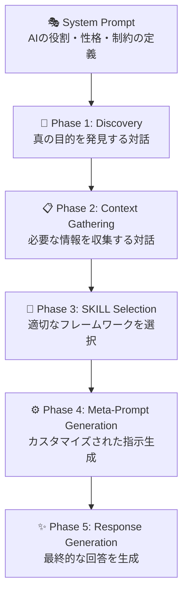

# 第2章 基礎概念

本章では、Interactive Agentic Prompt（IAP）を支える3つの革新ポイントと、その背景にある認知科学の知見について解説します。

## 2.1 IAPの3つの革新ポイント

IAPは「Interactive」「Agentic」「Prompt」という3つの要素から構成されています。それぞれの意味と、従来のプロンプトとの違いを見ていきましょう。

### 2.1.1 Interactive（対話的）

**Interactive**とは、AIとユーザーの間で双方向のコミュニケーションが行われることを意味します。

#### 従来のアプローチ

```
ユーザー → AI → 回答（一方向）
```

従来のプロンプトでは、ユーザーが質問や指示を出し、AIが回答するという一方向のやり取りが基本でした。ユーザーは「完璧な質問」を考える必要があり、情報が不足していれば汎用的な回答しか得られません。

#### IAPのアプローチ

```
ユーザー ⇄ AI ⇄ ユーザー ⇄ AI（双方向の対話）
```

IAPでは、AIが積極的に質問を投げかけます。ユーザーの回答を受けて次の質問を行い、必要な情報を段階的に収集します。この対話プロセスを通じて、ユーザー自身も気づいていなかった真のニーズが明らかになります。

:::message
**Interactiveの本質**
単なる「やり取りの回数が多い」ことではなく、「対話を通じて相互理解を深める」ことがInteractiveの本質です。
:::

### 2.1.2 Agentic（エージェント的）

**Agentic**とは、AIが受動的な応答者ではなく、能動的なファシリテーターとして振る舞うことを意味します。

#### 従来のAIの役割

- ユーザーの質問に答える
- 指示された通りに動作する
- 与えられた情報の範囲内で回答する

#### AgenticなAIの役割

| 役割 | 説明 |
|------|------|
| **ファシリテーター** | 対話を主導し、必要な情報を引き出す |
| **専門家** | 理論やフレームワークに基づいた提案を行う |
| **コンサルタント** | ユーザーの状況に合わせてカスタマイズされた解決策を提供 |
| **コーチ** | ユーザーの思考を整理し、気づきを促す |

AgenticなAIは、単に質問に答えるだけでなく、「何を質問すべきか」「どの情報が必要か」を自ら判断し、対話をリードします。

```
【AgenticなAIの発話例】

「プロジェクトの成功基準について伺います。
以下の3つの観点のうち、最も重視されるものはどれですか？

1. コスト削減（数値目標があれば教えてください）
2. 業務効率化（対象業務を特定できますか？）
3. 顧客満足度向上（現在の課題は何ですか？）

※複数選択も可能です」
```

### 2.1.3 Prompt（プロンプト）

**Prompt**は、AIの動作を規定する設計図です。IAPにおけるPromptは、単なる指示文ではなく、対話全体を制御する「オーケストレーションスクリプト」として機能します。

#### IAPプロンプトの構成要素



この体系化されたプロンプト設計により、再現性のある高品質な対話が実現します。

## 2.2 認知負荷理論とワーキングメモリ

IAPの設計は、認知科学の知見、特に**認知負荷理論**に基づいています。

### 2.2.1 認知負荷理論とは

認知負荷理論（Cognitive Load Theory）は、John Swellerが提唱した学習理論です。人間の認知システムには処理能力の限界があり、この限界を超えると学習や問題解決のパフォーマンスが低下するという考え方です。

### 2.2.2 ワーキングメモリの制約

人間のワーキングメモリ（作業記憶）には、以下の制約があります。

| 制約 | 説明 |
|------|------|
| **容量制限** | 同時に保持できる情報は7±2チャンク |
| **時間制限** | リハーサルなしでは約20秒で消失 |
| **処理と保持のトレードオフ** | 複雑な処理を行うと保持できる量が減少 |

### 2.2.3 3種類の認知負荷

認知負荷は3つの種類に分類されます。

- **内在的負荷（Intrinsic Load）**: タスク自体の複雑さに起因する負荷。専門的な内容を理解する際に必然的に発生します。
- **外在的負荷（Extraneous Load）**: 不適切な提示方法や余計な情報処理による負荷。設計の工夫で削減可能です。
- **関連的負荷（Germane Load）**: 深い理解やスキーマ形成に貢献する負荷。学習にとって有益な負荷です。

```
【認知負荷の最適化】

総認知負荷 = 内在的負荷 + 外在的負荷 + 関連的負荷
           ≤ ワーキングメモリの容量

IAPの目標：
・外在的負荷を最小化
・関連的負荷を適切に配分
・総負荷がワーキングメモリ容量を超えないよう管理
```

### 2.2.4 IAPにおける認知負荷の管理

IAPは、認知負荷理論に基づいて以下の設計原則を採用しています。

- **情報の分割（Chunking）**: 複雑な問題を小さな単位に分割し、一度に処理する情報量を制限します。
- **段階的開示（Progressive Disclosure）**: 必要な情報を必要なタイミングで提示し、不要な情報による負荷を防ぎます。
- **文脈の維持（Context Maintenance）**: AIが対話の文脈を保持し、ユーザーが過去の情報を記憶する必要性を軽減します。

## 2.3 一問一答アプローチの科学的根拠

IAPの核となる「一問一答（One Question at a Time）」アプローチは、認知負荷理論から導かれた設計原則です。

### 2.3.1 なぜ一問一答が効果的なのか

#### 問題：複数質問の認知負荷

```
【悪い例：複数質問を同時に投げかける】

「プロジェクトの目的は何ですか？また、予算規模と期間、
主要なステークホルダー、想定されるリスクについても
教えてください。成功の指標はどのように設定していますか？」
```

この質問を受けたユーザーは：
1. 6つの質問を同時に記憶する必要がある
2. どの質問から答えるか判断が必要
3. 回答しながら次の質問を覚えておく必要がある
4. 回答漏れが発生しやすい

#### 解決：一問一答のアプローチ

```
【良い例：一問一答で進める】

AI: 「まず、プロジェクトの目的について教えてください。」
User: 「業務効率化です」
AI: 「ありがとうございます。具体的にどの業務の効率化を
     目指していますか？」
User: 「経理部門の月次決算処理です」
AI: 「月次決算処理ですね。現在、どのくらいの時間が
     かかっていますか？」
```

一問一答では：
1. ユーザーは1つの質問に集中できる
2. 回答に基づいて次の質問が決まる
3. 対話の流れが自然で負担が少ない
4. 情報の漏れが発生しにくい

### 2.3.2 研究による裏付け

一問一答アプローチの効果は、複数の研究で実証されています。

:::message
**関連研究**
- Miller (1956): マジカルナンバー7±2の発見
- Sweller (1988): 認知負荷理論の提唱
- Mayer (2009): マルチメディア学習の原則
:::

### 2.3.3 一問一答の実装ガイドライン

IAPで一問一答を実装する際のガイドラインです。

| ガイドライン | 説明 |
|-------------|------|
| **1質問1回答** | 1回の発話で質問は1つまで |
| **明確な質問** | 曖昧さを排除し、具体的に質問する |
| **選択肢の提示** | 可能な場合は選択肢を示して負荷を軽減 |
| **確認の挿入** | 重要な情報は復唱して確認する |
| **フェーズ完了の明示** | 段階の区切りを明確にする |

```
【選択肢を使った一問一答の例】

AI: 「プロジェクトの優先度について確認させてください。
     以下のうち、最も重視するものはどれですか？

     1. スピード（早く始めたい）
     2. 品質（確実に成功させたい）
     3. コスト（予算を抑えたい）

     番号でお答えください。」
```

## 2.4 本章のまとめ

本章では、IAPの基礎となる3つの概念と認知科学的背景について学びました。

### 2.4.1 3つの革新ポイント
- **Interactive**: 双方向の対話による相互理解
- **Agentic**: AIが能動的なファシリテーターとして機能
- **Prompt**: 対話全体を制御するオーケストレーションスクリプト

### 2.4.2 認知負荷理論
- ワーキングメモリの制約を理解する
- 外在的負荷を最小化し、関連的負荷を最適化する
- 情報の分割、段階的開示、文脈維持が重要

### 2.4.3 一問一答アプローチ
- 認知負荷を軽減する科学的に有効な手法
- 1回の発話で1つの質問に限定
- 選択肢の提示で回答の負荷も軽減

---

次章では、これらの原則を具体的に実装した「5フェーズアーキテクチャ」について詳しく解説します。
