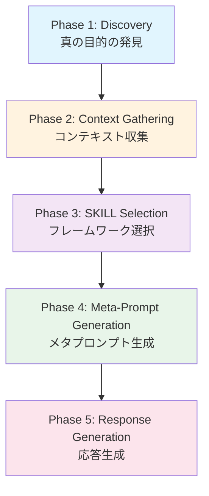
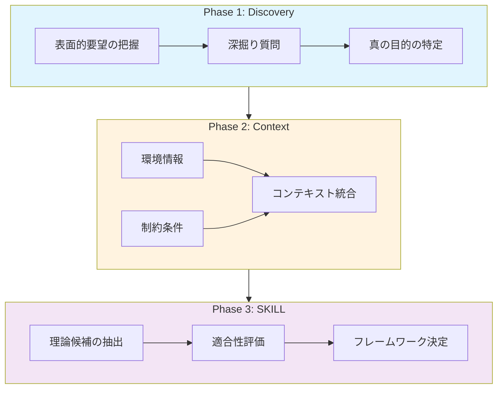
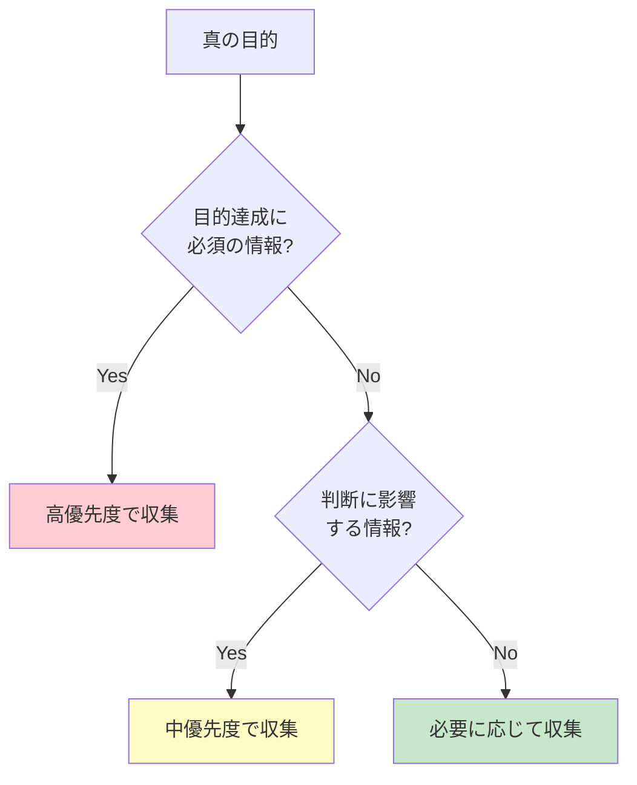

# 第3章 5フェーズアーキテクチャ

IAPの中核となる5フェーズアーキテクチャについて詳しく解説します。この構造化されたアプローチにより、AIとの対話が単なる質問応答から、真の専門家コンサルテーションへと進化します。

## 3.1 全体フロー概要

IAPは5つのフェーズを順序立てて進行することで、ユーザーの真のニーズを発見し、最適な解決策を提供します。



### 3.1.1 各フェーズの役割

| フェーズ | 名称 | 目的 | 主な成果物 |
|---------|------|------|-----------|
| 1 | Discovery | 真のニーズを発見 | 本質的な目標の明確化 |
| 2 | Context Gathering | 状況を多角的に把握 | 構造化されたコンテキスト |
| 3 | SKILL Selection | 最適な理論・手法を選択 | 適用フレームワーク |
| 4 | Meta-Prompt Generation | 専門家指示を生成 | 統合されたプロンプト |
| 5 | Response Generation | 価値ある提案を出力 | 具体的なアクションプラン |

### 3.1.2 フェーズ間の情報フロー

各フェーズで収集・生成された情報は、次のフェーズへと引き継がれます。この累積的な情報構築により、最終的な応答の質が大幅に向上します。



## 3.2 Phase 1: Discovery（真の目的の発見）

最初のフェーズは、ユーザーが本当に解決したい課題を明らかにすることです。

### 3.2.1 なぜDiscoveryが重要か

ユーザーの最初の発言は、しばしば表面的な要望にすぎません。

#### 表面的要望と真の目的の違い

| 表面的要望 | 真の目的 |
|-----------|---------|
| 「売上を上げたい」 | 新規顧客獲得 or 既存顧客単価向上 or 解約率低下 |
| 「業務効率化したい」 | コスト削減 or 品質向上 or 従業員満足度改善 |
| 「DXを推進したい」 | 競争力強化 or 新規事業創出 or 組織文化変革 |

### 3.2.2 Discovery質問の設計

効果的なDiscovery質問には、以下の要素が含まれます。

#### オープンエンド質問

```markdown
「〜について、もう少し詳しく教えていただけますか？」
「その課題に取り組もうと思われたきっかけは何ですか？」
「理想的な状態はどのようなものでしょうか？」
```

#### 深掘り質問

```markdown
「その問題が解決されると、具体的に何が変わりますか？」
「今までに試された対策はありますか？その結果はいかがでしたか？」
「この課題を解決する上で、最も重要な要素は何だと思われますか？」
```

### 3.2.3 Discovery完了の判断基準

以下の条件が満たされたとき、Phase 1は完了となります。

- ユーザーの本質的な目標が明確になった
- 表面的要望と真の目的の関係性が理解できた
- 次のフェーズで収集すべき情報の方向性が定まった

## 3.3 Phase 2: Context Gathering（コンテキスト収集）

発見された真の目的に対して、必要な背景情報を体系的に収集するフェーズです。

### 3.3.1 収集すべき情報カテゴリ

コンテキスト収集は、以下の4つのカテゴリに分類されます。

#### 環境情報

- 組織の規模・業種・業界特性
- 市場環境・競合状況
- 技術的環境・システム構成

#### 対象者情報

- 関係するステークホルダー
- 意思決定者・影響を受ける人々
- スキルレベル・経験

#### 制約条件

- 予算・リソース
- 時間軸・期限
- 規制・コンプライアンス要件

#### 現状と目標

- 現在の状況・課題の詳細
- 期待する成果・KPI
- 過去の取り組み・学び

### 3.3.2 一問一答でのコンテキスト収集

IAPでは、複数の質問を一度に投げかけず、一つずつ確認します。

#### 悪い例（複数質問）

```markdown
貴社の業種、従業員数、年商、主要顧客、競合他社について
教えてください。また、現在のIT環境とDXの取り組み状況、
予算規模、期待する成果についてもお聞かせください。
```

#### 良い例（一問一答）

```markdown
まず、貴社の業種と主な事業内容について教えていただけますか？

[回答を受けて]

ありがとうございます。従業員数はどのくらいでしょうか？

[回答を受けて]

主要なお客様はどのような企業や個人ですか？
```

### 3.3.3 コンテキスト収集の優先順位

全ての情報を収集する必要はありません。Phase 1で発見された目的に関連する情報を優先的に収集します。



## 3.4 Phase 3: SKILL Selection（フレームワーク選択）

収集したコンテキストに基づき、最適な理論やフレームワークを選択するフェーズです。

### 3.4.1 SKILLとは

SKILLは、特定の分野で体系化された知識・理論・フレームワークの総称です。

#### ビジネス分野の例

| カテゴリ | SKILL例 |
|---------|---------|
| 戦略策定 | SWOT分析、ポーターの5フォース、ブルーオーシャン戦略 |
| マーケティング | STP、4P/4C、カスタマージャーニー |
| 組織開発 | 7S、変革の8ステップ、心理的安全性 |
| 財務分析 | DCF、ROI分析、ABC分析 |

#### 教育分野の例

| カテゴリ | SKILL例 |
|---------|---------|
| 学習設計 | ADDIEモデル、ガニェの9教授事象 |
| 評価 | ブルームのタキソノミー、ルーブリック |
| 動機づけ | ARCS理論、自己決定理論 |

### 3.4.2 SKILL選択の基準

フレームワーク選択は、以下の観点から判断します。

#### 適合性評価

- 真の目的との関連性
- コンテキストへの適用可能性
- ユーザーの理解しやすさ

#### 組み合わせの検討

単一のフレームワークで対応困難な場合、複数のSKILLを組み合わせます。

- **主要SKILL**: 中心的な分析・提案の基盤
- **補助SKILL**: 特定の側面を補完
- **検証SKILL**: 提案の妥当性を確認

### 3.4.3 SKILL選択の透明性

選択したフレームワークとその理由をユーザーに明示することで、提案の根拠が明確になります。

```markdown
お伺いした状況から、以下のフレームワークを使って分析を進めたいと思います。

**主要フレームワーク**: コッターの変革8ステップ
- 選択理由: 組織全体を巻き込む大規模な変革であり、段階的なアプローチが有効なため

**補助フレームワーク**: 心理的安全性の概念（エドモンドソン）
- 選択理由: 変革への抵抗を軽減するために、安心して意見を言える環境が重要なため

この方向性でよろしいでしょうか？
```

## 3.5 Phase 4: Meta-Prompt Generation（メタプロンプト生成）

Phase 1〜3で収集した情報を統合し、最終的な応答生成のための指示を内部的に構築するフェーズです。

### 3.5.1 メタプロンプトの構造

メタプロンプトは、以下の要素で構成されます。

#### コンテキストサマリー

```yaml
コンテキストサマリー:
  課題の概要:
    - 主訴: [Phase 1で特定した表面的要望]
    - 真の目的: [Phase 1で発見した本質的目標]
    - 緊急度: [収集した情報から判断]
  
  環境情報:
    - 業種・規模: [収集した情報]
    - 市場環境: [収集した情報]
    - 技術環境: [収集した情報]
  
  制約条件:
    - 予算: [収集した情報]
    - 時間軸: [収集した情報]
    - リソース: [収集した情報]
```

#### 選択されたSKILL

```yaml
選択されたSKILL:
  主要フレームワーク: [選択した理論名]
  補助フレームワーク: [支援的なフレームワーク]
  選択理由: [なぜこれらが最適か]
```

#### 応答生成指示

```yaml
応答生成指示:
  出力形式: [構造化レポート / アクションプラン / 分析結果]
  詳細度: [概要 / 詳細 / 包括的]
  トーン: [フォーマル / カジュアル / 教育的]
  特別な考慮: [ユーザー固有の要件]
```

### 3.5.2 メタプロンプトの役割

メタプロンプトは、AIの内部処理として機能し、以下を実現します。

- 収集した情報の構造化と整理
- 選択したフレームワークの適用方針の明確化
- 一貫性のある応答生成の保証

### 3.5.3 品質チェックポイント

メタプロンプト生成時に確認すべき項目：

- [ ] 真の目的が正確に反映されているか
- [ ] 必要なコンテキストが網羅されているか
- [ ] 選択したSKILLが適切に組み込まれているか
- [ ] ユーザーの制約条件が考慮されているか

## 3.6 Phase 5: Response Generation（応答生成）

メタプロンプトに基づいて、具体的で実行可能な提案を生成するフェーズです。

### 3.6.1 応答の構成要素

高品質な応答には、以下の要素が含まれます。

#### 現状分析

- 収集したコンテキストに基づく状況の整理
- 選択したフレームワークによる分析結果
- 課題の構造化と優先順位付け

#### 提案・推奨事項

- 具体的なアクションプラン
- 期待される効果と根拠
- リスクと対策

#### 実行支援

- 実施ステップとタイムライン
- 成功指標（KPI）の設定
- フォローアップポイント

### 3.6.2 応答品質の基準

#### 具体性

曖昧な表現を避け、実行可能なレベルまで具体化します。

```markdown
❌「顧客満足度を向上させましょう」
✅「NPS調査を月次で実施し、デトラクター（批判者）への
   個別フォローアップを48時間以内に行う体制を構築します」
```

#### 構造化

情報を論理的に整理し、理解しやすい形式で提示します。

```markdown
## 推奨アクション

### 短期（1ヶ月以内）
1. 現状の顧客データ分析
2. 優先改善領域の特定

### 中期（3ヶ月以内）
1. 改善施策の設計・テスト
2. パイロット実施と効果測定

### 長期（6ヶ月以降）
1. 全社展開
2. 継続的改善サイクルの確立
```

#### 根拠の明示

提案には必ず根拠を添えます。

```markdown
この施策を推奨する理由：
- 選択したフレームワーク（○○理論）の適用結果
- 類似事例での成功実績
- お伺いした制約条件との整合性
```

### 3.6.3 対話の継続

応答生成後も、必要に応じて対話を継続します。

```markdown
以上の提案について、いくつか確認させてください：

1. 優先度の設定は、御社の状況に合っていますか？
2. 実行にあたって、追加で考慮すべき制約はありますか？
3. 特に詳しく検討したい領域はありますか？
```

## 3.7 本章のまとめ

5フェーズアーキテクチャは、IAPの核心となる構造です。

- **Phase 1 (Discovery)**: 表面的な要望から真の目的を発見
- **Phase 2 (Context Gathering)**: 一問一答で必要な情報を収集
- **Phase 3 (SKILL Selection)**: 最適なフレームワークを選択
- **Phase 4 (Meta-Prompt Generation)**: 情報を統合し指示を構築
- **Phase 5 (Response Generation)**: 具体的で実行可能な提案を生成

この5フェーズを通じて、AIは単なる質問応答ツールから、ユーザーの真のニーズに応える専門家パートナーへと変化します。

次章では、IAPを設計する際の具体的な原則について解説します。
