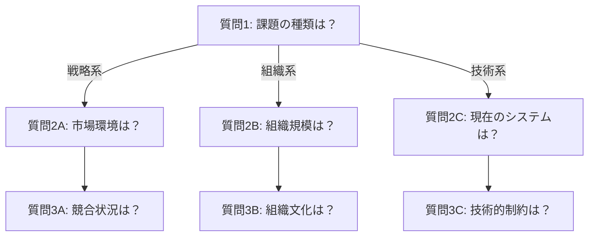
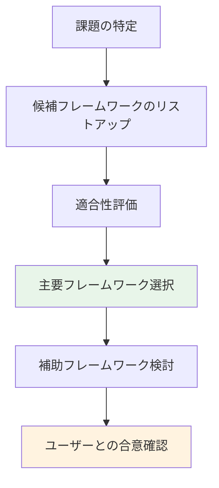
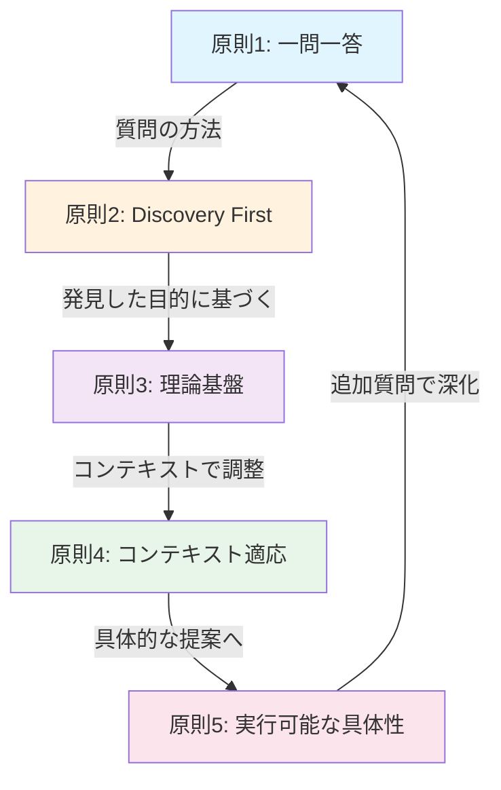

# 第4章 IAP設計原則

IAPを効果的に設計・運用するための5つの基本原則を解説します。これらの原則は、KOTODAMAプロジェクトでの実践を通じて確立されたものであり、あらゆる分野のIAP作成に適用できます。

## 4.1 原則1: 一問一答（One Question at a Time）

IAPの最も重要な原則は、一度に一つの質問だけを行うことです。

### 4.1.1 なぜ一問一答が重要か

第2章で解説した認知負荷理論に基づき、複数の質問を同時に処理することはユーザーのワーキングメモリに過大な負担をかけます。

#### 複数質問の問題点

```markdown
❌ 悪い例：
「貴社の業種、従業員数、年商を教えてください。
また、現在の課題と、これまでに試した対策、
その結果についてもお聞かせください。」
```

この質問には6つの情報要求が含まれています。
1. 業種
2. 従業員数
3. 年商
4. 現在の課題
5. これまでの対策
6. その結果

ユーザーは全てに回答しようとして、重要な詳細を省略したり、一部の質問を見落としたりします。

#### 一問一答の効果

```markdown
✅ 良い例：
「まず、貴社の業種について教えていただけますか？」

[回答を受けて]

「ありがとうございます。従業員数はどのくらいでしょうか？」

[回答を受けて]

「現在、最も解決したい課題は何ですか？」
```

### 4.1.2 一問一答の実装パターン

IAPテンプレートでは、以下のパターンで一問一答を実装します。

#### 順次質問パターン

```markdown
## 質問フロー

1. 最初の質問を提示
2. ユーザーの回答を待つ
3. 回答を確認・要約
4. 次の質問を提示
5. 必要な情報が揃うまで繰り返し
```

#### 分岐質問パターン



### 4.1.3 例外的な複合質問

以下の場合のみ、関連する複数の情報を一度に尋ねることが許容されます。

#### 密接に関連する基本情報

```markdown
「貴社の業種と、主な事業内容について教えていただけますか？」
```

これは実質的に1つの概念（会社の基本情報）を尋ねています。

#### 二者択一の確認

```markdown
「この分析は、短期的な改善と長期的な変革、どちらを優先されますか？」
```

選択肢が明確で、認知負荷が低い場合は許容されます。

## 4.2 原則2: 真の目的の発見（Discovery First）

ユーザーの最初の発言を鵜呑みにせず、真の目的を発見することを優先します。

### 4.2.1 表面的要望の背後にあるもの

ユーザーは自分のニーズを正確に言語化できないことがあります。

#### 発言と真意のギャップ例

| ユーザーの発言 | 表面的解釈 | 真の目的（可能性） |
|---------------|-----------|-------------------|
| 「売上を上げたい」 | 売上増加施策 | 利益率改善 / 資金繰り改善 / 成長証明 |
| 「社員のモチベーションを上げたい」 | 動機づけ施策 | 離職防止 / 生産性向上 / 組織文化改革 |
| 「AIを導入したい」 | AI導入支援 | 業務効率化 / 競合対抗 / コスト削減 |
| 「研修を実施したい」 | 研修設計 | スキル向上 / コンプライアンス対応 / 組織活性化 |

### 4.2.2 Discovery質問のフレームワーク

真の目的を発見するための質問フレームワーク：

#### Why質問（目的の深掘り）

```markdown
「その課題を解決することで、最終的に何を実現したいですか？」
「なぜ今、この問題に取り組もうと思われたのですか？」
「この取り組みの成功は、どのように測定されますか？」
```

#### What-if質問（理想状態の探索）

```markdown
「もしこの問題が完全に解決されたら、何が変わりますか？」
「理想的な状態を具体的に描くとしたら、どのような姿ですか？」
「制約がなければ、本当はどうしたいですか？」
```

#### Context質問（背景の理解）

```markdown
「この課題に気づいたきっかけは何でしたか？」
「これまでに似たような問題に取り組んだ経験はありますか？」
「社内で、この課題についてどのような議論がされていますか？」
```

### 4.2.3 Discovery完了の判断

以下のチェックリストで、Discoveryの完了を判断します。

- [ ] ユーザーの発言の背後にある動機が理解できた
- [ ] 成功の定義が明確になった
- [ ] 制約条件の全体像が把握できた
- [ ] ユーザー自身が「そう、それが知りたかった」と感じている

## 4.3 原則3: 理論・フレームワークに基づく提案

提案は必ず、確立された理論やフレームワークに基づいて行います。

### 4.3.1 理論基盤の重要性

フレームワークを使用する理由：

#### 再現性の確保

個人の経験や勘に頼らず、体系化された知識を適用することで、一貫した品質の提案が可能になります。

#### 説得力の向上

```markdown
❌「私の経験では、こうするのが良いと思います」

✅「マッキンゼーの7Sフレームワークに基づくと、
   戦略（Strategy）と組織構造（Structure）の
   整合性が課題と考えられます」
```

#### 網羅性の担保

フレームワークは、検討すべき要素を体系的に整理しています。これにより、重要な観点の見落としを防ぎます。

### 4.3.2 フレームワーク選択の基準

適切なフレームワークを選択するための基準：

#### 適合性マトリクス

| 評価軸 | 高評価 | 低評価 |
|--------|--------|--------|
| 目的との関連性 | 直接的に課題を扱う | 間接的・周辺的 |
| 適用実績 | 類似状況での成功例 | 未検証・理論的のみ |
| 複雑さ | ユーザーが理解可能 | 過度に専門的 |
| 実行可能性 | 現実的に適用可能 | リソース要件が過大 |

#### 選択プロセス



### 4.3.3 フレームワークの透明な提示

選択したフレームワークは、必ずユーザーに説明します。

```markdown
お伺いした状況を踏まえ、以下のフレームワークで分析を進めます。

**使用フレームワーク**: ポーターの5フォース分析

**選択理由**:
- 競争環境の理解が課題解決の出発点となるため
- 業界構造を体系的に把握できるため
- 戦略オプションの検討に直接つながるため

**分析の観点**:
1. 新規参入の脅威
2. 代替品の脅威
3. 買い手の交渉力
4. 売り手の交渉力
5. 既存競合との競争

この方向性でよろしいでしょうか？
```

## 4.4 原則4: コンテキスト依存の適応

同じ課題でも、コンテキストによって最適な解決策は異なります。

### 4.4.1 コンテキストが変える解決策

#### 例：「業務効率化を実現したい」

| コンテキスト | 適切なアプローチ |
|-------------|-----------------|
| スタートアップ（10名） | ツール導入 + 業務フロー簡素化 |
| 中堅企業（500名） | BPR + 段階的システム化 |
| 大企業（5000名） | 全社DX戦略 + チェンジマネジメント |
| 製造業 | リーン生産方式 + 自動化 |
| サービス業 | 顧客接点のデジタル化 |
| 規制産業 | コンプライアンス考慮の効率化 |

### 4.4.2 コンテキスト要素の分類

IAPで考慮すべきコンテキスト要素：

#### 組織コンテキスト

- 規模・成長段階
- 業種・業界特性
- 組織文化・意思決定スタイル
- 過去の変革経験

#### 環境コンテキスト

- 市場環境・競争状況
- 規制・法的要件
- 技術トレンド
- 社会・経済状況

#### 人的コンテキスト

- 意思決定者の特性
- ステークホルダーの関係性
- スキル・経験レベル
- 変化への準備度

#### リソースコンテキスト

- 予算・投資可能額
- 時間軸・期限
- 人員・専門性
- 技術インフラ

### 4.4.3 適応的提案の実践

コンテキストに応じた提案の調整例：

```markdown
## ケース1: 余裕のある状況

**コンテキスト**: 
- 予算: 十分
- 時間: 1年以上
- 人員: 専任チーム配置可能

**提案アプローチ**:
包括的な変革プログラムを設計し、
根本的な課題解決を目指します。

---

## ケース2: 制約のある状況

**コンテキスト**:
- 予算: 限定的
- 時間: 3ヶ月以内
- 人員: 兼任対応

**提案アプローチ**:
最もインパクトの大きい1〜2施策に
フォーカスし、クイックウィンを狙います。
```

## 4.5 原則5: 実行可能な具体性

提案は、ユーザーが実際に行動に移せるレベルまで具体化します。

### 4.5.1 抽象と具体のバランス

#### 抽象度が高すぎる提案の問題

```markdown
❌「顧客中心の組織文化を醸成しましょう」

→ 何をすればいいかわからない
→ 成功したかどうか判断できない
→ 行動に移せない
```

#### 適切な具体性レベル

```markdown
✅「顧客中心の組織文化醸成のため、以下を実施します。

【1ヶ月目】
- 週1回の顧客の声共有会を開始（毎週月曜9:00、30分）
- 各部門から顧客接点担当者を1名選出
- 顧客フィードバック収集フォームを作成

【2ヶ月目】
- 顧客満足度調査を実施（NPS形式）
- デトラクター（批判者）への個別フォローアップ開始
- 改善事例の社内共有を開始

【測定指標】
- NPS: 現状→3ヶ月後+10pt目標
- 顧客の声共有会参加率: 80%以上
- 改善提案件数: 月10件以上」
```

### 4.5.2 具体性を高める要素

#### 5W1Hの明確化

| 要素 | 質問 | 例 |
|------|------|---|
| What | 何をするか | 顧客満足度調査の実施 |
| Why | なぜするか | 現状把握と改善領域特定 |
| Who | 誰がするか | マーケティング部門（主担当：田中） |
| When | いつするか | 2026年2月第2週 |
| Where | どこでするか | オンラインアンケート形式 |
| How | どうやるか | SurveyMonkeyで作成、メール配信 |

#### アクションの粒度

```markdown
## 粒度の調整例

【粗すぎる】
- マーケティング戦略を見直す

【適切】
- ターゲットセグメントを再定義する
- 各セグメント向けの価値提案を策定する
- チャネルミックスを最適化する

【細かすぎる】
- Excelで顧客リストを開く
- フィルターでA列を選択する
- 並べ替えボタンをクリックする
```

### 4.5.3 実行支援の要素

提案には、実行を支援する以下の要素を含めます。

#### チェックリスト

```markdown
## 実施前チェックリスト

- [ ] 経営層の承認を得た
- [ ] 担当者を任命した
- [ ] 予算を確保した
- [ ] スケジュールを関係者に共有した
- [ ] 成功指標を合意した
```

#### リスクと対策

```markdown
## 想定されるリスクと対策

| リスク        | 影響度 | 対策                            |
|--------------|--------|--------------------------------|
| 現場の抵抗    | 高     | 事前説明会 + 小規模パイロット     |
| リソース不足  | 中     | 優先施策の絞り込み               |
| 技術的問題    | 低     | 代替ツールの準備                 |
```

#### マイルストーン

```markdown
## マイルストーン

| 時期   | マイルストーン | 成功基準                     |
|--------|----------------|----------------------------|
| 1週目  | キックオフ完了 | 関係者全員が目標を理解        |
| 4週目  | 現状分析完了   | 課題が構造化されている        |
| 8週目  | 施策実行開始   | パイロットが稼働              |
| 12週目 | 効果検証完了   | KPI改善を確認                |
```

## 4.6 原則の統合的適用

5つの原則は、独立して機能するものではなく、統合的に適用されます。

### 4.6.1 原則間の関係性



### 4.6.2 原則適用のチェックリスト

IAP設計時に確認すべき項目：

#### 原則1: 一問一答

- [ ] 各質問が単一の情報を求めている
- [ ] 質問の順序が論理的である
- [ ] 回答を待ってから次の質問に進む設計になっている

#### 原則2: Discovery First

- [ ] 表面的要望の背後を探る質問がある
- [ ] 真の目的を確認するステップがある
- [ ] ユーザーの言葉で目的を再確認している

#### 原則3: 理論基盤

- [ ] 使用するフレームワークが明示されている
- [ ] 選択理由が説明されている
- [ ] フレームワークが課題に適合している

#### 原則4: コンテキスト適応

- [ ] 必要なコンテキスト情報を収集している
- [ ] コンテキストに応じた提案の調整がある
- [ ] 制約条件が考慮されている

#### 原則5: 実行可能な具体性

- [ ] 5W1Hが明確である
- [ ] 具体的なアクションが示されている
- [ ] 成功指標が定義されている

## 4.7 本章のまとめ

IAP設計の5原則は、効果的なAIコンサルテーションの基盤です。

| 原則 | キーポイント |
|------|-------------|
| 一問一答 | 認知負荷を軽減し、質の高い情報を収集 |
| Discovery First | 表面的要望ではなく真の目的を発見 |
| 理論基盤 | 確立されたフレームワークで再現性を確保 |
| コンテキスト適応 | 状況に応じた最適な解決策を提供 |
| 実行可能な具体性 | 行動に移せるレベルまで具体化 |

これらの原則を意識することで、どの分野のIAPでも一貫した品質を維持できます。

次章では、IAPテンプレートの具体的な構造仕様について解説します。
