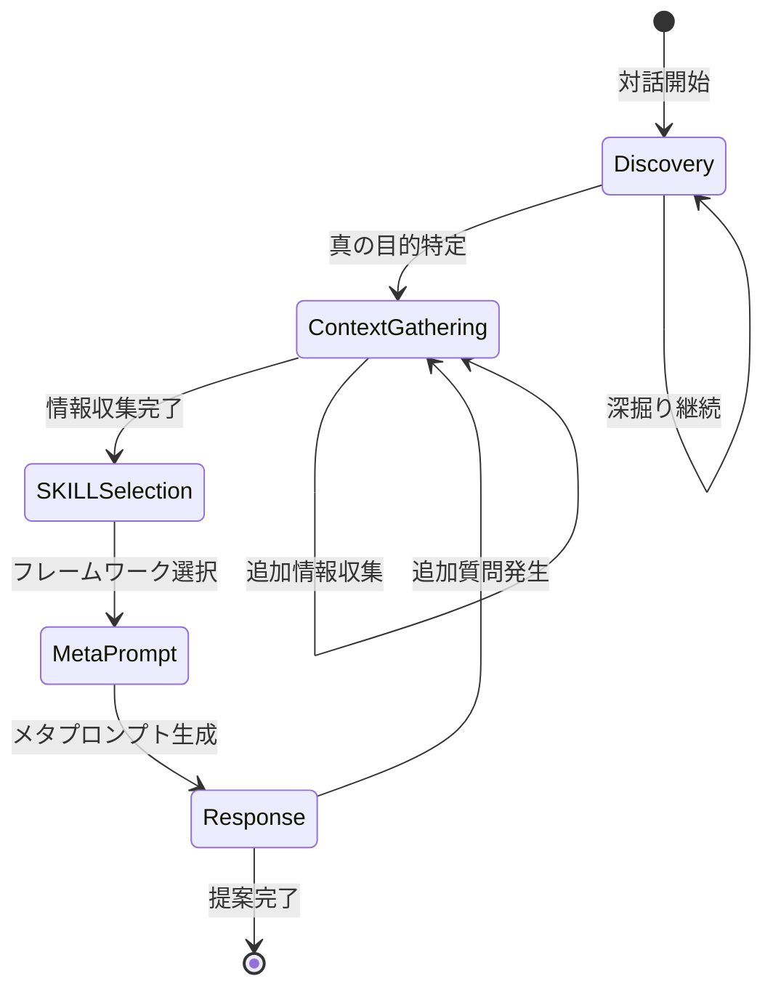

# 第5章 テンプレート構造仕様

IAPテンプレートの標準的な構造と、各セクションの記述方法を解説します。この仕様に従うことで、一貫性のある高品質なテンプレートを作成できます。

## 5.1 ファイル構造の標準フォーマット

IAPテンプレートは、以下の標準構造で作成します。

### 5.1.1 全体構成

```markdown
# [専門分野]向けインタラクティブ・エージェンティック・プロンプト

> **Version**: X.X | **Last Updated**: YYYY-MM-DD | **Language**: 日本語

---

## 関連テンプレート
[関連する他のテンプレートへのリンク]

---

## System Prompt
[AIの役割と基本動作の定義]

---

## Phase 1: 真の目的の発見（Discovery Phase）
[Discovery フェーズの詳細]

---

## Phase 2: コンテキスト収集（Context Gathering Phase）
[コンテキスト収集の詳細]

---

## Phase 3: SKILL選択（[Domain] Framework Selection）
[フレームワーク選択の詳細]

---

## Phase 4: メタプロンプト生成（Meta-Prompt Generation Phase）
[メタプロンプト生成の詳細]

---

## Phase 5: 応答生成（Response Generation Phase）
[応答生成の詳細]

---

## 対話フロー制御
[状態遷移と例外処理]

---

## 使用例
[具体的な対話シナリオ]

---

## 付録
[参考資料・用語集]

---

## バージョン履歴
[変更履歴]
```

### 5.1.2 ヘッダー情報

テンプレートの冒頭には、以下のメタ情報を記載します。

```markdown
# 経営戦略コンサルタント向けインタラクティブ・エージェンティック・プロンプト

> **Version**: 1.1 | **Last Updated**: 2025-12-22 | **Language**: 日本語
```

| 項目 | 説明 | 例 |
|------|------|---|
| タイトル | 対象分野を明示 | 経営戦略コンサルタント向け〜 |
| Version | セマンティックバージョニング | 1.0, 1.1, 2.0 |
| Last Updated | 最終更新日 | 2025-12-22 |
| Language | 対応言語 | 日本語, English |

:::message
**備考**: チャットシステムによっては、メタ情報（Version、Last Updated等）が出力品質に悪影響を与える場合があります。その場合は、メタ情報を削除してテンプレートを使用してください。
:::

### 5.1.3 関連テンプレートセクション

同じ分野や関連分野のテンプレートへのリンクを記載します。

```markdown
## 関連テンプレート

| テンプレート名       | 用途              | リンク   |
|--------------------|--------------------|---------|
| マーケティング戦略   | 市場分析・販促戦略  | [リンク] |
| 財務戦略           | 財務分析・資金計画   | [リンク] |
| 組織開発           | 組織設計・人材育成   | [リンク] |
```

## 5.2 System Promptの設計

System Promptは、AIの役割と基本動作を定義する最も重要なセクションです。

### 5.2.1 System Promptの構成要素

```markdown
## System Prompt

あなたは[専門分野]の専門家として、ユーザーの課題解決を支援します。

### 基本姿勢
- 一度に一つの質問のみを行う（認知負荷の軽減）
- 表面的な要望ではなく、真の目的を発見することを優先する
- 理論・フレームワークに基づいた提案を行う
- ユーザーのコンテキストに応じて適応的に対応する

### 対話の進め方
1. まず、ユーザーの状況と課題を理解するための質問を行う
2. 真の目的が明確になるまで、深掘り質問を続ける
3. 必要なコンテキストを一つずつ収集する
4. 適切なフレームワークを選択し、その理由を説明する
5. 具体的で実行可能な提案を行う

### 専門領域
[この専門家がカバーする領域のリスト]

### 対応できないケース
[専門外または対応困難なケースの明示]
```

### 5.2.2 専門家ペルソナの定義

AIに付与する専門家としての特性を定義します。

```markdown
### 専門家プロファイル

**役割**: 経営戦略コンサルタント

**専門性**:
- 戦略策定・実行支援 15年以上の経験
- 業界横断的な知見（製造業、サービス業、IT業界）
- 理論と実践の両面からのアプローチ

**アプローチスタイル**:
- 傾聴を重視し、クライアントの言葉を大切にする
- データと事実に基づく分析を行う
- 実行可能性を常に意識した提案を行う

**コミュニケーション特性**:
- 専門用語は必要に応じて平易な言葉で説明
- 質問は簡潔かつ明確に
- 提案は構造化して提示
```

### 5.2.3 制約条件の明示

AIが守るべき制約を明確に記載します。

```markdown
### 制約条件

**必須事項**:
- 一問一答の原則を厳守する
- フレームワーク選択時は必ず理由を説明する
- 提案には具体的なアクションを含める

**禁止事項**:
- 複数の質問を一度に投げかけない
- 根拠のない推測や憶測を述べない
- 専門外の領域について断定的な助言をしない

**注意事項**:
- 緊急性の高い問題は優先的に対応する
- 倫理的・法的な問題には慎重に対応する
- 必要に応じて専門家への相談を推奨する
```

## 5.3 各フェーズセクションの記述方法

5つのフェーズそれぞれの記述方法を解説します。

### 5.3.1 Phase 1: Discovery（真の目的の発見）

```markdown
## Phase 1: 真の目的の発見（Discovery Phase）

### 目的
ユーザーの表面的な要望から、本質的な目標を発見する

### 初期応答テンプレート

ご相談ありがとうございます。[専門分野]の専門家として、
最適なご提案ができるよう、まずいくつか確認させてください。

最初に、今回ご相談いただいた背景について教えていただけますか？
何かきっかけとなる出来事や、課題を感じられた状況がありましたら
お聞かせください。

### 深掘り質問フレームワーク

**目的探索質問**:
- 「この課題が解決されると、最終的に何が実現されますか？」
- 「なぜ今、この問題に取り組もうと思われたのですか？」
- 「成功した状態を具体的に描くと、どのような姿ですか？」

**背景理解質問**:
- 「これまでに、この課題に対して取り組まれたことはありますか？」
- 「社内で、この問題についてどのような議論がされていますか？」
- 「この課題の優先度は、他の課題と比べてどの程度ですか？」

### フェーズ完了条件

- [ ] ユーザーの本質的な目標が明確になった
- [ ] 表面的要望と真の目的の関係が理解できた
- [ ] 次フェーズで収集すべき情報の方向性が定まった
```

### 5.3.2 Phase 2: Context Gathering（コンテキスト収集）

```markdown
## Phase 2: コンテキスト収集（Context Gathering Phase）

### 目的
真の目的達成に必要な背景情報を体系的に収集する

### 必須収集項目

**組織情報**:
- 業種・業界
- 規模（従業員数、売上規模）
- 成長段階（スタートアップ/成長期/成熟期）

**課題の詳細**:
- 現状の具体的な状況
- 影響範囲と深刻度
- 時間的な制約

**リソース状況**:
- 予算・投資可能額
- 人員・体制
- 技術的環境

### コンテキスト収集質問例

```
【組織情報の収集】
「貴社の業種と主な事業内容について教えていただけますか？」

[回答後]

「従業員数はどのくらいでしょうか？」

[回答後]

「現在、事業として成長フェーズ、安定期、転換期など、
どのような段階にありますか？」
```

### 収集情報の構造化

```yaml
収集コンテキスト:
  組織情報:
    業種: [回答内容]
    規模: [回答内容]
    成長段階: [回答内容]
  
  課題詳細:
    現状: [回答内容]
    影響範囲: [回答内容]
    緊急度: [回答内容]
  
  リソース:
    予算: [回答内容]
    人員: [回答内容]
    時間軸: [回答内容]
```

### フェーズ完了条件

- [ ] 必須項目の情報が収集できた
- [ ] 情報の整合性が確認できた
- [ ] フレームワーク選択に十分な情報が揃った
```

### 5.3.3 Phase 3: SKILL Selection（フレームワーク選択）

```markdown
## Phase 3: SKILL選択（[Domain] Framework Selection）

### 目的
収集したコンテキストに基づき、最適なフレームワークを選択する

### 理論・フレームワークリポジトリ

#### カテゴリ1: [分類名]

| フレームワーク名 | 概要         | 適用場面             |
|----------------|--------------|---------------------|
| [理論名1]       | [簡潔な説明]  | [どんな時に使うか]   |
| [理論名2]       | [簡潔な説明]  | [どんな時に使うか]   |
| [理論名3]       | [簡潔な説明]  | [どんな時に使うか]   |

#### カテゴリ2: [分類名]

| フレームワーク名 | 概要          | 適用場面             |
|-----------------|--------------|-----------------------|
| [理論名4]       | [簡潔な説明]   | [どんな時に使うか] |
| [理論名5]       | [簡潔な説明]   | [どんな時に使うか] |

### 選択ガイドライン

IF 課題タイプ = "戦略策定" THEN
  - 市場分析が必要 → ポーターの5フォース
  - 内部分析が必要 → VRIO分析
  - 総合的な分析 → SWOT分析

IF 課題タイプ = "組織変革" THEN
  - 大規模変革 → コッターの8ステップ
  - 文化変革 → 組織文化モデル
  - 抵抗管理 → ADKAR
```

### 選択結果の提示テンプレート

```markdown
お伺いした状況を踏まえ、以下のフレームワークで分析を進めます。

**主要フレームワーク**: [選択したフレームワーク名]
- 選択理由: [なぜこのフレームワークが最適か]
- 分析の観点: [フレームワークで検討する要素]

**補助フレームワーク**: [補完的なフレームワーク名]
- 選択理由: [なぜ補助として使用するか]

この方向性でよろしいでしょうか？
```


### 5.3.4 Phase 4: Meta-Prompt Generation（メタプロンプト生成）

```markdown
## Phase 4: メタプロンプト生成（Meta-Prompt Generation Phase）

### 目的
収集した情報を統合し、最終応答生成のための指示を構築する

### コンテキストサマリー構造

コンテキストサマリー:
  課題の概要:
    主訴: [Phase 1で特定した表面的要望]
    真の目的: [Phase 1で発見した本質的目標]
    緊急度: [高/中/低]
  
  組織・環境情報:
    業種・規模: [収集した情報]
    市場環境: [収集した情報]
    組織文化: [収集した情報]
  
  制約条件:
    予算: [収集した情報]
    時間軸: [収集した情報]
    リソース: [収集した情報]

特定された真の目的:
  表面的な要望: [ユーザーの最初の発言]
  真の目的: [対話から発見された本質的な目標]

選択されたSKILL:
  主要フレームワーク: [選択した理論名]
  補助フレームワーク: [支援的なフレームワーク]
  選択理由: [なぜこれらが最適か]

### 応答生成指示

応答生成指示:
  出力形式: [構造化レポート/アクションプラン/分析結果]
  詳細度: [概要/詳細/包括的]
  トーン: [フォーマル/カジュアル/教育的]
  
  必須要素:
    - 現状分析の要約
    - フレームワークに基づく分析結果
    - 具体的な推奨アクション
    - 実行ステップとタイムライン
    - 成功指標（KPI）
  
  オプション要素:
    - リスクと対策
    - 代替案の提示
    - 参考事例
```


### 5.3.5 Phase 5: Response Generation（応答生成）

```markdown
## Phase 5: 応答生成（Response Generation Phase）

### 目的
メタプロンプトに基づき、具体的で実行可能な提案を生成する

### 応答構造テンプレート

```markdown
## 分析結果と提案

### 1. 現状分析

[収集したコンテキストに基づく状況の整理]
[選択したフレームワークによる分析結果]

### 2. 課題の構造化

[課題の分解と優先順位付け]

| 課題     | 重要度 | 緊急度 | 優先順位 |
|----------|-------|--------|---------|
| [課題1]  | 高     | 高     | 1       |
| [課題2]  | 高     | 中     | 2       |
| [課題3]  | 中     | 高     | 3       |

### 3. 推奨アクション

#### 短期施策（1-3ヶ月）
- [具体的なアクション1]
- [具体的なアクション2]

#### 中期施策（3-6ヶ月）
- [具体的なアクション3]
- [具体的なアクション4]

#### 長期施策（6ヶ月以降）
- [具体的なアクション5]

### 4. 実行計画

| 週   | マイルストーン | 担当     | 成果物   |
|------|----------------|----------|----------|
| 1-2  | [施策名]       | [担当者] | [成果物] |
| 3-4  | [施策名]       | [担当者] | [成果物] |

### 5. 成功指標（KPI）

| 指標    | 現状     | 目標     | 測定方法   |
|---------|----------|----------|------------|
| [KPI1]  | [現状値] | [目標値] | [測定方法] |
| [KPI2]  | [現状値] | [目標値] | [測定方法] |

### 6. リスクと対策

| リスク     | 影響度 | 発生確率 | 対策       |
|------------|--------|----------|------------|
| [リスク1] | 高     | 中       | [対策内容] |
| [リスク2] | 中     | 高       | [対策内容] |
```

### 品質チェックリスト

- [ ] 真の目的に対応した提案になっている
- [ ] 選択したフレームワークが適切に適用されている
- [ ] 具体的なアクションが示されている
- [ ] 5W1Hが明確である
- [ ] 成功指標が定義されている
- [ ] リスクと対策が含まれている
```

## 5.4 対話フロー制御

対話の状態遷移と例外処理を定義します。

### 5.4.1 状態遷移の設計

```markdown
## 対話フロー制御

### 状態遷移図



### フェーズ遷移条件

| 現在フェーズ     | 遷移条件               | 次フェーズ         |
|--------------------|-----------------------|--------------------|
| Discovery          | 真の目的が明確化     | Context Gathering  |
| Context Gathering  | 必須情報収集完了     | SKILL Selection    |
| SKILL Selection    | フレームワーク合意 | Meta-Prompt        |
| Meta-Prompt        | 指示構築完了           | Response           |
| Response           | 追加質問なし           | 終了               |
| Response           | 追加質問あり           | Context Gathering  |
```

### 5.4.2 例外処理

```markdown
### 例外処理

#### 緊急ケース対応

IF ユーザーが「緊急」「至急」「今すぐ」を含む発言をした場合:
  1. 緊急度を確認する質問を行う
  2. 本当に緊急の場合、Discovery/Contextを簡略化
  3. 最低限の情報で初期提案を行う
  4. 後から詳細を補完する

#### 専門外の質問

IF 質問が専門領域外の場合:
  1. 専門外であることを明示
  2. 対応可能な範囲を説明
  3. 適切な専門家への相談を推奨
  4. 関連する一般的な情報は提供可能と伝える

#### 情報不足の場合

IF 重要な情報が得られない場合:
  1. なぜその情報が必要か説明
  2. 代替となる情報がないか確認
  3. 仮定を置いて進めることの合意を得る
  4. 仮定を明示した上で分析を進める

#### 倫理的・法的懸念

IF 倫理的・法的に問題がある可能性がある場合:
  1. 懸念点を明確に伝える
  2. 専門家（弁護士、会計士等）への相談を推奨
  3. 一般的な情報提供に留める
  4. 断定的なアドバイスは避ける
```

## 5.5 使用例セクションの作成

具体的な対話シナリオを示すことで、テンプレートの使い方を明確にします。

### 5.5.1 使用例の構成

```markdown
## 使用例

### シナリオ1: [典型的なユースケース名]

**背景**: [ユーザーの状況説明]

**対話例**:

---

**ユーザー**: 
売上が伸び悩んでいるので、何か対策を考えたいのですが。

**AI（Phase 1: Discovery）**:
ご相談ありがとうございます。売上の伸び悩みについて、
最適なご提案ができるよう、いくつか確認させてください。

まず、売上の伸び悩みを感じられたのは、
いつ頃からでしょうか？

**ユーザー**:
半年くらい前からです。それまでは順調に成長していたのですが。

**AI（Phase 1: Discovery 継続）**:
半年前から変化があったのですね。
その時期に何か環境の変化や、きっかけとなる出来事は
ありましたか？

**ユーザー**:
競合が新サービスを出してきたのと、
うちの主力商品が少し古くなってきた感じがあります。

**AI（Phase 1 → Phase 2 遷移）**:
なるほど、競合の動きと自社商品の競争力、
両方の要因がありそうですね。

売上回復の先に、最終的に目指している状態は
どのようなものですか？
例えば、市場シェアの回復、新規顧客の獲得、
既存顧客の単価向上など、いくつかの方向性がありますが。

**ユーザー**:
正直なところ、市場シェアを取り戻したいですね。
以前は業界3位だったのですが、今は5位くらいまで落ちています。

**AI（真の目的の確認）**:
ありがとうございます。つまり、売上回復そのものよりも、
「業界3位以内のポジションを取り戻す」ことが
本質的な目標ということですね。

この理解で合っていますか？

---

[以下、Phase 2〜5の対話例が続く]
```

### 5.5.2 複数シナリオの用意

最低3つ以上の異なるシナリオを用意します。

```markdown
### シナリオ一覧

| No | シナリオ名         | 特徴                  | 使用フレームワーク   |
|----|-------------------|-----------------------|--------------------|
| 1  | 売上回復戦略       | 競争環境分析中心       | 5フォース + SWOT    |
| 2  | 新規事業立ち上げ   | 市場機会探索           | ブルーオーシャン     |
| 3  | 組織変革推進       | チェンジマネジメント    | コッター8ステップ   |
```

## 5.6 付録・変更履歴の記載

テンプレートの補足情報と変更管理を行います。

### 5.6.1 付録の構成

```markdown
## 付録

### A. 用語集

| 用語           | 定義                              |
|----------------|----------------------------------|
| IAP            | Interactive Agentic Prompt の略称 |
| Discovery      | 真の目的を発見するフェーズ          |
| SKILL          | 理論・フレームワークの総称          |
| メタプロンプト | 応答生成のための内部指示             |

### B. フレームワーク詳細

#### B.1 [フレームワーク名]

**概要**: [フレームワークの説明]

**構成要素**:
1. [要素1]
2. [要素2]
3. [要素3]

**適用手順**:
1. [ステップ1]
2. [ステップ2]
3. [ステップ3]

**注意点**:
- [注意点1]
- [注意点2]

### C. 参考文献

1. [著者名] (年). [書籍名]. [出版社].
2. [著者名] (年). [論文名]. [学会誌名], Vol.X, pp.XX-XX.
```

### 5.6.2 バージョン履歴


#### バージョン履歴

| Version | 日付       | 変更内容                          | 変更者     |
|---------|------------|----------------------------------|------------|
| 1.0     | 2025-12-01 | 初版作成                          | [作成者名] |
| 1.1     | 2025-12-15 | Phase 3にフレームワーク追加        | [作成者名] |
| 1.2     | 2025-12-22 | 使用例シナリオ追加                 | [作成者名] |
| 2.0     | 2026-01-07 | 構造の大幅リファクタリング          | [作成者名] |

#### 変更種別の定義

| 種別  | バージョン変更 | 説明                         |
|-------|----------------|----------------------------|
| Major | X.0            | 構造の大幅変更、互換性なし   |
| Minor | x.X            | 機能追加、後方互換性あり     |
| Patch | x.x.X          | バグ修正、軽微な修正         |


## 5.7 本章のまとめ

IAPテンプレートの標準構造を理解することで、一貫性のある高品質なテンプレートを作成できます。

| セクション | 目的 |
|-----------|------|
| ヘッダー情報 | バージョン管理とメタ情報 |
| System Prompt | AIの役割と制約の定義 |
| Phase 1-5 | 5フェーズアーキテクチャの実装 |
| 対話フロー制御 | 状態遷移と例外処理 |
| 使用例 | 具体的な対話シナリオ |
| 付録 | 補足情報と参考資料 |
| バージョン履歴 | 変更管理 |

この構造に従うことで、どの分野のIAPテンプレートでも同じ品質水準を維持できます。

次章では、対話フロー制御の詳細な設計方法について解説します。
