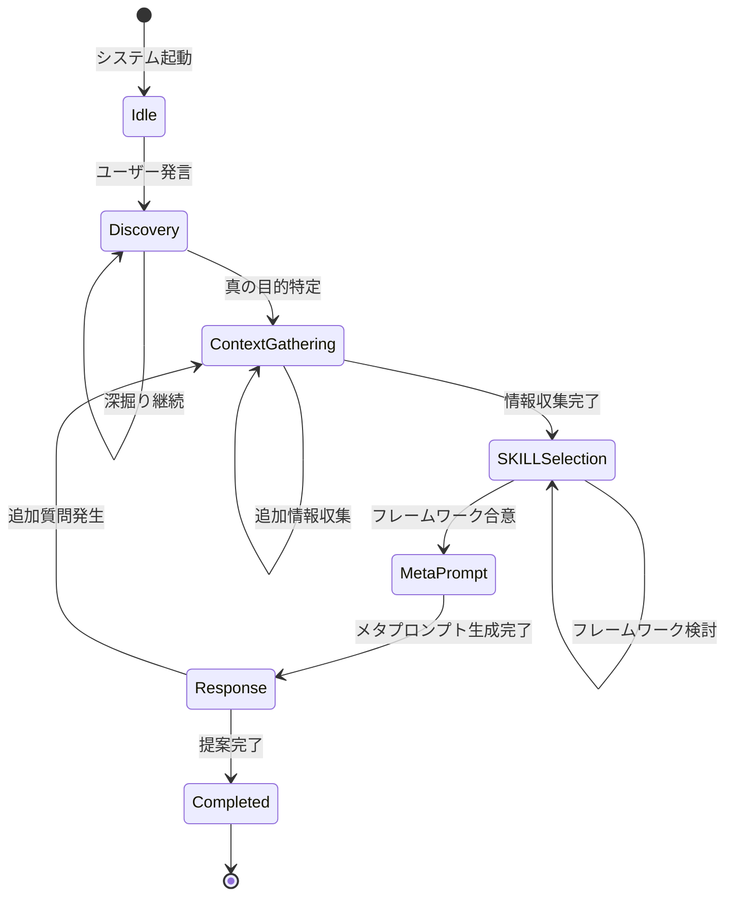
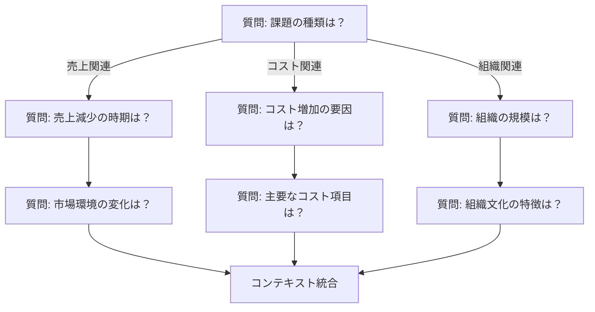
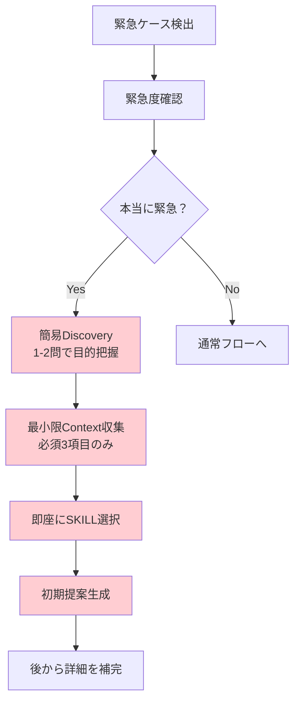

# 第6章 対話フロー制御

IAPの対話フローを適切に制御することで、ユーザーとの対話がスムーズに進み、質の高い提案につながります。本章では、状態遷移の設計から例外処理まで、対話制御の詳細を解説します。

## 6.1 状態遷移の設計

IAPの対話は、明確な状態遷移に基づいて進行します。

### 6.1.1 基本状態遷移モデル

IAPの5フェーズは、以下の状態遷移モデルで表現されます。



### 6.1.2 状態の定義

各状態の詳細な定義と、その状態で行うべきアクションを示します。

| 状態 | 定義 | 主なアクション |
|------|------|---------------|
| Idle | 対話開始前 | 初期メッセージの準備 |
| Discovery | 真の目的を探索中 | 深掘り質問、目的の明確化 |
| ContextGathering | コンテキスト収集中 | 一問一答での情報収集 |
| SKILLSelection | フレームワーク選択中 | 理論の検討、選択理由の説明 |
| MetaPrompt | 内部指示生成中 | 情報の統合、指示の構築 |
| Response | 応答生成・提示中 | 提案の提示、フィードバック確認 |
| Completed | 対話完了 | クロージング、次のアクション案内 |

### 6.1.3 遷移トリガーの設計

状態間の遷移は、特定のトリガーによって発生します。

```markdown
## 遷移トリガー定義

### Discovery → ContextGathering
トリガー: 真の目的の特定完了
条件:
  - ユーザーの本質的な目標が言語化された
  - ユーザーが目標に同意した
  - 収集すべき情報の方向性が定まった

### ContextGathering → SKILLSelection
トリガー: 必須情報の収集完了
条件:
  - 必須収集項目が埋まった
  - 情報に矛盾がない
  - フレームワーク選択に十分な情報がある

### SKILLSelection → MetaPrompt
トリガー: フレームワークの合意
条件:
  - 主要フレームワークが選択された
  - 選択理由をユーザーに説明した
  - ユーザーが方向性に同意した

### Response → ContextGathering（逆遷移）
トリガー: 追加情報の必要性
条件:
  - 提案に対する質問で新たな情報が必要
  - 前提条件の変更が判明
  - より詳細な分析が求められた
```

## 6.2 一問一答の原則と実装

一問一答は、IAPの最も重要な対話原則です。

### 6.2.1 一問一答の実装パターン

#### シーケンシャルパターン

最も基本的な実装パターンで、質問を順番に行います。

```markdown
## 質問シーケンス例

[質問1] 貴社の業種について教えてください。
  ↓ 回答待ち
[確認] 製造業ですね。承知しました。
  ↓
[質問2] 従業員数はどのくらいでしょうか？
  ↓ 回答待ち
[確認] 約500名ですね。
  ↓
[質問3] 現在、最も優先度の高い課題は何ですか？
```

#### 条件分岐パターン

回答に応じて次の質問を変える実装パターンです。



#### 適応的パターン

ユーザーの回答の詳細度に応じて、質問の深さを調整します。

```markdown
## 適応的質問の例

[質問] 現在の課題について教えてください。

--- ケース1: 簡潔な回答 ---
[回答] 「売上が落ちています」

[適応] 回答が簡潔なため、深掘り質問を追加
→ 「売上の減少は、いつ頃から感じられていますか？」

--- ケース2: 詳細な回答 ---
[回答] 「昨年Q3から売上が前年比15%減少しています。
       主な原因は競合の新製品投入と、
       当社の主力製品の陳腐化だと考えています」

[適応] 十分な情報があるため、確認に移行
→ 「詳しくありがとうございます。
   つまり、競争力の回復が主要課題ということですね？」
```

### 6.2.2 質問キューの管理

複数の質問が必要な場合、内部的に質問キューを管理します。

```yaml
質問キュー管理:
  必須質問:
    - 業種・業界
    - 組織規模
    - 課題の詳細
    - 時間軸・期限
    - 予算規模
  
  状態:
    完了: [業種・業界, 組織規模]
    現在: 課題の詳細
    待機: [時間軸・期限, 予算規模]
  
  優先度調整:
    - 緊急フラグがある場合 → 時間軸を優先
    - 予算言及があった場合 → 予算を前倒し
```

### 6.2.3 回答の検証と確認

ユーザーの回答を適切に検証し、必要に応じて確認を行います。

```markdown
## 回答検証フロー

1. 回答の受領
   ↓
2. 内容の解析
   - 質問に対応しているか
   - 十分な詳細度があるか
   - 矛盾する情報がないか
   ↓
3. 検証結果に応じた対応
   
   [十分な回答の場合]
   → 確認サマリーを提示
   → 次の質問へ進む
   
   [不十分な回答の場合]
   → 追加の深掘り質問
   → 具体例を求める
   
   [矛盾がある場合]
   → 矛盾点を指摘
   → 確認質問を行う
```

## 6.3 フェーズ完了条件の定義

各フェーズには明確な完了条件を設定し、次のフェーズへの遷移を判断します。

### 6.3.1 Discovery完了条件

```markdown
## Phase 1: Discovery 完了チェックリスト

### 必須条件（すべて満たす必要あり）
- [ ] ユーザーの表面的な要望を把握した
- [ ] 真の目的（本質的な目標）を特定した
- [ ] ユーザーが真の目的に同意した
- [ ] 次フェーズで収集すべき情報の方向性が明確

### 品質条件（推奨）
- [ ] 真の目的が具体的かつ測定可能
- [ ] 表面的要望と真の目的の関係が説明できる
- [ ] 成功の定義が共有されている

### 完了判定ロジック
IF 必須条件がすべてTRUE THEN
  → ContextGatheringへ遷移
ELSE
  → Discoveryを継続（深掘り質問）
```

### 6.3.2 ContextGathering完了条件

```markdown
## Phase 2: ContextGathering 完了チェックリスト

### 必須収集項目（分野により異なる）

#### ビジネス系テンプレートの場合
- [ ] 業種・業界
- [ ] 組織規模（従業員数または売上規模）
- [ ] 課題の詳細と影響範囲
- [ ] 時間軸・期限
- [ ] 予算・リソース状況

#### 教育系テンプレートの場合
- [ ] 対象学習者の属性
- [ ] 学習目標
- [ ] 現在の習熟度
- [ ] 利用可能な時間・リソース
- [ ] 制約条件（環境、ツール等）

### 情報品質条件
- [ ] 情報間に矛盾がない
- [ ] 重要項目は具体的な数値または事実で把握
- [ ] フレームワーク選択に十分な情報がある

### 完了判定ロジック
IF 必須収集項目の80%以上が埋まっている
   AND 情報品質条件を満たす THEN
  → SKILLSelectionへ遷移
ELSE
  → 不足項目の収集を継続
```

### 6.3.3 SKILLSelection完了条件

```markdown
## Phase 3: SKILLSelection 完了チェックリスト

### 必須条件
- [ ] 主要フレームワークを選択した
- [ ] 選択理由を説明した
- [ ] ユーザーが選択に同意した

### 品質条件
- [ ] フレームワークが真の目的に適合している
- [ ] コンテキストに対して適用可能
- [ ] 必要に応じて補助フレームワークを選定

### ユーザー確認テンプレート
「お伺いした状況から、[フレームワーク名]を使って
分析を進めたいと思います。

選択理由：
- [理由1]
- [理由2]

この方向性でよろしいでしょうか？」

### 完了判定ロジック
IF ユーザーが明示的に同意 THEN
  → MetaPromptへ遷移
ELSE IF ユーザーが懸念を示した THEN
  → 代替フレームワークを検討
ELSE
  → 確認質問を再度実施
```

### 6.3.4 Response完了条件

```markdown
## Phase 5: Response 完了チェックリスト

### 提案品質条件
- [ ] 真の目的に対応した提案になっている
- [ ] 具体的なアクションが含まれている
- [ ] 5W1Hが明確
- [ ] 成功指標（KPI）が定義されている
- [ ] リスクと対策が含まれている

### 対話完了条件
- [ ] ユーザーが提案を理解した
- [ ] 追加の質問に回答した
- [ ] 次のステップが明確

### クロージングテンプレート
「以上が私からのご提案です。

ご不明な点や、さらに詳しく検討したい領域は
ありますか？

また、実行に移される際にサポートが必要な部分が
あれば、お知らせください。」
```

## 6.4 例外処理（緊急ケース対応）

通常のフローから外れるケースへの対応方法を定義します。

### 6.4.1 緊急ケースの検出

```markdown
## 緊急ケース検出パターン

### キーワード検出
以下のキーワードを含む発言は緊急フラグを立てる：
- 「緊急」「至急」「今すぐ」「急ぎ」
- 「明日まで」「今週中」「締め切り」
- 「クライシス」「危機」「トラブル」

### 文脈検出
- 時間的制約が明示されている
- 損失・リスクが発生中
- 意思決定の期限が迫っている

### 緊急度判定フロー
IF 緊急キーワード検出 THEN
  → 緊急度確認質問を実施
  
「緊急とのことですが、具体的にいつまでに
何が必要でしょうか？」
```

### 6.4.2 緊急時の短縮フロー



### 6.4.3 緊急時の対話テンプレート

```markdown
## 緊急時対話テンプレート

### 初期応答
「緊急のご相談ですね。迅速に対応いたします。

最低限の確認をさせてください：
1. 何についての緊急事態ですか？
2. いつまでに何が必要ですか？
3. 現在の状況を一言で教えてください」

### 簡易分析後の初期提案
「限られた情報ですが、まず取り急ぎの提案をいたします：

【即座に実行すべきこと】
- [アクション1]
- [アクション2]

【注意点】
この提案は限定的な情報に基づいています。
状況が落ち着きましたら、より詳細な分析を
行うことをお勧めします。

追加で確認したいことはありますか？」
```

### 6.4.4 情報不足時の対応

```markdown
## 情報不足時の対応フロー

### 検出条件
- 重要な質問に「わからない」「不明」と回答
- 回答を避ける傾向がある
- 情報へのアクセスがない

### 対応オプション

#### オプション1: 代替情報の探索
「[項目]についての正確な情報がない場合、
概算や推定値でも構いません。
だいたいの感覚で教えていただけますか？」

#### オプション2: 仮定を置いて進める
「[項目]については、一般的な[業界/状況]の
傾向から、[仮定値]と仮定して進めます。
この仮定が大きく外れている場合は
お知らせください。」

#### オプション3: その項目をスキップ
「[項目]の情報なしでも、
ある程度の分析は可能です。
ただし、[制限事項]という制約がつきます。
それでもよろしいですか？」
```

## 6.5 特別な配慮が必要なケース

通常とは異なる対応が求められるケースへの対処方法です。

### 6.5.1 感情的なユーザーへの対応

```markdown
## 感情的なケースへの対応

### 検出パターン
- 感情的な言葉遣い（怒り、不安、焦り）
- 愚痴や不満の表出
- 論理的でない発言の繰り返し

### 対応原則
1. まず感情を受け止める
2. 共感を示す
3. 落ち着いてから本題に戻る

### 対応テンプレート
「おっしゃる状況、大変なご心労だと思います。
[具体的な状況]に直面されているのですね。

まずは、今のお気持ちを整理するお手伝いを
させていただきたいと思います。

一番お困りの点は何でしょうか？」
```

### 6.5.2 専門外の質問への対応

```markdown
## 専門外ケースへの対応

### 検出条件
- テンプレートの専門領域外の質問
- 法律・医療など専門家が必要な領域
- 回答にリスクがある質問

### 対応フロー
1. 専門外であることを明示
2. 対応可能な範囲を説明
3. 適切な専門家への相談を推奨
4. 一般的な情報は提供可能と伝える

### 対応テンプレート
「ご質問いただいた[トピック]については、
私の専門領域外となります。

この分野については、[適切な専門家]に
ご相談されることをお勧めします。

ただし、一般的な観点から
以下の情報はお伝えできます：
- [一般的な情報1]
- [一般的な情報2]

[専門領域]に関連する部分でしたら、
詳しくサポートできます。」
```

### 6.5.3 倫理的・法的懸念への対応

```markdown
## 倫理的・法的懸念ケースへの対応

### 検出条件
- 法的にグレーな領域の質問
- 倫理的に問題がある可能性
- コンプライアンス違反の恐れ

### 対応原則
1. 懸念点を明確に伝える
2. リスクを説明する
3. 専門家への相談を強く推奨
4. 断定的なアドバイスは避ける

### 対応テンプレート
「ご質問の内容について、
いくつか懸念点がございます。

[懸念事項]については、
[法律/倫理/コンプライアンス]の観点から
慎重な検討が必要です。

この件については、
[弁護士/会計士/専門家]にご相談の上、
進められることを強くお勧めします。

私からは一般的な情報提供に
とどめさせていただきます。」
```

### 6.5.4 複数ステークホルダーへの対応

```markdown
## 複数ステークホルダーケースへの対応

### 検出条件
- 複数の関係者の利害が絡む
- 異なる立場からの要求がある
- 意思決定者が複数いる

### 対応フロー
1. ステークホルダーの特定
2. それぞれの立場・利害の把握
3. 共通目標の探索
4. バランスの取れた提案

### 確認質問テンプレート
「この件には複数の関係者がいらっしゃるようですね。

確認させてください：
1. 主な関係者は誰ですか？
2. それぞれの立場や期待は何ですか？
3. 最終的な意思決定者は誰ですか？
4. 関係者間で対立している点はありますか？」
```

## 6.6 対話履歴の管理

長い対話を適切に管理し、一貫性を保つ方法です。

### 6.6.1 コンテキストの保持

```yaml
対話コンテキスト管理:
  セッション情報:
    開始時刻: [タイムスタンプ]
    現在フェーズ: [フェーズ名]
    経過フェーズ: [完了フェーズリスト]
  
  収集済み情報:
    真の目的: [特定された目的]
    組織情報:
      業種: [回答]
      規模: [回答]
    課題詳細: [回答]
    制約条件: [回答]
  
  選択済みSKILL:
    主要: [フレームワーク名]
    補助: [フレームワーク名]
  
  対話履歴サマリー:
    - [重要なやり取り1]
    - [重要なやり取り2]
```

### 6.6.2 長い対話での再確認

```markdown
## 対話中間サマリーテンプレート

「ここまでの内容を整理させてください。

【ご相談の目的】
[真の目的のサマリー]

【把握している状況】
- 業種: [回答]
- 規模: [回答]
- 主な課題: [回答]

【これから確認したいこと】
- [残りの質問項目]

この理解で合っていますか？
修正や追加があればお知らせください。」
```

## 6.7 本章のまとめ

対話フロー制御は、IAPの品質を左右する重要な要素です。

| 項目 | ポイント |
|------|---------|
| 状態遷移 | 明確な状態定義と遷移条件 |
| 一問一答 | シーケンシャル・条件分岐・適応的パターン |
| 完了条件 | 各フェーズの明確な完了チェックリスト |
| 例外処理 | 緊急・情報不足への対応フロー |
| 特別配慮 | 感情的・専門外・倫理的ケースへの対応 |
| 履歴管理 | コンテキストの保持と中間サマリー |

適切な対話フロー制御により、どのような状況でも一貫した品質の対話を実現できます。

次章では、理論・フレームワークの統合方法について解説します。
