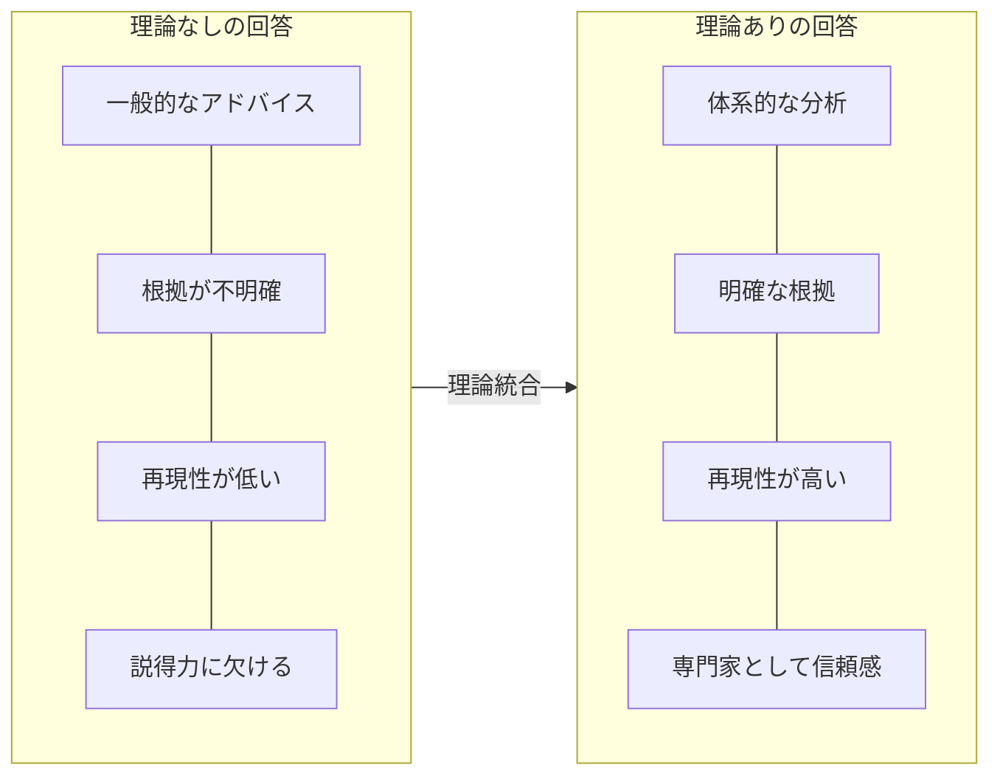
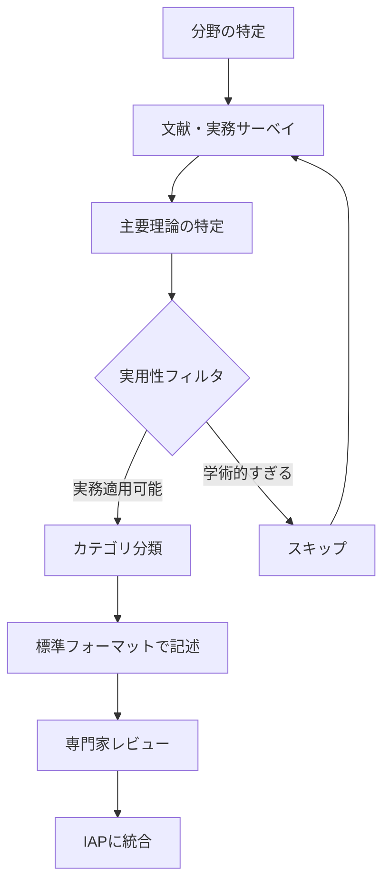
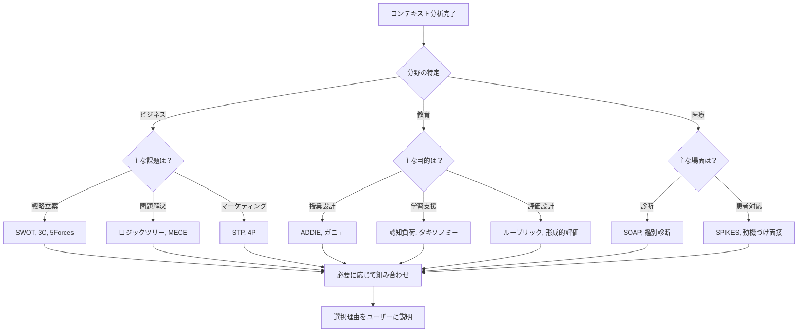

# 第7章 理論・フレームワーク統合

IAPの強みは、確立された理論やフレームワークに基づいた提案を行えることです。本章では、理論をIAPに統合する手順とフォーマット、分野別の理論例を解説します。

## 7.1 理論統合の重要性

### 7.1.1 なぜ理論に基づくのか

AIの回答は、理論的裏付けがあることで信頼性と実用性が向上します。



### 7.1.2 理論統合の3つのレベル

理論の統合には深さのレベルがあります。単に理論名を挙げるだけの浅い統合から、複数の理論を状況に応じて組み合わせる深い統合まで、3段階に分類できます。IAPでは、可能な限りLevel 3の統合レベルを目指します。

```yaml
理論統合レベル:
  Level 1 - 参照レベル:
    説明: 理論名を参照し、基本的な適用
    例: "SWOTを使って分析します"
    深さ: 浅い
    
  Level 2 - 適用レベル:
    説明: 理論の構成要素を活用した分析
    例: "強み・弱み・機会・脅威の4象限で整理"
    深さ: 中程度
    
  Level 3 - 統合レベル:
    説明: 複数理論の組み合わせと状況適応
    例: "SWOTで現状分析後、TOWS戦略で打ち手を導出"
    深さ: 深い
```

## 7.2 理論収集の手順

新しい分野のIAPを作成する際の理論収集プロセスです。

### 7.2.1 収集プロセス



### 7.2.2 理論選定の基準

```markdown
## 理論選定チェックリスト

### 必須基準（すべて満たす必要あり）
- [ ] 実務での適用実績がある
- [ ] 非専門家にも説明可能
- [ ] 具体的なステップに分解できる
- [ ] 対象分野で広く認知されている

### 推奨基準（2つ以上満たすことが望ましい）
- [ ] 学術的な裏付けがある
- [ ] 複数の状況に適用可能
- [ ] 他の理論と組み合わせやすい
- [ ] 最新の実務動向を反映

### 除外基準（1つでも該当すると除外）
- [ ] 特定企業の独自手法（汎用性なし）
- [ ] 科学的根拠が乏しい
- [ ] 適用に高度な専門知識が必須
- [ ] 倫理的に問題がある
```

### 7.2.3 情報ソースの優先順位

| 優先度 | ソース | 特徴 |
|--------|--------|------|
| 高 | 学術論文・教科書 | 信頼性高、理論的厳密性 |
| 高 | 業界標準ガイドライン | 実務適用性、認知度 |
| 中 | 実務書・専門書 | 実践的、事例豊富 |
| 中 | 専門家インタビュー | 最新動向、暗黙知 |
| 低 | Web記事・ブログ | 最新性あるが要検証 |
| 低 | SNS・コミュニティ | 現場感覚、玉石混交 |

## 7.3 理論記述の標準フォーマット

IAPに理論を組み込む際の標準的な記述方法です。

### 7.3.1 基本フォーマット

```markdown
## [理論/フレームワーク名]

### 概要
[1-2文で理論の目的と特徴を説明]

### 提唱者・出典
- 提唱者: [人名]
- 発表年: [年]
- 主要文献: [文献名]

### 構成要素
1. [要素1]: [説明]
2. [要素2]: [説明]
3. [要素3]: [説明]

### 適用条件
- 適している状況: [条件]
- 適さない状況: [条件]

### 適用手順
1. [ステップ1]
2. [ステップ2]
3. [ステップ3]

### 他理論との関係
- [関連理論1]: [関係性]
- [関連理論2]: [関係性]
```

### 7.3.2 IAPテンプレートへの組み込み形式

```markdown
## SKILL (Structured Knowledge & Insight Library)

### ビジネス戦略分野

#### SWOT分析
- 目的: 組織の内部環境と外部環境を4象限で整理
- 構成: Strengths, Weaknesses, Opportunities, Threats
- 適用: 事業計画、競合分析、意思決定支援
- 選択条件: 現状把握が必要な場合、戦略立案の初期段階

#### 3C分析
- 目的: 市場環境を3つの視点から分析
- 構成: Company, Customer, Competitor
- 適用: 市場参入、競争戦略、マーケティング戦略
- 選択条件: 競合環境の理解が重要な場合

#### ポーターの5フォース
- 目的: 業界の競争構造を分析
- 構成: 新規参入、代替品、買い手、売り手、競合
- 適用: 業界分析、収益性評価、参入判断
- 選択条件: 業界全体の構造把握が必要な場合
```

## 7.4 ビジネス・経営分野の理論

### 7.4.1 戦略策定フレームワーク

```yaml
戦略策定フレームワーク:

  SWOT分析:
    概要: 内部環境（強み・弱み）と外部環境（機会・脅威）の分析
    構成要素:
      - Strengths: 自社の強み
      - Weaknesses: 自社の弱み
      - Opportunities: 外部環境の機会
      - Threats: 外部環境の脅威
    適用場面: 事業計画策定、現状分析、戦略レビュー
    組み合わせ: TOWS戦略、PEST分析

  TOWS戦略:
    概要: SWOTの各要素を掛け合わせて戦略オプションを導出
    構成要素:
      - SO戦略: 強み×機会（積極攻勢）
      - WO戦略: 弱み×機会（弱点強化）
      - ST戦略: 強み×脅威（差別化）
      - WT戦略: 弱み×脅威（防衛・撤退）
    適用場面: 戦略オプションの網羅的検討
    前提: SWOT分析が完了していること

  ポーターの5フォース:
    概要: 業界の競争構造を5つの力で分析
    構成要素:
      - 新規参入の脅威
      - 代替品の脅威
      - 買い手の交渉力
      - 売り手の交渉力
      - 業界内の競争
    適用場面: 業界分析、参入判断、競争戦略
    提唱者: Michael E. Porter（1979年）

  3C分析:
    概要: 市場環境を3つの視点から分析
    構成要素:
      - Company: 自社
      - Customer: 顧客
      - Competitor: 競合
    適用場面: 市場分析、マーケティング戦略
    提唱者: 大前研一
```

### 7.4.2 問題解決フレームワーク

```yaml
問題解決フレームワーク:

  ロジックツリー:
    概要: 問題を階層的に分解して原因・解決策を特定
    種類:
      - Whatツリー: 要素分解
      - Whyツリー: 原因分析
      - Howツリー: 解決策検討
    適用場面: 原因分析、解決策立案
    ポイント: MECE（漏れなく重複なく）を意識

  MECE:
    概要: Mutually Exclusive, Collectively Exhaustive
    原則:
      - 相互排他: 要素間に重複がない
      - 完全網羅: 全体をカバーしている
    適用場面: 分類、分析の枠組み設計
    例: 顧客分類、市場セグメンテーション

  イシューツリー:
    概要: 解決すべき課題を階層的に整理
    構造:
      - メインイシュー
      - サブイシュー
      - 個別論点
    適用場面: プロジェクト設計、仮説構築
    提唱者: マッキンゼー手法
```

### 7.4.3 マーケティングフレームワーク

```yaml
マーケティングフレームワーク:

  4P分析:
    概要: マーケティングミックスの4要素
    構成要素:
      - Product: 製品・サービス
      - Price: 価格
      - Place: 流通チャネル
      - Promotion: プロモーション
    適用場面: マーケティング戦略、新商品企画
    発展形: 4C（顧客視点）、7P（サービス拡張）

  STP分析:
    概要: 市場を細分化し、ターゲットを定め、位置づける
    構成要素:
      - Segmentation: 市場細分化
      - Targeting: ターゲット選定
      - Positioning: ポジショニング
    適用場面: 新規事業、商品企画、ブランド戦略
    順序: S→T→Pの順に実施

  カスタマージャーニー:
    概要: 顧客の購買プロセスを可視化
    フェーズ:
      - 認知
      - 興味・関心
      - 比較・検討
      - 購入
      - 利用・評価
      - 推奨
    適用場面: 顧客体験設計、マーケティング施策
    ポイント: 各フェーズのタッチポイントと感情を整理
```

## 7.5 教育分野の理論

### 7.5.1 学習理論

```yaml
学習理論:

  認知負荷理論:
    概要: ワーキングメモリの限界を考慮した学習設計
    提唱者: John Sweller（1988年）
    構成要素:
      - 内在的負荷: 学習内容の複雑さ
      - 外在的負荷: 教材設計による負荷
      - 関連負荷: 学習に有効な負荷
    適用場面: 教材設計、授業設計
    ポイント: 外在的負荷を最小化、関連負荷を最適化

  構成主義:
    概要: 学習者が能動的に知識を構築するという考え方
    提唱者: Jean Piaget, Lev Vygotsky
    原則:
      - 能動的学習
      - 既有知識との関連付け
      - 社会的相互作用
    適用場面: 授業設計、アクティブラーニング
    関連: 発見学習、問題解決学習

  ブルームのタキソノミー:
    概要: 学習目標の分類体系
    レベル:
      - 記憶: 事実を覚える
      - 理解: 意味を把握する
      - 応用: 知識を使う
      - 分析: 構成要素に分解する
      - 評価: 判断を下す
      - 創造: 新しいものを生み出す
    適用場面: 学習目標設定、評価設計
    改訂版: Anderson & Krathwohl（2001年）
```

### 7.5.2 授業設計理論

```yaml
授業設計理論:

  ADDIEモデル:
    概要: インストラクショナルデザインの基本モデル
    フェーズ:
      - Analysis: 分析
      - Design: 設計
      - Development: 開発
      - Implementation: 実施
      - Evaluation: 評価
    適用場面: 教材開発、研修設計
    特徴: 反復的プロセス

  ガニェの9教授事象:
    概要: 効果的な授業の9つの構成要素
    提唱者: Robert Gagné
    事象:
      1. 学習者の注意を獲得する
      2. 学習目標を知らせる
      3. 前提条件を思い出させる
      4. 新しい内容を提示する
      5. 学習の指針を与える
      6. 練習の機会を与える
      7. フィードバックを与える
      8. 学習の成果を評価する
      9. 保持と転移を高める
    適用場面: 授業設計、eラーニング設計

  UDL（学びのユニバーサルデザイン）:
    概要: 多様な学習者に対応する設計原則
    原則:
      - 提示の多様性: 複数の方法で情報を提示
      - 行動と表現の多様性: 複数の方法で表現させる
      - 取り組みの多様性: 複数の方法で動機づける
    適用場面: インクルーシブ教育、教材設計
    提唱者: CAST（2011年）
```

### 7.5.3 評価・フィードバック理論

```yaml
評価・フィードバック理論:

  形成的評価:
    概要: 学習過程での継続的な評価とフィードバック
    目的: 学習改善のための情報収集
    手法:
      - 小テスト
      - 観察
      - 質問応答
      - 自己評価
    対比: 総括的評価（成績評価目的）

  ルーブリック:
    概要: 評価基準を明示した評価ツール
    構成:
      - 評価観点
      - 評価段階
      - 各段階の記述子
    種類:
      - 分析的ルーブリック: 観点別に評価
      - 総合的ルーブリック: 全体で評価
    適用場面: パフォーマンス評価、レポート評価

  フィードバックの原則:
    概要: 効果的なフィードバックの設計原則
    原則:
      - 具体的: 何が良かったか/改善点を明示
      - タイムリー: 迅速に提供
      - 行動可能: 次の行動につながる
      - バランス: 肯定と改善のバランス
    参考: Hattie & Timperley（2007年）
```

## 7.6 医療・ヘルスケア分野の理論

### 7.6.1 臨床推論フレームワーク

```yaml
臨床推論フレームワーク:

  SOAP形式:
    概要: 患者情報の記録・分析フォーマット
    構成:
      - Subjective: 主観的情報（患者の訴え）
      - Objective: 客観的情報（検査結果等）
      - Assessment: 評価・診断
      - Plan: 治療計画
    適用場面: 診療記録、カンファレンス
    特徴: 問題志向型医療記録（POMR）の一部

  鑑別診断プロセス:
    概要: 複数の可能性から診断を絞り込む過程
    ステップ:
      1. 主訴の把握
      2. 仮説リストの作成
      3. 追加情報の収集
      4. 仮説の検証・除外
      5. 診断の確定
    適用場面: 診断、症例検討
    注意: 確証バイアスの回避

  エビデンスレベル:
    概要: 医学的根拠の信頼性の階層
    レベル:
      - Level I: システマティックレビュー
      - Level II: ランダム化比較試験
      - Level III: 非ランダム化比較試験
      - Level IV: 症例研究
      - Level V: 専門家の意見
    適用場面: 治療方針決定、ガイドライン参照
```

### 7.6.2 患者コミュニケーション理論

```yaml
患者コミュニケーション理論:

  SPIKES:
    概要: 悪い知らせを伝えるためのプロトコル
    ステップ:
      - Setting: 環境設定
      - Perception: 患者の認識確認
      - Invitation: 情報提供の許可
      - Knowledge: 情報の提供
      - Emotions: 感情への対応
      - Strategy/Summary: 今後の方針
    適用場面: 告知、予後説明
    提唱者: Baile et al.（2000年）

  動機づけ面接法:
    概要: 行動変容を促すカウンセリング手法
    原則:
      - 共感を示す
      - 矛盾を広げる
      - 抵抗に巻き込まれない
      - 自己効力感を支持する
    適用場面: 生活習慣改善、服薬指導
    提唱者: Miller & Rollnick

  共有意思決定:
    概要: 医療者と患者が協働で意思決定
    ステップ:
      1. 選択肢の存在を伝える
      2. 選択肢を説明する
      3. 患者の価値観を探る
      4. 協働で決定する
    適用場面: 治療方針決定、インフォームドコンセント
```

## 7.7 選択ガイドラインの作成

### 7.7.1 フレームワーク選択フロー



### 7.7.2 選択基準マトリクス

フレームワーク選択の判断基準をマトリクスで整理します。このマトリクスは、ユーザーの課題に対して「どのフレームワークが最適か」を迅速に判断するためのリファレンスです。

#### マトリクスの読み方

- **横軸（課題タイプ）**: ユーザーが直面している課題の性質を4つに分類
  - **現状分析**: 今の状況を正確に把握したい
  - **戦略立案**: 今後の方向性や打ち手を決めたい
  - **問題解決**: 具体的な課題の原因特定や解決策を見つけたい
  - **実行計画**: 具体的なアクションプランに落とし込みたい

- **縦軸（フレームワーク）**: 主要なビジネスフレームワーク
- **評価記号**: 各フレームワークの課題タイプへの適合度

| フレームワーク | 現状分析 | 戦略立案 | 問題解決 | 実行計画 |
|----------------|:--------:|:--------:|:--------:|:--------:|
| SWOT分析 | ◎ | ○ | △ | × |
| 3C分析 | ◎ | ○ | △ | × |
| 5フォース | ◎ | △ | × | × |
| TOWS戦略 | △ | ◎ | ○ | △ |
| ロジックツリー | ○ | △ | ◎ | ○ |
| 4P分析 | ○ | ◎ | △ | ○ |

**凡例**: ◎ 最適 / ○ 適している / △ 部分的に有効 / × 適さない

#### マトリクス活用のポイント

1. **◎が複数ある場合**: ユーザーの状況に最も近いフレームワークを選択し、理由を説明
2. **◎がない課題タイプ**: 複数のフレームワークを組み合わせて対応（7.7.3参照）
3. **同じ評価が並ぶ場合**: ユーザーの業界・規模・緊急度で判断

#### 活用例

```
ユーザー: 「新規事業の方向性を検討したい」
→ 課題タイプ: 戦略立案
→ マトリクス参照: TOWS戦略(◎)、4P分析(◎)
→ 判断: 現状分析がまだならSWOT→TOWSの順次適用を提案
```

### 7.7.3 複合フレームワークの設計

単一のフレームワークでは捉えきれない複雑な課題に対応するため、複数のフレームワークを組み合わせる「複合フレームワーク」の設計が重要です。適切な組み合わせにより、分析の網羅性と深度が向上し、より実践的な提案が可能になります。

#### 組み合わせの基本原則

1. **目的の明確化**: 何を明らかにしたいかを先に定義する
2. **順序の最適化**: 情報の流れを考慮した適用順序を設計する
3. **重複の回避**: 同じ視点の分析を繰り返さない
4. **統合ポイントの設定**: フレームワーク間で情報をどう受け渡すかを明確にする

```markdown
## 複合フレームワーク設計パターン

### パターン1: 順次適用（シーケンシャル）
説明: フレームワークを順番に適用
例: PEST → SWOT → TOWS
用途: 段階的な分析の深化

### パターン2: 補完適用（コンプリメンタリー）
説明: 異なる視点のフレームワークを組み合わせ
例: 3C + 4P（市場分析 + マーケティング施策）
用途: 多角的な分析

### パターン3: 検証適用（バリデーション）
説明: 一方の結果を他方で検証
例: ロジックツリー → MECEチェック
用途: 分析の品質保証

### パターン4: 反復適用（イテレーティブ）
説明: 同じフレームワークを条件を変えて繰り返す
例: シナリオ別SWOT分析
用途: 感度分析、シナリオ検討
```

#### パターン選択の判断基準

| 状況 | 推奨パターン | 理由 |
|------|-------------|------|
| 初期段階で全体像を把握したい | 順次適用 | 段階的に深掘りできる |
| 複数の視点から検証したい | 補完適用 | 多角的な分析が可能 |
| 分析結果の妥当性を確認したい | 検証適用 | 品質保証ができる |
| 不確実性が高く複数案を検討したい | 反復適用 | 複数シナリオを比較できる |

#### 複合フレームワーク設計の注意点

- **過剰な複雑化を避ける**: 3つ以上の組み合わせは慎重に検討
- **ユーザーへの説明責任**: なぜその組み合わせを選んだか明示する
- **中間成果の共有**: 各フレームワーク適用後に結果を確認する
- **柔軟な調整**: 途中で不要と判明したフレームワークはスキップ可能

### 7.7.4 選択理由の説明テンプレート

```markdown
## フレームワーク選択説明テンプレート

「お伺いした状況を踏まえ、
[フレームワーク名]を使って分析を進めたいと思います。

【選択理由】
今回のご相談は[状況の要約]という状況です。
このような場合、[フレームワーク名]が適している理由は：

1. [理由1 - 状況との適合性]
2. [理由2 - フレームワークの強み]
3. [理由3 - 期待される成果]

【補足で使用するフレームワーク】
また、[補助フレームワーク名]も組み合わせることで、
[追加のメリット]が期待できます。

この方向性でよろしいでしょうか？」
```

## 7.8 新規理論の追加手順

### 7.8.1 追加プロセス

```markdown
## 新規理論追加チェックリスト

### Step 1: 候補理論の特定
- [ ] 分野の専門家・実務者からの推薦
- [ ] 文献レビューでの発見
- [ ] ユーザーからの要望

### Step 2: 適格性評価
- [ ] 選定基準チェックリストをクリア
- [ ] 実務での適用事例を確認
- [ ] 専門家の意見を収集

### Step 3: 標準フォーマットで記述
- [ ] 基本フォーマットに沿って記述
- [ ] 適用条件を明確化
- [ ] 他理論との関係を整理

### Step 4: テスト適用
- [ ] サンプルケースで適用テスト
- [ ] 出力品質を評価
- [ ] 必要に応じて記述を調整

### Step 5: IAPへの統合
- [ ] SKILLセクションに追加
- [ ] 選択ガイドラインを更新
- [ ] ドキュメントを更新
```

### 7.8.2 理論ライブラリの管理

```yaml
理論ライブラリ管理:
  構成:
    core: 基本理論（必須）
    extended: 拡張理論（推奨）
    specialized: 専門理論（オプション）
  
  バージョン管理:
    - 追加: 新規理論の追加
    - 更新: 既存理論の記述改善
    - 非推奨: 古くなった理論のマーク
    - 削除: 問題のある理論の除去
  
  品質保証:
    - 定期レビュー: 年1回
    - ユーザーフィードバック: 随時
    - 専門家監修: 重要変更時
```

## 7.9 本章のまとめ

理論・フレームワークの統合は、IAPの専門性と信頼性を支える基盤です。

| 項目 | ポイント |
|------|---------|
| 理論統合の意義 | 信頼性、再現性、説得力の向上 |
| 収集プロセス | 文献サーベイ → 選定 → 記述 → 統合 |
| 記述フォーマット | 標準形式で一貫性を確保 |
| 分野別理論 | ビジネス・教育・医療の主要理論 |
| 選択ガイドライン | フロー・マトリクスで判断支援 |
| 複合フレームワーク | 順次・補完・検証・反復パターン |

適切な理論統合により、AIは真に専門家としての提案が可能になります。

次章では、回答品質を強化するための手法について解説します。
