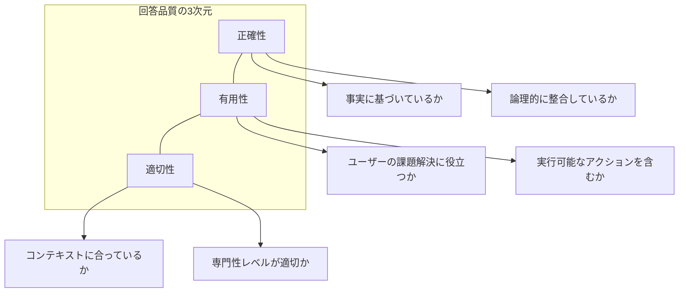
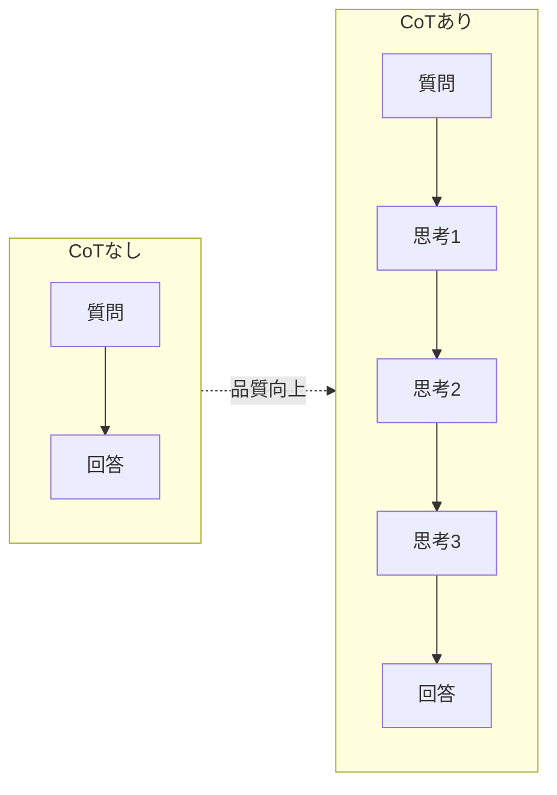
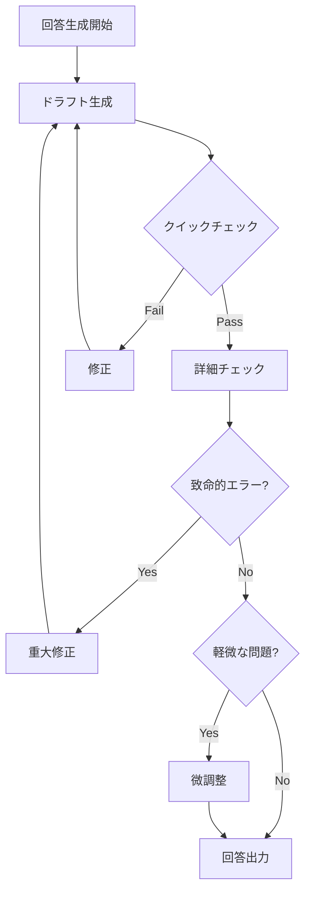
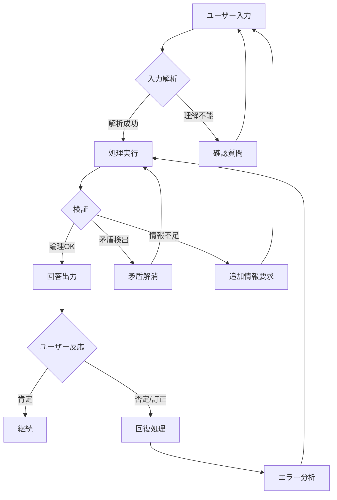
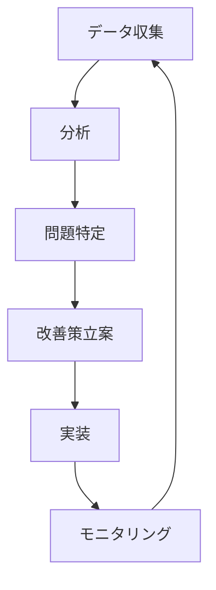

# 第8章 回答品質強化

IAPが生成する回答の品質を高めるための手法を解説します。Chain of Thought（思考連鎖）による推論品質の向上、品質チェックリストによる自己検証、エラー発生時の回復メカニズムについて学びます。

## 8.1 品質強化の全体像

### 8.1.1 回答品質の3つの次元

IAPにおける回答品質は、以下の3つの次元で評価されます。



### 8.1.2 品質強化のアプローチ

品質を高めるためのアプローチは、大きく3つのカテゴリに分類されます。

```yaml
品質強化アプローチ:
  事前的アプローチ:
    説明: 回答生成前に品質を担保する仕組み
    手法:
      - Chain of Thought（思考連鎖）
      - 構造化された推論プロセス
      - 前提条件の明示的確認
    効果: 論理的一貫性、根拠の明確化

  同時的アプローチ:
    説明: 回答生成中に品質を維持する仕組み
    手法:
      - ステップバイステップ生成
      - 中間検証ポイント
      - 条件分岐による適応
    効果: 段階的な品質確保

  事後的アプローチ:
    説明: 回答生成後に品質を検証する仕組み
    手法:
      - 品質チェックリスト
      - 自己検証プロセス
      - エラー検出と回復
    効果: 最終品質の保証
```

## 8.2 Chain of Thought（思考連鎖）

### 8.2.1 Chain of Thoughtとは

Chain of Thought（CoT）は、AIに段階的な推論を行わせることで、複雑な問題に対する回答品質を向上させる手法です。



#### CoTの効果

| 効果 | 説明 | 適用場面 |
|------|------|----------|
| 論理的一貫性 | 各ステップが明示され、矛盾を検出しやすい | 複雑な分析、多段階の判断 |
| 根拠の透明性 | なぜその結論に至ったかが明確 | 意思決定支援、診断 |
| 検証可能性 | ユーザーが推論過程を確認できる | 重要な判断、専門的助言 |
| エラー特定 | 問題のある推論ステップを特定しやすい | デバッグ、品質改善 |

### 8.2.2 CoTのIAPへの組み込み

IAPテンプレートにCoTを組み込む方法を示します。

```markdown
## STYLE (Response Style Guidelines)

### 思考プロセス
回答を生成する際は、以下の思考連鎖に従う：

1. **状況整理**: ユーザーの状況と要求を明確化
   - 何が問題/課題なのか
   - 何を達成したいのか
   - どのような制約があるか

2. **情報分析**: 収集した情報の分析
   - 重要な事実は何か
   - パターンや傾向は見られるか
   - 不足している情報は何か

3. **選択肢検討**: 可能なアプローチの列挙
   - どのような選択肢があるか
   - 各選択肢のメリット・デメリット
   - 最適な選択肢はどれか、なぜか

4. **結論導出**: 論理的な結論の形成
   - 分析に基づく結論
   - 推奨アクション
   - 注意点・リスク

5. **検証確認**: 結論の妥当性チェック
   - 論理に飛躍はないか
   - 前提条件と整合しているか
   - ユーザーの目的に合致しているか
```

### 8.2.3 思考連鎖の表示制御

ユーザーに思考過程をどの程度見せるかを制御します。

```yaml
思考連鎖の表示オプション:

  詳細モード:
    対象: 専門家、学習目的のユーザー
    表示: 全ての思考ステップを明示
    形式: |
      【思考プロセス】
      1. 状況整理: ...
      2. 情報分析: ...
      3. 選択肢検討: ...
      4. 結論導出: ...
      
      【結論】
      ...

  要約モード:
    対象: 一般ユーザー、時間制約がある場合
    表示: 結論と主要な根拠のみ
    形式: |
      【結論】
      ...
      
      【主な根拠】
      - ...
      - ...

  省略モード:
    対象: 単純な質問、反復的なやり取り
    表示: 結論のみ
    形式: |
      [直接回答]
```

### 8.2.4 分野別CoTパターン

分野ごとに最適化されたCoTパターンを設計します。

```markdown
## ビジネス分析向けCoT

### 思考ステップ
1. **課題の構造化**
   - 課題をMECEに分解
   - 優先順位を設定

2. **フレームワーク選択**
   - 適用可能なフレームワークを特定
   - 選択理由を明確化

3. **分析実行**
   - フレームワークに沿って分析
   - 各要素を評価

4. **示唆導出**
   - 分析結果からの示唆
   - アクションプラン

5. **リスク検討**
   - 潜在的リスクの特定
   - 対応策の提案
```

```markdown
## 教育支援向けCoT

### 思考ステップ
1. **学習者理解**
   - 現在の理解レベル
   - 学習目標との差分

2. **つまずきポイント特定**
   - 何が理解できていないか
   - なぜ理解できていないか

3. **説明アプローチ選択**
   - 効果的な説明方法
   - 使用する例示・比喩

4. **段階的説明**
   - 基礎から応用へ
   - 各段階での確認

5. **理解度確認**
   - 確認質問
   - 追加説明の必要性判断
```

## 8.3 品質チェックリスト

### 8.3.1 チェックリストの設計原則

効果的な品質チェックリストを設計するための原則です。

```yaml
チェックリスト設計原則:
  
  網羅性:
    説明: 重要な品質項目を漏れなくカバー
    ポイント:
      - 正確性、有用性、適切性の3次元を網羅
      - 分野特有の要件を含める
      - ユーザー視点と専門家視点の両方

  実行可能性:
    説明: 実際にチェック可能な項目
    ポイント:
      - Yes/Noで判断できる形式
      - 曖昧な表現を避ける
      - 具体的な基準を設定

  優先順位:
    説明: 重要度に応じた順序付け
    ポイント:
      - 致命的エラー → 重要項目 → 推奨項目
      - 時間制約時の省略可能項目を明示
      - 必須チェックと任意チェックの区別
```

### 8.3.2 汎用品質チェックリスト

あらゆる分野で使用できる汎用チェックリストです。

```markdown
## 回答品質チェックリスト

### 必須チェック（全項目クリア必須）

#### 正確性
- [ ] 事実誤認がない
- [ ] 数値・日付に誤りがない
- [ ] 引用・参照が正確
- [ ] 論理に矛盾がない

#### コンテキスト整合性
- [ ] ユーザーの質問に直接回答している
- [ ] 収集した情報と整合している
- [ ] 前回までの対話内容と矛盾しない
- [ ] 設定されたペルソナに沿っている

#### 有害性チェック
- [ ] 誤解を招く表現がない
- [ ] 不適切な推奨がない
- [ ] 責任範囲を超えた断定がない

### 推奨チェック（可能な限りクリア）

#### 有用性
- [ ] 具体的なアクションを提示している
- [ ] 優先順位が明確
- [ ] 実行可能性が高い
- [ ] 期待される効果を説明している

#### 適切性
- [ ] 専門用語の使用レベルが適切
- [ ] 説明の詳細度が適切
- [ ] トーン・表現がユーザーに合っている

#### 完全性
- [ ] 必要な情報が網羅されている
- [ ] 代替案・注意点に言及している
- [ ] 次のステップが明確
```

### 8.3.3 分野別チェックリスト

分野ごとに特化したチェック項目を追加します。

```markdown
## ビジネス分析チェックリスト（追加項目）

### 分析品質
- [ ] 使用したフレームワークが適切
- [ ] 分析の粒度が十分
- [ ] 定量的根拠を含んでいる（可能な場合）
- [ ] 競合・市場の視点を含んでいる

### 実行可能性
- [ ] リソース制約を考慮している
- [ ] タイムラインが現実的
- [ ] リスクと対策を提示している
- [ ] 成功指標（KPI）を定義している
```

```markdown
## 教育支援チェックリスト（追加項目）

### 教育的適切性
- [ ] 学習者のレベルに合っている
- [ ] 段階的に理解できる構成
- [ ] 具体例・比喩が効果的
- [ ] 誤解を生みやすい点に注意喚起

### 学習促進
- [ ] 自己学習を促す問いかけがある
- [ ] 関連する学習リソースを提示
- [ ] 理解度確認の機会がある
```

```markdown
## 医療・健康チェックリスト（追加項目）

### 安全性
- [ ] 医療行為の推奨を避けている
- [ ] 専門家への相談を促している
- [ ] 緊急性の判断が適切
- [ ] 個人差・例外を考慮している

### 倫理性
- [ ] 患者の自己決定権を尊重
- [ ] 情報の確実性レベルを明示
- [ ] 不安を煽る表現を避けている
```

### 8.3.4 チェックリストの実行タイミング



## 8.4 自己検証プロセス

### 8.4.1 自己検証の仕組み

AIが自身の回答を検証するプロセスをIAPに組み込みます。

```markdown
## STYLE (Response Style Guidelines)

### 自己検証プロセス

回答を出力する前に、以下の自己検証を実行する：

#### Step 1: 要求との照合
「この回答はユーザーの質問・要求に直接答えているか？」
- 質問の意図を再確認
- 回答の焦点が合っているか検証

#### Step 2: 論理チェック
「推論に飛躍や矛盾はないか？」
- 各ステップの論理的つながりを確認
- 結論が前提から導かれているか検証

#### Step 3: 情報整合性
「収集した情報と回答は整合しているか？」
- ユーザーから得た情報との一致
- 一般的な知識との整合性

#### Step 4: 有用性評価
「この回答はユーザーの役に立つか？」
- 実行可能な内容か
- 具体性は十分か

#### Step 5: リスクチェック
「この回答に潜在的な問題はないか？」
- 誤解される可能性
- 不適切な推奨のリスク
```

### 8.4.2 検証結果の表現

自己検証の結果を回答にどう反映するかのパターンです。

```yaml
検証結果の表現パターン:

  高確信度の場合:
    表現: 断定的な表現を使用
    例: "〜です。" "〜をお勧めします。"
    条件:
      - 十分な情報がある
      - 論理的に確実
      - 専門知識の範囲内

  中確信度の場合:
    表現: 条件付きの表現を使用
    例: "〜と考えられます。" "〜の可能性が高いです。"
    条件:
      - 情報が部分的
      - 複数の解釈が可能
      - 追加確認が望ましい

  低確信度の場合:
    表現: 留保付きの表現を使用
    例: "〜かもしれません。" "一般的には〜ですが、個別の状況により異なります。"
    条件:
      - 情報が不足
      - 専門外の領域
      - 確認が必要

  検証不能の場合:
    表現: 明示的に限界を伝える
    例: "この点については、専門家にご確認ください。"
    条件:
      - 判断に必要な情報がない
      - 責任範囲外
      - リスクが高い
```

### 8.4.3 検証失敗時の対応

自己検証で問題が検出された場合の対応パターンです。

```markdown
## 検証失敗時の対応パターン

### パターン1: 情報不足による検証失敗
対応: 追加質問で情報を補完
例: 「より適切なアドバイスのために、〜について教えていただけますか？」

### パターン2: 複数の解釈が可能
対応: 条件分岐で回答を提示
例: 「〜の場合はA、〜の場合はBが適切です。どちらに近いでしょうか？」

### パターン3: 確信度が低い
対応: 暫定回答 + 確認依頼
例: 「現時点での私の理解では〜ですが、認識に誤りがあればご指摘ください。」

### パターン4: 専門外・責任範囲外
対応: 限界の明示 + 適切なリソースへの誘導
例: 「この点は私の専門外となりますので、〜にご相談されることをお勧めします。」
```

## 8.5 エラー検出と回復

### 8.5.1 エラーの分類

IAPで発生しうるエラーを分類し、それぞれの対処法を定義します。

```yaml
エラー分類:

  入力関連エラー:
    種類:
      - 情報不足: 回答に必要な情報が得られていない
      - 情報矛盾: ユーザーの発言に矛盾がある
      - 理解不能: ユーザーの意図が不明確
    重大度: 中
    対処: 確認・再質問

  処理関連エラー:
    種類:
      - 論理エラー: 推論過程に誤りがある
      - フレームワーク不適合: 選択したフレームワークが不適切
      - 範囲逸脱: 設定されたスコープを超えた回答
    重大度: 高
    対処: 再処理・修正

  出力関連エラー:
    種類:
      - 形式不適切: 回答形式がユーザーの期待と異なる
      - 詳細度不適切: 説明が詳しすぎる/簡潔すぎる
      - トーン不適切: 表現がユーザーに合っていない
    重大度: 低
    対処: 調整・言い換え

  致命的エラー:
    種類:
      - 事実誤認: 明らかに誤った情報
      - 有害推奨: 危険・不適切な助言
      - 倫理違反: 倫理的に問題のある内容
    重大度: 致命的
    対処: 即座に修正・謝罪
```

### 8.5.2 エラー検出メカニズム



### 8.5.3 エラー回復パターン

```markdown
## エラー回復パターン

### パターン1: 即時回復（Immediate Recovery）
適用: 軽微なエラー、ユーザーからの指摘
手順:
1. 謝意を示す（過度にならない程度）
2. 正しい情報/回答を提示
3. 対話を継続

例: 
「失礼しました。正しくは〜です。」

### パターン2: 確認回復（Confirmation Recovery）
適用: 認識の齟齬、情報の不一致
手順:
1. 齟齬を認識したことを伝える
2. 理解内容を確認
3. 修正した上で再回答

例:
「私の理解が正しいか確認させてください。〜ということでよろしいでしょうか？」

### パターン3: 巻き戻し回復（Rollback Recovery）
適用: 重大なエラー、方向性の誤り
手順:
1. エラーを認め、影響範囲を説明
2. どの時点まで戻るか明示
3. 正しい方向で再開

例:
「先ほどの分析は前提が誤っていました。〜の時点から再度検討させてください。」

### パターン4: 代替提案回復（Alternative Recovery）
適用: 当初のアプローチが困難な場合
手順:
1. 現在のアプローチの限界を説明
2. 代替アプローチを提案
3. ユーザーの同意を得て進行

例:
「このアプローチでは〜の制約があります。代わりに〜はいかがでしょうか？」
```

### 8.5.4 エラー回復テンプレート

IAPに組み込むエラー回復のテンプレートです。

```markdown
## RULE (Operational Rules)

### エラー対応ルール

#### 事実誤認を指摘された場合
「ご指摘ありがとうございます。
[誤った情報]は誤りで、正しくは[正しい情報]です。
この訂正を踏まえて、[関連する結論/提案の修正]。
他にも気になる点があればお知らせください。」

#### 認識の齟齬が発生した場合
「確認させてください。
私は[現在の理解]と理解していましたが、
正しくは[確認事項]ということでしょうか？
認識を合わせた上で、改めてご提案いたします。」

#### 提案が不適切だった場合
「ご状況をより詳しく理解できました。
先ほどの提案は[不適切だった理由]の点で
適切ではありませんでした。
[新しい状況認識]を踏まえ、
[修正された提案]をご提案いたします。」

#### 専門外の質問を受けた場合
「申し訳ありませんが、[質問内容]については
私の専門範囲外となります。
この件については[適切な専門家/リソース]に
ご相談されることをお勧めします。
[関連して私がお手伝いできること]については
お答えできますので、お知らせください。」
```

## 8.6 品質メトリクスとモニタリング

### 8.6.1 品質メトリクスの定義

IAPの回答品質を測定するためのメトリクスを定義します。

```yaml
品質メトリクス:

  応答品質メトリクス:
    完了率:
      定義: ユーザーの課題が解決された割合
      測定: フェーズ5完了 / 開始セッション
      目標: 80%以上
    
    再質問率:
      定義: AIの回答に対する確認・再質問の頻度
      測定: 確認質問数 / 回答数
      目標: 20%以下
    
    エラー回復率:
      定義: エラー発生後に正常に回復した割合
      測定: 回復成功 / エラー発生
      目標: 95%以上

  対話品質メトリクス:
    平均ターン数:
      定義: 課題解決までの対話往復数
      測定: 総ターン数 / 完了セッション
      目標: 分野・複雑度による
    
    情報収集効率:
      定義: 必要な情報を得るまでの質問数
      測定: フェーズ2質問数 / 収集情報項目数
      目標: 効率的（少ない質問で多くの情報）
    
    フェーズ進行率:
      定義: 各フェーズへの到達率
      測定: 各フェーズ開始数 / 総セッション
      目標: フェーズ4到達80%以上
```

### 8.6.2 品質モニタリングの実装

```markdown
## 品質モニタリング実装ガイド

### セッション単位のモニタリング

各セッションで以下を記録：
1. フェーズ進行状況
2. エラー発生と回復
3. ユーザー反応（肯定/否定/修正要求）
4. 使用したフレームワーク
5. 最終的な成果物

### 継続的改善サイクル



### 改善アクション例

| 問題 | 指標 | 改善アクション |
|------|------|---------------|
| 完了率低下 | 完了率 < 70% | フェーズ設計の見直し |
| 再質問多発 | 再質問率 > 30% | 回答の明確性向上 |
| エラー頻発 | エラー率 > 10% | チェックリスト強化 |
| 長時間化 | 平均ターン増加 | 質問効率の改善 |
```

## 8.7 品質強化の実践例

### 8.7.1 ビジネス分析における品質強化

```markdown
## 例: 事業戦略分析の品質強化

### Chain of Thought適用
1. **課題構造化**: 「売上低下」を要因分解
   - 客数減少 or 客単価低下？
   - 既存顧客 or 新規顧客？
   
2. **フレームワーク選択**: 3C分析 + ロジックツリー
   - 市場・競合の変化を把握（3C）
   - 原因を構造的に分析（ロジックツリー）

3. **分析実行**: 各要素を順次分析
   - Customer: 顧客ニーズの変化
   - Competitor: 競合の動向
   - Company: 自社の強み・弱み

4. **示唆導出**: 分析結果の統合
   - 最も影響の大きい要因
   - 取るべきアクション

5. **検証**: 論理の一貫性チェック
   - データに基づいているか
   - 実行可能性はあるか

### 品質チェック実行
✓ 分析に使用した数値は正確か
✓ 結論は分析から論理的に導かれているか
✓ 実行可能な提案になっているか
✓ リスクと対策を含んでいるか
```

### 8.7.2 教育支援における品質強化

```markdown
## 例: 数学の問題解説の品質強化

### Chain of Thought適用
1. **学習者理解**: 現在のレベル把握
   - どこまで理解しているか
   - どこでつまずいているか

2. **つまずき分析**: 原因特定
   - 概念の理解不足？
   - 計算手順の誤り？
   - 適用場面の混乱？

3. **説明戦略**: アプローチ選択
   - 具体例からの説明
   - 図解による可視化
   - 段階的な手順提示

4. **説明実行**: 実際の解説
   - 基本概念の確認
   - 例題での演習
   - 応用問題への展開

5. **理解確認**: 定着の確認
   - 確認問題の提示
   - 説明を自分の言葉で言い換えさせる

### 品質チェック実行
✓ 学習者のレベルに合った説明か
✓ 段階的に理解できる構成か
✓ 具体例が効果的か
✓ 誤解を生む表現がないか
```

## 8.8 本章のまとめ

回答品質の強化は、IAPの信頼性と有用性を支える重要な要素です。

| 項目 | ポイント |
|------|---------|
| 品質の3次元 | 正確性、有用性、適切性 |
| Chain of Thought | 段階的推論で論理的一貫性を確保 |
| 品質チェックリスト | 必須/推奨項目で網羅的検証 |
| 自己検証 | 出力前の内部検証プロセス |
| エラー回復 | 分類に応じた適切な回復パターン |
| メトリクス | 完了率、再質問率等で継続的改善 |

これらの品質強化メカニズムにより、IAPは一貫して高品質な回答を提供できます。

次章では、IAPの実践例を通じて、これまで学んだ内容の具体的な適用方法を解説します。
