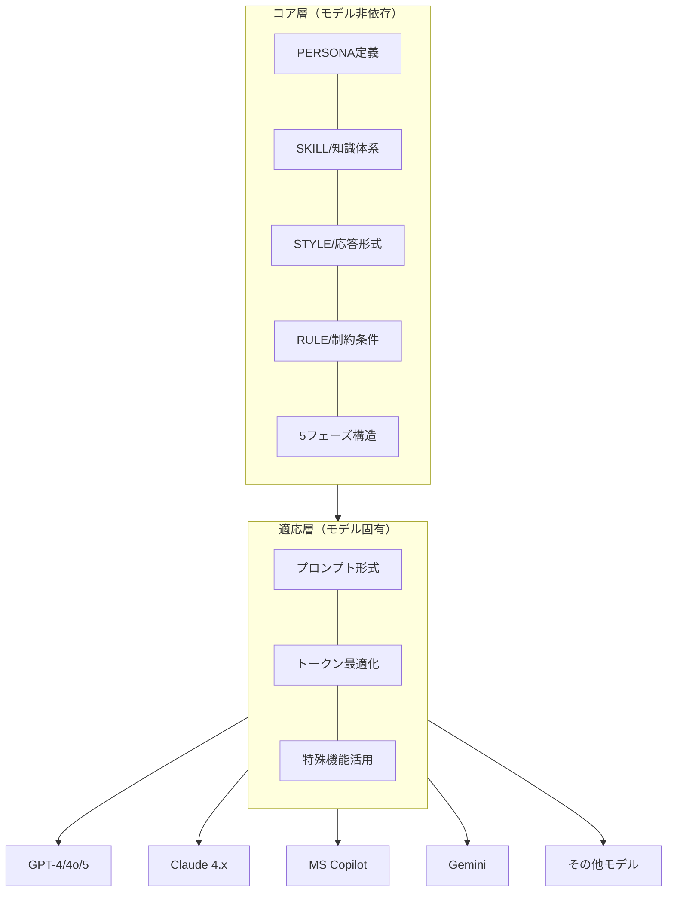
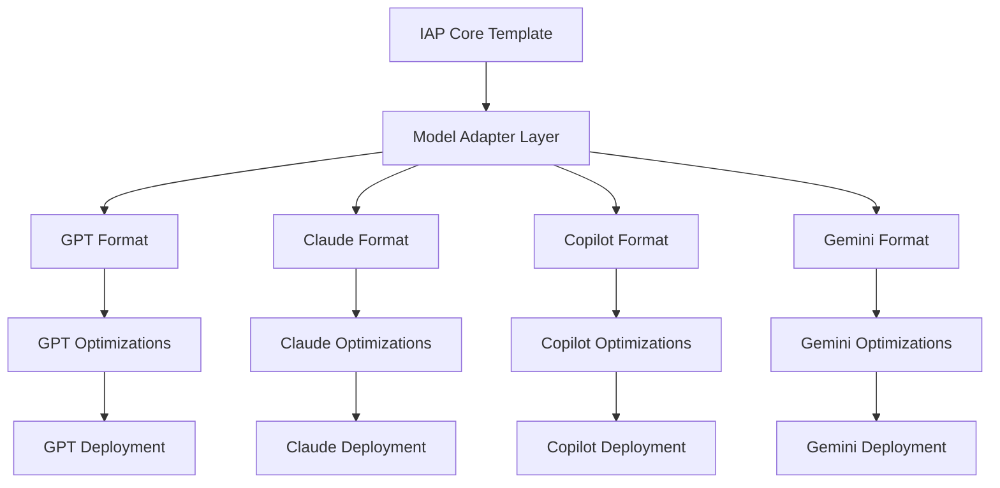
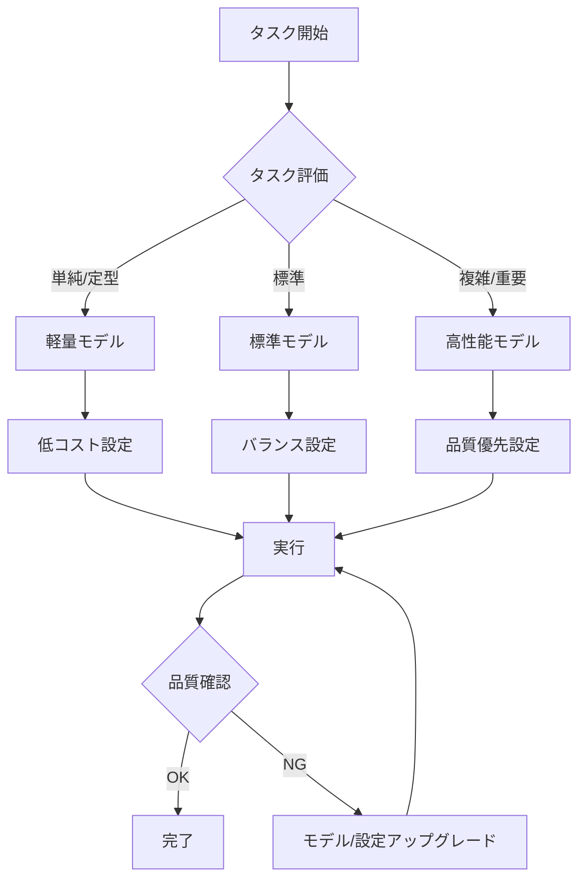

# 第10章 AIモデル適応

IAPは特定のAIモデルに依存しない設計思想に基づいていますが、各モデルの特性を理解し最適化することで、より高い性能を引き出せます。本章では、主要なAIモデルへの適応方法と、モデル間の差異を吸収する設計テクニックを解説します。

## 10.1 モデル非依存設計の原則

### 10.1.1 なぜモデル非依存が重要か

AIモデルは急速に進化しており、特定モデルに最適化しすぎると以下のリスクがあります。

```yaml
モデル依存のリスク:
  技術的リスク:
    - モデルのバージョンアップで動作が変わる
    - サービス終了・仕様変更の可能性
    - 新しい優れたモデルへの移行が困難
    
  ビジネスリスク:
    - ベンダーロックイン
    - コスト変動への対応困難
    - 地域・規制による利用制限
    
  品質リスク:
    - モデル固有の癖に依存した設計
    - 他モデルでの品質低下
    - 汎用性の欠如
```

### 10.1.2 モデル非依存設計の階層

IAPを「コア層」と「適応層」に分離することで、モデル非依存性を確保します。



### 10.1.3 コア層の設計原則

```markdown
## コア層設計の原則

### 1. 明示的な構造化
- セクションを明確に区切る
- 階層構造を視覚的に表現
- 役割と責任を明確に定義

### 2. 自然言語での記述
- モデル固有の特殊構文を避ける
- 人間が読んでも理解できる形式
- 意図が明確に伝わる表現

### 3. 論理的な一貫性
- 矛盾のない指示体系
- 優先順位の明確化
- 例外処理の明示

### 4. 適度な抽象化
- 具体的すぎず、抽象的すぎない
- 解釈の余地を適切に残す
- コンテキストに応じた適用を許容
```

## 10.2 主要モデルの特性比較

### 10.2.1 モデル特性一覧

主要なAIモデルの特性を比較します（2025年時点の情報）。

| 特性 | GPT-4o/5 | Claude 4.x | MS Copilot | Gemini Pro |
|------|----------|------------|------------|------------|
| コンテキスト長 | 128K | 200K | 128K | 1M+ |
| 指示追従性 | 高い | 非常に高い | 高い | 高い |
| 長文生成 | 得意 | 非常に得意 | 得意 | 得意 |
| 論理的推論 | 優秀 | 優秀 | 優秀 | 優秀 |
| 創造性 | 高い | 高い | 高い | 高い |
| 一貫性維持 | 良好 | 非常に良好 | 良好 | 良好 |
| 日本語性能 | 良好 | 良好 | 良好 | 良好 |
| M365連携 | - | - | ◎ネイティブ | - |
| エージェント機能 | 高い | 非常に高い | 高い | 高い |

### 10.2.2 各モデルの強みと注意点

```yaml
GPT-4o/GPT-5:
  強み:
    - 幅広い知識と柔軟な対応
    - Function Calling等の拡張機能
    - APIの安定性と豊富なドキュメント
    - GPT-5はリアルタイムルーターで最適モデル選択
  注意点:
    - 長いシステムプロンプトでの指示漏れ
    - トークン消費量の管理が必要
    - 確率的な応答のばらつき
  IAPでの最適化:
    - 重要な指示は冒頭に配置
    - 段階的なリマインドを活用
    - 温度設定の適切な調整

Claude 4.x（Opus/Sonnet/Haiku）:
  強み:
    - 200Kコンテキストと64K出力トークン
    - 指示への忠実な追従
    - 構造化された出力の安定性
    - ハイブリッド推論（通常応答/拡張思考）
    - コーディング・エージェント機能が優秀
    - SWE-bench Verified 80.9%達成（Opus 4.5）
  注意点:
    - 過度に慎重な応答傾向
    - 特定トピックでの制限
    - 拡張思考モードはレイテンシ増加
  IAPでの最適化:
    - XMLタグによる明示的な構造化
    - 詳細な例示の提供
    - 拡張思考の適切な使い分け

Microsoft Copilot:
  強み:
    - Microsoft 365とのネイティブ連携
    - Word/Excel/PowerPoint/Outlook統合
    - エンタープライズデータ保護（EDP）
    - GPT-5搭載（リアルタイムルーター）
    - エージェント機能（Copilot Studio連携）
  注意点:
    - M365ライセンス体系の理解が必要
    - 組織データへのアクセス設定
    - 標準アクセスとプライオリティアクセスの違い
  IAPでの最適化:
    - M365コンテキストを活用した設計
    - エージェント連携を想定した構造
    - ファイルアップロード機能の活用

Gemini Pro:
  強み:
    - 超長文コンテキスト（1M+トークン）
    - マルチモーダル対応
    - Google Workspace連携
  注意点:
    - 応答の一貫性にばらつき
    - 日本語での微妙なニュアンス
    - エンタープライズ機能は発展途上
  IAPでの最適化:
    - 明確で具体的な指示
    - 出力形式の厳密な指定
    - フィードバックループの活用
```

## 10.3 プロンプト形式の適応

### 10.3.1 システムプロンプトの構造化

各モデルに適した形式でIAPを記述する方法を示します。

#### GPT-4/4o向け形式

```markdown
# System Prompt for GPT-4

You are [PERSONA DEFINITION].

## Your Role and Expertise
[PERSONAセクションの内容]

## Knowledge and Frameworks
[SKILLセクションの内容]

## Response Guidelines
[STYLEセクションの内容]

## Operational Rules
[RULEセクションの内容]

## Interaction Flow
[5フェーズの説明]

---
IMPORTANT REMINDERS:
- [最重要ルール1]
- [最重要ルール2]
- [最重要ルール3]
```

#### Claude向け形式

```markdown
<system>
[PERSONA定義]

<role>
[詳細な役割説明]
</role>

<knowledge>
[SKILLセクション]
</knowledge>

<style>
[STYLEセクション]
</style>

<rules>
[RULEセクション]
</rules>

<workflow>
[5フェーズの説明]
</workflow>

<constraints>
[絶対に守るべき制約]
</constraints>
</system>
```

#### Gemini向け形式

```markdown
**Role Definition**
[PERSONA定義]

**Expertise Areas**
[SKILLセクション]

**Communication Style**
[STYLEセクション]

**Operational Guidelines**
[RULEセクション]

**Interaction Phases**
[5フェーズの説明]

**Critical Rules**
1. [最重要ルール1]
2. [最重要ルール2]
3. [最重要ルール3]
```

#### Microsoft Copilot向け形式

```markdown
# Role and Purpose
[PERSONA定義 - GPT-5ベースのルーターに最適化]

## Your Expertise
[SKILLセクション - M365コンテキストを意識]

## Response Guidelines
[STYLEセクション]

## Operational Rules
[RULEセクション]

## Workflow Phases
[5フェーズの説明]

---
KEY REMINDERS:
- [最重要ルール1]
- [最重要ルール2]
- [最重要ルール3]

※ M365アプリ連携時は開いているコンテンツを参照可能
```

### 10.3.2 指示の強調方法

各モデルで効果的な強調方法が異なります。

| 強調方法 | GPT-4o/5 | Claude 4.x | MS Copilot | Gemini |
|----------|----------|------------|------------|--------|
| 大文字 | ○ 効果あり | △ 控えめ | ○ 効果あり | ○ 効果あり |
| **太字** | ○ 効果あり | ○ 効果あり | ○ 効果あり | ○ 効果あり |
| XMLタグ | △ 部分的 | ◎ 非常に効果的 | △ 部分的 | △ 部分的 |
| 箇条書き | ○ 効果あり | ○ 効果あり | ○ 効果あり | ○ 効果あり |
| 番号付き | ○ 効果あり | ○ 効果あり | ○ 効果あり | ○ 効果あり |
| 区切り線 | ○ 効果あり | ○ 効果あり | ○ 効果あり | ○ 効果あり |
| 繰り返し | ◎ 効果的 | ○ 効果あり | ◎ 効果的 | ◎ 効果的 |

### 10.3.3 コンテキスト長への対応

```yaml
コンテキスト長対応戦略:

  短いコンテキスト（< 8K）:
    戦略: 圧縮と優先順位付け
    手法:
      - 必須情報のみを含める
      - 例示を最小限に
      - 参照形式で詳細を省略
    適用: 旧モデル、コスト重視の場合

  中程度（8K - 32K）:
    戦略: バランス型
    手法:
      - 主要な例示を含める
      - フレームワークの概要を記載
      - 詳細は必要に応じて展開
    適用: 標準的な利用

  長いコンテキスト（32K+）:
    戦略: 完全版
    手法:
      - 全ての例示とガイドラインを含める
      - 詳細なフレームワーク説明
      - 豊富な参照情報
    適用: 複雑なタスク、高品質が必要な場合
```

## 10.4 モデル固有機能の活用

### 10.4.1 GPT-4/5の拡張機能

```markdown
## GPT-4/5固有機能の活用

### Function Calling
IAPの特定フェーズで外部機能を呼び出す設計

用途例:
- Phase 2で顧客データベースを検索
- Phase 3で計算・分析ツールを実行
- Phase 5でレポート生成ツールを呼び出す

### Code Interpreter
データ分析や可視化が必要な場合に活用

用途例:
- 財務データの分析と可視化
- 統計的な検証
- グラフ・チャートの生成

### Custom Instructions
ユーザー固有の設定を永続化

用途例:
- 業界固有の用語設定
- 出力形式のデフォルト設定
- コミュニケーションスタイルの固定

### GPT-5リアルタイムルーター
プロンプトの複雑さに応じて最適モデルを自動選択

用途例:
- 単純な質問は高速モデルで即時応答
- 複雑な推論は深層推論モデルで慈重に応答
```

### 10.4.2 Claude 4.xの拡張機能

```markdown
## Claude 4.x固有機能の活用

### Artifacts
構造化された出力を別ウィンドウで表示

用途例:
- 分析レポートの生成
- コードの作成と表示
- 図表・ダイアグラムの作成

### Projects（Claude Pro/Max）
関連ドキュメントをコンテキストとして保持

用途例:
- 業界資料の参照
- 過去の分析結果の活用
- 継続的なプロジェクト支援

### XMLタグによる構造化
明示的なセクション区切りと指示

用途例:
- 入力と出力の明確な分離
- 条件分岐の明示
- 例示の範囲指定

### ハイブリッド推論（Extended Thinking）
通常応答と拡張思考の使い分け

用途例:
- 複雑な推論タスクで拡張思考を有効化
- マルチステップコーディングプロジェクト
- 深いリサーチタスク

### Claude Code
自律的なコーディングエージェント

用途例:
- 長時間の自律的コーディングタスク
- バックグラウンドでのコード生成
- 大規模リファクタリング
```

### 10.4.3 Microsoft Copilotの拡張機能

```markdown
## Microsoft Copilot固有機能の活用

### Microsoft 365アプリ連携
Word/Excel/PowerPoint/Outlook/Teamsとのネイティブ統合

用途例:
- 開いているドキュメントをコンテキストとして活用
- Excelデータの分析とグラフ化
- PowerPointスライドの自動生成
- Outlookメールの要約・返信作成

### Copilot Pages
共同作業可能なコンテンツ作成

用途例:
- チームで共有可能なドキュメント作成
- AIチャット結果の永続化
- インタラクティブなレポート作成

### Copilot Studio連携
カスタムエージェントの構築

用途例:
- 組織データにアクセス可能なエージェント
- 業務プロセスの自動化
- カスタムコネクターで外部データ連携

### エンタープライズデータ保護（EDP）
セキュアなデータ処理環境

用途例:
- 機密データの安全な処理
- コンプライアンス要件への対応
- 組織ポリシーに準拠した運用
```

### 10.4.4 Geminiの拡張機能

```markdown
## Gemini固有機能の活用

### マルチモーダル入力
画像・動画・音声の処理

用途例:
- 図表・グラフの分析
- 製品画像からの情報抽出
- プレゼン資料のレビュー

### Google Workspace連携
ドキュメント・スプレッドシート連携

用途例:
- スプレッドシートデータの分析
- ドキュメントの要約・編集
- メール下書きの作成

### 超長文コンテキスト
大量のドキュメント処理

用途例:
- 複数文書の横断分析
- 長期プロジェクトの文脈保持
- 詳細なナレッジベースの参照
```

## 10.5 クロスモデル互換性の確保

### 10.5.1 互換性チェックリスト

```markdown
## クロスモデル互換性チェックリスト

### 構造面
- [ ] モデル固有の特殊構文を使用していない
- [ ] セクション区切りが明確
- [ ] 階層構造が視覚的に理解可能

### 指示面
- [ ] 指示が自然言語で明確に記述されている
- [ ] 暗黙の前提を明示している
- [ ] 優先順位が明確

### 出力面
- [ ] 出力形式が具体的に指定されている
- [ ] 例示が十分に提供されている
- [ ] 品質基準が明確

### テスト面
- [ ] 複数モデルでテスト済み
- [ ] エッジケースを確認済み
- [ ] 品質のばらつきが許容範囲内
```

### 10.5.2 互換性レイヤーの設計



### 10.5.3 アダプターパターンの実装

```yaml
アダプターパターン:
  
  共通インターフェース:
    input:
      - user_message: ユーザーの入力
      - context: 対話履歴
      - phase: 現在のフェーズ
    output:
      - response: AIの応答
      - next_phase: 次のフェーズ
      - metadata: 追加情報

  GPTアダプター:
    変換処理:
      - XMLタグを削除
      - IMPORTANTセクションを追加
      - 温度パラメータを設定
    
  Claudeアダプター:
    変換処理:
      - XMLタグ形式に変換
      - constraintsセクションを追加
      - thinking指示を追加
    
  Copilotアダプター:
    変換処理:
      - M365コンテキストを意識した構造化
      - KEY REMINDERSセクションを追加
      - エージェント連携を想定した設計
    
  Geminiアダプター:
    変換処理:
      - Markdown形式に統一
      - 明示的な区切りを追加
      - 出力形式を厳密に指定
```

## 10.6 性能チューニング

### 10.6.1 パラメータ調整ガイド

```yaml
パラメータ調整:

  Temperature（温度）:
    低（0.0-0.3）:
      特徴: 一貫性が高い、創造性は低い
      適用: 事実確認、定型業務、分析
      IAPフェーズ: Phase 2, 3
      
    中（0.4-0.7）:
      特徴: バランス型
      適用: 一般的な対話、提案
      IAPフェーズ: Phase 1, 4, 5
      
    高（0.8-1.0）:
      特徴: 創造性が高い、一貫性は低い
      適用: ブレインストーミング、創造的タスク
      IAPフェーズ: 特殊な創造的タスク

  Top-p（多様性）:
    低（0.1-0.5）: 確実性重視
    中（0.6-0.8）: バランス
    高（0.9-1.0）: 多様性重視

  Max Tokens:
    設定: 想定出力長の1.5-2倍
    注意: 途中で切れないよう余裕を持たせる
```

### 10.6.2 フェーズ別最適化

```markdown
## フェーズ別パラメータ推奨値

| フェーズ | Temperature | Top-p | 理由 |
|----------|-------------|-------|------|
| Phase 1 | 0.5-0.7 | 0.8 | 親しみやすさと一貫性のバランス |
| Phase 2 | 0.3-0.5 | 0.7 | 正確な情報収集が必要 |
| Phase 3 | 0.4-0.6 | 0.8 | 分析の正確性と提案の多様性 |
| Phase 4 | 0.5-0.7 | 0.8 | 柔軟な調整と具体化 |
| Phase 5 | 0.3-0.5 | 0.7 | 正確なまとめと確認 |
```

### 10.6.3 品質とコストのバランス



## 10.7 モデル移行ガイド

### 10.7.1 移行計画テンプレート

```markdown
## モデル移行計画

### Phase 1: 評価（1-2週間）
- [ ] 新モデルの特性調査
- [ ] テストケースの準備
- [ ] 評価基準の設定

### Phase 2: 適応（2-4週間）
- [ ] IAPテンプレートの調整
- [ ] アダプター層の開発
- [ ] 小規模テストの実施

### Phase 3: 検証（1-2週間）
- [ ] 品質比較テスト
- [ ] エッジケーステスト
- [ ] パフォーマンス測定

### Phase 4: 移行（1-2週間）
- [ ] 段階的なトラフィック移行
- [ ] モニタリング強化
- [ ] フォールバック準備

### Phase 5: 安定化（継続）
- [ ] 問題の特定と修正
- [ ] 最適化の継続
- [ ] ドキュメント更新
```

### 10.7.2 移行時のチェックポイント

```yaml
移行チェックポイント:

  機能面:
    - 全フェーズが正常に動作するか
    - 例外処理が適切に機能するか
    - 出力形式が維持されているか
    
  品質面:
    - 回答の正確性は維持されているか
    - 一貫性に問題はないか
    - ユーザー体験は同等以上か
    
  性能面:
    - 応答速度は許容範囲か
    - トークン消費は想定内か
    - コストは予算内か
    
  運用面:
    - 監視・ログが機能しているか
    - エラー時の対応フローは整備されているか
    - ロールバック手順は準備されているか
```

## 10.8 将来のモデルへの対応

### 10.8.1 設計の将来性確保

```markdown
## 将来対応のための設計原則

### 1. 抽象化の維持
- モデル固有の機能に過度に依存しない
- コア機能と拡張機能を分離
- インターフェースを標準化

### 2. 拡張性の確保
- 新機能を追加しやすい構造
- プラグイン的なアーキテクチャ
- 設定の外部化

### 3. ドキュメント化
- 設計意図の明文化
- 依存関係の明示
- 変更履歴の管理

### 4. テスト自動化
- 回帰テストの整備
- 品質ベンチマークの設定
- 自動検証パイプライン
```

### 10.8.2 トレンドへの対応

```yaml
注目すべきトレンド:

  マルチモーダル化:
    現状: 画像・音声の入力対応が拡大
    対応: マルチモーダル入力を想定した設計
    IAPへの影響: 入力タイプの判定ロジック追加

  エージェント機能:
    現状: ツール利用・自律行動の拡大
    対応: エージェント連携を想定した設計
    IAPへの影響: 外部ツール呼び出しの統合

  カスタマイズ性:
    現状: ファインチューニング、RAGの普及
    対応: 知識注入を想定した設計
    IAPへの影響: SKILL層の動的更新

  コンテキスト拡大:
    現状: 超長文コンテキストの実現
    対応: 大規模コンテキスト活用の設計
    IAPへの影響: 詳細な例示・ガイドラインの充実
```

## 10.9 本章のまとめ

AIモデル適応は、IAPの汎用性と実用性を高める重要な要素です。

| 項目 | ポイント |
|------|---------|
| モデル非依存設計 | コア層と適応層の分離 |
| モデル特性理解 | 各モデルの強み・弱みを把握 |
| プロンプト形式 | モデルごとに最適な形式を選択 |
| 固有機能活用 | モデル固有の機能を適切に活用 |
| 互換性確保 | クロスモデルでの動作を保証 |
| 性能チューニング | パラメータ調整で品質最適化 |
| 移行計画 | 段階的な移行と検証 |

IAPの設計思想を維持しながら、各モデルの特性を最大限に活かすことで、一貫した高品質なAI対話を実現できます。

次章では、より高度なトピックとして、IAP設計のベストプラクティスと応用パターンを解説します。
