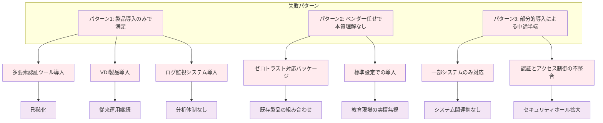
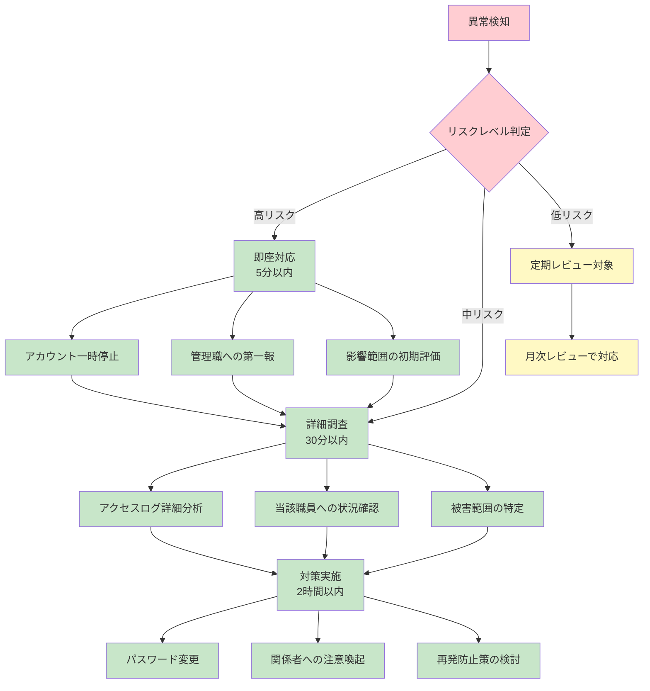
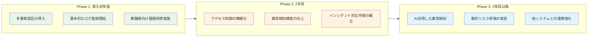

「ゼロトラスト対応のシステムを導入すれば安心です」「最新のセキュリティソフトで完璧に守られます」―このような営業トークに惑わされ、高額なシステムを導入したものの、本当に大切な**児童生徒の個人情報**が守られているのでしょうか。

:::message alert
**まず確認してください**

- なぜ校務システムにセキュリティ対策が必要なのか、明確に説明できますか？
- もし個人情報が漏洩したら、どのような影響があるか理解していますか？
- システム調達の責任者として、どのような責任を負うか把握していますか？
:::

本章では、**製品導入ありきではなく、まず「何を守るべきか」「なぜ守らなければならないか」** を明確にし、その上で適切なセキュリティ対策を選択する考え方について解説します。

## 本来の目的を見失った「製品導入ありき」の危険性

### 校務システムで守るべきものを明確にしていますか？

**校務システムには何が入っているでしょうか？**

- 児童生徒の氏名、住所、電話番号
- 成績情報、出席状況
- 健康診断結果、保健室利用記録
- 家庭環境調査、指導要録
- 保護者の個人情報

これらは全て**個人情報保護法で厳格に保護される情報**です。

:::message
**個人情報保護法での定義**

**「個人情報」** とは、生存する個人に関する情報であって、特定の個人を識別できるもの。

**「要配慮個人情報」** とは、本人の人種、信条、社会的身分、病歴、犯罪歴、犯罪により害を被った事実その他本人に対する不当な差別、偏見その他の不利益が生じないようにその取扱いに特に配慮を要するもの。

**学校が扱う健康診断結果、保健室利用記録等は「要配慮個人情報」に該当します。**
:::

**「最新のシステムを導入したから安心」ではありません。重要なのは、これらの大切な情報をどうやって守るかです。**

### 製品導入が目的化した失敗事例

::: message alert
**A市立中学校での事例**
- 総額800万円をかけて「ゼロトラスト対応システム」を導入
- 「これで個人情報保護は完璧」と安心していた
- しかし実際は
  - 教職員は従来と同じ「123456」のような簡単なパスワードを使用
  - 誰がいつ児童生徒の情報にアクセスしたか、記録を誰も確認していない
  - 夜中に大量の成績データがダウンロードされても気づかない
  - **結果：高額投資をしたが、個人情報はまったく守られていない状態**
:::

**この学校の担当者は、個人情報漏洩が発生した場合、どのような責任を負うことになるでしょうか？**

「システムは導入したから大丈夫だと思っていた」では済まされません。

### 個人情報漏洩が発生したら何が起きるのか

**個人情報漏洩は「もしも」の話ではありません。実際に起きています。**

:::message alert
**実際に起きた教育現場での個人情報漏洩事例**

- **2023年○○市立小学校**：校務用PCから児童1,200名分の個人情報が流出
- **2022年△△県立高校**：USB紛失により生徒・保護者3,000名分の情報が漏洩
- **2021年□□市教育委員会**：メール誤送信で複数校の成績情報が外部流出
:::

**漏洩が発生すると、以下のような深刻な事態が起きます**

**1. 児童生徒・保護者への影響**
- 個人情報の悪用（なりすまし、詐欺等）
- プライバシーの侵害
- 心理的な不安とストレス
- 転校を余儀なくされるケース

**2. 学校・教育委員会への影響**
- 謝罪会見、個別説明会の開催
- 損害賠償請求（1人あたり1万円〜10万円程度）
- 再発防止策の費用（システム改修、職員研修等）
- 信頼失墜による長期的な影響

**3. 担当者個人への影響**
- 懲戒処分（戒告、減給、停職、免職）
- 刑事責任（個人情報保護法違反）
- 民事責任（損害賠償責任）
- 社会的信用の失墜

### システム調達担当者が負う法的責任とリスク

**個人情報保護法では、個人情報取扱事業者（学校・教育委員会）に以下の義務を課しています**

:::message alert
**個人情報保護法上の義務**

1. **安全管理措置義務**（法第23条）
   - 個人情報の漏洩防止等のため、必要かつ適切な措置を講じること

2. **従業者の監督義務**（法第24条）
   - 従業者に個人情報を適正に取り扱わせるための監督を行うこと

3. **委託先の監督義務**（法第25条）
   - 委託先に個人情報を適正に取り扱わせるための監督を行うこと
:::

**これらの義務を怠り、個人情報漏洩が発生した場合**

**刑事責任**
- 個人情報保護法違反：6か月以下の懲役または30万円以下の罰金
- 地方公務員法違反：1年以下の懲役または3万円以下の罰金

**行政処分**
- 個人情報保護委員会からの勧告・命令
- 所属自治体からの懲戒処分

**民事責任**
- 被害者からの損害賠償請求
- 自治体から担当者個人への求償

**「システムはベンダーが作ったから、責任はベンダーにある」は通用しません**

調達仕様書で適切なセキュリティ要件を定めなかった、運用管理を怠ったという理由で、**調達担当者個人の責任が問われます**。

### 適切なセキュリティ対策の考え方

**製品選定の前に、まず以下を明確にしましょう。**

:::message
**セキュリティ対策の基本的な考え方**

1. **何を守るのか？**
   - 児童生徒の個人情報（氏名、住所、成績、健康情報等）
   - 保護者の個人情報
   - 学校運営に関する機密情報

2. **誰から守るのか？**
   - 外部からのサイバー攻撃
   - 内部の不正アクセス
   - 人的ミス（誤操作、紛失等）

3. **どのレベルまで守るのか？**
   - 法令で要求される最低限の対策
   - 社会的責任を果たすために必要な対策
   - 理想的だが現実的でない過度な対策

4. **どうやって守るのか？**
   - 技術的対策（システム、ソフトウェア）
   - 物理的対策（施錠、入退室管理）
   - 人的対策（研修、ルール策定）
   - 組織的対策（責任体制、監査）
:::

**「とりあえず高いシステムを買えば安心」ではありません。**

上記の4つの観点から体系的に検討し、限られた予算の中で**もっとも効果的な対策を組み合わせる**ことが重要です。

### 現場の実情を踏まえた現実的なアプローチ

**教育現場には以下のような制約があります**

- **予算の制約**：限られた予算で最大限の効果を求められる
- **人員の制約**：IT専門スタッフは1〜2名程度
- **時間の制約**：教育活動を止めることはできない
- **スキルの制約**：教職員のITスキルには個人差がある

**これらの制約を無視した対策は必ず失敗します**

:::message
**現実的なアプローチの例**

- **段階的導入**：一度にすべて変更せず、重要度の高いものから順次対応
- **自動化の活用**：人的な運用負荷を最小限に抑える仕組みの導入
- **外部専門家の活用**：内部にない専門知識は外部リソースを活用
- **継続的な改善**：完璧を求めず、運用しながら徐々に改善
:::

**重要なのは「完璧なシステム」ではなく「継続的に運用できるシステム」です**

## 教育現場でのゼロトラスト実装における典型的な失敗パターン

教育現場での導入事例を分析すると、失敗パターンは大きく3つに分類できます。

### 製品導入のみで満足してしまう失敗

**多要素認証ツールを導入したが形骸化**

::: message alert
**事例：B県立高校**
- 総額300万円をかけて「ゼロトラスト対応多要素認証システム」を導入
- 初回設定は情報担当教員が代行
- 結果：
  - 教職員は設定内容を理解していない
  - 「なんとなく使えている」状態
  - セキュリティ意識は向上せず
  - 異常なアクセスがあっても気づかない
:::

**VDI製品を導入したが従来の運用を継続**

::: message alert
**事例：C市教育委員会**
- 1億2千万円をかけて「ゼロトラスト対応VDI環境」を構築
- 「どこからでも安全にアクセス可能」を謳い文句に導入
- しかし
  - 従来の共有IDでの運用を継続
  - アクセス権限は「全員同じ」設定のまま
  - ログ監視体制は未整備
  - 結果：高額な「単なるリモートアクセス環境」
:::

**ログ監視システムを導入したが分析体制なし**

::: message alert
**事例：D市立小学校群**
- 総額500万円をかけて「ゼロトラスト対応SIEM」ツールを導入
- 全アクセスログを収集・蓄積
- しかし
  - ログを見る担当者が不在
  - アラートが発生しても対応方法が不明
  - 月次レポートは作成されるが誰も読まない
  - 実質的に「ログ収集しているだけ」の状態
:::

### ベンダー任せで本質を理解しない失敗

**「ゼロトラスト構成」という名目での製品押し売り**

多くのベンダーが「ゼロトラスト対応パッケージ」として製品を販売していますが、実際には、

- **既存製品の組み合わせ**：新しい技術ではなく、従来製品の組み合わせ
- **一律の設定**：教育現場の特殊事情を考慮しない標準設定
- **運用設計なし**：導入後の運用方法については「現場で検討」

**教育現場の実情を考慮しない標準パッケージ導入**

::: message alert
**事例：E県統一システム導入**
- 総額3億円をかけて民間企業向けゼロトラストパッケージを教育現場に導入
- 問題発生：
  - 授業中にシステムアップデートで認証画面が頻繁に表示
  - 外部講師のアクセス手続きが複雑すぎて運用不可
  - 災害時の緊急アクセス手順が不明確
  - 結果：現場から「使いにくい」との強い反発
:::

### 部分的導入による中途半端な状態

**一部システムのみのゼロトラスト対応**

多くの教育現場では予算制約から「段階的導入」を選択しますが、設計が不十分だと以下の問題が発生します。

::: message alert
**事例：F市立中学校**
- 総額1,200万円をかけて校務支援システムのみゼロトラスト対応
- しかし
  - 学習系システムは従来のまま
  - 両システム間でのSSO（シングルサインオン）未対応
  - 教職員は複数の認証方法を使い分ける必要
  - 結果：業務効率が従来より低下
:::

**認証システムとアクセス制御の不整合**

::: message alert
**事例：G県教育委員会**
- 総額700万円をかけて多要素認証システムを先行導入
- アクセス制御システムは次年度導入予定
- 問題：
  - 認証は強化されたが、認証後は従来と同じ権限
  - 「厳格な入口、緩い内部」という中途半端な状態
  - セキュリティホールが拡大
:::

## 真のゼロトラスト実現に必要な「運用視点」

これらの失敗事例から学べることは、**技術導入よりも運用設計が重要**ということです。

### 継続的検証を支える運用プロセスの構築

**リアルタイムでのリスク評価プロセス**

ゼロトラストの核心は「継続的な検証」です。これを実現するには、

1. **リスク指標の定義**
   - 通常とは異なる時間帯でのアクセス
   - 普段と違う場所からのアクセス
   - 大量データのダウンロード
   - 複数回の認証失敗

2. **評価基準の明確化**
   - どの指標が組み合わさったら「高リスク」と判定するか
   - 教育現場特有の「正常なパターン」の定義
   - 季節要因（入学式、卒業式等）の考慮

3. **判断プロセスの標準化**
   - 誰が判断するか
   - どのレベルで管理職に報告するか
   - 緊急時の判断権限

**異常検知時の迅速な対応フロー**

技術的な検知だけでは意味がありません。重要なのは「検知後の対応」です。

**即座に実施すべき対応（5分以内）**
- 該当アカウントの一時停止
- 管理職への第一報
- 影響範囲の初期評価

**詳細調査フェーズ（30分以内）**
- アクセスログの詳細分析
- 当該職員への状況確認
- 被害範囲の特定

**対策実施フェーズ（2時間以内）**
- 必要に応じたパスワード変更
- 関係者への注意喚起
- 再発防止策の検討

**定期的なアクセス権見直しの仕組み**

ゼロトラストでは「必要最小限の権限」が基本原則です。これを維持するには、

**月次レビュー**
- 人事異動に伴う権限見直し
- 長期未使用アカウントの確認
- 外部講師等の臨時アクセス権整理

**四半期レビュー**
- システム全体の権限設計見直し
- 業務フロー変更に伴う権限調整
- セキュリティインシデントを受けた権限強化

**年次レビュー**
- 権限体系の抜本的見直し
- 新しいセキュリティ脅威への対応
- 組織改編に伴う権限再設計

### 動的アクセス制御を実現する組織体制

**セキュリティ責任者の明確化**

多くの教育現場では「システム担当の先生が何となく管理」という状況ですが、ゼロトラスト実現には明確な責任体制が必要です。

**学校レベル（50名未満の小規模校）**
- セキュリティ管理者：教頭または事務長
- 技術担当者：情報担当教員
- 緊急時連絡先：校長

**学校レベル（50名以上の中・大規模校）**
- セキュリティ責任者：校長
- セキュリティ管理者：教頭
- 技術責任者：情報主任
- 技術担当者：ICT支援員または情報担当教員

**教育委員会レベル**
- 統括セキュリティ責任者：教育長
- セキュリティ管理者：指導部長
- 技術責任者：情報政策課長
- インシデント対応責任者：指導主事

**インシデント対応チームの整備**

セキュリティインシデントは「いつか起きる」ものです。発生時の迅速な対応のために：

**平時の準備**
- 対応手順書の作成と定期更新
- 連絡網の整備（24時間連絡可能）
- 外部専門機関との連携体制構築
- 定期的な模擬訓練の実施

**インシデント発生時の体制**
- 第一発見者の報告義務
- 初動対応チームの召集
- 被害拡大防止措置の実施
- 関係機関への報告

**事後対応**
- 原因分析と再発防止策策定
- 関係者への説明と謝罪
- システム改善の実施
- 対応手順の見直し

**教職員への継続的な教育・啓発**

ゼロトラストの成功は、全教職員の理解と協力にかかっています。

**新任教職員向け研修（年1回）**
- ゼロトラストの基本概念
- 学校での具体的な運用方法
- やってはいけないこと（NG事例）
- 困ったときの相談先

**全教職員向け研修（年2回）**
- 最新のセキュリティ脅威情報
- システム更新内容の説明
- インシデント事例と対策
- 質疑応答セッション

**管理職向け研修（年4回）**
- セキュリティ戦略の理解
- 予算計画と投資効果
- 法的責任と対応義務
- 危機管理と広報対応

### 教育現場特有の制約を考慮した現実的なアプローチ

**限られた人的リソースでの運用設計**

理想的なセキュリティ運用には専門スタッフが必要ですが、教育現場の現実は：

- IT専門スタッフは1名程度（しかも他業務と兼務）
- 教職員のITスキルレベルにばらつき
- 外部ベンダーサポートも予算制約あり

この制約下でゼロトラストを実現するには、

**自動化できるものは自動化**
- アカウント管理の自動化
- 異常検知の自動化
- 定期レポートの自動生成

**外部サービスの活用**
- マネージドセキュリティサービス
- クラウド型セキュリティ監視
- 専門業者による定期診断

**シンプルな運用設計**
- 複雑なルールは避ける
- 例外処理は最小限に
- 判断基準を明確化

**教育活動を阻害しない柔軟性の確保**

セキュリティが厳格すぎて授業に支障をきたしては本末転倒です。

**授業時間帯の配慮**
- システムメンテナンスは授業時間外
- 認証タイムアウトは授業時間を考慮
- 緊急時のバイパス手順を準備

**多様な利用者への対応**
- 児童生徒向けの簡単な認証
- 外部講師向けの臨時アクセス
- 保護者向けの限定アクセス

**季節要因への対応**
- 入学・卒業時期の大量データ処理
- 定期試験時期のアクセス集中
- 長期休業中のメンテナンス作業

**段階的な成熟度向上の計画**

ゼロトラスト実現は一朝一夕では不可能です。現実的な導入計画：

**Phase 1（導入初年度）：基盤整備**
- 多要素認証の導入
- 基本的なログ監視開始
- 教職員向け基礎研修実施

**Phase 2（2年目）：運用改善**
- アクセス制御の精緻化
- 異常検知精度の向上
- インシデント対応手順の確立

**Phase 3（3年目以降）：高度化**
- AI活用した異常検知
- 動的リスク評価の実装
- 他システムとの連携強化

## 本書が目指すゼロトラスト実現への道筋

### 製品選定より重要な「考え方」の理解

本書では、特定の製品やベンダーを推奨することはありません。なぜなら、ゼロトラスト実現にもっとも重要なのは**考え方の理解**だからです。

**なぜゼロトラストが必要なのかの根本理解**

- 従来のセキュリティモデルの限界
- 教育現場を取り巻く脅威の変化
- クラウド時代・BYOD時代への対応

**教育現場での適用における現実的な制約の認識**

- 予算制約の中での効果的な投資
- 限られた人的リソースでの運用設計
- 教育活動を阻害しない制御方法

**完璧を求めず段階的改善を重視するアプローチ**

- 現状分析から始める段階的導入
- 小さな成功を積み重ねる手法
- 失敗を恐れず継続的に改善する文化

### 文科省・総務省ガイドラインとゼロトラストの関係整理

教育現場が直面する最大の課題は、**文部科学省と総務省の異なるセキュリティアプローチ**です。

**日本の教育現場での現実的な実装方法**

- 文科省ガイドライン（認証によるアクセス制御）への対応
- 総務省ガイドライン（三層分離・ネットワーク分離）への対応
- 両方の要件を満たす現実的な解決策

**省庁間の矛盾を乗り越える実践的アプローチ**

- ハイブリッド構成による両立戦略
- 段階的移行による混乱回避
- 地域・規模に応じた柔軟な対応

**予算制約下での効果的な投資戦略**

- 投資対効果を重視した優先順位設定
- 段階的投資による財政負担軽減
- 補助金・交付金の効果的活用

### 運用を前提とした導入戦略の重要性

**技術導入と運用体制整備の同時並行**

多くの失敗事例では「技術導入→運用は後で考える」というパターンが見られます。本書では、

- 運用設計を前提とした技術選定
- 導入と同時の運用体制整備
- 段階的な運用成熟度向上

**教職員の理解と協力を得るためのコミュニケーション**

ゼロトラスト成功の鍵は、全教職員の理解と協力です。

- なぜ変更が必要なのかの丁寧な説明
- 変更に伴う負担軽減策の提示
- 継続的な対話と改善の仕組み

**持続可能な運用を実現するための体制構築**

- 属人化を避けた運用体制
- 外部パートナーとの効果的連携
- 長期的な運用コストの見通し

---

## 【管理職として押さえるべきポイント】

✅ **ゼロトラスト対応製品の導入だけでは何も解決しない**
- 製品は「手段」であり「目的」ではない
- 運用設計なしの技術導入は失敗の元

✅ **運用体制の整備が技術導入より重要**
- 誰が管理するのか、どう運用するのかを先に決める
- 教職員への研修・啓発が成功の鍵

✅ **段階的なアプローチで現場の混乱を最小化**
- 一度に全てを変更しようとしない
- 小さな成功を積み重ねる

✅ **教職員への説明と理解促進が成功の鍵**
- なぜ変更が必要なのかを丁寧に説明
- 変更に伴う負担には適切な配慮を

## 【調達担当者として理解すべき詳細】

📋 **ベンダー提案の適切な評価方法**
- 「ゼロトラスト対応」の実体を見抜く質問力
- 運用コストを含めた総保有コスト（TCO）の算出
- 教育現場での実績と具体的な導入事例の確認

📋 **調達仕様書への適切なセキュリティ要件記載**
- 製品名ではなく「要求機能」での仕様策定
- 運用支援・保守サポート要件の明確化
- 段階的導入を前提とした契約条件の設定

📋 **予算計画と投資対効果の測定**
- 初期投資と継続的運用コストの分離
- 段階的導入による予算平準化
- セキュリティ向上効果の定量的評価方法

📋 **契約・法的リスクの管理**
- SLA（サービス品質保証）の適切な設定
- 個人情報漏洩時の責任範囲と損害賠償条項
- ベンダーロックイン回避のための契約条件

## 【技術担当として理解すべき詳細】

🔧 **NISTの7原則と具体的な実装要件の理解**
- 技術仕様ではなく「考え方」として理解
- 教育現場での適用方法を具体的に検討

🔧 **継続的検証のためのログ監視・分析体制**
- ログを「取る」だけでなく「見る」「分析する」体制
- 異常検知時の対応フローの明確化

🔧 **動的アクセス制御の技術的実装方法**
- 固定的なルールではなく、状況に応じた制御
- 教育現場特有の利用パターンへの対応

🔧 **既存システムとの連携課題と解決策**
- 段階的導入時の整合性確保
- レガシーシステムとの現実的な連携方法

## 【現場教職員への影響】

👥 **認証手順の変更（多要素認証の導入）**
- パスワードに加えて、スマホアプリやSMS認証が必要に
- 初回設定時のサポート体制を整備

👥 **アクセス権限の細分化（必要最小限の原則）**
- 「とりあえず全部」から「必要な分だけ」への変更
- 権限申請プロセスの簡素化が重要

👥 **セキュリティ意識向上の研修機会増加**
- 年数回の研修参加が必要に
- 実践的な内容で負担感を軽減

👥 **業務効率化による本来業務への集中時間増加**
- セキュリティ向上と同時に、業務効率も改善
- 最終的には教職員の負担軽減につながる

## 本書を読むことで得られる具体的な成果

本書を最後まで読み、実践することで、あなたは以下の具体的な成果を得ることができます。

### 【管理職・システム調達責任者が得られる成果】

**1. 適切な投資判断ができるようになる**
- 「ゼロトラスト対応」という営業文句に惑わされない判断力
- 予算対効果を重視した合理的なシステム選定
- 段階的導入による財政負担の軽減

**2. 法的責任とリスクを正確に把握し、適切に対応できる**
- 個人情報保護法上の義務と責任の具体的内容
- 漏洩発生時の対応手順と責任範囲
- 懲戒処分や損害賠償リスクの回避策

**3. 現場に受け入れられる運用設計ができる**
- 教職員の負担を最小限に抑えた制御方法
- 教育活動を阻害しない柔軟なシステム運用
- 段階的な変更による現場の混乱回避

### 【技術担当者・情報担当教員が得られる成果】

**1. ゼロトラストの本質を理解し、現実的な実装ができる**
- NISTフレームワークの教育現場での具体的適用方法
- 継続的検証を支える運用プロセスの構築
- 動的アクセス制御の技術的実装手法

**2. 異常検知と迅速な対応ができる体制を構築できる**
- リアルタイムでのリスク評価プロセス
- 5分以内の初動対応、2時間以内の対策実施フロー
- インシデント対応チームの効果的な運営

**3. 限られたリソースでも持続可能な運用を実現できる**
- 自動化を活用した運用負荷軽減
- 外部専門サービスとの効果的連携
- シンプルで分かりやすい運用ルールの設計

### 【現場教職員が得られるメリット】

**1. セキュリティ向上と同時に業務効率も改善**
- 適切なアクセス権管理による情報へのスムーズなアクセス
- シングルサインオンによる複数システム利用の簡素化
- 自動化による定型作業の削減

**2. 安心して児童生徒の教育に専念できる環境**
- 個人情報保護に関する不安の解消
- 明確な責任体制による安心感
- 適切なサポート体制の構築

**3. 継続的なスキルアップの機会**
- 実践的なセキュリティ研修の受講
- 最新技術に関する知識習得
- 情報リテラシーの向上

### 【組織全体として得られる価値】

**1. 真の意味での「児童生徒の個人情報保護」を実現**
- 法令要求を満たす確実な保護体制
- 社会的責任を果たす組織運営
- 保護者・地域からの信頼獲得

**2. 持続可能なセキュリティ運用体制の確立**
- 属人化を避けた組織的な管理体制
- 長期的な運用コストの最適化
- 継続的改善による成熟度向上

**3. 文科省・総務省ガイドライン双方に対応した現実的解決策**
- 省庁間の要件矛盾を乗り越える実践的アプローチ
- 地域・規模に応じた柔軟な対応策
- 将来の制度変更にも対応可能な拡張性

### 【6か月後、1年後のあなたの姿】

**6か月後：**
- ベンダーの営業トークに惑わされず、適切な質問ができている
- 現場の実情を踏まえた現実的な導入計画を策定している
- 教職員からの理解と協力を得られている

**1年後：**
- ゼロトラストの考え方に基づいた実効性のあるセキュリティ対策が運用されている
- 個人情報漏洩リスクが大幅に軽減されている
- 教育活動とセキュリティ対策が両立した理想的な環境が実現している

**重要なのは「完璧なシステム」ではなく「継続的に運用でき、確実に児童生徒の個人情報を守ることができるシステム」です。**

本書は、その実現に向けた確実なロードマップを提供します。

---

## 【第1章の確認事項】

本章の内容を踏まえ、以下の重要なポイントが理解できているか確認してください。

### ✅ 基本認識の確認

**Q1. なぜセキュリティ対策が必要なのか？**
- [ ] 児童生徒の個人情報保護が本来の目的であることを理解している
- [ ] 個人情報漏洩時の具体的な影響（損害賠償、懲戒処分等）を把握している
- [ ] 調達担当者個人の法的責任の重大性を認識している

**Q2. 製品導入の罠を見抜けるか？**
- [ ] 「ゼロトラスト対応」という営業文句の実体を確認する必要性を理解している
- [ ] 製品導入だけでは個人情報は守られないことを認識している
- [ ] 運用設計の重要性を理解している

**Q3. 失敗パターンを回避できるか？**
- [ ] 製品導入のみで満足する危険性を理解している
- [ ] ベンダー任せで本質理解しない問題を認識している
- [ ] 部分的導入による中途半端な状態のリスクを把握している

### ✅ 実践への準備確認

**Q4. 現場の制約を考慮できるか？**
- [ ] 教育現場特有の制約（予算、人員、時間、スキル）を理解している
- [ ] 段階的アプローチの必要性を認識している
- [ ] 継続的に運用できるシステムの重要性を理解している

**Q5. 適切な投資判断ができるか？**
- [ ] 予算対効果を重視した合理的な選定基準を持っている
- [ ] 総保有コスト（TCO）の概念を理解している
- [ ] 段階的導入による財政負担軽減策を検討できている

**Q6. 組織体制を整備できるか？**
- [ ] セキュリティ責任者の明確化の必要性を理解している
- [ ] インシデント対応体制の重要性を認識している
- [ ] 教職員への継続的な教育・啓発計画を検討できている

### ✅ 次章への準備

**Q7. なぜ次世代校務DXが必要か説明できるか？**
- [ ] 従来システムの具体的な限界を理解している
- [ ] コロナ禍で露呈した問題を把握している
- [ ] 働き方改革との関連性を理解している

**Q8. ゼロトラストの基本概念を理解しているか？**
- [ ] 従来の境界防御との違いを理解している
- [ ] 「何も信頼せず、常に検証する」の意味を把握している
- [ ] 教育現場での適用における注意点を認識している

---

**すべての項目にチェックが入らない場合は、該当箇所を再度読み返してから次章に進むことをお勧めします。**

特に重要なのは、**「製品導入が目的ではなく、児童生徒の個人情報保護が本来の目的」**という基本認識です。この理解なくして、適切なゼロトラスト実装は不可能です。

---

次章では、なぜ今「次世代校務DX」が必要なのか、従来システムの限界と新しい方向性について詳しく解説します。