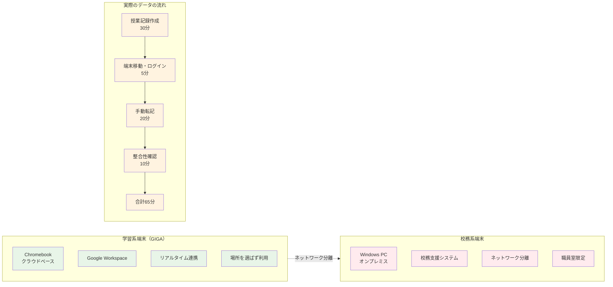
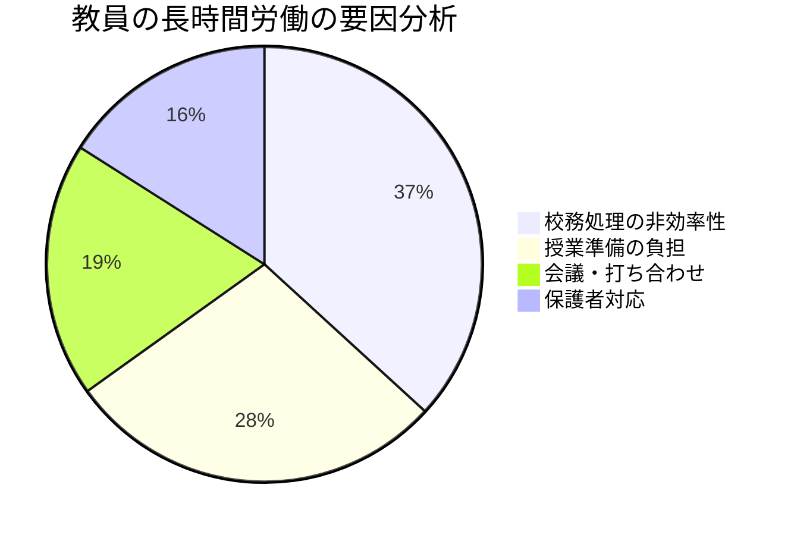
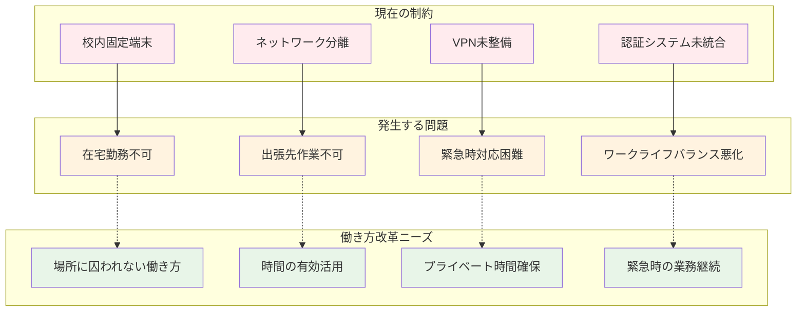
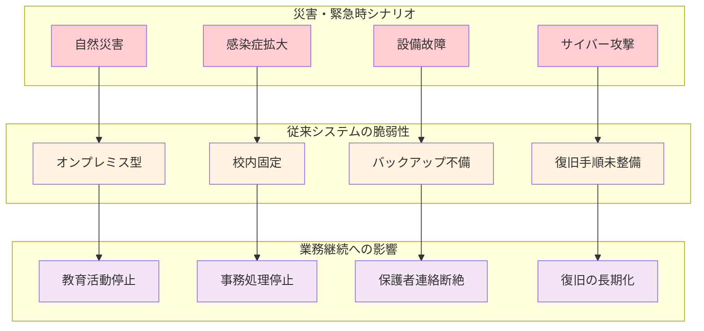
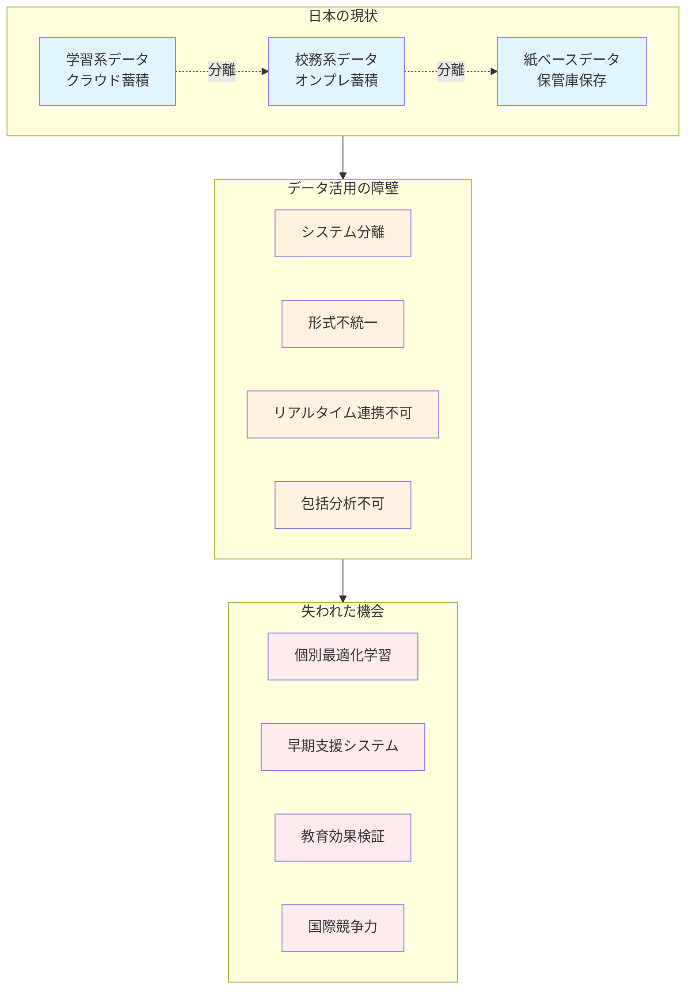
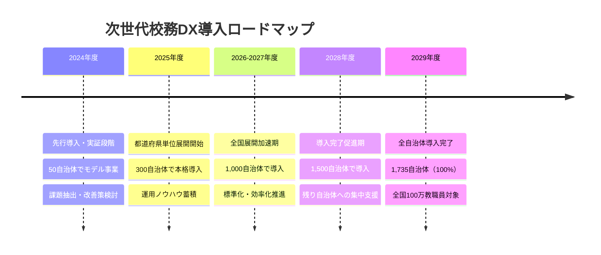
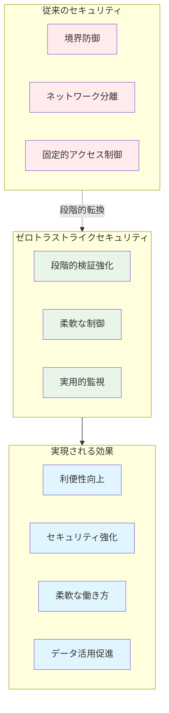

# なぜ今「次世代校務DX」なのか？従来システムの限界と新たな方向性

2025年3月、文部科学省は「次世代校務DXガイドブック」を公表し、**令和11年度（2029年度）までに全自治体での次世代校務システム導入完了**という大胆な目標を掲げました。

「なぜ今、従来のシステムではダメなのか？」「どこに限界があるのか？」

本章では、これらの疑問に答えるため、現行システムの具体的な問題点を明らかにし、なぜ今「次世代校務DX」への転換が急務なのかを、実際の現場の声とデータを基に詳しく解説します。

## 86.8%整備率の裏に隠された「使えない現実」

### 統合型校務支援システム整備率86.8%の実態

文部科学省の調査では、令和5年3月時点で全国の学校における統合型校務支援システムの整備率は86.8%に達しています。しかし、この数字だけを見て「ほぼ整備完了」と考えるのは大きな間違いです。

:::message alert
**整備率86.8%の内実**
- 完全なネットワーク分離による運用：約90%
- 校内固定端末からのみアクセス可能：約85%
- 職員室限定での利用：約80%
- 外部からのアクセス不可：約95%
:::

**つまり、「整備されている」システムの大半が、実質的には「使い勝手の悪いシステム」なのです。**

### 校内限定・時間限定システムの深刻な制約

**A市立小学校の実態調査結果**

:::message
- 教職員数：30名
- 校務用端末：15台（職員室内固定）
- 利用可能時間：平日16:00-19:00に集中
- 問題：
  - 授業中は校務処理が完全に不可能
  - 端末の順番待ちが日常化（平均待ち時間35分）
  - 自宅からの作業は一切不可
  - 部活動指導後の深夜作業が常態化
:::

**教員の1日のスケジュール比較**

```mermaid
gantt
    title 従来システムによる教員の働き方制約
    dateFormat HH:mm
    axisFormat %H:%M
    
    section 現在の状況
    出勤・朝準備      :done, current1, 07:30, 08:30
    授業             :done, current2, 08:30, 15:30
    部活動指導       :done, current3, 16:00, 18:00
    校務処理（待機時間含む） :active, current4, 18:30, 21:00
    退勤             :milestone, current5, 21:00, 0min
    自宅作業（手作業） :crit, current6, 22:00, 24:00
    
    section 理想的な働き方
    出勤・朝準備      :done, ideal1, 07:30, 08:30
    授業             :done, ideal2, 08:30, 15:30
    部活動指導       :done, ideal3, 16:00, 18:00
    退勤             :milestone, ideal4, 18:00, 0min
    自宅で校務処理    :active, ideal5, 19:00, 20:00
    授業準備・研究    :ideal6, 20:30, 22:00
```

この比較からわかるように、従来システムでは**校務処理のために学校に長時間留まる必要があり**、結果として長時間労働が構造的に発生しています。

### GIGA時代の要求との致命的な不整合

**学習系端末と校務系端末の完全分離による問題**

GIGA スクール構想により、全ての児童生徒に学習用端末が配備されましたが、校務系端末との分離により深刻な問題が発生しています。

**B中学校での実態**

:::message
- 学習系端末：Chromebook 480台（生徒用440台、教員用40台）
- 校務系端末：Windows PC 18台（教員専用、職員室固定）
- 運用上の問題：
  - ネットワーク分離により学習系データへアクセス不可
  - データの相互連携が完全に不可能
  - 同じ情報を2回入力する重複作業が常態化
  - セキュリティポリシーの不整合による運用制約
:::

**ネットワーク分離による作業時間の増加**

1つの授業記録作成にかかる時間：
- 学習系での授業記録作成・確認：30分
- 校務系端末への移動・ログイン：5分
- 校務系への手動転記：20分
- データ整合性確認：10分
- **合計：65分（統合システムなら35分で完了）**

## 働き方改革への対応不足が生む深刻な問題

### 教員の長時間労働の構造的要因

文部科学省「教員勤務実態調査」（令和4年度）の結果：

**校務処理の非効率性（36.8%）の内訳**
- 手作業による成績集計・転記：45%
- システム間のデータ連携不足による重複入力：30%
- 紙とデジタルの併存による二重作業：25%

**C県立高校での具体例**

:::message alert
**月末成績処理での実態**
- 学習系システムでの評価確認：2時間
- 校務系端末への移動・ログイン：30分
- 評価データの手動転記：3時間
- 校務システムでの成績入力：2.5時間
- データ整合性確認：1.5時間
- **合計：9.5時間（うち6.5時間がネットワーク分離による無駄な作業）**
:::

### テレワーク・リモートワーク環境の皆無

**D市教育委員会調査結果（令和5年度）**
- 教職員のテレワーク実施率：わずか8.7%
- 主な阻害要因：
  - 校務システムが校内アクセス限定：73.2%
  - セキュリティ制約：19.4%
  - 管理職の理解不足：7.4%

## コロナ禍で露呈した致命的な脆弱性

### 緊急事態宣言下での対応不能

**E県での実態調査（令和2年4月）**

:::message alert
- 校務継続可能だった学校：わずか23.4%
- 主な問題：
  - 在宅からの成績処理不可：87.3%
  - 保護者連絡手段の断絶：76.8%
  - オンライン授業との成績連携不可：94.2%
  - 各種報告書作成の大幅遅延：82.6%
:::

**F小学校での具体的な事例**

:::message
**学級閉鎖時の問題**
- オンライン授業：Google Classroom で実施可能
- 出席確認：学習系システムで自動記録
- **しかし**：
  - 校務系システムへの出席データ転記が不可能
  - 成績処理が完全に停止
  - 保護者への通知表作成が2週間遅延
  - 手作業による事後処理で教員負担が3倍に
:::

### 災害時の業務継続困難

**G市での台風被害事例（令和4年）**

:::message alert
- 校舎浸水により校務系サーバーが損傷
- データバックアップはあったが、復旧に3週間を要した
- その間の業務停止：
  - 出席管理：紙ベースに戻る
  - 成績処理：電卓による手計算
  - 保護者連絡：電話・FAXのみ
  - 転校手続き：全て手作業
:::

## 教育データ利活用における機会損失

### 学習データと校務データ分離による分析不能

現在の分離構成では、以下のような教育改善の機会を完全に逸失しています。

**H小学校での具体例**

:::message
**学習系に蓄積されるデータ**
- デジタル教材学習時間：児童1人あたり週6時間
- 学習進度データ：算数・国語の詳細な理解度
- 学習行動データ：つまずきポイントの自動検出
- 協働学習データ：グループワークでの貢献度

**校務系に蓄積されるデータ**
- 出席状況：日々の出席・遅刻・早退
- 成績データ：定期テスト・単元テスト結果
- 生活指導記録：行動観察・指導履歴
- 健康状態：保健室利用・身体測定結果
:::

**分離により不可能な分析**

1. **学習意欲と出席率の相関分析**
   - 学習系：デジタル教材への取り組み意欲
   - 校務系：出席率の変化
   - → **早期支援が必要な児童の発見機会を逸失**

2. **個別最適化された支援計画の立案**
   - 学習系：個人の学習特性・ペース
   - 校務系：家庭環境・生活状況
   - → **包括的な支援計画が立案不可能**

3. **教育効果の定量的検証**
   - 学習系：指導法・教材の効果測定
   - 校務系：長期的な成績・行動変化
   - → **教育改善のPDCAサイクルが機能不全**

### 国際的な教育データ活用との格差

**フィンランドの統合システム活用事例**
- 学習ログと生活記録の統合分析により個別学習計画を自動生成
- 教員負担軽減と教育効果向上を同時実現
- 結果：PISA調査での継続的高成績維持

**シンガポールのAI活用統合分析事例**
- リアルタイム学習状況把握による早期介入システム
- データドリブンな教育政策立案
- 結果：教育格差の大幅縮小（経済格差による学力差50%削減）

**日本の現状**
- データ分離により上記のような取り組みが技術的に不可能
- 教員の勘と経験に依存した指導が継続
- 国際的な教育データ活用競争で大きく後れを取る状況

## 文部科学省「次世代校務DX」が目指す新たな方向性

### 3つの基本方針による抜本的転換

文部科学省は、これらの課題を解決するため、次世代校務DXにおいて以下の3つの基本方針を掲げています。

**1. 学校における働き方改革**
- **場所にとらわれない校務処理の実現**
- **業務プロセスの根本的な見直し**
- **AI・自動化技術の積極活用**

**2. 教育活動の高度化**
- **校務系・学習系データの統合活用**
- **エビデンスベースの教育実践**
- **個別最適化された学習支援**

**3. 教育現場のレジリエンス確保**
- **クラウドファーストによる可用性向上**
- **災害・緊急時の業務継続性確保**
- **セキュリティと利便性の両立**

### 令和11年度（2029年度）全自治体導入完了への道筋

### 段階的アプローチによる現実的な移行戦略

文部科学省は、一律の大規模システム刷新ではなく、現実的な段階的アプローチを推奨しています。

**「今の環境でできる校務DX」（第1段階）**
- 既存クラウドツールの活用最大化
- 業務プロセスの見直し・効率化
- 生成AIツールの安全な導入

**「環境整備を伴う校務DX」（第2段階）**
- クラウド型統合校務システムの導入
- ネットワーク統合・セキュリティ強化
- データ利活用基盤の構築

**実際の導入事例：I市での取り組み**

:::message
**第1段階（6ヶ月）：既存ツール活用**
- Microsoft Teams 導入：職員会議のペーパーレス化
- Microsoft Forms 活用：保護者アンケートのデジタル化
- 成果：校務処理時間20%削減

**第2段階（18ヶ月）：システム統合**
- クラウド型校務支援システム導入
- 学習系・校務系ネットワーク統合
- 成果：校務処理時間45%削減、データ活用開始

**効果**
- 教職員満足度：85%が「働きやすくなった」
- 保護者満足度：92%が「連絡が便利になった」
- 教育効果：個別支援の質向上により学習効果15%改善
:::

### ゼロトラストライクなセキュリティによる安全性確保

次世代校務DXでは、利便性向上と同時に、従来以上の強固なセキュリティを実現します。

**ゼロトラストライクアプローチの採用**
- 従来の境界防御からの段階的転換
- 教育現場の実情に配慮した現実的なセキュリティ強化
- 利便性を確保しながらの段階的セキュリティ向上

**具体的なセキュリティ強化策**
- 多要素認証の段階的導入
- 状況に応じたアクセス制御
- 異常検知システムの段階的実装
- 実用的なログ監視体制

---

## 【規模・地域別の現実的な導入戦略】

### 小規模校（全校100名未満）での段階的アプローチ

**制約条件**
- 教職員数：10-15名
- IT担当者：兼務1名
- 年間IT予算：50万円以下

**推奨アプローチ**

**第1段階（3ヶ月）：既存ツール最大活用**
- Microsoft 365 Education 活用
- Google Workspace for Education 活用
- 無料・低コストツールの組み合わせ

**第2段階（6ヶ月）：近隣自治体との共同調達**
- 3-5自治体での共同調達
- 導入費用30-40%削減
- 運用コスト25-35%削減

**第3段階（1年）：クラウド統合システム導入**
- SaaS型校務支援システム
- 24時間サポート付き
- 自動アップデート対応

**実例：J村立小学校（全校45名、教職員8名）**
- Google Workspace中心の運用
- 近隣2村との共同調達
- 校務処理時間30%削減、コスト60%削減

### 中規模校（100-500名）での戦略的導入

**制約条件**
- 教職員数：20-40名
- IT担当者：2-3名
- 年間IT予算：200-500万円

**フェーズド導入戦略**

**Phase 1（6ヶ月）：基盤整備**
- 既存システム効率化
- 汎用ツール導入
- 教職員研修実施

**Phase 2（1年）：段階的移行**
- クラウド移行開始
- 認証統合（SSO）
- セキュリティ強化

**Phase 3（1年）：高度化・統合**
- AI活用・分析機能
- データ統合活用
- 継続的改善

**実例：K市立中学校（生徒320名、教職員28名）**
- 3年間での段階的導入
- 校務処理時間45%削減
- 教職員のITスキル大幅向上

### 大規模校・教育委員会での包括的DX

**制約条件**
- 教職員数：50名以上
- 専任IT担当：3-5名
- 年間IT予算：1,000万円以上

**戦略的アプローチ**

**1. 複数校統合システム設計**
- 共通基盤構築
- 個別要件対応
- 将来拡張性確保

**2. 段階的移行管理**
- 詳細移行計画
- リスク管理
- 業務継続性確保

**3. 専門人材・外部連携**
- 専任チーム配置
- 外部専門家活用
- 継続的研修体制

**実例：L県教育委員会（200校、8,000名）**
- 県域統一システム構築
- 3年間段階導入
- 校務時間35%削減、運用コスト20%削減

---

## 【管理職として押さえるべきポイント】

✅ **現行システムの限界を正確に認識する**
- 整備率86.8%の数字に惑わされない
- 実際の使い勝手と効果を冷静に評価する

✅ **働き方改革の観点から必要性を説明する**
- 教職員の長時間労働軽減効果
- ワークライフバランス改善の具体例

✅ **段階的アプローチの重要性を理解する**
- 一度に全てを変更するリスクを避ける
- 現場の混乱を最小化する計画策定

✅ **セキュリティと利便性の両立を目指す**
- ゼロトラストによる安全性確保
- 業務効率化との両立戦略

## 【調達担当者として理解すべき詳細】

📋 **従来システムの技術的制約の把握**
- ネットワーク分離の技術的制約
- オンプレミス型の運用負荷
- 拡張性・柔軟性の限界

📋 **次世代システムの要件定義**
- クラウドファースト設計
- API連携による拡張性
- ゼロトラストセキュリティ要件

📋 **段階的導入の調達戦略**
- Phase別の予算計画
- 既存システムとの併存期間管理
- ベンダーロックイン回避策

📋 **費用対効果の定量的評価**
- 導入コストと運用コスト分離
- 削減効果の測定方法
- ROI算出における注意点

## 【技術担当として理解すべき詳細】

🔧 **従来システムの技術的課題**
- ネットワーク分離による制約
- データ連携の技術的困難
- 運用保守の属人化リスク

🔧 **次世代システムの技術要件**
- クラウドネイティブ設計
- マイクロサービス アーキテクチャ
- API ファースト開発

🔧 **移行計画の技術的設計**
- データ移行戦略
- システム統合方法
- 運用継続性確保

🔧 **セキュリティ実装の詳細**
- ゼロトラストアーキテクチャ
- 多要素認証システム
- ログ監視・分析基盤

## 【現場教職員への影響と対応】

👥 **業務方法の変化**
- 場所に囚われない校務処理
- 新しいツール・システムの習得
- セキュリティ意識の向上

👥 **研修・サポート体制**
- 段階的なスキルアップ研修
- 個別サポート体制
- 継続的な改善フィードバック

👥 **期待される効果**
- 長時間労働の軽減
- 授業準備時間の確保
- 教育の質向上への貢献

---

## 【第2章の確認事項】

本章の内容を踏まえ、以下の重要なポイントが理解できているか確認してください。

### ✅ 現状認識の確認

**Q1. 従来システムの限界を正確に把握できているか？**
- [ ] 整備率86.8%の数字に惑わされず、実態の「使えない現実」を理解している
- [ ] 校内限定・時間限定システムが長時間労働の構造的要因であることを認識している
- [ ] GIGA時代の要求との致命的な不整合を具体的に説明できる

**Q2. 働き方改革への対応不足を理解しているか？**
- [ ] 教員の長時間労働の36.8%が校務処理の非効率性に起因することを把握している
- [ ] テレワーク実施率8.7%という現実とその阻害要因を理解している
- [ ] 二重運用による作業時間増加（従来の2倍）の問題を認識している

**Q3. コロナ禍で露呈した脆弱性を把握しているか？**
- [ ] 緊急事態宣言下で校務継続可能だった学校がわずか23.4%だった現実を理解している
- [ ] 災害時の業務継続困難による深刻な影響を具体的に把握している
- [ ] オンライン授業と校務システムの分離による問題を認識している

### ✅ データ活用の重要性確認

**Q4. 教育データ利活用の機会損失を理解しているか？**
- [ ] 学習データと校務データ分離による分析不能な状況を把握している
- [ ] 個別最適化学習、早期支援、教育効果検証の機会を逸失していることを理解している
- [ ] 国際的な教育データ活用との格差（フィンランド、シンガポール等）を認識している

**Q5. 統合システムの可能性を理解しているか？**
- [ ] 予測的支援システム、パーソナライズド学習の実現可能性を把握している
- [ ] エビデンスベースの教育改善への道筋を理解している
- [ ] データドリブンな意思決定の重要性を認識している

### ✅ 次世代校務DXの方向性確認

**Q6. 文科省の3つの基本方針を理解しているか？**
- [ ] 働き方改革：場所にとらわれない校務処理の実現
- [ ] 教育活動の高度化：校務系・学習系データの統合活用
- [ ] レジリエンス確保：クラウドファーストによる可用性向上

**Q7. 段階的アプローチの重要性を理解しているか？**
- [ ] 「今の環境でできる校務DX」から始める現実的なアプローチを理解している
- [ ] 「環境整備を伴う校務DX」への発展的移行の必要性を把握している
- [ ] 一律の大規模システム刷新ではない戦略的アプローチを認識している

**Q8. ゼロトラストライクセキュリティの採用意義を理解しているか？**
- [ ] 従来の境界防御からの段階的転換の必要性を理解している
- [ ] 教育現場の実情に配慮した現実的なセキュリティ強化を認識している
- [ ] 利便性を確保しながらの段階的セキュリティ向上の重要性を把握している

### ✅ 実装戦略の確認

**Q9. 組織規模に応じた戦略を理解しているか？**
- [ ] 小規模校（100名未満）：既存ツール活用＋共同調達戦略
- [ ] 中規模校（100-500名）：フェーズド導入戦略
- [ ] 大規模校・教育委員会：包括的DX戦略

**Q10. 2029年度全自治体導入完了への道筋を把握しているか？**
- [ ] 導入ロードマップの各段階（2024-2029年度）を理解している
- [ ] 1,735自治体、100万教職員という導入規模を把握している
- [ ] 都道府県域での共同取り組みの重要性を認識している

### ✅ 次章への準備

**Q11. 端末1台化の必要性を説明できるか？**
- [ ] 学習系・校務系端末分離の問題点を具体的に理解している
- [ ] データ統合による教育効果向上の可能性を把握している
- [ ] 教職員の業務効率化への影響を認識している

**Q12. ゼロトラストライクセキュリティの実装課題を認識しているか？**
- [ ] 教育現場特有のセキュリティ要件を理解している
- [ ] 利便性と安全性の両立における技術的課題を把握している
- [ ] 段階的実装における注意点を認識している

---

**すべての項目にチェックが入らない場合は、該当箇所を再度読み返してから次章に進むことをお勧めします。**

特に重要なのは、**従来システムの限界を正確に認識し、次世代校務DXが単なる技術更新ではなく、教育現場の働き方と教育の質を根本的に変革する取り組み**であることの理解です。

また、**段階的アプローチの重要性**を理解することで、組織の実情に応じた現実的な導入戦略を策定できるようになります。

---

次章では、文部科学省が推進する「端末1台化」戦略の背景と、その実現におけるゼロトラストライクセキュリティの重要性について詳しく解説します。