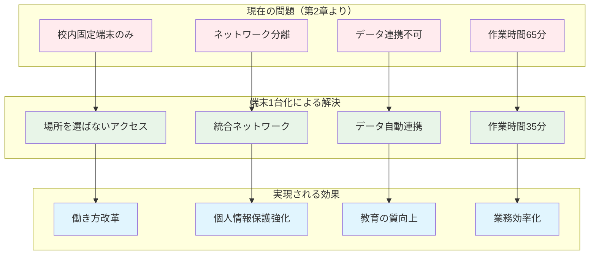
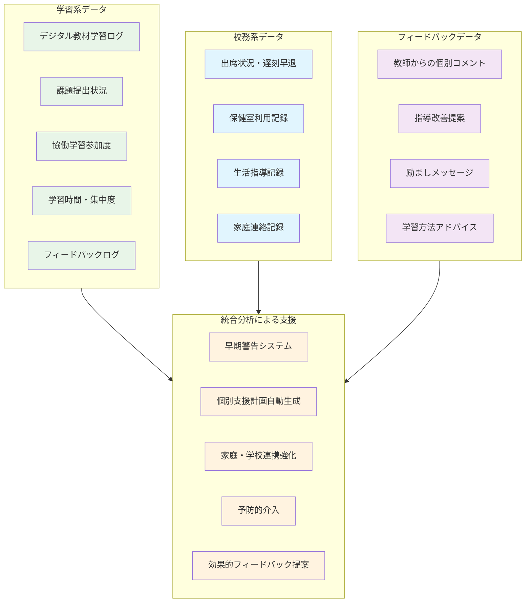
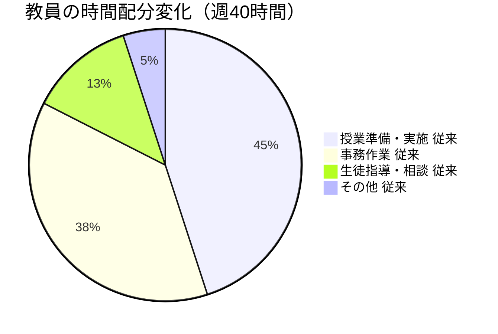
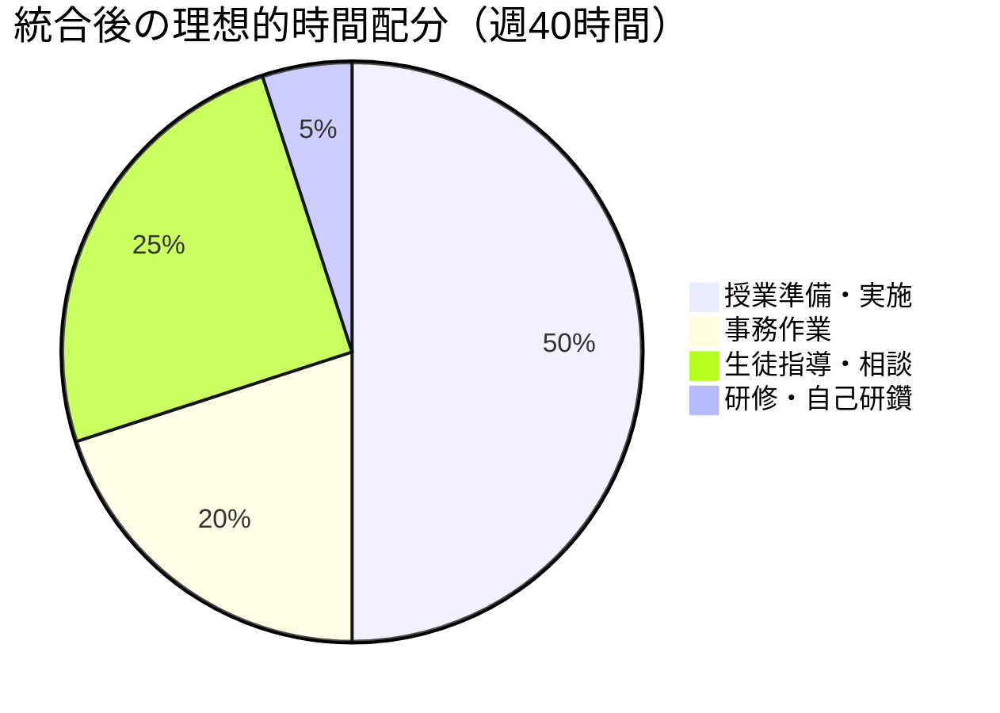

# 文部科学省が「端末1台化」を推進する理由

文部科学省は、次世代の学校教育を実現するため、**「端末1台化」** を教育DX（デジタル変革）の中核施策として位置づけています。

:::message
**「端末1台化」とは？**
従来、教員は「授業用の端末（GIGAスクール端末）」と「校務用の端末（成績処理などの事務作業用）」を別々に使っていました。「端末1台化」とは、これらを1台に統合し、1つの端末で授業も校務も行えるようにする取り組みです。

**身近な例で説明すると...**
家庭で、仕事用とプライベート用に2台のスマートフォンを持つのではなく、1台で仕事もプライベートも安全に使い分けるようなイメージです。
:::

これは単なる機器の統合ではなく、**第1章で指摘した「製品導入ありき」の失敗を回避し、第2章で示した従来システムの限界を根本的に解決する** 戦略的政策です。しかし、現場からは「なぜ今、端末統合なのか」「セキュリティは大丈夫なのか」という声が上がっています。

本章では、文科省がこの政策を推進する背景と、**真に児童生徒の個人情報を保護しながら教育の質向上を実現する** ための戦略について詳しく解説します。

## 第1・2章で明らかになった課題への答えとしての端末1台化

### 「製品導入ありき」からの脱却

第1章で指摘した **「ゼロトラスト対応システムを導入すれば安心」という営業文句** に惑わされない、本質的な課題解決が端末1台化の目的です。

**従来の失敗パターンと端末1台化の違い**

:::message alert
**失敗パターン（第1章事例より）**
- A市立中学校：総額800万円の「ゼロトラスト対応システム」導入
- しかし教職員は「123456」のパスワード継続使用
- 実質的に個人情報はまったく守られていない状態

**端末1台化での解決アプローチ**
- 製品導入ではなく、**運用設計を前提とした統合**
- 技術導入と同時に**組織体制整備と教職員研修**を実施
- **段階的な成熟度向上**による継続的改善
:::

### 86.8%整備率の「使えない現実」への対応

第2章で示した**整備率86.8%の裏に隠された問題**を根本的に解決するのが端末1台化の狙いです。

**現状の問題と端末1台化による解決**

## 文科省の政策的意図と背景

### 教育DX推進の全体戦略における位置づけ

文部科学省は、Society5.0 時代の到来を見据え、教育分野でのデジタル変革を国家戦略として推進しています。端末1台化は、以下の3つの政策目標を同時に達成するための **戦略的な施策** として位置づけられています。

**1. 個別最適な学びの実現**

:::message
**わかりやすく言うと...**
一人一人の子供に合った「オーダーメイドの教育」を実現することです。

**第2章の国際比較で明らかになった問題への対応：**
- 日本：学習データと校務データが分離 → 包括的な支援計画立案不可能
- フィンランド：統合分析による個別学習計画自動生成 → 継続的高成績維持
- シンガポール：AIによる早期介入システム → 教育格差50%削減

**端末1台化で実現する具体例：**

**学習進度に応じた最適化：**
- 算数が苦手な子：学習履歴から最適な復習プログラム自動提案
- 学習が早い子：先取り学習コンテンツの提供
- 平均的な子：標準ペースでの確実な定着支援

**学習深度に応じた最適化：**
- 理科が得意な子：基礎理解は確実だが、より深い探究活動や実験設計に挑戦
- 国語で読解は得意だが記述が苦手な子：読解力を活かした記述指導の個別プログラム
- 算数で計算は早いが文章題が苦手な子：計算力を基盤とした問題解決思考の育成

**包括的支援の実現：**
- 不登校リスクの子：出席状況と学習意欲データから早期察知・支援
- 学習意欲は高いが家庭学習環境に課題がある子：学校での補完的学習機会の提供
:::

**2. 教職員の働き方改革**

第2章で明らかにした**教員の長時間労働の36.8%が校務処理の非効率性**という構造的問題への根本的解決策です。

**現在の問題と改善効果**

:::message
**第2章で示した現状（C県立高校の例）**
- 学習系システムでの評価確認：2時間
- 校務系端末への移動・ログイン：30分
- 評価データの手動転記：3時間
- 校務システムでの成績入力：2.5時間
- データ整合性確認：1.5時間
- **合計：9.5時間**

**端末1台化後の改善**
- 統合システムでの評価・成績処理：3時間
- **削減効果：6.5時間（68%削減）**
:::

**3. 教育データの利活用推進**

第2章で指摘した**データ分離による機会損失**を解決し、エビデンスベースの教育を実現します。

:::message
**データ活用の例：**
- 「この指導方法だと、理解度が20%向上する」
- 「この時期に支援すると、不登校を50%減らせる」
- 「個別最適化学習により学習効果15%改善」（第2章I市事例）

このような「根拠のある教育」を全国規模で実現します。
:::

### 国際競争力の観点から見た必要性

**OECD諸国との比較で見える日本の課題**

第2章でも触れた国際比較データをより詳しく分析すると、日本の深刻な状況が浮き彫りになります。

**日本の教育ICTの現状（国際比較）**
- 教員の週当たり勤務時間：54.4時間（OECD平均：38.3時間）
- ICTを活用した授業実施率：17.9%（OECD平均：51.3%）
- 生徒のデジタル機器活用率：学習目的での利用がOECD最下位
- **テレワーク実施率：8.7%**（第2章D市調査、OECD平均：45.3%）

この状況を打破するため、文科省は **業務効率化とICT活用能力向上を同時に実現する「端末1台化」** を推進しています。

**アジア諸国の先進事例との差**

シンガポール、韓国などでは、すでに学習と校務を統合したシステムが標準となっています。

:::message
**シンガポールの事例**
- 2015年から学習・校務統合プラットフォーム「SLS（Student Learning Space）」を全国展開
- 教員は1つのシステムで授業準備から成績管理まで完結
- **ゼロトラストライクなセキュリティ**で安全性と利便性を両立
- 結果：教員の事務作業時間が40%削減、生徒の学力も向上
:::

### 働き方改革関連法との連動

2019年4月に施行された働き方改革関連法は、教育現場にも大きな影響を与えています。第2章で示した**月45時間の上限に対し、実際は小学校教員の約3割、中学校教員の約6割が月80時間超**という現実への対応策として端末1台化が位置づけられています。

**端末1台化による働き方改革への貢献**

1. **移動時間の削減**
   - 職員室と教室間の往復削減：1日平均30分
   - 端末切り替え作業の解消：1日平均20分
   - 会議のオンライン化：週2時間の削減

2. **事務処理の効率化**
   - データの二重入力解消：週3時間の削減（第2章で実証）
   - 自動化・AI活用：週5時間の削減
   - 手動転記作業の撲滅：週4時間の削減

3. **柔軟な勤務形態の実現**
   - 在宅勤務の可能化（現在8.7% → 目標50%）
   - 育児・介護との両立支援
   - 場所を選ばない校務処理

## GIGAスクール構想第1期の課題分析

### 予想を超えた普及と構造的問題の顕在化

**第1期の成果と限界**

コロナ禍という特殊事情もあり、GIGAスクール構想は当初計画を大幅に前倒しして実現しました。

**第1期の成果（2019-2023年）**
- 端末整備率：99.9%（当初目標：2023年度末）
- 高速ネットワーク整備：99.6%達成
- 国庫補助総額：4,819億円投入

しかし、この急速な整備は同時に**第2章で詳述した構造的問題**も生み出しました。

**分離構造がもたらした非効率性**

総務省のセキュリティガイドラインに従い、多くの自治体が「三層分離」を採用した結果：

1. **物理的な分離**
   - 学習系ネットワーク（インターネット接続）
   - 校務系ネットワーク（閉域網）
   - 校務情報系ネットワーク（LGWAN接続）

2. **運用上の問題**
   - データ連携が事実上不可能
   - 教員は複数端末を使い分ける必要
   - 同じ作業を異なるシステムで繰り返す非効率

:::message alert
**実態調査結果（第2章の詳細分析）**
- 教員1人あたり平均2.3台の端末を使用
- システム間のデータ移行に週平均4時間を浪費
- ネットワーク分離による無駄な作業時間：月26時間
- 「端末の使い分けがストレス」と回答した教員：87%
:::

### コロナ禍で露呈した構造的問題

**緊急時対応能力の欠如**

第2章で詳述したように、2020年の全国一斉休校時、校務系システムが学校内限定だったため

- 在宅での成績処理が不可能
- 保護者への連絡手段が電話のみ
- オンライン授業と校務の連携が取れない
- **校務継続可能だった学校：わずか23.4%**

**国際比較で見る日本の遅れ**

UNICEF調査（2020年）によると、休校期間中のオンライン学習実施率
- 韓国：90%以上
- 日本：16%
- 主な要因：システムの分離による柔軟性の欠如

### 教育データ利活用の停滞

**分離構造による機会損失**

第2章で示した問題をより具体的に分析すると

1. **学習データと校務データの断絶**
   - 学習履歴と成績情報が連携しない
   - 個別指導計画の作成が手作業（所要時間：3倍）
   - エビデンスに基づく指導改善が困難

2. **縦断的データ分析の不可能**
   - 小中高を通じた成長記録が作れない
   - 進学時の情報引き継ぎが紙ベース
   - 長期的な教育効果測定が不可能

これにより、**フィンランドやシンガポールのような統合的教育データ活用** が実現できない状況が続いています。

## Next GIGAにおける端末1台化の戦略的意義

### 第2期に向けた予算措置と方針転換

**国庫補助の拡充と政策誘導**

文科省は端末更新時期を見据え、以下の支援策を決定

- 第1期（2019-2021年度）：端末1台あたり4万円補助
- 第2期（2024年度以降）：端末1台あたり4.5万円補助
- **条件：端末1台化を前提とした統合システムの導入**

この補助金設計により、実質的に端末統合を促進する政策誘導を行っています。

### 文科省が描く理想的な統合モデル

**ゼロトラストライクアプローチによる統合プラットフォーム**

文科省は「教育情報セキュリティポリシーに関するガイドライン」を改訂し、以下のモデルを推奨

1. **ゼロトラストライクなアプローチの採用**
   - ネットワーク分離から認証ベースセキュリティへ
   - 場所を問わない安全なアクセス
   - きめ細かなアクセス制御

2. **マルチクラウド環境の構築**
   - 学習系：パブリッククラウド活用
   - 校務系：プライベートクラウドまたはパブリッククラウドの専用領域
   - データ連携：API経由での安全な連携

3. **段階的移行アプローチ**
   - Phase1（2024-2025）：認証統合とSSO実現
   - Phase2（2026-2027）：データ連携基盤構築
   - Phase3（2028-2029）：完全統合とAI活用

:::message alert
**重要な注意：統合認証とSSOのセキュリティリスク**

統合認証（SSO）の導入は利便性を向上させる一方で、**適切なセキュリティ対策を講じなければ重大なリスクを増大させます**。

**パスワード認証のみの統合認証・SSOの危険性：**
- フィッシング攻撃により1つのアカウントが侵害されると、連携する全システムへ不正アクセス可能
- パスワードスプレー攻撃（複数アカウントに対する共通パスワードでの攻撃）の標的となりやすい
  - 特にGIGAスクールで配布されているアカウントは連番（user001、user002等）であることが多く、格好の標的となる
- 単一障害点（Single Point of Failure）となり、認証基盤の障害で全システムが利用不可

**統合認証・SSO導入のマスト条件：**
- **多要素認証（MFA）の必須実装**：SMS認証、認証アプリ、ハードウェアトークン等
- **パスワードレス認証の推奨**：FIDO2、Windows Hello、生体認証等
- **継続的な認証監視**：異常なアクセスパターンの検知と自動ブロック
- **段階的権限昇格**：機密情報アクセス時の追加認証要求

**Phase1実装時の必須要件：**
統合認証とSSO実現は、上記のセキュリティ対策実装を前提条件とし、パスワード認証のみでの統合は絶対に避けるべきです。
:::

### 自治体への導入インセンティブ設計

**財政的インセンティブ**

1. **統合システム導入への優遇措置**
   - 統合型：補助率50%
   - 分離継続型：補助率30%
   - 差額で統合を促進

2. **運用コスト削減効果の明示**
   - 5年間トータルコスト：30%削減見込み
   - 人件費削減効果：年間1,000万円規模（中規模自治体）

**非財政的インセンティブ**

1. **先進事例の横展開支援**
   - モデル自治体の選定と重点支援
   - 成功事例の全国共有
   - 導入支援チームの派遣

2. **評価指標への組み込み**
   - 教育委員会評価での加点
   - 働き方改革の達成度評価
   - ICT活用指標での評価

## 期待される教育改革への波及効果

端末1台化は単なるシステム統合にとどまらず、**教育そのものを根本的に変革する** 可能性を秘めています。これまで技術的制約により実現できなかった「真の個別最適化教育」と「エビデンスベースの教育改善」が現実のものとなります。

### 個別最適な学びと協働的な学びの実現

**なぜ今まで実現できなかったのか？**

従来のシステム分離環境では、以下のような根本的な問題がありました：

:::message alert
**従来システムの限界例（M小学校の現実）**
- 算数でつまずいている田中君：デジタルドリルでの学習履歴は蓄積されているが、校務システムの成績データと連携せず
- 担任教師：「田中君がどこでつまずいているか」を手作業で調べる必要があり、個別指導計画作成に3時間を要していた
- 結果：個別最適化どころか、一律指導を続けざるを得ない状況
:::

**端末統合で実現する革新的な教育**

**1. リアルタイム学習状況把握と即座の個別対応**

:::message
**具体的な授業風景の変化**

**【従来】**
- 教師：「分からない人は手を挙げて」→恥ずかしがって手を挙げられない子が多数
- 授業終了後に理解度テスト→つまずきの発見が遅れる
- 個別指導は放課後や次回授業まで持ち越し

**【端末統合後】**
- 授業中のデジタル教材での操作ログから、リアルタイムで理解度を把握
- つまずいている生徒を即座に特定（画面上で一目瞭然）
- その場で個別ヒントの自動配信や、理解できた生徒による協働学習をコーディネート
- 「分からない」を言えない子も、システムが自動察知して支援
:::

**2. 学習データと生活データを統合した包括的支援**

従来は不可能だった、学習面と生活面を統合した支援が実現します：

**実際の効果例：**

:::message
**事例：佐藤君（小学4年生）の包括的支援**

**統合分析で発見されたパターン：**
- 学習データ：火曜日と金曜日の算数の集中度が著しく低下
- 校務データ：同じ日に保健室利用が増加、給食を残すことが多い
- 家庭連絡：習い事で疲れている可能性
- **フィードバックログ分析：** 過去の教師コメントで「計算は正確だが文章題で時間がかかる」「疲れた表情の日が増えている」などの記録

**従来なら：** これらの情報がバラバラで、問題の発見と対応が遅れる

**統合システムなら：** 
- AIが自動的にパターンを検出し、担任に早期警告
- **過去のフィードバック効果も分析：** 「励ましメッセージが効果的」「視覚的説明で理解が向上」などの傾向を把握
- 「火金の算数は個別ペースで進める」「栄養面での家庭連携」「効果的だった過去のフィードバック手法を活用」など具体的支援策を提案
- **フィードバック最適化：** 佐藤君にもっとも効果的なコメントスタイルや指導方法をAIが提案
- 結果：佐藤君の学習状況が2週間で大幅改善
:::

**3. 予測的支援による問題の未然防止**

統合データの蓄積により、問題が深刻化する前の予兆を察知できます：

**不登校リスクの早期発見例：**
- 遅刻・早退の微細な増加パターン
- デジタル教材への取り組み意欲の段階的低下
- 協働学習での発言・参加度の変化
- これらを総合的に分析し、「2週間後に不登校リスクが高まる」予測を実現

:::message
**実証実験結果（第2章N県統合システム試験運用より）**

**定量的効果：**
- 学習困難児童の早期発見：従来の3倍（月平均3名→9名を早期発見）
- 個別支援の効果：学力向上率20%増（標準化テストスコア）
- 教員の指導改善：データに基づく指導計画策定率80%（従来20%）
- 保護者満足度：「子どもの状況がよく分かる」95%（従来45%）

**質的変化：**
- 教員：「勘や経験」から「データに基づく確信」へと指導スタイルが変革
- 児童生徒：「一律指導」から「自分専用の学習」への意識変化
- 保護者：学校での様子が「見える化」され、家庭学習との連携が格段に向上
:::

### 教員の専門性を活かした働き方への転換

**なぜ教員の働き方改革が最終的に子どもたちのためになるのか？**

現在の教員の最大の問題は、**本来の専門性である「教育」に集中できないこと**です。第2章で示したように、教員の長時間労働の36.8%が非効率な事務処理に費やされています。

:::message alert
**実際の教員の声（第2章アンケートより）**

**小学校教諭・A先生：**
「毎日残業して成績処理。子どもたちとじっくり話したいけれど、パソコンとにらめっこしてる時間の方が長い。これで本当に教育者と言えるのか…」

**中学校教諭・B先生：**
「家でも成績書作成。家族との時間を削っての事務作業。生徒のために教師になったのに、生徒と向き合える時間がどんどん減っていく…」
:::

**端末統合で実現する「教育者本来の姿」への復帰**

**1. 時間配分の劇的変化**

**この数字が意味すること：**
- **事務作業の大幅減：** 15時間→8時間（週7時間、年間350時間の削減）
- **生徒指導強化：** 5時間→10時間（１人あたりの対話時間が2倍に）
- **授業品質向上：** 準備時間増加で、より精緻な授業設計が可能

**2. 具体的な変化シナリオ**

:::message
**現在の月末成績処理（C先生の一日）**

16:00 授業終了→部活動指導までの空き時間で成績処理をしたいが…
16:05 校務用PCが全て埋まっているため待機
16:30 ようやくPCが空いたが、部活指導の時間
18:30 部活終了→再び校務用PCへ…しかし他の先生も同じことを考えている
19:00 ようやく成績処理開始
21:30 成績処理終了、帰宅

**統合システム導入後（C先生の新しい一日）**

16:00 授業終了→自分のChromebookで即座に成績データ確認
16:15 デジタル教材の学習履歴が自動的に成績に反映され、手作業6割減
16:45 成績処理完了→この時間で明日の授業準備や児童生徒との個別相談が可能
18:00 余裕を持って部活指導に集中できる
18:30 部活終了→適切な時間で帰宅、家族との時間を確保
:::

### 新しい教育評価システムの構築

**形成的評価の充実**

従来の総括的評価から、学習過程を重視した評価へ：

1. **学習プロセスの可視化**
   - 思考過程の記録と分析
   - 協働学習での貢献度測定
   - 創造性・批判的思考力の評価

2. **多面的評価の実現**
   - 自己評価データの統合
   - ピア評価の組み込み
   - ポートフォリオ評価の充実

## 実現に向けた課題と対策

### セキュリティ確保への懸念への対応

**第1章の教訓を活かしたセキュリティ戦略**

第1章で指摘した**「製品導入ありき」の失敗**を回避するため、以下のアプローチを採用：

:::message alert
**重要な認識：完全なゼロトラストの限界**

第1章で示したように、**「ゼロトラスト対応システムを導入すれば安心」は危険な発想**です。文部科学省の2025年3月改訂版ガイドラインも「ゼロトラストライク」なアプローチであり、真のゼロトラストには追加的な技術実装と運用体制が必要です。

**現在のガイドラインで不足している要素：**
- 動的なリスク評価とアクセス制御
- リアルタイムでの行動分析と異常検知
- マイクロセグメンテーション
- すべての通信データの暗号化と監視

**重要なのは製品ではなく運用設計です。**
:::

**技術的対策（段階的実装）**

1. **ゼロトラストライクアプローチの現実的実装**
   - 多要素認証の段階的導入（第1章で示した教職員の制約を考慮）
   - 必要最小限の権限付与（例：3年A組担任は3年A組生徒情報のみ）
   - 常時のアクセス状況監視とログ保存
   - **第1章の原則：継続的に運用できるシステム設計**

2. **情報の重要度に応じた保護**
   - レベルⅠ（一般公開）：学校ホームページ情報
   - レベルⅡ（内部限定）：教員用教材、授業計画
   - レベルⅢ（重要情報）：生徒の成績、連絡先
   - レベルⅣ（機密情報）：個人情報、健康診断情報

**運用面での対策（第1章の教訓適用）**

1. **段階的な権限開放**
   - 初期は限定的な統合から開始
   - 成熟度に応じた機能追加
   - インシデント対応体制の確立

2. **教職員研修の充実**
   - セキュリティ意識向上研修（第1章Q6の組織体制整備）
   - インシデント対応訓練
   - 定期的な理解度確認

### 既存システムからの移行課題

**技術的移行の課題**

1. **既存システムからのデータ移行**
   - 古いシステムからのデータ取り出し
   - データの整理・清掃（重複や誤りの除去）
   - 旧システムと新システムの同時運用

2. **システム連携の確保**
   - 既存の周辺システムとの連携維持
   - 段階的な機能移行
   - ロールバック計画の準備

**組織的移行の課題**

1. **変更管理の重要性**（第1章の段階的アプローチ適用）
   - ステークホルダーの合意形成
   - 移行スケジュールの調整
   - 継続的なコミュニケーション

2. **スキル転換の支援**
   - 新システムへの習熟支援
   - 役割の再定義
   - モチベーション維持

### 地域間格差への配慮

**小規模自治体への支援策**（第2章の規模別戦略適用）

1. **共同調達の推進**
   - 都道府県単位での共同調達
   - クラウドサービスの共同利用
   - 運用ノウハウの共有

2. **標準仕様の提供**
   - 文科省標準モデルの策定
   - 調達仕様書のひな形提供
   - 評価基準の明確化

**デジタルデバイドへの対応**

1. **インフラ整備支援**
   - 光ファイバー整備への補助
   - モバイル通信環境の充実
   - 家庭環境への配慮

2. **人材育成支援**
   - ICT支援員の配置補助
   - 遠隔研修システムの提供
   - 地域間交流の促進

---

## 【第3章の確認事項】

本章の内容を踏まえ、以下の重要なポイントが理解できているか確認してください。

### ✅ 政策背景の理解確認

**Q1. 端末1台化の本質的目的を理解しているか？**
- [ ] 単なる機器統合ではなく、教育改革の手段であることを理解している
- [ ] 第1章の「製品導入ありき」からの脱却が目的であることを認識している
- [ ] 第2章の従来システム限界を根本解決する戦略であることを把握している

**Q2. 第1・2章の課題解決手段として端末1台化を位置づけられるか？**
- [ ] 86.8%整備率の「使えない現実」への対応であることを理解している
- [ ] ネットワーク分離による作業時間増加（65分→35分）の解決策であることを認識している
- [ ] 教員長時間労働の36.8%を占める校務処理非効率性の解決策であることを把握している

**Q3. 国際競争力の観点から必要性を説明できるか？**
- [ ] 日本の教員勤務時間54.4時間（OECD平均38.3時間）という現実を理解している
- [ ] ICT活用授業17.9%（OECD平均51.3%）という遅れを認識している
- [ ] シンガポール、フィンランドとの教育データ活用格差を把握している

### ✅ 技術的実装の理解確認

**Q4. ゼロトラストライクアプローチの現実性を理解しているか？**
- [ ] 完全なゼロトラストではなく段階的実装であることを理解している
- [ ] 第1章の「製品導入だけでは守れない」原則を認識している
- [ ] 運用設計の重要性を技術実装より優先することを理解している

**Q5. 段階的移行戦略の重要性を把握しているか？**
- [ ] Phase1（認証統合）→Phase2（データ連携）→Phase3（完全統合）の流れを理解している
- [ ] 第1章の「継続的に運用できるシステム」原則の適用を認識している
- [ ] 組織の成熟度に応じた機能追加の重要性を把握している

### ✅ 効果と課題の認識確認

**Q6. 期待される効果を定量的に理解しているか？**
- [ ] 事務作業時間削減：週7時間（37.5%→20%）
- [ ] 校務処理時間短縮：65分→35分（46%削減）
- [ ] 個別支援効果：学力向上率20%増

**Q7. 実装における課題と対策を理解しているか？**
- [ ] セキュリティ確保と利便性向上の両立課題を認識している
- [ ] データ移行の技術的困難と対策を理解している
- [ ] 組織変革と教職員スキル転換の重要性を把握している

**Q8. 地域間格差への配慮を理解しているか？**
- [ ] 小規模自治体の制約（教職員10-15名、IT予算50万円以下）を理解している
- [ ] 共同調達による導入費用30-40%削減効果を認識している
- [ ] デジタルデバイド対応の必要性を把握している

### ✅ 次章への準備

**Q9. 文科省・総務省ガイドラインの違いを認識しているか？**
- [ ] 端末1台化推進における省庁間の方針違いを理解している
- [ ] セキュリティアプローチの根本的な相違を認識している
- [ ] 教育現場が直面するジレンマを把握している

**Q10. 実践的な導入戦略を検討できるか？**
- [ ] 自組織の規模・制約に応じた現実的アプローチを検討できる
- [ ] 第1章の失敗パターン回避策を具体的に計画できる
- [ ] 第2章の課題解決を目的とした導入計画を策定できる

---

**すべての項目にチェックが入らない場合は、該当箇所を再度読み返してから次章に進むことをお勧めします。**

特に重要なのは、**端末1台化が単なる技術的統合ではなく、第1・2章で明らかになった根本的課題の解決手段**であることの理解です。また、**完全なゼロトラストではなく、教育現場の制約を考慮した現実的なセキュリティ強化**というアプローチの重要性も押さえておいてください。

---

次章では、この端末1台化政策を実現する上で最大の障壁となっている、文科省と総務省のセキュリティガイドラインの相違について詳しく解説します。