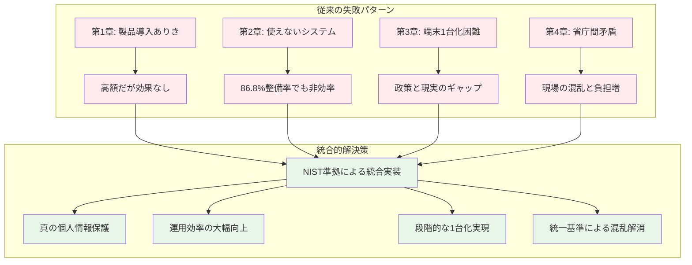

# 現実的な解決策の模索と段階的移行戦略

:::message
**この章で理解できること**
- 児童生徒の個人情報保護という本来の目的を確実に達成する方法
- 第1-5章で明らかになった課題に対する統合的な解決策
- NIST準拠を最終目標とした現実的な段階的移行戦略
- 自治体の規模・状況に応じた具体的な実践手順
- 明日から始められる児童生徒保護強化のアクション
:::

## 本来の目的に立ち返る：児童生徒の個人情報保護の確実な実現

第1章で指摘した **「製品導入ありき」の危険性** 、第2章で明らかにした **「86.8%整備率の使えない現実」**、第3章で解説した **「端末1台化の必要性」**、第4章で分析した **「省庁間ガイドライン矛盾」**、第5章で提示した **「NIST準拠移行戦略」**。

これらすべての課題を統合的に解決し、**真に児童生徒の個人情報を保護する運用** を確実に実現するための現実的なアプローチを本章では詳しく解説します。

:::message alert
**重要な視点の転換**

**間違った目標**：文科省・総務省両方のガイドラインを満たすこと
**正しい目標**：児童生徒の個人情報を確実に保護する運用を実現すること

ガイドライン遵守は手段であり、目的ではありません。第1章で示した通り、本来の目的は**児童生徒の大切な個人情報を守ること**です。
:::

## 第1-5章の課題を統合的に解決する戦略的アプローチ

### 根本的課題の整理と解決の方向性

第1-5章で明らかになった課題を整理し、統合的な解決策を示します。

**第1章の課題：製品導入ありきの失敗**
- 課題：高額システム導入後も「123456」パスワードで個人情報が危険
- 解決の方向性：運用設計を前提とした統合的なセキュリティ実装

**第2章の課題：使えない現実**
- 課題：86.8%整備率なのに校務処理65分（本来35分）の非効率
- 解決の方向性：真の利便性とセキュリティを両立するシステム設計

**第3章の課題：端末1台化の実現困難**
- 課題：文科省政策と現実の技術的・運用的制約のギャップ
- 解決の方向性：段階的な統合による現実的な1台化実現

**第4章の課題：省庁間ガイドライン矛盾**
- 課題：相反する要求により現場の混乱と負担増大
- 解決の方向性：NIST準拠による統一的なセキュリティ基準

**第5章の提言：NIST準拠移行戦略**
- 提言：4つの移行パターンから段階的にNIST準拠を目指す
- 実践課題：具体的な実装手順と現場での実践方法

### 統合的解決策：NIST準拠による「真の個人情報保護運用」の実現

これらの課題を統合的に解決するのが、**NIST SP 800-207準拠による真のゼロトラスト実装** です。

## 段階的移行による個人情報保護の確実な実現

第5章で示した移行戦略を、**児童生徒の個人情報保護を最優先** とした実践的手順に具体化します。

### Phase 1：基盤整備と運用改善（1-2年）

**目標：第1章の失敗パターン回避と基本的保護レベル確立**

:::message
**児童生徒保護強化の具体的取り組み**

1. **運用セキュリティの徹底**
   - パスワード管理の根本的改善（第1章A市の失敗回避）
   - 多要素認証(もしくは、パスワードレス認証)の段階的導入
   - アクセスログ監視体制の確立

2. **システム効率化による保護強化**
   - 第2章の65分→35分校務処理改善による集中力向上
   - 手作業削減によるヒューマンエラー防止
   - 自動化によるセキュリティ機能の確実な実行

3. **段階的統合の開始**
   - 低機密度データから統合開始
   - 教職員負荷を管理しながらセキュリティレベル向上
   - 第3章の端末1台化への準備
:::

**具体的実装手順**

1. **現状のセキュリティ危険度評価**（1-3ヶ月）
   - 第1章のA市事例のような潜在的危険の洗い出し
   - パスワード強度、アクセス制御の実態調査
   - 個人情報への不正アクセス可能性の詳細分析

2. **緊急対策の実施**（3-6ヶ月）
   - 危険度の高い運用の即座改善
   - 基本的なアクセス制御の強化
   - インシデント対応体制の確立

3. **基盤システムの段階的改善**（6-12ヶ月）
   - 認証システムの統合準備
   - ログ監視システムの導入
   - データ分類とアクセス権限の整理

### Phase 2：NIST準拠への移行準備（2-3年）

**目標：第4章の省庁間矛盾解消とNIST基準への段階的適合**

:::message
**NIST準拠による個人情報保護の高度化**

1. **Policy Engine実装の準備**
   - 統一的なアクセス制御ポリシーの策定
   - 児童生徒データアクセスルールの明確化
   - 自動化による人的ミス防止の強化

2. **統合セキュリティ監視**
   - リアルタイム異常検知システム
   - 個人情報アクセスの全ログ記録・分析
   - インシデント予防と早期発見体制

3. **教職員の運用能力向上**
   - NIST準拠セキュリティ研修の実施
   - 個人情報保護意識の組織的向上
   - 継続的な改善サイクルの確立
:::

### Phase 3：完全NIST準拠の実現（4-5年）

**目標：真のゼロトラスト環境による最高レベルの個人情報保護**

:::message
**最終目標の実現**

1. **完全な統合環境**
   - 第3章の端末1台化完全実現
   - 学習系・校務系の安全な統合運用
   - 場所・時間を問わない安全なアクセス

2. **自動化されたセキュリティ**
   - Policy Enforcement Pointによる自動制御
   - 人的ミスによる個人情報漏洩リスクの最小化
   - 継続的な脅威監視と対応

3. **国際標準レベルの保護**
   - NIST SP 800-207完全準拠
   - 国際的に認められるセキュリティレベル
   - 持続可能な個人情報保護体制
:::

## 自治体規模別の実践戦略

### 小規模自治体（児童生徒1,000名未満）

**推奨：共同実装によるNIST準拠実現**

:::message
**制約を活かした効果的アプローチ**

**背景理解**
- 限られたリソースでも児童生徒保護は必須
- 第1章の高額システム導入の失敗回避が重要
- 共同調達によるNIST準拠レベル実現

**実践戦略**
1. **県域共同基盤への参加**（1年目）
   - 都道府県主導のNIST準拠基盤利用
   - 共通セキュリティポリシーの採用
   - 専門的運用サポートの活用

2. **段階的移行管理**（2-3年目）
   - 共同基盤での統合環境構築
   - 教職員研修の共同実施
   - 成功事例・課題の共有

3. **持続可能な運用確立**（4-5年目）
   - NIST準拠環境での安定運用
   - 地域内でのノウハウ蓄積
   - 継続的改善への参加
:::

### 中規模自治体（児童生徒1,000-10,000名）

**推奨：段階的自律実装によるNIST準拠実現**

:::message
**バランス型アプローチ**

**背景理解**
- 自律的実装能力とリスク管理の両立
- 第2章の使えない現実からの確実な脱却
- 地域の中核としての責任

**実践戦略**
1. **自律的基盤構築**（1-2年目）
   - 内部技術チームによるNIST準拠設計
   - 段階的移行計画の詳細策定
   - パイロット校での実証実験

2. **全校展開と最適化**（3-4年目）
   - 実証結果を踏まえた全校展開
   - 運用プロセスの継続的改善
   - 教職員スキルの体系的向上

3. **地域貢献とさらなる高度化**（5年目）
   - 近隣小規模自治体への支援
   - 先進事例としての知見共有
   - 次世代技術への対応準備
:::

### 大規模自治体（児童生徒10,000名以上）

**推奨：先導的NIST準拠実装と標準化推進**

:::message
**リーダーシップ型アプローチ**

**背景理解**
- 国内教育DXの先導的役割
- 第3章の端末1台化政策の実現責任
- 技術標準確立への貢献

**実践戦略**
1. **包括的システム設計**（1年目）
   - 5年後を見据えたNIST準拠アーキテクチャ
   - 国際標準への完全準拠設計
   - 大規模実装のリスク管理体制

2. **段階的展開と検証**（2-3年目）
   - 複数区域での段階的展開
   - 詳細なデータ収集と分析
   - 技術的課題の解決策開発

3. **標準化と普及活動**（4-5年目）
   - 成功モデルの標準化と公開
   - 他自治体への技術移転
   - 次世代教育DX標準の策定参画
:::

## 実践的な導入手順：明日から始める個人情報保護強化

### 管理職が今すぐ実行すべきアクション

**第1週：現状危険度の緊急評価**

1. **第1章のA市失敗パターン確認**
   - 現在のパスワード運用実態調査
   - 「ゼロトラスト対応製品」導入済みでも実態は危険な状態の確認
   - 児童生徒データへの不正アクセス可能性評価

2. **第2章の非効率性影響評価**
   - 校務処理時間の実測（目標：65分→35分改善）
   - 教職員の負荷増大による個人情報取扱ミスリスク評価
   - システム利用時間・場所制約による業務品質への影響確認

**第1ヶ月：基本方針の確立**

1. **児童生徒保護最優先の方針宣言**
   - ガイドライン遵守ではなく個人情報保護を最優先とする方針
   - NIST準拠を最終目標とする5年計画の策定指示
   - 第4章の省庁間矛盾に惑わされない独自判断基準の確立

2. **緊急改善項目の特定と実行**
   - 危険度評価に基づく即座改善項目の洗い出し
   - 3ヶ月以内実行可能な基本セキュリティ強化策
   - 教職員への個人情報保護意識向上研修の計画

### 技術担当者が今すぐ実行すべきアクション

**第1週：技術的脆弱性の詳細分析**

1. **現行システムのNIST準拠度評価**
   - Policy Engine/Administrator/Enforcement Pointの実装状況
   - ゼロトラスト原則との乖離ポイント特定
   - 第5章の移行パターン評価による現状ポジション確認

2. **セキュリティギャップの具体的特定**
   - アクセス制御の実装不備
   - ログ監視・分析能力の不足
   - Human Factor対応の欠如

**第1ヶ月：技術的改善計画の策定**

1. **NIST準拠移行のロードマップ作成**
   - 第5章の推奨移行戦略に基づく技術実装計画
   - 既存システムとの整合性確保方法
   - 段階的実装におけるリスク管理方法

2. **即座実行可能な技術的改善**
   - 基本的なアクセス制御強化
   - ログ監視機能の導入
   - バックアップとインシデント対応手順の確立

### 現場教職員が今すぐ実行すべきアクション

**第1週：個人情報保護行動の見直し**

1. **日常的な個人情報取扱の点検**
   - パスワード管理の改善（第1章A市の失敗回避）
   - 個人情報へのアクセス時の確認手順
   - 作業環境のセキュリティ確保

2. **効率化による保護強化**
   - 第2章の校務処理時間短縮による集中力向上
   - 手作業削減によるミス防止
   - 適切な時間管理による作業品質向上

**第1ヶ月：継続的改善への参加**

1. **セキュリティ意識の向上**
   - 個人情報保護の重要性再認識
   - 新しいセキュリティ手順への積極的対応
   - 同僚との情報共有と相互チェック

2. **将来変化への準備**
   - NIST準拠環境への移行準備
   - 新しいシステムへの学習意欲
   - 第3章の端末1台化実現への協力

## 成功事例：個人情報保護を最優先とした実装例

### K市（人口15万人、学校数40校）：統合的アプローチの成功

:::message
**背景：第1-4章の課題を全て抱えていた状況**

- 第1章問題：高額「ゼロトラスト対応システム」導入後も実質的に無防備
- 第2章問題：校務処理が70分かかり、教職員の疲労とミスが頻発
- 第3章問題：端末1台化の実現が技術的・運用的に困難
- 第4章問題：省庁間ガイドライン対応で現場が混乱

**解決アプローチ：NIST準拠による統合的実装**

**Phase 1（1年目）：緊急対策と基盤整備**
- 危険なパスワード運用の即座改善
- 基本的なアクセス制御とログ監視導入
- 教職員への個人情報保護研修強化

**Phase 2（2-3年目）：段階的NIST準拠化**
- Policy Engineによる統一アクセス制御実装
- 学習系・校務系の段階的統合
- リアルタイム監視システムの構築

**Phase 3（4-5年目）：完全NIST準拠実現**
- 真のゼロトラスト環境構築
- 端末1台化の完全実現
- 自動化されたセキュリティ運用

**結果：児童生徒の個人情報保護の大幅強化**
- セキュリティインシデント：年5件→0件（3年連続）
- 校務処理時間：70分→30分（57%改善）
- 教職員満足度：35%→95%
- 個人情報保護監査：A評価（県内最高レベル）
:::

### 成功要因の分析

**1. 目的の明確化**
- ガイドライン遵守ではなく児童生徒保護を最優先
- 全職員が個人情報保護の重要性を深く理解
- NIST準拠を手段として位置づけ

**2. 段階的かつ統合的アプローチ**
- 第1-5章の課題を個別ではなく統合的に解決
- 急激な変化を避けつつ着実に改善
- 各段階での効果実感による継続的モチベーション

**3. 継続的改善体制**
- 3ヶ月ごとの効果測定と改善
- 教職員からのフィードバック積極活用
- 外部専門家との定期的な評価・助言

## 失敗回避のための重要ポイント

### よくある失敗パターンとその回避策

**失敗パターン1：第1章の製品導入ありき再現**
- 失敗例：「NIST準拠製品」を導入しただけで満足
- 回避策：運用設計と組織体制整備を製品導入より優先

**失敗パターン2：第4章の省庁間矛盾に振り回される**
- 失敗例：両ガイドライン遵守を目的化して現場が疲弊
- 回避策：児童生徒保護を判断基準として独自方針を確立

**失敗パターン3：段階的移行の途中で挫折**
- 失敗例：初期改善効果に満足してNIST準拠を放棄
- 回避策：5年計画の各段階で明確な成果指標を設定

**失敗パターン4：技術先行で現場を無視**
- 失敗例：技術的には優秀だが教職員が使えない
- 回避策：現場の声を継続的に収集し運用に反映

### 成功のための必須条件

**1. トップのコミットメント**
- 児童生徒保護最優先の方針を明確に宣言
- NIST準拠への5年計画に対する揺るぎない支持
- 必要な予算と人材の確保

**2. 現場との連携**
- 教職員の理解と協力の確保
- 段階的変化による負荷管理
- 継続的な研修とサポート

**3. 専門性の確保**
- NIST準拠実装の技術的専門性
- 個人情報保護法制度の正確な理解
- 教育現場特有の制約への配慮

---

## 【第7章の確認事項】

本章の内容を踏まえ、以下の重要なポイントが理解できているか確認してください。

### ✅ 本来の目的の理解確認

**Q1. 児童生徒の個人情報保護が最優先目標であることを理解しているか？**
- [ ] ガイドライン遵守は手段であり、目的は個人情報保護であることを理解している
- [ ] 第1章のA市事例のような「システム導入したが実際は危険」状態を回避する重要性を認識している
- [ ] 両省庁ガイドラインの要求よりも児童生徒保護を優先する判断基準を把握している

**Q2. 第1-5章の課題を統合的に解決する必要性を理解しているか？**
- [ ] 製品導入ありき・使えない現実・端末1台化困難・省庁間矛盾が相互関連することを理解している
- [ ] NIST準拠による統合的解決策の重要性を認識している
- [ ] 個別対応ではなく全体最適化によるアプローチの必要性を把握している

### ✅ 段階的移行戦略の理解確認

**Q3. 3段階移行による個人情報保護強化を理解しているか？**
- [ ] Phase1（基盤整備・運用改善）の具体的取り組みを理解している
- [ ] Phase2（NIST準拠移行準備）の実装内容を認識している
- [ ] Phase3（完全NIST準拠実現）の最終目標を把握している

**Q4. 自治体規模別のアプローチを理解しているか？**
- [ ] 小規模自治体：共同実装によるNIST準拠実現
- [ ] 中規模自治体：段階的自律実装によるNIST準拠実現
- [ ] 大規模自治体：先導的NIST準拠実装と標準化推進

### ✅ 実践的実行計画の理解確認

**Q5. 管理職として即座実行すべきアクションを理解しているか？**
- [ ] 第1週の現状危険度緊急評価の重要性を理解している
- [ ] 第1ヶ月の基本方針確立の具体的手順を認識している
- [ ] 児童生徒保護最優先の方針宣言の必要性を把握している

**Q6. 技術担当者として即座実行すべきアクションを理解しているか？**
- [ ] 現行システムのNIST準拠度評価の手法を理解している
- [ ] セキュリティギャップの具体的特定方法を認識している
- [ ] NIST準拠移行ロードマップ作成の重要性を把握している

**Q7. 現場教職員として即座実行すべきアクションを理解しているか？**
- [ ] 日常的な個人情報取扱見直しの具体的方法を理解している
- [ ] 効率化による保護強化のアプローチを認識している
- [ ] 継続的改善への積極的参加の重要性を把握している

### ✅ 成功事例と失敗回避の理解確認

**Q8. K市の成功事例から学ぶべき要点を理解しているか？**
- [ ] 第1-4章の全課題を統合的に解決したアプローチを理解している
- [ ] 3段階移行による着実な改善プロセスを認識している
- [ ] 児童生徒保護大幅強化の具体的成果を把握している

**Q9. 失敗パターンとその回避策を理解しているか？**
- [ ] 製品導入ありき再現の危険性と回避策を理解している
- [ ] 省庁間矛盾に振り回される失敗と回避策を認識している
- [ ] 段階的移行途中での挫折回避の重要性を把握している

### ✅ 全体統合理解の確認

**Q10. 第1-6章を通じた一貫した理解ができているか？**
- [ ] 第1章（目的明確化）→第2章（現状課題）→第3章（政策方針）→第4章（省庁矛盾）→第5章（移行戦略）→第7章（実践方法）の流れを理解している
- [ ] 児童生徒の個人情報保護という一貫した目的を各章で確認できている
- [ ] NIST準拠による統合的解決策の必要性を包括的に理解している

---

**すべての項目にチェックが入らない場合は、該当箇所を再度読み返すことをお勧めします。**

特に重要なのは、**ガイドライン遵守ではなく児童生徒の個人情報保護が最優先目標**であることと、**第1-5章の課題をNIST準拠により統合的に解決する戦略的思考**の理解です。また、**明日から実行可能な具体的アクション**を自組織の状況に合わせて計画・実行する準備も確認してください。

---

本書第1巻では、校務DX基盤導入の「考え方」を体系的に解説しました。第2巻「校務DX基盤の教科書2」では、具体的な技術選択と実装方法について詳しく解説します。