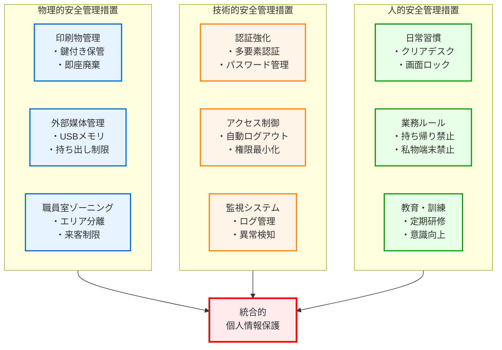
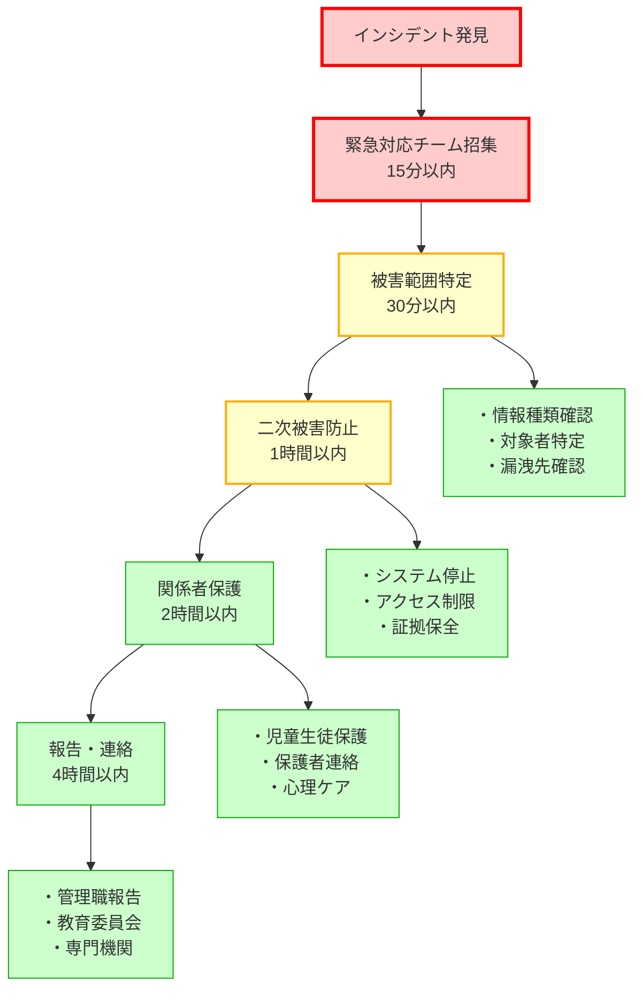

教育現場における個人情報保護は、単なる法令遵守やガイドライン準拠の問題ではありません。それは、児童生徒一人ひとりの尊厳を守り、安心して学べる環境を保障するための最も基本的な責務です。本章では、児童生徒の個人情報を確実に保護するための運用設計について、実践的な観点から詳しく解説します。

# 現実を直視する：年間200件以上発生するセキュリティインシデントの実態

日本の小中学校では、毎年約200件以上のセキュリティインシデントが発生しており、その約70%がヒューマンエラーによるものです。これは、技術的対策だけでは個人情報を守れないことを明確に示しています。本章では、実際のインシデント事例から学び、児童生徒の個人情報を確実に保護するための実践的な運用設計について詳しく解説します。

## 実際のインシデント事例が示す深刻な現実

近年発生した主要なインシデントを見ると、以下のような深刻な被害が発生しています。

**ランサムウェア攻撃による大規模被害**
- 全校の校務データが暗号化され、授業・成績処理が完全停止
- 復旧まで数週間を要し、卒業式や入試業務に重大な影響
- 身代金要求と同時に、個人情報の流出脅迫

**メール誤送信による個人情報流出**
- 成績一覧を誤って全保護者に送信
- 児童の健康情報を無関係な第三者に誤送信
- 特別支援に関する配慮情報の外部流出

**USBメモリ紛失・盗難**
- 自家用車から校務データ入りUSBメモリが盗難
- 暗号化されていないUSBから全校児童の個人情報が流出

**クラウド設定ミスによる情報漏洩**
- パブリッククラウドの設定不備により、インターネット上に個人情報が公開
- アクセス権限設定の誤りで、権限のない教職員が機密情報にアクセス可能な状態

**パスワードスプレー攻撃による不正アクセス**
- 簡単なパスワードを設定していた教職員アカウントが不正アクセスされる
- 攻撃者が数日間にわたって全校児童の個人情報を不正収集
- 発覺が遅れたため、数百人分の情報が流出し、全保護者への個別連絡が必要に

これらの事例から明らかなことは、**技術的対策と運用的対策の両方が適切に実装されて初めて、児童生徒の個人情報が保護される**ということです。

**情報ライフサイクルと保護策：**

| 段階 | 保護策 |
|------|------|
| 収集 | 保護者同意、目的明示、最小限収集 |
| 入力 | アクセス制御、入力検証、暗号化 |
| 保存 | バックアップ、冗長化、アクセスログ |
| 利用 | 権限確認、用途制限、監査証跡 |
| 送信 | 暗号化通信、送信先確認、配送確認 |
| 廃棄 | 完全削除、物理破壊、廃棄証明 |

# 校務システムで扱う個人情報の種類とリスク評価

## 学校が保有する児童生徒の個人情報の全体像

学校という場所は、児童生徒の成長を支援するために、実に多様な個人情報を取り扱います。これらの情報は、教育活動に不可欠である一方、適切に管理されなければ児童生徒に深刻な被害をもたらす可能性があります。

### 基本情報
最も基礎的な情報として、氏名、生年月日、住所、保護者連絡先があります。これらは一見すると「誰でも知っている情報」のように思えるかもしれませんが、デジタル化された環境では、これらの情報が悪用されるリスクは格段に高まります。例えば、住所情報が漏洩すれば、不審者による付きまといや、詐欺の標的になる可能性があります。

### 学習情報
成績、評価、学習記録、テスト結果などの学習情報は、児童生徒の学力や努力の結果を示す重要なデータです。これらの情報が不適切に扱われれば、児童生徒間での優劣意識を助長し、いじめの原因となったり、進学や就職に悪影響を及ぼしたりする可能性があります。

### 健康情報
健康診断結果、アレルギー情報、既往歴、服薬情報などの健康情報は、極めてセンシティブな個人情報です。特にアレルギー情報や持病に関する情報は、適切に管理されなければ児童生徒の生命に関わる事態を引き起こす可能性があります。また、これらの情報が漏洩すれば、偏見や差別の対象となるリスクも高まります。

### 生活情報
出欠記録、生活指導記録、相談記録などは、児童生徒の日常的な学校生活を記録したものです。特に生活指導記録や相談記録には、家庭環境の問題や、児童生徒が抱える悩みなど、極めてプライベートな情報が含まれることがあります。

### 特別な配慮情報
特別支援教育に関する情報、要保護・準要保護児童生徒の情報など、特別な配慮を必要とする児童生徒の情報は、最も慎重な取り扱いが求められます。これらの情報の不適切な管理は、該当する児童生徒への深刻な差別や偏見を生む可能性があります。

## インシデント事例から見る情報種別ごとのリスク評価

実際のインシデント事例を分析すると、情報の種類によって被害の深刻度が大きく異なることが分かります。

**情報分類別リスクレベル：**

- **最高レベル保護：** 健康情報（アレルギー、既往歴、服薬）、特別配慮情報（特別支援、要保護、家庭環境）
- **厳重管理：** 学習情報（成績、評価、テスト）、生活情報（生活指導、相談、出欠）
- **基本保護：** 基本情報（氏名、住所、連絡先）
    end
    
    classDef critical fill:#ffebeb,stroke:#ff0000,stroke-width:3px
    classDef serious fill:#fff2e6,stroke:#ff8000,stroke-width:2px
    classDef moderate fill:#e6f3ff,stroke:#0066cc,stroke-width:1px
    
    class A1,A2 critical
    class B1,B2 serious
    class C1 moderate
```

## 最高レベルの保護が必要な情報（漏洩時の影響：極めて深刻）
健康情報と特別な配慮情報は、漏洩時の影響が最も深刻であるため、最高レベルの保護が必要です。これらの情報は、以下のような特徴を持ちます。

- **不可逆性**: 一度漏洩すると、その影響を完全に取り消すことができない
- **差別リスク**: 偏見や差別の対象となりやすい
- **長期的影響**: 児童生徒の将来にわたって影響を与える可能性がある

例えば、ある児童が特定の精神疾患の治療を受けているという情報が漏洩した場合、その児童は学校生活だけでなく、進学や就職、さらには結婚など、人生の様々な局面で不利益を被る可能性があります。

## 厳重管理が必要な情報（漏洩時の影響：深刻）
成績・評価情報は、児童生徒の進路に直接影響するため、厳重な管理が必要です。特に以下の点に注意が必要です。

- **比較可能性**: 他の児童生徒と容易に比較されやすい
- **進路影響**: 受験や就職活動に直接的な影響がある
- **心理的影響**: 自己肯定感や学習意欲に大きく影響する

成績情報の不適切な取り扱いは、児童生徒間の競争を過度に煽り、学級の雰囲気を悪化させる原因となります。また、成績が低い児童生徒にとっては、その情報の漏洩が深刻な劣等感やいじめの原因となる可能性があります。

## 基本的保護が必要な情報（漏洩時の影響：中程度）
基本情報は、それ単体では大きなリスクがないように見えますが、以下の理由から適切な保護が必要です。

- **なりすましリスク**: 本人になりすました詐欺や嫌がらせ
- **プライバシー侵害**: 住所や連絡先を使った迷惑行為
- **組み合わせリスク**: 他の情報と組み合わせることで個人が特定される

## 実際のインシデントに学ぶ：情報の組み合わせによるリスク増大

個人情報保護において最も注意すべきは、単体では問題ない情報も、組み合わせることで重大なリスクとなる点です。

### 個人特定のリスク
例えば、「4年2組」「サッカー部」「アレルギーあり」という3つの情報を組み合わせると、該当する児童が1人に絞られる可能性があります。このような形で個人が特定されると、その児童に関する他の情報も芋づる式に結びつけられてしまいます。

### 行動パターンの把握
出欠記録や部活動記録などの時系列データを分析すると、児童生徒の行動パターンが把握できてしまいます。これは、不審者による待ち伏せや、ストーカー行為につながる危険性があります。

### 家族情報との紐付け
兄弟姉妹の情報や保護者の職業情報などと組み合わせることで、家族全体のプロファイリングが可能となり、より深刻なプライバシー侵害につながる可能性があります。

# 実際のインシデント被害から学ぶ：情報漏洩が児童生徒に与える影響

情報漏洩の影響は、多くの大人が想像する以上に深刻で、長期にわたるものです。ここでは、実際に起こりうる被害を時系列で詳しく見ていきます。

### インシデント事例に見る即時的な被害の実態

### いじめ・差別の材料となるリスク
情報漏洩により、成績・家庭環境・健康情報等がいじめや差別の材料となり、児童生徒の自尊心を深く傷つけ、不登校や自傷行為につながる深刻な問題が発生。

### SNSでの拡散による精神的被害
一度漏洩した情報はSNSで瞬時に拡散され、生徒の不登校や転校につながる深刻な事態が発生。デジタル時代特有の拡散力が被害を深刻化。

### 保護者からの信頼失墜
個人情報漏洩により保護者会批判、教育委員会苦情、マスコミ報道、訴訟リスクが発生し、信頼回復は困難。対応に追われ教育活動が阻害される。

### インシデント事例に見る中長期的な影響の深刻さ

### 進学・就職への影響
情報漏洩の影響は、その時点だけに留まりません。特に成績情報や素行に関する情報が漏洩した場合：

- 高校・大学受験時に不利な噂が広まる
- 就職活動時にネット検索で過去の情報が発見される
- 結婚や社会生活にも影響を及ぼす可能性がある

### デジタルタトゥーとしての永続的な被害
ネット上の情報は完全削除が困難で「デジタルタトゥー」として永続的に残存。何年経っても検索で発見され、本人の将来に継続的な影響を与える。

### 将来にわたる不安とトラウマ
情報漏洩の被害を受けた児童生徒は、その後も長期にわたって心理的な影響を受けます。

- 他人を信頼できなくなる
- 常に監視されているような不安感
- 新しい環境でも「バレるのではないか」という恐怖
- 対人関係の構築が困難になる

### インシデント事例から学ぶ二次的・三次的被害の広がり

### 家族全体への影響波及
個人情報漏洩の影響は、本人だけでなく家族全体に及びます。

- 兄弟姉妹も学校でからかわれる
- 保護者の職場での人間関係に影響
- 家族全体が地域社会で孤立する可能性

### 地域社会での信頼関係崩壊
学校は地域社会の中核的な存在です。個人情報漏洩事件が発生すると：

- 地域住民の学校への不信感
- PTAや地域ボランティアの協力低下
- 学校行事への参加者減少

### 学校全体の教育活動への支障
一度でも深刻な情報漏洩事件が起きると、学校全体の雰囲気が変わります。

- 教職員と児童生徒・保護者の間に壁ができる
- 過度に防御的な対応で柔軟な教育活動が困難に
- 教職員のモチベーション低下

# ヒューマンエラー70%の現実に対応：個人情報保護運用体制の構築

年間200件のインシデントの70%がヒューマンエラーによるものである現実を踏まえると、技術的な対策だけでは個人情報保護は実現できません。人的な要因を中心とした、組織全体で取り組む運用体制の構築が不可欠です。

## 個人情報保護責任体制の明確化

### 学校長を頂点とした責任体制
個人情報保護の最終責任は学校長にあります。しかし、すべてを校長一人で管理することは不可能です。そこで、以下のような階層的な責任体制を構築します。

**個人情報保護責任体制：**

| 役割 | 担当者 | 主な責任 |
|------|---------|----------|
| 最終責任者 | 学校長 | 方針決定、重大インシデント対応 |
| 日常管理監督 | 教頭・副校長 | 運用状況監視、研修企画 |
| 保護管理者 | 主幹教諭 | 具体的管理業務、ルール策定 |
| 実務担当 | 学級担任、教科担当、養護教諭、事務職員 | 日常的な情報管理業務 |

**校長の役割**
- 個人情報保護方針の決定と宣言
- 重大インシデント発生時の最終判断
- 教育委員会・保護者への説明責任

**教頭・副校長の役割**
- 日常的な管理監督
- 教職員への指導・研修の企画
- インシデント発生時の初期対応指揮

**個人情報保護管理者（主幹教諭等）の役割**
- 具体的な保護対策の立案・実施
- 定期的な監査・点検の実施
- 教職員からの相談対応

### 各担当者の役割と責任範囲の明確化
すべての教職員が、自分の責任範囲を明確に理解することが重要です。

**学級担任の責任**
- 担当クラスの児童生徒情報の適切な管理
- 保護者との連絡における情報管理
- 日常的な情報取扱いルールの遵守

**教科担当の責任**
- 担当教科の成績情報の厳格な管理
- 他クラスの情報への不必要なアクセス禁止
- 成績処理期間中の特別な注意

**養護教諭の責任**
- 健康情報の最高レベルでの管理
- 必要最小限の情報共有の徹底
- 緊急時対応と通常時管理の切り分け

**事務職員の責任**
- システム全体の技術的管理
- アクセスログの定期的確認
- 外部との情報やり取りの管理

## クラウド設定ミス防止のためのアクセス権限最小化

実際のインシデントで「アクセス権限設定の誤りで、権限のない教職員が機密情報にアクセス可能な状態」が発生しています。「必要な人が、必要な時に、必要な情報のみにアクセスできる」という原則の徹底が急務です。

### 役割に基づくアクセス制御
教職員の役割に応じて、アクセスできる情報を厳格に制限します。

**担任のアクセス権限**
- 自分のクラスの全情報：フルアクセス
- 前年度担任クラス：参照のみ（1年間限定）
- 他クラス：原則アクセス不可

**教科担当のアクセス権限**
- 担当教科の成績情報：編集可能
- 担当生徒の基本情報：参照のみ
- 健康情報等：原則アクセス不可

**管理職のアクセス権限**
- 全校生徒の情報：参照可能
- 編集権限：承認ベースで付与
- アクセスログ：常時監視可能

### 時限的アクセス権限の管理
特定の時期だけ必要となるアクセス権限は、期間を限定して付与します。

**成績処理期間**
- 期間：学期末の2週間のみ
- 対象：成績入力・修正権限
- 期間終了後：自動的に権限失効

**健康診断期間**
- 期間：健診実施前後1ヶ月
- 対象：健康情報の入力・更新権限
- 通常時：参照のみに制限

**進路指導期間**
- 期間：3年生の9月〜3月
- 対象：進路関連情報へのアクセス
- 卒業後：即座にアクセス権限削除

### 臨時的アクセスの厳格な管理
緊急時や特別な事情でのアクセスは、以下のプロセスで管理します。

1. **申請と承認**
   - 書面またはシステム上での申請
   - 管理職による承認
   - アクセス理由の明記

2. **アクセスの記録**
   - いつ、誰が、何の情報にアクセスしたか
   - アクセスの目的と結果
   - 承認者の記録

3. **事後確認**
   - アクセスの妥当性確認
   - 不要になった時点での権限削除
   - 定期的な棚卸し

## メール誤送信防止のための情報取扱いルール明文化

実際のインシデントで最も多いのがメール誤送信です。「成績一覧を誤って全保護者に送信」「児童の健康情報を無関係な第三者に誤送信」など、曖昧なルールが原因です。具体的で実行可能なルールの明文化が不可欠です。

### 情報のライフサイクル管理

**閲覧時のルール**
- 必ず業務目的であることを確認
- 他人に見られない環境で閲覧
- 閲覧後は必ずログアウト

**編集時のルール**
- 編集前にデータのバックアップ
- 編集理由の記録
- 編集後の確認手順

**印刷時のルール**
- 印刷の必要性を事前確認
- 印刷枚数の最小化
- 印刷物への通し番号付与

**保管時のルール**
- 施錠可能な場所での保管
- 保管場所の限定と明示
- 定期的な棚卸し実施

**廃棄時のルール**
- シュレッダーでの確実な裁断
- 廃棄記録の作成
- 複数人での廃棄確認

### 場所に応じた取扱い基準

**職員室内**
- 会話での個人情報は最小限に
- 離席時は必ず画面ロック
- 書類は裏返して置く

**教室内**
- 個人情報を含む資料は持ち込まない
- やむを得ない場合は常に手元管理
- 児童生徒の目に触れない配慮

**校外（自宅等）**
- 原則として持ち出し禁止
- やむを得ない場合は管理職承認
- 暗号化した電子データのみ許可

### 例外処理の承認プロセス
原則を守れない特別な事情がある場合の手順：

1. **事前承認の原則**
   - 可能な限り事前に申請
   - 代替案の検討
   - リスク評価の実施

2. **緊急時の事後承認**
   - 24時間以内の報告義務
   - 詳細な経緯説明
   - 再発防止策の提出

3. **承認の記録化**
   - すべての例外処理を記録
   - 定期的な見直し
   - 改善点の抽出

# 日常的な情報取扱いにおける安全管理措置

個人情報保護は、高度な技術よりも日常的な注意の積み重ねが重要です。ここでは、物理的・技術的・人的の3つの側面から安全管理措置を解説します。



## 物理的安全管理措置

### 印刷物の管理
デジタル化が進んでも、学校では依然として多くの印刷物を扱います。これらの管理は極めて重要です。

**印刷前の確認事項**
- 本当に印刷が必要か？（画面表示で代替できないか）
- 印刷する情報は最小限か？（不要な情報は含まれていないか）
- 印刷枚数は適切か？（必要最小限の枚数か）

**印刷物の取扱い**
- 印刷直後に内容確認（誤印刷の即時発見）
- 通し番号の付与（枚数管理の徹底）
- 配布先の記録（追跡可能性の確保）

**保管方法**
- 施錠可能なキャビネットでの保管
- 保管場所の一覧表作成
- 定期的な所在確認（月1回以上）

**廃棄手順**
- 保存期限の明確化
- シュレッダー処理の徹底（手で破るのは禁止）
- 廃棄証明の記録化

### 外部記憶媒体の管理
USBメモリなどの外部記憶媒体は、原則として使用を禁止します。やむを得ず使用する場合は：

**管理番号付き媒体のみ使用**
- 学校が購入・管理する媒体のみ
- 個人所有の媒体は一切禁止
- 暗号化機能付きのものを選定

**使用時の手順**
1. 使用申請書の提出
2. 管理者からの貸出
3. 使用目的の限定
4. 使用後の即時返却
5. データ消去の確認

**紛失防止策**
- ストラップでの身体装着
- 使用場所の限定
- 複数人での確認

### 職員室のゾーニング
職員室を機能別にゾーン分けし、情報管理を徹底します。

**一般ゾーン**
- 通常の事務作業エリア
- 個人情報を扱わない業務
- 来客対応も可能

**情報管理ゾーン**
- 成績処理等を行うエリア
- 外部から見えない配置
- 関係者以外立入制限

**保管ゾーン**
- 重要書類の保管エリア
- 施錠管理の徹底
- 入室記録の作成

# 技術的安全管理措置

### パスワードスプレー攻撃対策の強化

実際のインシデントで「簡単なパスワードを設定していた教職員アカウントが不正アクセスされる」事例が発生しています。パスワードスプレー攻撃は、攻撃者がよく使われるパスワードを大量のアカウントに対して試す攻撃手法で、学校では特に注意が必要です。

**強固なパスワードポリシーの実装**
- 最低12文字以上（推奨14文字以上）
- 英大文字・英小文字・数字・記号の組み合わせ
- 辞書に載っている単語の使用禁止
- 生年月日や電話番号などの個人情報使用禁止

**多要素認証（MFA）の導入**
- パスワードに加えてSMS認証や認証アプリを併用
- 管理者アカウントでは必ず実装
- 機密情報アクセス時の追加認証

**アカウントロックアウト機能**
- 5回連続失敗で自動ロック（30分間）
- 異常なログインパターンの自動検知
- 管理者への即時通知機能

### 自動ログアウト設定
離席時の情報漏洩を防ぐため、自動ログアウトを設定します。

**推奨設定**
- 操作なし5分でスクリーンセーバー起動
- 操作なし10分で自動ログアウト
- 再ログイン時は必ずパスワード入力

**運用上の工夫**
- 長時間作業時は定期的に保存
- 離席時は手動ロックの習慣化
- ショートカットキーの活用推奨

### 画面の覗き見防止
物理的・技術的両面から覗き見を防止します。

**物理的対策**
- プライバシーフィルターの装着
- モニターの配置角度調整
- パーティションの設置

**技術的対策**
- 画面の自動暗転機能
- マウスオーバーでの情報表示
- 必要時のみの詳細表示

**運用的対策**
- 背後を壁にした席配置
- 来客時の画面切替徹底
- 清掃時間中の電源OFF

## パスワードスプレー攻撃早期発知のためのログ管理強化

パスワードスプレー攻撃の事例では「発覺が遅れたため、数百人分の情報が流出」しました。早期発知と対応が極めて重要です。

**重点的に記録すべき項目（パスワードスプレー攻撃対応）**
- ログイン失敗回数とパターン（特に短時間での連続失敗）
- 従来と異なる時間帯や端末からのアクセス
- 同一IPアドレスからの複数アカウントへのアクセス試行
- 通常と異なる大量データアクセスパターン
- ログイン成功後の即座パスワード変更

**基本的な記録項目**
- ログイン・ログアウト時刻
- アクセスしたデータ
- 実行した操作内容
- 印刷・ダウンロード履歴

**ログの確認頻度**
- 日次：異常アクセスの有無
- 週次：アクセスパターンの確認
- 月次：全体的な分析と改善

**パスワードスプレー攻撃疑い時の緒急対応手順**
1. **即座対応（発知から30分以内）**
   - 該当アカウントの一時停止
   - 関連アカウントのパスワード強制変更
   - 攻撃元IPアドレスのブロック

2. **被害範囲の特定（発知から1時間以内）**
   - アクセスされたデータの特定
   - 漏洩した可能性のある情報の範囲確定
   - 影響を受ける児童生徒の特定

3. **通常の異常検知時対応**
   - 該当者への確認
   - 正当な理由の確認
   - 必要に応じた指導
   - 重大事案は即座に報告

# 人的安全管理措置

## クリアデスク・クリアスクリーンの徹底
机上と画面の情報管理は、最も基本的かつ重要な対策です。

**クリアデスクの実践**
- 業務終了時：すべての書類を片付ける
- 離席時：機密書類は引き出しへ
- 会議時：必要な資料のみ持参

**クリアスクリーンの実践**
- 離席時：必ず画面ロック
- 業務終了時：ログアウト確認
- 来客対応時：画面切替

**習慣化のコツ**
- チェックリストの活用
- 相互確認の実施
- 良い実践の表彰

## USBメモリ紛失・盗難防止のための情報持ち帰り禁止
実際のインシデントで「自家用車から校務データ入りUSBメモリが盗難」「暗号化されていないUSBから全校児童の個人情報が流出」などの事例が多発しています。個人情報を含む業務は、原則として学校内で完結させることが急務です。

**禁止の理由（実際のインシデント事例より）**
- 通勤途中でのUSBメモリ紛失・盗難
- 自宅PCのマルウェア感染リスク
- 家族による個人情報の偶発的閲覧

**代替手段の提供（インシデント防止の観点から）**
- クラウドアクセスによる学校内業務環境の整備
- リモートアクセス時の厳格な認証管理
- USBメモリ使用禁止を前提とした業務フロー再設計

**例外対応**
やむを得ず持ち帰る場合：
1. 管理職の事前承認
2. 最小限の情報に限定
3. 暗号化必須
4. 翌日朝一での報告

## 私物端末での業務禁止
個人所有のパソコンやスマートフォンでの校務処理は、セキュリティリスクが高いため禁止します。

**禁止の理由**
- ウイルス感染リスク
- 家族との共用による漏洩
- 適切な廃棄の困難性

**緊急時の対応**
- 学校支給端末の持ち帰り
- リモートアクセス環境の活用
- 最悪でも暗号化通信のみ

# インシデント発生時の児童生徒保護対策

どんなに注意していても、インシデントが発生する可能性はゼロにはなりません。重要なのは、発生時にいかに迅速かつ適切に対応し、児童生徒への被害を最小限に抑えるかです。

## 初動対応（ゴールデンタイム対応）

インシデント発生から最初の数時間（ゴールデンタイム）の対応が、その後の被害の大きさを左右します。



## 被害範囲の迅速な特定
インシデントを認知したら、まず以下を即座に確認します。

**確認事項チェックリスト（パスワードスプレー攻撃対応含む）**
□ 何の情報が漏洩したか（情報の種類と内容）
□ 誰の情報が漏洩したか（対象者の特定）
□ どの程度漏洩したか（人数と情報量）
□ どこに漏洩したか（漏洩先の特定）
□ いつ漏洩したか（発生時期の特定）
□ 不正アクセスの継続期間（パスワードスプレー攻撃の場合）
□ 攻撃者がアクセスした可能性のあるシステム範囲

**調査の手順**
1. システムログの即時確認
2. 関係者への聞き取り
3. 物理的証拠の保全
4. 時系列での事実整理

## 二次被害防止の即時対応
被害の拡大を防ぐため、以下の対応を並行して実施します。

**技術的対応**
- 該当システムの一時停止
- アクセス権限の緊急変更
- 外部公開情報の即時削除
- パスワードの強制変更

**物理的対応**
- 紙媒体の回収
- 関連資料の隔離
- 現場の保全

**人的対応**
- 関係者への情報統制
- 不用意な発言の禁止
- 情報集約体制の確立

## 関係児童生徒の特定と保護
被害を受ける可能性のある児童生徒を特定し、即座に保護措置を講じます。

**特定作業**
- 漏洩情報に含まれる児童生徒のリスト化
- 影響度による優先順位付け
- 保護者連絡先の確認

**保護措置**
- 該当児童生徒への個別説明
- 心理的ケアの準備
- 安全確保の措置

## 保護者への説明と対応

保護者への対応は、誠実さと迅速さが求められます。

## 事実関係の正確な説明
保護者に対しては、判明している事実を正確に伝えます。

**説明すべき内容**
- 何が起きたのか（事実のみ）
- お子様への影響（現時点で判明していること）
- 学校の対応状況（実施中・予定の対策）
- 今後の連絡方法（窓口と頻度）

**説明の方法**
- 緊急性に応じた連絡手段の選択
  - 最重要：個別訪問または来校要請
  - 重要：電話連絡後、文書送付
  - 通常：一斉メールと個別相談対応

**説明時の注意点**
- 推測や憶測は避ける
- 「調査中」の事項は明確に区別
- 質問には誠実に対応
- 記録を必ず残す

## 今後の対策と再発防止策の提示
保護者の不安を軽減するため、具体的な対策を提示します。

**即時的対策**
- 被害拡大防止の具体的措置
- 該当児童生徒への個別対応
- 臨時のセキュリティ強化

**短期的対策（1ヶ月以内）**
- 原因究明の完了予定
- システム面での改善
- 運用ルールの見直し

**長期的対策（1年以内）**
- 抜本的なシステム改修
- 職員研修の強化
- 定期的な監査実施

## 継続的なフォローアップ
初期対応後も、継続的なフォローアップが重要です。

**定期報告**
- 週次：対応進捗の報告
- 月次：改善状況の報告
- 学期毎：全体的な総括

**個別相談**
- 随時相談窓口の設置
- 担当者の明確化
- 相談記録の管理

**心理的ケア**
- スクールカウンセラーの活用
- 必要に応じた外部機関紹介
- 長期的な見守り体制

## 児童生徒への心理的ケア

情報漏洩の被害を受けた児童生徒は、大人が想像する以上に深い心の傷を負います。適切な心理的ケアが不可欠です。

## スクールカウンセラーとの連携
専門的な心理的支援を提供するため、スクールカウンセラーと密接に連携します。

**連携の内容**
- 被害状況の共有（守秘義務の範囲内）
- カウンセリングの優先的実施
- 継続的な状態観察

**支援の方法**
- 個別カウンセリング
- グループカウンセリング（同様の被害者がいる場合）
- 保護者を含めた家族カウンセリング

## 長期的な見守り体制
心理的影響は長期に及ぶため、継続的な見守りが必要です。

**学級担任の役割**
- 日常的な観察と声かけ
- 小さな変化の記録
- 専門家への迅速な連携

**養護教諭の役割**
- 体調面での継続的観察
- 保健室での居場所提供
- 心身の不調への対応

**全教職員での見守り**
- 情報共有体制の確立
- 複数の目での観察
- 温かい雰囲気づくり

## 必要に応じた外部専門機関との連携
学校だけでは対応が困難な場合、外部の専門機関と連携します。

**連携先の例**
- 児童相談所（深刻な心理的影響がある場合）
- 医療機関（専門的治療が必要な場合）
- 警察（犯罪性がある場合）
- 弁護士（法的対応が必要な場合）

**連携時の注意点**
- 保護者の同意取得
- 情報提供の範囲明確化
- 継続的な情報交換

# 保護者への説明責任と透明性確保

個人情報保護において、保護者との信頼関係構築は極めて重要です。透明性の高い情報提供と、誠実な対応が求められます。

## 個人情報取扱いの事前説明

## 入学時の包括的な説明と同意取得
入学時は、保護者に個人情報の取扱いについて丁寧に説明する絶好の機会です。

**説明すべき内容**
1. **収集する情報の種類**
   - なぜその情報が必要なのか
   - どのように使用するのか
   - 誰がアクセスするのか

2. **保護対策の説明**
   - 技術的セキュリティ対策
   - 人的管理体制
   - 物理的保護措置

3. **保護者の権利**
   - 開示請求の方法
   - 訂正・削除の手続き
   - 苦情申立ての窓口

**同意取得の方法**
- 書面での明示的同意
- 項目別の同意確認
- 同意書の適切な保管

## 新システム導入時の丁寧な説明
校務システムを更新・導入する際は、改めて詳しい説明が必要です。

**説明会の開催**
- 導入の背景と目的
- 新システムの機能と安全性
- 移行期間中の注意事項
- 質疑応答の時間確保

**資料の配布**
- わかりやすい図解資料
- よくある質問（FAQ）
- 問合せ先の明記

**個別相談対応**
- 不安の大きい保護者への個別説明
- 技術的な質問への専門的回答
- 十分な時間をかけた対応

## 質問・相談窓口の明確化
保護者がいつでも相談できる体制を整えます。

**窓口の設置**
- 担当者の明確化（副校長等）
- 連絡方法の多様化（電話・メール・面談）
- 対応時間の明示

**対応体制**
- 即答できない場合の対応手順
- 記録の作成と管理
- 回答期限の設定（原則3日以内）

## 定期的な情報提供

## セキュリティ対策の実施状況報告
保護者に安心してもらうため、定期的に対策状況を報告します。

**報告内容**
- 実施したセキュリティ対策
- 職員研修の実施状況
- システムの更新情報
- 今後の改善計画

**報告方法**
- 学校だよりでの定期報告
- 保護者会での説明
- ウェブサイトでの情報公開

**報告頻度**
- 通常時：学期に1回
- 対策実施時：都度報告
- インシデント後：週次〜月次

## ヒヤリハット事例の共有
実際に起きた「ヒヤリ」「ハット」事例を、個人が特定されない形で共有します。

**共有の目的**
- 保護者の意識向上
- 家庭での注意喚起
- 学校の取組みの可視化

**共有方法**
- 事例の一般化（個人情報を除去）
- 原因と対策のセット提示
- 家庭でできる対策の提案

**効果的な共有例**
```
【事例】メール送信時の宛先間違い
原因：急いでいて確認を怠った
対策：送信前3秒ルールを導入
家庭でのお願い：お子様の情報をSNSに投稿する際はご注意を
```

## 改善取組みの進捗報告
約束した改善策の進捗を定期的に報告します。

**報告項目**
- 計画した対策の実施状況
- 効果の測定結果
- 新たに判明した課題
- 今後の取組み予定

**評価の共有**
- 客観的な指標での評価
- 外部監査結果の共有
- 改善効果の具体例

## 信頼関係の構築と維持

## 保護者の不安に寄り添う姿勢
個人情報に関する保護者の不安は、十分に理解できるものです。

**共感的な対応**
- 不安な気持ちを否定しない
- 具体的な心配事を傾聴
- 一緒に解決策を考える姿勢

**丁寧な説明**
- 専門用語を避ける
- 具体例を用いた説明
- 理解度の確認

**フォローアップ**
- 説明後の追加質問受付
- 理解度に応じた再説明
- 満足度の確認

## 建設的な意見の積極的な反映
保護者からの意見は、改善のための貴重な情報源です。

**意見収集の方法**
- 定期的なアンケート実施
- 意見箱の設置
- 保護者会での意見交換

**意見への対応**
- すべての意見に真摯に対応
- 実現可能性の検討
- 対応結果の報告

**改善事例の共有**
```
保護者の意見：「メールの個人情報が心配」
→ 改善：メール本文には個人情報を書かず、詳細は来校時に説明する方式に変更
```

## 地域全体での個人情報保護意識の醸成
学校だけでなく、地域全体で個人情報保護に取り組みます。

**PTA活動との連携**
- PTA活動での個人情報取扱いルール策定
- 保護者間の情報共有ルール
- 行事写真等の取扱い方針

**地域への啓発**
- 地域行事での注意喚起
- 回覧板等での情報提供
- 地域ぐるみの見守り体制

**成功事例の横展開**
- 他校の良い取組みの導入
- 教育委員会での事例共有
- 地域全体のレベルアップ

# 管理職として押さえるべきポイント

学校管理職として、個人情報保護において特に重要なポイントをまとめます。

## 児童生徒の個人情報は学校の最重要資産
個人情報は、単なるデータではなく、児童生徒一人ひとりの人生に関わる重要な資産です。この認識を組織全体で共有し、最優先で保護する文化を作ることが管理職の責務です。

## 情報漏洩は児童生徒の人生に長期的影響を与える
一度の情報漏洩が、児童生徒の将来にわたって影響を与え続ける可能性があることを、常に念頭に置いて判断・行動することが求められます。

## 保護者との信頼関係が個人情報保護の基盤
技術的な対策だけでなく、保護者との信頼関係構築が、結果的に最も強固な個人情報保護につながります。日頃からの誠実なコミュニケーションが重要です。

## インシデント対応の初動が被害を最小化する
万が一のインシデント発生時、最初の数時間の対応がその後の被害規模を決定します。事前の準備と訓練、そして冷静な判断力が求められます。

# 技術担当として理解すべき詳細

情報システムの技術担当者として、以下の点を確実に理解し、実装することが重要です。

## リスクレベルに応じた技術的対策の実装
すべての情報を同じレベルで保護するのではなく、リスク評価に基づいて、適切なレベルの技術的対策を実装します。オーバースペックは運用の妨げになり、アンダースペックは情報漏洩リスクを高めます。

## アクセス制御とログ管理の具体的設定
誰が、いつ、どの情報にアクセスしたかを確実に記録し、定期的に確認する仕組みを構築します。異常なアクセスパターンを早期に発見できる体制が重要です。

## インシデント発生時の技術的対応手順
システム停止、データ保全、原因調査など、インシデント発生時の技術的対応手順を明確にし、定期的に訓練を実施します。

## 定期的な脆弱性診断と改善の実施
システムの脆弱性は日々発見されます。定期的な診断と、発見された脆弱性への迅速な対応が、情報漏洩を防ぐ鍵となります。

# 現場教職員への影響

一般の教職員の方々に理解していただきたい重要なポイントです。

## 日常業務での個人情報取扱いルールの遵守
面倒に感じるかもしれませんが、日常的なルール遵守が、児童生徒を守る最も確実な方法です。一人ひとりの心がけが、全体の安全性を高めます。

## ヒヤリハット事例の積極的な報告
「ヒヤリ」「ハット」した経験は、恥ずかしいことではありません。その報告が、次の事故を防ぐ貴重な情報となります。報告しやすい雰囲気作りにご協力ください。

## 児童生徒の個人情報保護意識の共有
教職員全員が同じ意識を持つことで、児童生徒は安心して学校生活を送ることができます。個人情報保護は、教育活動の基盤です。

## セキュリティと業務効率のバランス理解
セキュリティ対策は、時に業務効率を低下させるように感じるかもしれません。しかし、それは児童生徒を守るための必要な手間です。効率とのバランスを取りながら、着実に実践していきましょう。

# まとめ

第8章では、児童生徒の個人情報を守るための運用設計について詳しく解説しました。個人情報保護は、高度な技術や複雑なシステムよりも、日々の意識と行動の積み重ねが重要です。

学校が扱う個人情報は、児童生徒の現在だけでなく、将来にわたって影響を与える可能性があります。だからこそ、私たち教育関係者は、最大限の注意と配慮をもって、これらの情報を取り扱う必要があります。

本章で示した運用設計は、決して完璧なものではありません。それぞれの学校の実情に応じて、アレンジしながら活用していただければ幸いです。重要なのは、「児童生徒を守る」という共通の目的に向かって、全員が協力して取り組むことです。

# 【第8章の確認事項】

本章の内容を踏まえ、以下の重要なポイントが理解できているか確認してください。

## ✅ 個人情報保護の本質的理解確認

**Q1. 児童生徒の個人情報保護が教育活動の基盤であることを理解しているか？**
- [ ] 個人情報保護は法令遵守だけでなく、児童生徒の尊厳を守る最も基本的な責務であることを理解している
- [ ] 年間200件以上発生するセキュリティインシデントの70%がヒューマンエラーによることを認識している
- [ ] 技術的対策と運用的対策の両方が適切に実装されて初めて保護が実現されることを把握している

**Q2. 学校が保有する個人情報の種類とリスクレベルを理解しているか？**
- [ ] 健康情報・特別配慮情報が最高レベルの保護を要することを理解している
- [ ] 成績・評価情報が厳重管理を要することを認識している
- [ ] 基本情報も適切な保護が必要で、組み合わせによりリスクが増大することを把握している

## ✅ インシデント対応の理解確認

**Q3. 情報漏洩が児童生徒に与える影響の深刻さを理解しているか？**
- [ ] 即時的被害（いじめ・差別、SNS拡散、保護者信頼失墜）の現実を理解している
- [ ] 中長期的影響（進学・就職、デジタルタトゥー、将来不安）の深刻さを認識している
- [ ] 二次・三次被害（家族・地域・学校全体への影響）の広がりを把握している

**Q4. インシデント発生時のゴールデンタイム対応を理解しているか？**
- [ ] 15分以内の緊急対応チーム招集の重要性を理解している
- [ ] 30分以内の被害範囲特定、1時間以内の二次被害防止の必要性を認識している
- [ ] 2時間以内の関係者保護、4時間以内の報告・連絡の重要性を把握している

## ✅ 組織的運用体制の理解確認

**Q5. 個人情報保護責任体制の構築を理解しているか？**
- [ ] 学校長を頂点とした階層的責任体制の必要性を理解している
- [ ] 各担当者（学級担任、教科担当、養護教諭、事務職員）の役割と責任範囲を認識している
- [ ] 役割に基づくアクセス制御と時限的アクセス権限管理の重要性を把握している

**Q6. 日常的な安全管理措置の3つの側面を理解しているか？**
- [ ] 物理的安全管理措置（印刷物管理、外部媒体管理、職員室ゾーニング）を理解している
- [ ] 技術的安全管理措置（認証強化、アクセス制御、監視システム）を認識している
- [ ] 人的安全管理措置（日常習慣、業務ルール、教育訓練）を把握している

## ✅ 実践的対応の理解確認

**Q7. 管理職として押さえるべき重要ポイントを理解しているか？**
- [ ] 児童生徒の個人情報が学校の最重要資産であることを理解している
- [ ] 情報漏洩が児童生徒の人生に長期的影響を与えることを認識している
- [ ] 保護者との信頼関係が個人情報保護の基盤であることを把握している

**Q8. 技術担当として実装すべき対策を理解しているか？**
- [ ] リスクレベルに応じた技術的対策の実装方法を理解している
- [ ] アクセス制御とログ管理の具体的設定方法を認識している
- [ ] 定期的な脆弱性診断と改善の実施方法を把握している

**Q9. 現場教職員として実践すべき行動を理解しているか？**
- [ ] 日常業務での個人情報取扱いルールの遵守の重要性を理解している
- [ ] ヒヤリハット事例の積極的報告の必要性を認識している
- [ ] セキュリティと業務効率のバランス理解の重要性を把握している

## ✅ 保護者対応の理解確認

**Q10. 保護者への説明責任と透明性確保を理解しているか？**
- [ ] 入学時の包括的説明と同意取得の重要性を理解している
- [ ] 新システム導入時の丁寧な説明の必要性を認識している
- [ ] 定期的な情報提供とセキュリティ対策実施状況報告の重要性を把握している

---

**すべての項目にチェックが入らない場合は、該当箇所を再度読み返すことをお勧めします。**

特に重要なのは、**個人情報保護は児童生徒の尊厳を守る基本的責務**であることと、**年間200件のインシデントの現実を踏まえた実践的な運用設計**の理解です。また、**インシデント発生時のゴールデンタイム対応**と**日常的な三側面（物理・技術・人的）の安全管理措置**を確実に実践する準備も確認してください。

---

次章では、これらの運用設計を支える、実効性のあるセキュリティ対策の具体的な実装方法について解説します。技術的な対策と運用的な対策をバランスよく組み合わせることで、より強固な個人情報保護体制を構築することができます。