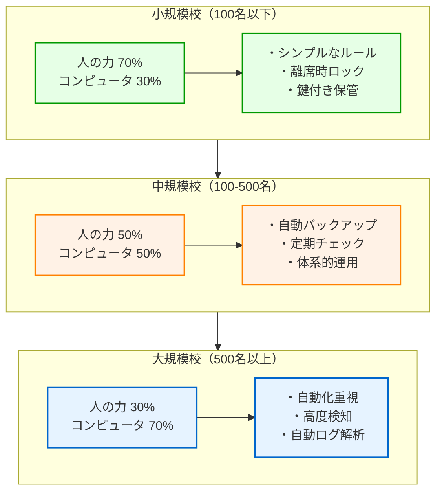
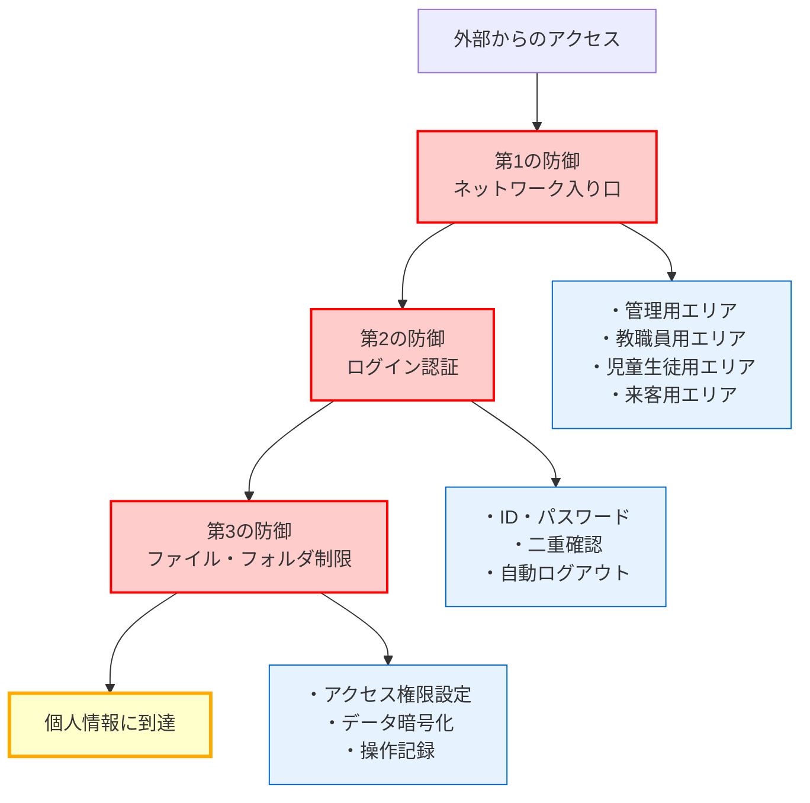
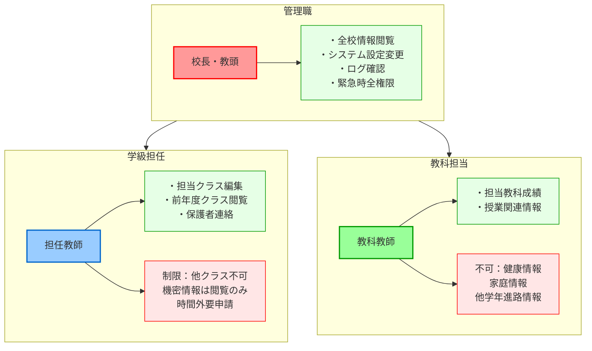
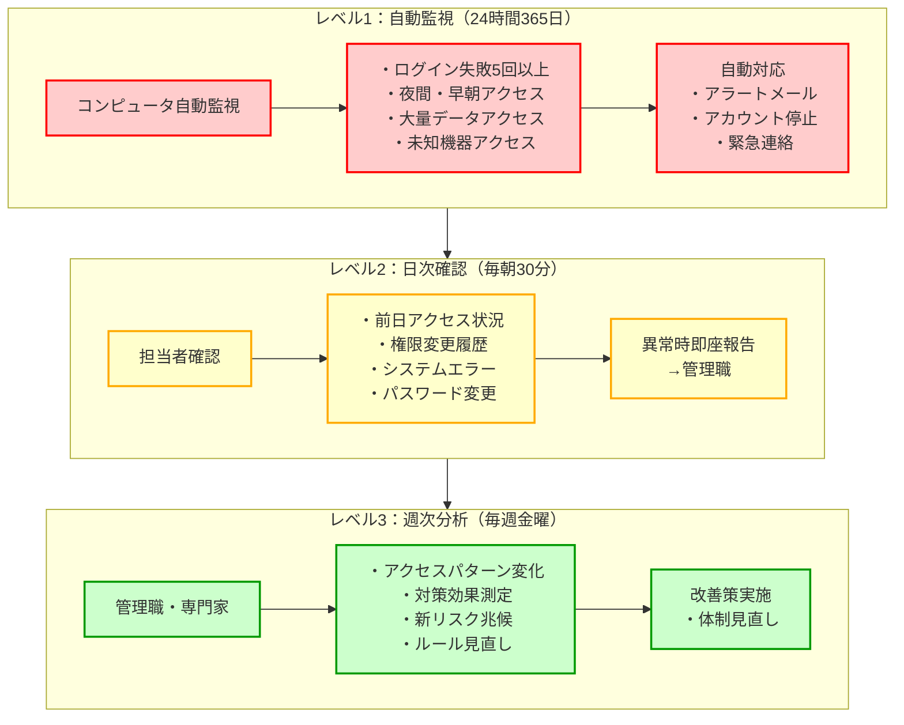
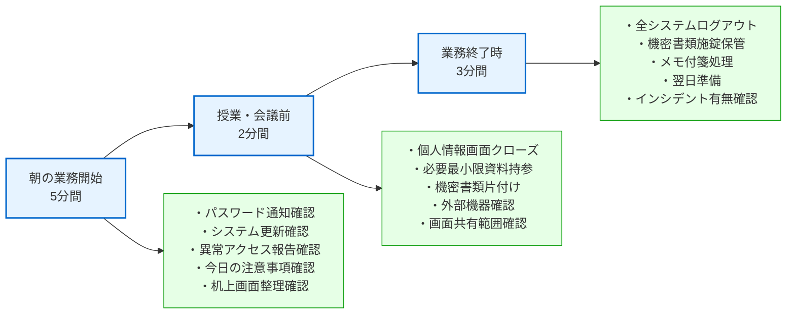

第7章で個人情報保護の運用設計を学んだ後、本章では**実際に児童生徒の個人情報を守るための具体的な方法**について、コンピュータにあまり詳しくない方でも理解できるように解説します。

重要なのは、「コンピュータに任せる部分」と「人が気を付ける部分」をバランス良く組み合わせ、学校現場で無理なく継続できる仕組みを作ることです。

# 「一度安心」から「毎日維持」への発想転換

今までの学校のセキュリティ対策は、「鍵をかけたら安心」「パスワードを設定したら安心」という考え方でした。

しかし、年間200件以上の情報漏洩事故が発生している現実を見ると、**個人情報を守ることは、毎日の継続的な取り組み**であることが分かります。

**なぜ「一度やったら終わり」では駄目なのでしょうか？**

これは、学校の健康管理と同じです。「一度健康診断を受けたから安心」ではなく、毎日の体調管理、規則正しい生活、定期的なチェックが必要です。情報セキュリティも同様に、日々の小さな注意の積み重ねが大切なのです。

たとえば、家の防犯も「鍵をかけたら終わり」ではなく、毎日の施錠確認、異常な音への注意、近所との連携などが必要です。学校の情報セキュリティも同じです。

**具体的に何が変わるのか？**
- **従来の考え方**：「システムを導入したから安全」
- **新しい考え方**：「システムを使って、毎日安全を作り続ける」

## 本当に効果のあるセキュリティの3つの条件

**1. 先生方が無理なく実践できること**
どんなに高価で高機能なシステムを導入しても、教職員の皆さんが日常的に使えなければ意味がありません。「コンピュータに詳しくない先生でも簡単に使える」ことが最も重要です。

**2. 忙しい日常業務の中でも継続できること**
教職員の皆さんは毎日とても忙しく、特別な作業を追加するような対策は長続きしません。普段の業務の中で自然に行えるような仕組み作りが必要です。

**3. 効果が目に見えて、より良くできること**
「やっているけど効果が分からない」では、継続する意欲が起きません。定期的に「どのくらい安全になったか」を確認し、必要に応じて方法を改善していくことが大切です。

# 「コンピュータに任せる部分」と「人が気を付ける部分」のバランス

学校現場では、限られた予算と人員の中で最大の効果を上げる必要があります。そのためには、「コンピュータに任せる部分（技術的対策）」と「人が気を付ける部分（運用的対策）」を適切に組み合わせることが重要です。

**技術的対策とは：** コンピュータが自動で行ってくれる安全対策
- **身近な例で言うと**：車の自動ブレーキ、エアコンの温度調節、防犯カメラの録画など
- **学校での例**：自動バックアップ、不正アクセスの自動検知、定時ログアウトなど
- **メリット**：人が忘れても動き続ける、24時間働く、人為的ミスが起きない

**運用的対策とは：** 人が意識して行う安全対策
- **身近な例で言うと**：車の安全運転、戸締り確認、財布の管理など
- **学校での例**：パスワード管理、離席時の画面ロック、印刷物の適切な処理など
- **メリット**：状況に応じた柔軟な判断、人間らしい配慮、コストが安い

**なぜ両方が必要なのか？**
コンピュータだけでは融通が利かず、人だけでは見落としやミスが起きます。車の運転で例えると、「安全運転（人）」と「自動ブレーキ（技術）」の両方があって初めて安全が確保されるのと同じです。

## 学校の大きさに応じた対策のバランス



**小規模校（全校児童100名以下）の特徴と対策**
- コンピュータの力：3割　人の力：7割
- **なぜこのバランス？**：先生同士がお互いを知っており、声をかけ合いやすい環境だから
- **重点**：先生方が覚えやすいシンプルなルールづくり
- **具体例**：「離席時は必ずパソコンをロック」「印刷物は必ず鍵付きキャビネットへ」
- **実際の運用**：朝礼で昨日の確認事項を共有、お互いに注意喚起しやすい雰囲気作り

**中規模校（全校児童100-500名）の特徴と対策**
- コンピュータの力：5割　人の力：5割
- **なぜこのバランス？**：先生の数が増えて全員への声かけが難しく、システムの力も必要
- **重点**：基本的なコンピュータの自動化と体系的なルール運用の両立
- **具体例**：自動バックアップシステム、定期的なセキュリティチェック
- **実際の運用**：月1回のセキュリティ点検日、学年主任を通じた情報共有

**大規模校（全校児童500名以上）の特徴と対策**
- コンピュータの力：7割　人の力：3割
- **なぜこのバランス？**：先生の数が多すぎて人による管理だけでは限界があるため
- **重点**：コンピュータによる自動化で効率的に管理
- **具体例**：高度な不正アクセス検知システム、自動ログ解析
- **実際の運用**：システム管理者を中心とした専門チーム、自動化による効率管理

## 予算と効果を考えた優先順位

**どの学校でも最初に必要な「基礎固め」の3つ**

**第1優先（必ずやるべき基本対策）**

1. **アクセス制御の強化**：「必要な人だけが必要な情報だけを見られる仕組み」
   - **身近な例**：家の鍵と同じ。家族だけが家に入れるように、関係者だけが情報を見られる
   - **なぜ最優先？**：これがないと、誰でも何でも見られてしまう
   - **目安予算**：月額数万円～（学校規模による）

2. **ログ監視体制の構築**：「誰がいつ何をしたかが分かる仕組み」
   - **身近な例**：防犯カメラの記録。何かあった時に確認できる
   - **なぜ重要？**：問題が起きた時の原因調査、予防にも役立つ
   - **目安予算**：月額数千円～

3. **データバックアップの自動化**：「コンピュータが壊れてもデータを復旧できる仕組み」
   - **身近な例**：大切な写真をクラウドに保存するのと同じ
   - **なぜ必須？**：データを失うと学校運営が止まってしまう
   - **目安予算**：月額数千円～数万円

**基礎ができたら次の段階へ**

**第2優先（基本対策ができたら次に取り組む）**

1. **自動パスワードチェック**：「弱いパスワードをコンピュータが自動で注意してくれる」
   - **具体的に何をする？**：「123456」や「password」など、簡単すぎるパスワードを警告

2. **異常検知アラート**：「いつもと違うアクセスをコンピュータが教えてくれる」
   - **具体的に何をする？**：夜中にアクセスがあったり、普段の10倍のデータを見ようとしたら警告

3. **定期的なセキュリティチェック**：「定期的にシステムの安全性を確認」
   - **具体的に何をする？**：月1回、専門家がシステムの弱点がないかチェック

**予算に余裕がある場合の「さらなる安心」**

**第3優先（予算に余裕がある場合の高度な対策）**
1. **AIを使った高度な異常行動検知**：人間では気づけない微細な変化も発見
2. **より高度なデータ暗号化技術**：情報が盗まれても読めないようにする最新技術
3. **セキュリティ専門家の常駐や定期的な相談**：学校専属のセキュリティアドバイザー

# 「必要な人だけが必要な情報だけを見られる仕組み」を作る

個人情報を守るための最も基本的な考え方は、**必要な人が、必要な時に、必要な情報だけを見られる仕組み**を作ることです。

これは、家庭で言えば「家族の財布は家族だけが触れる」「子どもの日記は本人と保護者だけが読める」というのと同じです。

## 何重もの防御で安全性を高める

個人情報を守るためには、一つの防御ではなく、何重もの防御を用意します。これは、家の防犯で「門扉」「玨関の鍵」「各部屋の鍵」と何重もの防御をするのと同じです。



**第1の防御：ネットワークの入り口での制限（門扉の役割）**
学校のネットワークを、以下のように分けます：

- **管理用エリア**：校長・教頭先生だけが使える
  - **例えると**：校長室。重要な書類があるので、関係者以外は入れない
  - **実際の効果**：最も機密性の高い情報へのアクセスを制限

- **教職員用エリア**：先生方が日常的に使う
  - **例えると**：職員室。先生方の仕事場で、部外者の立ち入りは制限
  - **実際の効果**：日常的な校務データを安全に扱える環境

- **児童生徒用エリア**：学習用タブレットなどが使う
  - **例えると**：教室。学習に必要な情報にだけアクセス可能
  - **実際の効果**：学習活動に支障なく、個人情報は保護

- **来客用エリア**：学校訪問者が使う
  - **例えると**：応接室のWi-Fi。インターネット利用のみ
  - **実際の効果**：学校内システムには一切アクセスできない

**第2の防御：システムへのログイン時の確認（玄関の鍵の役割）**

- **IDとパスワードでの本人確認**
  - **例えると**：家の鍵。正しい鍵を持つ人だけが入れる
  - **実際の運用**：一人ひとりに個別のIDとパスワードを配布

- **二重確認（多要素認証）**
  - **例えると**：銀行のATMと同じ。カード（知っているもの）+ 暗証番号（持っているもの）
  - **具体例**：パスワード + スマートフォンに送られるコード
  - **なぜ重要？**：パスワードが盗まれても、スマートフォンがなければアクセスできない

- **自動ログアウト**
  - **例えると**：一定時間操作しないと自動で施錠される金庫
  - **実際の設定**：30分間操作がないと自動でログアウト

**第3の防御：ファイルやフォルダごとの細かい制限（部屋の鍵の役割）**

- **アクセス権限設定**
  - **例えると**：家の各部屋に鍵がある状態。寝室は家族だけ、書斎は父親だけ
  - **学校での例**：成績フォルダは担任だけ、健康情報は養護教諭だけ

- **データ暗号化**
  - **例えると**：重要書類を金庫に入れて、さらに暗号で書いておく
  - **実際の効果**：万が一データが盗まれても、暗号鍵がなければ読めない

- **操作記録（ログ）**
  - **例えると**：金庫を開けた人と時刻を記録する帳簿
  - **実際の記録**：「田中先生が3月15日14時30分に3年1組の成績を閲覧」など

## 先生の役割に応じた情報アクセスの仕組み



**管理職（校長・教頭先生）ができること**
- 全校の児童生徒情報を見ること
- システムの設定を変更すること
- 誰がいつ何をしたかの記録をいつでも確認すること
- 緊急時にはすべての権限を使えること

**しかし、以下の制限があります**
- 個人情報を変更する時は理由を記録し、承認が必要
- データを外部に持ち出す時は必ず記録を残す

**学級担任の先生ができること**
- 担当クラスの情報を編集すること
- 前年度に担任したクラスの情報を見ること（変更は不可）
- 保護者との連絡をすること

**しかし、以下の制限があります**
- 他のクラスの情報は原則として見られない
- 特に機密な情報は見るだけで変更はできない
- 勤務時間外のアクセスは事前に申請が必要

**教科担当の先生ができること**
- 担当している教科の成績を入力・変更すること
- 授業に関連する情報を見ること

**しかし、以下の情報は見られません**
- 児童生徒の健康情報（アレルギーや病気など）
- 家庭の情報（経済状況や家族構成など）
- 進路情報は担当している学年のみ

## 必要な時期だけアクセスできる仕組み

**成績をつける時期（学期末の2週間だけ）**
- この期間だけ、成績を入力・変更できる権限が自動で付与される
- 成績処理が終わったら、自動で権限がなくなる
- 誰がいつ何を変更したか、詳しい記録を残す

**健康診断をする時期（実施の前後1ヶ月間だけ）**
- この期間だけ、健康情報を更新できる権限が一時的に付与される
- 普段は養護教諭だけが見られる健康情報を、この期間は他の先生も見られる
- 期間が終わったら、自動で元の設定に戻る

# ログ監視による不正アクセスの早期発見

第7章で追加したパスワードスプレー攻撃の事例が示すように、**早期発見が被害の拡大を防ぐ鍵**となります。

## 3段階のログ監視体制



**レベル1：コンピュータによる自動監視（24時間365日）**

**例えると**：学校の自動火災報知器のようなもの。異常があると自動でアラームが鳴る

**コンピュータが自動で監視すること：**

- **ログイン失敗の連続**：「鍵の開け閉め」の失敗が5回以上続いた場合
  - **身近な例**：家の鍵を何度も間違える人がいたら不審
  - **実際の警告**：正しいパスワードを知らない人が不正アクセスを試している可能性

- **深夜・早朝のアクセス**：普通は誰もいない時間帯にアクセスがあった場合
  - **身近な例**：夜中に誰かが職員室にいるのは不自然
  - **実際の警告**：海外からの不正アクセスや、盗まれたパスワードの悪用の可能性

- **大量データアクセス**：普段の10倍以上のデータを一度に見ようとした場合
  - **身近な例**：いつもは1クラス分しか見ない人が、全校分を一度に見ようとする
  - **実際の警告**：情報を大量に盗み出そうとしている可能性

- **未知機器からのアクセス**：見たことのない機器からのアクセスがあった場合
  - **身近な例**：知らないスマートフォンが学校のWi-Fiに接続しようとする
  - **実際の警告**：外部からの不正侵入の可能性

**異常を発見した時の自動対応：**
- **即座にアラート**：メールで担当者に知らせる（火災報知器が鳴るのと同じ）
- **一時停止**：怪しいアカウントを一時的に使えなくする（緊急時のブレーカー遮断と同じ）
- **緊急連絡**：管理職に緊急連絡する（119番通報と同じ）

**レベル2：担当者による毎日の確認（毎朝30分）**

**例えると**：学校の健康観察のようなもの。毎朝クラスの様子をチェック

**担当者（主幹教諭等）が毎朝確認すること：**

- **前日のアクセス状況**：昨日、誰がシステムを使ったかの概要
  - **身近な例**：昨日職員室に誰がいたかを振り返る
  - **実際の確認**：「通常通りの利用パターンだったか？」

- **権限変更の確認**：誰かの権限（できることの範囲）が変わったかどうか
  - **身近な例**：誰かに新しい鍵を渡したり、回収したりしたか
  - **実際の確認**：「新任の先生にアクセス権を付与」「退職者の権限削除」など

- **システムエラーの確認**：システムでエラーが起きていないか
  - **身近な例**：設備の故障がないかの点検
  - **実際の確認**：「ログインできない」「データが保存できない」などの報告

- **パスワード変更状況**：パスワードを変更した人がいるか
  - **身近な例**：誰かが鍵を交換したかの確認
  - **実際の確認**：「予定外のパスワード変更がないか」

**何か異常を見つけたら、すぐに管理職に報告する**

**レベル3：全体的な分析（毎週金曜日）**

**例えると**：学校の週次職員会議のようなもの。一週間を振り返って改善点を話し合う

**参加者：** 管理職、情報管理責任者、システム管理担当者

**話し合うこと：**

- **利用パターンの変化**：普段と違うアクセスの仕方をしている人がいないか
  - **具体例**：「最近、夜遅くまで作業する先生が増えている」
  - **対応例**：「時間外アクセスのルール見直しが必要か？」

- **対策の効果測定**：今のセキュリティ対策がうまくいっているか
  - **具体例**：「パスワード変更を促す仕組みで、実際に変更率が上がったか？」
  - **対応例**：「効果が薄ければ、違う方法を検討」

- **新たなリスクの発見**：新しい危険の兆候がないか
  - **具体例**：「新しい種類の不審なアクセスが増えている」
  - **対応例**：「追加の対策が必要か検討」

- **ルールの見直し**：現在のルールで不便や問題がないか
  - **具体例**：「パスワードが複雑すぎて先生方が困っている」
  - **対応例**：「使いやすさと安全性のバランスを調整」

## 効果的な監視のポイント

**普段の様子を知っておく**
- 普通の日は誰がいつシステムを使うかを把握しておく
- 入学式や卒業式などの特別な時期は使い方が変わることを理解しておく
- 先生それぞれの普段の使い方を知っておく

**色々な情報を組み合わせて判断する**
- いくつかの記録を合わせて見ることで、全体の状況を把握する
- 時間の流れに沿って変化を追跡する
- 違うシステム同士の連携がうまくいっているかを確認する

# データを暗号化して、万が一の時の被害を最小限に抑える

もし情報が漏洩してしまった場合でも、**暗号化（第三者が読めないようにする技術）により被害を最小限に抑える**ことが重要です。

## 3つの場面での暗号化

**保存時の暗号化（金庫に入れる時の暗号化）**
- 対象：
  - すべての個人情報ファイル
  - 成績や健康情報などの重要なデータ
  - バックアップ（予備）のデータ

- 方法：
  - 強力な暗号化技術を使用
  - 先生方が特別な操作をしなくても自動で暗号化
  - 暗号の鍵を複数の場所に分けて管理

**通信時の暗号化（データを送る時の暗号化）**
- 対象：
  - 校務システムを使う時
  - メールを送信する時
  - ファイルを転送する時

- 方法：
  - インターネット通信を安全にする最新技術を使用
  - 安全な通信回線（VPN）を活用
  - 送信者から受信者まで、途中で誰にも読めないようにする

**利用時の暗号化（画面に表示する時の暗号化）**
- 対象：
  - 画面に表示されるデータ
  - 印刷物の機密情報
  - 一時的に作られるファイル

- 方法：
  - 透かしや一部を隠すなどの処理
  - 表示する瞬間だけ暗号化を解除
  - 作業が終わったら自動で保護

## 暗号化を使う時の注意点

**先生方の負担を軽減する**
- 普段の操作を変えることなく、自動で暗号化する
- 特別な操作や覚えることを増やさない
- 簡単で分かりやすい画面にする

**動作速度とのバランス**
- 暗号化してもシステムが遅くならないように調整
- コンピュータの能力を効率的に使用
- 必要に応じて段階的に導入

**万が一の時の復旧手順**
- 暗号の鍵をしっかり管理する体制を作る
- 緊急時に素早く復旧する手順を明確にする
- 定期的に復旧の練習をする

# 定期的な安全点検と改善

セキュリティは「一度設定したら終わり」ではありません。**継続的な改善**が必要です。

## 4つの段階での安全点検

**第1段階：基本点検（毎月）**
- 点検内容：
  - パスワードが安全かどうかのチェック
  - ソフトウェアが最新版になっているかの確認
  - 誰がどの情報を見られるかの整理
  - 基本的な設定ミスがないかの確認

- 実施者：
  - 学校内の担当者
  - 自動チェックツールの活用
  - チェックリストを使った確認

**第2段階：技術点検（3か月に1回）**
- 点検内容：
  - ネットワークの安全性チェック
  - アプリケーションの安全性検査
  - 設定ミスの詳しい確認
  - 実際に攻撃される可能性のテスト

- 実施者：
  - 外部の専門業者
  - 技術的な専門知識を活用
  - 第三者による客観的な評価

**第3段階：総合点検（半年に1回）**
- 点検内容：
  - 全システムの包括的なチェック
  - 運用方法の見直し
  - 事故が起きた時の対応手順確認
  - 教職員のセキュリティ意識調査

- 実施者：
  - 専門コンサルタント
  - 教育分野に詳しい専門家
  - 第三者による客観的評価

**第4段階：戦略点検（年に1回）**
- 点検内容：
  - セキュリティ戦略の見直し
  - 新しい技術・新しい脅威への対応検討
  - 投資効果の評価
  - 中長期計画の作成

- 実施者：
  - セキュリティ戦略の専門家
  - 教育委員会との連携
  - 他校との情報共有

## 点検結果を活用した改善の進め方

**改善のサイクル（Plan→Do→Check→Act）**

**Plan（計画を立てる）**
- 点検結果に基づいて改善計画を作る
- どれから先に手を付けるか優先順位を決める
- いつまでに何をするかスケジュールを作る

**Do（実行する）**
- 改善対策を実際に行う
- 教職員の皆さんに新しいやり方を知ってもらう
- 運用の手順を見直す

**Check（確認する）**
- 対策がうまくいっているかを確認する
- 新しい問題が起きていないか早めに発見する
- 運用状況を継続的に確認する

**Act（さらに改善する）**
- 確認結果に基づいて追加の対策を行う
- 運用手順をより良いものにする
- 次の計画に今回の経験を活かす

# 現場で実践可能なセキュリティルール

最も重要なのは、**教職員が日常的に実践できる具体的なルール**を確立することです。

## 日常業務に組み込まれたセキュリティ



**朝の業務開始時（5分間の安全確認）**
□ パスワード変更のお知らせがないかチェック
□ システムの更新のお知らせがないかチェック
□ 昨日、変なアクセスがなかったかの報告をチェック
□ 今日の重要な業務で気を付けることがないかチェック
□ 机の上や画面に個人情報が出ていないかチェック

**授業・会議前（2分間の情報保護確認）**
□ 不要な個人情報の画面を閉じる
□ 必要最小限の資料だけ持参する
□ 机の上の機密書類を片付ける
□ USBメモリなどの外部機器を確認する
□ 画面を共有する時の情報範囲を確認する

**業務終了時（3分間の安全完了確認）**
□ すべてのシステムからログアウトする
□ 機密書類を鍵付きキャビネットに保管する
□ 個人情報を含むメモ・付箋を適切に処理する
□ 明日の業務で使う情報を事前に準備する
□ セキュリティインシデントがなかったか確認する

## 学年・教科別のセキュリティガイド

**小学校低学年担任向け**
```
重点項目:
- 保護者との連絡でのプライバシー配慮
- 児童の特別な配慮事項の慎重な取扱い
- 連絡帳・お便り作成時の個人情報確認

注意点:
- 児童の成長記録の長期保管方法
- 保護者面談時の情報管理
- 行事写真等の取扱いルール
```

**中学校進路指導担当向け**
```
重点項目:
- 進路希望・成績情報の厳格な管理
- 高校との情報連携時のセキュリティ
- 進路面談記録の適切な保管

注意点:
- 調査書等の公的文書の管理
- 進路変更時の情報更新手順
- 卒業後の情報保管・廃棄ルール
```

**特別支援教育担当向け**
```
重点項目:
- 極めて機密性の高い個人情報の取扱い
- 医療・療育機関との情報連携
- 個別支援計画の作成・共有

注意点:
- 保護者同意の適切な取得
- 支援会議での情報共有範囲
- 進学・転校時の引継ぎ手順
```

# 技術と運用の統合による総合的セキュリティ

効果的なセキュリティは、技術的対策と運用的対策が**有機的に連携する統合システム**として機能する必要があります。

## コンピュータと人間の役割分担

**コンピュータに任せること・人間が判断すること**

コンピュータに任せること：
- いつものパターンと違うことを見つける
- 基本的な対応（怪しいアカウントを一時停止など）
- 記録の収集・整理
- 定期的な報告書の作成

人間が判断すること：
- 異常事態を総合的に判断する
- 関係者への説明
- 改善策を考えて実行する
- 緊急時の重要な意思決定

**段階的な対応体制**

第1段階：システムによる自動対応
- 基本的な異常を見つける
- すぐに保護措置を取る
- 関係者に自動で知らせる

第2段階：現場責任者の判断
- 状況を詳しく確認する
- 追加の対策を実施する
- 管理職に報告する

第3段階：管理職の判断
- 全体への影響を評価する
- 外部への対応方針を決定する
- 教育委員会に報告する

第4段階：外部専門家との連携
- 高度な技術的対応
- 法的な判断・対応
- 危機管理・広報対応

## 継続的改善のための仕組み

**セキュリティの効果を測る指標**

技術面の指標：
- システムが正常に動いている時間（99.9%以上を目標）
- 危険な弱点を見つけてから対応するまでの時間（72時間以内）
- バックアップが成功する割合（100%を目標）
- 不正アクセスを見つけるまでの時間（30分以内）

運用面の指標：
- セキュリティ研修を受けた職員の割合（100%を目標）
- インシデントの報告率（疑いも含めて）
- ルールを守れている割合
- セキュリティ意識調査の点数

効果の指標：
- インシデント発生件数（前年より減少）
- 被害の範囲・期間（最小限に）
- 復旧時間（短縮）
- 保護者の満足度（向上）

**学校全体でのセキュリティ文化づくり**

教職員レベル：
- 日常的にセキュリティを意識する
- 自分から改善提案をする
- お互いにチェック・サポートする

学校レベル：
- セキュリティを重視した意思決定
- 継続的な投資・改善
- 外部機関との連携強化

地域レベル：
- 保護者・地域との信頼関係
- 他校との情報共有・連携
- 教育委員会との一体的対応

# まとめ：実効性のあるセキュリティの実現に向けて

第8章で解説した実効性のあるセキュリティ対策は、以下の3つの要素が揃って初めて機能します：

## 1. 技術的対策の適切な選択と実装
- 学校規模・予算に応じた現実的な技術選択
- 教職員の負担を軽減する自動化
- 継続的な運用が可能な技術の採用

## 2. 運用的対策の日常業務への統合
- 教職員が自然に実践できるルールの確立
- 役割・状況に応じたきめ細かなガイドライン
- 継続的な改善を促進する仕組み

## 3. 技術と運用の有機的な連携
- 自動化と人的判断の適切な分離
- 段階的なエスカレーション体制
- 全校的なセキュリティ文化の醸成

# 第8章のまとめ：明日から始められる実践的ステップ

第8章で学んだ実効性のあるセキュリティ対策を、実際に学校で実践するための具体的なステップをまとめます。

## **まず最初の1週間で始めること**

**1日目：現状把握**
- 学校の規模を確認（全校児童数）
- 現在使っているシステムの洗い出し
- セキュリティ担当者の決定

**2-3日目：基本ルールの設定**
- 「離席時画面ロック」ルールの全教職員への周知
- パスワード管理方法の統一
- 印刷物管理ルールの確認

**4-5日目：優先対策の検討**
- 第1優先の3つ対策（アクセス制御、ログ監視、バックアップ）の現状確認
- 予算と必要性の検討
- 業者への相談開始

**1週間後：日常運用の開始**
- 毎朝5分間のセキュリティチェック習慣化
- 週1回のセキュリティミーティング開始

## **1ヶ月以内に実現すること**

- 学校規模に応じたバランス（技術：運用）の決定
- 第1優先対策の実装開始
- 全教職員への基本ルール浸透
- 監視体制の基本形構築

## **3ヶ月以内の目標**

- 第1優先対策の完全実装
- 第2優先対策の検討・準備
- インシデント対応手順の確立
- 効果測定の仕組み構築

## **よくある質問と現実的な答え**

**Q: 「ITに詳しくない私でも、セキュリティ担当になれますか？」**
A: 大丈夫です。最も重要なのは「継続的に取り組む意識」です。技術的な詳細は専門業者に相談し、あなたは「学校現場の実情を伝える橋渡し役」として活躍できます。

**Q: 「予算が限られているのですが、何から始めればいいですか？」**
A: まずは「人の力」でできることから。離席時画面ロック、定期的な確認作業、職員間での声かけなど、コストをかけずにできる対策が効果的です。

**Q: 「先生方が忙しくて、新しいルールを覚えてもらえるか心配です」**
A: 一度に全部やろうとせず、週に1つずつ新しい習慣を定着させましょう。「今週は離席時ロックを徹底」「来週は印刷物管理を徹底」など、段階的に進めることが重要です。

**Q: 「効果があるかどうか、どうやって確認できますか？」**
A: 月に1回、「ヒヤリハット事例」「ルール遵守状況」「システムの異常」を確認する時間を設けましょう。数値で測れなくても、「安心して仕事ができるようになった」という実感も大切な効果です。

## **次のステップ**

第8章で基本的な実装方法を学びました。次の第9章では、これらの対策を支える**教職員の個人情報保護意識向上と体制構築**について詳しく解説します。

# 【第8章の確認事項】

本章の内容を踏まえ、以下の重要なポイントが理解できているか確認してください。

## ✅ セキュリティ対策の基本発想の理解確認

**Q1. 「一度安心」から「毎日維持」への発想転換を理解しているか？**
- [ ] 個人情報保護は毎日の継続的な取り組みであることを理解している
- [ ] 年間200件以上の情報漏洩事故の現実を踏まえた日常的対策の必要性を認識している
- [ ] 従来の「システム導入で安心」から「システムで毎日安全を作り続ける」考え方への転換を把握している

**Q2. 効果的なセキュリティの3つの条件を理解しているか？**
- [ ] 先生方が無理なく実践できることの重要性を理解している
- [ ] 忙しい日常業務の中でも継続できる仕組み作りの必要性を認識している
- [ ] 効果が目に見えて改善できる体制構築の重要性を把握している

## ✅ 技術と運用のバランス理解確認

**Q3. 学校規模に応じた対策バランスを理解しているか？**
- [ ] 小規模校（100名以下）：人の力70%、コンピュータ30%の特徴と理由を理解している
- [ ] 中規模校（100-500名）：50%ずつのバランスの特徴と実装方法を認識している
- [ ] 大規模校（500名以上）：コンピュータ70%、人の力30%の特徴と運用方法を把握している

**Q4. 予算と効果を考えた優先順位を理解しているか？**
- [ ] 第1優先（アクセス制御、ログ監視、バックアップ）の重要性と目安予算を理解している
- [ ] 第2優先（パスワードチェック、異常検知、定期チェック）の実装内容を認識している
- [ ] 第3優先（AI検知、高度暗号化、専門家常駐）の位置づけを把握している

## ✅ 多層防御システムの理解確認

**Q5. 何重もの防御による安全性強化を理解しているか？**
- [ ] 第1の防御（ネットワーク入り口制限）の4つのエリア分けを理解している
- [ ] 第2の防御（ログイン認証）の多要素認証と自動ログアウトを認識している
- [ ] 第3の防御（ファイル・フォルダ制限）のアクセス権限と暗号化を把握している

**Q6. 役割に応じた情報アクセスの仕組みを理解しているか？**
- [ ] 管理職の権限と制限のバランスを理解している
- [ ] 学級担任の担当範囲と制限事項を認識している
- [ ] 教科担当の権限範囲と禁止事項を把握している

## ✅ 監視・検知体制の理解確認

**Q7. 3段階のログ監視体制を理解しているか？**
- [ ] レベル1（24時間自動監視）の検知項目と自動対応を理解している
- [ ] レベル2（毎日30分確認）の担当者チェック項目と報告体制を認識している
- [ ] レベル3（週次分析）の参加者と改善サイクルを把握している

**Q8. 暗号化による被害最小化対策を理解しているか？**
- [ ] 保存時暗号化の対象と方式を理解している
- [ ] 通信時暗号化の必要性と実装方法を認識している
- [ ] 利用時暗号化の運用における注意点を把握している

## ✅ 実践的運用の理解確認

**Q9. 日常業務に組み込まれたセキュリティルールを理解しているか？**
- [ ] 朝の業務開始時（5分間）の安全確認項目を理解している
- [ ] 授業・会議前（2分間）の情報保護確認項目を認識している
- [ ] 業務終了時（3分間）の安全完了確認項目を把握している

**Q10. 学年・教科別のセキュリティガイドを理解しているか？**
- [ ] 小学校低学年担任向けの重点項目と注意点を理解している
- [ ] 中学校進路指導担当向けの特別配慮事項を認識している
- [ ] 特別支援教育担当向けの高度機密情報取扱いを把握している

## ✅ 継続的改善の理解確認

**Q11. 4段階の安全点検プログラムを理解しているか？**
- [ ] Phase1（月次基本診断）の実施内容と担当者を理解している
- [ ] Phase2（四半期技術診断）の専門性と外部活用を認識している
- [ ] Phase3（半年包括診断）の総合的評価項目を把握している
- [ ] Phase4（年次戦略診断）の長期計画策定を理解している

**Q12. 実践的実装スケジュールを理解しているか？**
- [ ] 第1週間での現状把握と基本ルール設定を理解している
- [ ] 1ヶ月以内の目標（基本実装と体制構築）を認識している
- [ ] 3ヶ月以内の目標（完全実装と効果測定）を把握している

## ✅ 現実的課題への対応理解確認

**Q13. ITに詳しくない担当者でも実践可能な方法を理解しているか？**
- [ ] 技術詳細は専門業者に相談し、現場実情を伝える橋渡し役としての重要性を理解している
- [ ] 予算が限られた状況での「人の力」中心の対策実装方法を認識している
- [ ] 忙しい現場での段階的習慣定着の進め方を把握している

**Q14. 効果測定と継続改善の方法を理解しているか？**
- [ ] 数値化できない「安心感」も含めた効果確認の重要性を理解している
- [ ] 月1回のヒヤリハット・ルール遵守・システム異常確認の必要性を認識している
- [ ] PDCAサイクルによる継続的改善体制の構築方法を把握している

---

**すべての項目にチェックが入らない場合は、該当箇所を再度読み返すことをお勧めします。**

特に重要なのは、**「一度安心」から「毎日維持」への発想転換**と、**学校規模に応じた技術と運用のバランス調整**の理解です。また、**3段階監視体制の構築**と**日常業務に組み込まれた実践的セキュリティルール**を確実に実装する準備も確認してください。

---

技術的な対策がいくら優れていても、それを運用する人々の意識と能力が伴わなければ、真の個人情報保護は実現できません。「システムを導入したから安心」ではなく、「システムを使って、みんなで毎日安全を作り続ける」ための人づくりについて学んでいきましょう。