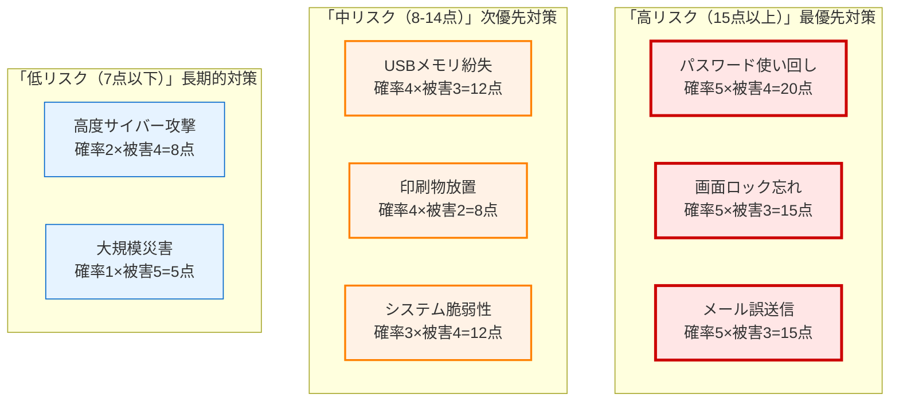
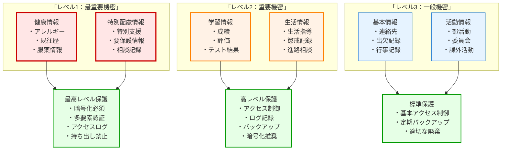
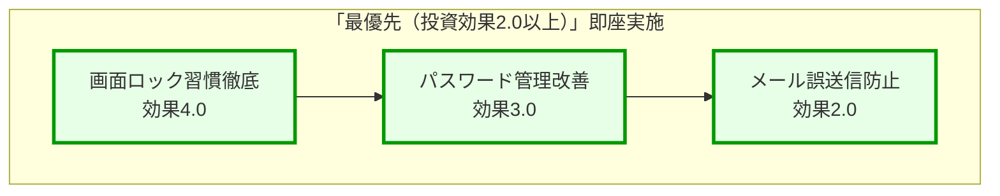
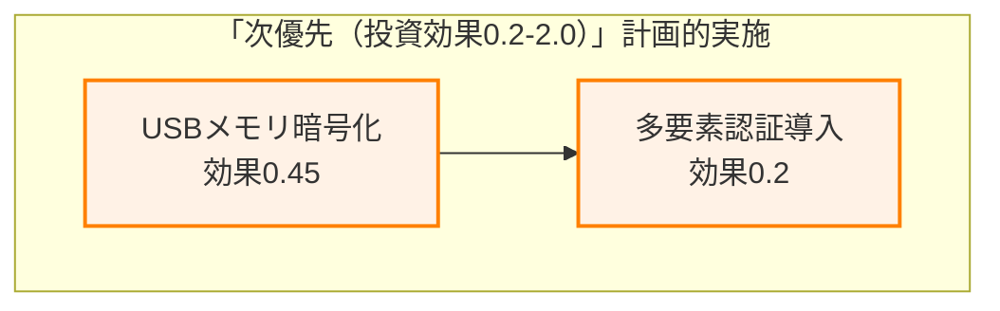
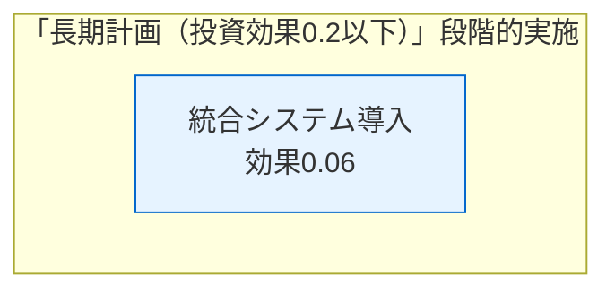
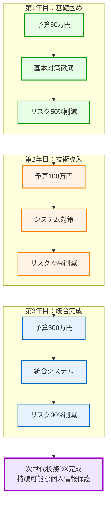

第1章から第9章まで、校務DXと個人情報保護について様々な側面から学んできました。最終章となる本章では、**限られた予算の中で最大の効果を上げるための投資判断**について、実践的に解説します。

学校や教育委員会の予算は限られています。だからこそ、**「最も重要なリスクを最優先で対策する」** という考え方が必要です。これは、家庭での防犯対策と同じで、「すべてを完璧にする」のではなく、「最も効果的な対策から実施する」ことが重要です。

# 個人情報漏洩リスクの定量的評価

## なぜ「数字で考える」ことが重要なのか

**感覚的な判断の問題点**
「なんとなく危険そう」「いつかは対策したい」という感覚的な判断では、限られた予算を効果的に使うことができません。

**具体例：家庭の防犯対策**
家庭で防犯対策を考える時、以下のように優先順位を考えるでしょう。

1. **玄関の鍵（最優先）**：侵入される可能性が高く、被害が深刻
2. **窓の鍵（次に重要）**：侵入される可能性は中程度だが、被害は深刻  
3. **防犯カメラ（その次）**：侵入抑制効果はあるが、費用が高い
4. **防犯砂利（最後）**：効果は限定的だが、費用が安い

学校の個人情報保護も同じように、**「起こりやすさ」と「被害の大きさ」**を数字で評価して、投資の優先順位を決める必要があります。

## リスク評価の基本的な考え方

**リスクの計算式**
```
リスク = 発生確率 × 被害の大きさ
```

この式を使って、学校で起こりうる個人情報漏洩のリスクを数値化していきます。

### 発生確率の評価（5段階）

**5点：非常に高い（年1回以上発生）**
- パスワードの使い回し
- 画面ロックし忘れ
- メール誤送信

**4点：高い（2-3年に1回発生）**
- USBメモリの紛失
- 印刷物の放置
- 不正アクセス

**3点：中程度（5年に1回程度）**
- システムの脆弱性悪用
- 内部不正
- 災害によるデータ損失

**2点：低い（10年に1回程度）**
- 高度なサイバー攻撃
- 大規模システム障害

**1点：非常に低い（数十年に1回）**
- 国家レベルのサイバー攻撃
- 想定外の自然災害

### 被害の大きさの評価（5段階）

**5点：極めて深刻**
- 全校児童の健康情報・特別配慮情報が流出
- 数百人規模の個人情報が悪用される
- 学校運営が数週間停止

**4点：深刻**
- 1クラス分の個人情報が流出
- 特定の児童生徒への深刻な二次被害
- 学校運営が数日間停止

**3点：中程度**
- 少数の個人情報が流出
- 限定的な二次被害
- 業務への影響は軽微

**2点：軽微**
- 個人情報流出はあるが二次被害なし
- 業務への影響はほとんどなし

**1点：影響なし**
- 流出したが個人を特定できない
- 実質的な被害なし

## 学校でよくあるリスクの評価例



**この評価から分かること**
1. **パスワード使い回し**が最もリスクが高い（20点）
2. **画面ロック忘れ**と**メール誤送信**が次に危険（各15点）
3. **高度なサイバー攻撃**よりも**日常的なミス**の方が危険

# 最も守るべき情報資産の特定

## 情報の重要度分類

学校が保有する情報をリスクレベルに応じて分類し、それぞれに適切な保護レベルを設定します。

### レベル1：最重要機密情報

**対象となる情報**
- 児童生徒の健康情報（アレルギー、既往歴、服薬情報）
- 特別支援教育に関する情報
- 要保護・準要保護児童生徒の情報
- 家庭環境・虐待関連の相談記録

**なぜ最重要なのか**
これらの情報が漏洩すると、児童生徒への直接的な身体的・精神的被害が発生し、回復不可能な影響を与える可能性があります。

**必要な保護レベル**
- 暗号化必須
- アクセスログ記録必須
- 多要素認証必須
- 持ち出し原則禁止

### レベル2：重要機密情報

**対象となる情報**
- 成績・評価・テスト結果
- 生活指導記録・懲戒記録
- 進路指導・相談記録
- 保護者面談記録

**なぜ重要なのか**
これらの情報が漏洩すると、児童生徒の学習意欲や進路に悪影響を与え、差別や偏見の原因となる可能性があります。

**必要な保護レベル**
- アクセス制御必須
- ログ記録推奨
- 定期的なバックアップ必須
- 持ち出し時は暗号化必須

### レベル3：一般機密情報

**対象となる情報**
- 基本的な連絡先情報
- 出欠記録
- 一般的な学校行事の写真
- 部活動・委員会活動記録

**なぜ保護が必要なのか**
個人情報保護法の対象となる情報であり、適切な管理が法的に求められています。

**必要な保護レベル**
- 基本的なアクセス制御
- 定期的なバックアップ
- 適切な廃棄手順の実施

## 情報資産マップの作成



# リスク低減効果の高い対策への優先投資

## 投資効果の評価方法

**費用対効果の計算式**
```
投資効果 = リスク低減効果 ÷ 投資コスト
```

この計算で数値が高いほど、効果的な投資となります。

## 具体的な対策の費用対効果分析

### 高効果・低コストの対策（最優先実施）

**1. パスワード管理の改善**
- **投資コスト**：研修費用 5万円
- **リスク低減効果**：パスワード使い回しリスク（20点）を5点に削減
- **投資効果**：15点 ÷ 5万円 = 3.0

**2. 画面ロック習慣の徹底**
- **投資コスト**：ポスター作成・研修 3万円
- **リスク低減効果**：画面ロック忘れリスク（15点）を3点に削減
- **投資効果**：12点 ÷ 3万円 = 4.0

**3. メール誤送信防止研修**
- **投資コスト**：研修実施費用 5万円
- **リスク低減効果**：メール誤送信リスク（15点）を5点に削減
- **投資効果**：10点 ÷ 5万円 = 2.0

### 高効果・中コストの対策（次優先実施）

**4. USBメモリ暗号化ソフト導入**
- **投資コスト**：ソフト購入・設定 20万円
- **リスク低減効果**：USBメモリ紛失リスク（12点）を3点に削減
- **投資効果**：9点 ÷ 20万円 = 0.45

**5. 多要素認証システム導入**
- **投資コスト**：システム導入 50万円
- **リスク低減効果**：不正アクセスリスク（12点）を2点に削減
- **投資効果**：10点 ÷ 50万円 = 0.2

### 高効果・高コストの対策（長期的実施）

**6. 統合校務システム導入**
- **投資コスト**：システム導入 500万円
- **リスク低減効果**：複数のリスクを総合的に削減（30点削減）
- **投資効果**：30点 ÷ 500万円 = 0.06

## 投資優先順位の決定










# 段階的なセキュリティ強化計画

## 3年間の段階的実施計画

### 第1年目：基本対策の徹底（予算30万円）

**目標：日常的なリスクの大幅削減**

**4-6月：意識改革と基本習慣**
- パスワード管理研修（5万円）
- 画面ロック習慣化キャンペーン（3万円）
- ヒヤリハット収集制度開始（2万円）

**7-9月：操作技術の向上**
- メール誤送信防止研修（5万円）
- 印刷物管理ルール徹底（3万円）
- 個人情報取扱い手順書作成（2万円）

**10-12月：体制強化**
- 個人情報保護責任者研修（5万円）
- 緊急時対応手順確立（3万円）
- 1年目効果測定・評価（2万円）

**期待される効果**
- パスワード関連リスク：20点 → 5点（75%削減）
- 画面ロック関連リスク：15点 → 3点（80%削減）
- メール誤送信リスク：15点 → 5点（67%削減）

### 第2年目：技術的対策の導入（予算100万円）

**目標：システム的な保護レベルの向上**

**4-6月：アクセス制御強化**
- 多要素認証システム導入（50万円）
- アクセス権限管理システム構築（20万円）
- ログ監視システム導入（15万円）

**7-9月：データ保護強化**
- USBメモリ暗号化ソフト導入（20万円）
- ファイル暗号化システム導入（10万円）
- バックアップシステム強化（10万円）

**10-12月：監視・検知機能**
- 異常検知システム導入（15万円）
- インシデント対応システム構築（10万円）
- 2年目効果測定・評価（5万円）

**期待される効果**
- 不正アクセスリスク：12点 → 2点（83%削減）
- USBメモリ紛失リスク：12点 → 3点（75%削減）
- システム脆弱性リスク：12点 → 4点（67%削減）

### 第3年目：統合的システム構築（予算300万円）

**目標：次世代校務DXの本格導入**

**4-6月：システム設計・調達**
- 統合校務システム選定（50万円）
- システム設計・カスタマイズ（100万円）
- データ移行計画策定（30万円）

**7-9月：段階的導入**
- パイロット校での試行運用（50万円）
- 教職員研修・操作習得（30万円）
- 問題点の改善・調整（20万円）

**10-12月：本格運用開始**
- 全校での本格運用開始（50万円）
- 運用サポート・保守（20万円）
- 3年間総合効果測定（10万円）

**期待される効果**
- 全体的なリスク水準の大幅な改善
- 業務効率の向上
- 継続可能な個人情報保護体制の確立

## 各段階での効果測定方法

### 定量的評価指標

**セキュリティインシデント数**
- 目標：年間インシデント数の継続的削減
- 測定：月次でのインシデント発生数記録

**個人情報保護意識レベル**
- 目標：教職員の意識向上
- 測定：年2回のアンケート調査（5段階評価）

**業務効率性**
- 目標：校務処理時間の短縮
- 測定：代表的な校務作業の所要時間測定

### 定性的評価指標

**教職員の満足度**
- システムの使いやすさ
- セキュリティ対策への理解度
- 継続的な改善への参加度

**組織文化の変化**
- 報告しやすい環境の構築
- 相互支援の活発化
- 継続的な学習意欲

# 費用対効果を考慮した現実的な選択

## 予算制約がある中での賢い選択

### 予算50万円の場合の最適配分

**基本対策重視プラン**
- パスワード管理研修：10万円
- 画面ロック習慣化：8万円
- メール誤送信防止研修：10万円
- USBメモリ暗号化ソフト：15万円
- 緊急時対応体制構築：7万円

**期待効果**：高リスク項目の70%削減

### 予算150万円の場合の最適配分

**バランス型プラン**
- 第1年目基本対策：50万円
- 多要素認証システム：40万円
- ログ監視システム：30万円
- アクセス制御強化：20万円
- 継続的改善活動：10万円

**期待効果**：全体リスクの60%削減

### 予算500万円の場合の最適配分

**包括的対策プラン**
- 基本対策パッケージ：100万円
- 技術的対策一式：200万円
- 統合システム導入：150万円
- 継続的運用体制：30万円
- 予備費・緊急対応：20万円

**期待効果**：全体リスクの80%削減

## 段階的投資による効果の最大化



# 継続的なリスク評価と投資見直し

## PDCAサイクルによる継続的改善

### Plan（計画）- 年次計画の策定

**年度初めの計画策定（4月）**
- 前年度のリスク評価結果の分析
- 新年度の予算と目標の設定
- 優先対策の選定と実施計画

**具体的な計画項目**
- 実施する対策の具体的内容
- 各対策の予算配分
- 実施スケジュールと責任者
- 効果測定の方法と時期

### Do（実行）- 計画の着実な実施

**月次での進捗管理**
- 計画に沿った対策の実施
- 実施状況の記録と課題の把握
- 必要に応じた計画の微調整

**実施時の注意点**
- 教職員への十分な説明と協力要請
- 実施過程での課題の早期発見
- 予想外の問題への迅速な対応

### Check（確認）- 効果の測定と評価

**四半期ごとの効果測定**
- インシデント発生状況の確認
- リスクレベルの再評価
- 教職員アンケートによる満足度調査

**年度末の総合評価**
- 年間目標の達成度評価
- 投資効果の定量的分析
- 次年度への課題の整理

### Action（改善）- 評価結果に基づく改善

**改善計画の策定**
- 効果が不十分だった対策の見直し
- 新たなリスクへの対応策検討
- より効果的な手法の検討

**次年度計画への反映**
- 成功した取り組みの継続・拡大
- 失敗した取り組みの原因分析と改善
- 新しい技術・手法の導入検討

## 環境変化への対応

### 新しい脅威への対応

**技術的脅威の変化**
- 新しいサイバー攻撃手法の出現
- システムの脆弱性の発見
- 新しい技術の普及に伴うリスク

**社会的環境の変化**
- 法令・規則の変更
- 社会的要請の変化
- 他校での事故事例の発生

### リスク評価の定期的見直し

**年1回の全面的見直し**
- 全リスク項目の再評価
- 新しいリスクの特定と追加
- 対策効果の再検証

**必要に応じた緊急見直し**
- 重大なインシデント発生時
- 新しい脅威の発見時
- システム変更時

## 成功の指標と継続的改善

### 短期的成功指標（1年以内）

**定量的指標**
- セキュリティインシデント数の削減
- 教職員の個人情報保護意識向上
- 基本的なセキュリティ習慣の定着率

**定性的指標**
- 報告しやすい組織文化の構築
- 教職員の満足度向上
- 継続的な改善意欲の向上

### 中期的成功指標（2-3年）

**定量的指標**
- 全体的なリスクレベルの大幅削減
- 業務効率の向上
- システム投資効果の実現

**定性的指標**
- 組織的な個人情報保護体制の確立
- 持続可能な改善サイクルの構築
- 他校のモデルケースとしての認知

### 長期的成功指標（5年以上）

**定量的指標**
- 次世代校務DXの完全実現
- 国際標準レベルのセキュリティ達成
- 継続的な投資効果の実現

**定性的指標**
- 個人情報保護文化の組織への定着
- 継続的なイノベーション能力の獲得
- 地域・全国への成功モデルの普及

---

# 【第10章の確認事項】

本章の内容を踏まえ、以下の重要なポイントが理解できているか確認してください。

## ✅ リスク評価の基本理解確認

**Q1. 定量的リスク評価の重要性を理解しているか？**
- [ ] 「感覚的な判断」ではなく「数字に基づく判断」の必要性を理解している
- [ ] リスク = 発生確率 × 被害の大きさ という計算式を認識している
- [ ] 発生確率と被害の大きさをそれぞれ5段階で評価する方法を把握している

**Q2. 学校特有のリスク評価を理解しているか？**
- [ ] パスワード使い回し、画面ロック忘れ、メール誤送信が高リスクであることを理解している
- [ ] 日常的なミスが高度なサイバー攻撃よりも危険な場合があることを認識している
- [ ] リスクスコアに基づく優先順位付けの重要性を把握している

## ✅ 情報資産分類の理解確認

**Q3. 情報の重要度分類を理解しているか？**
- [ ] レベル1（最重要機密）：健康情報・特別配慮情報の分類を理解している
- [ ] レベル2（重要機密）：成績・生活指導記録の分類を認識している
- [ ] レベル3（一般機密）：基本連絡先・出欠記録の分類を把握している

**Q4. 各レベルの保護要件を理解しているか？**
- [ ] 最重要機密情報に必要な保護レベル（暗号化・多要素認証・ログ記録）を理解している
- [ ] 重要機密情報に必要な保護レベル（アクセス制御・バックアップ）を認識している
- [ ] 一般機密情報に必要な基本的な保護レベルを把握している

## ✅ 投資効果分析の理解確認

**Q5. 費用対効果の計算方法を理解しているか？**
- [ ] 投資効果 = リスク低減効果 ÷ 投資コスト という計算式を理解している
- [ ] 高効果・低コストの対策が最優先であることを認識している
- [ ] 具体的な対策の投資効果計算例を把握している

**Q6. 投資優先順位の決定方法を理解しているか？**
- [ ] 最優先：画面ロック習慣・パスワード管理・メール誤送信防止を理解している
- [ ] 次優先：USBメモリ暗号化・多要素認証導入を認識している
- [ ] 長期計画：統合システム導入の位置づけを把握している

## ✅ 段階的実施計画の理解確認

**Q7. 3年間の段階的計画を理解しているか？**
- [ ] 第1年目：基本対策徹底（予算30万円）の具体的内容を理解している
- [ ] 第2年目：技術的対策導入（予算100万円）の実施項目を認識している
- [ ] 第3年目：統合システム構築（予算300万円）の目標を把握している

**Q8. 各段階の効果測定方法を理解しているか？**
- [ ] 定量的評価指標（インシデント数、意識レベル、業務効率）を理解している
- [ ] 定性的評価指標（満足度、組織文化の変化）を認識している
- [ ] 段階ごとの期待効果（50%→75%→90%のリスク削減）を把握している

## ✅ 予算別最適配分の理解確認

**Q9. 限られた予算での効果的選択を理解しているか？**
- [ ] 予算50万円での基本対策重視プランを理解している
- [ ] 予算150万円でのバランス型プランを認識している
- [ ] 予算500万円での包括的対策プランを把握している

**Q10. 段階的投資による効果最大化を理解しているか？**
- [ ] 第1年目の基礎固めが後の投資効果を高めることを理解している
- [ ] 各段階での投資が積み重なって最終的な成果につながることを認識している
- [ ] 一度に大きな投資をするより段階的投資が効果的であることを把握している

## ✅ 継続的改善の理解確認

**Q11. PDCAサイクルによる継続的改善を理解しているか？**
- [ ] Plan（年次計画策定）の具体的内容を理解している
- [ ] Do（計画実施）とCheck（効果測定）の重要性を認識している
- [ ] Action（改善）による次年度計画への反映方法を把握している

**Q12. 環境変化への対応を理解しているか？**
- [ ] 新しい脅威（技術的・社会的）への対応の必要性を理解している
- [ ] リスク評価の定期的見直し（年1回全面・必要時緊急）を認識している
- [ ] 変化に応じた投資計画の柔軟な見直しの重要性を把握している

## ✅ 成功指標と持続性の理解確認

**Q13. 短期・中期・長期の成功指標を理解しているか？**
- [ ] 短期（1年以内）：基本習慣定着・インシデント削減を理解している
- [ ] 中期（2-3年）：体制確立・リスク大幅削減を認識している
- [ ] 長期（5年以上）：次世代校務DX完全実現・標準化を把握している

**Q14. 持続可能な個人情報保護体制を理解しているか？**
- [ ] 一時的な対策ではなく継続的な改善サイクルの重要性を理解している
- [ ] 組織文化として個人情報保護意識が定着することの価値を認識している
- [ ] 成功モデルとして他校への普及・貢献の意義を把握している

---

**すべての項目にチェックが入らない場合は、該当箇所を再度読み返すことをお勧めします。**

特に重要なのは、**限られた予算で最大の効果を上げるためのリスクベース思考**と、**段階的・継続的な改善による持続可能な個人情報保護体制の構築**です。また、**数字に基づく客観的な判断と投資効果の最大化**も確認してください。これらの理解により、学校現場で実践可能な現実的な個人情報保護戦略を実行できるようになります。