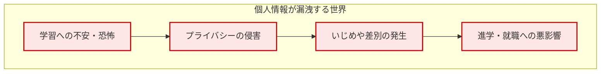
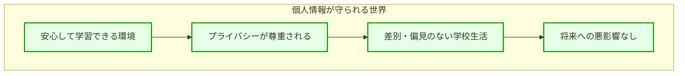
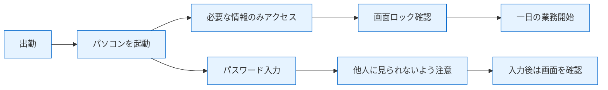
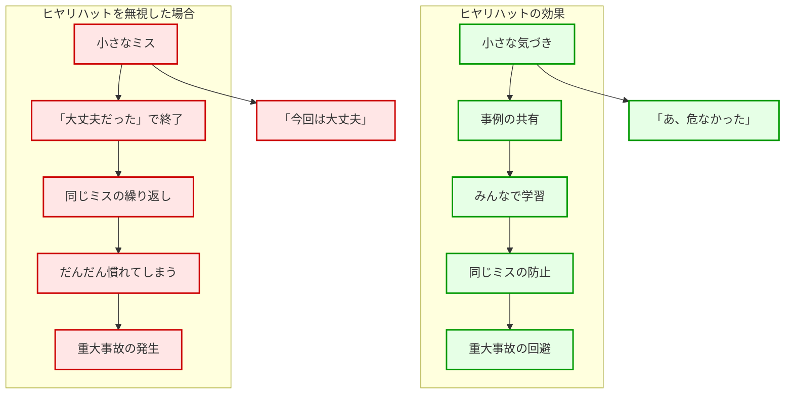
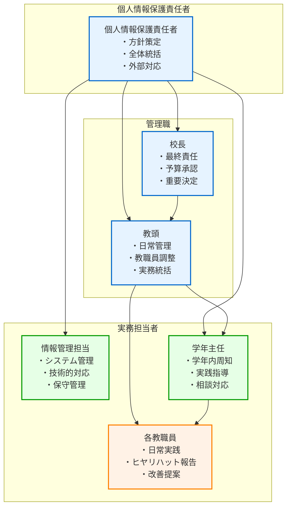
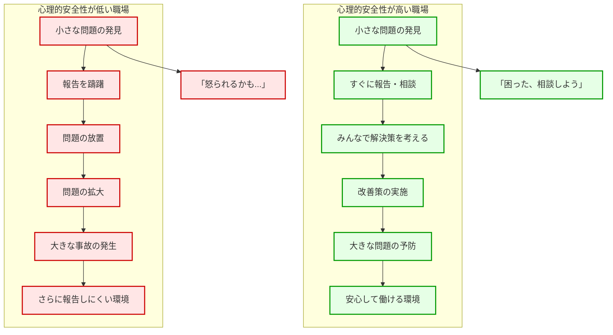

第7章で運用設計を、第8章で技術的対策を学んだ後、本章では**教職員の皆さんが児童生徒の個人情報を守るために必要な意識と体制づくり**について、実践的に解説します。

どれほど高度なシステムを導入しても、最終的に個人情報を扱うのは「人」です。教職員一人ひとりが個人情報保護の重要性を理解し、適切な行動を取ることで、初めて児童生徒の大切な個人情報が守られます。

# なぜ個人情報保護が重要なのか - 共通理解の構築

## 児童生徒の未来を守る責任

学校が保有する個人情報は、単なる「データ」ではありません。それは一人ひとりの児童生徒の **人格や尊厳、そして未来に直結する大切な情報** です。

**なぜ学校の個人情報保護が特別に重要なのでしょうか？**

これは、病院で患者の医療情報を守ることと同じように、学校では児童生徒の成長と学習に関わる極めて重要な情報を預かっているからです。






## 具体的な被害を理解する

**実際に個人情報が漏洩すると、児童生徒にどのような影響があるのでしょうか？**

### 健康情報の漏洩による深刻な被害
- アレルギー情報が漏洩：他の児童から「食べ物で死んでしまう子」と呼ばれ、いじめの対象に
- 発達障害に関する情報が漏洩：「特別扱いされている子」として差別的な扱いを受ける
- 服薬情報が漏洩：「薬を飲んでいる子」として偏見を持たれる

### 学習情報の漏洩による長期的影響
- 成績情報が漏洩：児童生徒間の序列意識が生まれ、学習意欲が低下
- 評価記録が漏洩：「問題児」のレッテルが貼られ、新しい環境でも偏見を持たれる
- テスト結果が漏洩：保護者間での比較や、児童生徒の自尊心への悪影響

### 家庭環境情報の漏洩による二次被害
- 経済状況の情報が漏洩：「貧乏な家の子」として差別やいじめの対象に
- 家族構成の情報が漏洩：ひとり親家庭への偏見や、複雑な家庭事情への配慮不足

**これらの被害は、一度発生すると取り戻すことができません。**

だからこそ、学校では「事故が起きてから対応する」のではなく、「事故を絶対に起こさない」という強い意識が必要なのです。

## 教職員の皆さんが果たすべき役割

**家庭で大切なものを守るのと同じ気持ちで**

家庭では、大切な書類（通帳、保険証、年金手帳など）を適切に管理し、他人に見せないよう注意深く扱います。学校での個人情報も、まさに同じように「各家庭の大切な情報」として扱う必要があります。

**医療従事者と同じ責任感で**

病院で働く医師や看護師が患者の情報を厳重に管理するのと同様に、教職員も児童生徒の情報を預かる専門職として、高い責任感を持って情報を扱う必要があります。

# 日常業務での個人情報取扱いルール

## 「3つの基本原則」で考える情報管理

複雑なルールを覚えるよりも、以下の3つの原則で判断することで、適切な個人情報保護が可能になります。

### 1. 「必要最小限の原則」- 本当に必要な情報だけを扱う

**具体例：成績処理の場面**
- ❌ 悪い例：クラス全体の成績を自宅に持ち帰って処理
- ✅ 良い例：必要な児童生徒の分だけを学校で処理

**具体例：保護者会の準備**
- ❌ 悪い例：全児童の個人情報を印刷して配布資料に添付
- ✅ 良い例：その会議で必要な情報のみを適切な形で共有

### 2. 「適切な場所の原則」- 情報を扱う場所を限定する

**具体例：個人情報を扱う場所**
- ✅ 適切な場所：職員室、校長室、鍵のかかる準備室
- ❌ 不適切な場所：廊下、保健室（来客がいる時）、家庭

**具体例：会話する場所**
- ✅ 適切な場所：個人情報について話す時は、他の人に聞こえない場所
- ❌ 不適切な場所：廊下、職員室でも他の人がいる時の大声での会話

### 3. 「確実な管理の原則」- 情報の所在を常に把握する

**具体例：書類の管理**
- ✅ 良い管理：「どの書類が、どこにあるか」を常に把握
- ❌ 悪い管理：「あの書類、どこに置いたっけ？」という状況

**具体例：デジタル情報の管理**
- ✅ 良い管理：ファイルを開いたら、作業後は確実に閉じる
- ❌ 悪い管理：画面を開いたまま席を離れる

## 具体的な場面別行動指針

### 朝の準備時間


**朝の個人情報保護チェックリスト**
- [ ] パスワード入力時、周囲に人がいないか確認
- [ ] 必要な情報以外は開かない
- [ ] 画面の角度を調整し、他人から見えないようにする
- [ ] 作業を中断する時は画面ロックを確認

### 授業中・児童生徒対応時
**個人情報を扱う際の注意点**

**良い例：保健室での対応**
- 他の児童生徒がいない時間に、健康記録を確認
- 相談内容は、必要最小限の人にのみ共有
- 記録は鍵のかかる場所に保管

**悪い例：廊下での対応**
- 他の児童生徒がいる前で、個人の成績や家庭状況について話す
- 大きな声で個人情報に関する内容を話す

### 放課後の事務処理時間
**効率的かつ安全な個人情報処理**

**書類作成時の注意**
1. **作業前の準備**
   - 必要な情報のみを手元に用意
   - 作業場所の安全確認（他人に見られない、鍵がかかる）
   - 時間の確保（急いで作業してミスを防ぐ）

2. **作業中の注意**
   - 集中して作業し、他の用事で中断しない
   - 間違いがないか、作業しながら確認
   - 印刷する場合は、プリンターまで付き添う

3. **作業後の確認**
   - 使用した情報は適切に保管
   - パソコンの画面は確実にロック
   - 机の上に個人情報が残っていないか確認

### 帰宅時の最終確認
**一日の終わりに行う個人情報保護の確認**

**デジタル情報の終了確認**
- [ ] 開いていたファイルはすべて閉じたか
- [ ] パソコンは適切にシャットダウンしたか
- [ ] USBメモリ等の記録媒体は適切に保管したか

**書類の整理確認**
- [ ] 机の上に個人情報が残っていないか
- [ ] 使用した書類は適切な場所に保管したか
- [ ] 鍵のかかる場所に保管すべきものは確実に保管したか

**環境の安全確認**
- [ ] 職員室や教室の戸締りは確実か
- [ ] 他の人が個人情報にアクセスできない状態か

# ヒヤリハット事例の共有と学習

## 「ヒヤリハット」とは何か

**ヒヤリハット**とは、「大きな事故にはならなかったが、一歩間違えば重大な問題になっていた出来事」のことです。

**なぜヒヤリハット事例が重要なのでしょうか？**

これは、交通安全と同じです。「事故が起きてから対策する」のではなく、「事故になりそうだった経験」を共有することで、同じような危険を未然に防ぐことができます。



## よくあるヒヤリハット事例と学習ポイント

### 事例1：「印刷物の取り忘れ」

**何が起きたか**
成績一覧表を印刷した後、プリンターに取りに行くのを忘れてしまい、30分後に他の先生が発見して教えてくれた。

**なぜ危険だったか**
- 他の先生や児童生徒が見る可能性があった
- 印刷物を紛失していた可能性があった
- 同じようなミスを繰り返す可能性があった

**学習ポイント**
- 印刷する時は、印刷と同時にプリンターに向かう
- 印刷物は数えて確認する
- 印刷後は、元の情報も適切に保管する

**みんなで考える改善策**
- 印刷前に「プリンターまで付き添う」を意識する
- 印刷物の枚数を事前に確認する
- プリンターのそばに「印刷物確認」のメモを貼る

### 事例2：「画面を開いたまま離席」

**何が起きたか**
個人情報が表示されたパソコン画面を開いたまま、急用で職員室を離れてしまった。戻ってみると、画面がそのまま表示されていた。

**なぜ危険だったか**
- 他の人が個人情報を見る可能性があった
- 画面の情報を写真撮影される可能性があった
- 「いつも画面を開いたまま」という習慣になる危険があった

**学習ポイント**
- 席を離れる時は、どんなに短時間でも画面ロックを行う
- 「ちょっとだけ」という気持ちが事故につながる
- 画面ロックは習慣として身に付ける

**みんなで考える改善策**
- 「席を立つ = 画面ロック」を合言葉にする
- 画面ロックの方法を全員で確認する
- お互いに気づいた時は声をかけ合う

### 事例3：「USBメモリの取り扱い」

**何が起きたか**
家庭訪問の準備のため、児童の情報をUSBメモリに入れて持ち帰ろうとした。帰宅途中で「これは適切な方法だったか？」と不安になった。

**なぜ危険だったか**
- USBメモリを紛失する可能性があった
- 家庭で適切に管理できない可能性があった
- 個人情報の持ち出しルールを確認していなかった

**学習ポイント**
- 個人情報の持ち出しは、事前に管理職と相談する
- 本当に持ち出しが必要かを検討する
- 持ち出す場合は、適切な方法を確認する

**みんなで考える改善策**
- 個人情報持ち出しのルールを明確にする
- 持ち出しが必要な場合の手順を決める
- 代替手段（学校での作業、リモートアクセス等）を検討する

## ヒヤリハット事例を活用した学習の進め方

### 1. 月1回の「ヒヤリハット共有会」

**進行方法**
1. **事例の共有**（10分）
   - 今月発生したヒヤリハット事例を共有
   - 「誰が悪い」ではなく「どうすれば防げるか」に焦点

2. **原因の分析**（10分）
   - なぜそのようなことが起きたか
   - 同じようなことは他でも起きうるか
   - システムや環境の問題はないか

3. **改善策の検討**（10分）
   - 個人でできる改善策
   - 学校全体で取り組む改善策
   - 必要なルールの見直し

4. **実行計画の決定**（5分）
   - 誰が、いつまでに、何を行うか
   - 次回の確認方法

### 2. 「学習型の雰囲気づくり」

**重要なポイント**
- **「責めない」文化**：ミスを報告しやすい環境を作る
- **「感謝する」文化**：ヒヤリハット事例を共有してくれたことに感謝
- **「学習する」文化**：みんなで学んで、みんなで改善する

### 3. 記録と活用

**記録の方法**
- 簡単な記録用紙を作成
- 日時、場所、状況、気づいたこと、改善案を記録
- 個人名は記録しない（プライバシーの保護）

**活用の方法**
- 新人研修での事例紹介
- 年間の振り返りでの改善確認
- 他校との情報共有（個人情報は削除）

# 個人情報保護責任者の役割と権限

## 個人情報保護責任者とは

**学校における個人情報保護責任者**は、児童生徒の個人情報を守るための「司令塔」的な役割を担う重要な職務です。

**なぜこの役割が必要なのでしょうか？**

これは、病院における「感染管理責任者」や、企業における「安全管理責任者」と同じように、専門的な知識と責任を持った人が中心となって、組織全体の個人情報保護を推進する必要があるからです。

## 個人情報保護責任者の具体的な役割

**個人情報保護責任者の仕事を身近な例で理解する**

個人情報保護責任者の仕事は、家庭での「家計管理」や学校での「保健担当の先生」の役割と似ています。家計管理では「お金の出入りを把握し、無駄遣いを防ぎ、将来に備える」ことが大切です。個人情報保護責任者も同様に、「情報の流れを把握し、漏洩を防ぎ、安全を守る」ことが主な仕事です。

### 1. 学校全体の個人情報保護の方針策定

**身近な例で考えると**
これは、家庭で「家族のルール」を決めるのと同じです。「お小遣いはいくらまで」「門限は何時まで」といったルールがあるように、学校でも「個人情報をどう扱うか」のルールが必要です。

**具体的にどんな仕事をするのか**

**方針作成の仕事**
- 学校独自の個人情報保護方針を作成する
- 「何を大切に守るか」「どうやって守るか」を明文化
- 保護者にも分かりやすい言葉で説明書を作成

**実際の作業例**
```
【方針策定の実際の作業】

4月の作業：
- 前年度の問題点を整理
- 今年度の重点目標を設定
- 教職員向けの説明資料作成

5月の作業：
- 保護者向け説明資料の作成
- 新任教職員向けのルールブック作成
- 緊急時の対応手順書の見直し

6月の作業：
- 年間研修計画の策定
- 定期点検スケジュールの作成
- 他校との情報交換会の企画
```

**ルール整備の仕事**
- 日常業務での個人情報の扱い方ルール
- パソコンの使い方、メールの送り方、書類の保管方法
- 「迷った時はこうする」という判断基準の作成

**実際の作業例**
```
【作成するルールの例】

パソコン使用ルール：
□ ログイン時のパスワード管理方法
□ 席を離れる時の画面ロック方法
□ 個人情報を画面に表示する時の注意点
□ システム終了時の確認項目

書類管理ルール：
□ 個人情報が記載された書類の保管場所
□ 書類を持ち出す時の手続き
□ 不要になった書類の廃棄方法
□ コピー・印刷時の注意点
```

**年間計画策定の仕事**
- 1年間を通じた個人情報保護活動の計画
- 研修、点検、見直しのスケジュール
- 予算や人員の配置計画

### 2. 教職員への指導と支援

**身近な例で考えると**
これは、学校で「新しい先生に授業のやり方を教える」のと同じです。個人情報保護についても、知らない人に教え、困っている人を助け、みんなが安心して仕事できるよう支援します。

**研修・教育の仕事**
教職員の皆さんが個人情報保護について正しく理解し、適切に行動できるようになるための教育を行います。

**実際の研修内容例**
```
【月1回の研修例（各回30分）】

4月：基本のき
- 「なぜ個人情報保護が大切なのか」
- 「学校ではどんな個人情報を扱っているか」
- 「もし漏洩したらどうなるか」

5月：パソコンの安全な使い方
- パスワードの作り方・管理方法
- 画面ロックの操作方法
- 安全なインターネット利用方法

6月：メールの安全な使い方
- 宛先確認の重要性（CC/BCCの違い）
- 添付ファイルの注意点
- 怪しいメールの見分け方

7月：書類・USBメモリの管理
- 個人情報書類の適切な保管方法
- USBメモリの安全な使い方
- 持ち出し・持ち帰り時のルール
```

**日常的な相談対応**
教職員の皆さんからの質問や相談に、分かりやすく答える仕事です。

**よくある相談と対応例**
```
【相談例1】
先生：「家庭訪問のため、児童の情報を持ち帰りたいのですが...」

責任者の対応：
「まず、本当に持ち帰りが必要か一緒に考えましょう。
もし必要なら、以下の手順で安全に行いましょう：
1. 必要最小限の情報のみに絞る
2. USBメモリは暗号化されたものを使用
3. 持ち帰り記録簿に記入
4. 使用後は確実に削除」

【相談例2】
先生：「パソコンの調子が悪くて、画面ロックがうまくできません」

責任者の対応：
「それは困りましたね。すぐに対応しましょう。
1. まず代替の画面ロック方法をお教えします
2. IT担当の先生に修理を依頼します
3. 修理中は特に注意して使用してください
4. 必要なら一時的に別のパソコンを準備します」
```

**ヒヤリハット事例の収集・分析**
「ちょっと危なかった」という出来事を集めて、大きな事故を防ぐ仕事です。

**収集・分析の具体的方法**
```
【ヒヤリハット収集の仕組み】

収集方法：
- 月1回の報告会での事例共有
- 匿名で投稿できるボックスの設置
- 日常会話での気軽な情報収集

分析の観点：
- なぜその事例が発生したか（原因分析）
- 同じことが他でも起きる可能性（横展開の検討）
- 防止策として何ができるか（改善策の検討）

活用方法：
- 研修での事例紹介（個人名は伏せる）
- ルールの見直し材料として活用
- 他校との情報共有（参考事例として）
```

### 3. インシデント発生時の対応

**身近な例で考えると**
これは、学校で「けがや事故が起きた時の保健の先生」の対応と同じです。まず応急処置をして、被害が広がらないようにし、必要な人に連絡を取ります。

**初動対応（最初の30分が勝負）**
個人情報に関する事故や問題が発生した時、素早く適切に対応する仕事です。

**実際の対応手順**
```
【メール誤送信が発生した場合】

発覚から5分以内：
□ 誤送信の内容と範囲の確認
□ 送信者からの詳細状況聞き取り
□ 被害拡大防止の緊急措置指示

発覚から15分以内：
□ 校長・教頭への報告
□ 受信者への回収・削除依頼連絡
□ 教育委員会への第一報

発覚から30分以内：
□ 詳細な被害状況の把握
□ 保護者への連絡準備
□ 再発防止策の検討開始
```

**被害拡大防止措置**
問題が大きくならないよう、素早く手を打つ仕事です。

**具体的な防止措置例**
```
【USBメモリ紛失の場合】

緊急対応：
- 紛失したUSBメモリの内容確認
- 同じ情報にアクセスできる経路の一時停止
- 警察への遺失物届提出
- 拾得者向けの連絡先公表

中期対応：
- 影響を受ける保護者への個別連絡
- 新しいセキュリティ対策の緊急導入
- 全教職員への緊急研修実施

長期対応：
- USBメモリ使用ルールの全面見直し
- 代替手段（クラウド等）の検討
- 定期的な点検制度の強化
```

### 4. 継続的な改善活動

**身近な例で考えると**
これは、家庭での「家計の定期的な見直し」と同じです。「今月の支出はどうだったか」「来月はどこを改善するか」を定期的にチェックして、より良い状態にしていきます。

**定期的な評価・点検の仕事**
学校の個人情報保護の取り組みが効果的に機能しているかを定期的にチェックします。

**評価・点検の具体的方法**
```
【月次点検の項目】

システム面のチェック：
□ パスワード変更状況の確認
□ アクセスログの異常有無確認
□ バックアップの正常動作確認
□ セキュリティソフトの更新状況確認

運用面のチェック：
□ 個人情報書類の保管状況確認
□ 教職員のルール遵守状況確認
□ 研修参加状況・理解度確認
□ ヒヤリハット事例の発生状況確認

【四半期評価の項目】

効果測定：
- インシデント発生件数の推移
- 教職員アンケートによる意識調査
- 保護者からの意見・要望の整理
- 他校との比較による相対評価

改善計画：
- 課題の優先順位付け
- 次四半期の重点目標設定
- 必要な予算・人員の検討
- 実施スケジュールの調整
```

**新しい脅威・課題への対応**
世の中の変化に合わせて、新しい危険や問題に対応する仕事です。

**対応の具体例**
```
【新しい脅威への対応例】

新型コロナウイルス対応時：
- リモートワークでの個人情報取扱いルール策定
- 家庭からの安全なシステムアクセス方法検討
- オンライン授業での個人情報保護対策

AI技術の普及への対応：
- ChatGPT等への個人情報入力禁止ルール策定
- AI技術を活用した新しいセキュリティ対策検討
- 教職員向けのAI利用ガイドライン作成

スマートフォン普及への対応：
- 教職員の個人スマホでの業務利用ルール
- 写真撮影・SNS投稿での注意事項
- 緊急時の連絡手段としての活用方法
```

**他校の成功事例研究・導入**
他の学校の良い取り組みを学んで、自校でも活用する仕事です。

**成功事例研究の方法**
```
【情報収集の方法】

定期的な情報収集：
- 教育委員会主催の研修会参加
- 他校との情報交換会開催
- 専門機関のセミナー・勉強会参加
- 関連書籍・Webサイトでの情報収集

事例の評価・選別：
- 自校の状況との適合性検討
- 導入コスト・効果の試算
- 教職員の負担増加度の評価
- 段階的導入の可能性検討

導入・評価：
- パイロット実施による効果検証
- 教職員からの意見・感想収集
- 本格導入・継続実施の判断
- 他校への情報提供・恩返し
```

## 個人情報保護責任者の権限

### 1. 個人情報保護に関する決定権

**具体的な権限**
- 個人情報の取扱いルールの策定・変更
- 個人情報保護研修の実施決定
- 個人情報保護に関する予算要求

**実際の場面での活用例**
- 「新しいクラウドサービスを導入する前に、個人情報保護の観点から事前審査を行う」
- 「全教職員に対して、緊急の個人情報保護研修を実施する」
- 「セキュリティ対策強化のために、必要な機器の購入を予算要求する」

### 2. 教職員への指導権

**具体的な権限**
- 個人情報保護ルールの遵守指導
- 不適切な取扱いに対する改善指導
- 研修参加の義務付け

**実際の場面での活用例**
- 「個人情報の不適切な取扱いを発見した場合の改善指導」
- 「新任教職員への個人情報保護研修の受講義務付け」
- 「個人情報保護ルールの理解度確認テストの実施」

### 3. 情報収集と調査権

**具体的な権限**
- 個人情報保護の実施状況の調査
- インシデント発生時の事実関係の調査
- 改善が必要な事項の特定

**実際の場面での活用例**
- 「定期的な個人情報保護状況の点検」
- 「ヒヤリハット事例の詳細な聞き取り調査」
- 「システムの個人情報保護対策の現状確認」

## 個人情報保護責任者を中心とした体制づくり



# 継続的な研修と意識啓発活動

## 「年間を通じた学習計画」の立て方

個人情報保護は一度学んで終わりではなく、継続的な学習が必要です。しかし、忙しい教職員の皆さんが無理なく続けられる学習計画を立てることが重要です。

### 年間学習計画の全体像

```mermaid
gantt
    title 個人情報保護 年間学習計画
    dateFormat  MM
    axisFormat  %m月
    
    section 基盤づくり期
    基本確認・新任研修           :done, apr, 04, 1M
    実践技術習得                :done, may, 05, 1M
    事例学習・改善検討          :done, jun, 06, 1M
    
    section 実践強化期
    夏休み前特別対策            :done, jul, 07, 1M
    夏休み期間（自主学習）      :aug, 08, 1M
    新学期見直し                :done, sep, 09, 1M
    
    section 応用・発展期
    中間評価・課題整理          :done, oct, 10, 1M
    緊急時対応訓練              :done, nov, 11, 1M
    応用技術・新技術学習        :done, dec, 12, 1M
    
    section 総括・準備期
    年度末準備                  :done, jan, 01, 1M
    引き継ぎ・データ整理        :done, feb, 02, 1M
    年間総括・次年度準備        :done, mar, 03, 1M
```



### 月別詳細学習計画

```mermaid
graph TB
    subgraph 基盤づくり期[「4-6月：基盤づくり期」]
        Apr[4月：基本の確認<br/>・個人情報保護の重要性再認識<br/>・新年度ルールの確認<br/>・新任教職員研修<br/>・年間計画の共有]
        May[5月：実践技術習得<br/>・パソコン安全操作<br/>・メール送受信方法<br/>・ファイル管理技術<br/>・画面ロック習慣化]
        Jun[6月：事例学習<br/>・他校事例の紹介<br/>・ヒヤリハット分析<br/>・改善策の検討<br/>・相互学習の促進]
    end
    
    subgraph 実践強化期[「7-9月：実践強化期」]
        Jul[7月：夏休み前対策<br/>・長期休業中の注意点<br/>・持ち帰り作業ルール<br/>・家庭作業での安全確保<br/>・緊急連絡体制確認]
        Aug[8月：自主学習期間<br/>・個別スキルアップ<br/>・オンライン研修参加<br/>・専門書籍での学習<br/>・他校視察・交流]
        Sep[9月：新学期見直し<br/>・1学期振り返り<br/>・新課題への対応<br/>・システム操作確認<br/>・改善計画の修正]
    end
    
    subgraph 応用発展期[「10-12月：応用・発展期」]
        Oct[10月：中間評価<br/>・半年間の効果測定<br/>・課題の整理<br/>・成功事例の共有<br/>・後半戦計画調整]
        Nov[11月：緊急時訓練<br/>・インシデント対応訓練<br/>・報告連絡相談演習<br/>・保護者対応練習<br/>・危機管理体制確認]
        Dec[12月：応用・新技術<br/>・新しい脅威への対応<br/>・AI・クラウド活用<br/>・効率化ツールの学習<br/>・年末の総点検]
    end
    
    subgraph 総括準備期[「1-3月：総括・準備期」]
        Jan[1月：年度末準備<br/>・年度末処理の注意点<br/>・データ引き継ぎ方法<br/>・適切な廃棄・削除<br/>・新年度準備開始]
        Feb[2月：引き継ぎ整理<br/>・個人情報の整理<br/>・システムデータ整理<br/>・文書・記録の整理<br/>・引き継ぎ資料作成]
        Mar[3月：年間総括<br/>・1年間の成果評価<br/>・課題と改善点整理<br/>・次年度計画策定<br/>・新任者向け準備]
    end
    
    Apr --> May --> Jun
    Jun --> Jul --> Aug --> Sep
    Sep --> Oct --> Nov --> Dec
    Dec --> Jan --> Feb --> Mar
    Mar --> Apr
    
    classDef foundation fill:#e6ffe6,stroke:#009900,stroke-width:2px
    classDef practice fill:#fff2e6,stroke:#ff8000,stroke-width:2px
    classDef advanced fill:#e6f3ff,stroke:#0066cc,stroke-width:2px
    classDef summary fill:#f0e6ff,stroke:#9900cc,stroke-width:2px
    
    class Apr,May,Jun foundation
    class Jul,Aug,Sep practice
    class Oct,Nov,Dec advanced
    class Jan,Feb,Mar summary
```



### 各月の具体的な実施内容

**【4月：基本の確認】新年度のスタートを確実に**
- **目標**：全教職員が個人情報保護の重要性を再認識し、新年度のルールを理解する
- **対象**：全教職員（新任者は重点実施）
- **時間**：30分×2回
- **内容**：
  - なぜ児童生徒の個人情報保護が重要なのか
  - 昨年度の事例から学ぶ教訓
  - 新年度のルール変更点の説明
  - 年間学習計画の共有

**【5月：実践的な技術習得】日常業務で使える技術を身につける**
- **目標**：基本的なセキュリティ技術を全員が確実に習得する
- **対象**：全教職員（技術レベル別グループ実施）
- **時間**：20分×3回
- **内容**：
  - 安全なパスワードの作成・管理方法
  - 画面ロックの確実な実行方法
  - メール送信時の確認手順
  - ファイルの安全な保存・共有方法

**【6月：ヒヤリハット事例の学習】失敗から学ぶ予防策**
- **目標**：実際の事例から具体的な危険性と対策を学ぶ
- **対象**：全教職員
- **時間**：25分×2回
- **内容**：
  - 他校で発生した情報漏洩事例の紹介
  - 自校で発生したヒヤリハット事例の分析
  - 「もし自分だったら」の観点での検討
  - 具体的な改善策の全員での検討

**【7月：夏休み前の特別対策】長期休業を安全に過ごす**
- **目標**：夏休み期間中の個人情報保護を確実にする
- **対象**：全教職員
- **時間**：20分×2回
- **内容**：
  - 長期休業中の個人情報管理の注意点
  - 持ち帰り作業時の安全な方法
  - 家庭での作業環境の整備方法
  - 緊急時の連絡体制の確認

## 効果的な研修の進め方

### 1. 「参加型」の研修スタイル

**従来の研修の問題点**
- 一方的な説明で眠くなる
- 実際の業務との関連が分からない
- 覚えることが多すぎて実践できない

**効果的な研修の特徴**
- 実際の業務場面を想定した練習
- 参加者同士の意見交換
- 具体的な改善策の検討

**具体的な研修例：メール誤送信防止研修**

**従来の方法**
「メール誤送信は危険です。送信前に宛先を確認しましょう」という説明

**参加型の方法**
1. **体験**：実際にメールを作成し、送信前の確認を実践
2. **共有**：「どんな時に誤送信しそうになるか」を参加者で共有
3. **練習**：誤送信を防ぐための具体的な操作方法を練習
4. **約束**：「明日から実践すること」を一人ひとりが宣言

### 2. 「短時間・高頻度」の学習スタイル

**効果的な時間配分**
- 1回の研修時間：15-20分
- 実施頻度：月1回
- 年間回数：10-12回

**短時間研修の具体例**

**第1回：パスワード管理（15分）**
- 現在のパスワードの安全性チェック（5分）
- 安全なパスワードの作り方（5分）
- 実際にパスワードを変更してみる（5分）

**第2回：画面ロックの習慣化（15分）**
- 画面ロックの操作方法確認（5分）
- 「席を立つ時の合言葉」を決める（5分）
- お互いに声をかけ合う練習（5分）

**第3回：USBメモリの安全管理（15分）**
- USBメモリの危険性確認（5分）
- 暗号化の方法と操作（5分）
- 紛失時の対応手順確認（5分）

### 3. 「実践重視」の学習内容

**知識中心の学習の問題**
- 覚えることが多すぎる
- 実際の場面で使えない
- 時間が経つと忘れてしまう

**実践重視の学習の特徴**
- 「なぜ」よりも「どうやって」に重点
- 実際の操作を繰り返し練習
- 日常業務での活用方法を具体的に説明

**実践重視の学習例**

**テーマ：印刷物の安全管理**

**知識中心の説明**
「印刷物には個人情報が含まれているため、適切な管理が必要です。情報漏洩のリスクを理解し、セキュリティ意識を高めましょう」

**実践重視の説明**
「印刷ボタンを押したら、すぐにプリンターに向かいます。印刷物を手に取ったら、枚数を数えます。印刷物は、鍵のかかる場所に保管します。この3つのステップを実際にやってみましょう」

## 意識啓発活動の工夫

### 1. 「見える化」による意識向上

**個人情報保護の取り組み状況を見える化**

**月間目標の掲示**
- 今月の個人情報保護目標を職員室に掲示
- 達成状況を定期的に更新
- 成果を数値で表示

**成功事例の共有**
- 「今月のグッドプラクティス」を紹介
- 他校の成功事例の掲示
- 改善の効果を具体的に紹介

### 2. 「参加型」の意識啓発

**アイデア募集とコンテスト**
- 「個人情報保護のアイデア募集」
- 「効果的な取り組み方法のコンテスト」
- 「標語・スローガンの募集」

**チーム活動での取り組み**
- 学年単位での改善活動
- 分掌単位での目標設定
- 全校での共通目標への挑戦

### 3. 「楽しく学ぶ」工夫

**クイズ形式の学習**
- 「個人情報保護クイズ」の定期実施
- 正解者への小さな景品
- チーム戦での競争要素

**体験型の学習**
- 「情報漏洩シミュレーション」
- 「セキュリティ対策の体験」
- 「実際のシステムを使った練習」

# 報告しやすい組織文化の醸成

## 「心理的安全性」の重要性

個人情報保護において最も重要なのは、**問題や不安を感じた時に、すぐに相談・報告できる環境**です。

**なぜ報告しやすい環境が重要なのでしょうか？**

これは、医療現場における「インシデント報告制度」と同じです。小さな問題や気づきを早期に共有することで、大きな事故を防ぐことができます。

**心理的安全性とは**
- 失敗やミスを報告しても責められない
- 分からないことを「分からない」と言える
- 改善提案を自由に発言できる
- お互いに助け合える



## 報告しやすい環境づくりの具体的方法

### 1. 「学習型」の対応方針

**問題発生時の対応方針**
- **「誰が悪いか」ではなく「どうすれば防げるか」**
- **「責任追及」ではなく「原因分析」**
- **「個人の反省」ではなく「システムの改善」**

**具体的な対応例**

**問題発生時の悪い対応**
「なぜこんなミスをしたのですか？注意が足りません。今後気をつけてください」

**問題発生時の良い対応**
「報告してくれてありがとうございます。同じようなことが起きないよう、一緒に原因を考えて改善策を検討しましょう」

### 2. 「相談しやすい仕組み」の構築

**相談窓口の設置**
- 個人情報保護責任者への直接相談
- 匿名での相談・報告制度
- 複数の相談ルートの確保

**相談しやすい工夫**
- 相談時間の明確化（毎日○時から○時まで）
- 相談場所の確保（プライバシーが守られる場所）
- 相談方法の選択肢（対面・電話・メール・書面）

### 3. 「フィードバック」の充実

**報告・相談後のフィードバック**
- 相談内容への迅速な対応
- 改善策の実施状況の報告
- 成果の共有と感謝の表明

**フィードバックの例**
「先日ご相談いただいた件について、以下のような改善策を実施しました。おかげで同じような問題を未然に防ぐことができました。貴重な情報をありがとうございました」

## 組織全体での取り組み

### 1. 管理職のリーダーシップ

**校長・教頭の役割**
- 個人情報保護の重要性を継続的に発信
- 報告しやすい環境づくりへの積極的な関与
- 成功事例の積極的な評価・表彰

**管理職の具体的な行動例**
- 定期的な個人情報保護に関するメッセージの発信
- ヒヤリハット事例を報告した教職員への感謝の表明
- 個人情報保護の取り組み状況の定期的な確認

### 2. 教職員同士の相互支援

**同僚としての支援**
- 困っている同僚への積極的な声かけ
- 知識や経験の共有
- お互いの取り組みへの理解と協力

**相互支援の具体例**
- 「パソコンの操作が分からない」という同僚への操作指導
- 「この情報の扱い方が分からない」という相談への助言
- 「画面ロックを忘れそう」という同僚への声かけ

### 3. 継続的な改善活動

**PDCA サイクルによる継続的改善**
- **Plan（計画）**：個人情報保護の年間計画策定
- **Do（実行）**：計画に基づいた研修・対策の実施
- **Check（確認）**：取り組み状況の定期的な評価
- **Action（改善）**：評価結果に基づく改善策の実施

**改善活動の具体例**
- 四半期ごとの個人情報保護状況の点検
- 年1回の教職員アンケートによる課題の把握
- 他校の成功事例の収集と導入検討

---

# 【第10章の確認事項】

本章の内容を踏まえ、以下の重要なポイントが理解できているか確認してください。

## ✅ 個人情報保護の重要性理解確認

**Q1. 児童生徒の個人情報保護が特別に重要な理由を理解しているか？**
- [ ] 個人情報は児童生徒の人格・尊厳・未来に直結する大切な情報であることを理解している
- [ ] 情報漏洩が児童生徒に与える具体的な被害（いじめ、差別、進学・就職への悪影響）を認識している
- [ ] 一度発生した被害は取り戻すことができないため、予防が最重要であることを把握している

**Q2. 教職員の役割と責任を理解しているか？**
- [ ] 家庭の大切な情報を預かる責任の重さを理解している
- [ ] 医療従事者と同様の高い責任感が必要であることを認識している
- [ ] 個人情報保護は全教職員が果たすべき基本的な職務であることを把握している

## ✅ 日常業務での実践方法理解確認

**Q3. 3つの基本原則を理解し実践できるか？**
- [ ] 「必要最小限の原則」- 本当に必要な情報だけを扱う方法を理解している
- [ ] 「適切な場所の原則」- 情報を扱う場所を限定する重要性を認識している
- [ ] 「確実な管理の原則」- 情報の所在を常に把握する方法を把握している

**Q4. 場面別の行動指針を理解しているか？**
- [ ] 朝の準備時間での個人情報保護チェックリストを理解している
- [ ] 授業中・児童生徒対応時の注意点を認識している
- [ ] 放課後の事務処理と帰宅時の確認事項を把握している

## ✅ ヒヤリハット事例の活用理解確認

**Q5. ヒヤリハットの重要性と活用方法を理解しているか？**
- [ ] ヒヤリハットが重大事故防止に重要な役割を果たすことを理解している
- [ ] 具体的なヒヤリハット事例（印刷物取り忘れ、画面開放離席、USB取り扱い）から学ぶポイントを認識している
- [ ] ヒヤリハット事例を活用した学習の進め方を把握している

**Q6. 学習型組織づくりの方法を理解しているか？**
- [ ] 月1回のヒヤリハット共有会の進行方法を理解している
- [ ] 「責めない」「感謝する」「学習する」文化づくりの重要性を認識している
- [ ] 記録と活用の適切な方法を把握している

## ✅ 個人情報保護責任者の役割理解確認

**Q7. 個人情報保護責任者の役割と権限を理解しているか？**
- [ ] 学校全体の個人情報保護方針策定の重要性を理解している
- [ ] 教職員への指導・支援・相談対応の具体的内容を認識している
- [ ] インシデント発生時の対応と継続的改善活動の必要性を把握している

**Q8. 個人情報保護責任者を中心とした体制を理解しているか？**
- [ ] 管理職（校長・教頭）の役割と責任を理解している
- [ ] 実務担当者（情報管理担当・学年主任）の具体的業務を認識している
- [ ] 各教職員の日常実践・報告・改善提案の重要性を把握している

## ✅ 継続的な研修と意識啓発理解確認

**Q9. 効果的な研修の進め方を理解しているか？**
- [ ] 年間を通じた学習計画の立て方を理解している
- [ ] 「参加型」「短時間・高頻度」「実践重視」の研修スタイルを認識している
- [ ] 知識中心ではなく実践重視の学習内容の重要性を把握している

**Q10. 意識啓発活動の工夫を理解しているか？**
- [ ] 「見える化」による意識向上の方法を理解している
- [ ] 「参加型」の意識啓発（アイデア募集、チーム活動）の効果を認識している
- [ ] 「楽しく学ぶ」工夫（クイズ、体験型学習）の重要性を把握している

## ✅ 報告しやすい組織文化理解確認

**Q11. 心理的安全性の重要性を理解しているか？**
- [ ] 問題や不安を感じた時にすぐに相談・報告できる環境の重要性を理解している
- [ ] 失敗やミスを報告しても責められない環境づくりの必要性を認識している
- [ ] 小さな問題の早期共有が大きな事故防止につながることを把握している

**Q12. 報告しやすい環境づくりの方法を理解しているか？**
- [ ] 「学習型」の対応方針（責任追及ではなく原因分析）を理解している
- [ ] 相談しやすい仕組み（相談窓口、匿名制度、複数ルート）の重要性を認識している
- [ ] 報告・相談後の適切なフィードバック方法を把握している

## ✅ 組織全体での取り組み理解確認

**Q13. 管理職のリーダーシップを理解しているか？**
- [ ] 校長・教頭の個人情報保護に関する役割と責任を理解している
- [ ] 継続的な発信と報告しやすい環境づくりへの関与の重要性を認識している
- [ ] 成功事例の評価・表彰による動機づけの効果を把握している

**Q14. 継続的な改善活動を理解しているか？**
- [ ] PDCAサイクルによる継続的改善の重要性を理解している
- [ ] 教職員同士の相互支援の具体的方法を認識している
- [ ] 定期的な評価・点検・改善の必要性を把握している

---

**すべての項目にチェックが入らない場合は、該当箇所を再度読み返すことをお勧めします。**

特に重要なのは、**個人情報保護は技術的対策だけでなく、教職員一人ひとりの意識と行動が最も重要**であることと、**報告しやすい組織文化が個人情報保護の成否を決める**ことの理解です。また、**継続的な学習と改善活動が、持続可能な個人情報保護体制を構築する**ことも確認してください。