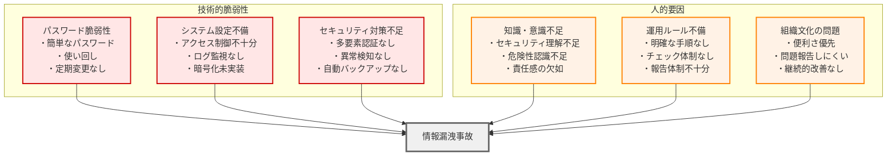
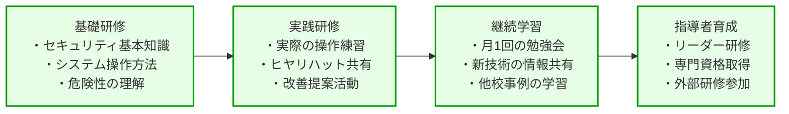
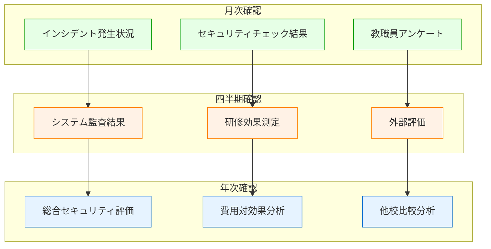

第1章から第10章まで、校務DXと個人情報保護について理論的な側面を学んできました。本章では、**実際に学校で発生した個人情報漏洩事例**を詳しく分析し、そこから得られる教訓を実践的に活用する方法について解説します。

**なぜ事例から学ぶことが重要なのでしょうか？**

これは、交通安全教育で実際の事故事例を学ぶのと同じです。理論だけでは見えない「現実に起こりうる危険」を具体的に理解し、効果的な対策を立てることができます。

**身近な例で考えてみましょう**

家庭で火事が起きた時のことを考えてください。「火事は危険」という知識だけでは、実際に火事を防ぐことはできません。しかし、「コンロの消し忘れで火事になった事例」「ストーブに洗濯物が落ちて火事になった事例」など具体的な事例を知ることで、日常生活での注意点が明確になります。

学校での個人情報漏洩も同じです。具体的な事例を知ることで、「どこに危険が潜んでいるか」「どうすれば防げるか」が明確になるのです。

**重要な視点：事例は「他人事」ではありません**

これから紹介する事例は、「特別な学校」で起きた「特別な事故」ではありません。どの学校でも起こりうる、身近で現実的な問題です。「うちの学校は大丈夫」ではなく、「明日は我が身」という気持ちで読んでください。

# 実際に発生した学校での情報漏洩事例分析

## 事例1：A小学校「パスワード使い回しによる大規模流出」

### 事故の概要
**発生時期**：2023年春
**被害規模**：全校児童240名の個人情報が流出
**発覚までの期間**：約2週間

### 事故の経緯

**第1段階：簡単すぎるパスワードが原因で侵入される**

**何が起きたか**
- 教職員が校務システムで使っていたパスワードが「123456」
- しかも、このパスワードを他のシステムでも使い回していた
- 悪意のある人がインターネット経由で簡単にシステムに侵入

**身近な例で理解する**
これは、家の鍵を「123456」という番号の南京錠にして、しかも玄関、勝手口、物置すべてに同じ南京錠を使っているようなものです。泥棒にとっては「入ってください」と言っているのと同じです。

**パスワードについて詳しく説明**

**パスワードとは何か**
パスワードとは、コンピューターのシステムに「あなたが本当に正しい利用者か」を確認するための「合言葉」です。銀行のATMで使う暗証番号と基本的には同じものです。

**なぜ「123456」が危険なのか**
- 「123456」は世界で最も多く使われているパスワードです
- 悪意のある人は、まず「123456」「password」「111111」などの簡単なパスワードを試します
- つまり、泥棒が「まず最初にこの鍵を試してみよう」と考える鍵を使っているのです

**「使い回し」の危険性**
- 一つのパスワードを覚えるのが楽だからと、いろいろな場所で同じパスワードを使うこと
- 例：メールのパスワードも、成績管理システムのパスワードも、全部「123456」
- 一箇所で盗まれると、他の場所も全部開けられてしまいます
- 家の鍵、車の鍵、金庫の鍵、全部同じにするのと同じ危険性です

**なぜこんなことが起きたか**
- 「覚えやすいパスワードの方が便利」という安易な考え
- 「学校のシステムを狙う人はいない」という油断
- パスワードの重要性についての理解不足
- 「面倒だから同じパスワードにしよう」という手抜きの発想

**第2段階：2週間も気づかずに被害が拡大**

**何が起きたか**
- 侵入した悪意のある人が、約2週間もの間、こっそりと情報を盗み続けた
- 児童の成績、アレルギーなどの健康情報、家庭の経済状況まで大量に盗まれた
- 学校の誰も異常に気づかず、いつも通り仕事を続けていた

**身近な例で理解する**
これは、泥棒が家に侵入して、毎日少しずつ貴重品を盗んでいるのに、家族が全く気づかない状況です。「あれ？通帳がない」「印鑑がない」と気づいた時には、既に大きな被害を受けてしまっています。

**なぜ気づけなかったか - 詳しい説明**

**「アクセスログ」がなかった**
- アクセスログとは：「誰が、いつ、どのシステムを使ったか」を記録する仕組み
- 例えば、図書館の貸出カードのように「○月○日 △時△分 □□先生が成績システムを使用」という記録
- この記録があれば「深夜3時に誰かがアクセスしている。これは変だ」と気づけます
- A小学校にはこの仕組みがありませんでした

**「異常検知システム」がなかった**
- 異常検知システムとは：普段と違う使い方を自動的に見つける仕組み
- 例：「いつもは平日の日中しか使わないのに、深夜に使われている」
- 例：「いつもは校内からしかアクセスしないのに、海外から接続されている」
- 銀行のATMで「いつもと違う場所で使われた」時に確認の連絡が来るのと同じです

**定期的なチェックの習慣がなかった**
- 車の定期点検のように、システムの安全性を定期的に確認する習慣がありませんでした
- 例：月に1回「変な使い方をされていないか」「新しい利用者が勝手に追加されていないか」などを確認
- この習慣があれば、もっと早く発見できたはずです

**第3段階：保護者からの連絡で初めて事態が発覚**

**何が起きたか**
- ある保護者から「うちの子の情報がインターネットに出ている」という連絡
- 調べてみると、盗まれた個人情報がインターネットの闇市場で売られていた
- 慌てて全校保護者への緊急説明会を開催

**身近な例で理解する**
これは、近所の人から「お宅の家族の情報が変な場所で売られているよ」と教えてもらって、初めて泥棒被害に気づくようなものです。被害を受けた本人が最後に知るという、最悪の状況です。

**「闇市場」について詳しく説明**

**闇市場とは何か**
- インターネット上で、違法な情報や商品が売買される場所
- 一般の人は普通に検索しても見つからない、隠された場所
- 個人情報、クレジットカード情報、偽造品などが売られています

**なぜ個人情報が売られるのか**
- 悪意のある人が、詐欺や嫌がらせに使うため
- 例：「この子はアレルギーがある」という情報を使って、わざと危険な食べ物を送る
- 例：「この家庭は経済的に困っている」という情報を使って、お金を騙し取ろうとする

**なぜこんなことになったか**
- 学校側に被害を発見する仕組みがなかった
- 外部の人の方が先に異常に気づいてしまった
- 「まさか自分の学校が狙われるとは思わなかった」という甘い認識
- 「学校の情報は価値がない」という間違った思い込み

**なぜ学校の情報が狙われるのか**
- 学校の情報は「守りが甘い」と思われがち
- 銀行や企業と比べて、セキュリティ対策が不十分
- 子どもの情報は「将来長く使える」ため価値が高い
- 教職員は「善意の人」が多いため、騙しやすいと思われている

### この事故で実際に起きた深刻な被害

**児童とその家族への直接的な被害**

**いたずら電話の被害**
- 流出した電話番号に、知らない人からいたずら電話がかかってくる
- 特に夜中や早朝にかかってきて、家族が眠れない
- 「○○ちゃんの家でしょ？」と子どもの名前を知っている不審な電話

**健康情報を悪用した嫌がらせ**
- アレルギーのある児童の家に、わざとアレルゲン（アレルギーの原因となる食べ物）が送りつけられる
- 「食べ物で死んじゃう子」などの心ないメッセージが届く
- 児童が外出することを怖がるようになる

**家庭のプライバシー侵害**
- 「あの家は生活が苦しいらしい」などの経済状況に関する噂が地域に広まる
- 児童が「貧乏な家の子」などと言われ、いじめの対象になる
- 保護者が近所付き合いを避けるようになる

**学校運営への深刻な影響**

**業務の完全停止**
- 240名の保護者一人ひとりに対する個別謝罪訪問で、約2ヶ月間本来の教育業務が停滞
- 校長・教頭が連日謝罪対応に追われ、学校運営がストップ
- 新しい安全なシステムが導入されるまで、すべての成績処理や事務作業を手作業で実施

**教職員への精神的・身体的な影響**
- 事故の責任を感じた教職員が深刻な精神的負担を抱える
- 「自分のせいで子どもたちが被害を受けた」という自責の念
- 実際に2名の教職員が体調を崩して休職、1名が退職

**地域社会全体への影響**

**メディアでの大きな報道**
- 地域のテレビ・新聞で連日大きく報道される
- 学校名や校長名が公表され、地域での信頼失墜
- 「あの学校は危険」というイメージが定着

**教育行政への波及**
- 教育委員会による緊急監査で、他の問題も発覚
- 近隣の全学校で類似システムの緊急点検を実施
- 地域全体のIT予算の見直しと追加投資が必要に

**保護者・地域住民の学校不信**
- 「学校に個人情報を預けるのが怖い」という保護者の声
- 転校を検討する家庭が複数発生
- 地域住民からの学校に対する厳しい視線

## 事例2：B中学校「メール誤送信による保護者間トラブル」

### 事故の概要
**発生時期**：2023年秋
**被害規模**：1学年120名の成績情報が流出
**発覚までの期間**：送信直後（即座に発覚）

### 事故の経緯

**第1段階：メール作成時のミス**
- 学年主任が保護者向けに個別の成績連絡を作成
- 宛先設定時に「BCC」ではなく「CC」を選択
- 120名全ての保護者のメールアドレスと成績情報が全員に送信

**CCとBCCの違いについて詳しく説明**

**CCとBCCって何？**
- CC（Carbon Copy）：他の人にも同じメールを送る時に使う機能
- BCC（Blind Carbon Copy）：他の人にも送るけど、誰に送ったかは見えないようにする機能

**身近な例で理解する**
- CC：年賀状を送る時に、宛名を全員に見えるように書く
- BCC：年賀状を送る時に、宛名を封筒に入れて、他の人には見えないようにする

**なぜ間違えると危険なのか**
- CCで送ると：田中さんに送ったメールに、佐藤さん、鈴木さん、山田さん...全員のメールアドレスが表示される
- つまり、田中さんは他の119人全員のメールアドレスを知ることができてしまう
- さらに、今回は成績情報も含まれていたので、田中さんは他の119人全員の成績も見ることができてしまった

**正しい使い方**
- 個別の情報を送る時は、必ずBCCを使う
- または、一人ひとりに別々のメールを送る
- 「宛先」欄には自分のメールアドレスを入れ、BCC欄に送りたい人のアドレスを入れる

**第2段階：保護者からの即座の反応**
- 送信から30分以内に複数の保護者から抗議の電話
- 「他の子の成績が見えてしまった」「うちの子の成績が他の人に知られた」
- 一部の保護者間で成績の比較と争いが発生

**第3段階：事態の拡大**
- SNSでの情報拡散により、学校外の人にも情報が流出
- 成績の低い児童への偏見といじめの発生
- 保護者会での緊迫した議論と対立

### 実際に発生した被害

**児童への影響**
- 成績を知られた児童の学習意欲低下
- クラス内での成績による序列意識の発生
- いじめや仲間外れの事例

**保護者関係への影響**
- 保護者間の信頼関係の悪化
- PTA活動への参加意欲の低下
- 学校への不信感の増大

**教職員への影響**
- 担当教職員の深刻な精神的負担
- メール使用に対する過度な慎重さ
- 業務効率の大幅な低下

## 事例3：C小学校「USBメモリ紛失による情報流出リスク」

### 事故の概要
**発生時期**：2023年夏
**被害規模**：全校児童180名の健康情報が記録されたUSBメモリを紛失
**発覚までの期間**：紛失から3日後

### 事故の経緯

**第1段階：不適切な情報持ち出し**
- 養護教諭が夏休み中の健康管理業務のため情報を持ち帰り
- 学校の許可を得ずにUSBメモリに全児童の健康情報をコピー
- アレルギー情報、既往歴、服薬情報など機密性の高い情報を含む

**USBメモリとは何か、なぜ危険なのか**

**USBメモリとは**
- 小さな記録装置で、パソコンに差し込んで使用する道具
- 手のひらサイズで、大量の情報を保存できる
- 持ち運びが便利だが、その分紛失しやすい

**なぜUSBメモリでの情報持ち出しが危険なのか**
- 小さいので落としたり忘れたりしやすい
- 拾った人が簡単に中身を見ることができる
- 暗号化（パスワードによる保護）されていないと、誰でも情報を読める
- 一度失うと、どこにあるか、誰が持っているか分からない

**身近な例で理解する**
- 180人分の診療カルテを持ち歩くようなもの
- 小さなカバンに入れて電車に乗り、そのカバンを忘れてしまう
- 拾った人は、180人分の健康情報を全て知ることができる
- アレルギー情報、病歴、服薬情報など、非常にプライベートな情報が含まれている

**なぜ家に持ち帰ろうとしたのか**
- 夏休み中で学校にいる時間が限られていた
- 家で作業する方が効率的だと考えた
- 「少しの間だけなら大丈夫」という油断
- 学校での作業環境の不便さ（エアコンがない、残業しにくいなど）

**第2段階：紛失の発生**
- 電車内でUSBメモリの入ったバッグを置き忘れ
- バッグは後に発見されたが、USBメモリのみが紛失
- USBメモリには暗号化などの保護措置なし

**なぜUSBメモリだけが紛失したのか**
- 拾った人が、バッグの中身を確認
- 貴重品（財布、スマホ）は元に戻したが、USBメモリは持ち去った
- USBメモリの価値に気づいた可能性がある
- または、単純に「これは何だろう」と興味を持って持ち帰った

**「暗号化」について分かりやすく説明**
- 暗号化とは：情報を特別な方法で変換し、パスワードを知っている人だけが読めるようにすること
- 例：「こんにちは」→「$#@%&*!」のように、意味が分からない文字列に変換
- 正しいパスワードを入力すると、「$#@%&*!」→「こんにちは」に戻る
- 暗号化されていないと、USBメモリをパソコンに差し込むだけで、誰でも情報を読める

**身近な例で理解する**
- 日記に鍵をかけるのと同じ
- 暗号化なし：日記を開いたままの状態で落とす
- 暗号化あり：日記に鍵をかけて落とす
- 今回は「鍵をかけない日記」を落としてしまった状況

**第3段階：対応の混乱**
- 紛失に気づいてから報告まで2日間のタイムラグ
- どの範囲まで情報が流出したか特定困難
- 全保護者への連絡と謝罪対応

### 実際に発生した被害

**直接的な情報悪用はなかったものの...**
- 全保護者への不安と不信の拡大
- 特にアレルギーのある児童の保護者の深刻な心配
- 健康情報の取り扱いに対する信頼失墜

**業務への長期的影響**
- 情報持ち出し規則の大幅な見直し
- 健康情報管理システムの全面的な変更
- 教職員の業務に対する萎縮と効率低下

# 漏洩原因の技術的・人的要因の検証

## 技術的要因の分析



### 事例1の技術的要因
**根本原因：基本的なセキュリティ対策の欠如**
- パスワード「123456」という最も危険な設定
- 多要素認証の未導入
- アクセスログの監視なし
- 異常アクセスの検知機能なし

**なぜこのような状況が生まれたか**
- 「校内だけで使うから安全」という誤解
- セキュリティ対策は「面倒なもの」という認識
- IT専門知識の不足

### 事例2の人的要因
**根本原因：基本的な操作手順の理解不足**
- CCとBCCの違いに対する理解不足
- メール送信前の確認手順の未整備
- 複数人でのチェック体制なし

**なぜこのようなミスが起きたか**
- 急いでいる時の注意力散漫
- 普段使い慣れないシステムの操作
- ダブルチェック体制の不備

### 事例3の組織的要因
**根本原因：情報持ち出しルールの不備**
- 個人情報持ち出しの明確なルールなし
- 上司への相談・許可体制の未整備
- 暗号化などの技術的保護措置なし

**なぜこのような行動が取られたか**
- 「家でやった方が効率的」という考え
- 「バレなければ大丈夫」という甘い認識
- 学校全体での情報管理意識の不足

## 人的要因の深層分析

### レベル1：個人の知識・スキル不足

**具体的な問題**
- セキュリティの基本知識がない
- システムの正しい使い方を知らない
- 危険性を理解していない

**なぜ知識不足が生まれるか**
- 研修の機会が少ない
- 日常業務が忙しく学習時間がない
- 「自分には関係ない」という意識

### レベル2：組織のルール・体制不備

**具体的な問題**
- 明確な手順書がない
- チェック体制が整備されていない
- 問題発生時の報告ルートが不明

**なぜルール不備が生まれるか**
- これまで事故が起きなかった
- 「先生は信頼できる」という性善説
- ルール作成の専門知識不足

### レベル3：組織文化の問題

**具体的な問題**
- 「便利さ」を「安全性」より優先
- 問題を報告しにくい雰囲気
- 継続的な改善意識の欠如

**なぜ文化的問題が生まれるか**
- 教育現場の特殊性（善意の文化）
- 業務の忙しさによる余裕のなさ
- トップダウンでの意識改革不足

# 被害を受けた児童生徒への影響と対応

## 情報漏洩が児童生徒に与える具体的影響

### 心理的影響

**事例1の児童Aさん（小学4年生）の場合**
- アレルギー情報が流出し、「食べ物で死んじゃう子」と呼ばれるように
- 学校給食の時間が恐怖の時間に変化
- 友達と一緒に食事することへの不安

**事例2の児童Bくん（中学2年生）の場合**
- 成績が他の保護者に知られ、「頭の悪い子」というレッテル
- 学習意欲の著しい低下
- 進学への不安と自信喪失

### 社会的影響

**友人関係の変化**
- 情報を知った児童同士での序列意識の発生
- いじめや仲間外れの開始
- 以前は仲良しだった友達との関係悪化

**家庭への影響**
- 保護者間の関係悪化が児童に影響
- 家庭内での会話や活動の制限
- 転校を検討する家庭の出現

### 学習への影響

**学習意欲の低下**
- 「どうせ自分はできない」という諦め
- 授業参加への消極的態度
- 将来への希望の減退

**学校生活全般への影響**
- 登校への不安
- 学校行事への参加意欲低下
- 教職員への不信感

## 適切な被害対応の方法

### 即座に行うべき対応（発覚から24時間以内）

**1. 被害拡大の防止**
```
【緊急対応チェックリスト】
□ 漏洩したシステムの即座停止
□ 関連するアクセス権限の全面見直し
□ 二次被害防止のための緊急措置
□ 教育委員会への即座報告
□ 弁護士等専門家への相談
```

**2. 被害状況の正確な把握**
- どの情報が、どの程度、どの範囲に流出したか
- 悪用された痕跡の有無
- 影響を受ける児童生徒・保護者の特定

**3. 関係者への迅速な連絡**
- 影響を受ける保護者への個別連絡
- 全保護者への状況説明
- 関係機関への報告

### 短期対応（1週間以内）

**1. 児童生徒への心理的ケア**

**カウンセラーによる専門的支援**
- 被害を受けた児童への個別カウンセリング
- 保護者への相談支援
- 教職員へのメンタルヘルス支援

**学級・学年での取り組み**
- いじめや差別の防止に関する緊急指導
- 情報の適切な取り扱いに関する教育
- 友達を思いやる心の教育

**2. 保護者対応**

**個別説明会の実施**
- 被害状況の詳細説明
- 今後の対応策の説明
- 個別の相談対応

**全体説明会の開催**
- 事故の経緯と原因の説明
- 学校としての責任の明確化
- 再発防止策の具体的説明

### 中長期対応（1ヶ月以上）

**1. 継続的な児童生徒支援**

**学習支援の充実**
- 学習意欲低下への個別対応
- 進路相談の充実
- 成功体験の積極的創出

**人間関係の修復支援**
- 友人関係の改善指導
- 集団活動での協調性育成
- 自己肯定感の回復支援

**2. 組織的な改善活動**

**システムの全面見直し**
- セキュリティ対策の根本的強化
- 新しいシステムの導入検討
- 専門家による定期的監査

**教職員の意識改革**
- 全職員への緊急研修実施
- 個人情報保護体制の確立
- 継続的な改善活動の制度化

# 再発防止のための具体的改善策

## 技術的改善策

### レベル1：即座実行可能な基本対策

**パスワード管理の抜本的改善**
```
【パスワード改善計画】
第1週：現在のパスワード全件の安全性チェック
第2週：危険なパスワードの強制変更
第3週：パスワード管理ツールの導入
第4週：定期変更ルールの確立
```

**アクセス制御の強化**
- 最小権限の原則に基づく権限見直し
- 不要なアクセス権限の即座削除
- 定期的な権限監査の制度化

**ログ監視体制の確立**
- すべてのシステムアクセスの記録
- 異常アクセスの自動検知
- 定期的なログ分析の実施

### レベル2：計画的実行が必要な高度対策

**多要素認証の導入**
- 重要システムへの多要素認証必須化
- 段階的な全システムへの展開
- 利用者への操作研修の実施

**データ暗号化の実装**
- 保存データの暗号化
- 通信データの暗号化
- USBメモリ等の暗号化義務化

**異常検知システムの構築**
- AI による異常アクセス検知
- リアルタイム監視体制
- 自動アラート機能の実装

## 運用的改善策

### 個人レベルの改善

**知識・スキルの向上**


**日常的な意識向上**
- セキュリティチェックリストの活用
- 相互確認の習慣化
- 疑問があればすぐに相談する文化

### 組織レベルの改善

**手順書・ルールの整備**
- 詳細な操作手順書の作成
- 緊急時対応マニュアルの整備
- 定期的な見直しと更新

**チェック体制の確立**
- ダブルチェック制度の導入
- 定期的な監査の実施
- 外部専門家による評価

**報告しやすい環境づくり**
- 匿名での報告制度
- 報告者への感謝制度
- 学習機会としての事故対応

## 組織文化の改善

### トップダウンでの意識改革

**管理職のリーダーシップ**
- 校長からの明確なメッセージ
- 個人情報保護の最優先宣言
- 必要な予算・人員の確保

**継続的な取り組み**
- 年間を通じた意識啓発活動
- 成功事例の積極的な共有
- 改善提案の採用と表彰

### ボトムアップでの改善活動

**教職員主体の改善活動**
- セキュリティ改善委員会の設置
- 現場からの改善提案制度
- 相互学習の場の定期開催

**継続的な学習文化**
- 月1回のヒヤリハット共有
- 他校の成功事例の学習
- 新しい技術・手法の研究

# 他校の成功事例から学ぶベストプラクティス

## 成功事例1：D小学校「段階的セキュリティ強化による事故ゼロ達成」

### 取り組みの背景
- 近隣校での情報漏洩事故を受けて危機感を共有
- 「事故が起きてから対応では遅い」という方針
- 3年計画での段階的改善を決定

### 具体的な取り組み内容

**第1年目：基礎固め**
- 全教職員への緊急セキュリティ研修（月1回×12回）
- パスワード管理ルールの徹底
- 基本的な操作手順書の作成

**第2年目：システム改善**
- 多要素認証システムの導入
- ログ監視システムの構築
- USBメモリ暗号化の義務化

**第3年目：継続的改善体制**
- セキュリティ委員会の設置
- 定期的な監査制度の確立
- 他校との情報共有ネットワーク構築

### 成功の要因分析

**1. トップの強いコミットメント**
- 校長が個人的に各教職員と面談
- 必要な予算の確保と迅速な決定
- 継続的な取り組みへの強い意志

**2. 段階的で無理のない実施**
- 一度に大きな変化を求めない
- 各段階での成果を実感できる設計
- 教職員の負荷を考慮した計画

**3. 全員参加の改善活動**
- 一部の人だけでなく全員が参加
- 現場の声を積極的に取り入れ
- 改善提案の採用と実行

### 達成した成果

**定量的成果**
- セキュリティインシデント：3年連続ゼロ件
- セキュリティ研修参加率：100%（3年連続）
- 教職員満足度：「安心して業務ができる」95%

**定性的成果**
- 組織全体のセキュリティ意識向上
- 相互支援する組織文化の構築
- 継続的な改善活動の定着

## 成功事例2：E中学校「生徒参加型セキュリティ教育の実現」

### 取り組みの背景
- 情報モラル教育との統合を図る
- 生徒自身のセキュリティ意識向上
- 家庭への波及効果を期待

### 具体的な取り組み内容

**生徒向けセキュリティ教育**
- 情報の授業でのセキュリティ学習
- 生徒会による啓発活動
- セキュリティポスターコンテスト

**家庭との連携**
- 保護者向けセキュリティ講座
- 家庭でのルール作り支援
- 親子で学ぶセキュリティ教室

**地域への波及**
- 小学校との連携事業
- 地域のセキュリティ勉強会開催
- 成功事例の積極的な情報発信

### 成功の要因分析

**1. 教育目標との統合**
- セキュリティを独立した課題として扱わない
- 情報モラル教育の一環として位置づけ
- 生徒の成長に直結する取り組み

**2. 多世代・多機関の連携**
- 生徒・教職員・保護者・地域の協力
- 小中学校間の継続的な取り組み
- 専門機関との連携

**3. 実践的で身近な内容**
- 生徒の日常生活に関連する内容
- 実際に役立つ知識・技術の習得
- 楽しく学べる工夫

### 達成した成果

**学校内の成果**
- 生徒のセキュリティ意識の大幅向上
- 教職員と生徒の相互学習効果
- 情報モラル教育の質的向上

**家庭・地域への波及**
- 保護者のセキュリティ意識向上
- 家庭でのルール作り促進
- 地域全体のセキュリティ水準向上

## 成功事例3：F市教育委員会「統一的セキュリティ管理による効率化」

### 取り組みの背景
- 管轄15校でのバラバラな対策を統一
- 専門人材不足の課題を共同で解決
- スケールメリットによるコスト削減

### 具体的な取り組み内容

**統一システムの導入**
- 全校共通のセキュリティシステム
- 集中管理による効率化
- 専門人材の有効活用

**共同研修制度**
- 全校合同での研修実施
- 専門講師による高品質な研修
- 学校間での情報共有促進

**相互監査制度**
- 学校間での相互チェック
- 客観的な評価による改善
- ベストプラクティスの共有

### 成功の要因分析

**1. 統一基準による品質向上**
- 全校で同一水準のセキュリティ確保
- 専門性の高い対策の全校展開
- 継続的な改善の仕組み化

**2. 効率的なリソース活用**
- 人材・予算の集中投入
- 重複投資の回避
- 専門性の向上

**3. 学校間の連携強化**
- 情報共有の活発化
- 相互支援の関係構築
- 全体最適の実現

### 達成した成果

**効率性の向上**
- セキュリティ対策コストの30%削減
- 管理業務時間の50%短縮
- 専門人材の有効活用

**品質の向上**
- 全校でのセキュリティ水準統一
- インシデント発生率の大幅削減
- 継続的改善体制の確立

# 継続的な改善による防御力向上

## PDCAサイクルによる継続的改善

### Plan（計画）：年間改善計画の策定

**現状分析と課題特定**
```
【年次分析項目】
1. 前年度のインシデント分析
   - 発生件数・種類・原因
   - 対応時間・効果・課題
   - 再発防止策の評価

2. セキュリティ水準の評価
   - 技術的対策の有効性
   - 運用面の課題
   - 教職員の意識・スキル

3. 環境変化への対応
   - 新しい脅威の出現
   - 技術・制度の変化
   - 他校の事例からの学習
```

**改善目標の設定**
- 定量的目標：インシデント件数、研修参加率など
- 定性的目標：組織文化、意識レベルなど
- 期限付き実行計画の策定

### Do（実行）：計画的な改善活動

**月次の実行管理**
- 計画進捗の定期確認
- 課題の早期発見と対応
- 必要に応じた計画修正

**全員参加の活動**
- 各自の役割分担明確化
- 定期的な情報共有
- 相互支援の促進

### Check（確認）：効果測定と評価

**定期的な効果測定**


### Action（改善）：評価結果の活用

**成功要因の水平展開**
- 効果的だった取り組みの拡大
- 他部門・他校への情報共有
- 成功事例のマニュアル化

**課題への対応策検討**
- 効果不十分な対策の見直し
- 新たな課題への対応策検討
- 外部専門家の意見活用

## 組織学習能力の向上

### 個人の学習能力向上

**継続的なスキルアップ**
- 定期的な研修参加
- 自主学習の推進
- 資格取得の奨励

**経験の蓄積と活用**
- 失敗経験からの学習
- 成功体験の共有
- ノウハウの蓄積

### 組織の学習能力向上

**ナレッジマネジメント**
- 知識・経験の体系的蓄積
- 検索可能な形での情報整理
- 新任者への効果的な知識移転

**学習文化の醸成**
- 失敗を学習機会として捉える文化
- 積極的な情報共有の推進
- 継続的改善への動機づけ

## 将来に向けた発展的改善

### 新技術への対応

**技術動向の継続的調査**
- AI・機械学習の活用可能性
- 新しいセキュリティ技術の評価
- コスト効果の高い解決策の探索

**段階的な技術導入**
- パイロット導入による効果検証
- 段階的な全校展開
- 継続的な改善と最適化

### 社会変化への対応

**法令・制度変化への対応**
- 関連法令の継続的チェック
- 新しい要求事項への対応
- 業界標準の動向把握

**社会的要請の変化への対応**
- 保護者・地域のニーズ変化
- メディア・世論の動向
- 国際的な標準・動向

---

# 【第11章の確認事項】

本章の内容を踏まえ、以下の重要なポイントが理解できているか確認してください。

## ✅ 事例から学ぶ重要性の理解確認

**Q1. なぜ実際の事例から学ぶことが重要なのかを理解しているか？**
- [ ] 理論だけでは見えない「現実に起こりうる危険」を具体的に理解する重要性を認識している
- [ ] 事例は「他人事」ではなく「どの学校でも起こりうる問題」であることを理解している
- [ ] 事例分析による効果的な対策立案の方法を把握している

**Q2. 実際の漏洩事例の深刻さを理解しているか？**
- [ ] A小学校のパスワード使い回し事例（240名の情報流出）の深刻さを理解している
- [ ] B中学校のメール誤送信事例（120名の成績情報流出）の影響を認識している  
- [ ] C小学校のUSBメモリ紛失事例（180名の健康情報）のリスクを把握している

## ✅ 漏洩原因の技術的・人的要因理解確認

**Q3. 技術的脆弱性の主要因を理解しているか？**
- [ ] パスワード脆弱性（簡単・使い回し・変更なし）の危険性を理解している
- [ ] システム設定不備（アクセス制御・ログ監視・暗号化）の問題を認識している
- [ ] セキュリティ対策不足（多要素認証・異常検知・バックアップ）の影響を把握している

**Q4. 人的要因の根本原因を理解しているか？**
- [ ] 個人レベル：知識・意識不足、危険性認識不足の問題を理解している
- [ ] 組織レベル：運用ルール不備、チェック体制なし、報告体制不十分を認識している
- [ ] 文化レベル：便利さ優先、報告しにくい環境、継続的改善なしの問題を把握している

## ✅ 児童生徒への影響と対応理解確認

**Q5. 情報漏洩が児童生徒に与える具体的影響を理解しているか？**
- [ ] 心理的影響：自信喪失、学習意欲低下、不安感の増大を理解している
- [ ] 社会的影響：いじめ、仲間外れ、友人関係悪化、家庭への影響を認識している
- [ ] 学習への影響：授業参加消極化、進路への不安、学校生活全般への悪影響を把握している

**Q6. 適切な被害対応の方法を理解しているか？**
- [ ] 即座対応（24時間以内）：被害拡大防止、状況把握、関係者連絡を理解している
- [ ] 短期対応（1週間以内）：心理的ケア、保護者対応、緊急指導を認識している
- [ ] 中長期対応（1ヶ月以上）：継続支援、学習支援、組織改善を把握している

## ✅ 再発防止策の理解確認

**Q7. 技術的改善策の段階的実施を理解しているか？**
- [ ] レベル1（即座実行）：パスワード改善、アクセス制御強化、ログ監視確立を理解している
- [ ] レベル2（計画実行）：多要素認証、データ暗号化、異常検知システムを認識している
- [ ] 各レベルの実施順序と期間設定の重要性を把握している

**Q8. 運用的改善策の具体的内容を理解しているか？**
- [ ] 個人レベル：知識向上、実践研修、継続学習、指導者育成を理解している
- [ ] 組織レベル：手順書整備、チェック体制、報告環境づくりを認識している
- [ ] 文化レベル：トップダウン改革とボトムアップ活動の組み合わせを把握している

## ✅ 成功事例のベストプラクティス理解確認

**Q9. D小学校の段階的改善成功事例を理解しているか？**
- [ ] 3年計画での段階的改善（基礎固め→システム改善→継続体制）を理解している
- [ ] 成功要因：トップコミットメント、段階的実施、全員参加を認識している
- [ ] 達成成果：3年連続事故ゼロ、満足度95%の意義を把握している

**Q10. E中学校の生徒参加型教育とF市の統一管理を理解しているか？**
- [ ] 生徒参加型セキュリティ教育の効果と家庭・地域への波及を理解している
- [ ] 統一的セキュリティ管理による効率化とコスト削減（30%削減）を認識している
- [ ] 多世代連携と学校間連携による相乗効果を把握している

## ✅ 継続的改善による防御力向上理解確認

**Q11. PDCAサイクルによる継続的改善を理解しているか？**
- [ ] Plan：現状分析・課題特定・改善目標設定の具体的方法を理解している
- [ ] Do：月次実行管理・全員参加活動の重要性を認識している
- [ ] Check：月次・四半期・年次の効果測定方法を把握している
- [ ] Action：成功要因の水平展開・課題への対応策検討を理解している

**Q12. 組織学習能力の向上方法を理解しているか？**
- [ ] 個人の学習能力：継続的スキルアップ・経験蓄積活用を理解している
- [ ] 組織の学習能力：ナレッジマネジメント・学習文化醸成を認識している
- [ ] 将来対応：新技術導入・社会変化対応の重要性を把握している

## ✅ 実践的活用の理解確認

**Q13. 事例分析の自校への応用方法を理解しているか？**
- [ ] 自校の現状と事例の共通点・相違点を分析する重要性を理解している
- [ ] 事例から学んだ教訓を自校の改善計画に反映する方法を認識している
- [ ] 他校の成功事例を自校の状況に合わせて適用する手法を把握している

**Q14. 継続的な事例学習の重要性を理解しているか？**
- [ ] 新しい事例の継続的収集・分析の必要性を理解している
- [ ] 他校との情報共有・相互学習の価値を認識している
- [ ] 自校の事例を他校の学習に役立てる意義を把握している

---

**すべての項目にチェックが入らない場合は、該当箇所を再度読み返すことをお勧めします。**

特に重要なのは、**実際の事例から具体的な危険性と対策を学ぶ姿勢**と、**被害を受けた児童生徒への適切な対応方法**、そして**継続的な改善による組織的な防御力向上**の理解です。事例は「他人事」として終わらせず、「自校でも起こりうる問題」として真剣に受け止め、具体的な改善行動につなげることが最も重要です。