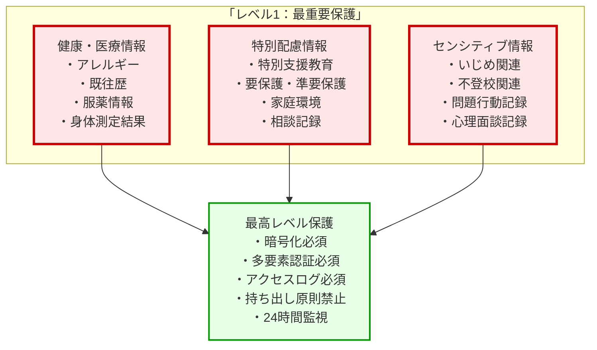
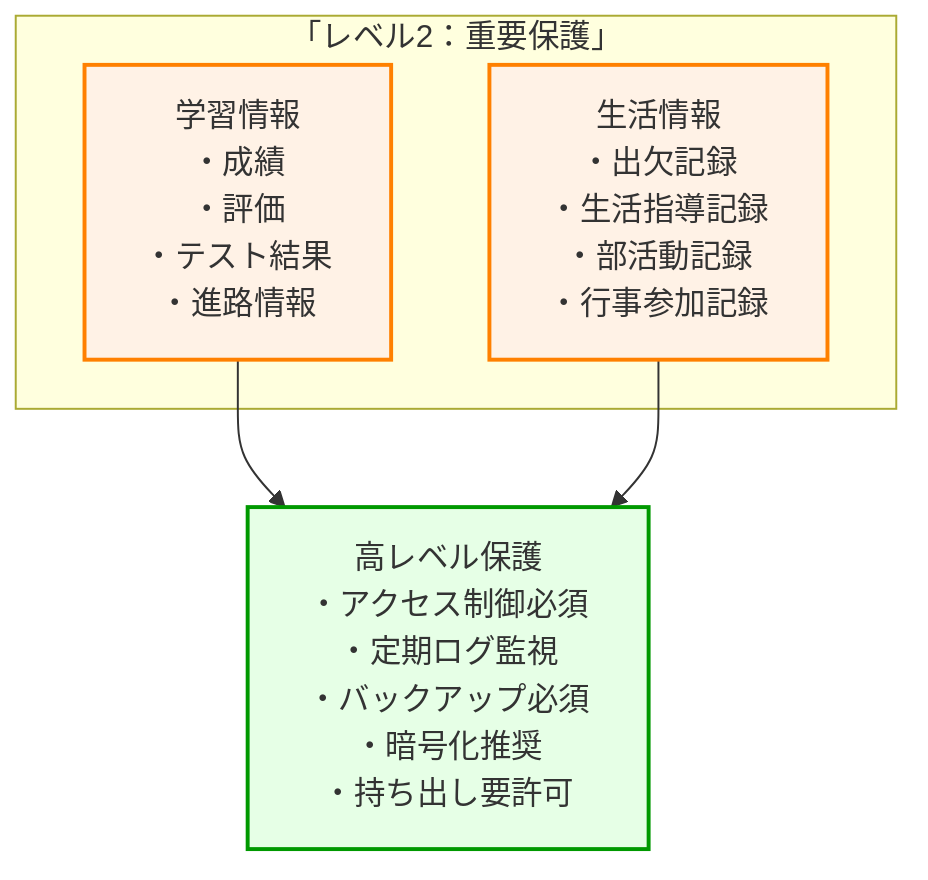
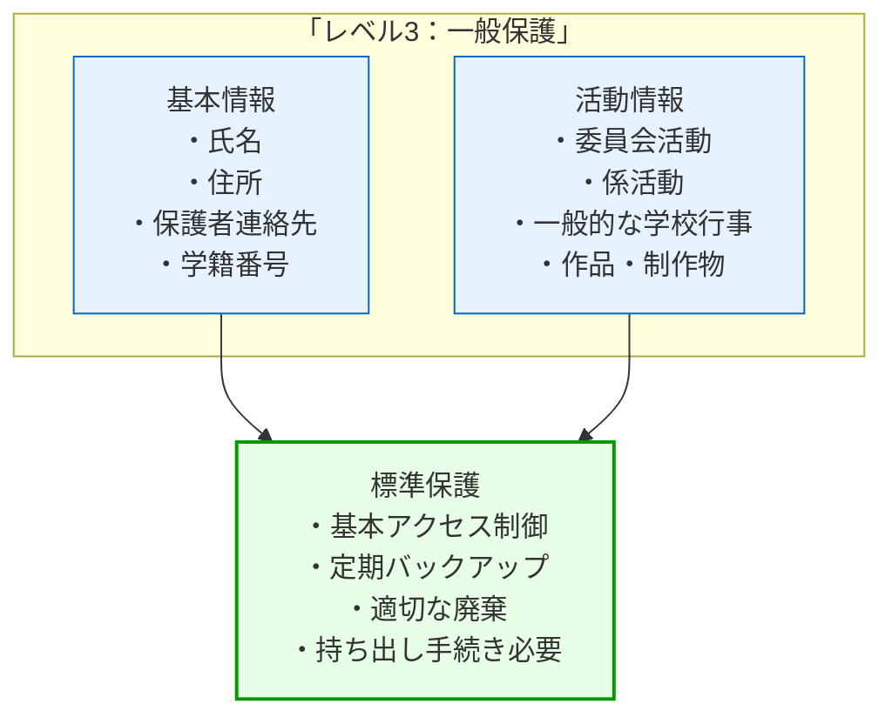
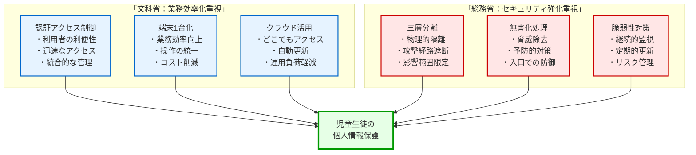
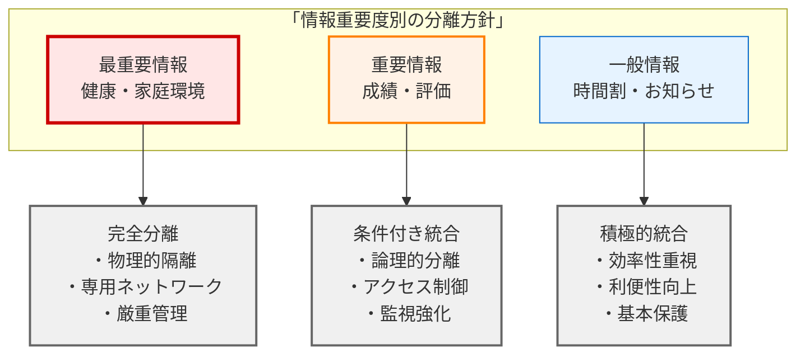
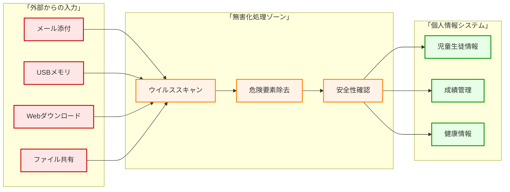
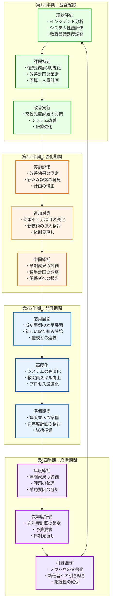

第1章から第11章を通じて、校務DX基盤導入のあらゆる側面を学んできました。最終章となる本章では、これまでの学習内容を統合し、**児童生徒の個人情報保護を最優先とした具体的な導入計画**の立て方について、実践的に解説します。

本章は、学校や教育委員会が明日から実際に使える「実行計画書」として活用できるよう、具体的な手順とチェックリストを中心に構成しています。

# 児童生徒の個人情報保護を第一とした要件定義

## 従来の要件定義の問題点

**よくある間違った要件定義の例**
```
×「文科省ガイドライン対応システムを導入したい」
×「総務省の三層分離に準拠したシステムが欲しい」  
×「他校で使っているシステムと同じものを導入したい」
×「予算○○万円で買えるシステムを探している」
```

**なぜこれらが問題なのか**
- 手段（システム導入）が目的化している
- 真の目的（個人情報保護）が曖昧
- 児童生徒のメリットが不明確
- 現場の実情が考慮されていない

## 正しい要件定義の進め方

### Step 1：本来の目的の明確化

校務DX基盤の導入において最も重要なのは、システム導入自体が目的化してしまうことを避け、**真の目的を明確に定義する**ことです。多くの学校や教育委員会が陥りがちな「ガイドライン準拠が目的」「他校と同じシステム導入が目的」という手段の目的化を避け、児童生徒の個人情報保護を最優先とした目的設定を行います。

**最優先目的の設定**

まず、すべての関係者が共有すべき最上位の目的を明確に定義します。これは単なる理念ではなく、すべての判断の基準となる実践的な指針です。

**主目的：** 児童生徒の個人情報を確実に保護し、安心して学べる環境を実現する

この主目的の下に、具体的で測定可能な目標を設定します：

1. **個人情報漏洩事故をゼロにする** - 最も重要な定量的目標
2. **児童生徒が安心して学校生活を送れる環境を作る** - 教育環境の質的向上
3. **保護者が信頼して個人情報を提供できる体制を構築する** - 社会的信頼の確保
4. **教職員が安心して業務に集中できる環境を整備する** - 働く環境の改善
5. **地域社会から信頼される学校運営を実現する** - 組織の持続可能性確保

これらの目的は、技術的な手段や予算制約よりも上位に位置づけられ、すべての意思決定において最優先されるべき価値基準となります。

### Step 2：保護すべき情報の特定と分類

目的が明確になったら、具体的に保護すべき情報を特定し、その重要度に応じて分類します。この分類は、後の技術的対策や運用手順の決定において重要な基準となります。

**情報重要度による3段階分類**

学校が取り扱う児童生徒の個人情報を、その機密性と影響度に応じて3つのレベルに分類します。この分類により、限られたリソースを効果的に配分し、最も重要な情報に最高レベルの保護を提供できます。

**情報重要度マトリクスの作成**








### Step 3：現状リスクの詳細評価

情報分類が完了したら、現在の学校における個人情報保護の状況を客観的に評価し、リスクを数値化して優先順位をつけます。この評価により、限られた予算と人員を最も効果的な対策に集中投入できます。

**リスク評価の実施方法**

リスク評価は「影響度」と「発生確率」の2つの軸で各項目を評価し、リスクスコア（影響度×発生確率）を算出します。この数値化により、感情的な判断や思い込みを排除し、客観的な優先順位付けが可能になります。

**リスク評価シート**

| 評価項目 | 現状評価 | 影響度 | 発生確率 | リスクスコア | 対策優先度 |
|----------|----------|--------|----------|--------------|------------|
| パスワード管理 | 危険（簡単なパスワード、使い回しあり） | 極大（5点） | 高（4点） | 20点 | 最高 |
| アクセス制御 | 不十分（過度な権限付与） | 大（4点） | 中（3点） | 12点 | 高 |
| 画面ロック | 不十分（離席時未実施） | 大（4点） | 高（4点） | 16点 | 最高 |
| メール誤送信 | 対策なし（チェック機能なし） | 大（4点） | 中（3点） | 12点 | 高 |
| USBメモリ管理 | 不十分（暗号化なし） | 中（3点） | 中（3点） | 9点 | 中 |
| ログ監視 | なし（異常検知不可） | 中（3点） | 低（2点） | 6点 | 中 |
| バックアップ | 手動（不定期実施） | 大（4点） | 低（2点） | 8点 | 中 |
| 物理セキュリティ | 不十分（施錠管理甘い） | 中（3点） | 中（3点） | 9点 | 中 |

**リスクスコア算出基準**
- 影響度：1（軽微）～5（極大）
- 発生確率：1（極低）～5（極高） 
- リスクスコア = 影響度 × 発生確率
- 対策優先度：15点以上（最高）、8-14点（高）、7点以下（中）

### Step 4：要件の具体的定義

リスク評価の結果を踏まえ、個人情報保護という目的を達成するために必要なシステム要件を具体的に定義します。要件は「機能要件」（何ができる必要があるか）と「非機能要件」（どのような品質が必要か）に分けて明確に定義することで、システム選定や開発において判断基準が明確になります。

**機能要件の定義**

機能要件では、個人情報保護を確実に実現するために必要な具体的な機能を定義します。これらの機能は、Step 3のリスク評価で特定された高リスク項目に対応する形で設計されます。

**機能要件（何ができる必要があるか）**

1. **認証・認可機能**
   - 多要素認証による本人確認
   - 情報重要度に応じた段階的アクセス制御
   - 定期的なアクセス権限見直し機能

2. **監視・ログ機能**
   - 全アクセス記録の自動記録
   - 異常アクセスの自動検知・アラート
   - ログ情報の改ざん防止機能

3. **データ保護機能**
   - 保存データの自動暗号化
   - 通信データの暗号化
   - 自動バックアップとリストア機能

**非機能要件の定義**

非機能要件では、システムが満たすべき品質レベルを数値で明確に定義します。これにより、導入後の評価基準が明確になり、継続的な改善の指標となります。

**非機能要件（どのような品質が必要か）**

1. **セキュリティ品質**
   - NIST SP 800-207準拠のゼロトラスト実装
   - 年間停止時間1時間以下（99.99%稼働率）
   - セキュリティインシデント年間発生件数ゼロ

2. **ユーザビリティ品質**
   - 教職員の習得時間1日以内
   - 日常操作の平均時間短縮50%以上
   - ユーザー満足度90%以上

3. **保守性・拡張性**
   - システム更新時の停止時間最小化
   - 新機能追加時の既存データ保持
   - 10年以上の継続利用可能性

これらの要件定義により、「何のために」「何を」「どのような品質で」実現するかが明確になり、具体的なシステム選定や導入計画の策定に移ることができます。

# ガイドライン要件を手段として活用する戦略

教育機関が校務DX基盤を導入する際、文部科学省や総務省から様々なガイドラインが示されています。しかし、これらのガイドラインを「守るべき規則」として機械的に従うのではなく、**児童生徒の個人情報保護という真の目的を達成するための「手段」として戦略的に活用する**ことが重要です。

**なぜガイドラインを手段として考えるのか**

例えば、家の防犯を考えてみてください。「鍵をかけなさい」「防犯カメラを付けなさい」という指導があったとしても、それを機械的に実行するだけでは本当の安全は確保できません。「なぜ鍵をかけるのか」「何から家族を守りたいのか」という目的を理解して、自分の家の状況に合わせて最適な方法を選ぶことが大切です。

学校の個人情報保護も同じです。ガイドラインに書かれた要件を表面的に満たすだけでなく、**その要件が個人情報保護にどう役立つかを理解し、学校の実情に合わせて活用する**ことが重要なのです。

## 文科省・総務省ガイドライン要件の整理

まず、文科省と総務省の要件がどのような考え方に基づいているかを全体像で理解しましょう。



このように、両省庁は異なるアプローチで同じ目標を目指しています。重要なのは、これらを対立する要件として見るのではなく、**個人情報保護という共通目標を達成するための補完的な手段**として活用することです。

### 文科省「次世代校務DXガイドブック」要件の活用戦略

文部科学省のガイドラインは、主に**業務効率化と教育の質向上**を目的として策定されています。これらの要件を個人情報保護の観点から見直し、どのように活用できるかを考えてみましょう。

**要件1：認証によるアクセス制御**

**ガイドラインの内容：** システムにアクセスする際は、正しい利用者であることを確認する仕組みを導入する

**個人情報保護への活用方法：** この要件を単なる「ログイン機能」として捉えるのではなく、**情報の重要度に応じて段階的に厳しくチェックする仕組み**として活用します。

**具体的な実装例：**
- 一般的な情報（時間割など）：パスワードのみでアクセス可能
- 重要な情報（成績など）：パスワード + SMS認証
- 最重要情報（健康情報など）：パスワード + SMS認証 + 管理職承認

**身近な例で理解する：** 銀行のATMでも、残高照会は暗証番号だけですが、大きな金額を振り込む時は追加の認証が必要になります。学校の情報も同じように、重要度に応じて段階的に厳しくチェックするのです。

**認証レベル設定の例：**
- **レベル1（一般情報）**：パスワード認証のみ
- **レベル2（重要情報）**：パスワード + SMS認証
- **レベル3（最重要情報）**：パスワード + SMS + 管理職承認

**要件2：端末1台化の推進**

**ガイドラインの内容：** 教職員が使う端末を統一し、複数の端末を使い分ける必要をなくす

**個人情報保護への活用方法：** 複数の端末を使い分けることで起こりがちな**人的ミス（間違った端末に保存、USBメモリの持ち運びなど）を削減**する手段として活用します。

**具体的な実装例：**
- 教職員は1台の端末ですべての業務を行う
- 情報の持ち運びや複写の必要性を削減
- どの端末で何をしたかの記録を一元管理

**身近な例で理解する：** 家庭で家計簿を複数の場所で付けていると、記入漏れや計算ミスが起きやすくなります。1箇所にまとめることで、ミスを減らし、管理を簡単にできます。

**端末統合の効果：**

従来の問題：
- 校務用PC、学習用PC、管理用PCの分散管理
- USBメモリでの情報移動による紛失リスク
- データ複製ミス、更新漏れの発生

統合後の改善：
- 1台ですべての業務を実行
- 一元管理によるミス削減
- ログの一元化による追跡可能性向上

**要件3：クラウド利用の促進**

**ガイドラインの内容：** インターネット上のサービス（クラウド）を積極的に活用する

**個人情報保護への活用方法：** クラウドを単なる「外部サービス」として捉えるのではなく、**災害対策と専門的なセキュリティ対策の手段**として活用します。

**具体的な実装例：**
- 学校の建物に災害が起きても、クラウド上にデータが安全に保管されている
- 専門業者による24時間365日のセキュリティ監視
- 学校単独では困難な高度なセキュリティ対策の実現

**身近な例で理解する：** 大切な書類を自宅の金庫に保管するか、銀行の貸金庫に保管するかの違いです。銀行の方が専門的な警備と災害対策があるように、信頼できるクラウドサービスも同様の利点があります。

**クラウド活用の比較：**

| 項目 | 学校内サーバー | クラウドサービス |
|------|----------------|------------------|
| 監視 | 夜間無人 | 24時間監視 |
| 災害対策 | 災害リスクあり | 災害対策済み |
| 技術者 | 専門知識不足 | 専門技術者 |
| コスト | 予算制約 | スケールメリット |

結果：クラウドにより高度なセキュリティを確保

### 総務省「自治体情報システム強靭性向上モデル」要件の活用戦略

総務省のガイドラインは、主に**外部からの攻撃に対する防御**を重視して策定されています。これらの要件も、個人情報保護の観点から戦略的に活用します。

**要件1：三層分離による物理的分離**

**ガイドラインの内容：** インターネット接続系、校務系、学習系のシステムを物理的に分離する

**個人情報保護への活用方法：** すべてを分離するのではなく、**情報の重要度に応じて「分離すべきもの」と「統合可能なもの」を判断**する基準として活用します。

**具体的な実装例：**
- 最重要個人情報（健康・家庭環境など）：完全分離を維持
- 重要個人情報（成績など）：条件付きで統合検討
- 一般情報（時間割など）：積極的に統合

**身近な例で理解する：** 家庭でも、現金や印鑑は金庫に、普通の書類は机の引き出しに、雑誌は本棚に置くように、重要度に応じて保管場所を変えます。すべてを金庫に入れる必要はありませんが、重要なものは確実に守る必要があります。



**要件2：無害化処理の実装**

**ガイドラインの内容：** インターネットから受信したファイルから、危険な要素を除去する処理を行う

**個人情報保護への活用方法：** すべてのファイルに適用するのではなく、**個人情報に関わるシステムへの入り口を重点的に守る**手段として活用します。

**具体的な実装例：**
- 個人情報システムにアクセスする前の段階で、危険なファイルをチェック
- メール添付ファイルの安全性確認
- USBメモリの内容確認

**身近な例で理解する：** 空港の手荷物検査のように、危険なものが建物に入る前にチェックする仕組みです。すべての人や物をチェックするのは大変ですが、重要な場所に入る前には必ずチェックします。



**要件3：定期的な脆弱性対策**

**ガイドラインの内容：** システムの弱点を定期的に見つけて修正する

**個人情報保護への活用方法：** システム全体をチェックするのではなく、**個人情報にアクセスする経路を重点的に監視**する手段として活用します。

**具体的な実装例：**
- 個人情報システムへのアクセス経路の重点的な点検
- 個人情報を扱う教職員のパソコンの優先的なセキュリティ更新
- 個人情報関連のシステム変更時の事前安全確認

**身近な例で理解する：** 車の点検でも、エンジンやブレーキなど安全に関わる重要な部分は特に念入りにチェックします。すべてを同じレベルでチェックするより、重要な部分を確実にチェックする方が効果的です。

## 省庁間矛盾の解決アプローチ

文科省と総務省のガイドラインには、時として矛盾する要求が含まれています。しかし、これは「どちらかが間違っている」のではなく、**それぞれ異なる観点から児童生徒を守ろうとしているため**です。この矛盾を解決するための現実的なアプローチを説明します。

### 矛盾する要件の調整方法

**矛盾の具体例：端末1台化 vs 三層分離**

**文科省の要求：** 教職員の業務効率を上げるため、学習系と校務系を統合して1台の端末で使えるようにする

**総務省の要求：** セキュリティを高めるため、学習系と校務系を物理的に分離する

**身近な例で理解する：** これは、家庭で「リビングと書斎を一つの部屋にして便利にしたい」という要望と、「重要な書類は別室で管理したい」という要望が対立している状況と似ています。

**解決アプローチ1：段階的統合による安全な移行**

すべてを一度に変更するのではなく、リスクの低いものから段階的に統合していきます。

- **Phase1：** まず、危険性の低い情報（時間割、お知らせなど）から統合を始める
- **Phase2：** 次に、中程度の重要性を持つ情報（出欠記録など）の統合を検討
- **Phase3：** 最後に、最も重要な情報（健康情報など）の統合を慎重に検討

**身近な例：** 引っ越しの時も、壊れても困らないものから先に運び、最後に貴重品を慎重に運ぶのと同じです。

**解決アプローチ2：リスクベースでの判断**

「すべて統合」や「すべて分離」ではなく、それぞれの情報のリスクに応じて個別に判断します。

- **最重要個人情報：** 健康情報、家庭環境情報は分離を維持
- **重要個人情報：** 成績情報は条件付きで統合検討
- **一般情報：** 時間割、行事予定は積極的に統合

**身近な例：** 家庭でも、現金は金庫に、普通の書類は引き出しに、雑誌は本棚にと、重要度に応じて保管方法を変えるのと同じです。

**解決アプローチ3：技術的解決策の活用**

最新の技術を使って、「物理的には統合しているが、論理的には分離されている」状態を作ります。

- **仮想分離：** 1台のコンピューターの中に、見えない壁で区切られた複数の領域を作る
- **動的アクセス制御：** アクセスする情報の重要度に応じて、自動的にセキュリティレベルを変える
- **ゼロトラスト原則：** 「何も信用しない」前提で、常に身元確認をする

**身近な例：** 最新の車では、運転者を認識して自動的にシートやミラーの位置を調整したり、速度に応じてブレーキの感度を変えたりします。同じように、コンピューターも状況に応じて自動的にセキュリティレベルを調整できます。

### 現実的な合意形成の方法

矛盾する要件を調整するには、関係者全員が納得できる現実的な方法で合意を形成する必要があります。

**ステップ1：共通目標の確認**

まず、関係者全員で「何のためにこれをやるのか」を確認します。

- **共通の目的：** 文科省も総務省も、最終的には「児童生徒の個人情報を守る」ことが目的
- **手段の違いを理解：** 文科省は「業務効率化により人的ミスを減らす」、総務省は「技術的対策により外部攻撃を防ぐ」という手段の違い
- **児童生徒の安全を最優先：** 迷った時は「児童生徒にとって最も安全な方法は何か」で判断

**身近な例：** 家族で旅行計画を立てる時、お父さんは「安全性重視」、お母さんは「便利さ重視」でも、「家族全員が楽しく安全に旅行する」という目的は同じです。

**ステップ2：段階的実装による合意**

一度に大きな変更をするのではなく、小さな段階に分けて進めることで、関係者の不安を軽減します。

- **小さく始める：** まず影響の少ない部分から始めて、効果を確認
- **効果を見える化：** 各段階での成果を数値や具体例で示す
- **問題があれば立ち止まる：** 予想と違う結果が出た場合は、無理に進めずに見直し

**身近な例：** 新しい料理を作る時も、いきなり大量に作らず、まず少量で味見をして、問題があれば調整するのと同じです。

**ステップ3：責任体制の明確化**

最終的な判断は誰が行うのか、その根拠は何かを明確にします。

- **最終責任者の明確化：** 通常は教育長が最終的な判断を行う
- **判断根拠の文書化：** なぜその判断をしたのかを記録に残す
- **定期的な見直し：** 状況が変われば判断も見直す仕組みを作る

**身近な例：** 家庭でも、大きな買い物をする時は「誰が最終的に決めるか」「なぜその商品を選んだか」を明確にして、後で問題になることを避けます。

このように、ガイドライン要件を「守るべき規則」ではなく「活用すべき手段」として捉えることで、学校の実情に合った効果的な個人情報保護体制を構築できます。

# リスク評価に基づく段階的実装計画

校務DX基盤の導入は、一度にすべてを変更するのではなく、リスクを段階的に削減しながら安全に移行することが重要です。これは、家の大規模リフォームを少しずつ進めるのと同じで、住みながら安全に改善していく考え方です。

**3段階実装戦略：**

- **Phase 1（1-2年目）：基礎固め期** → 現在のリスクを50%削減
- **Phase 2（3-4年目）：統合準備期** → NIST準拠への移行準備
- **Phase 3（5年目以降）：完全実装期** → 次世代校務DXの完全実現

最終目標：児童生徒の個人情報完全保護

## 3段階実装による安全な移行

### Phase 1：基礎固め期（1-2年目）

**目標：現在のリスクの大幅削減**

Phase 1では、最も危険度の高いリスクを優先的に対策し、基本的なセキュリティ基盤を構築します。これは、家の防犯対策で「まず鍵をしっかりかける」「窓の施錠を確実にする」などの基本から始めるのと同じです。

**Phase 1：基礎固め期（24ヶ月）**
- 1-3ヶ月：緊急対策（パスワード管理、画面ロック、メール誤送信防止）
- 4-12ヶ月：基本対策（多要素認証、ログ監視、バックアップ体制）
- 13-24ヶ月：体制構築（保護体制、研修制度、インシデント対応）

### Phase 2：統合準備期（3-4年目）

**目標：NIST準拠への移行準備**

Phase 2では、Phase 1で構築した基盤の上に、より高度なセキュリティシステムを構築します。これは、家の基本的な防犯対策ができた後に、監視カメラや警備システムなどの高度な設備を導入するのと同じです。

**Phase 2：統合準備期（24ヶ月）**
- 25-30ヶ月：統合設計（ゼロトラストアーキテクチャ設計、段階的統合計画、パイロット実証）
- 31-42ヶ月：システム構築（Policy Engine、Policy Administrator、Policy Enforcement）
- 43-48ヶ月：試行運用（限定統合運用、問題洗い出し、全面導入準備）

### Phase 3：完全実装期（5年目以降）

**目標：次世代校務DXの完全実現**

Phase 3では、これまでに構築したシステムを全面的に展開し、継続的な改善により最高水準のセキュリティを維持します。これは、家の防犯設備が完全に整った後、その効果を維持・向上させ続けるのと同じです。

**Phase 3：完全実装期（12ヶ月+継続）**
- 49-54ヶ月：全面展開（全校統合運用、継続監視体制、職員サポート）
- 55-60ヶ月：最適化（運用効率改善、新技術導入、他校連携）
- 61ヶ月以降：継続運用（改善サイクル、将来技術対応、成果発信）

## リスクベース優先順位決定

限られた予算と人員で最大の効果を上げるため、リスクスコアと投資効果を基準に対策の優先順位を決定します。これは、家の修繕で「雨漏りの修理」を「壁紙の張り替え」より優先するのと同じ考え方です。

**リスクベース優先順位決定プロセス**
1. リスクスコア算出（影響度×発生確率）
2. 対策コスト見積もり（予算・人員・時間）
3. 投資効果計算（リスク削減効果÷コスト）
4. 優先順位決定（効果の高い順に実施）

### 高リスク対策（Phase 1で実装）

この優先順位決定により、以下のような段階的実装計画を策定します：

**優先順位別対策一覧**

| 優先度 | 対策内容 | リスクスコア | コスト | 投資効果 | 実施時期 |
|---------|----------|-----------|------|---------|----------|
| 最優先 | パスワード強化 | 20点→5点 | 5万円 | 4.0 | 今すぐ |
| 最優先 | 画面ロック徹底 | 15点→3点 | 3万円 | 5.0 | 今すぐ |
| 最優先 | メール誤送信防止 | 15点→4点 | 5万円 | 3.0 | 今すぐ |
| 重要 | USBメモリ管理 | 12点→2点 | 20万円 | 0.6 | 半年以内 |
| 重要 | アクセス制御強化 | 10点→3点 | 30万円 | 0.33 | 1年以内 |
| 重要 | ログ監視導入 | 8点→2点 | 25万円 | 0.32 | 1年以内 |
| 計画 | 高度脅威対策 | 6点→1点 | 100万円 | 0.06 | 2年目以降 |
| 計画 | 災害対策強化 | 5点→1点 | 150万円 | 0.03 | 3年目以降 |
    
    classDef highest fill:#ffe6e6,stroke:#cc0000,stroke-width:3px
    classDef high fill:#fff2e6,stroke:#ff8000,stroke-width:2px
    classDef planned fill:#e6f3ff,stroke:#0066cc,stroke-width:1px
    classDef timeline fill:#e6ffe6,stroke:#009900,stroke-width:2px
    
    class R1,R2,R3 highest
    class R4,R5,R6 high
    class R7,R8 planned
    class T1,T2,T3 timeline
```

**投資効果の計算方法**
- 投資効果 = リスク削減効果 ÷ 実装コスト
- リスク削減効果 = (実装前リスクスコア - 実装後リスクスコア)
- 投資効果が高いほど、少ない投資で大きなリスク削減が可能

**身近な例で理解する：** 家の修繕でも、「雨漏り修理（緊急・効果大・コスト小）」→「外壁補修（重要・効果中・コスト中）」→「内装リフォーム（計画・効果小・コスト大）」の順で優先順位をつけるのと同じです。

# 運用開始前のセキュリティ検証項目

## 技術的検証項目

### レベル1：基本セキュリティ検証

**認証・認可機能の検証**
**認証システム検証項目：**
- パスワード強度チェック（8文字以上、英数字・記号組み合わせ、辞書攻撃耐性）
- 多要素認証動作確認（SMS認証、認証アプリ連携、失敗時処理）
- アクセス制御確認（権限別画面制御、不正アクセス拒否、セッション切断）

**データ保護機能の検証**
**データ保護検証項目：**
- 暗号化機能（保存・通信データ暗号化、暗号鍵管理）
- バックアップ機能（自動バックアップ、復元テスト、データ暗号化）
- ログ機能（全アクセス記録、改ざん防止、分析機能）

### レベル2：高度セキュリティ検証

**侵入テスト（ペネトレーションテスト）**
**侵入テスト項目：**
1. **外部侵入試行：** ネットワーク不正アクセス、Webアプリ脆弱性、社会工学攻撃
2. **内部不正試行：** 権限昇格攻撃、データベース直接アクセス、ログ改ざん
3. **物理セキュリティ：** 端末物理アクセス、USBメモリ情報取得、ネットワーク機器アクセス

## 運用的検証項目

### 教職員対応能力の検証

**操作スキルの検証**
**教職員スキル検証：**
- **基本操作：** ログイン・アウト、パスワード変更、多要素認証、個人情報アクセス
- **緊急時対応：** 不審アクセス発見時報告、システム異常初動、漏洩疑い対応、パスワード忘れ手順

**セキュリティ意識の検証**
```
【セキュリティ意識確認テスト】

理解度テスト：
□ 個人情報保護の重要性理解（90%以上正解）
□ 基本的なセキュリティルール理解（95%以上正解）
□ 緊急時対応手順の理解（100%正解）
□ 日常的な注意事項の理解（95%以上正解）

実践テスト：
□ 模擬フィッシングメールへの対応
□ USBメモリ発見時の適切な対応
□ 不審な電話への適切な対応
□ 画面ロック忘れ指摘への適切な反応
```

### 組織体制の検証

**インシデント対応体制の検証**
```
【インシデント対応訓練】

シナリオ1：個人情報漏洩疑い
□ 発見から15分以内の初動対応
□ 30分以内の関係者連絡
□ 1時間以内の被害拡大防止措置
□ 2時間以内の教育委員会報告

シナリオ2：システム障害発生
□ 5分以内の障害認識
□ 10分以内の代替手段移行
□ 30分以内の復旧作業開始
□ 1時間以内の業務継続確保

シナリオ3：外部からの攻撃
□ 即座の攻撃検知
□ 5分以内のシステム保護措置
□ 15分以内の被害状況確認
□ 30分以内の関係機関連絡
```

# 継続的な個人情報保護体制の確立

## 日常的な保護活動の制度化

### 毎日の基本チェック

**朝の開始時チェック**
```
【毎朝の個人情報保護チェックリスト】

システム確認：
□ パスワード有効期限の確認
□ システムセキュリティ状態の確認
□ 前日のログ異常有無の確認
□ バックアップ状況の確認

環境確認：
□ 机上の個人情報書類整理状況
□ パソコン画面の他者からの見えにくさ
□ USBメモリ等の適切な管理状況
□ 職員室の戸締り・セキュリティ状況
```

**業務終了時チェック**
```
【毎夕の個人情報保護チェックリスト】

データ確認：
□ 開いていたファイルの適切な保存・終了
□ 一時ファイルの適切な削除
□ 印刷待ちデータの処理確認
□ 画面ロックの確実な実行

環境確認：
□ 机上からの個人情報書類撤去
□ 鍵付き保管庫への適切な保管
□ パソコンの適切なシャットダウン
□ 職員室戸締りの確認
```

### 週次・月次の定期チェック

**週次チェック（週1回）：**
- **セキュリティ状況：** アクセスログ分析、異常アクセス確認、パスワード使用状況、USB使用記録
- **教職員状況：** ルール遵守状況、困り事・不明点聞き取り、ヒヤリハット事例収集、改善提案受付

**月次チェック（月1回）：**
- **包括レビュー：** インシデント分析、システム動作状況、教職員アンケート、改善計画進捗
- **研修活動：** 月次勉強会、脅威情報共有、他校事例学習、次月計画策定

## 継続的改善のサイクル確立

### 四半期レビューサイクル



### 年次計画・評価サイクル

**年次計画策定（3月）**
```
【年次計画策定プロセス】

1. 前年度総括（3月第1週）
   - 定量的成果の分析
   - 定性的成果の評価
   - 課題・問題点の整理
   - 成功要因の特定

2. 環境分析（3月第2週）
   - 新しい脅威・技術の調査
   - 法令・ガイドライン変更の確認
   - 他校・他地域の動向調査
   - 予算・人員の見通し確認

3. 目標設定（3月第3週）
   - 次年度の重点目標設定
   - 具体的な成果指標設定
   - 実施計画の策定
   - 予算・人員計画の策定

4. 計画承認（3月第4週）
   - 管理職による計画承認
   - 教職員への計画説明
   - 関係機関との調整
   - 実施準備の開始
```

# 将来の脅威に対応できる柔軟な設計

## 新しい技術・脅威への対応体制

### 技術動向の継続的監視

**AI・機械学習技術の活用検討**
```
【AI技術活用ロードマップ】

Phase 1：基礎的AI活用（1-2年目）
- ログ分析の自動化
- 異常検知の精度向上
- パターン認識による脅威検出

Phase 2：高度AI活用（3-4年目）
- 行動分析による内部脅威検出
- 予測分析による事前対策
- 自動応答システムの構築

Phase 3：包括的AI統合（5年目以降）
- AI主導の総合セキュリティ
- 自律的な脅威対応
- 継続学習による進化
```

**量子コンピューティング対応**
```
【量子脅威対応計画】

現在の対策：
- 量子コンピューティング脅威の情報収集
- 耐量子暗号の技術動向調査
- 移行計画の検討開始

中期対策（3-5年）：
- 耐量子暗号への段階的移行
- システムの量子耐性評価
- 移行計画の具体化

長期対策（5年以上）：
- 完全な量子安全環境の構築
- 新世代セキュリティ技術の導入
- 国際標準への準拠
```

### 組織的な適応能力の構築

**学習する組織の実現**
```
【継続学習システム】

個人レベル：
- 定期的な技術研修受講
- 資格取得支援制度
- 外部コミュニティ参加奨励

組織レベル：
- 新技術の評価・実証プロセス
- 失敗から学ぶ文化の醸成
- 知識共有の仕組み構築

地域レベル：
- 他校との情報共有ネットワーク
- 専門機関との連携強化
- 産学官連携の推進
```

## 持続可能性の確保

### 長期的な運用体制

**世代交代への対応**
```
【知識継承システム】

ドキュメント化：
- 運用ノウハウの体系的記録
- 意思決定プロセスの文書化
- トラブルシューティングガイド

人材育成：
- 後継者の計画的育成
- メンター制度の確立
- 段階的な責任移譲

組織記憶：
- 過去の事例データベース
- 判断基準の明文化
- 成功・失敗要因の蓄積
```

**予算・リソースの持続性**
```
【持続的投資計画】

段階的投資：
- 初期投資の分散化
- 段階的な機能拡張
- ROI に基づく投資判断

コスト最適化：
- 運用コストの継続的削減
- 効率化による人件費最適化
- 共同利用によるスケールメリット

価値の可視化：
- セキュリティ投資効果の定量化
- 事故防止による損失回避額の算出
- 業務効率化による時間短縮効果の測定
```

---

# 【第13章の確認事項】

本章の内容を踏まえ、以下の重要なポイントが理解できているか確認してください。

## ✅ 個人情報保護を第一とした要件定義理解確認

**Q1. 正しい要件定義の進め方を理解しているか？**
- [ ] 従来の間違った要件定義（手段の目的化）の問題点を理解している
- [ ] 最優先目的を「児童生徒の個人情報保護」に設定することの重要性を認識している
- [ ] 保護すべき情報の3段階分類（最重要・重要・一般）とそれぞれの保護レベルを把握している

**Q2. 現状リスクの評価方法を理解しているか？**
- [ ] リスクスコア = 発生確率 × 影響度 の計算方法を理解している
- [ ] 具体的なリスク評価シートの作成・活用方法を認識している
- [ ] 機能要件・非機能要件の具体的定義方法を把握している

## ✅ ガイドライン要件活用戦略理解確認

**Q3. 省庁間要件の戦略的活用を理解しているか？**
- [ ] 文科省要件（認証アクセス制御・端末1台化・クラウド利用）の個人情報保護への活用方法を理解している
- [ ] 総務省要件（三層分離・無害化・脆弱性対策）の部分的活用戦略を認識している
- [ ] 要件を「手段」として「目的」に活用する考え方を把握している

**Q4. 省庁間矛盾の解決アプローチを理解しているか？**
- [ ] 端末1台化 vs 三層分離の調整解決策（段階的統合・リスクベース判断）を理解している
- [ ] 現実的な合意形成の3ステップ（共通目標確認・段階的実装・責任体制明確化）を認識している
- [ ] 児童生徒の安全を最優先とする判断基準の重要性を把握している

## ✅ 段階的実装計画理解確認

**Q5. 3段階実装による安全な移行を理解しているか？**
- [ ] Phase 1（基礎固め・24ヶ月）の具体的実装内容と期待効果を理解している
- [ ] Phase 2（統合準備・24ヶ月）のゼロトラスト移行準備を認識している
- [ ] Phase 3（完全実装・12ヶ月+継続）の次世代校務DX実現を把握している

**Q6. リスクベース優先順位決定を理解しているか？**
- [ ] 最優先対策（リスクスコア15点以上）の具体的内容を理解している
- [ ] 重要対策（8-14点）と計画対策（7点以下）の実施時期を認識している
- [ ] 投資効果（リスク削減効果÷コスト）による優先順位付けを把握している

## ✅ セキュリティ検証項目理解確認

**Q7. 技術的検証の具体的項目を理解しているか？**
- [ ] 基本セキュリティ検証（認証・データ保護・ログ機能）のチェックリストを理解している
- [ ] 高度セキュリティ検証（侵入テスト）の実施項目を認識している
- [ ] 各検証の合格基準と不合格時の対応方法を把握している

**Q8. 運用的検証の重要性を理解しているか？**
- [ ] 教職員の操作スキル・セキュリティ意識検証テストの内容を理解している
- [ ] インシデント対応体制の訓練シナリオと合格基準を認識している
- [ ] 検証結果に基づく追加研修・体制改善の必要性を把握している

## ✅ 継続的保護体制理解確認

**Q9. 日常的な保護活動の制度化を理解しているか？**
- [ ] 毎日の基本チェック（朝・夕）の具体的項目を理解している
- [ ] 週次・月次の定期チェック項目と実施方法を認識している
- [ ] チェック結果に基づく改善サイクルの重要性を把握している

**Q10. 継続的改善サイクルを理解しているか？**
- [ ] 四半期レビューサイクル（Q1基盤確認→Q2強化→Q3発展→Q4総括）を理解している
- [ ] 年次計画策定プロセス（3月の4週間計画）を認識している
- [ ] PDCAサイクルによる継続的改善の具体的実行方法を把握している

## ✅ 将来対応の柔軟性理解確認

**Q11. 新技術・脅威への対応体制を理解しているか？**
- [ ] AI・機械学習技術活用の3段階ロードマップを理解している
- [ ] 量子コンピューティング脅威への現在・中期・長期対策を認識している
- [ ] 技術動向の継続的監視と評価プロセスを把握している

**Q12. 持続可能性の確保方法を理解しているか？**
- [ ] 世代交代への対応（知識継承システム・人材育成・組織記憶）を理解している
- [ ] 予算・リソースの持続性（段階的投資・コスト最適化・価値可視化）を認識している
- [ ] 学習する組織の実現による長期的適応能力構築を把握している

## ✅ 統合的理解確認

**Q13. 第1-12章を通じた一貫した理解ができているか？**
- [ ] 第1章の目的明確化から第13章の実装計画まで一貫した流れを理解している
- [ ] 各章の内容が「児童生徒の個人情報保護」という共通目標に向かっていることを認識している
- [ ] 理論（第1-5章）→実践（第6-10章）→事例・計画（第11-12章）の体系的学習を把握している

**Q14. 実際の導入計画策定への応用準備ができているか？**
- [ ] 自組織の現状に合わせた要件定義の実行準備ができている
- [ ] リスク評価に基づく段階的実装計画の策定準備ができている
- [ ] 継続的な改善体制の構築と運用準備ができている

---

**すべての項目にチェックが入らない場合は、該当箇所を再度読み返すことをお勧めします。**

本章は本書の総まとめとして、**児童生徒の個人情報保護を最優先とした実践的な導入計画の策定方法**を提供しています。特に重要なのは、**ガイドライン遵守を手段として活用しつつ、真の目的である個人情報保護を確実に実現する**具体的アプローチと、**持続可能な改善体制による長期的な安全性確保**です。

本書で学んだ知識を実際の現場で活用し、すべての児童生徒が安心して学べる環境の実現に貢献してください。