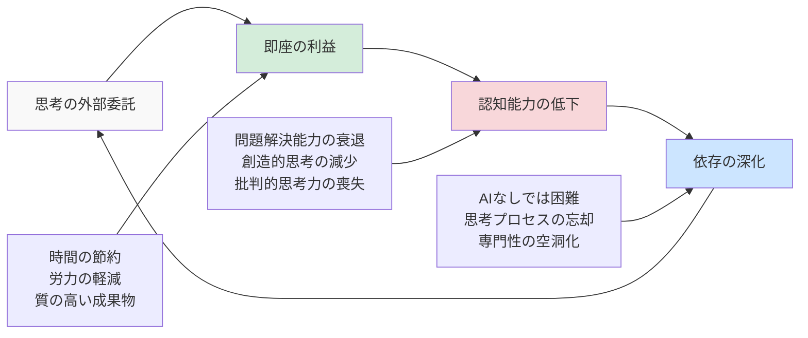
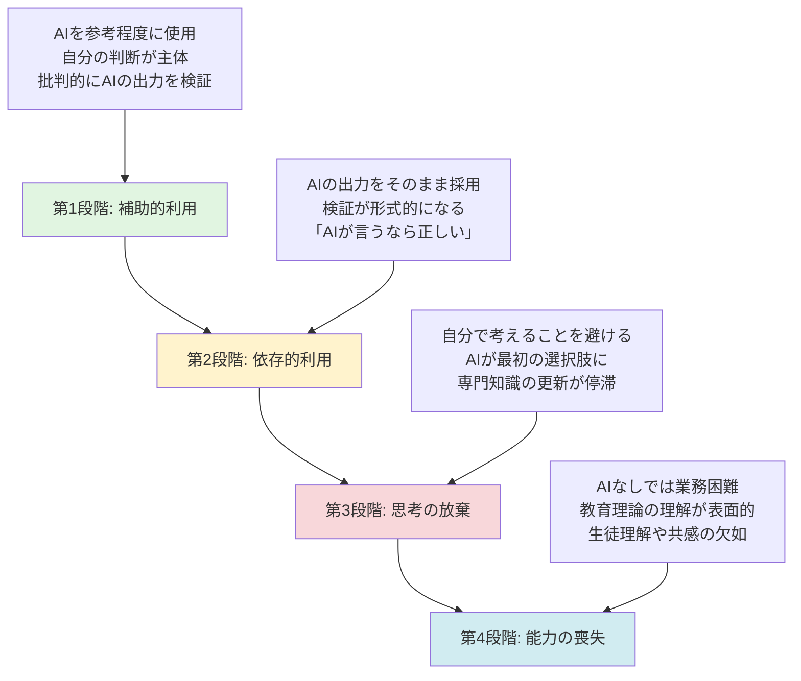
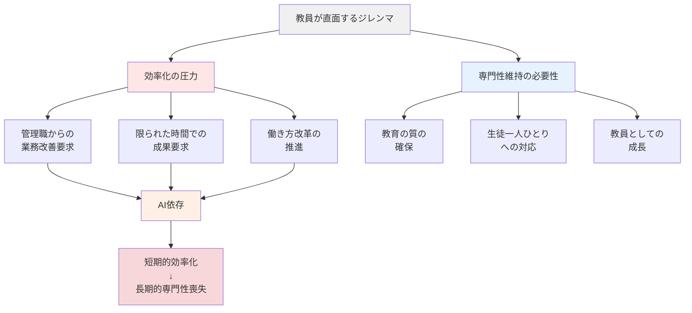

# 認知負債とは何か

## 生成AIがもたらす「楽さ」の代償

「先生、ChatGPTに授業計画を作ってもらったら、すごく楽になりました！」

職員室でこんな声を聞く機会が増えてきました。確かに、生成AIは教員の業務を劇的に効率化する可能性を秘めています。しかし、この「楽さ」の裏側で、私たちの認知能力に何が起きているのでしょうか。

MIT（マサチューセッツ工科大学）の研究チームは、2024年に発表した論文で「認知負債（Cognitive Debt）」という概念を提唱しました[^1]。これは、生成AIに思考を外部委託することで、短期的には効率が上がるものの、長期的には自身の認知能力が低下していくという現象を指します。

### 認知負債の定義とメカニズム

認知負債とは、以下のような特徴を持つ現象です。

1. **思考の外部委託による即座の利益**
   - 時間の節約
   - 労力の軽減
   - 一見質の高い成果物

2. **長期的な認知能力の低下**
   - 問題解決能力の衰退
   - 創造的思考の減少
   - 批判的思考力の喪失

3. **依存の深化**
   - AIなしでは業務が困難に
   - 基本的な思考プロセスの忘却
   - 専門性の空洞化

これは金融における「負債」と同じように、今の便利さと引き換えに、将来の能力を犠牲にしているのです。

### 教員の専門性が空洞化するプロセス

教員がAIに過度に依存すると、以下のような段階を経て専門性が失われていきます。

**第1段階：補助的利用**
- AIを参考程度に使用
- 自分の判断が主体
- 批判的にAIの出力を検証

**第2段階：依存的利用**
- AIの出力をそのまま採用することが増える
- 検証が形式的になる
- 「AIが言うなら正しいだろう」という思考

**第3段階：思考の放棄**
- 自分で考えることを避ける
- AIに質問することが最初の選択肢に
- 専門知識の更新が停滞

**第4段階：能力の喪失**
- AIなしでは基本的な業務も困難
- 教育理論や指導法の理解が表面的に
- 生徒への深い理解や共感の欠如

## 教育現場における認知負債の実態

### 具体的な症状と現れ方

実際の教育現場では、認知負債は以下のような形で現れています。

**授業設計力の低下**
- 単元の全体構成を考えられない
- 学習のつながりや系統性への理解不足
- 生徒の実態に応じた調整ができない

**生徒理解の表面化**
- 個々の生徒の特性や課題を把握できない
- 画一的な対応しかできない
- 生徒の変化や成長に気づけない

**教育的判断力の衰退**
- なぜその指導法を選ぶのか説明できない
- 状況に応じた柔軟な対応ができない
- 教育の本質的な価値を見失う

### 認知負債が蓄積した教員の特徴

認知負債を抱えた教員には、以下のような行動パターンが見られます。

1. **AIへの過度な質問**
   - 些細なことでもすぐにAIに聞く
   - 自分で考える前にAIを起動
   - 「AIに聞けばいい」が口癖

2. **浅い理解での満足**
   - AIの回答を深く検証しない
   - 表面的な知識で満足
   - 根本的な理解を求めない

3. **創造性の欠如**
   - オリジナリティのある授業が作れない
   - 既存のパターンの繰り返し
   - 新しい挑戦を避ける

4. **責任の外部化**
   - 「AIが提案したから」という言い訳
   - 失敗の原因をAIに求める
   - 自己改善への意欲低下

### 長期的な影響

認知負債の蓄積は、個人だけでなく教育全体に深刻な影響を与えます。

**教育の質の低下**
- 画一的で深みのない授業の増加
- 生徒の個性や創造性を伸ばせない
- 教育の本質的価値の喪失

**教員の燃え尽き症候群**
- 仕事への充実感の喪失
- 専門職としての誇りの低下
- モチベーションの枯渇

**次世代への悪影響**
- 思考力の低い生徒の増加
- AI依存の連鎖
- 社会全体の認知能力低下

# なぜ教員は認知負債を抱えやすいのか

## 多忙化と効率化の罠

### 業務過多の現状

現代の教員は、かつてないほどの業務量に直面しています[^3]。

- **授業準備**: 新学習指導要領への対応、ICT活用、個別最適化
- **校務**: 各種書類作成、会議、報告書
- **保護者対応**: 連絡帳、面談、トラブル対応
- **部活動**: 指導、大会引率、保護者対応
- **研修**: 校内研修、教育委員会研修、自主研修

このような状況下で、「時短」を約束する生成AIは、まさに救世主のように見えます。

### 「時短」の誘惑

生成AIは以下のような魅力的な提案をしてきます。

- 「授業計画を5分で作成」
- 「評価コメントを自動生成」
- 「保護者への文書を即座に作成」

しかし、この「時短」には大きな落とし穴があります。時間を節約することと、思考を放棄することはまったく別のことなのです。

### 効率化と専門性維持のジレンマ

教員は常に以下のジレンマに直面しています。

**効率化の圧力**
- 管理職からの業務改善要求
- 限られた時間での成果要求
- 「働き方改革」の名の下での効率化

**専門性維持の必要性**
- 教育の質の確保
- 生徒一人ひとりへの対応
- 教員としての成長

このジレンマの中で、安易にAIに頼ることで、短期的な効率化と引き換えに長期的な専門性を失っていくのです。

## 専門性の空洞化リスク

### 教育の本質的価値

教育には、AIでは代替できない本質的な価値があります。

**人間的な関わり**
- 生徒との信頼関係の構築
- 感情的な支援と励まし
- ロールモデルとしての存在

**創造性**
- 新しい教育方法の開発
- 生徒の創造性を引き出す工夫
- 予期せぬ状況への柔軟な対応

**共感**
- 生徒の気持ちの理解
- 個別のニーズへの対応
- 心の成長への寄り添い

これらの価値は、教員が自ら考え、感じ、行動することではじめて実現されます。

### AI依存による「考えない教員」の増加

生成AIへの過度な依存は、以下のような「考えない教員」を生み出します。

**思考停止の症状**
- 「なぜ」を問わなくなる
- 批判的思考の欠如
- 受動的な態度

**実践知の喪失**
- 経験から学ばない
- 試行錯誤を避ける
- 改善意欲の低下

**教育観の希薄化**
- 教育理念の不在
- 目的意識の欠如
- 使命感の喪失

### 専門職としてのアイデンティティ危機

教員という専門職のアイデンティティが揺らいでいます。

**専門性への疑問**
- 「AIでもできる仕事なのか」
- 「教員の価値とは何か」
- 「自分にしかできないことは何か」

**職業的誇りの低下**
- やりがいの喪失
- 社会的評価への不安
- キャリアへの迷い

**存在意義の模索**
- AI時代の教員の役割
- 人間教師の必要性
- 新たな専門性の構築

## まとめ：認知負債を認識することから始めよう

本章では、認知負債という概念を通じて、生成AIの安易な使用がもたらす危険性を見てきました。教員の多忙化という現実の中で、AIの「楽さ」は確かに魅力的です。しかし、その代償として失われるものの大きさを、私たちは認識しなければなりません。

認知負債は、気づかないうちに蓄積していきます。まずは、自分自身のAI使用を振り返り、以下の問いかけをしてみてください。

- 最近、自分で深く考えることが減っていないか？
- AIの回答をそのまま使うことが増えていないか？
- 教育の本質的な価値を見失っていないか？

次章からは、具体的な30の失敗事例を通じて、どのような使い方が認知負債を生み出すのか、そしてどのように賢くAIを活用すべきかを詳しく見ていきます。

大切なのは、AIを否定することではありません。AIと適切な距離を保ちながら、教員としての専門性と人間性を維持・向上させていく方法を見つけることです。それが、認知負債を防ぎ、真の意味での教育の質を高める道なのです。

[^1]: [MIT認知負債論文](reference.md#認知負債に関する文献)を参照

[^3]: [教員の働き方改革](reference.md#教育現場とaiに関する文献)を参照