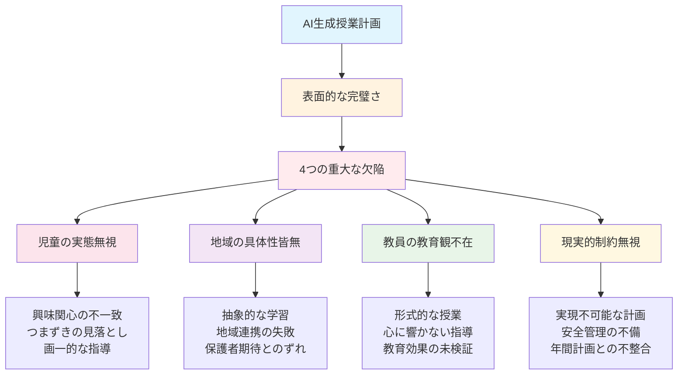

# 授業計画の丸投げ症候群

## 一見完璧な応答に潜む危険性

まず、以下の社会科授業設計依頼とAIの応答例を見てください。

**依頼内容**
```
あなたは小学校4年生の社会科教師として、文部科学省の現行学習指導要領
（平成29年告示）に基づいた授業設計を行ってください。

【単元設定】
- 学年：小学校4年生
- 教科：社会科
- 単元名：「地域の安全を守る」
- 時数：8時間程度を想定

【作成する授業計画の詳細】
以下の要素を含む具体的な授業計画を作成してください。

1. **単元目標**（知識・技能、思考・判断・表現、学びに向かう力・人間性等の3観点）
2. **単元の指導計画**（各時間の学習内容と活動）
3. **評価規準**（3観点それぞれの具体的な評価基準）
4. **主な学習活動例**（調べ学習、見学、インタビュー等）
5. **使用する教材・資料**
6. **地域の実情に応じた工夫点**

【特に重視してほしい点】
- 児童が主体的に学習に取り組める活動設計
- 地域の消防署、警察署等との連携可能性
- ICT活用の具体例
- 安全教育との関連付け

この内容で8時間分の詳細な授業計画を作成してください。
```

**AIの応答例**
```
# 小学校4年生社会科単元「地域の安全を守る」授業計画

## 1. 単元目標

### 知識・技能
- 地域には火事や事故などから人々の安全を守るための諸活動があることを理解する
- 消防署や警察署などの関係機関の役割や連携について理解する
- 地域の安全を守るための仕組みや人々の工夫について調べる技能を身に付ける

### 思考・判断・表現
- 地域の安全を守る活動の特色や相互の関連などについて考え、表現する
- 学習したことを基に、地域の安全についての考えを適切に表現する
- 調べたことを整理し、地域の安全を守る仕組みについて考える

### 学びに向かう力・人間性等
- 地域の安全に関心を持ち、主体的に学習に取り組もうとする
- 地域の安全を守る人々の思いや努力に気付き、感謝の気持ちを持つ
- 自分たちにできることを考え、地域の一員としての自覚を持つ

## 2. 単元の指導計画（全8時間）

### 第1時：私たちの地域の安全について考えよう
**学習内容・活動**
- 身の回りの危険や事故について話し合う
- 地域で起こりうる火事や事故、自然災害について知る
- 単元の学習の見通しを持つ

**主な活動**
- 危険マップ作り（グループワーク）
- 過去の事故や災害の事例調べ（タブレット活用）

### 第2時：消防署の仕事を調べよう
**学習内容・活動**
- 消防署の主な仕事について調べる
- 消防車や救急車の役割を知る
- 消防士の一日の仕事について学ぶ

**主な活動**
- 消防署のパンフレットや動画視聴
- 消防士へのオンラインインタビュー準備

### 第3時：消防署見学（校外学習）
**学習内容・活動**
- 地域の消防署を見学する
- 消防士の方から直接話を聞く
- 消防車や設備を実際に見学する

**主な活動**
- 見学メモの記録
- 消防士への質問・インタビュー
- 写真撮影（記録用）

### 第4時：警察署の仕事を調べよう
**学習内容・活動**
- 警察署の主な仕事について調べる
- 交通安全や防犯の取り組みを知る
- 地域のパトロール活動について学ぶ

**主な活動**
- 警察署の資料調べ（ICT活用）
- 地域の交通安全施設マップ作成

### 第5時：地域の安全を守る人々
**学習内容・活動**
- 交通安全指導員や防犯ボランティアの活動を知る
- 地域の見守り活動について調べる
- 学校の安全対策について考える

**主な活動**
- 地域の安全活動調べ学習
- 安全ボランティアの方へのインタビュー

### 第6時：みんなで協力する安全活動
**学習内容・活動**
- 地域の防災訓練や避難訓練について学ぶ
- 近所の人々の協力の大切さを理解する
- 関係機関の連携について考える

**主な活動**
- 防災マップの確認
- 避難場所や避難経路の調べ学習

### 第7時：私たちにできる安全活動を考えよう
**学習内容・活動**
- 学習したことを整理し、まとめる
- 自分たちにできる安全活動を考える
- 安全ポスターや呼びかけ文を作成する

**主な活動**
- 学習内容の振り返りとまとめ
- 安全啓発ポスター作成（ICT活用）

### 第8時：地域の安全について発表しよう
**学習内容・活動**
- 学習成果を発表する
- 地域の安全について学んだことを伝える
- 今後の取り組みについて話し合う

**主な活動**
- プレゼンテーション発表
- 感想交流と振り返り

## 3. 評価規準

### 知識・技能
**A（十分満足できる）**
- 地域の安全を守る活動や関係機関の役割について詳しく理解し、それらの連携についても説明できる

**B（おおむね満足できる）**
- 地域の安全を守る活動や関係機関の役割について理解している

**C（努力を要する）**
- 地域の安全を守る活動や関係機関の役割についての理解が不十分である

### 思考・判断・表現
**A（十分満足できる）**
- 地域の安全を守る活動について多面的に考え、根拠を明確にして自分の考えを表現できる

**B（おおむね満足できる）**
- 地域の安全を守る活動について考え、自分の考えを表現できる

**C（努力を要する）**
- 地域の安全を守る活動について考えることや表現することが困難である

### 学びに向かう力・人間性等
**A（十分満足できる）**
- 地域の安全に強い関心を持ち、進んで学習に取り組み、地域の一員として何ができるかを積極的に考えている

**B（おおむね満足できる）**
- 地域の安全に関心を持ち、学習に取り組んでいる

**C（努力を要する）**
- 地域の安全への関心が薄く、学習への取り組みが不十分である

## 4. 主な学習活動例

### 調べ学習
- タブレットを使った関係機関の調べ学習
- 地域の安全マップ作成
- 過去の事故・災害事例の調査
- 安全施設・設備の調査

### 見学・体験活動
- 消防署見学
- 警察署見学（可能であれば）
- 地域の安全設備見学（信号機、防犯カメラ等）
- 避難訓練への参加

### インタビュー活動
- 消防士へのインタビュー
- 警察官へのインタビュー
- 地域の安全ボランティアへのインタビュー
- 保護者への安全に関するインタビュー

### 表現活動
- 安全啓発ポスター作成
- 学習成果のプレゼンテーション
- 安全に関する標語作り
- 安全マップの作成と発表

## 5. 使用する教材・資料

### 基本教材
- 社会科教科書
- 社会科資料集
- 地域の地図（ハザードマップ含む）
- 消防署・警察署のパンフレット

### ICT教材
- タブレット端末
- 動画教材（消防・警察の仕事紹介）
- オンライン会議システム（リモートインタビュー用）
- プレゼンテーションソフト

### 地域資料
- 地域の事故・災害統計
- 地域の安全活動写真
- 地域の安全ボランティア資料
- 学校周辺の安全マップ

### 実物資料
- 消防・警察関連グッズ
- 安全器具の実物
- 防災用品
- 交通安全用品

## 6. 地域の実情に応じた工夫点

### 地域特性の活用
- **都市部の場合**：高層建築物の防火対策、交通量の多い道路の安全対策に焦点
- **農村部の場合**：自然災害（土砂崩れ、洪水等）への備え、広域での連携体制に注目
- **沿岸部の場合**：津波避難対策、海難救助活動などを重点的に扱う
- **山間部の場合**：山火事対策、救急搬送の課題などを考慮

### 地域機関との連携
- **消防署との連携**
  - 見学受け入れの調整
  - 出前授業の依頼
  - 防火・防災教育の協力

- **警察署との連携**
  - 交通安全教室の実施
  - 防犯教室の開催
  - 見学や職場体験の受け入れ

- **地域コミュニティとの連携**
  - 町内会・自治会の協力
  - 防災訓練への参加
  - 地域ボランティアの講師招聘

### ICT活用の具体例
- **調べ学習でのICT活用**
  - インターネットでの情報収集
  - 電子地図を使った安全マップ作成
  - 動画教材の視聴

- **記録・発表でのICT活用**
  - 見学時の写真・動画撮影
  - プレゼンテーション資料作成
  - オンラインでの成果発表

- **コミュニケーションでのICT活用**
  - リモートインタビューの実施
  - 他校との交流学習
  - 保護者への学習成果共有

### 安全教育との関連付け
- **生活安全**：不審者対応、登下校の安全
- **交通安全**：歩行者・自転車利用時の注意点
- **災害安全**：地震・火災時の避難方法
- **情報安全**：インターネット利用時の注意点

### 評価の工夫
- **ポートフォリオ評価**：学習過程の記録と振り返り
- **パフォーマンス評価**：発表や実技による評価
- **相互評価**：グループ活動での協力度評価
- **自己評価**：学習への取り組みと成長の自己確認

### 家庭・地域との連携
- 学習内容の家庭での話し合い促進
- 地域の安全活動への参加呼びかけ
- 保護者の職業体験談の活用
- 地域の高齢者からの体験談聴取

この授業計画により、児童は地域の安全について多角的に学び、自分たちも地域の一員として安全に貢献できることを実感できるでしょう。
```

**この応答の何が問題なのか**

一見すると、非常に詳細で完成度の高い授業計画に見えます。学習指導要領に準拠し、3観点の目標も明確で、8時間の指導計画も体系的です。しかし、この「完璧さ」こそが最大の落とし穴なのです。



### 問題1：児童の実態が完全に無視されている

**欠けているもの**
- クラス30名の一人ひとりはどんな子なのか
- 前単元「ごみの処理」での学習状況はどうだったか
- 消極的な子、発表が苦手な子への配慮
- 地域への関心度や安全意識の実態

**この結果起こること**
- 児童の興味関心と合わない授業
- つまずく子を見落とす
- 一人ひとりに響かない画一的な指導

### 問題2：地域の具体性が皆無

**欠けているもの**
- どこの消防署なのか（連携可能な職員は誰か）
- その地域特有の安全課題（交通事故多発地点、過去の災害など）
- 実際に協力してくれる地域のボランティア
- 保護者や地域住民の関心事

**この結果起こること**
- 現実離れした抽象的な学習
- 地域連携の失敗
- 保護者の期待との大きなずれ

### 問題3：教員の教育観が見えない

**欠けているもの**
- なぜ「地域の安全」を重視するのか
- この学習を通して子どもたちにどう成長してほしいのか
- 自分の学級経営方針との関連
- この単元にかける教員としての思い

**この結果起こること**
- 目的意識のない形式的な授業
- 子どもたちの心に響かない指導
- 教育効果の検証ができない

### 問題4：現実的制約の完全無視

**欠けているもの**
- 見学に使える予算と時間
- 安全管理の具体的対策
- 他の行事や授業との調整
- 実現可能性の検証

**この結果起こること**
- 絵に描いた餅のような計画
- 安全管理の不備
- 年間計画との不整合

## 「作って」だけでは授業は成立しない

この応答例が示すように、AIは確かに見栄えの良い授業計画を作成できます。しかし、これをそのまま使用することは、教員としてもっとも重要な専門性を放棄することになります。

**なぜこれが認知負債なのか**

認知負債とは、MITが提唱する概念で、AIへの思考の外部委託により短期的には効率が上がるものの、長期的には自身の認知能力が低下していく現象です。

1. **思考プロセスの外部化**：児童理解、教材研究、目標設定などの重要な思考をAIに委ねてしまう

2. **判断力の低下**：「AIが作ったから大丈夫」という思考停止状態に陥る

3. **創造性の喪失**：オリジナリティのない画一的な授業しかできなくなる

4. **専門性の空洞化**：教員としての核心的な能力が徐々に失われていく

### 失敗事例1：授業計画の完全丸投げ

**典型的な問題のある依頼**
```
ChatGPTに送信：「来週の授業計画を作って」
```

このような漠然とした依頼の何が問題なのでしょうか。

**失われる重要な思考プロセス**

1. **生徒の実態把握**
   - どの子がつまずいているか
   - 前回の理解度はどうだったか
   - 個別の支援が必要な子は誰か

2. **学習段階の検討**
   - 前単元とのつながり
   - 次の学習への橋渡し
   - 系統性を踏まえた構成

3. **教育目標の明確化**
   - この単元で何を身につけさせたいのか
   - どこまでの理解を求めるのか
   - 評価規準はどう設定するか

4. **学級の特性考慮**
   - クラスの雰囲気や特徴
   - 効果的な指導方法
   - 時間配分の調整

### 認知負債の蓄積プロセス

授業計画の丸投げは、認知負債（MITが提唱する思考の外部委託による能力低下）を以下のような段階で蓄積させます。

**第1段階：楽さの実感**
- 「こんなに簡単に計画ができるなんて！」
- 時間の大幅な短縮
- 一見完成度の高い計画

**第2段階：思考の簡略化**
- 生徒の実態を考えるのが面倒になる
- 「AIが考えてくれるから」という依存
- 計画の質より効率を重視

**第3段階：判断力の低下**
- AIの提案を検証しなくなる
- 適切性の判断ができなくなる
- 「AIが作ったから大丈夫」という思考停止

**第4段階：能力の喪失**
- 一から計画を立てられなくなる
- 教育理論との整合性が分からない
- 臨機応変な調整ができない

### 実際に起こる問題

このような丸投げによって、実際の授業現場では以下のような問題が発生しています。

**授業の形骸化**
- 生徒の反応に合わせた調整ができない
- 一方通行の説明型授業
- 個別対応の欠如

**学習効果の低下**
- 生徒のつまずきに気づけない
- 適切な支援ができない
- 学習の定着が不十分

**教員の自信喪失**
- 「なぜこの活動をするのか」を説明できない
- 保護者からの質問に答えられない
- 同僚との授業検討に参加できない

## 正しい授業計画支援の活用法

では、どのようにAIを活用すれば認知負債を避けながら効率的に授業計画を立てられるのでしょうか。

### AIとの協働モデル

**ステップ1：教員主導の現状分析**
まず、教員自身が以下を明確にします。
- 生徒の現在の理解度
- 前回授業の課題
- 今回の学習目標
- 時間的制約や特別な配慮事項

**ステップ2：教員がAI使用前に必ずやるべきこと**

以下の悪い依頼例を通じて、教員の専門性の放棄がどれほど深刻かを見てみましょう：

```
悪い依頼例：
あなたは小学校4年生の社会科教師として、文部科学省の現行学習指導要領
（平成29年告示）に基づいた授業設計を行ってください。

【単元設定】
- 学年：小学校4年生
- 教科：社会科
- 単元名：「地域の安全を守る」
- 時数：8時間程度を想定

【作成する授業計画の詳細】
以下の要素を含む具体的な授業計画を作成してください。

1. **単元目標**（知識・技能、思考・判断・表現、学びに向かう力・人間性等の3観点）
2. **単元の指導計画**（各時間の学習内容と活動）
3. **評価規準**（3観点それぞれの具体的な評価基準）
4. **主な学習活動例**（調べ学習、見学、インタビュー等）
5. **使用する教材・資料**
6. **地域の実情に応じた工夫点**

【特に重視してほしい点】
- 児童が主体的に学習に取り組める活動設計
- 地域の消防署、警察署等との連携可能性
- ICT活用の具体例
- 安全教育との関連付け

この内容で8時間分の詳細な授業計画を作成してください。
```

**教員がAI使用前に必ず行うべき専門的思考**

この依頼は、教員として絶対に欠かせない以下の専門的業務を完全に放棄しています。

### 1. 生徒理解という根本的責務

**教員が必ずやるべきこと**
- **一人ひとりの児童の実態把握**：誰がどこでつまずいているか、どんな興味・関心を持っているか
- **前単元での学習状況の分析**：理解度、参加態度、課題の把握
- **個別支援が必要な児童の特定**：特別な配慮や支援が必要な児童の把握
- **クラス全体の学習集団としての特徴分析**：協力関係、話し合いの質、学習への取り組み姿勢

**これを怠ると起こること**
- 児童の実態と合わない授業の実施
- つまずいている児童の見落とし
- 効果的な個別支援の欠如

### 2. 地域教材研究という専門的義務

**教員が必ずやるべきこと**
- **地域の安全課題の具体的調査**：実際にどんな危険があるのか、過去の事件・事故の把握
- **地域の安全関係機関の実情把握**：連携可能な人員、時期、内容の事前調査
- **地域の特色や文化の理解**：安全に対する地域の取り組み、住民の意識
- **保護者・地域住民のニーズ把握**：何に関心があり、何を学んでほしいと思っているか

**これを怠ると起こること**
- 現実離れした抽象的な授業
- 地域との連携の失敗
- 保護者の期待とのずれ

### 3. 教育観・授業観の明確化という使命

**教員が必ずやるべきこと**
- **なぜこの単元を大切にするのかの明確化**：社会科教育における位置づけ、児童の成長への意味
- **この学習を通して何を身につけさせたいのかの具体化**：知識だけでなく、態度や価値観の育成目標
- **自分の教育理念との関連づけ**：どんな人間に育てたいのか、どんな力を重視するのか
- **評価の方針と基準の設定**：何をもって「できた」とするのか、どう支援するのか

**これを怠ると起こること**
- 目的のない形式的な授業
- 評価の一貫性の欠如
- 教育効果の検証不可能

### 4. 実践的制約条件の把握という現実対応力

**教員が必ずやるべきこと**
- **学校の実情と制約の把握**：使える時間、場所、人材、予算の現実的把握
- **安全面での配慮事項の確認**：見学時の安全対策、緊急時の対応準備
- **他教科や行事との関連調整**：年間計画との整合性、他の学習との相乗効果
- **評価場面と方法の具体的計画**：いつ、どのように、何を評価するのか

**これを怠ると起こること**
- 実現不可能な計画の作成
- 安全管理の不備
- 教育課程全体との不整合

**教員の専門性とは、これらすべてを総合的に判断し、最適な学習環境を創造することです。AIにこれらを丸投げすることは、教員としての存在意義を自ら否定することに他なりません。**

**ステップ3：教員による選択と修正**
- AIの提案を3つ以上比較検討
- 自分のクラスに最適な案を選択
- 生徒の実態に合わせて修正・調整

**ステップ4：実施後の振り返り**
- 授業の効果を自分で分析
- 次回への改善点を自分で考える
- AIには振り返りの整理を支援してもらう

### 実践的なチェックリスト

授業計画でAIを使う際は、以下をチェックしてください。

**使用前チェック**
- [ ] 生徒の実態を自分で分析したか
- [ ] 学習目標を自分で設定したか
- [ ] 前後の単元とのつながりを考えたか
- [ ] AIに具体的な情報を提供するか

**使用中チェック**
- [ ] 複数の提案を求めているか
- [ ] 提案の根拠を理解しているか
- [ ] 自分のクラスに合わせて修正しているか
- [ ] なぜその活動が効果的なのか説明できるか

**使用後チェック**
- [ ] 授業の効果を自分で評価したか
- [ ] 改善点を自分で見つけたか
- [ ] 次回への活かし方を考えたか
- [ ] 学習内容への理解が深まったか

# 教材作成と学習目標の外部化問題

## 教材設計能力の喪失危機

授業計画と同様に深刻なのが、教材作成の完全委任です。「○年生向けの理科教材を作成して」という漠然とした依頼で、教材の内容や構成を一切考えずにAIに丸投げする教員が急増しています。

### 失敗事例2：教材作成の完全委任

**問題のある使い方**
```
「小学4年生の理科『電気の働き』の単元で使える
ワークシートを作成してください」
```

この依頼では以下が抜け落ちています。

**教材設計の重要な視点**
- 生徒の既習事項との関連
- 科学的概念の段階的理解
- 実験と理論の結びつけ方
- 安全面への配慮
- 個別の理解度に応じた支援

### 失敗事例3：指導案の形式的作成

**問題のある使い方**
```
「学習指導要領に基づいた指導案のテンプレートを作って」
```

学習指導要領を読まずに、形式だけを求める姿勢が問題です。

**失われる専門性**
- 教育理論の理解
- 指導要領の本質的理解
- 創意工夫する姿勢
- 授業設計の論理的思考

### 創造性の枯渇が招く問題

教材の完全委任は以下のような問題を引き起こします。

**画一的な教材の氾濫**
- どのクラスでも同じような教材
- 生徒の実態を反映しない内容
- オリジナリティの欠如

**教員の創造性の低下**
- 「作る」喜びの喪失
- 工夫する意欲の減退
- 試行錯誤からの学習機会の逸失

**生徒への悪影響**
- 興味・関心を引けない教材
- 理解度に合わない内容
- 主体的な学びを促せない構成

## 教科理解と目標設定の重要性

### 失敗事例4：教科書を読まない教員

**問題のある使い方**
```
「今度教える単元について、教科書を読むのが面倒なのでポイントをまとめて教えて」
```

これは教員の専門性を根底から揺るがす深刻な問題です。

**専門知識の空洞化**
- 教科内容への理解不足
- 生徒の疑問に答えられない
- 教材研究の放棄
- 授業の質の著しい低下

### 失敗事例5：学習目標の外部依存

**問題のある使い方**
```
「この授業の学習目標を設定して」
```

学習目標の設定は、授業設計の出発点であり、教員のもっとも重要な専門性の一つです。

**失われる教育観**
- なぜその目標が重要なのか分からない
- 評価規準との整合性を考えられない
- 生徒の発達段階を理解していない
- 長期的な学習の見通しを持てない

## 正しい活用法：創造的な教材作成支援

### AIを素材収集ツールとして活用

**良い活用例**
```
「小学4年生の『電気の働き』で、豆電球を使った実験を考えています。
家庭で集められる安全な材料を使って、電気が通る・通らないを調べる実験のアイデアを
5つ提案してください。各実験の期待される結果と注意点も含めて教えてください。」
```

**効果的なポイント**
- 具体的な条件を指定
- 複数のアイデアを求める
- 安全性への配慮を含める
- 教員が最終判断する前提

### 段階的な教材開発プロセス

**ステップ1：教員による基本設計**
- 単元の位置づけ確認
- 生徒の実態把握
- 学習目標の明確化
- 評価規準の設定

**ステップ2：AIによる素材提供**
- 活動案の複数提示
- 参考資料の収集
- 類似実践の紹介
- 注意点の整理

**ステップ3：教員による選択・統合**
- 自分のクラスに最適な要素を選択
- 独自のアイデアを追加
- 安全性・実現可能性を検証
- オリジナル教材として完成

**ステップ4：実践と改善**
- 実際の授業での効果測定
- 生徒の反応の観察
- 改善点の発見
- 次回への改良

### 学習目標設定での適切な支援

**段階的な目標設定プロセス**

1. **教員による基本方針決定**
   - この単元で何を身につけさせたいか
   - どのような力を伸ばしたいか
   - 評価はどう行うか

2. **AIによる目標例の提示**
   ```
   「小学4年生の電気の働きの単元で、『電気が通る材料と通らない材料がある』
   ということを理解させたいと考えています。この内容に適した学習目標を、
   知識・技能、思考・判断・表現、主体的に学習に取り組む態度の
   3観点で提案してください。」
   ```

3. **教員による検討・修正**
   - 生徒の実態に応じた調整
   - 前後の学習とのつながり確認
   - 評価方法との整合性確認

## まとめ：主体性を保った授業設計

この章では、授業の根幹に関わる5つの失敗事例を見てきました。

1. **授業計画の丸投げ** - 思考プロセスの放棄
2. **教材作成の完全委任** - 創造性の喪失
3. **指導案の形式的作成** - 教育理論の軽視
4. **教科内容の理解放棄** - 専門知識の空洞化
5. **学習目標の外部依存** - 教育観の希薄化

これらの失敗に共通するのは、「教員が考えるべきことをAIに委ねてしまう」ことです。

**大切な原則**
- AIは「素材提供者」であり「意思決定者」ではない
- 最終的な判断は必ず教員が行う
- 生徒の実態は教員にしか分からない
- 創造性と専門性は使わなければ失われる

次章では、生徒の評価と指導における5つの過ちを見ていきます。授業を作ることと同じくらい重要な、生徒を理解し支援することの認知負債について考えていきましょう。