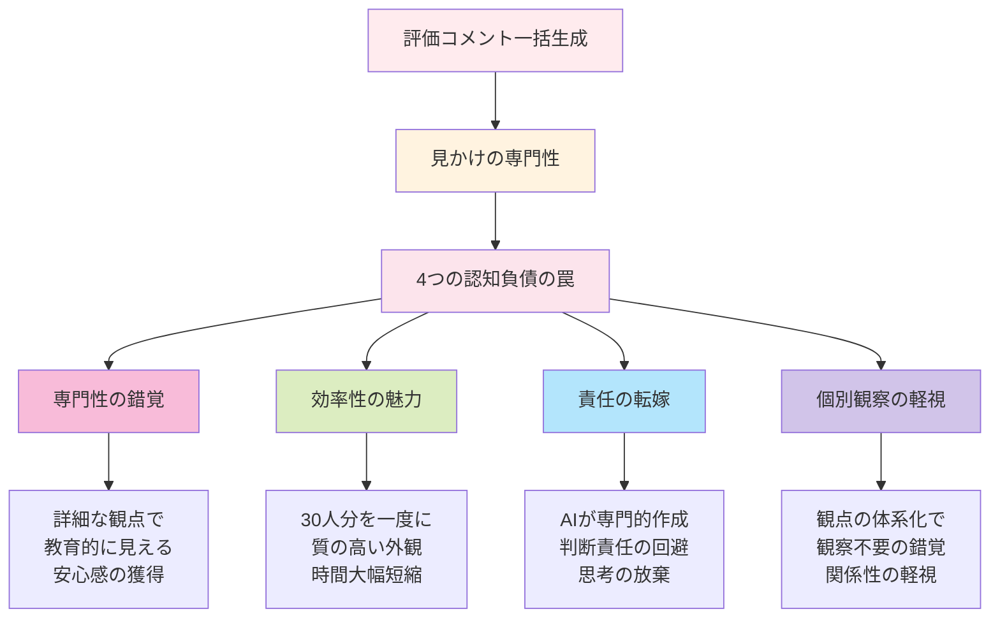
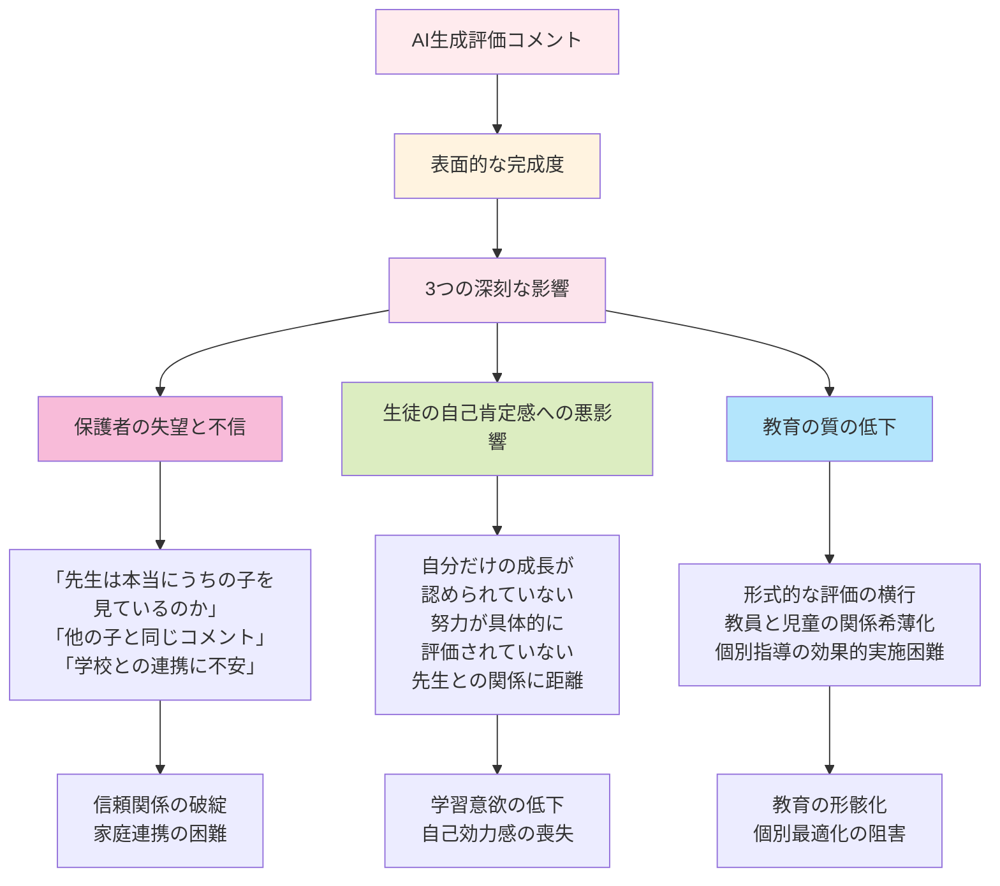
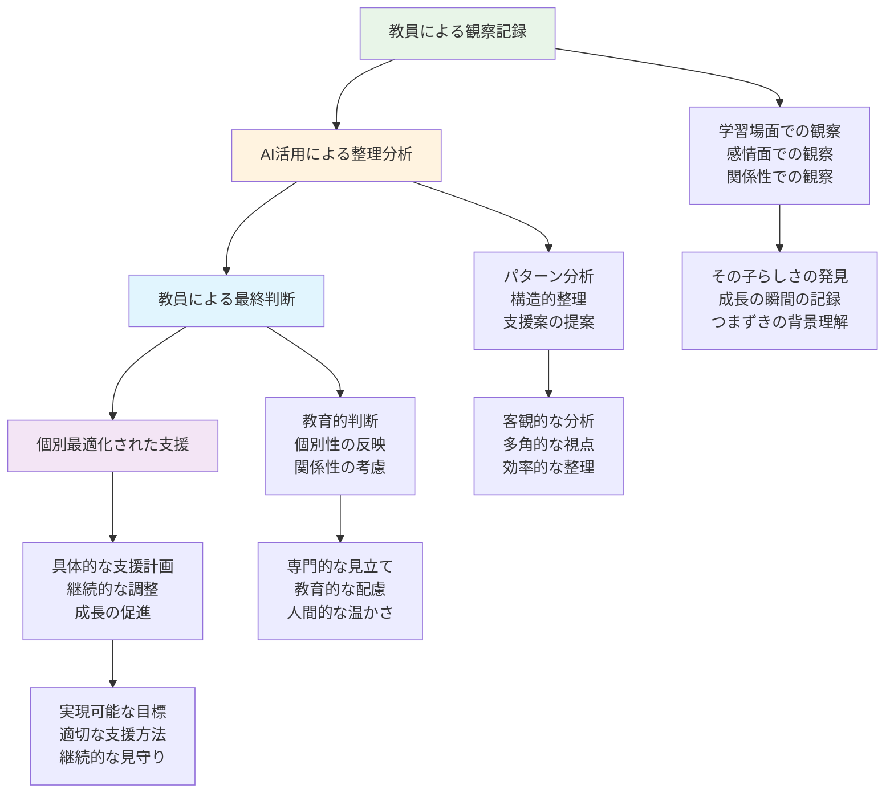

# 評価コメントの没個性化

## 一括生成がもたらす教育の形骸化

### 失敗事例6：評価コメントの一括生成

「通知表の季節がやってきました。30人分のコメントを書くのは大変です。」

こんな悩みを抱える教員に、生成AIは魅力的な解決策を提示します。しかし、以下のような依頼は教育の本質を根底から破壊する危険性を秘めています。

**問題のある使い方**
```
小学3年生30人分の通知表コメントを作成してください。

【条件】
- 各コメント80-100字程度
- 30人全員異なる内容で作成
- ポジティブで建設的な表現を使用
- 具体的な成長の様子や今後の課題を含める

【評価観点】（以下から各コメントに2-3つを組み合わせて使用）
■算数分野
- 計算力（基本的な四則演算の習得状況）
- 文章題（問題文の理解と解決過程）
- 図形理解（形の認識や作図能力）

■国語分野  
- 読解力（文章内容の理解度）
- 作文力（文章構成や表現力）
- 漢字学習（読み書きの定着度）

■生活態度
- 協調性（友達との関わり方）
- 積極性（授業参加や発表の様子）
- 責任感（係活動や宿題への取り組み）

【出力形式】
番号、生徒名（仮名）、コメント内容の順で記載してください。

例：1. 田中太郎　算数では計算の正確性が向上し、特に掛け算九九をしっかりと覚えることが
できました。国語では物語文の読解において、登場人物の気持ちを考えながら読む力が身につい
てきています。今後は漢字の書き順により注意して練習しましょう。
```


**この依頼の根本的な問題**

1. **児童の個別情報が皆無**
   - 一人ひとりの学習状況が不明
   - 成長の過程や課題が見えない
   - 個性や特徴への言及なし

2. **観察記録の放棄**
   - 日々の授業での気づき
   - 友達との関わり方
   - 興味・関心の変化

3. **保護者との関係性軽視**
   - 家庭での様子との関連
   - 保護者の願いや心配事
   - 共に育てるパートナーシップの欠如

**なぜこのプロンプトが危険なのか**

このプロンプトは、詳細な評価観点と具体的な指示により一見「教育的」で「専門的」に見えます。しかし、これこそが教員を安心させ、深刻な認知負債（思考の外部委託による能力低下）を生み出す最大の罠です。



1. **専門性の錯覚**：評価観点が詳しく整理されているため、「これは教育的だ」と錯覚させる
2. **効率性の魅力**：30人分を一度に、しかも「質の高い」コメントで生成される魅力
3. **責任の転嫁**：「AIが専門的に作ってくれた」という安心感による思考の放棄
4. **個別観察の軽視**：観点が体系化されているため、実際の観察が不要に感じられる

### 失われる個別理解の深刻さ

**このプロンプトでAIが生成する典型例**
```
1. 田中太郎　算数では計算の正確性が向上し、とくに掛け算九九をしっかりと覚えることが
できました。国語では物語文の読解において、登場人物の気持ちを考えながら読む力が身に
ついてきています。今後は漢字の書き順により注意して練習しましょう。

2. 佐藤花子　図形の理解力が素晴らしく、コンパスや定規を使った作図も丁寧にできるように
なりました。協調性にも優れ、グループ活動では友達の意見をよく聞き、建設的な提案ができ
ています。作文力の向上を目指して、より豊かな表現を身につけていきましょう。

3. 山田次郎　文章題に対する取り組み姿勢が大変良好で、問題文を最後まで読み通す集中力が
身についています。責任感も強く、係活動では率先して取り組む姿が見られます。漢字学習に
より一層力を入れることで、さらなる成長が期待できます。
```

**これらのコメントの深刻な問題**

このプロンプトで生成されるコメントは、教育的に正しい表現を使いながら、実は教育の本質を完全に欠いています。

1. **巧妙な一般化**
   - 「計算の正確性が向上」「九九をしっかり覚えた」など、どの子にも当てはまる抽象的表現
   - 「登場人物の気持ちを考えながら読む力」という学習指導要領的な文言
   - 具体的なエピソードやその子らしさがまったく見えない

2. **観察なき評価**
   - 評価観点は教育的に正しいが、実際の観察に基づいていない
   - 「建設的な提案ができています」などの根拠のない褒め言葉
   - 本当にその子を見て書いたのかが判断できない

3. **表面的な専門性**
   - 教育用語を使って専門的に見せかけている
   - しかし実際の成長過程や具体的な学習の様子は一切伝わらない
   - 保護者に「ちゃんと見てくれている」という錯覚を与える

4. **教員の責任放棄**
   - 「これで十分」と思わせる完成度の高さ
   - 個別観察や関係構築の必要性を感じさせない構造
   - 真の教育的責任を「効率化」の名の下に放棄

### 保護者・生徒への深刻な影響



**保護者の失望と不信**
- 「先生は本当にうちの子を見ているのか」
- 「他の子と同じようなコメントだ」
- 「学校との連携に不安を感じる」

**生徒の自己肯定感への悪影響**
- 自分だけの成長が認められていない
- 努力が具体的に評価されていない
- 先生との関係に距離を感じる

**教育の質の低下**
- 形式的な評価の横行
- 教員と児童の関係の希薄化
- 個別指導の効果的な実施困難

### 失敗事例7：採点基準の外部依存

**問題のある使い方**
```
小学4年生の理科テスト「電気の働き（乾電池、豆電球、導体・絶縁体）」の採点基準を
作成してください。

【テスト構成】
- 全10問、100点満点
- 選択問題：7問
- 記述問題：3問

【単元内容】
電気の働き（乾電池、豆電球、導体・絶縁体）
- 乾電池の向きと電流の流れ
- 豆電球の明るさと乾電池の数・つなぎ方
- 直列つなぎと並列つなぎの違い
- 導体と絶縁体の性質
- 身の回りの導体・絶縁体の判別
- 安全な電気の使い方

【作成する採点基準の内容】
1. 各問題の配点（選択問題と記述問題のバランスを考慮）
2. 選択問題の正答
3. 記述問題の採点基準（部分点の設定を含む）
4. 評価段階の設定（90点以上A、80-89点B、70-79点C、60-69点D、59点以下E）

【記述問題の採点基準で含めてほしい要素】
- 完全解答の条件（満点を与える条件）
- 部分点を与える条件（2点刻みまたは3点刻みで設定）
- 重要キーワード（「電流」「回路」「導体」「絶縁体」等）の扱い
- 図や実験結果の説明を含む場合の評価方法
- よくある誤答例とその点数

【出力形式】
| 問題番号 | 問題内容 | 配点 | 採点基準 | 備考 |
|---------|---------|------|---------|------|

【追加要望】
- 小学4年生の学習指導要領に準拠した内容
- 実験観察の技能と科学的思考力を評価できる問題構成
- 実際の授業で使いやすい明確で具体的な採点基準
- 児童の理解度を適切に測定できる配点設定
```

**欠けている重要な視点**

1. **実際の指導過程の反映**
   - どの実験で子どもたちが興奮していたか
   - 導体・絶縁体の実験でどんな発見があったか
   - 回路作りでつまずいた子が多かった部分はどこか
   - 豆電球が点いた瞬間の子どもたちの表情

2. **一人ひとりの理解状況**
   - Aくんは図で説明するのが得意だが文字で書くのが苦手
   - Bさんは実験は上手だが理論的説明に課題がある
   - Cくんは安全面への配慮が不十分で指導が必要
   - 特別支援が必要な子への評価上の配慮

3. **教員の教育的判断**
   - この単元でとくに重視した学習内容
   - 子どもたちに身につけてほしい科学的思考
   - 実験技能と概念理解のバランス
   - 次の単元「電磁石」への橋渡しとして重要な要素

4. **クラス全体の学習状況**
   - 実験に対する興味・関心の高さ
   - 協働的な学習での成果
   - 安全に実験に取り組む態度の育成状況
   - 予想→実験→結果→考察の科学的プロセスの定着度

## 評価の本質を守るAI活用

では、どのように活用すれば認知負債を防ぎながら効率的に評価業務を行えるのでしょうか。

### 観察記録を基にした個別化コメント作成

**ステップ1：教員による日常観察記録**
```
観察記録例（田中太郎くん）：
・算数：九九はほぼ完璧。文章題で「何を求めるのか」の理解に時間がかかることが多い
・10月15日：文章題で図を描いて考える方法を教えたところ、目を輝かせて取り組んだ
・友達関係：グループ活動では聞き役に回ることが多いが、発言する時は的確
・11月2日：体育祭の準備で、黙々と作業する姿が印象的だった
・保護者より：家でも図を描いて算数をやっているとの報告
```

**ステップ2：AIによる構成支援**
```
教員からAIへの依頼：
【保護者向け評価コメント作成支援】

以下の観察記録をもとに、保護者にとって分かりやすく、建設的な評価コメントを作成してください。

【観察記録】
（ここに具体的な観察記録を記載）

【対象児童について】
- 年齢・学年：
- 特記事項（発達の特性、家庭環境で配慮すべき点など）：

【求める構成】
1. **成長したポイント**
   - 具体的な行動や変化を挙げ、ポジティブな表現で記述
   - 保護者が子どもの努力を認められる内容

2. **現在の課題**
   - 改善の余地がある点を、批判的でなく発達的な視点で表現
   - 「〜ができていない」ではなく「〜に取り組んでいる」などの前向きな表現を使用

3. **今後の支援方針**
   - 学校での取り組み
   - 家庭でできる具体的なサポート方法
   - 短期目標（1-3ヶ月程度）

【文体・配慮事項】
- 保護者に寄り添う温かい文体
- 専門用語は避け、分かりやすい表現を使用
- 子どもの個性や努力を尊重する姿勢
- 150-200字程度の簡潔な文章で各項目を記述
```

**ステップ3：教員による推敲と個性の追加**

実際の依頼例で年齢・学年と特記事項を含めた場合：

```
教員からAIへの依頼：
【保護者向け評価コメント作成支援】

以下の観察記録をもとに、保護者にとって分かりやすく、建設的な評価コメントを作成してください。

【観察記録】
・算数：九九はほぼ完璧。文章題で「何を求めるのか」の理解に時間がかかることが多い
・10月15日：文章題で図を描いて考える方法を教えたところ、目を輝かせて取り組んだ
・友達関係：グループ活動では聞き役に回ることが多いが、発言する時は的確
・11月2日：体育祭の準備で、黙々と作業する姿が印象的だった
・保護者より：家でも図を描いて算数をやっているとの報告

【対象児童について】
- 年齢・学年：小学3年生、9歳（4月生まれ）
- 特記事項：慎重で思慮深い性格。集中力が高く、一度興味を持つと粘り強く取り組む。
  新しいことに挑戦する際は時間をかけて理解しようとする傾向がある。
  家庭では算数を楽しんで取り組んでおり、保護者も学習に協力的。

【求める構成】
1. 成長したポイント
2. 現在の課題  
3. 今後の支援方針
```

**完成したコメント例**
```
【太郎くんの評価コメント】

## 1. 成長したポイント

太郎くんは持前の集中力と粘り強さを活かして、算数の基礎力をしっかりと身につけています。
九九がほぼ完璧にマスターできているのは、日頃の努力の成果です。特に素晴らしいのは、
10月に図を描いて考える方法をお教えした際の取り組み方でした。新しい解法に目を輝かせ、
積極的に挑戦する姿から、学ぶことへの意欲の高さを感じました。ご家庭でも図を使って算数
に取り組んでいるとのこと、学んだことを自分のものにしようとする前向きな姿勢が表れています。

友達関係においても、太郎くんらしい良さが発揮されています。グループ活動では聞き役に
回ることが多いものの、発言する時は的確で、周りの意見をしっかり聞いた上で自分の考えを
伝えられています。体育祭の準備では黙々と作業に集中する姿が印象的で、責任感の強さと
集中力の高さを改めて感じました。

## 2. 現在の課題

算数の文章題において、「何を求めるのか」を読み取ることに時間を要する場面が見られます。
太郎くんの慎重な性格ゆえ、問題文を丁寧に読もうとするのですが、情報を整理して問題の核心
を掴むことに少し苦手意識があるようです。これは決して理解力の問題ではなく、文章から
必要な情報を抜き出して整理するコツを身につけることで改善できると考えています。

## 3. 今後の支援方針

文章題については、引き続き図を描いて考える方法を活用しながら、問題文の重要な部分に線を
引いたり、分からない言葉を確認したりする習慣を身につけられるよう支援していきます。
太郎くんが既に図を描く方法を楽しんで取り組んでいることから、この方法を軸により効果的な
問題の読み取り方をお教えしていく予定です。

友達関係については、太郎くんの聞く力と的確な判断力は素晴らしい長所です。今後は自信を
持って発言できる機会を意識的に作り、持っている力をより発揮できるよう見守っていきます。

ご家庭での学習への取り組みにも感謝しております。引き続き太郎くんの「なぜだろう？」と
いう疑問を大切にしていただき、一緒に考える時間を持っていただければと思います。
```

### 評価業務での適切なAI活用原則

**原則1：観察が先、AI支援が後**
- 必ず自分の観察記録を基にする
- AIには構成や表現の支援を求める
- 最終的な文章は教員が責任を持つ

**原則2：個別性を最優先**
- 一人ひとり異なる記録を基にする
- その子らしい具体的なエピソードを含む
- 成長の証拠を明確に示す

**原則3：教育的意図を明確に**
- 何を評価したいのかを明確にする
- 今後の指導方針と連動させる
- 保護者との連携を意識する

# 個別指導の画一化リスク

## 記録と分析の外部化問題

### 失敗事例8：生徒指導記録の定型化

**問題のある使い方**
```
「中学校教員向けの不登校傾向生徒への指導記録テンプレートを作成してください。

**生徒情報：**
- 中学2年生男子
- 10月から欠席日数が増加傾向（具体的な欠席パターンや頻度があれば記載）
- 保護者は状況を心配し、学校との連携を希望

**記録に含めるべき要素：**
- 現状の客観的な記録（出席状況、学習面、交友関係等）
- 保護者との面談内容
- 本人との面談や観察記録
- 今後の支援方針と具体的なアプローチ案
- 関係者（スクールカウンセラー、管理職等）との連携計画
- 経過観察のポイント

**注意事項：**
- プライバシーに配慮した記録方法
- 客観的で建設的な表現の使用
- 生徒の強みや可能性にも言及
- 段階的な支援計画の提示

このような形式で、教育現場で実際に活用できる指導記録の作成をお願いします。」

**主な改善点：**
1. **目的の明確化** - 「指導記録テンプレート」として具体的な成果物を指定
2. **構造化** - 情報を整理し、求める要素を明確に列挙
3. **専門性の考慮** - 教育現場の実情に即した要素を追加
4. **配慮事項の明示** - プライバシーや表現方法について言及
5. **実用性の向上** - 実際の現場で使える形式であることを強調
```

**この依頼の深刻な問題**

このプロンプトは専門的で配慮が行き届いているように見えますが、実は生徒指導のもっとも重要な要素を完全に無視しています。

1. **個別の背景・文脈の完全無視**
   - この生徒がなぜ10月から欠席が増えたのか（きっかけとなった出来事、変化）
   - これまでの学校生活での輝いていた瞬間や得意分野
   - 家庭環境の変化や特別な事情
   - 友人関係での具体的な出来事や変化
   - 学習面での躓きや成功体験

2. **生徒との関係性の軽視**
   - 担任としてこれまで築いてきた信頼関係
   - 生徒が心を開いて話してくれた内容
   - 日常的な会話から感じ取った生徒の心境
   - 生徒が示す小さなサインや変化への気づき
   - 過去の指導経験での効果的だったアプローチ

3. **教育的判断の放棄**
   - この生徒にとってもっとも重要な支援は何か
   - どのタイミングでどのようなアプローチが効果的か
   - 生徒の尊厳と自尊心を守りながらの支援方法
   - 短期的な目標と長期的な成長への見通し
   - 保護者や他の教職員との連携における優先順位

4. **テンプレート化による人間性の排除**
   - 一人ひとり異なる不登校の背景や原因
   - その生徒らしい表現方法や思考パターン
   - 生徒が安心できる環境や関わり方
   - 回復への個別のペースと段階
   - 生徒自身の意思や希望の尊重

### 失敗事例9：個別指導計画の自動化

**問題のある使い方**
```
特別支援を要する小学5年生の個別指導計画（Individual Education Plan）を作成してください。

**児童の基本情報：**
- 小学5年生
- 主な課題：算数と国語の学習面
- 特別支援教育の対象児童

**個別指導計画に含めるべき項目：**

1. **現状把握**
   - 算数・国語の具体的な困難点と現在の到達レベル
   - 認知特性や学習スタイルの分析
   - 得意分野・強みの把握

2. **長期目標・短期目標**
   - 1年間の到達目標（長期目標）
   - 3ヶ月単位の短期目標
   - 評価可能な具体的指標の設定

3. **指導方法・支援策**
   - 算数：具体的な指導アプローチと教材・教具
   - 国語：読解・表現力向上のための具体的手法
   - ユニバーサルデザインを意識した配慮事項
   - ICT活用の可能性

4. **評価・記録方法**
   - 進捗確認の頻度と方法
   - 評価基準と記録様式

5. **連携体制**
   - 通常学級担任との連携方法
   - 保護者との情報共有計画
   - 専門機関（SC、特別支援コーディネーター等）との連携

**作成時の留意点：**
- 児童の人権と尊厳を最優先
- 実現可能で段階的な計画
- 定期的な見直しが可能な柔軟性
- エビデンスに基づいた指導方法の選択

このような観点から、実際の特別支援教育現場で活用できる個別指導計画の作成をお願いします。」

**主な改善点：**

1. **専門用語の明確化** - 「Individual Education Plan」として正式名称を併記
2. **具体性の向上** - 各教科の困難点を具体的に分析する項目を追加
3. **構造的な整理** - 計画に必要な要素を体系的に分類
4. **評価システム** - 計画の効果測定方法を明示
5. **多職種連携** - 特別支援教育に関わる関係者との連携を重視
6. **人権配慮** - 児童の尊厳と権利保護の観点を明記
7. **実用性の担保** - 実際の教育現場で運用可能な計画であることを強調
```

**失われる重要な視点**

1. **その子の生きた姿の把握**
   - 朝の教室での表情や様子
   - 友達とのやりとりでの反応
   - 好きな遊びや興味を示す瞬間
   - 困った時に見せる行動パターン
   - 嬉しい時、悔しい時の表現方法

2. **学習場面での具体的な観察**
   - 算数の計算でどこでつまずくのか（繰り上がり、位取り、文章理解）
   - 国語の音読で苦手な音や文字パターン
   - 集中できる時間と疲れるタイミング
   - 理解した時の「あ！」という瞬間の表情
   - 支援を求める時の態度やサイン

3. **日常生活での強みと課題**
   - 給食時間や清掃時間での行動特性
   - 係活動や当番活動での取り組み方
   - 体育や音楽、図工など他教科での輝き
   - 休み時間の過ごし方と友達との関わり
   - 保健室や相談室での様子

4. **家庭環境と保護者の思い**
   - 家庭での学習習慣や困りごと
   - 保護者が感じている子どもの変化
   - 家族の教育観や支援への期待
   - 医療機関での診断や指導の内容
   - きょうだい関係や家族構成での配慮事項

5. **これまでの指導経験と効果**
   - 過去に効果的だった支援方法
   - 失敗した指導とその要因分析
   - 子どもが安心する教員の関わり方
   - 成功体験を積めた活動や場面
   - 他の教職員との連携で見えた子どもの姿

### 失敗事例10：成績分析の委任

**問題のある使い方**
```
「小学校5年生算数テスト『図形の面積』の結果分析と指導改善提案を作成してください。

**テスト基本情報：**
- 対象：小学5年生
- 受験者数：30名
- テスト内容：図形の面積（正方形、長方形、平行四辺形、三角形、台形の面積）
- 実施時期：○月○日
- 満点：100点

**結果データ：**
- 平均点：65点
- 最高点：90点  
- 最低点：30点
- 得点分布：できれば10点刻みでの人数分布
- 問題別正答率：各図形・問題形式別の正答率データ（あれば）

**分析してほしい観点：**

1. **統計的分析**
   - 得点分布の特徴（正規分布か、二極化など）
   - 標準偏差による散らばりの評価
   - 到達度別グループ分け（上位・中位・下位層）

2. **図形の面積に関する習得状況**
   - **図形別習得度**：正方形・長方形→平行四辺形→三角形→台形の理解度
   - **公式の定着**：各図形の面積公式の記憶と適用
   - **概念理解**：面積の意味、単位換算の理解
   - **応用力**：複合図形、文章題での活用
   - **計算技能**：小数・分数を含む面積計算の正確性
   - **図形認識**：形の特徴把握、高さや底辺の正しい認識

3. **つまずきパターンの分析**
   - 公式の混同（特に平行四辺形と三角形）
   - 高さの概念理解不足
   - 単位の取り扱いミス
   - 複合図形での考え方の困難
   - 文章から図形をイメージする力の不足

4. **発達段階を考慮した指導改善策**
   - **操作活動**：方眼紙、色紙を使った面積の体感
   - **視覚的理解**：図形の変形・分割による面積保存の理解
   - **段階的指導**：基本図形→複合図形→実生活での応用
   - **公式の導出過程**：暗記ではなく理解に基づく公式習得
   - **ICT活用**：動的な図形ソフトでの面積変化の観察

5. **習熟度別指導計画**
   - **上位層**：複合図形、発展問題への挑戦
   - **中位層**：基本公式の確実な定着と応用
   - **下位層**：具体物操作による面積概念の再構築

6. **評価・確認方法**
   - 形成的評価による理解度チェック
   - 次回テストでの改善確認項目
   - 実生活場面での活用評価

**成果物の形式：**
- 図形の面積学習に特化した分析レポート
- 操作活動を含む具体的指導案
- 習熟度別の教材・問題例
- 家庭学習での面積感覚育成方法

このような観点から、小学5年生の『図形の面積』学習に特化した、教育現場で実際に活用できる分析と指導改善提案の作成をお願いします。」

**図形の面積に特化した改善点：**

1. **学習内容の具体化** - 5年生で学習する各図形（正方形、長方形、平行四辺形、三角形、台形）を明記
2. **特有のつまずき分析** - 面積学習でよく見られる混同や概念理解不足を具体的に列挙
3. **操作活動の重視** - 面積概念は視覚的・体感的理解が重要であることを強調
4. **段階的習得** - 基本図形から複合図形への発展的学習を考慮
5. **実生活との関連** - 面積は日常生活と密接に関わる概念であることを重視
```

**データの裏にある重要な情報の無視**

1. **授業での生きた学習過程**
   - 方眼紙で面積を数えた時の子どもたちの反応と発見
   - 平行四辺形の公式を導出した時の「あ！」という気づきの瞬間
   - 三角形の面積で「なぜ2で割るの？」と質問してきた子の思考過程
   - 台形の公式で混乱していた子が理解できた瞬間のエピソード
   - 複合図形で自分なりの解き方を見つけた子の創意工夫

2. **一人ひとりの学習特性と背景**
   - Aくんは計算は得意だが図形をイメージするのが苦手
   - Bさんは図で考えるのは上手だが公式を覚えるのに時間がかかる  
   - Cくんは家で工作が好きで面積への興味が高い
   - Dさんは算数に苦手意識があり、面積の学習に不安を抱えている
   - 特別支援を要するE君への個別配慮と効果的だった支援方法

3. **授業中の具体的な観察記録**
   - 長方形の面積で「たて×よこ」を忘れて足し算していた子の誤解
   - 平行四辺形で斜めの辺を使って計算していた子の思考パターン
   - 三角形の高さを理解するのに時間がかかった子への説明方法
   - 台形の公式を覚えるために自分なりの覚え方を考えた子のアイデア
   - 文章題で図を描いて考えるようになった子の成長過程

4. **クラス全体の学習雰囲気と関係性**
   - 図形の面積学習への興味・関心の高さ
   - 友達同士で教え合う場面での協働的な学び
   - 操作活動での積極性や集中度
   - 間違いを恐れずに発言できる学級の雰囲気
   - 家庭での保護者の関心度と学習サポートの状況

5. **教員の指導意図と教育的配慮**
   - なぜこの順序で図形の面積を指導したのか
   - 操作活動と抽象的理解のバランスをどう考えたか
   - 個別支援が必要な子への配慮をどう計画したか
   - 次の単元「体積」への橋渡しとして何を重視したか
   - 実生活との関連をどのような場面で意識させたか

## 個別最適化を実現する使い方

これまで見てきた失敗事例で明らかになったのは、AIが見落とす「観察の厚み」「関係性の文脈」「成長の物語」こそが、真の個別最適化には不可欠だということです。では、これらの重要な要素を活かしながら、AIの力も借りる方法はないのでしょうか。

### 教員の観察力を軸にしたAI活用

以下のような段階的なプロセスが効果的です。



#### ステップ1：教員による丁寧な観察と記録

まず、教員自身が以下の観点で継続的に観察を行います。

**学習場面での観察**
- どんな場面で躓くのか（計算の種類、文章の長さ、グループの人数など）
- 理解に向かう際の独特な手順や方法
- 集中力の波やタイミング
- 他の子との関わり方の特徴

**感情面での観察**
- 挑戦する場面での表情や態度
- 失敗した時の反応パターン
- 励ましに対する反応
- 達成感を示す瞬間

**関係性での観察**
- 誰といる時に力を発揮するか
- どんな役割を好むか
- 支援を求める相手やタイミング
- 他者への配慮の表れ方

#### ステップ2：観察記録の整理にAIを活用

教員が記録した観察メモを、AIに以下のような形で整理・分析してもらいます。

**良い活用例**
```
以下は、田中太郎君（小学3年生）の2か月間の学習観察記録です。
この記録から、彼の学習特性や支援のポイントを整理し、
個別指導計画の素案を作成してください。

【算数の様子】
・10月5日：掛け算の筆算で、繰り上がりの計算は正確だが、
  途中式を書かずに暗算で済ませようとして間違える
・10月12日：文章題では図を描きながら考えている。
  「りんごが3個ずつ入った箱が4つ」を○を使って表現
・10月19日：九九カードでは8の段が不安定。特に8×7、8×6を間違えやすい
・11月2日：分数の導入で、ピザの絵を使った説明に強い関心。
  「1/4は4人で分けるってこと？」と質問

【国語の様子】
・10月8日：音読では、文の区切りは適切だが、
  感情を込めて読むことが苦手。物語の気持ちの変化に気づいていない
・10月15日：作文では短い文を連続させる傾向。
  「楽しかった。面白かった。また行きたい。」といった表現
・11月1日：漢字練習では、部首に注目して覚えようとしている。
  「木へんの漢字は木に関係がある」と発見して喜んでいた

【対人関係の様子】
・10月10日：グループワークでは自分から発言しないが、
  友達の意見をしっかり聞いている。「それいいね」とうなずく場面多い
・10月24日：困っている友達がいると、そっと寄り添って
  「大丈夫？」と声をかける優しさ
・11月5日：発表は苦手だが、小さなグループ（3人程度）では
  自分の考えを話すことができる

【家庭での様子（保護者からの情報）】
・宿題は素直に取り組むが、分からない問題があっても
  すぐに「分からない」と言わず、一人で悩んでしまう
・算数に対して「僕は計算が遅い」と言うことがある
・読書は好きで、図鑑や科学の本をよく読んでいる

これらの観察を基に、田中君の個別指導計画を作成してください。
```

**AIの分析例**
```
# 田中太郎君 個別指導計画（素案）

## 1. 学習者の特性分析

### 【強み・リソース】
- **視覚的理解力**: 図やイラストを使った説明に強い関心と理解を示す
- **論理的思考力**: 部首の規則性に気づくなど、パターンを見つける力がある
- **協調性**: 友達の意見を聞き、困っている人に寄り添う優しさがある
- **学習への意欲**: 宿題に素直に取り組み、読書習慣がある
- **探究心**: 図鑑や科学の本を好むなど、知的好奇心が旺盛

### 【課題・ニーズ】
- **計算プロセスの可視化**: 暗算に頼りがちで途中式を省略してしまう
- **九九の定着**: 特に8の段（8×7、8×6）が不安定
- **表現力の向上**: 作文で短文の羅列、音読での感情表現が課題
- **自己効力感**: 「計算が遅い」という否定的な自己認識
- **援助要請**: 困ったときに「分からない」と言えない

## 2. 指導目標

### 【短期目標（3か月）】
1. 掛け算の筆算で途中式を書く習慣をつける
2. 8の段の九九を確実に習得する
3. 作文で接続詞を使った文章構成ができる
4. 分からない時に「教えて」と言える環境作り

### 【中期目標（6か月）】
1. 算数の計算に対する自信を回復する
2. 物語文の登場人物の気持ちを読み取れる
3. 小グループでの発表ができる

## 3. 具体的な支援方策

### 【算数指導】

#### 計算プロセスの定着
- **方法**: 「見える化シート」を活用し、途中式を書くことを習慣化
- **具体例**: 色分けされたマス目で、どこに何を書くかを明確化
- **頻度**: 毎回の算数時間で実践

#### 九九の強化
- **方法**: 8の段に特化したカード学習とリズム学習
- **具体例**: 「8×7=56（ごろ）」など語呂合わせを活用
- **評価**: 週1回の小テストで定着度確認

#### 視覚的教材の活用
- **方法**: 分数学習では具体物（ピザ、ケーキ等）を多用
- **効果**: 田中君の視覚的理解力を最大限活用

### 【国語指導】

#### 作文力向上
- **方法**: 「つなぎ言葉カード」を使った文章構成練習
- **段階**: ①だから ②それから ③しかし などを順次導入
- **実践**: 週1回の作文タイムで活用

#### 音読指導
- **方法**: 登場人物の気持ちを色分けして読む練習
- **具体例**: 嬉しい場面は青、悲しい場面は赤でマーキング
- **頻度**: 毎日の音読タイムで実施

#### 漢字学習
- **方法**: 田中君の発見した部首の規則性を活かした指導
- **展開**: 部首ごとのグループ学習を推進

### 【社会性・コミュニケーション支援】

#### 小グループ活動の活用
- **編成**: 3人程度の安心できるメンバー構成
- **役割**: 聞き上手な田中君の特性を活かした役割分担
- **目標**: 段階的に発言機会を増やす

#### 援助要請スキルの育成
- **方法**: 「ヘルプカード」システムの導入
- **運用**: 分からない時にカードを出すことから始める
- **環境**: 質問しやすい雰囲気作り

## 4. 家庭との連携

### 【保護者への提案】
1. **肯定的声かけ**: 「丁寧に考えているね」など過程を評価
2. **読書活動**: 図鑑好きを活かした算数・国語への展開
3. **質問タイム**: 家庭学習で分からない時の相談方法を確立

### 【情報共有】
- 月1回の面談で学校での様子を共有
- 連絡帳での日々の小さな成長を報告

## 5. 評価・見直し計画

### 【評価指標】
- 計算の正答率と途中式記述率
- 九九テストの結果
- 作文の文章構成力
- 援助要請行動の頻度

### 【見直し時期】
- 1か月後：短期的な効果を検証
- 3か月後：目標達成度の中間評価
- 6か月後：包括的な見直しと次期計画策定

## 6. 配慮事項

### 【個別配慮】
- 田中君のペースを尊重し、無理な発言を強要しない
- 視覚的教材を豊富に用意する
- 小さな成功体験を積み重ねる機会を意識的に設ける

### 【環境整備】
- 安心して質問できる雰囲気作り
- 友達との協働学習の機会を増やす
- 田中君の「聞き上手」という特性を集団に還元

---

**作成日**: 2025年7月14日  
**対象期間**: 2025年4月〜2025年6月  
**作成者**: 中田 寿穂 
**次回見直し予定**: 2025年12月中旬
```

#### ステップ3：教員による検証と修正

AIの分析を参考にしながら、教員が以下の観点で検証・修正を行います。

**検証のポイント**
- 観察の解釈は適切か
- 見落としている視点はないか
- 実現可能な支援方法か
- 子どもの尊厳を大切にしているか

**修正の例**
```
AIの提案を基に、以下のように修正：

×「計算のスピード向上」
○「計算の正確性を重視し、スピードは無理に求めない」
（子どもの「僕は計算が遅い」という不安に配慮）

×「感情表現の豊かさ」
○「自分なりの表現方法の発見と尊重」
（一律な感情表現を求めるのではなく、その子らしさを大切に）
```

#### ステップ4：継続的な観察と調整

支援を実施しながら、継続的に以下を行います。

**観察の継続**
- 支援の効果の確認
- 新たな特性や変化の発見
- 意外な強みや課題の発見

**計画の調整**
- 効果のない支援方法の変更
- 新たなニーズへの対応
- 成長に応じた目標の更新

### この方法の効果

**教員の専門性が活かされる点**
- 観察眼の向上
- 個別理解の深化
- 支援方法の創造的発見

**AIの力が活かされる点**
- 膨大な観察記録の整理
- 客観的な視点の提供
- 複数の支援選択肢の提示

**子どもにとっての利益**
- 深い理解に基づく支援
- 尊厳と個性の尊重
- 真の個別最適化の実現

### データ分析での適切なAI活用

先ほどの成績分析委任の例で見たように、テストの数値だけでは見えない重要な情報があります。以下のような方法で、データの背後にある生きた学習過程を大切にしながらAIを活用できます。

#### 授業記録と連動した分析

**教員からAIへの依頼例**
```
以下の図形の面積テスト結果と授業観察記録を統合して、
一人ひとりの理解状況と今後の支援方針を提案してください。

【テスト結果】
・田中太郎：78点（平行四辺形の問題で減点）
・佐藤花子：65点（文章題で困難）
・山田次郎：45点（基本的な公式の適用で間違い）

【授業での観察記録】
田中太郎：
・方眼紙での面積数えは得意だったが、公式への移行で混乱
・「なぜ高さを使うの？」と根本的な疑問を持っている
・友達に説明する時は分かりやすく話せる

佐藤花子：
・図形を見て面積を求めるのは上手
・文章から図をイメージするのに時間がかかる
・集中すると素晴らしい発想を見せる

山田次郎：
・公式を暗記しようとしているが混同している
・具体物での操作活動では理解を示している
・算数への苦手意識が強い

これらを踏まえて、3人それぞれの個別支援計画を提案してください。
```

このように、数値データと生きた観察記録を組み合わせることで、AIにも質の高い分析を期待できます。

## まとめ：評価と指導における認知負債の防止

この章では、評価・指導における5つの過ちを通じて、認知負債がいかに教育の本質を脅かすかを見てきました。

**共通する問題**
1. **個別性の軽視** - 一人ひとりの子どもが見えなくなる
2. **観察の放棄** - 表面的な情報だけで判断する
3. **関係性の無視** - 教育の人間的側面を軽視する
4. **成長の物語の断絶** - 継続的な理解を放棄する

**防止のための原則**
- 観察は教員にしかできない専門性
- AIは整理の道具であり、判断の主体ではない
- 子どもの尊厳と個性を最優先にする
- 効率化と深い理解は両立可能

**適切なAI活用の鍵**
- 豊富な観察記録の蓄積
- 具体的で文脈のある情報の提供
- AIの提案への批判的検討
- 継続的な調整と改善

次章では、生徒対応・コミュニケーションにおける落とし穴を見ていきます。人間関係の核心部分で、どのような認知負債が生まれているのでしょうか。